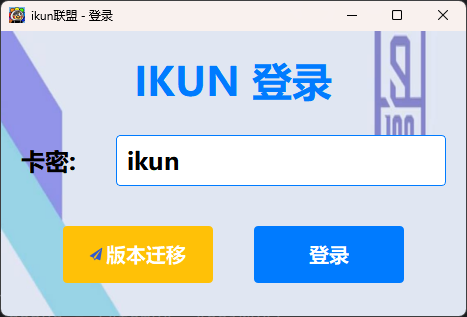
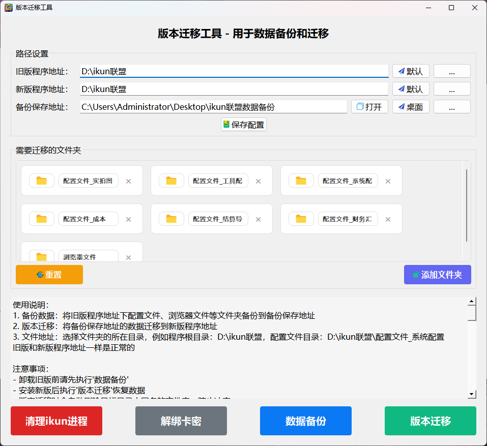
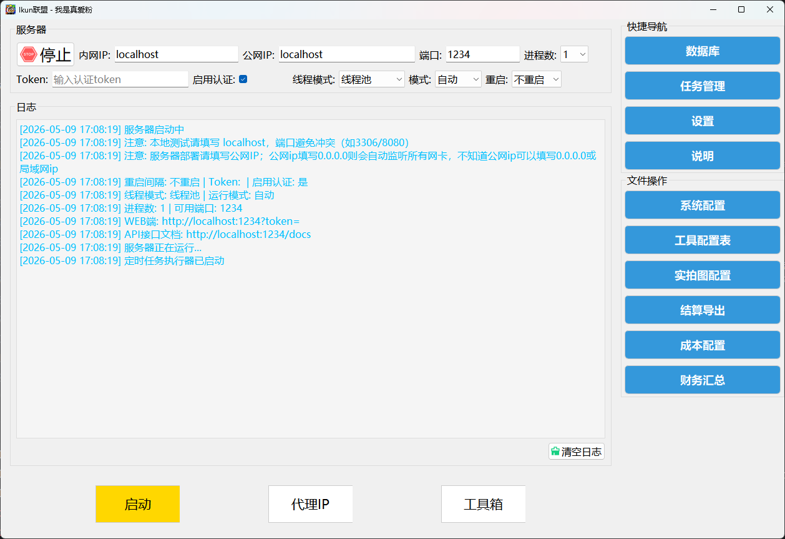
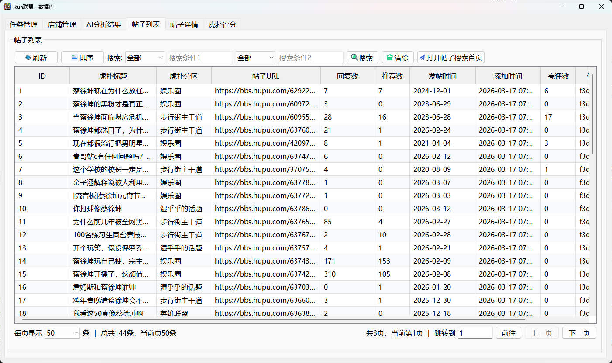
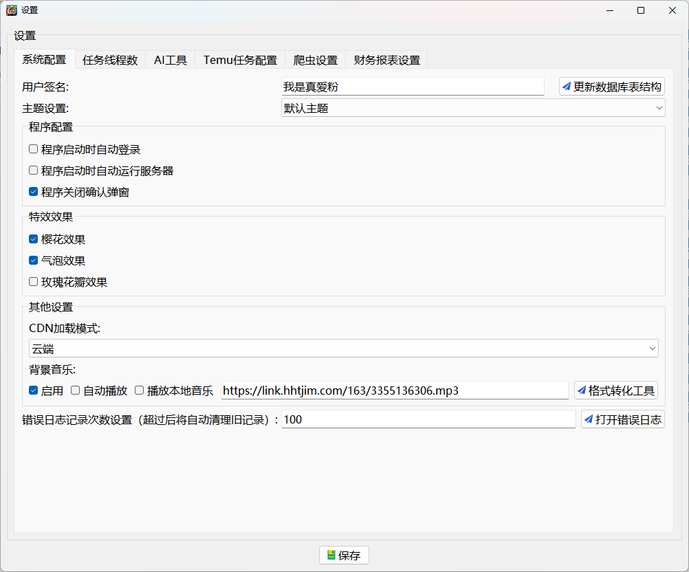
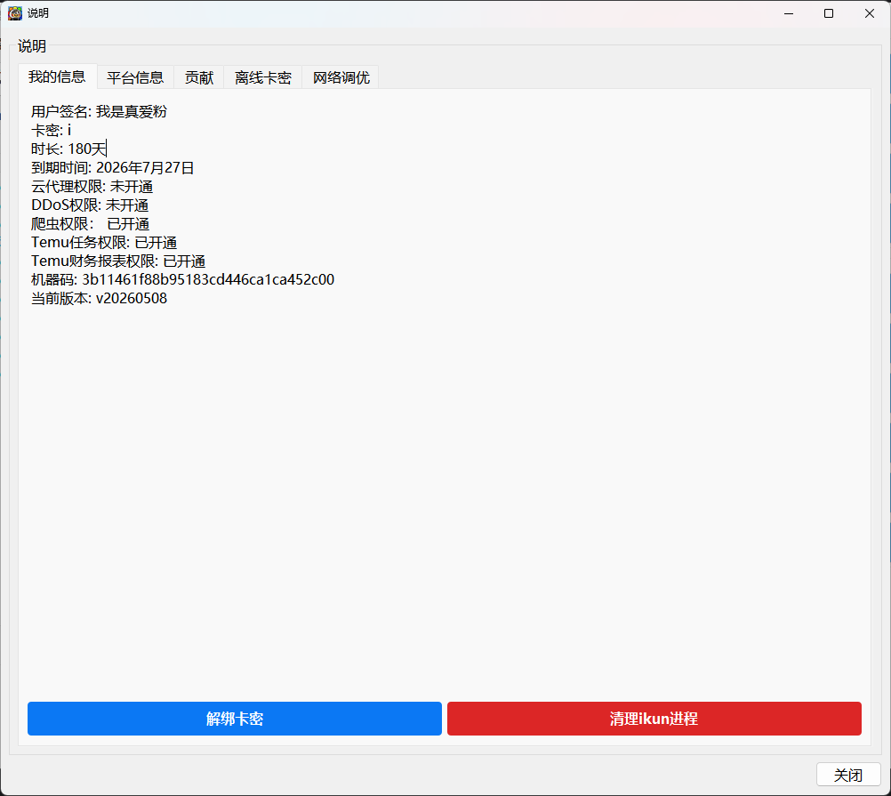
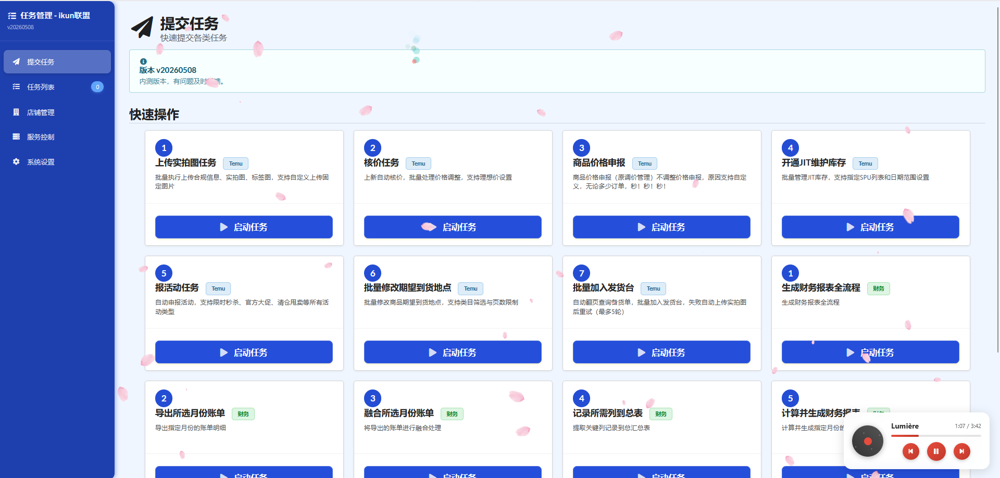
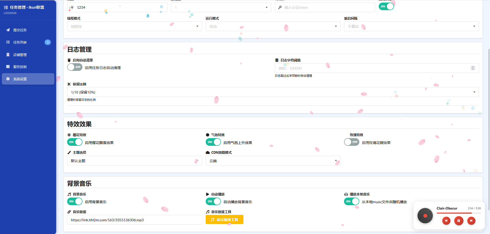
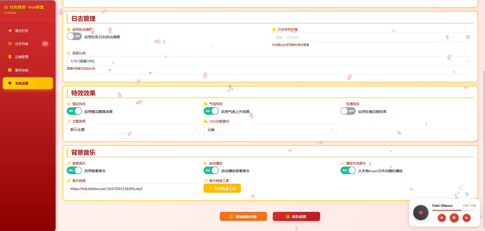
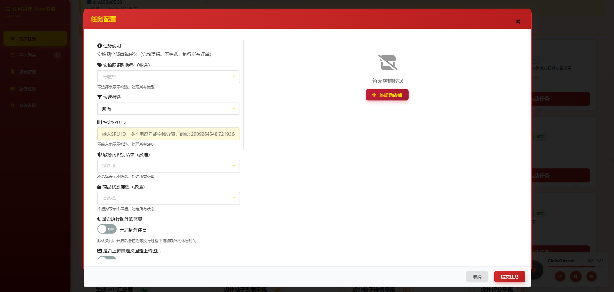

# temu-automation-toolkit 🚀

> 一个基于 Python 开发的通用桌面应用程序框架，集成电商自动化、数据爬取、财务管理等多功能模块。

[](https://www.python.org/)
[](LICENSE)
[](https://www.microsoft.com/windows)

---

## 📖 项目简介

**temu-automation-toolkit** 是一个功能完善的通用系统框架，集成了以下核心能力：

- **🛒 电商运营自动化**：Temu 商品价格管理、活动报名、期望到货地点设置、上传实拍图等
- **🕷️ 数据爬取框架**：提供代理管理、会话池、重试机制等爬虫基础设施，支持多平台扩展
- **💰 Temu 财务管理功能**：支持多月账单下载、合并、成本匹配、财务报表生成
- **🌐 本地 API 服务**：基于 FastAPI 的后端服务，支持多进程部署
- **🖥️ 图形用户界面**：基于 PyQt5 的桌面应用，提供直观的操作体验
- **⏰ 任务调度系统**：支持定时任务、多线程任务管理、任务队列等

---

## ✨ 主要特性

- 🔐 **权限控制系统** - 支持多种权限模式（temu、caiwu、spider、ddos）
- 🗄️ **双数据库支持** - SQLite 双数据库架构（ikun.db + hupu.db）
- 🔄 **异步任务处理** - asyncio + qasync 混合异步模型
- 📊 **可视化任务管理** - 基于 Web 的任务管理界面
- 🛡️ **全局异常处理** - 统一异常捕获与数据库安全关闭
- 📝 **完善日志系统** - loguru 日志框架，支持多级日志记录
- 🎨 **现代化 UI** - PyQt5 + Semantic UI 双界面支持
- 📦 **一键打包部署** - Nuitka 打包脚本支持

---

## 🚀 快速开始

### 系统要求

| 项目 | 要求 |
|------|------|
| **操作系统** | Windows 10/11 |
| **Python 版本** | 3.12.10（兼容 3.11 - 3.12） |
| **内存** | 4GB 以上 |
| **磁盘空间** | 至少 2GB 可用空间 |

### 安装指南

#### 1. 克隆仓库

```bash
git clone git@github.com:boltspectre/temu-automation-toolkit.git
cd temu-automation-toolkit
```

#### 2. 下载浏览器文件

Temu 自动登录功能需要浏览器文件支持，请按以下步骤操作：

1. **下载浏览器文件**：
   - 下载地址：[天翼云盘](https://cloud.189.cn/web/share?code=zeEB3yn6ZjMb)
   - 访问码：`mig6`

2. **解压并放置**：
   - 下载完成后解压压缩包
   - 将解压后的 `浏览器文件` 文件夹移动到项目根目录
   - 最终目录结构应为：
     ```
     temu-automation-toolkit/
     ├── 浏览器文件/          # 浏览器文件目录
     │   └── ...
     ├── main.py
     ├── requirements.txt
     └── ...
     ```

> ⚠️ **注意**：如果不放置浏览器文件，Temu 相关功能可能无法正常使用。

#### 3. 创建虚拟环境

```bash
python -m venv .venv
.venv\Scripts\activate.bat
```

或使用快捷脚本：
```bash
v.bat
```

#### 4. 安装依赖

**标准安装：**
```bash
pip install -r requirements.txt
```

**国内镜像源加速（推荐）：**
```bash
pip install -r requirements.txt -i https://pypi.tuna.tsinghua.edu.cn/simple
```

#### 5. 初始化配置

项目配置集中在 `配置文件_系统配置/` 目录下：

- **数据库配置**: `配置文件_系统配置/db_config.json` - SQLite 连接参数（WAL 模式、连接池等）
- **版本与代理配置**: `配置文件_系统配置/py_config_value.txt` - 端口、代理路径等

默认配置已内置，通常无需手动修改。

### 启动应用

#### 生产模式（推荐）🔒

生产模式下自动启用登录验证，提供更安全的用户体验：

```bash
start.bat
```

**生产模式行为**：
- 🔒 强制启用登录验证，无法绕过
- 🌐 需要真实卡密进行云端验证
- 🛡️ 关闭所有调试功能
- ✅ 登录成功后初始化数据库
- 💾 安全退出时关闭数据库并合并 WAL 文件

#### 开发模式 ⚡

编辑 `main.py` 修改配置：

```python
# 关闭打包模式
package_mode = 0
# 关闭任意卡密登录
any_kami_login = 0
# 关闭登录（跳过登录窗口）
login = 0
# 开启权限调试
project_debug = 1
# 自定义权限
code_project_mode_debug = ["temu", "caiwu", "spider"]
```

然后运行：
```bash
python main.py
```

#### 免密登录模式 🔓

编辑 `main.py`：

```python
package_mode = 0
any_kami_login = 1  # 开启免密登录
login = 1
project_debug = 1
code_project_mode_debug = ["temu", "caiwu", "spider"]
```

---


## 🖼️ 效果展示

### 登录页面



### 版本迁移



### 主页面



### 数据库管理



### 系统设置



### 帮助页面



### Web 管理界面



### 特效展示



### 新年主题



### 提交任务



---

## 📁 项目结构

```
temu-automation-toolkit/
├── main.py                    # 应用入口
├── api/                       # API 服务层
│   ├── server_api.py          # FastAPI 服务主文件
│   ├── proxy_api.py           # 代理 API
│   └── server_routes/         # 路由模块
│       ├── auth.py            # 认证路由
│       ├── task_routes.py     # 任务路由
│       ├── shop_routes.py     # 店铺路由
│       └── common_routes.py   # 通用路由
├── gui/                       # GUI 界面层
│   ├── MainApp.py             # 主应用窗口
│   ├── LoginPage.py           # 登录界面
│   ├── ServerPage.py          # 服务器页面
│   ├── ProxyPage.py           # 代理页面
│   └── ...
├── temu_modules/              # Temu 业务模块
│   ├── temu_func_wrapper.py   # 任务包装函数
│   └── temu_function/         # 核心功能实现
│       ├── modify_price.py    # 改价功能
│       ├── apply_activity.py  # 活动报名
│       ├── caiwu_func/        # 财务功能模块
│       └── ...
├── spider_modules/            # 爬虫模块
│   ├── hupu_spiders/          # 虎扑爬虫
│   ├── SpiderSession.py       # 会话管理
│   └── hupu_func_wrapper.py   # 爬虫任务包装
├── modules/                   # 核心工具模块
│   ├── classSQLite.py         # SQLite 封装
│   └── task_manager.py        # 任务管理器
├── config/                    # 配置模块
│   ├── common_config.py       # 全局配置
│   ├── py_config.py           # Python 配置
│   ├── permission_manager.py  # 权限管理
│   └── ...
├── static/                    # 静态资源
│   ├── css/                   # 样式文件
│   ├── js/                    # JavaScript 文件
│   └── vendor/                # 第三方库
├── templates/                 # HTML 模板
│   ├── index.html             # 主页面
│   └── log.html               # 日志页面
├── lite_modules/              # 轻量级工具模块
├── utils/                     # 工具函数
├── 配置文件_系统配置/          # 系统配置文件
├── 配置文件_实拍图配置/        # 实拍图配置
├── 配置文件_工具配置表/        # 工具配置表
├── 配置文件_成本/              # 成本配置
├── 配置文件_资源配置/          # 资源配置
├── 代码规范/                  # 代码规范文档
├── 使用技巧/                  # 使用技巧文档
├── requirements.txt           # 依赖列表
├── start.bat                  # 启动脚本
└── build.bat                  # 打包脚本
```

---

## ⚙️ 配置说明

### 数据库配置

配置文件：`配置文件_系统配置/db_config.json`

```json
{
  "database": {
    "timeout": 30,
    "wal_mode": true,
    "pool_size": 5
  }
}
```

### 代理配置

配置文件：`配置文件_系统配置/py_config_value.txt`

```
# API代理端口
api_proxy_port = 7899

# 代理配置文件路径
proxy_file_path = 配置文件_系统配置/proxy.txt
```

### 权限配置

支持以下权限模式：
- `temu` - Temu 电商功能
- `caiwu` - 财务管理功能
- `spider` - 数据爬取功能
- `ddos` - 压力测试功能

---

## 🛠️ 技术栈

| 类别 | 技术 |
|------|------|
| **编程语言** | Python 3.12+ |
| **GUI 框架** | PyQt5 |
| **Web 框架** | FastAPI + Uvicorn |
| **数据库** | SQLite (aiosqlite + sqlite3) |
| **异步编程** | asyncio + qasync |
| **日志管理** | loguru |
| **前端库** | Semantic UI + Font Awesome |
| **打包工具** | Nuitka |

---

## 📦 打包部署

### 打包模式选择

本项目支持两种打包模式，根据需求选择：

#### 模式一：卡密登录模式（正式版）🔐

适用于需要授权验证的商业部署场景。

**特点：**
- ✅ 完整的加密传输验证（AES-256-CBC + HMAC-SHA256）
- ✅ 支持在线/离线登录（卡密: `ikun`）
- ✅ 卡密有效期管理
- ✅ 设备绑定控制
- ✅ 防止中间人攻击和重放攻击

**打包方式：**
```bash
# 使用 build.bat 打包，默认启用卡密模式
build.bat
```

**相关文档：**
- [卡密加密系统说明](代码规范/卡密加密系统说明.md) - 详细加密机制说明
- [卡密加密测试工具](代码规范/kami_encryption_test.py) - 测试加密传输

#### 模式二：免密登录模式（测试版）🔓

适用于内部测试或开源场景，无需卡密即可登录。

**特点：**
- ✅ 无需卡密即可登录
- ✅ 直接进入主界面
- ✅ 适合开发和调试
- ⚠️ 无授权控制（不适合商业发布）

**启用方式：**

**方式1 - 修改 main.py：**
```python
# 在 main.py 中设置免密模式
package_mode = 0
any_kami_login = 1  # 开启免密登录
login = 1
project_debug = 1
code_project_mode_debug = ["temu", "caiwu", "spider"]
```

**方式2 - 通过 LoginPage 参数：**
```python
# 创建免密登录窗口
login_window = LoginWindow(any_kami_mode=True)
```

### 执行打包

使用 Nuitka 进行独立打包：

```bash
build.bat
```

打包选项：
- 支持选择是否显示控制台窗口
- 包含 PyQt5、FastAPI、Uvicorn 等依赖
- 生成独立可执行文件
- 根据选择的模式包含/排除卡密验证模块

---

## 📚 开发文档导航

项目提供了完善的技术文档体系，涵盖架构设计、API 接口、数据库设计、GUI 界面等方面：

### 项目概述与快速入门
- [项目概述](代码规范/系统说明文档md/项目概述.md) - 项目简介、架构概览、核心组件分析
- [快速开始](代码规范/系统说明文档md/快速开始.md) - 环境准备、依赖安装、应用启动指南
- [开发指南](代码规范/系统说明文档md/开发指南.md) - 开发规范、新功能开发流程、测试与质量保障

### 系统架构
- [系统架构](代码规范/系统说明文档md/系统架构/系统架构.md) - 整体架构设计
- [技术栈说明](代码规范/系统说明文档md/系统架构/技术栈说明.md) - 核心技术选型与依赖关系
- [数据流架构](代码规范/系统说明文档md/系统架构/数据流架构.md) - 数据流转与处理流程
- [设计模式应用](代码规范/系统说明文档md/系统架构/设计模式应用.md) - 设计模式在项目中的应用

### API 接口文档
- [API 接口文档](代码规范/系统说明文档md/API接口文档/API接口文档.md) - 接口总览
- [服务器接口](代码规范/系统说明文档md/API接口文档/服务器接口.md) - 服务器管理相关接口
- [任务接口](代码规范/系统说明文档md/API接口文档/任务接口.md) - 任务管理相关接口
- [店铺接口](代码规范/系统说明文档md/API接口文档/店铺接口.md) - 店铺管理相关接口
- [代理接口](代码规范/系统说明文档md/API接口文档/代理接口.md) - 代理服务相关接口
- [通用接口](代码规范/系统说明文档md/API接口文档/通用接口.md) - 通用工具接口

### 数据库设计
- [数据库设计](代码规范/系统说明文档md/数据库设计/数据库设计.md) - 数据库架构总览
- [表结构设计](代码规范/系统说明文档md/数据库设计/表结构设计/表结构设计.md) - 所有表结构定义
- [ikun 数据库表结构](代码规范/系统说明文档md/数据库设计/表结构设计/ikun数据库表结构/ikun数据库表结构.md) - 核心业务表
- [虎扑数据库表结构](代码规范/系统说明文档md/数据库设计/表结构设计/虎扑数据库表结构/虎扑数据库表结构.md) - 爬虫数据表
- [数据库初始化](代码规范/系统说明文档md/数据库设计/数据库初始化.md) - 数据库初始化流程

### 图形用户界面
- [图形用户界面](代码规范/系统说明文档md/图形用户界面/图形用户界面.md) - GUI 架构总览
- [主窗口框架](代码规范/系统说明文档md/图形用户界面/主窗口框架/主窗口框架.md) - 主窗口设计与事件处理
- [登录页面](代码规范/系统说明文档md/图形用户界面/登录页面.md) - 登录流程与权限验证
- [服务器页面](代码规范/系统说明文档md/图形用户界面/服务器页面.md) - 服务器管理界面
- [代理页面](代码规范/系统说明文档md/图形用户界面/代理页面.md) - 代理配置界面
- [工具页面](代码规范/系统说明文档md/图形用户界面/工具页面/工具页面.md) - 工具箱功能
- [数据库查看器](代码规范/系统说明文档md/图形用户界面/数据库查看器.md) - SQLite 数据库查看工具

### 配置管理
- [系统配置](代码规范/系统说明文档md/配置管理/系统配置.md) - 系统级配置说明
- [数据库配置](代码规范/系统说明文档md/配置管理/数据库配置/数据库配置.md) - 数据库连接与参数配置
- [文件配置](代码规范/系统说明文档md/配置管理/文件配置/文件配置.md) - 各类配置文件说明
- [权限配置](代码规范/系统说明文档md/配置管理/权限配置/权限配置.md) - 用户权限与认证机制

### 核心工具模块
- [API 管理器](代码规范/系统说明文档md/核心工具模块/API管理器.md) - API 服务管理
- [任务管理系统](代码规范/系统说明文档md/核心工具模块/任务管理系统.md) - 任务调度与执行
- [多线程日志管理器](代码规范/系统说明文档md/核心工具模块/多线程日志管理器.md) - 日志记录与管理
- [进程守护器](代码规范/系统说明文档md/核心工具模块/进程守护器.md) - 进程监控与重启

### 运维与部署
- [部署和运维](代码规范/系统说明文档md/部署和运维.md) - 部署流程与运维指南
- [故障排除和常见问题](代码规范/系统说明文档md/故障排除和常见问题.md) - 常见问题与解决方案
- [日志和监控](代码规范/系统说明文档md/日志和监控.md) - 日志管理与系统监控
- [权限控制系统](代码规范/系统说明文档md/权限控制系统.md) - 权限管理与安全控制

### 代码规范
- [代码规范](代码规范/代码规范.md) - 代码编写规范与最佳实践
- [添加新任务功能](代码规范/添加新任务功能.md) - 新任务开发指南

### 卡密加密系统
- [卡密加密系统说明](代码规范/卡密加密系统说明.md) - 数据传输加密机制详解
- [卡密加密测试工具](代码规范/kami_encryption_test.py) - 加密传输测试脚本

---

## 🐛 故障排除

### 常见问题

1. **数据库锁定问题**
   - 检查是否有其他进程占用数据库
   - 查看 WAL 文件是否正常合并

2. **端口占用问题**
   - 使用 `lite_modules/port_killer.py` 清理端口
   - 或修改 `py_config_value.txt` 中的端口配置

3. **依赖安装失败**
   - 尝试使用国内镜像源
   - 检查 Python 版本是否符合要求

### 日志查看

- 应用日志：`logs/` 目录
- 错误日志：`error/error.log`

---

## 🤝 贡献指南

欢迎提交 Issue 和 Pull Request！

1. Fork 本仓库
2. 创建特性分支 (`git checkout -b feature/AmazingFeature`)
3. 提交更改 (`git commit -m 'Add some AmazingFeature'`)
4. 推送到分支 (`git push origin feature/AmazingFeature`)
5. 创建 Pull Request

### 代码规范

- 所有 import 语句必须放在文件顶部
- 注释只标注关键部分，不要每一行代码都标注
- 优先复用现有函数，避免重复代码
- 修改代码后确保不影响其他功能正常使用

详细规范请参考 [代码规范/代码规范.md](代码规范/代码规范.md)

---

## 📄 许可证

本项目采用 [MIT](LICENSE) 许可证开源。

---

## 🙏 致谢

感谢所有为本项目做出贡献的开发者！

---

## 📞 联系方式

如有问题或建议，欢迎通过以下方式联系：

- 提交 [Issue](../../issues)
- Email: mlq5x47hf@mozmail.com
- Telegram: @unoass

---

<p align="center">Made with ❤️ by temu-automation-toolkit Team</p>
