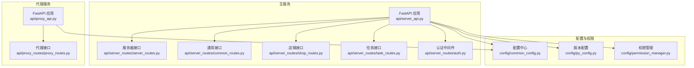
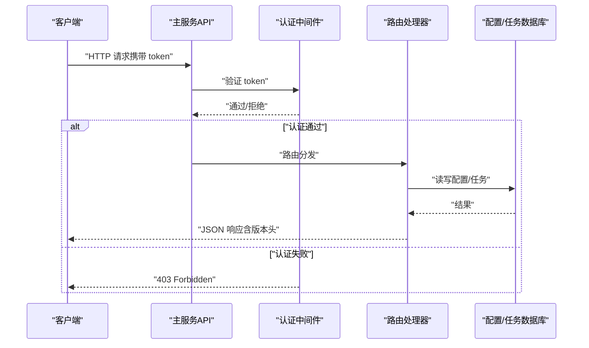
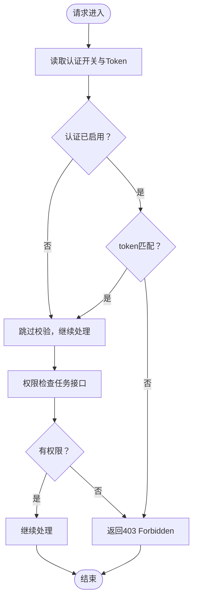
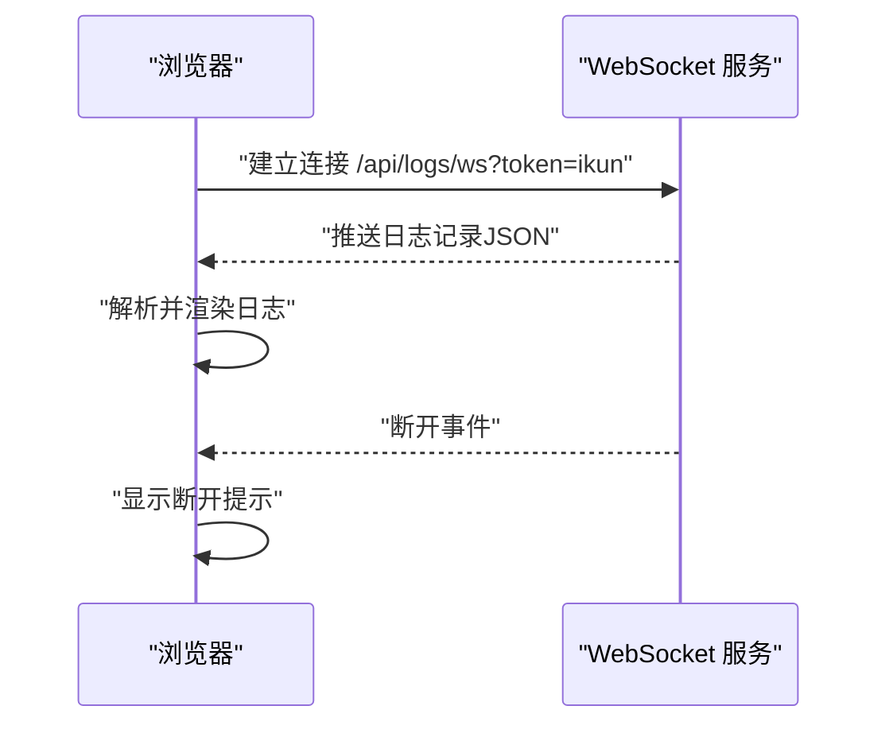
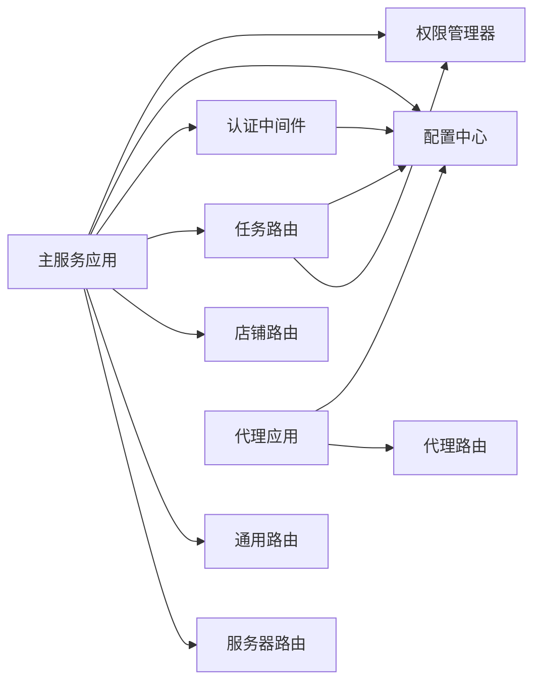

# API接口文档

<cite>
**本文档引用的文件**
- [api/server_api.py](file://api/server_api.py)
- [api/proxy_api.py](file://api/proxy_api.py)
- [api/server_routes/server_routes.py](file://api/server_routes/server_routes.py)
- [api/server_routes/auth.py](file://api/server_routes/auth.py)
- [api/server_routes/common_routes.py](file://api/server_routes/common_routes.py)
- [api/server_routes/shop_routes.py](file://api/server_routes/shop_routes.py)
- [api/server_routes/task_routes.py](file://api/server_routes/task_routes.py)
- [api/proxy_routes/proxy_routes.py](file://api/proxy_routes/proxy_routes.py)
- [config/common_config.py](file://config/common_config.py)
- [config/py_config.py](file://config/py_config.py)
- [config/permission_manager.py](file://config/permission_manager.py)
- [templates/log.html](file://templates/log.html)
- [static/js/main.js](file://static/js/main.js)
</cite>

## 目录
1. [简介](#简介)
2. [项目结构](#项目结构)
3. [核心组件](#核心组件)
4. [架构总览](#架构总览)
5. [详细组件分析](#详细组件分析)
6. [依赖关系分析](#依赖关系分析)
7. [性能考虑](#性能考虑)
8. [故障排查指南](#故障排查指南)
9. [结论](#结论)
10. [附录](#附录)

## 简介
本文件为 ikun_temu_system 的 API 接口文档，覆盖本地 FastAPI 服务的 RESTful 设计与实现细节，包括认证授权、权限控制、版本管理、接口规范、错误处理、性能与最佳实践、测试与调试方法，以及 WebSocket 日志查看协议说明。文档面向开发者与运维人员，帮助快速理解与集成系统 API。

## 项目结构
系统采用多进程多端口部署，分为“主服务”和“代理服务”，分别提供业务接口与代理管理能力；同时通过统一的配置中心与权限管理器实现集中化配置与权限校验。

**图表来源**
- [api/server_api.py:122-138](file://api/server_api.py#L122-L138)
- [api/proxy_api.py:21-34](file://api/proxy_api.py#L21-L34)
- [api/server_routes/server_routes.py:11-12](file://api/server_routes/server_routes.py#L11-L12)
- [api/server_routes/common_routes.py:12-13](file://api/server_routes/common_routes.py#L12-L13)
- [api/server_routes/shop_routes.py:16-17](file://api/server_routes/shop_routes.py#L16-L17)
- [api/server_routes/task_routes.py:26-27](file://api/server_routes/task_routes.py#L26-L27)
- [api/server_routes/auth.py:7-18](file://api/server_routes/auth.py#L7-L18)
- [config/common_config.py:201-220](file://config/common_config.py#L201-L220)
- [config/py_config.py:23-28](file://config/py_config.py#L23-L28)
- [config/permission_manager.py:12-126](file://config/permission_manager.py#L12-L126)

**章节来源**
- [api/server_api.py:122-138](file://api/server_api.py#L122-L138)
- [api/proxy_api.py:21-34](file://api/proxy_api.py#L21-L34)

## 核心组件
- 主服务 FastAPI 应用：负责业务接口注册、CORS、静态资源、模板、生命周期管理、多进程启动与健康控制。
- 代理服务 FastAPI 应用：负责代理 IP 列表接收、有效性测试、统计与随机代理获取。
- 认证中间件：基于配置的 Token 校验，支持按需启用。
- 权限管理器：基于数据库的权限持久化与检查。
- 配置中心：数据库驱动的配置读写与并发限制配置。
- WebSocket 日志：内置日志查看器，支持实时日志流订阅。

**章节来源**
- [api/server_api.py:60-104](file://api/server_api.py#L60-L104)
- [api/proxy_api.py:21-34](file://api/proxy_api.py#L21-L34)
- [api/server_routes/auth.py:7-18](file://api/server_routes/auth.py#L7-L18)
- [config/permission_manager.py:12-126](file://config/permission_manager.py#L12-L126)
- [config/common_config.py:148-153](file://config/common_config.py#L148-L153)
- [templates/log.html:30-50](file://templates/log.html#L30-L50)

## 架构总览
系统通过多进程启动多个主服务实例，每个实例绑定不同端口，实现横向扩展与高可用。代理服务独立运行，提供代理 IP 管理与测试能力。认证与权限贯穿所有受保护接口，版本信息通过响应头暴露。

**图表来源**
- [api/server_api.py:71-79](file://api/server_api.py#L71-L79)
- [api/server_routes/auth.py:7-18](file://api/server_routes/auth.py#L7-L18)
- [api/server_routes/common_routes.py:16-23](file://api/server_routes/common_routes.py#L16-L23)

**章节来源**
- [api/server_api.py:122-247](file://api/server_api.py#L122-L247)
- [api/server_routes/server_routes.py:91-108](file://api/server_routes/server_routes.py#L91-L108)

## 详细组件分析

### 通用接口（通用配置与连通性）
- GET /test：基础连通性测试，返回服务运行状态。
- GET /：返回预留网页模板，注入权限与特效配置。
- GET /api/get_token：获取当前服务 Token。
- GET /api/get_settings：获取服务器配置（含认证开关、端口、进程数、日志清理、CDN 模式等）。
- POST /api/save_settings：保存服务器配置（含 token 更新顺序）。
- GET /get_setting：按名称获取单项配置。

请求参数与响应格式
- 查询参数：token（可选，取决于认证开关）。
- 请求体：JSON 对象（保存配置时）。
- 响应：统一结构 { success: bool, data?: any, message?: string, error_msg?: string }。

认证与权限
- 通用接口默认依赖认证中间件，认证开关由配置项控制。

**章节来源**
- [api/server_routes/common_routes.py:16-23](file://api/server_routes/common_routes.py#L16-L23)
- [api/server_routes/common_routes.py:25-63](file://api/server_routes/common_routes.py#L25-L63)
- [api/server_routes/common_routes.py:65-83](file://api/server_routes/common_routes.py#L65-L83)
- [api/server_routes/common_routes.py:87-124](file://api/server_routes/common_routes.py#L87-L124)
- [api/server_routes/common_routes.py:127-221](file://api/server_routes/common_routes.py#L127-L221)
- [api/server_routes/common_routes.py:224-238](file://api/server_routes/common_routes.py#L224-L238)
- [api/server_routes/auth.py:7-18](file://api/server_routes/auth.py#L7-L18)

### 服务器接口（运行时控制与设置）
- GET /api/server_status：获取服务器状态（运行中、启动时间、运行时长、版本、进程列表）。
- GET /api/get_effect_settings：获取特效效果与主题设置。
- POST /api/save_effect_settings：保存特效效果与主题设置。
- POST /api/start_server /api/stop_server /api/restart_server：服务器启停重启。
- GET /api/get_settings / POST /api/save_settings：系统设置读取与保存（含认证开关、重启间隔、CDN 模式、背景音乐等）。

请求参数与响应格式
- GET /api/server_status：返回 { success, running, start_time, uptime, version, processes }。
- GET /api/get_effect_settings：返回 { success, data: { yinghua_html, qipao_html, rose_html, theme, ... } }。
- POST /api/save_effect_settings：返回 { success, message, need_refresh }。
- POST /api/start_server /api/stop_server /api/restart_server：返回 { success, message }。
- GET /api/get_settings：返回 { success, data: {...}}。
- POST /api/save_settings：返回 { success, message }。

认证与权限
- 服务器接口均依赖认证中间件。

**章节来源**
- [api/server_routes/server_routes.py:91-108](file://api/server_routes/server_routes.py#L91-L108)
- [api/server_routes/server_routes.py:112-183](file://api/server_routes/server_routes.py#L112-L183)
- [api/server_routes/server_routes.py:185-228](file://api/server_routes/server_routes.py#L185-L228)
- [api/server_routes/server_routes.py:231-289](file://api/server_routes/server_routes.py#L231-L289)

### 店铺接口（分页、连接、增删改）
- GET /api/page：分页查询店铺数据（支持关键词、排序、重复手机号标记）。
- GET /api/check_shop_status：按 uid 查询连接状态。
- POST /api/toggle_shop_connection/test：提交检测连接任务。
- POST /api/toggle_shop_connection：提交连接任务（支持登录类型、是否重载 Cookie、无头模式、窗口大小等）。
- POST /api/add_shop /api/modify_shop /api/delete_shop：增删改店铺信息。
- POST /api/delete_record_page：删除记录页上传标记。
- GET /api/delete_images：删除历史图片。
- POST /api/get_connect_shop_config：获取/保存连接配置。
- POST /api/jit_default_config：获取/设置 JIT 默认库存数量。

请求参数与响应格式
- GET /api/page：查询参数 page、page_size、keyword、sort_field、sort_order；返回 { success, data[], pagination }。
- GET /api/check_shop_status：查询参数 uid；返回 { success, connected, uid }。
- POST /api/toggle_shop_connection：请求体 { uid, login_type?, reload_cookies?, headless?, auto_close?, window_size? }；返回 { success, task_id, message }。
- POST /api/add_shop /api/modify_shop：请求体包含必要字段；返回 { success, message }。
- POST /api/delete_shop：请求体 { uid }；返回 { success, message }。
- POST /api/delete_record_page：请求体 { uid?（可选） }；返回 { success, message }。
- GET /api/delete_images：返回 { success, message }。
- POST /api/get_connect_shop_config：请求体 { save? }；返回 { success, ...配置项 }。
- POST /api/jit_default_config：请求体 { action, final_num? }；返回 { success, ... }。

认证与权限
- 店铺接口依赖认证中间件。

**章节来源**
- [api/server_routes/shop_routes.py:20-119](file://api/server_routes/shop_routes.py#L20-L119)
- [api/server_routes/shop_routes.py:123-146](file://api/server_routes/shop_routes.py#L123-L146)
- [api/server_routes/shop_routes.py:150-220](file://api/server_routes/shop_routes.py#L150-L220)
- [api/server_routes/shop_routes.py:223-331](file://api/server_routes/shop_routes.py#L223-L331)
- [api/server_routes/shop_routes.py:334-387](file://api/server_routes/shop_routes.py#L334-L387)
- [api/server_routes/shop_routes.py:391-468](file://api/server_routes/shop_routes.py#L391-L468)
- [api/server_routes/shop_routes.py:471-511](file://api/server_routes/shop_routes.py#L471-L511)

### 任务接口（任务提交、查询、定时任务）
- POST /api/submit_temu_task：提交 Temu 任务（支持多店铺、多任务类型映射、权限检查、守护任务标记）。
- POST /api/submit_spider_task：提交爬虫任务（支持定时任务配置）。
- POST /api/get_tasks：复合筛选与分页查询任务列表（支持状态、ID、类型、店铺简称、是否主任务、定时任务等）。
- POST /api/search_category：提交登录任务并返回任务 ID。
- POST /api/get_search_category_result：轮询获取搜索类目结果。
- POST /api/save_saved_category_list /api/delete_saved_category /api/save_search_category_results /api/get_saved_category_list /api/get_search_category_results：类目列表的增删查改与结果缓存。
- POST /api/get_tasks：复合筛选与分页查询任务列表（支持状态、ID、类型、店铺简称、是否主任务、定时任务等）。

请求参数与响应格式
- POST /api/submit_temu_task：请求体 { selected_shop_uids[], task_type, task_kwargs, is_maintain_task? }；返回 { success, message }。
- POST /api/submit_spider_task：请求体 { task_type, task_kwargs?, is_maintain_task?, task_name?, schedule_type?, schedule_time?, schedule_interval?, schedule_enabled? }；返回 { success, message, task_id }。
- POST /api/get_tasks：请求体 { task_status?, task_id?, task_id_list?, is_maintain_task?, task_type?, shop_abbr?, is_main_task?, has_scheduled_task?, page?, page_size? }；返回 { success, data[], pagination }。
- POST /api/search_category：请求体 { uid, keyword }；返回 { success, task_id, msg }。
- POST /api/get_search_category_result：请求体 { task_id, uid, keyword }；返回 { success, data?, error_msg?, status }。
- POST /api/save_* /api/get_*：类目相关接口，返回 { success, msg?, data? }。

认证与权限
- 任务接口依赖认证中间件与权限管理器检查。

**章节来源**
- [api/server_routes/task_routes.py:66-230](file://api/server_routes/task_routes.py#L66-L230)
- [api/server_routes/task_routes.py:233-353](file://api/server_routes/task_routes.py#L233-L353)
- [api/server_routes/task_routes.py:694-800](file://api/server_routes/task_routes.py#L694-L800)
- [api/server_routes/task_routes.py:356-388](file://api/server_routes/task_routes.py#L356-L388)
- [api/server_routes/task_routes.py:442-507](file://api/server_routes/task_routes.py#L442-L507)
- [api/server_routes/task_routes.py:510-690](file://api/server_routes/task_routes.py#L510-L690)
- [config/permission_manager.py:106-122](file://config/permission_manager.py#L106-L122)

### 代理接口（代理 IP 管理与测试）
- POST /send_proxies：接收代理 IP 列表并设置为当前有效代理。
- GET /get_proxies / GET /get_all_proxies：获取有效/全部代理。
- GET /clean_proxies：清空代理列表。
- POST /test_proxy：多线程测试代理有效性（支持测试 URL 与线程数）。
- GET /test_proxy_result：获取测试统计与状态。
- GET /test_proxy_use_all：将所有代理设为有效。
- POST /test_local_ip：测试本机 IP 连通性。
- GET /get_local_ip：获取本机 IP。
- GET /get_proxy_stats：获取代理统计信息。
- GET /get_random_proxy：获取随机有效代理。

请求参数与响应格式
- POST /send_proxies：请求体 { proxies[], test_url?, thread_count? }；返回 { code, message, received_proxies, count }。
- POST /test_proxy：请求体 { proxies[], test_url?, thread_count? }；返回 { code, total, valid, valid_proxies, local_ip, local_ip_test_result, test_url, thread_count, message }。
- POST /test_local_ip：请求体 { test_url?, timeout? }；返回 { code, local_ip, test_result, test_url, message }。
- 其他接口：返回 { code, ... }。

认证与权限
- 代理接口无需认证。

**章节来源**
- [api/proxy_routes/proxy_routes.py:20-29](file://api/proxy_routes/proxy_routes.py#L20-L29)
- [api/proxy_routes/proxy_routes.py:49-79](file://api/proxy_routes/proxy_routes.py#L49-L79)
- [api/proxy_routes/proxy_routes.py:82-124](file://api/proxy_routes/proxy_routes.py#L82-L124)
- [api/proxy_routes/proxy_routes.py:126-145](file://api/proxy_routes/proxy_routes.py#L126-L145)
- [api/proxy_routes/proxy_routes.py:147-158](file://api/proxy_routes/proxy_routes.py#L147-L158)
- [api/proxy_routes/proxy_routes.py:160-181](file://api/proxy_routes/proxy_routes.py#L160-L181)
- [api/proxy_routes/proxy_routes.py:183-191](file://api/proxy_routes/proxy_routes.py#L183-L191)
- [api/proxy_routes/proxy_routes.py:193-201](file://api/proxy_routes/proxy_routes.py#L193-L201)
- [api/proxy_routes/proxy_routes.py:203-218](file://api/proxy_routes/proxy_routes.py#L203-L218)

### 认证机制与权限控制
- 认证中间件：从配置读取认证开关与 Token，未启用时跳过校验，启用时要求请求参数 token 与配置一致。
- 权限控制：任务接口在提交前检查权限，权限来源于数据库配置，支持多种任务类型映射。

**图表来源**
- [api/server_routes/auth.py:7-18](file://api/server_routes/auth.py#L7-L18)
- [config/permission_manager.py:106-122](file://config/permission_manager.py#L106-L122)

**章节来源**
- [api/server_routes/auth.py:7-18](file://api/server_routes/auth.py#L7-L18)
- [config/permission_manager.py:12-126](file://config/permission_manager.py#L12-L126)

### 版本管理与向后兼容
- 版本号与应用说明：通过配置对象暴露当前版本与说明，主服务在响应头中附加 X-App-Version 与 X-App-AppInfo。
- 版本号生成：提供自动生成 YYYYMMDD 格式的版本号工具。
- 向后兼容：接口命名与响应结构保持稳定，新增字段以可选形式提供，避免破坏既有客户端。

**章节来源**
- [config/py_config.py:23-28](file://config/py_config.py#L23-L28)
- [config/py_config.py:64-81](file://config/py_config.py#L64-L81)
- [api/server_api.py:71-79](file://api/server_api.py#L71-L79)

### WebSocket 日志协议
- 协议：ws://host/api/logs/ws?token=ikun（支持 wss）。
- 行为：客户端连接后，服务器推送 JSON 格式日志记录，包含时间、级别与消息；断开时提示断开信息。
- 前端示例：模板中直接构造 WebSocket URL 并解析消息，自动滚动至底部。

**图表来源**
- [templates/log.html:30-50](file://templates/log.html#L30-L50)

**章节来源**
- [templates/log.html:30-50](file://templates/log.html#L30-L50)

## 依赖关系分析
- 主服务依赖：路由模块、认证中间件、配置中心、权限管理器、任务日志管理器、进程守护。
- 代理服务依赖：代理管理器、配置中心。
- 配置中心：提供数据库连接、并发限制、雪花 ID 生成器、加密器等。

**图表来源**
- [api/server_api.py:96-100](file://api/server_api.py#L96-L100)
- [api/proxy_api.py:33-34](file://api/proxy_api.py#L33-L34)
- [config/common_config.py:391-394](file://config/common_config.py#L391-L394)

**章节来源**
- [api/server_api.py:96-100](file://api/server_api.py#L96-L100)
- [api/proxy_api.py:33-34](file://api/proxy_api.py#L33-L34)
- [config/common_config.py:391-394](file://config/common_config.py#L391-L394)

## 性能考虑
- 多进程多端口：主服务支持多进程与多端口部署，提升吞吐与稳定性。
- 并发限制：通过配置中心的并发限制字典控制不同类型任务的最大并发。
- 数据库优化：采用 WAL 模式、连接池与预热，减少 I/O 延迟。
- 响应头版本：通过响应头快速识别版本，便于灰度与回滚。

**章节来源**
- [api/server_api.py:122-247](file://api/server_api.py#L122-L247)
- [config/common_config.py:148-153](file://config/common_config.py#L148-L153)
- [config/common_config.py:175-182](file://config/common_config.py#L175-L182)

## 故障排查指南
- 认证失败：确认认证开关与 token 值一致；检查请求是否携带 token。
- 任务提交失败：检查权限是否授予；确认任务类型映射正确；查看任务日志。
- 代理测试冲突：若已有测试进行中，接口会返回当前有效代理与状态；等待测试完成或清理代理。
- 端口占用：启动失败时检查端口占用情况，使用内置端口管理器释放或强制终止占用进程。
- 日志查看：通过 WebSocket /api/logs/ws?token=ikun 实时查看日志，断开时检查连接状态。

**章节来源**
- [api/server_routes/auth.py:7-18](file://api/server_routes/auth.py#L7-L18)
- [config/permission_manager.py:106-122](file://config/permission_manager.py#L106-L122)
- [api/proxy_routes/proxy_routes.py:82-124](file://api/proxy_routes/proxy_routes.py#L82-L124)
- [api/server_api.py:169-210](file://api/server_api.py#L169-L210)
- [templates/log.html:30-50](file://templates/log.html#L30-L50)

## 结论
本系统通过清晰的模块划分与统一的认证、权限、配置与日志体系，提供了稳定可靠的本地 API 服务。主服务与代理服务分离设计提升了可维护性与扩展性；响应头版本与 WebSocket 日志增强了可观测性与运维效率。建议在生产环境中结合多进程部署与合理的并发限制，确保系统在高负载下的稳定性。

## 附录

### API 调用示例（说明性）
- GET /test：无请求体，返回 { success, message }。
- GET /api/get_token：无请求体，返回 { success, token, message }。
- POST /api/save_settings：请求体包含服务器配置项，返回 { success, message }。
- POST /api/submit_temu_task：请求体包含 selected_shop_uids、task_type、task_kwargs、is_maintain_task，返回 { success, message }。
- POST /send_proxies：请求体 { proxies[] }，返回 { code, message, count }。

**章节来源**
- [api/server_routes/common_routes.py:16-23](file://api/server_routes/common_routes.py#L16-L23)
- [api/server_routes/common_routes.py:65-83](file://api/server_routes/common_routes.py#L65-L83)
- [api/server_routes/common_routes.py:127-221](file://api/server_routes/common_routes.py#L127-L221)
- [api/server_routes/task_routes.py:66-230](file://api/server_routes/task_routes.py#L66-L230)
- [api/proxy_routes/proxy_routes.py:20-29](file://api/proxy_routes/proxy_routes.py#L20-L29)

### 错误处理说明
- 统一响应结构：{ success, message?, error_msg?, data? }。
- 认证失败：返回 403，包含 WWW-Authenticate 头。
- 任务轮询超时：返回 { success, error_msg, status: "timeout" }。
- 任务失败：返回 { success, error_msg, status: "failed" }。

**章节来源**
- [api/server_routes/common_routes.py:119-124](file://api/server_routes/common_routes.py#L119-L124)
- [api/server_routes/server_routes.py:105-108](file://api/server_routes/server_routes.py#L105-L108)
- [api/server_routes/shop_routes.py:177-180](file://api/server_routes/shop_routes.py#L177-L180)
- [api/server_routes/task_routes.py:459-476](file://api/server_routes/task_routes.py#L459-L476)

### API 测试与调试
- 前端请求封装：GET/POST 通用函数自动附加 token 与版本头，便于调试与一致性。
- 代理服务连通性：GUI 页面轮询 / 以判断代理 API 是否就绪。
- 日志查看：通过 /templates/log.html 的 WebSocket 实时查看日志。

**章节来源**
- [static/js/main.js:727-769](file://static/js/main.js#L727-L769)
- [gui/ProxyPage.py:746-776](file://gui/ProxyPage.py#L746-L776)
- [templates/log.html:30-50](file://templates/log.html#L30-L50)