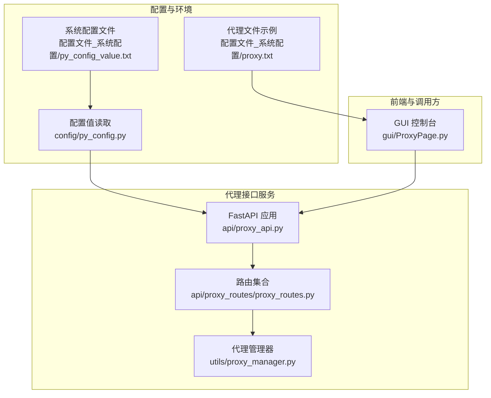
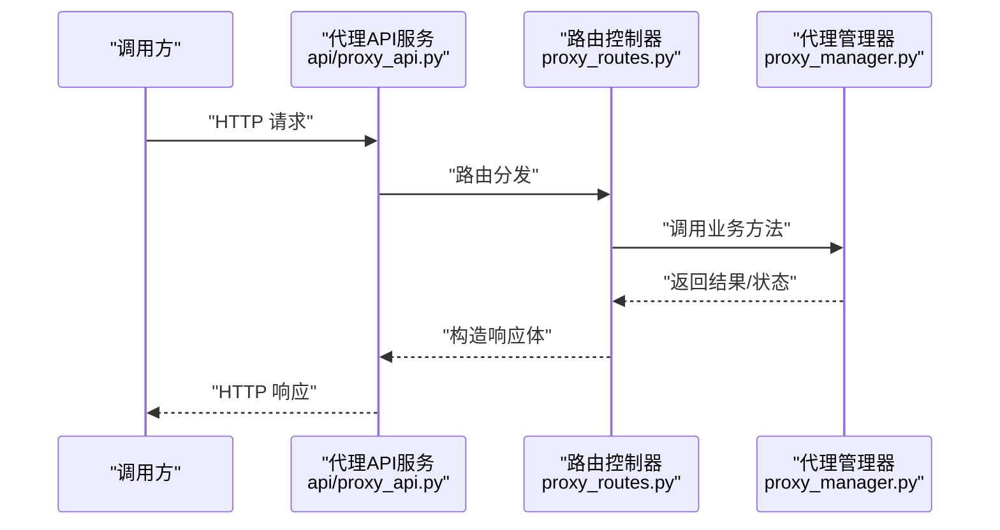
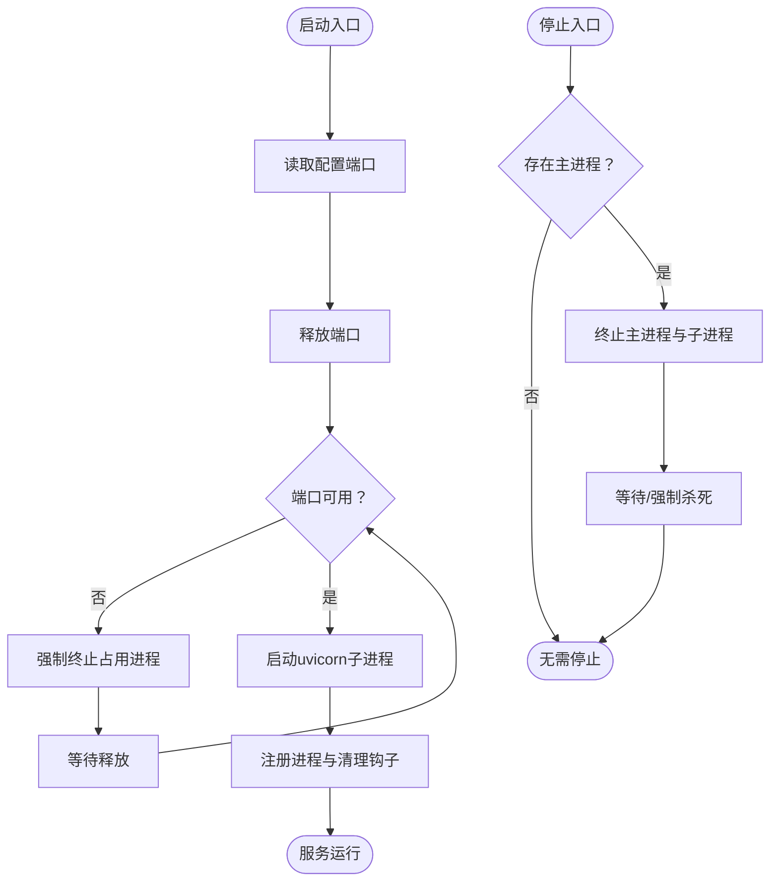
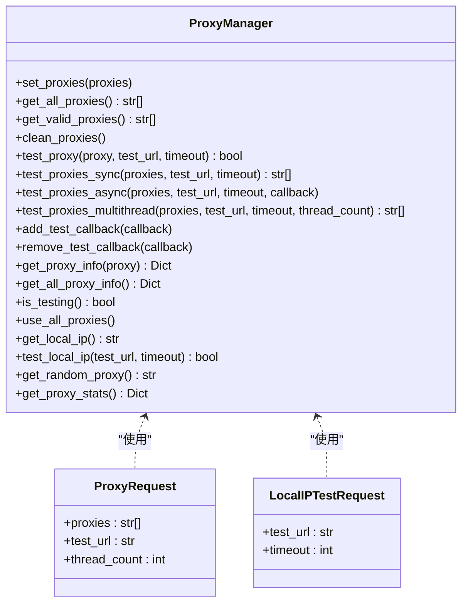
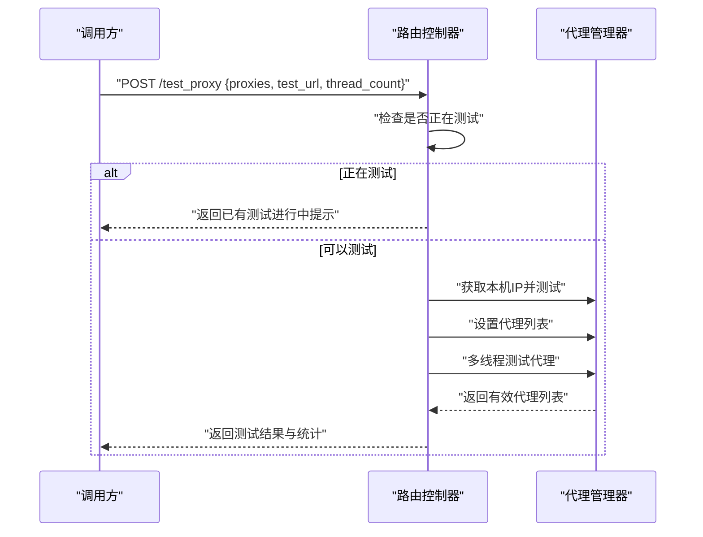
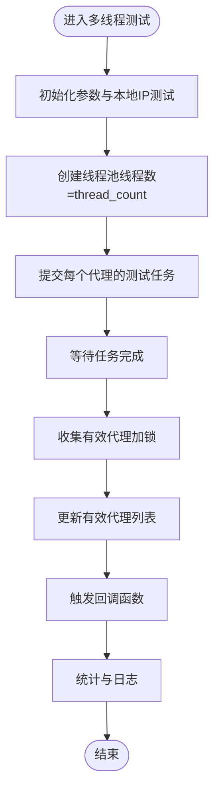
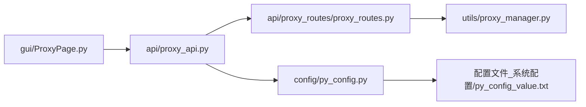

# 代理接口

<cite>
**本文档引用的文件**
- [api/proxy_api.py](file://api/proxy_api.py)
- [api/proxy_routes/proxy_routes.py](file://api/proxy_routes/proxy_routes.py)
- [utils/proxy_manager.py](file://utils/proxy_manager.py)
- [config/py_config.py](file://config/py_config.py)
- [config/common_config.py](file://config/common_config.py)
- [配置文件_系统配置/py_config_value.txt](file://配置文件_系统配置/py_config_value.txt)
- [配置文件_系统配置/proxy.txt](file://配置文件_系统配置/proxy.txt)
- [gui/ProxyPage.py](file://gui/ProxyPage.py)
- [api/server_routes/auth.py](file://api/server_routes/auth.py)
- [config/permission_manager.py](file://config/permission_manager.py)
</cite>

## 目录
1. [简介](#简介)
2. [项目结构](#项目结构)
3. [核心组件](#核心组件)
4. [架构总览](#架构总览)
5. [详细组件分析](#详细组件分析)
6. [依赖分析](#依赖分析)
7. [性能考虑](#性能考虑)
8. [故障排查指南](#故障排查指南)
9. [结论](#结论)
10. [附录](#附录)

## 简介
本文件为 ikun_temu_system 的“代理接口”提供系统化、可操作的 API 文档。内容覆盖接口设计原则、HTTP 方法与 URL 模式、请求参数与响应格式、认证与权限控制、调用示例、错误处理、数据模型与业务规则、性能优化建议以及测试与调试指南。代理接口基于 FastAPI 构建，通过独立进程托管，提供代理 IP 列表的接收、测试、筛选、统计与随机选取能力，并与 GUI 控制台联动。

## 项目结构
代理接口相关代码分布于以下模块：
- 服务入口与生命周期管理：api/proxy_api.py
- 路由与控制器：api/proxy_routes/proxy_routes.py
- 代理管理器：utils/proxy_manager.py
- 配置与端口管理：config/py_config.py、配置文件_系统配置/py_config_value.txt
- 前端集成与调用：gui/ProxyPage.py
- 认证与权限（对比参考）：api/server_routes/auth.py、config/permission_manager.py

图表来源
- [api/proxy_api.py:1-214](file://api/proxy_api.py#L1-L214)
- [api/proxy_routes/proxy_routes.py:1-218](file://api/proxy_routes/proxy_routes.py#L1-L218)
- [utils/proxy_manager.py:1-400](file://utils/proxy_manager.py#L1-L400)
- [config/py_config.py:1-93](file://config/py_config.py#L1-L93)
- [配置文件_系统配置/py_config_value.txt:1-4](file://配置文件_系统配置/py_config_value.txt#L1-L4)
- [配置文件_系统配置/proxy.txt:1-2](file://配置文件_系统配置/proxy.txt#L1-L2)
- [gui/ProxyPage.py:1-200](file://gui/ProxyPage.py#L1-L200)

章节来源
- [api/proxy_api.py:1-214](file://api/proxy_api.py#L1-L214)
- [api/proxy_routes/proxy_routes.py:1-218](file://api/proxy_routes/proxy_routes.py#L1-L218)
- [utils/proxy_manager.py:1-400](file://utils/proxy_manager.py#L1-L400)
- [config/py_config.py:1-93](file://config/py_config.py#L1-L93)
- [配置文件_系统配置/py_config_value.txt:1-4](file://配置文件_系统配置/py_config_value.txt#L1-L4)
- [配置文件_系统配置/proxy.txt:1-2](file://配置文件_系统配置/proxy.txt#L1-L2)
- [gui/ProxyPage.py:1-200](file://gui/ProxyPage.py#L1-L200)

## 核心组件
- 服务入口与生命周期
  - 启动/停止代理 API 服务，端口来自配置；内置端口释放与进程守护逻辑。
- 路由与控制器
  - 提供代理 IP 接收、查询、清理、批量测试、本地 IP 测试、统计与随机代理获取等接口。
- 代理管理器
  - 统一管理代理列表、测试（同步/异步/多线程）、历史记录、统计与回调。
- 配置与端口
  - 动态读取端口与 API 地址，提供默认值与容错处理。
- 前端集成
  - GUI 控制台负责启动服务、定时轮询测试、调用接口并展示结果。

章节来源
- [api/proxy_api.py:40-128](file://api/proxy_api.py#L40-L128)
- [api/proxy_routes/proxy_routes.py:20-218](file://api/proxy_routes/proxy_routes.py#L20-L218)
- [utils/proxy_manager.py:16-350](file://utils/proxy_manager.py#L16-L350)
- [config/py_config.py:14-22](file://config/py_config.py#L14-L22)
- [gui/ProxyPage.py:73-173](file://gui/ProxyPage.py#L73-L173)

## 架构总览
代理接口采用“服务进程 + 路由控制器 + 管理器”的分层设计：
- 服务进程负责监听端口、处理请求与返回响应；
- 路由控制器负责解析请求、校验参数、调用管理器并组装响应；
- 管理器负责代理状态维护、测试调度与统计输出。

图表来源
- [api/proxy_api.py:21-34](file://api/proxy_api.py#L21-L34)
- [api/proxy_routes/proxy_routes.py:20-218](file://api/proxy_routes/proxy_routes.py#L20-L218)
- [utils/proxy_manager.py:16-350](file://utils/proxy_manager.py#L16-L350)

## 详细组件分析

### 服务生命周期与进程管理
- 启动流程
  - 读取配置端口，释放占用端口，启动 uvicorn 子进程，注册进程与清理钩子。
- 停止流程
  - 递归终止子进程，等待与强制杀死，确保资源回收。
- 端口冲突处理
  - 多级释放策略：port_killer → port_manager → 强制 netstat/taskkill。

图表来源
- [api/proxy_api.py:56-128](file://api/proxy_api.py#L56-L128)
- [api/proxy_api.py:131-195](file://api/proxy_api.py#L131-L195)

章节来源
- [api/proxy_api.py:40-128](file://api/proxy_api.py#L40-L128)
- [api/proxy_api.py:131-195](file://api/proxy_api.py#L131-L195)

### 路由与接口清单
- 基础连通性
  - GET /：GET 连通性测试
  - POST /：POST 连通性测试
- 代理管理
  - POST /send_proxies：接收代理列表
  - GET /get_proxies：获取有效代理
  - GET /get_all_proxies：获取全部代理
  - GET /clean_proxies：清空代理列表
  - GET /test_proxy_result：获取测试结果快照
  - GET /test_proxy_use_all：将全部代理标记为有效
- 代理测试
  - POST /test_proxy：批量测试代理（支持线程数与测试 URL）
  - POST /test_local_ip：测试本机 IP 连通性
- 信息查询
  - GET /get_local_ip：获取本机 IP
  - GET /get_proxy_stats：获取代理统计
  - GET /get_random_proxy：获取随机有效代理

请求与响应通用结构
- 通用响应字段
  - code：字符串型状态码（"1" 表示成功，"-1"/"0" 表示失败或警告）
  - message：简要说明
  - 其他字段按接口而定（如 count、proxies、stats、local_ip 等）

章节来源
- [api/proxy_routes/proxy_routes.py:20-218](file://api/proxy_routes/proxy_routes.py#L20-L218)

### 数据模型与业务规则
- 代理请求模型（POST /test_proxy）
  - proxies：代理地址数组
  - test_url：测试 URL，默认百度
  - thread_count：并发线程数，默认 5
- 本机 IP 测试请求模型（POST /test_local_ip）
  - test_url：测试 URL，默认百度
  - timeout：超时秒数，默认 10
- 业务规则
  - 并发测试受互斥锁保护，避免重复测试
  - 本地 IP 测试优先进行，失败会给出警告提示
  - 有效代理列表在测试完成后更新
  - 统计信息包含总数、有效数、无效数、有效率与状态分布

章节来源
- [api/proxy_routes/proxy_routes.py:11-19](file://api/proxy_routes/proxy_routes.py#L11-L19)
- [utils/proxy_manager.py:16-350](file://utils/proxy_manager.py#L16-L350)

### 类关系图（代码级）

图表来源
- [utils/proxy_manager.py:16-350](file://utils/proxy_manager.py#L16-L350)
- [api/proxy_routes/proxy_routes.py:11-19](file://api/proxy_routes/proxy_routes.py#L11-L19)

### 接口调用序列（POST /test_proxy）

图表来源
- [api/proxy_routes/proxy_routes.py:82-124](file://api/proxy_routes/proxy_routes.py#L82-L124)
- [utils/proxy_manager.py:168-227](file://utils/proxy_manager.py#L168-L227)

### 多线程测试流程（算法级）

图表来源
- [utils/proxy_manager.py:168-227](file://utils/proxy_manager.py#L168-L227)

### 认证机制与权限控制
- 代理接口当前未内置认证中间件或鉴权逻辑，允许本地环回访问（默认监听 127.0.0.1）。
- 对比参考：服务端接口（server_routes）提供基于查询参数 token 的简单认证，可作为接入层鉴权的参考实现。
- 权限管理：通过数据库配置保存与读取权限列表，支持任务类型权限检查。

章节来源
- [api/proxy_api.py:24-31](file://api/proxy_api.py#L24-L31)
- [api/server_routes/auth.py:7-19](file://api/server_routes/auth.py#L7-L19)
- [config/permission_manager.py:12-126](file://config/permission_manager.py#L12-L126)

### 错误处理与返回码约定
- 成功/失败约定
  - code = "1"：表示成功
  - code = "0" 或 "-1"：表示失败或警告
- 常见场景
  - 正在测试中：返回提示“已有测试正在进行，请稍后再试”
  - 本地 IP 测试失败：返回失败状态并记录警告
  - 无可用代理：返回“无可用代理IP”

章节来源
- [api/proxy_routes/proxy_routes.py:86-97](file://api/proxy_routes/proxy_routes.py#L86-L97)
- [api/proxy_routes/proxy_routes.py:166-181](file://api/proxy_routes/proxy_routes.py#L166-L181)
- [api/proxy_routes/proxy_routes.py:214-218](file://api/proxy_routes/proxy_routes.py#L214-L218)

### 配置与端口管理
- 端口来源
  - 从系统配置文件读取 api_proxy_port，默认 7899
  - 自动生成 api_proxy_url = http://127.0.0.1:{port}
- 代理文件示例
  - proxy.txt 提供 socks5 示例条目，便于导入与测试

章节来源
- [config/py_config.py:14-22](file://config/py_config.py#L14-L22)
- [配置文件_系统配置/py_config_value.txt:1-4](file://配置文件_系统配置/py_config_value.txt#L1-L4)
- [配置文件_系统配置/proxy.txt:1-2](file://配置文件_系统配置/proxy.txt#L1-L2)

### 前端集成与调用示例
- GUI 控制台
  - 支持启动/停止代理服务、定时轮询测试、读取配置（超时、URL、线程数）
  - 停止流程中先调用 /clean_proxies，再关闭服务
- 典型调用链
  - 启动服务 → 读取代理文件 → 发送 /send_proxies → 触发 /test_proxy → 轮询 /test_proxy_result → 获取 /get_proxies

章节来源
- [gui/ProxyPage.py:73-173](file://gui/ProxyPage.py#L73-L173)
- [gui/ProxyPage.py:28-71](file://gui/ProxyPage.py#L28-L71)

## 依赖分析
- 组件耦合
  - 服务入口依赖路由模块与端口管理器
  - 路由控制器依赖代理管理器
  - 代理管理器依赖配置管理器与第三方库（requests、loguru 等）
- 外部依赖
  - FastAPI、Uvicorn、Requests、Loguru、Psutil、ThreadPoolExecutor
- 循环依赖规避
  - 通过延迟导入与全局实例化避免循环引用

图表来源
- [api/proxy_api.py:13-19](file://api/proxy_api.py#L13-L19)
- [api/proxy_routes/proxy_routes.py:6](file://api/proxy_routes/proxy_routes.py#L6)
- [utils/proxy_manager.py:13](file://utils/proxy_manager.py#L13)
- [config/py_config.py:14-22](file://config/py_config.py#L14-L22)
- [配置文件_系统配置/py_config_value.txt:1-4](file://配置文件_系统配置/py_config_value.txt#L1-L4)
- [gui/ProxyPage.py:17-18](file://gui/ProxyPage.py#L17-L18)

章节来源
- [api/proxy_api.py:13-19](file://api/proxy_api.py#L13-L19)
- [api/proxy_routes/proxy_routes.py:6](file://api/proxy_routes/proxy_routes.py#L6)
- [utils/proxy_manager.py:13](file://utils/proxy_manager.py#L13)
- [config/py_config.py:14-22](file://config/py_config.py#L14-L22)
- [配置文件_系统配置/py_config_value.txt:1-4](file://配置文件_系统配置/py_config_value.txt#L1-L4)
- [gui/ProxyPage.py:17-18](file://gui/ProxyPage.py#L17-L18)

## 性能考虑
- 并发策略
  - 多线程测试通过线程池控制并发度，合理设置 thread_count 以平衡吞吐与稳定性
- 超时与重试
  - 建议根据网络状况调整 test_url 与 timeout；对失败代理进行分级处理
- 资源回收
  - 停止服务时递归终止子进程并等待，避免僵尸进程
- I/O 与日志
  - 使用异步/多线程减少阻塞；注意日志级别与频率，避免影响性能

[本节为通用指导，无需列出章节来源]

## 故障排查指南
- 端口占用
  - 现象：启动失败或端口被占用
  - 处理：使用内置释放流程；若仍失败，检查系统进程并手动终止
- 测试冲突
  - 现象：返回“已有测试正在进行”
  - 处理：等待测试完成或重试；确认 is_testing 状态
- 本地 IP 测试失败
  - 现象：返回本地 IP 测试失败
  - 处理：检查网络连通性与代理可用性
- 无可用代理
  - 现象：随机代理接口返回“无可用代理IP”
  - 处理：先执行 /test_proxy 并确认有效代理数量

章节来源
- [api/proxy_api.py:82-106](file://api/proxy_api.py#L82-L106)
- [api/proxy_routes/proxy_routes.py:86-97](file://api/proxy_routes/proxy_routes.py#L86-L97)
- [utils/proxy_manager.py:291-315](file://utils/proxy_manager.py#L291-L315)
- [api/proxy_routes/proxy_routes.py:214-218](file://api/proxy_routes/proxy_routes.py#L214-L218)

## 结论
代理接口以简洁清晰的路由设计与可扩展的代理管理器为核心，提供了代理 IP 的接收、测试、筛选与统计能力。结合 GUI 控制台，可实现自动化代理轮询与可视化监控。建议在生产环境中补充鉴权与速率限制，并根据网络环境优化并发与超时参数。

[本节为总结性内容，无需列出章节来源]

## 附录

### 接口一览表
- GET /
  - 用途：连通性测试（GET）
  - 响应：包含 method 与 message 字段
- POST /
  - 用途：连通性测试（POST）
  - 响应：包含 method 与 message 字段
- POST /send_proxies
  - 请求体：proxies（数组）
  - 响应：count、received_proxies、message
- GET /get_proxies
  - 响应：proxies、count、message
- GET /get_all_proxies
  - 响应：proxies、count、message
- GET /clean_proxies
  - 响应：proxies（空数组）、count（0）、message
- POST /test_proxy
  - 请求体：proxies、test_url、thread_count
  - 响应：total、valid、valid_proxies、local_ip、local_ip_test_result、test_url、thread_count、message
- GET /test_proxy_result
  - 响应：total、valid、valid_proxies、stats、is_testing、local_ip、message
- GET /test_proxy_use_all
  - 响应：total、valid、valid_proxies、message
- POST /test_local_ip
  - 请求体：test_url、timeout
  - 响应：local_ip、test_result、test_url、message
- GET /get_local_ip
  - 响应：local_ip、message
- GET /get_proxy_stats
  - 响应：stats、message
- GET /get_random_proxy
  - 响应：proxy、message（无代理时 code="-1"）

章节来源
- [api/proxy_routes/proxy_routes.py:20-218](file://api/proxy_routes/proxy_routes.py#L20-L218)

### 调用示例（步骤说明）
- 启动服务
  - 通过 GUI 控制台点击“启动”，或调用服务启动函数
- 发送代理
  - 调用 POST /send_proxies，传入 proxies 数组
- 批量测试
  - 调用 POST /test_proxy，传入 proxies、test_url、thread_count
- 查询结果
  - 轮询 GET /test_proxy_result 获取实时统计
- 获取有效代理
  - 调用 GET /get_proxies
- 清空代理
  - 调用 GET /clean_proxies

章节来源
- [gui/ProxyPage.py:73-173](file://gui/ProxyPage.py#L73-L173)
- [api/proxy_routes/proxy_routes.py:20-218](file://api/proxy_routes/proxy_routes.py#L20-L218)

### 测试指南与调试技巧
- 本地联调
  - 使用默认端口 7899，访问 http://127.0.0.1:7899
- GUI 轮询
  - 在 GUI 中设置更新周期、超时、URL 与线程数，观察日志输出
- 停止流程
  - GUI 停止时会先调用 /clean_proxies，再关闭服务，确保资源回收

章节来源
- [gui/ProxyPage.py:28-71](file://gui/ProxyPage.py#L28-L71)
- [配置文件_系统配置/py_config_value.txt:1-4](file://配置文件_系统配置/py_config_value.txt#L1-L4)