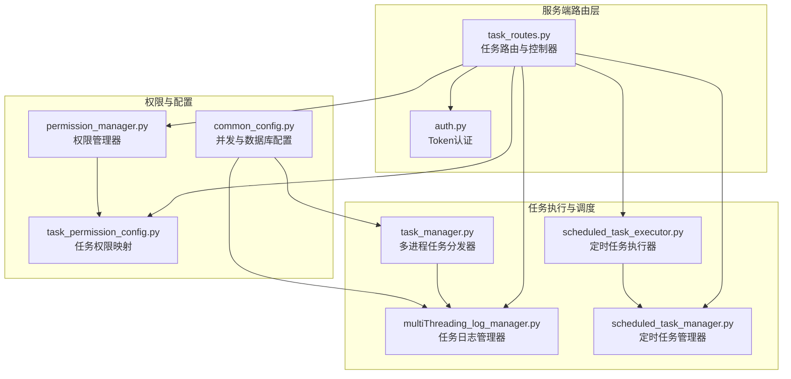
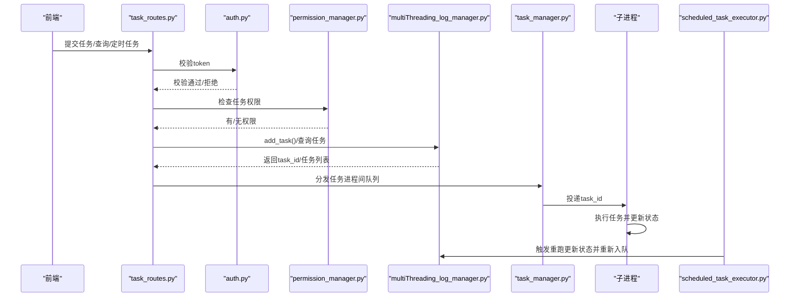
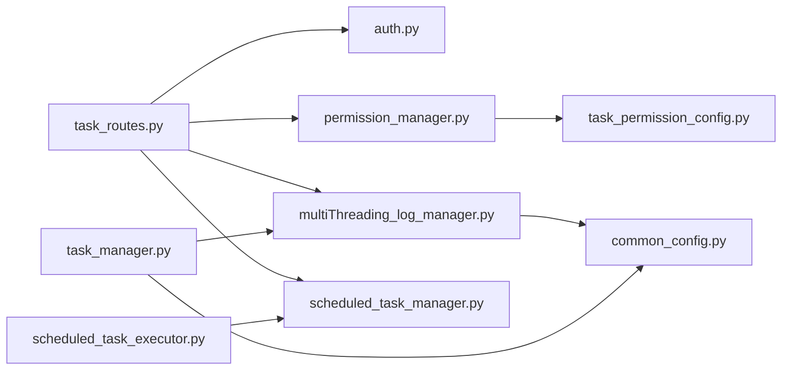

# 任务接口

<cite>
**本文引用的文件**
- [task_routes.py](file://api/server_routes/task_routes.py)
- [auth.py](file://api/server_routes/auth.py)
- [permission_manager.py](file://config/permission_manager.py)
- [task_permission_config.py](file://config/task_permission_config.py)
- [multiThreading_log_manager.py](file://utils/multiThreading_log_manager.py)
- [scheduled_task_manager.py](file://utils/scheduled_task_manager.py)
- [scheduled_task_executor.py](file://utils/scheduled_task_executor.py)
- [task_manager.py](file://modules/task_manager.py)
- [common_config.py](file://config/common_config.py)
- [添加新任务功能.md](file://代码规范/添加新任务功能.md)
</cite>

## 目录
1. [简介](#简介)
2. [项目结构](#项目结构)
3. [核心组件](#核心组件)
4. [架构总览](#架构总览)
5. [详细组件分析](#详细组件分析)
6. [依赖分析](#依赖分析)
7. [性能考量](#性能考量)
8. [故障排查指南](#故障排查指南)
9. [结论](#结论)
10. [附录](#附录)

## 简介
本文件为 ikun_temu_system 的任务接口 API 文档，覆盖任务提交、查询、日志、定时任务管理以及类目搜索等能力。文档面向前后端开发者与运维人员，提供接口设计原则、认证与权限控制、请求/响应格式、错误处理、数据模型与业务规则、性能与最佳实践，以及测试与调试建议。

## 项目结构
任务接口主要位于服务端路由层，围绕 FastAPI 路由组织，结合权限管理、任务日志管理器、定时任务管理器与多进程任务分发器协同工作。

图表来源
- [task_routes.py:1-1200](file://api/server_routes/task_routes.py#L1-L1200)
- [auth.py:1-19](file://api/server_routes/auth.py#L1-L19)
- [permission_manager.py:1-126](file://config/permission_manager.py#L1-L126)
- [task_permission_config.py:1-84](file://config/task_permission_config.py#L1-L84)
- [multiThreading_log_manager.py:1-400](file://utils/multiThreading_log_manager.py#L1-L400)
- [scheduled_task_manager.py:1-446](file://utils/scheduled_task_manager.py#L1-L446)
- [scheduled_task_executor.py:1-242](file://utils/scheduled_task_executor.py#L1-L242)
- [task_manager.py:1-319](file://modules/task_manager.py#L1-L319)
- [common_config.py:1-200](file://config/common_config.py#L1-L200)

章节来源
- [task_routes.py:1-1200](file://api/server_routes/task_routes.py#L1-L1200)
- [auth.py:1-19](file://api/server_routes/auth.py#L1-L19)
- [permission_manager.py:1-126](file://config/permission_manager.py#L1-L126)
- [task_permission_config.py:1-84](file://config/task_permission_config.py#L1-L84)
- [multiThreading_log_manager.py:1-400](file://utils/multiThreading_log_manager.py#L1-L400)
- [scheduled_task_manager.py:1-446](file://utils/scheduled_task_manager.py#L1-L446)
- [scheduled_task_executor.py:1-242](file://utils/scheduled_task_executor.py#L1-L242)
- [task_manager.py:1-319](file://modules/task_manager.py#L1-L319)
- [common_config.py:1-200](file://config/common_config.py#L1-L200)

## 核心组件
- 任务路由与控制器：提供任务提交、查询、日志、定时任务管理与类目搜索相关接口。
- 认证与权限：基于配置的 Token 校验与任务类型权限映射。
- 任务日志管理器：统一的任务状态、日志、并发与执行生命周期管理。
- 定时任务管理器与执行器：定时任务的创建、更新、删除、查询与周期性触发。
- 多进程任务分发器：基于进程间队列的任务分发与负载均衡。

章节来源
- [task_routes.py:66-1200](file://api/server_routes/task_routes.py#L66-L1200)
- [auth.py:7-19](file://api/server_routes/auth.py#L7-L19)
- [permission_manager.py:12-126](file://config/permission_manager.py#L12-L126)
- [task_permission_config.py:7-84](file://config/task_permission_config.py#L7-L84)
- [multiThreading_log_manager.py:122-400](file://utils/multiThreading_log_manager.py#L122-L400)
- [scheduled_task_manager.py:11-446](file://utils/scheduled_task_manager.py#L11-L446)
- [scheduled_task_executor.py:18-242](file://utils/scheduled_task_executor.py#L18-L242)
- [task_manager.py:14-319](file://modules/task_manager.py#L14-L319)

## 架构总览
任务接口整体流程：前端调用受保护的路由 → 校验 Token 与权限 → 根据任务类型映射到具体任务函数 → 通过任务日志管理器登记任务 → 多进程任务分发器将任务投递到子进程 → 子进程执行任务并更新状态与日志 → 定时任务管理器按计划触发重跑。

图表来源
- [task_routes.py:66-353](file://api/server_routes/task_routes.py#L66-L353)
- [auth.py:7-19](file://api/server_routes/auth.py#L7-L19)
- [permission_manager.py:106-122](file://config/permission_manager.py#L106-L122)
- [multiThreading_log_manager.py:206-372](file://utils/multiThreading_log_manager.py#L206-L372)
- [task_manager.py:144-319](file://modules/task_manager.py#L144-L319)
- [scheduled_task_executor.py:94-162](file://utils/scheduled_task_executor.py#L94-L162)

## 详细组件分析

### 认证与权限控制
- 认证机制
  - 路由依赖 verify_token 校验请求头中的 token。
  - 是否启用认证与期望 token 值由配置项控制。
- 权限控制
  - 任务类型与所需权限的映射集中于配置文件。
  - 权限管理器从数据库读取用户权限，结合映射进行校验。

章节来源
- [auth.py:7-19](file://api/server_routes/auth.py#L7-L19)
- [task_permission_config.py:7-84](file://config/task_permission_config.py#L7-L84)
- [permission_manager.py:106-122](file://config/permission_manager.py#L106-L122)

### 任务提交接口
- 提交Temu任务
  - 方法与路径：POST /api/submit_temu_task
  - 请求体字段
    - selected_shop_uids：目标店铺UID列表（必填）
    - task_type：任务类型（必填，参考任务类型映射）
    - task_kwargs：任务参数字典（必填）
    - is_maintain_task：是否标记为守护任务（可选）
  - 权限：依据任务类型映射检查权限
  - 并发与日志：为每个UID生成独立任务，使用任务日志管理器登记
  - 响应：包含成功计数与消息
- 提交爬虫任务
  - 方法与路径：POST /api/submit_spider_task
  - 请求体字段
    - task_type：爬虫任务类型（必填）
    - task_kwargs：任务参数字典（可选）
    - is_maintain_task：是否标记为守护任务（可选）
    - task_name：任务名称（可选）
    - schedule_type/schedule_time/schedule_interval/schedule_enabled：定时任务相关（可选）
  - 权限：依据任务类型映射检查权限
  - 定时任务：若启用定时，创建定时任务记录
  - 响应：包含任务ID与消息

章节来源
- [task_routes.py:66-231](file://api/server_routes/task_routes.py#L66-L231)
- [task_routes.py:233-353](file://api/server_routes/task_routes.py#L233-L353)

### 任务查询与日志
- 获取任务列表
  - 方法与路径：POST /api/get_tasks
  - 支持筛选条件：任务状态、任务ID/列表、任务类型、店铺简称、是否主任务、是否守护任务、是否设置定时任务
  - 分页参数：page/page_size（默认1/20，最大100）
  - 响应：包含总数、页码、条数、任务列表与全部任务ID列表
- 获取任务日志
  - 方法与路径：POST /api/get_task_log
  - 请求体字段：task_id（必填）
  - 响应：包含日志内容

章节来源
- [task_routes.py:694-920](file://api/server_routes/task_routes.py#L694-L920)
- [task_routes.py:924-962](file://api/server_routes/task_routes.py#L924-L962)

### 定时任务管理
- 添加定时任务
  - 方法与路径：POST /api/add_schedule_task
  - 请求体字段：task_id、schedule_type（once/interval）、schedule_time、schedule_interval、schedule_enabled、execute_immediately
- 更新定时任务
  - 方法与路径：POST /api/update_schedule_task
  - 请求体字段：schedule_id、schedule_type、schedule_time、schedule_interval、schedule_enabled、execute_immediately
- 删除定时任务
  - 方法与路径：POST /api/delete_schedule_task
  - 请求体字段：schedule_id 或 task_id
- 获取定时任务配置
  - 方法与路径：POST /api/get_schedule_task
  - 请求体字段：task_id
- 获取所有定时任务
  - 方法与路径：POST /api/get_all_schedule_tasks
  - 请求体字段：enabled_only（默认True）

章节来源
- [task_routes.py:968-1200](file://api/server_routes/task_routes.py#L968-L1200)
- [scheduled_task_manager.py:17-174](file://utils/scheduled_task_manager.py#L17-L174)
- [scheduled_task_manager.py:176-281](file://utils/scheduled_task_manager.py#L176-L281)
- [scheduled_task_manager.py:282-319](file://utils/scheduled_task_manager.py#L282-L319)
- [scheduled_task_manager.py:320-367](file://utils/scheduled_task_manager.py#L320-L367)
- [scheduled_task_manager.py:368-446](file://utils/scheduled_task_manager.py#L368-L446)

### 类目搜索与持久化
- 搜索类目任务提交
  - 方法与路径：POST /api/search_category
  - 请求体字段：uid、keyword
  - 响应：返回任务ID与提示信息
- 获取搜索类目结果
  - 方法与路径：POST /api/get_search_category_result
  - 请求体字段：task_id、uid、keyword
  - 响应：成功返回类目列表，失败返回错误信息
- 保存/删除/获取已保存类目与结果
  - 方法与路径：POST /api/save_saved_category_list、/api/delete_saved_category、/api/get_saved_category_list、/api/save_search_category_results、/api/get_search_category_results

章节来源
- [task_routes.py:356-507](file://api/server_routes/task_routes.py#L356-L507)
- [task_routes.py:510-691](file://api/server_routes/task_routes.py#L510-L691)

### 数据模型与业务规则
- 任务状态
  - 待处理、进行中、已完成、异常、已超时、已退出
- 任务类型映射
  - 前端传入的task_type与数据库中task_name的映射关系
- 任务日志管理
  - 任务ID生成策略、日志落盘、状态更新、并发控制
- 定时任务
  - 一次性与间隔两种类型，支持立即执行与下次执行时间计算
- 并发与分发
  - 多进程+进程间队列，按负载选择子进程，避免跨进程直接调用

章节来源
- [task_routes.py:37-63](file://api/server_routes/task_routes.py#L37-L63)
- [multiThreading_log_manager.py:25-32](file://utils/multiThreading_log_manager.py#L25-L32)
- [multiThreading_log_manager.py:74-98](file://utils/multiThreading_log_manager.py#L74-L98)
- [scheduled_task_manager.py:17-174](file://utils/scheduled_task_manager.py#L17-L174)
- [task_manager.py:14-319](file://modules/task_manager.py#L14-L319)

### 接口调用示例与错误处理
- 示例（以提交Temu任务为例）
  - 请求
    - 方法：POST /api/submit_temu_task
    - 请求体：
      - selected_shop_uids: [1001, 1002]
      - task_type: "upload_real_pic"
      - task_kwargs: { ... }
      - is_maintain_task: 0
  - 成功响应
    - success: true
    - message: "任务提交成功，本次成功提交X/Y个店铺"
- 错误处理
  - 未选择店铺/任务类型：400
  - 权限不足：403
  - 服务器异常：500
  - 定时任务相关：400/500（根据具体场景）

章节来源
- [task_routes.py:66-231](file://api/server_routes/task_routes.py#L66-L231)
- [task_routes.py:968-1200](file://api/server_routes/task_routes.py#L968-L1200)

## 依赖分析
- 路由层依赖认证与权限模块，调用任务日志管理器登记任务，必要时调用定时任务管理器。
- 任务日志管理器负责任务状态、日志与并发控制，支持主动/被动双模式。
- 多进程任务分发器通过进程间队列将任务投递给子进程，避免跨进程直接调用。
- 定时任务执行器周期性检查并重跑任务，同时更新定时任务的下次执行时间。

图表来源
- [task_routes.py:1-1200](file://api/server_routes/task_routes.py#L1-L1200)
- [auth.py:1-19](file://api/server_routes/auth.py#L1-L19)
- [permission_manager.py:1-126](file://config/permission_manager.py#L1-L126)
- [task_permission_config.py:1-84](file://config/task_permission_config.py#L1-L84)
- [multiThreading_log_manager.py:1-400](file://utils/multiThreading_log_manager.py#L1-L400)
- [scheduled_task_manager.py:1-446](file://utils/scheduled_task_manager.py#L1-L446)
- [scheduled_task_executor.py:1-242](file://utils/scheduled_task_executor.py#L1-L242)
- [task_manager.py:1-319](file://modules/task_manager.py#L1-L319)
- [common_config.py:1-200](file://config/common_config.py#L1-L200)

章节来源
- [task_routes.py:1-1200](file://api/server_routes/task_routes.py#L1-L1200)
- [multiThreading_log_manager.py:1-400](file://utils/multiThreading_log_manager.py#L1-L400)
- [task_manager.py:1-319](file://modules/task_manager.py#L1-L319)

## 性能考量
- 并发与限流
  - 全局最大并发与任务组并发配置，避免资源争用。
- 分页与筛选
  - 任务列表查询支持分页与多条件筛选，避免全量返回。
- 多进程与队列
  - 通过进程间队列分发任务，降低跨进程调用开销，提升吞吐。
- 日志与序列化
  - 对长文本字段进行截断，减少响应体积。
- 定时任务
  - 定时任务执行器按固定间隔扫描，避免频繁轮询带来的压力。

章节来源
- [common_config.py:141-153](file://config/common_config.py#L141-L153)
- [task_routes.py:694-920](file://api/server_routes/task_routes.py#L694-L920)
- [task_manager.py:14-319](file://modules/task_manager.py#L14-L319)
- [multiThreading_log_manager.py:856-880](file://utils/multiThreading_log_manager.py#L856-L880)

## 故障排查指南
- 认证失败
  - 检查配置项是否启用认证及期望token值。
- 权限不足
  - 核对任务类型与权限映射，确认用户权限集合。
- 任务提交失败
  - 检查请求体字段完整性与类型；查看任务日志定位异常。
- 任务状态异常
  - 使用任务查询接口确认状态；必要时通过定时任务执行器重跑。
- 定时任务未触发
  - 检查定时任务配置与下次执行时间；确认执行器处于运行状态。

章节来源
- [auth.py:7-19](file://api/server_routes/auth.py#L7-L19)
- [permission_manager.py:106-122](file://config/permission_manager.py#L106-L122)
- [task_routes.py:694-920](file://api/server_routes/task_routes.py#L694-L920)
- [scheduled_task_executor.py:32-73](file://utils/scheduled_task_executor.py#L32-L73)

## 结论
任务接口通过统一的路由层、严格的认证与权限控制、完善的任务生命周期管理与多进程分发机制，实现了高并发、可扩展的任务执行体系。配合定时任务与日志管理，满足复杂业务场景下的自动化与可观测性需求。

## 附录

### 接口清单与规范
- 认证
  - 请求头携带 token，路由依赖校验
- 任务提交
  - /api/submit_temu_task：提交Temu任务
  - /api/submit_spider_task：提交爬虫任务（可选定时）
- 任务查询与日志
  - /api/get_tasks：任务列表查询（支持分页与筛选）
  - /api/get_task_log：获取任务日志
- 定时任务
  - /api/add_schedule_task：添加定时任务
  - /api/update_schedule_task：更新定时任务
  - /api/delete_schedule_task：删除定时任务
  - /api/get_schedule_task：获取定时任务配置
  - /api/get_all_schedule_tasks：获取定时任务列表
- 类目搜索
  - /api/search_category：提交搜索类目任务
  - /api/get_search_category_result：获取搜索结果
  - /api/save_saved_category_list、/api/delete_saved_category、/api/get_saved_category_list、/api/save_search_category_results、/api/get_search_category_results：类目结果持久化

章节来源
- [task_routes.py:66-1200](file://api/server_routes/task_routes.py#L66-L1200)

### 新增任务功能指引
- 后端：实现核心函数与包装函数，注册到路由层
- 前端：添加任务卡片与模态框，提交至相应路由
- 权限：在权限映射中添加任务类型
- 测试：使用API测试工具验证参数与执行流程

章节来源
- [添加新任务功能.md:1-395](file://代码规范/添加新任务功能.md#L1-L395)