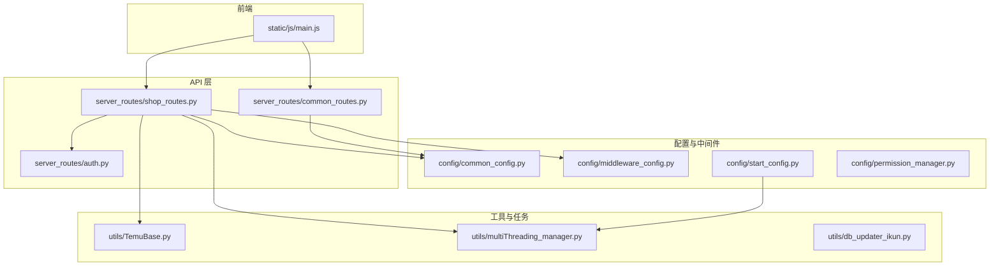
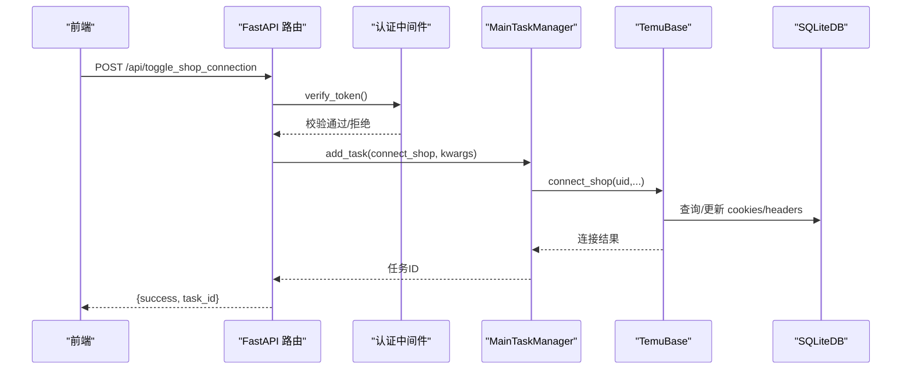
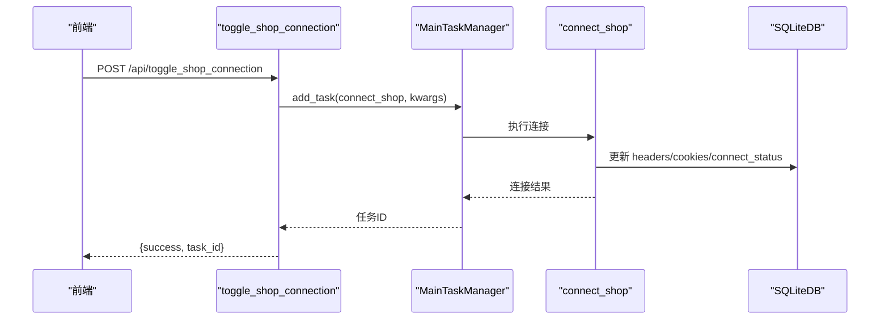
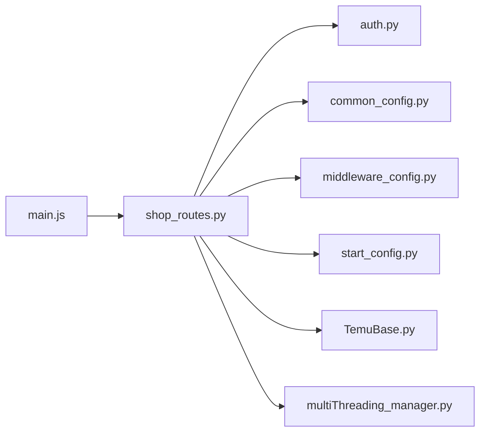
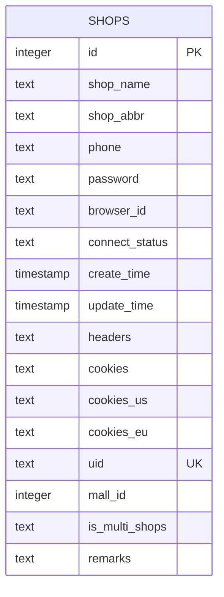

# 店铺接口

<cite>
**本文引用的文件**
- [shop_routes.py](file://api/server_routes/shop_routes.py)
- [auth.py](file://api/server_routes/auth.py)
- [common_routes.py](file://api/server_routes/common_routes.py)
- [middleware_config.py](file://config/middleware_config.py)
- [permission_manager.py](file://config/permission_manager.py)
- [common_config.py](file://config/common_config.py)
- [start_config.py](file://config/start_config.py)
- [TemuBase.py](file://utils/TemuBase.py)
- [multiThreading_manager.py](file://utils/multiThreading_manager.py)
- [db_updater_ikun.py](file://utils/db_updater_ikun.py)
- [main.js](file://static/js/main.js)
</cite>

## 目录
1. [简介](#简介)
2. [项目结构](#项目结构)
3. [核心组件](#核心组件)
4. [架构总览](#架构总览)
5. [详细组件分析](#详细组件分析)
6. [依赖分析](#依赖分析)
7. [性能考量](#性能考量)
8. [故障排查指南](#故障排查指南)
9. [结论](#结论)
10. [附录](#附录)

## 简介
本文件为 ikun_temu_system 的“店铺接口”API文档，覆盖接口设计原则、实现细节、认证与权限、请求/响应规范、数据模型与业务规则、性能与最佳实践、测试与调试指南等。目标读者既包括前端/后端开发者，也包括需要对接系统的集成方与运维人员。

## 项目结构
- 接口路由集中在 server_routes 下的 shop_routes.py，采用 FastAPI 路由装饰器组织。
- 认证与权限控制通过 auth.py 的 verify_token 依赖注入实现；权限管理器位于 permission_manager.py。
- 数据访问与任务调度通过 config/common_config.py、config/middleware_config.py、utils/TemuBase.py、utils/multiThreading_manager.py 等模块协作。
- 前端通过静态 JS 与后端交互，调用 /api/* 接口。

图表来源
- [shop_routes.py:1-511](file://api/server_routes/shop_routes.py#L1-L511)
- [auth.py:1-19](file://api/server_routes/auth.py#L1-L19)
- [common_routes.py:1-241](file://api/server_routes/common_routes.py#L1-L241)
- [common_config.py:1-394](file://config/common_config.py#L1-L394)
- [middleware_config.py:1-13](file://config/middleware_config.py#L1-L13)
- [start_config.py:1-161](file://config/start_config.py#L1-L161)
- [TemuBase.py:1-656](file://utils/TemuBase.py#L1-L656)
- [multiThreading_manager.py:1-555](file://utils/multiThreading_manager.py#L1-L555)
- [db_updater_ikun.py:440-478](file://utils/db_updater_ikun.py#L440-L478)
- [main.js:6062-6087](file://static/js/main.js#L6062-L6087)

章节来源
- [shop_routes.py:1-511](file://api/server_routes/shop_routes.py#L1-L511)
- [auth.py:1-19](file://api/server_routes/auth.py#L1-L19)
- [common_routes.py:1-241](file://api/server_routes/common_routes.py#L1-L241)
- [common_config.py:1-394](file://config/common_config.py#L1-L394)
- [middleware_config.py:1-13](file://config/middleware_config.py#L1-L13)
- [start_config.py:1-161](file://config/start_config.py#L1-L161)
- [TemuBase.py:1-656](file://utils/TemuBase.py#L1-L656)
- [multiThreading_manager.py:1-555](file://utils/multiThreading_manager.py#L1-L555)
- [db_updater_ikun.py:440-478](file://utils/db_updater_ikun.py#L440-L478)
- [main.js:6062-6087](file://static/js/main.js#L6062-L6087)

## 核心组件
- 店铺分页与检索：支持关键词过滤、排序、分页与重复手机号标记。
- 店铺连接状态检测：从数据库读取最新连接状态。
- 店铺连接任务：提交连接/检测任务，支持比特浏览器与普通登录两种模式。
- 店铺 CRUD：添加、修改、删除店铺信息；支持批量删除记录与图片清理。
- 配置管理：连接参数持久化与读取；JIT 默认库存配置。
- 认证与权限：基于配置的 Token 校验；权限管理器负责权限持久化与检查。
- 任务调度：MainTaskManager 统一调度，支持全局并发与功能级并发控制。

章节来源
- [shop_routes.py:19-511](file://api/server_routes/shop_routes.py#L19-L511)
- [auth.py:7-19](file://api/server_routes/auth.py#L7-L19)
- [permission_manager.py:12-126](file://config/permission_manager.py#L12-L126)
- [multiThreading_manager.py:42-555](file://utils/multiThreading_manager.py#L42-L555)
- [start_config.py:20-24](file://config/start_config.py#L20-L24)

## 架构总览
- 认证层：verify_token 依赖注入，校验 ServerPage_auth 与 ServerPage_token。
- 业务层：shop_routes 提供店铺相关接口；TemuBase 提供连接与登录能力；MainTaskManager 提交任务。
- 数据层：SQLiteDB 通过 db.execute_sql 访问 shops 表；表结构由 db_updater_ikun.py 管理。
- 前端层：main.js 通过 /api/* 发起请求，渲染店铺列表与状态。

图表来源
- [shop_routes.py:182-221](file://api/server_routes/shop_routes.py#L182-L221)
- [auth.py:7-19](file://api/server_routes/auth.py#L7-L19)
- [multiThreading_manager.py:108-135](file://utils/multiThreading_manager.py#L108-L135)
- [TemuBase.py:203-456](file://utils/TemuBase.py#L203-L456)
- [common_config.py:138-221](file://config/common_config.py#L138-L221)

## 详细组件分析

### 认证与权限
- 认证机制
  - 通过 verify_token 依赖注入，读取 ServerPage_auth 与 ServerPage_token 配置。
  - 若启用认证且 token 不匹配，返回 403 Forbidden。
- 权限控制
  - 权限保存在数据库 config 表中，key 为 permissions。
  - 提供保存、加载、清除与检查权限的方法，支持任务类型权限检查。

章节来源
- [auth.py:7-19](file://api/server_routes/auth.py#L7-L19)
- [common_routes.py:65-83](file://api/server_routes/common_routes.py#L65-L83)
- [permission_manager.py:12-126](file://config/permission_manager.py#L12-L126)

### 店铺分页与检索
- 接口
  - GET /api/page
- 请求参数
  - page: 页码（>=1）
  - page_size: 每页条数（1~100）
  - keyword: 搜索关键词（店铺名称/缩写/Browser ID）
  - sort_field: 排序字段（id, shop_name, shop_abbr, browser_id, phone, password, create_time, update_time）
  - sort_order: 排序方式（asc/desc）
- 响应
  - success: 布尔
  - data: 店铺列表（含重复手机号标记）
  - pagination: 分页信息（page, page_size, total, total_pages, has_prev, has_next）
  - duplicate_phone_list: 重复手机号列表
- 业务规则
  - 关键词模糊匹配（大小写不敏感），支持多字段组合过滤。
  - 重复手机号标记：同一手机号出现多次时，对应行标记 is_phone_duplicate。
  - 排序字段白名单校验，非法字段回退为 id。

章节来源
- [shop_routes.py:20-119](file://api/server_routes/shop_routes.py#L20-L119)

### 店铺状态检测
- 接口
  - GET /api/check_shop_status
- 请求参数
  - uid: 店铺唯一标识
- 响应
  - success: 布尔
  - connected: 布尔（是否已连接）
  - uid: 店铺唯一标识
- 异常
  - 店铺不存在时返回错误信息。

章节来源
- [shop_routes.py:123-146](file://api/server_routes/shop_routes.py#L123-L146)

### 店铺连接任务
- 接口
  - POST /api/toggle_shop_connection/test：提交检测连接任务
  - POST /api/toggle_shop_connection：提交连接任务
- 请求体
  - uid: 必填
  - login_type: 连接类型（默认 "ikun"，支持 "bit"）
  - reload_cookies: 是否强制重新登录（布尔）
  - headless: 是否无头模式（布尔）
  - auto_close: 是否自动关闭（布尔）
  - window_size: 浏览器窗口尺寸（数组）
- 响应
  - success: 布尔
  - task_id: 任务ID
  - message: 提交结果消息
- 任务调度
  - 通过 MAIN_TASK_MANAGER.add_task 提交任务，任务组为 "ikun"。
  - 连接逻辑由 connect_shop 实现，支持比特浏览器与普通登录两种模式。
  - 连接成功后更新数据库 cookies/headers/connect_status 等字段。

图表来源
- [shop_routes.py:182-221](file://api/server_routes/shop_routes.py#L182-L221)
- [TemuBase.py:203-456](file://utils/TemuBase.py#L203-L456)
- [multiThreading_manager.py:108-135](file://utils/multiThreading_manager.py#L108-L135)

章节来源
- [shop_routes.py:149-221](file://api/server_routes/shop_routes.py#L149-L221)
- [TemuBase.py:203-456](file://utils/TemuBase.py#L203-L456)
- [start_config.py:20-24](file://config/start_config.py#L20-L24)

### 店铺 CRUD 与记录管理
- 添加店铺
  - POST /api/add_shop
  - 请求体：browser_id, shop_name, shop_abbr, phone, password
  - 响应：success, message
- 修改店铺
  - POST /api/modify_shop
  - 请求体：uid, browser_id, shop_name, shop_abbr, phone, password
  - 响应：success, message
- 删除店铺
  - POST /api/delete_shop
  - 请求体：uid
  - 响应：success, message
- 删除记录页
  - POST /api/delete_record_page
  - 请求体：uid（支持特殊值 "all123" 清空所有记录）
  - 响应：success, message
- 删除图片
  - GET /api/delete_images
  - 响应：success, message

章节来源
- [shop_routes.py:222-387](file://api/server_routes/shop_routes.py#L222-L387)

### 连接配置与 JIT 默认库存
- 获取/保存连接配置
  - POST /api/get_connect_shop_config
  - 请求体：save（0 获取，非0 保存）
  - 响应：success, message, 以及 login_type/reload_cookies/headless/auto_close/window_size/save
- JIT 默认库存配置
  - POST /api/jit_default_config
  - 请求体：action（get/set），final_num（set 时必填）
  - 响应：success, message/default_final_num

章节来源
- [shop_routes.py:391-511](file://api/server_routes/shop_routes.py#L391-L511)

### 数据模型与业务规则
- 数据库表：shops
  - 字段概览：id, shop_name, shop_abbr, phone, password, browser_id, connect_status, create_time, update_time, headers, cookies, cookies_us, cookies_eu, uid, mall_id, is_multi_shops, remarks
  - 索引：idx_browser_id
  - 唯一约束：uid, id
- 业务规则
  - 连接状态：未连接/已连接
  - 多店铺：is_multi_shops 标记，支持主账号与子账号分离
  - 重复手机号：分页接口对重复手机号进行标记
  - 认证：接口均依赖 verify_token

章节来源
- [db_updater_ikun.py:440-478](file://utils/db_updater_ikun.py#L440-L478)
- [TemuBase.py:12-47](file://utils/TemuBase.py#L12-L47)

## 依赖分析
- 路由依赖
  - shop_routes 依赖 verify_token、db、generator、MAIN_TASK_MANAGER、connect_shop/test_connect_shop、TemuBase。
- 配置依赖
  - common_config 提供 db、config_manager、generator；middleware_config 导出 db/generator 等。
- 任务依赖
  - start_config 初始化 MAIN_TASK_MANAGER 并启动。
- 前端依赖
  - main.js 调用 /api/* 接口，渲染店铺列表与状态。

图表来源
- [shop_routes.py:1-17](file://api/server_routes/shop_routes.py#L1-L17)
- [auth.py:1-19](file://api/server_routes/auth.py#L1-L19)
- [common_config.py:1-394](file://config/common_config.py#L1-L394)
- [middleware_config.py:1-13](file://config/middleware_config.py#L1-L13)
- [start_config.py:1-161](file://config/start_config.py#L1-L161)
- [TemuBase.py:1-656](file://utils/TemuBase.py#L1-L656)
- [multiThreading_manager.py:1-555](file://utils/multiThreading_manager.py#L1-L555)
- [main.js:6062-6087](file://static/js/main.js#L6062-L6087)

章节来源
- [shop_routes.py:1-17](file://api/server_routes/shop_routes.py#L1-L17)
- [common_config.py:1-394](file://config/common_config.py#L1-L394)
- [middleware_config.py:1-13](file://config/middleware_config.py#L1-L13)
- [start_config.py:1-161](file://config/start_config.py#L1-L161)
- [TemuBase.py:1-656](file://utils/TemuBase.py#L1-L656)
- [multiThreading_manager.py:1-555](file://utils/multiThreading_manager.py#L1-L555)
- [main.js:6062-6087](file://static/js/main.js#L6062-L6087)

## 性能考量
- 并发控制
  - 全局最大并发：max_concurrent_tasks（来自配置与 config_manager）。
  - 功能级并发：task_concurrent_config，针对不同功能（如核价、上传实拍图、JIT库存）设置独立上限。
- 任务调度
  - MainTaskManager 使用信号量控制全局与功能级并发，避免资源争抢。
  - 任务超时：task_timeout 控制单任务最长执行时间，防止阻塞。
- 数据库
  - SQLiteDB 通过连接池与 WAL 模式优化读写性能；关闭时执行 WAL 检查点合并，减少文件损坏风险。
- 前端渲染
  - 分页接口返回分页信息与重复手机号列表，前端可按需渲染，降低一次性传输压力。

章节来源
- [common_config.py:141-153](file://config/common_config.py#L141-L153)
- [multiThreading_manager.py:42-107](file://utils/multiThreading_manager.py#L42-L107)
- [start_config.py:20-24](file://config/start_config.py#L20-L24)

## 故障排查指南
- 认证失败
  - 确认 ServerPage_auth 已启用且 ServerPage_token 与请求参数 token 匹配。
- 连接失败
  - 检查 uid 是否有效；确认 phone/password 或比特浏览器 browser_id 配置正确。
  - 查看任务执行日志，关注超时与异常信息。
- 数据库问题
  - 确认 shops 表结构与索引存在；检查 headers/cookies 字段是否为合法 JSON。
- 前端状态不一致
  - 使用 /api/check_shop_status 获取最新连接状态；确认前端调用与后端返回一致。

章节来源
- [auth.py:7-19](file://api/server_routes/auth.py#L7-L19)
- [TemuBase.py:135-175](file://utils/TemuBase.py#L135-L175)
- [db_updater_ikun.py:440-478](file://utils/db_updater_ikun.py#L440-L478)
- [main.js:6062-6087](file://static/js/main.js#L6062-L6087)

## 结论
本接口体系以 FastAPI 为核心，结合任务调度与数据库访问，提供了完整的店铺生命周期管理能力。通过严格的认证与权限控制、完善的任务并发与超时机制、清晰的分页与重复手机号标记策略，满足多店铺场景下的高效运维需求。建议在生产环境中配合日志轮转与数据库 WAL 合并策略，确保稳定性与可靠性。

## 附录

### 接口清单与规范

- 认证与通用
  - GET /api/get_token：获取服务端 token
  - GET /api/get_settings：获取服务器配置
  - POST /api/save_settings：保存服务器配置
  - GET /test：基础连通性测试

- 店铺分页与检索
  - GET /api/page
    - 查询参数：page, page_size, keyword, sort_field, sort_order
    - 响应：success, data, pagination, duplicate_phone_list

- 店铺状态检测
  - GET /api/check_shop_status
    - 查询参数：uid
    - 响应：success, connected, uid

- 店铺连接任务
  - POST /api/toggle_shop_connection/test
    - 请求体：uid, (可选)login_type, reload_cookies, headless, auto_close, window_size
    - 响应：success, task_id, message
  - POST /api/toggle_shop_connection
    - 请求体：uid, (可选)login_type, reload_cookies, headless, auto_close, window_size
    - 响应：success, task_id, message

- 店铺 CRUD 与记录管理
  - POST /api/add_shop
    - 请求体：browser_id, shop_name, shop_abbr, phone, password
    - 响应：success, message
  - POST /api/modify_shop
    - 请求体：uid, browser_id, shop_name, shop_abbr, phone, password
    - 响应：success, message
  - POST /api/delete_shop
    - 请求体：uid
    - 响应：success, message
  - POST /api/delete_record_page
    - 请求体：uid（支持 "all123"）
    - 响应：success, message
  - GET /api/delete_images
    - 响应：success, message

- 连接配置与 JIT 默认库存
  - POST /api/get_connect_shop_config
    - 请求体：save（0 获取，非0 保存）
    - 响应：success, message, login_type, reload_cookies, headless, auto_close, window_size, save
  - POST /api/jit_default_config
    - 请求体：action（get/set），final_num（set 时必填）
    - 响应：success, message/default_final_num

章节来源
- [common_routes.py:16-241](file://api/server_routes/common_routes.py#L16-L241)
- [shop_routes.py:19-511](file://api/server_routes/shop_routes.py#L19-L511)

### 数据模型（shops 表）

图表来源
- [db_updater_ikun.py:440-478](file://utils/db_updater_ikun.py#L440-L478)

### 调用示例与错误处理

- 示例（以 curl 形式示意）
  - 获取分页数据
    - curl -H "token: YOUR_TOKEN" "http://HOST:PORT/api/page?page=1&page_size=10&keyword=&sort_field=id&sort_order=asc"
  - 连接店铺
    - curl -X POST -H "token: YOUR_TOKEN" -H "Content-Type: application/json" -d '{"uid":"YOUR_UID","login_type":"ikun","reload_cookies":false,"headless":true,"auto_close":true,"window_size":[1920,1080]}' "http://HOST:PORT/api/toggle_shop_connection"
  - 获取连接配置
    - curl -X POST -H "token: YOUR_TOKEN" -H "Content-Type: application/json" -d '{"save":0}' "http://HOST:PORT/api/get_connect_shop_config"

- 错误处理
  - 认证失败：返回 403 Forbidden，提示 token 不正确。
  - 参数缺失：返回 400 Bad Request，提示必填参数缺失。
  - 服务器内部错误：返回 500 Internal Server Error，返回 error_msg。

章节来源
- [auth.py:7-19](file://api/server_routes/auth.py#L7-L19)
- [shop_routes.py:150-221](file://api/server_routes/shop_routes.py#L150-L221)
- [common_routes.py:127-221](file://api/server_routes/common_routes.py#L127-L221)

### 测试指南与调试技巧
- 单元测试建议
  - 对分页接口进行边界测试（page=1, page_size=100, keyword 空/非空）。
  - 对连接接口进行参数组合测试（login_type, reload_cookies, headless）。
  - 对 CRUD 接口进行正反向测试（空值、越界值、重复手机号）。
- 调试技巧
  - 查看任务队列与状态：通过 /api/get_settings 获取并发配置，观察任务执行日志。
  - 数据一致性：确认 cookies/headers 字段为合法 JSON；检查 connect_status 是否与实际一致。
  - 前端联动：使用 main.js 的连接按钮触发 /api/toggle_shop_connection，观察状态变化。

章节来源
- [multiThreading_manager.py:377-415](file://utils/multiThreading_manager.py#L377-L415)
- [main.js:6062-6087](file://static/js/main.js#L6062-L6087)