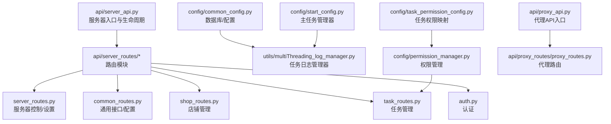
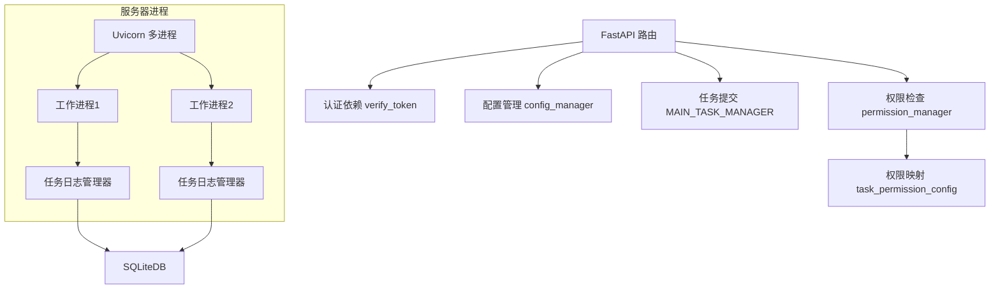
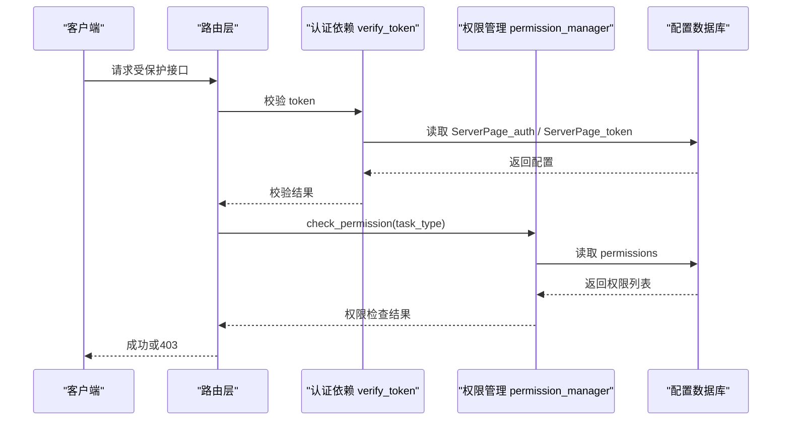
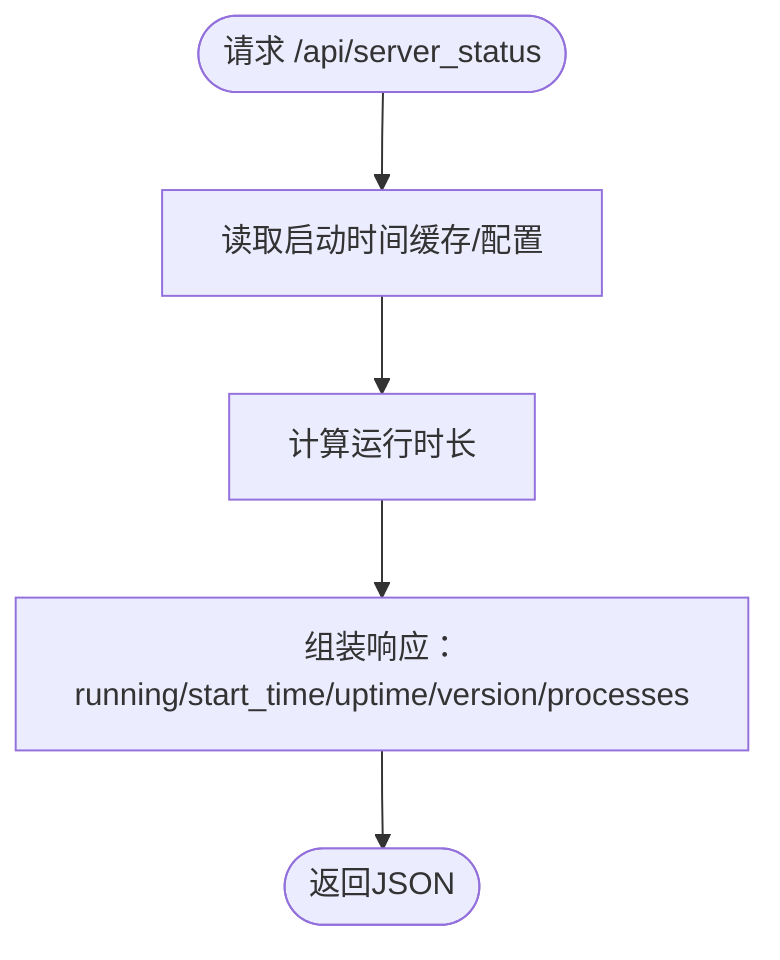
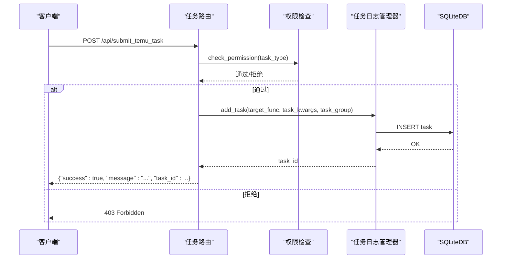
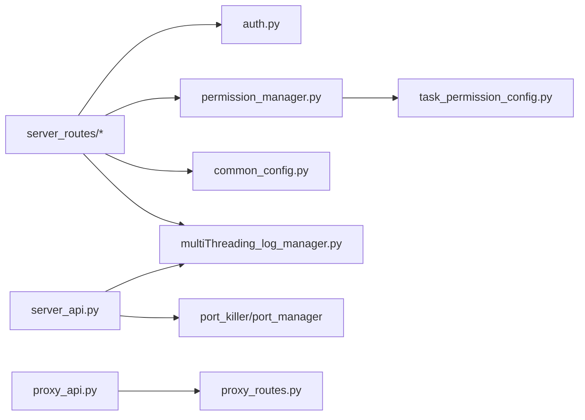

# 服务器接口

<cite>
**本文引用的文件**
- [api/server_api.py](file://api/server_api.py)
- [api/server_routes/server_routes.py](file://api/server_routes/server_routes.py)
- [api/server_routes/auth.py](file://api/server_routes/auth.py)
- [api/server_routes/common_routes.py](file://api/server_routes/common_routes.py)
- [api/server_routes/shop_routes.py](file://api/server_routes/shop_routes.py)
- [api/server_routes/task_routes.py](file://api/server_routes/task_routes.py)
- [config/common_config.py](file://config/common_config.py)
- [config/permission_manager.py](file://config/permission_manager.py)
- [config/task_permission_config.py](file://config/task_permission_config.py)
- [utils/multiThreading_log_manager.py](file://utils/multiThreading_log_manager.py)
- [config/start_config.py](file://config/start_config.py)
- [api/proxy_api.py](file://api/proxy_api.py)
- [api/proxy_routes/proxy_routes.py](file://api/proxy_routes/proxy_routes.py)
</cite>

## 目录
1. [简介](#简介)
2. [项目结构](#项目结构)
3. [核心组件](#核心组件)
4. [架构总览](#架构总览)
5. [详细组件分析](#详细组件分析)
6. [依赖分析](#依赖分析)
7. [性能考虑](#性能考虑)
8. [故障排查指南](#故障排查指南)
9. [结论](#结论)
10. [附录](#附录)

## 简介
本文件为 ikun_temu_system 的服务器接口文档，面向后端与前端开发者，系统性说明基于 FastAPI 的本地服务器接口设计原则、实现细节、认证与权限控制、数据模型与业务规则、性能考量与最佳实践，并提供接口调用示例与测试调试建议。接口覆盖服务器状态与控制、系统设置与配置、店铺管理、任务调度与执行、代理接口等模块。

## 项目结构
- 服务器入口与生命周期管理：api/server_api.py
- 路由模块：
  - 服务器控制与设置：api/server_routes/server_routes.py
  - 通用接口与配置：api/server_routes/common_routes.py
  - 店铺管理：api/server_routes/shop_routes.py
  - 任务管理：api/server_routes/task_routes.py
  - 认证：api/server_routes/auth.py
- 配置与权限：
  - 通用配置与数据库：config/common_config.py
  - 权限管理：config/permission_manager.py
  - 任务权限映射：config/task_permission_config.py
- 任务执行与日志：
  - 任务日志管理器：utils/multiThreading_log_manager.py
  - 主任务管理器：config/start_config.py
- 代理接口：
  - 代理API入口：api/proxy_api.py
  - 代理路由：api/proxy_routes/proxy_routes.py

图表来源
- [api/server_api.py:122-247](file://api/server_api.py#L122-L247)
- [api/server_routes/server_routes.py:11-100](file://api/server_routes/server_routes.py#L11-L100)
- [api/server_routes/common_routes.py:12-125](file://api/server_routes/common_routes.py#L12-L125)
- [api/server_routes/shop_routes.py:16-120](file://api/server_routes/shop_routes.py#L16-L120)
- [api/server_routes/task_routes.py:26-65](file://api/server_routes/task_routes.py#L26-L65)
- [config/common_config.py:156-220](file://config/common_config.py#L156-L220)
- [utils/multiThreading_log_manager.py:122-196](file://utils/multiThreading_log_manager.py#L122-L196)
- [config/permission_manager.py:12-126](file://config/permission_manager.py#L12-L126)
- [config/task_permission_config.py:7-47](file://config/task_permission_config.py#L7-L47)
- [config/start_config.py:19-24](file://config/start_config.py#L19-L24)
- [api/proxy_api.py:21-35](file://api/proxy_api.py#L21-L35)
- [api/proxy_routes/proxy_routes.py:8-20](file://api/proxy_routes/proxy_routes.py#L8-L20)

章节来源
- [api/server_api.py:59-104](file://api/server_api.py#L59-L104)
- [api/server_routes/server_routes.py:11-100](file://api/server_routes/server_routes.py#L11-L100)
- [api/server_routes/common_routes.py:12-125](file://api/server_routes/common_routes.py#L12-L125)
- [api/server_routes/shop_routes.py:16-120](file://api/server_routes/shop_routes.py#L16-L120)
- [api/server_routes/task_routes.py:26-65](file://api/server_routes/task_routes.py#L26-L65)
- [config/common_config.py:156-220](file://config/common_config.py#L156-L220)
- [utils/multiThreading_log_manager.py:122-196](file://utils/multiThreading_log_manager.py#L122-L196)
- [config/permission_manager.py:12-126](file://config/permission_manager.py#L12-L126)
- [config/task_permission_config.py:7-47](file://config/task_permission_config.py#L7-L47)
- [config/start_config.py:19-24](file://config/start_config.py#L19-L24)
- [api/proxy_api.py:21-35](file://api/proxy_api.py#L21-L35)
- [api/proxy_routes/proxy_routes.py:8-20](file://api/proxy_routes/proxy_routes.py#L8-L20)

## 核心组件
- FastAPI 应用与生命周期
  - 通过 lifespan 管理任务日志管理器的启动与停止，确保多进程工作进程内的资源正确初始化与回收。
  - 注册 CORS 中间件、版本头中间件、静态资源与模板。
- 路由模块
  - 服务器控制与设置：提供服务器状态查询、启动/停止/重启、运行时长计算、特效设置读取与保存、系统设置读取与保存。
  - 通用接口：基础连通性测试、Token 获取、通用配置读取与保存、模板渲染。
  - 店铺管理：分页查询、状态检测、连接/断开连接、增删改查、记录清理、图片清理、连接配置读取/保存、JIT默认库存配置。
  - 任务管理：提交Temu任务、提交爬虫任务、定时任务、搜索类目、类目结果保存与获取、任务列表查询与分页筛选。
  - 认证：基于 Query 参数的 token 校验，支持开关认证。
- 配置与权限
  - 通用配置：数据库初始化、并发配置、雪花ID生成器、加密器。
  - 权限管理：权限保存/加载/清除，任务权限映射与检查。
- 任务执行与日志
  - 任务日志管理器：统一的任务创建、并发控制、状态更新、日志写入、定时任务执行器集成。
  - 主任务管理器：全局并发上限、任务超时、轮询策略等。

章节来源
- [api/server_api.py:40-56](file://api/server_api.py#L40-L56)
- [api/server_routes/server_routes.py:91-289](file://api/server_routes/server_routes.py#L91-L289)
- [api/server_routes/common_routes.py:15-241](file://api/server_routes/common_routes.py#L15-L241)
- [api/server_routes/shop_routes.py:19-511](file://api/server_routes/shop_routes.py#L19-L511)
- [api/server_routes/task_routes.py:66-800](file://api/server_routes/task_routes.py#L66-L800)
- [config/common_config.py:156-394](file://config/common_config.py#L156-L394)
- [utils/multiThreading_log_manager.py:122-800](file://utils/multiThreading_log_manager.py#L122-L800)
- [config/permission_manager.py:12-126](file://config/permission_manager.py#L12-L126)
- [config/task_permission_config.py:55-84](file://config/task_permission_config.py#L55-L84)

## 架构总览
服务器采用多进程 + 多工作进程的 Uvicorn 启动模式，每个工作进程独立持有任务日志管理器实例，负责任务的创建、并发控制、状态更新与日志写入。路由层通过依赖注入完成认证与权限校验，配置层提供统一的数据库与并发参数，代理接口独立于主服务器运行。

图表来源
- [api/server_api.py:122-247](file://api/server_api.py#L122-L247)
- [utils/multiThreading_log_manager.py:122-196](file://utils/multiThreading_log_manager.py#L122-L196)
- [config/permission_manager.py:12-126](file://config/permission_manager.py#L12-L126)
- [config/task_permission_config.py:55-84](file://config/task_permission_config.py#L55-L84)
- [config/common_config.py:156-220](file://config/common_config.py#L156-L220)

## 详细组件分析

### 认证与权限
- 认证机制
  - 通过 Query 参数 token 进行校验；是否启用认证由配置项控制。
  - 未通过认证时返回 403 并设置 WWW-Authenticate 头。
- 权限控制
  - 任务类型与权限映射：不同权限（如 temu、caiwu、spider）对应不同任务类型。
  - 权限检查流程：加载用户权限 -> 查找任务所需权限 -> 判断是否包含。

图表来源
- [api/server_routes/auth.py:7-19](file://api/server_routes/auth.py#L7-L19)
- [config/permission_manager.py:106-122](file://config/permission_manager.py#L106-L122)
- [config/task_permission_config.py:55-84](file://config/task_permission_config.py#L55-L84)

章节来源
- [api/server_routes/auth.py:7-19](file://api/server_routes/auth.py#L7-L19)
- [config/permission_manager.py:12-126](file://config/permission_manager.py#L12-L126)
- [config/task_permission_config.py:7-47](file://config/task_permission_config.py#L7-L47)

### 服务器控制与设置
- 服务器状态
  - GET /api/server_status：返回运行状态、启动时间、运行时长、版本与进程信息。
- 特效设置
  - GET /api/get_effect_settings：读取特效开关、主题、CDN模式、背景音乐等。
  - POST /api/save_effect_settings：保存特效设置，返回是否需要刷新页面。
- 系统设置
  - GET /api/get_settings：读取服务器运行参数（IP、端口、进程数、worker数、重启间隔、认证开关、CDN模式、背景音乐等）。
  - POST /api/save_settings：保存服务器运行参数。
- 服务器控制
  - POST /api/start_server / /api/stop_server / /api/restart_server：启动/停止/重启服务器（当前实现为占位返回）。

图表来源
- [api/server_routes/server_routes.py:91-108](file://api/server_routes/server_routes.py#L91-L108)
- [api/server_routes/server_routes.py:75-88](file://api/server_routes/server_routes.py#L75-L88)

章节来源
- [api/server_routes/server_routes.py:91-289](file://api/server_routes/server_routes.py#L91-L289)

### 通用接口与配置
- 基础连通性测试
  - GET /test：返回服务运行状态。
- Token 获取
  - GET /api/get_token：返回当前服务器 token。
- 通用配置
  - GET /api/get_settings：读取服务器运行参数（含认证开关、日志清理配置、背景音乐、CDN模式等）。
  - POST /api/save_settings：保存服务器运行参数（注意：token 放在最后保存以确保后续校验使用最新 token）。
- 模板渲染
  - GET /：返回模板页面，注入权限与特效配置。

章节来源
- [api/server_routes/common_routes.py:15-241](file://api/server_routes/common_routes.py#L15-L241)

### 店铺管理
- 分页查询
  - GET /api/page：支持关键词（名称/缩写/Browser ID）、排序字段与顺序、分页大小与页码。
- 状态检测
  - GET /api/check_shop_status：根据 uid 查询连接状态。
- 连接控制
  - POST /api/toggle_shop_connection/test：提交连接测试任务。
  - POST /api/toggle_shop_connection：提交连接任务（支持登录类型、是否重载Cookies、无头模式、窗口大小等）。
- 增删改查
  - POST /api/add_shop：新增店铺。
  - POST /api/modify_shop：修改店铺信息。
  - POST /api/delete_shop：删除店铺。
- 记录与图片管理
  - POST /api/delete_record_page：删除记录（支持全量清空）。
  - GET /api/delete_images：清理历史图片。
- 连接配置
  - POST /api/get_connect_shop_config：读取/保存连接配置（登录类型、是否重载Cookies、无头模式、窗口大小等）。
- JIT默认库存
  - POST /api/jit_default_config：读取/设置JIT默认库存数量。

章节来源
- [api/server_routes/shop_routes.py:19-511](file://api/server_routes/shop_routes.py#L19-L511)

### 任务管理
- 提交任务
  - POST /api/submit_temu_task：提交Temu任务（支持多店铺、维护任务标记、任务参数透传）。
  - POST /api/submit_spider_task：提交爬虫任务（支持定时任务配置）。
- 搜索类目
  - POST /api/search_category：登录后触发搜索类目任务。
  - POST /api/get_search_category_result：轮询获取类目搜索结果。
  - POST /api/save_saved_category_list / /api/delete_saved_category / /api/save_search_category_results / /api/get_saved_category_list / /api/get_search_category_results：类目结果的增删改查与持久化。
- 任务列表
  - POST /api/get_tasks：支持多条件筛选（状态、任务ID/列表、任务类型、店铺简称、是否主任务、定时任务标记）与分页。

图表来源
- [api/server_routes/task_routes.py:66-230](file://api/server_routes/task_routes.py#L66-L230)
- [utils/multiThreading_log_manager.py:596-635](file://utils/multiThreading_log_manager.py#L596-L635)
- [config/permission_manager.py:106-122](file://config/permission_manager.py#L106-L122)

章节来源
- [api/server_routes/task_routes.py:66-800](file://api/server_routes/task_routes.py#L66-L800)
- [utils/multiThreading_log_manager.py:122-800](file://utils/multiThreading_log_manager.py#L122-L800)

### 代理接口
- 接收代理
  - POST /send_proxies：接收代理列表并设置为当前可用代理。
- 连通性测试
  - GET / 与 POST /：基础连通性测试。
- 代理管理
  - GET /get_proxies：获取有效代理。
  - GET /get_all_proxies：获取全部代理。
  - GET /clean_proxies：清空代理列表。
- 代理测试
  - POST /test_proxy：多线程测试代理有效性，返回统计与本机IP测试结果。
  - GET /test_proxy_result：获取测试进度与统计。
  - GET /test_proxy_use_all：将全部代理设为有效。
- 本地IP测试
  - POST /test_local_ip：测试本机IP连通性。
  - GET /get_local_ip：获取本机IP。
  - GET /get_proxy_stats：获取代理统计。
  - GET /get_random_proxy：获取随机有效代理。

章节来源
- [api/proxy_routes/proxy_routes.py:20-218](file://api/proxy_routes/proxy_routes.py#L20-L218)
- [api/proxy_api.py:40-128](file://api/proxy_api.py#L40-L128)

## 依赖分析
- 组件耦合
  - 路由层依赖认证与权限模块，任务路由依赖任务日志管理器与权限管理器。
  - 任务日志管理器依赖数据库与配置管理器，负责任务状态与日志持久化。
  - 服务器入口依赖任务日志管理器与端口管理模块，负责多进程启动与资源回收。
- 外部依赖
  - FastAPI/Uvicorn：Web框架与ASGI服务器。
  - Loguru：日志记录。
  - Psutil：进程管理与清理。
  - SQLiteDB：本地数据库访问。

图表来源
- [api/server_routes/server_routes.py:8-12](file://api/server_routes/server_routes.py#L8-L12)
- [config/permission_manager.py:12-126](file://config/permission_manager.py#L12-L126)
- [config/task_permission_config.py:55-84](file://config/task_permission_config.py#L55-L84)
- [config/common_config.py:156-220](file://config/common_config.py#L156-L220)
- [utils/multiThreading_log_manager.py:122-196](file://utils/multiThreading_log_manager.py#L122-L196)
- [api/server_api.py:122-247](file://api/server_api.py#L122-L247)
- [api/proxy_api.py:21-35](file://api/proxy_api.py#L21-L35)

章节来源
- [api/server_api.py:122-247](file://api/server_api.py#L122-L247)
- [utils/multiThreading_log_manager.py:122-196](file://utils/multiThreading_log_manager.py#L122-L196)
- [config/common_config.py:156-220](file://config/common_config.py#L156-L220)

## 性能考虑
- 并发控制
  - 全局最大并发与按功能分组并发限制，动态更新生效。
  - 任务执行前获取全局与分组信号量，避免超卖资源。
- 数据库优化
  - WAL 模式、缓存大小、同步级别等参数优化。
  - 任务日志写入采用批量更新，减少IO压力。
- 任务管理
  - 任务创建即持久化，避免内存缓存导致的丢失。
  - 支持主任务清理子任务，避免重复执行。
- 服务器启动
  - 多进程启动，端口释放与强制清理，降低启动失败率。

章节来源
- [utils/multiThreading_log_manager.py:672-682](file://utils/multiThreading_log_manager.py#L672-L682)
- [config/common_config.py:156-220](file://config/common_config.py#L156-L220)
- [api/server_api.py:169-211](file://api/server_api.py#L169-L211)

## 故障排查指南
- 认证失败
  - 检查 ServerPage_auth 与 ServerPage_token 配置，确认请求是否携带正确的 token。
- 权限不足
  - 检查 permissions 配置与任务权限映射，确认用户具备执行任务的权限。
- 任务执行异常
  - 查看任务状态与备注字段，定位失败原因；验证码场景会标记为“验证码”状态。
- 服务器启动失败
  - 端口占用：使用端口管理器释放端口，必要时强制结束占用进程。
  - 多进程退出：通过进程守护清理残留进程，确保端口可用。
- 代理接口异常
  - 检查代理列表是否有效，测试线程数与超时设置；查看代理统计与本机IP测试结果。

章节来源
- [api/server_routes/auth.py:12-19](file://api/server_routes/auth.py#L12-L19)
- [config/permission_manager.py:106-122](file://config/permission_manager.py#L106-L122)
- [utils/multiThreading_log_manager.py:783-800](file://utils/multiThreading_log_manager.py#L783-L800)
- [api/server_api.py:169-211](file://api/server_api.py#L169-L211)
- [api/proxy_routes/proxy_routes.py:82-145](file://api/proxy_routes/proxy_routes.py#L82-L145)

## 结论
本服务器接口以 FastAPI 为基础，结合统一的认证与权限体系、灵活的任务调度与日志管理、完善的配置与并发控制，形成稳定可靠的本地服务。通过清晰的路由模块划分与严格的错误处理，满足多场景下的任务执行与管理需求。建议在生产环境中合理配置并发与重启策略，完善监控与日志轮转，确保长期稳定运行。

## 附录

### 接口清单与调用示例（摘要）
- 服务器控制与设置
  - GET /api/server_status：获取服务器状态
  - GET /api/get_effect_settings：获取特效设置
  - POST /api/save_effect_settings：保存特效设置
  - GET /api/get_settings：获取系统设置
  - POST /api/save_settings：保存系统设置
  - POST /api/start_server / /api/stop_server / /api/restart_server：服务器启停重启
- 通用接口
  - GET /test：连通性测试
  - GET /api/get_token：获取Token
  - GET /api/get_settings：获取服务器配置
  - POST /api/save_settings：保存服务器配置
  - GET /：模板页面
- 店铺管理
  - GET /api/page：分页查询
  - GET /api/check_shop_status：状态检测
  - POST /api/toggle_shop_connection/test：连接测试
  - POST /api/toggle_shop_connection：连接/断开连接
  - POST /api/add_shop / /api/modify_shop / /api/delete_shop：增删改查
  - POST /api/delete_record_page：删除记录
  - GET /api/delete_images：清理图片
  - POST /api/get_connect_shop_config：连接配置读取/保存
  - POST /api/jit_default_config：JIT默认库存配置
- 任务管理
  - POST /api/submit_temu_task：提交Temu任务
  - POST /api/submit_spider_task：提交爬虫任务
  - POST /api/search_category：登录后触发搜索类目
  - POST /api/get_search_category_result：轮询获取类目结果
  - POST /api/save_saved_category_list / /api/delete_saved_category / /api/save_search_category_results / /api/get_saved_category_list / /api/get_search_category_results：类目结果管理
  - POST /api/get_tasks：任务列表查询与分页筛选
- 代理接口
  - POST /send_proxies：接收代理
  - GET / 与 POST /：连通性测试
  - GET /get_proxies / /get_all_proxies / /clean_proxies：代理管理
  - POST /test_proxy：代理测试
  - GET /test_proxy_result：测试结果
  - GET /test_proxy_use_all：使用全部代理
  - POST /test_local_ip：本机IP测试
  - GET /get_local_ip：获取本机IP
  - GET /get_proxy_stats：代理统计
  - GET /get_random_proxy：随机代理

章节来源
- [api/server_routes/server_routes.py:91-289](file://api/server_routes/server_routes.py#L91-L289)
- [api/server_routes/common_routes.py:15-241](file://api/server_routes/common_routes.py#L15-L241)
- [api/server_routes/shop_routes.py:19-511](file://api/server_routes/shop_routes.py#L19-L511)
- [api/server_routes/task_routes.py:66-800](file://api/server_routes/task_routes.py#L66-L800)
- [api/proxy_routes/proxy_routes.py:20-218](file://api/proxy_routes/proxy_routes.py#L20-L218)