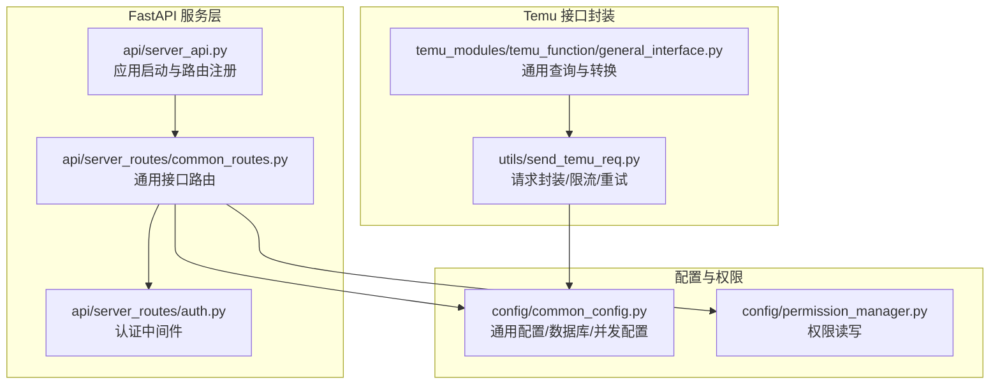
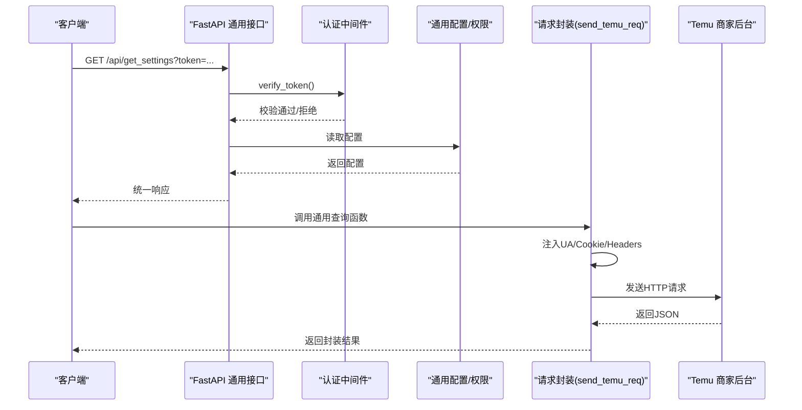
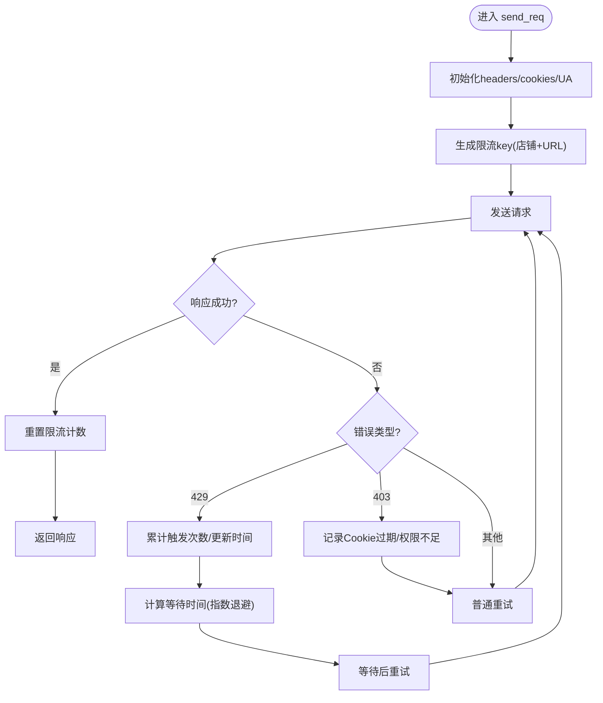
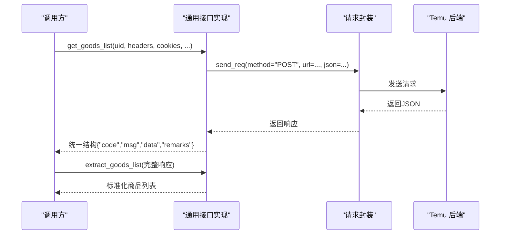
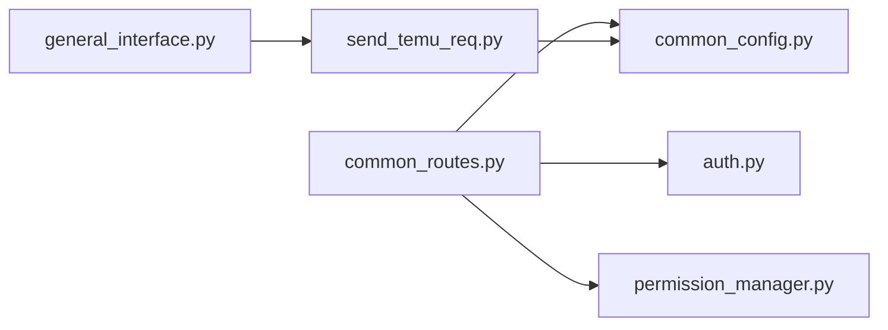

# 通用接口

<cite>
**本文引用的文件**
- [通用接口实现](file://temu_modules/temu_function/general_interface.py)
- [通用接口路由](file://api/server_routes/common_routes.py)
- [服务器API入口](file://api/server_api.py)
- [认证中间件](file://api/server_routes/auth.py)
- [通用配置与数据库](file://config/common_config.py)
- [权限管理](file://config/permission_manager.py)
- [Temu请求封装](file://utils/send_temu_req.py)
- [任务路由（参考）](file://api/server_routes/task_routes.py)
</cite>

## 目录
1. [简介](#简介)
2. [项目结构](#项目结构)
3. [核心组件](#核心组件)
4. [架构总览](#架构总览)
5. [详细组件分析](#详细组件分析)
6. [依赖关系分析](#依赖关系分析)
7. [性能考量](#性能考量)
8. [故障排查指南](#故障排查指南)
9. [结论](#结论)
10. [附录](#附录)

## 简介
本文件面向 ikun_temu_system 的“通用接口”，系统性梳理其设计原则、实现细节、认证与权限控制、数据模型与业务规则、调用示例与错误处理、性能与最佳实践，以及测试与调试建议。通用接口既包含本地 FastAPI 提供的通用管理接口，也包含对接 Temu 商家后台的通用请求封装能力。

## 项目结构
通用接口相关模块分布如下：
- 通用管理接口（FastAPI）：位于 api/server_routes/common_routes.py，通过 api/server_api.py 注册到主应用。
- 认证与权限：认证依赖 api/server_routes/auth.py；权限数据存储于数据库并通过 config/permission_manager.py 管理。
- Temu 通用请求封装：位于 utils/send_temu_req.py，提供统一的请求发送、UA 注入、限流与重试逻辑。
- 通用接口实现：位于 temu_modules/temu_function/general_interface.py，封装商品列表、上新生命周期、价格组等通用查询与转换逻辑。

图表来源
- [服务器API入口:96-100](file://api/server_api.py#L96-L100)
- [通用接口路由:16-23](file://api/server_routes/common_routes.py#L16-L23)
- [认证中间件:7-19](file://api/server_routes/auth.py#L7-L19)
- [通用配置与数据库:344-376](file://config/common_config.py#L344-L376)
- [权限管理:12-123](file://config/permission_manager.py#L12-L123)
- [Temu请求封装:64-198](file://utils/send_temu_req.py#L64-L198)
- [通用接口实现:7-82](file://temu_modules/temu_function/general_interface.py#L7-L82)

章节来源
- [服务器API入口:96-100](file://api/server_api.py#L96-L100)
- [通用接口路由:16-23](file://api/server_routes/common_routes.py#L16-L23)
- [认证中间件:7-19](file://api/server_routes/auth.py#L7-L19)
- [通用配置与数据库:344-376](file://config/common_config.py#L344-L376)
- [权限管理:12-123](file://config/permission_manager.py#L12-L123)
- [Temu请求封装:64-198](file://utils/send_temu_req.py#L64-L198)
- [通用接口实现:7-82](file://temu_modules/temu_function/general_interface.py#L7-L82)

## 核心组件
- 通用管理接口（FastAPI）
  - 提供基础连通性测试、获取/保存服务器配置、获取指定配置项等接口。
  - 采用依赖注入进行认证校验，统一响应结构。
- 认证与权限
  - 通过 Query 参数携带 token，按配置开关启用/禁用认证。
  - 权限数据存储于数据库，支持保存、加载与检查。
- 请求封装与限流
  - 统一 UA 注入（基于 mallid 与固定随机种子）、Cookie 注入、会话复用。
  - 动态 429 等限流退避策略，指数回退上限控制。
- 通用查询与转换
  - 商品列表查询、上新生命周期查询、价格组提取、SKC/SPU 映射与快速查询。

章节来源
- [通用接口路由:16-241](file://api/server_routes/common_routes.py#L16-L241)
- [认证中间件:7-19](file://api/server_routes/auth.py#L7-L19)
- [权限管理:12-123](file://config/permission_manager.py#L12-L123)
- [Temu请求封装:64-198](file://utils/send_temu_req.py#L64-L198)
- [通用接口实现:7-326](file://temu_modules/temu_function/general_interface.py#L7-L326)

## 架构总览
通用接口整体交互流程如下：

图表来源
- [通用接口路由:87-124](file://api/server_routes/common_routes.py#L87-L124)
- [认证中间件:7-19](file://api/server_routes/auth.py#L7-L19)
- [通用配置与数据库:344-376](file://config/common_config.py#L344-L376)
- [Temu请求封装:64-198](file://utils/send_temu_req.py#L64-L198)

## 详细组件分析

### 通用管理接口（FastAPI）
- 基础连通性测试
  - 方法：GET
  - 路径：/test
  - 认证：依赖 verify_token
  - 响应：统一结构，包含 code、success、message
- 获取服务器配置
  - 方法：GET
  - 路径：/api/get_settings
  - 认证：依赖 verify_token
  - 响应：success + data（包含内网IP、外网IP、端口、进程数、worker数、token、认证开关、线程模式、运行模式、重启间隔、日志清理配置、背景音乐配置、CDN模式等）
- 保存服务器配置
  - 方法：POST
  - 路径：/api/save_settings
  - 认证：依赖 verify_token
  - 请求体：JSON，字段与保存逻辑一一对应
  - 响应：success + message；异常时返回 500 JSONResponse
- 获取指定配置项
  - 方法：GET
  - 路径：/get_setting
  - 参数：name（字符串）
  - 响应：success + value；异常时返回 500 JSONResponse

统一响应结构
- 成功：{"success": true, ...}
- 失败：{"success": false, "error_msg": "..."}（部分接口）

章节来源
- [通用接口路由:16-241](file://api/server_routes/common_routes.py#L16-L241)

### 认证机制与权限控制
- 认证
  - 通过 Query 参数 token 进行校验。
  - 读取配置开关 ServerPage_auth 与 ServerPage_token，若开启且不匹配则 403。
- 权限
  - 权限保存在数据库 config 表，key="permissions"。
  - 支持保存、加载、清除、检查权限。
  - 通用接口路由中使用 verify_token 依赖进行鉴权。

章节来源
- [认证中间件:7-19](file://api/server_routes/auth.py#L7-L19)
- [权限管理:12-123](file://config/permission_manager.py#L12-L123)

### 请求封装与限流（Temu）
- 统一请求入口
  - send_req(uid, method, url, ..., headers, cookies, timeout, max_retries, log, append_headers)
  - 自动注入 mallid、User-Agent（基于 mallid 固定随机 UA）、Cookie mallid。
  - Session 复用，减少握手开销。
- 限流与重试
  - 对 429 Too Many Requests 动态退避：按触发次数指数增长等待，上限控制。
  - 对 403 Forbidden 记录 Cookie 过期/权限不足。
  - 基础异常重试，最多 max_retries 次。
- 速率限制状态
  - 全局字典记录店铺+URL 维度的限流状态，定期清理过期键。

图表来源
- [Temu请求封装:64-198](file://utils/send_temu_req.py#L64-L198)

章节来源
- [Temu请求封装:64-198](file://utils/send_temu_req.py#L64-L198)

### 通用查询与转换（Temu）
- 商品列表查询
  - 方法：POST
  - URL：agentseller.temu.com/visage-agent-seller/product/skc/pageQuery
  - 请求参数：page/pageSize、可选过滤列表（skc_id_list/spu_id_list/sku_id_list/cat_id_list/skcTopStatus）
  - 返回：统一结构 {"code": 1/-1, "msg": "...", "data": 原始响应, "remarks": "..."}
- 商品列表提取
  - 输入：商品列表完整响应
  - 输出：标准化结构，包含 spu_id/skc_id/类目信息/货号，以及 SKU 列表（含 extCode、尺码、virtualStock）
- 上新生命周期查询
  - 方法：POST
  - URL：agentseller.temu.com/api/kiana/mms/robin/searchForChainSupplier
  - 类型参数 type：
    - "search_skc_id"：按 spu_id_list 搜索 skc
    - "jit"：JIT 模式，支持 time_type/time_begin/time_end
    - 默认：搜索异常核价订单，支持时间筛选
  - 返回：统一结构
- 价格组提取
  - 输入：核价页默认 10 条 skc 的 JSON
  - 输出：包含 total/num/price_group/skc_spu
  - price_group 字段：skcId/spuId/skuId/priceOrderId/current_price/suggest_supply_price/leimu/size/times
  - skc_spu：去重后的 skc-spu 对
- SKC/SPU 映射与快速查询
  - build_skc_spu_dict：建立 skc->spu 与 spu->skc 的双向映射
  - quick_get_related_id：根据输入 ID（字符串/整数）快速查询关联 ID

图表来源
- [通用接口实现:7-112](file://temu_modules/temu_function/general_interface.py#L7-L112)
- [Temu请求封装:64-198](file://utils/send_temu_req.py#L64-L198)

章节来源
- [通用接口实现:7-326](file://temu_modules/temu_function/general_interface.py#L7-L326)
- [Temu请求封装:64-198](file://utils/send_temu_req.py#L64-L198)

## 依赖关系分析
- 通用接口路由依赖认证中间件与配置管理器。
- 通用查询实现依赖请求封装与日志工具。
- 请求封装依赖数据库（读取 shop 信息）与配置管理器（UA 生成）。
- 权限管理依赖数据库与配置管理器。

图表来源
- [通用接口路由:9-10](file://api/server_routes/common_routes.py#L9-L10)
- [认证中间件](file://api/server_routes/auth.py#L4)
- [通用配置与数据库:344-376](file://config/common_config.py#L344-L376)
- [权限管理:25-79](file://config/permission_manager.py#L25-L79)
- [通用接口实现:1-5](file://temu_modules/temu_function/general_interface.py#L1-L5)
- [Temu请求封装](file://utils/send_temu_req.py#L10)

章节来源
- [通用接口路由:9-10](file://api/server_routes/common_routes.py#L9-L10)
- [认证中间件](file://api/server_routes/auth.py#L4)
- [通用配置与数据库:344-376](file://config/common_config.py#L344-L376)
- [权限管理:25-79](file://config/permission_manager.py#L25-L79)
- [通用接口实现:1-5](file://temu_modules/temu_function/general_interface.py#L1-L5)
- [Temu请求封装](file://utils/send_temu_req.py#L10)

## 性能考量
- 会话复用与连接复用：请求封装使用 Session，减少握手开销。
- UA 固定随机：基于 mallid 的固定随机 UA，提升稳定性与识别一致性。
- 限流退避：针对 429 动态指数退避，避免雪崩效应，同时设置最大等待时间上限。
- 并发与配置：全局并发配置来自配置管理器，任务并发字典集中管理。
- 日志清理：支持热更新日志清理器配置，避免日志膨胀影响性能。

章节来源
- [Temu请求封装:64-198](file://utils/send_temu_req.py#L64-L198)
- [通用配置与数据库:344-376](file://config/common_config.py#L344-L376)

## 故障排查指南
- 认证失败
  - 现象：403 Forbidden，提示 token 不正确。
  - 排查：确认 ServerPage_auth 开关与 ServerPage_token 值，确保请求 Query 参数 token 与配置一致。
- 请求失败/超时
  - 现象：网络异常或请求被拦截，状态码非 200。
  - 排查：检查 headers/cookies/mallid 注入是否正确；查看日志中重试次数与错误信息；确认代理/防火墙策略。
- 429 限流
  - 现象：频繁触发限流，响应延迟增加。
  - 排查：观察限流退避日志；适当降低并发或增大重试间隔；检查是否对同一店铺/同一 URL 高频请求。
- Cookie 过期/权限不足
  - 现象：403 Forbidden。
  - 排查：重新登录获取最新 Cookie；确认权限配置是否正确。
- 配置读取异常
  - 现象：获取/保存配置失败。
  - 排查：检查配置管理器 upsert/get_or_set 流程；确认数据库连接与表结构初始化是否完成。

章节来源
- [认证中间件:12-18](file://api/server_routes/auth.py#L12-L18)
- [Temu请求封装:163-196](file://utils/send_temu_req.py#L163-L196)
- [通用接口路由:119-124](file://api/server_routes/common_routes.py#L119-L124)

## 结论
通用接口在本项目中承担了本地管理与外部 Temu 请求的双重职责。通过统一的认证与权限体系、可配置的并发与限流策略、以及标准化的响应结构，实现了稳定、可扩展、易维护的接口能力。建议在生产环境中结合日志清理与限流策略，持续监控接口健康度与性能表现。

## 附录

### 接口清单与调用示例（路径与参数）
- 基础连通性测试
  - 方法：GET
  - 路径：/test
  - 认证：必需
  - 示例：curl -G "http://host:port/test?token=your_token"
- 获取服务器配置
  - 方法：GET
  - 路径：/api/get_settings
  - 认证：必需
  - 示例：curl -G "http://host:port/api/get_settings?token=your_token"
- 保存服务器配置
  - 方法：POST
  - 路径：/api/save_settings
  - 认证：必需
  - 请求体：JSON（字段与保存逻辑一致）
  - 示例：curl -X POST "http://host:port/api/save_settings?token=your_token" -H "Content-Type: application/json" -d '{}'
- 获取指定配置项
  - 方法：GET
  - 路径：/get_setting
  - 参数：name（字符串）
  - 示例：curl -G "http://host:port/get_setting?token=your_token&name=ServerPage_port"

章节来源
- [通用接口路由:16-241](file://api/server_routes/common_routes.py#L16-L241)

### 数据模型与业务规则
- 统一响应结构
  - 成功：{"success": true, ...}
  - 失败：{"success": false, "error_msg": "..."}
- 配置项
  - ServerPage_auth：是否启用认证
  - ServerPage_token：认证令牌
  - ServerPage_port/process_count/worker_per_proc：服务端口与进程/worker 配置
  - 日志清理配置：auto_clean_log_enabled/log_char_threshold/log_keep_ratio
  - 背景音乐配置：background_music_enabled/background_music_autoplay/background_music_url
  - CDN 模式：Settings_cdn_mode
- 权限模型
  - permissions：JSON 字符串，保存权限列表
  - 支持保存、加载、清除、检查权限

章节来源
- [通用接口路由:87-238](file://api/server_routes/common_routes.py#L87-L238)
- [权限管理:12-123](file://config/permission_manager.py#L12-L123)
- [通用配置与数据库:344-376](file://config/common_config.py#L344-L376)

### 测试指南与调试技巧
- 单元测试建议
  - 使用 FastAPI TestClient 对通用接口进行集成测试，覆盖认证、配置读取、保存与异常路径。
  - 对请求封装进行隔离测试，模拟 429/403/超时等场景，验证退避与重试逻辑。
- 调试技巧
  - 启用详细日志，关注限流退避与重试次数。
  - 使用浏览器开发者工具抓包，核对 mallid、anti-content、User-Agent 注入是否正确。
  - 对比不同 mallid 的 UA 生成结果，确保固定随机 UA 一致性。
- 常见问题定位
  - 认证失败：核对 token 与开关。
  - 429：降低请求频率或增大等待时间。
  - 403：重新登录并刷新 Cookie。

章节来源
- [通用接口路由:119-124](file://api/server_routes/common_routes.py#L119-L124)
- [Temu请求封装:163-196](file://utils/send_temu_req.py#L163-L196)