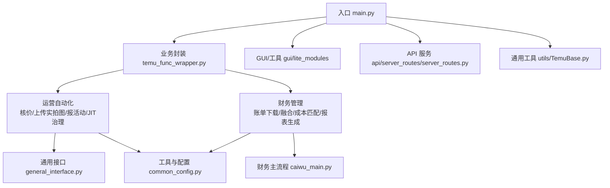
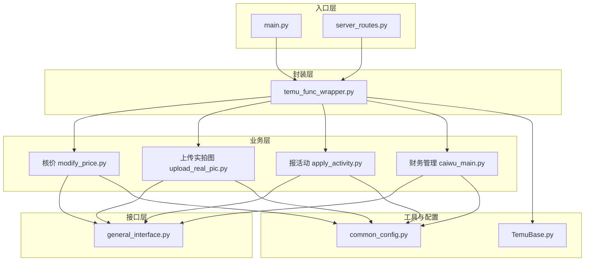
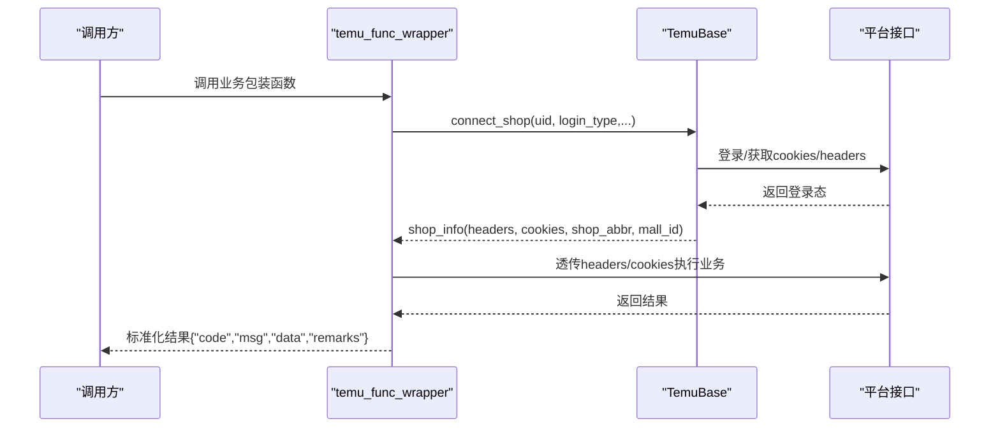
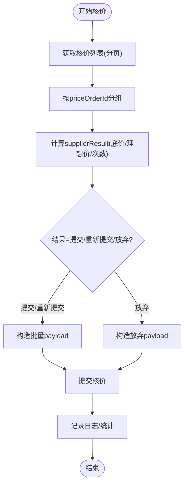
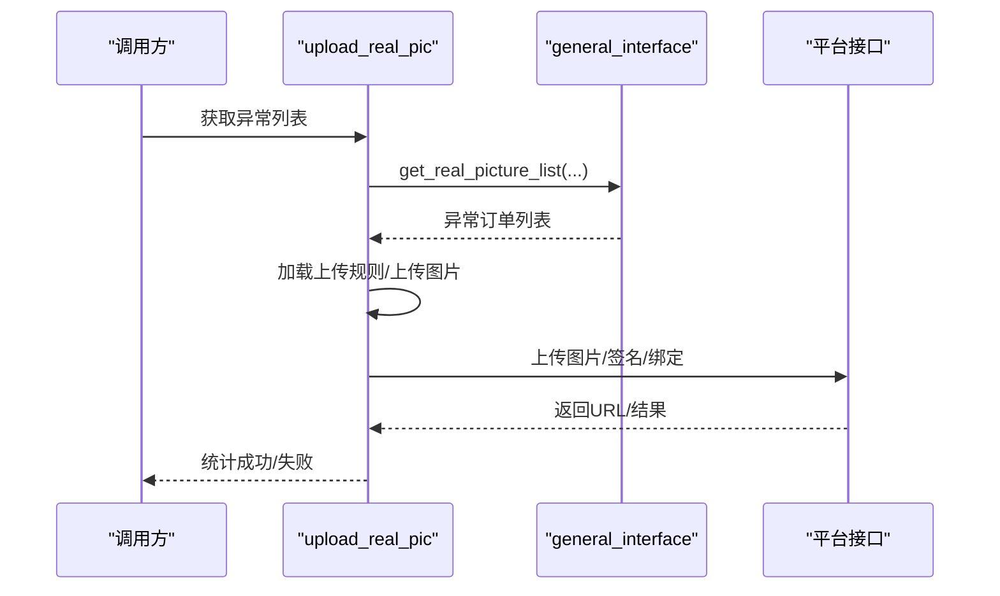
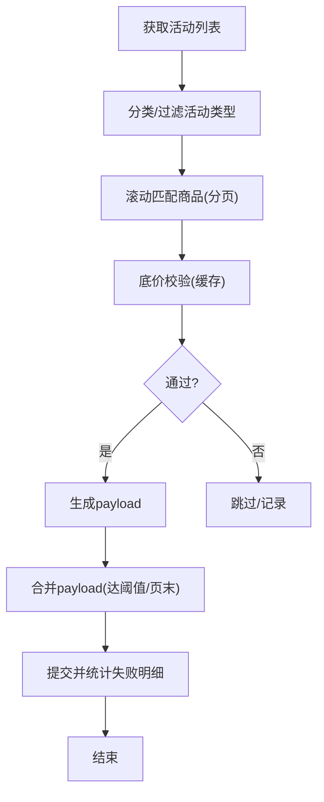
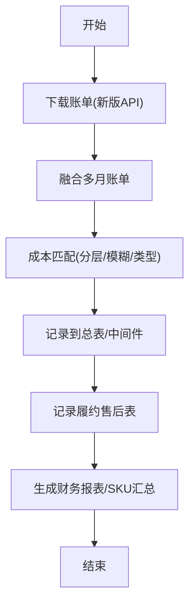
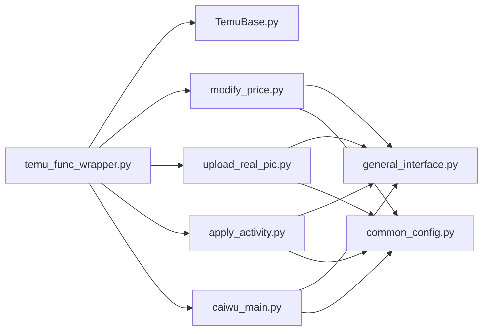
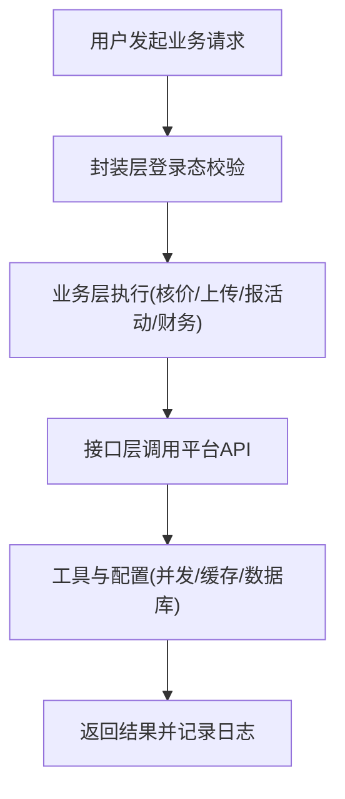

# 业务功能模块

<cite>
**本文档引用的文件**
- [main.py](file://main.py)
- [temu_func_wrapper.py](file://temu_modules/temu_func_wrapper.py)
- [caiwu_main.py](file://temu_modules/temu_function/caiwu_func/caiwu_main.py)
- [general_interface.py](file://temu_modules/temu_function/general_interface.py)
- [upload_real_pic.py](file://temu_modules/temu_function/upload_real_pic.py)
- [modify_price.py](file://temu_modules/temu_function/modify_price.py)
- [apply_activity.py](file://temu_modules/temu_function/apply_activity.py)
- [common_config.py](file://config/common_config.py)
- [TemuBase.py](file://utils/TemuBase.py)
- [server_routes.py](file://api/server_routes/server_routes.py)
</cite>

## 目录
1. [简介](#简介)
2. [项目结构](#项目结构)
3. [核心组件](#核心组件)
4. [架构总览](#架构总览)
5. [详细组件分析](#详细组件分析)
6. [依赖关系分析](#依赖关系分析)
7. [性能考量](#性能考量)
8. [故障排查指南](#故障排查指南)
9. [结论](#结论)
10. [附录](#附录)

## 简介
本文件面向 ikun_temu_system 的业务功能模块，系统性梳理 Temu 平台运营自动化、财务管理、数据爬取等核心能力，解释模块间的协作关系、数据流转与关键算法，提供配置项说明、扩展建议与二次开发指南。文档兼顾技术深度与可读性，帮助开发者快速理解与高效使用。

## 项目结构
项目采用“功能域+层次化”的组织方式：
- temu_modules：Temu 业务功能域，包含运营自动化（核价、上传实拍图、报活动、JIT治理等）与财务模块（账单下载、融合、成本匹配、报表生成）。
- config：系统配置与数据库初始化、并发配置、加密工具等。
- utils：通用工具（请求封装、日志、任务调度、数据库更新器等）。
- api：FastAPI 服务端接口（服务器状态、设置管理等）。
- gui/lite_modules/spider_modules：GUI界面、轻量工具、爬虫模块等。

图表来源
- [main.py:1-233](file://main.py#L1-L233)
- [temu_func_wrapper.py:1-697](file://temu_modules/temu_func_wrapper.py#L1-L697)
- [general_interface.py:1-326](file://temu_modules/temu_function/general_interface.py#L1-L326)
- [caiwu_main.py:1-940](file://temu_modules/temu_function/caiwu_func/caiwu_main.py#L1-L940)
- [common_config.py:1-394](file://config/common_config.py#L1-L394)
- [TemuBase.py:1-656](file://utils/TemuBase.py#L1-L656)
- [server_routes.py:1-289](file://api/server_routes/server_routes.py#L1-L289)

章节来源
- [main.py:1-233](file://main.py#L1-L233)

## 核心组件
- 业务封装层（temu_func_wrapper）：对外暴露统一的业务入口，负责登录态获取、参数透传、异常处理与结果标准化。
- 运营自动化模块：核价、上传实拍图、报活动、JIT治理、期望到货地点修改等。
- 财务管理模块：账单下载（新版API）、多月融合、成本匹配、履约售后表补充、财务报表生成。
- 通用接口层（general_interface）：Temu 卖家中心接口封装（商品列表、核价列表、活动列表等）。
- 配置与工具（common_config、TemuBase）：数据库初始化、并发配置、登录态管理、任务调度等。
- API 服务（server_routes）：服务器状态、设置管理等。

章节来源
- [temu_func_wrapper.py:1-697](file://temu_modules/temu_func_wrapper.py#L1-L697)
- [general_interface.py:1-326](file://temu_modules/temu_function/general_interface.py#L1-L326)
- [caiwu_main.py:1-940](file://temu_modules/temu_function/caiwu_func/caiwu_main.py#L1-L940)
- [common_config.py:1-394](file://config/common_config.py#L1-L394)
- [TemuBase.py:1-656](file://utils/TemuBase.py#L1-L656)
- [server_routes.py:1-289](file://api/server_routes/server_routes.py#L1-L289)

## 架构总览
系统采用“入口-封装-业务-接口-工具-配置”的分层架构。入口负责初始化、异常处理与生命周期管理；封装层统一登录态与参数；业务层实现具体运营与财务流程；接口层抽象平台交互；工具与配置提供并发、数据库、加密等基础设施。

图表来源
- [main.py:1-233](file://main.py#L1-L233)
- [server_routes.py:1-289](file://api/server_routes/server_routes.py#L1-L289)
- [temu_func_wrapper.py:1-697](file://temu_modules/temu_func_wrapper.py#L1-L697)
- [modify_price.py:1-699](file://temu_modules/temu_function/modify_price.py#L1-L699)
- [upload_real_pic.py:1-1148](file://temu_modules/temu_function/upload_real_pic.py#L1-L1148)
- [apply_activity.py:1-769](file://temu_modules/temu_function/apply_activity.py#L1-L769)
- [caiwu_main.py:1-940](file://temu_modules/temu_function/caiwu_func/caiwu_main.py#L1-L940)
- [general_interface.py:1-326](file://temu_modules/temu_function/general_interface.py#L1-L326)
- [common_config.py:1-394](file://config/common_config.py#L1-L394)
- [TemuBase.py:1-656](file://utils/TemuBase.py#L1-L656)

## 详细组件分析

### 业务封装层（temu_func_wrapper）
- 职责：统一登录态获取（connect_shop）、参数透传、异常处理、结果标准化。
- 关键流程：
  - 登录包装：temu_login_warpper → connect_shop → get_shop_info_db，确保 headers/cookies/shop_abbr/mall_id 完整。
  - 业务任务包装：upload_real_pic_task_wrapper、modify_price_task_wrapper、apply_activity_wrapper、jit_govern_wrapper、expected_goods_place_task_wrapper、download_export_excel_wrapper、财务报表系列包装等。
- 特性：支持重试策略、并发控制、任务超时、日志与异常上报。

图表来源
- [temu_func_wrapper.py:1-697](file://temu_modules/temu_func_wrapper.py#L1-L697)
- [TemuBase.py:203-456](file://utils/TemuBase.py#L203-L456)

章节来源
- [temu_func_wrapper.py:1-697](file://temu_modules/temu_func_wrapper.py#L1-L697)
- [TemuBase.py:1-656](file://utils/TemuBase.py#L1-L656)

### 运营自动化：核价（modify_price）
- 功能：批量核价，支持按 priceOrderId 分组提交，支持 JIT/VMI 成本区分与阈值匹配。
- 关键流程：
  - 获取核价列表（按页分页）→ 按 priceOrderId 分组 → 计算 supplierResult（提交/重新提交/放弃）→ 统一 payload 提交 → 日志与结果汇总。
- 算法要点：供应商结果判定、底价/理想价阈值比较、批量提交一致性（同一批次 supplierResult 一致）。
- 并发与超时：任务管理器按组并发，支持长超时等待与手动停止。

图表来源
- [modify_price.py:1-699](file://temu_modules/temu_function/modify_price.py#L1-L699)
- [general_interface.py:115-234](file://temu_modules/temu_function/general_interface.py#L115-L234)

章节来源
- [modify_price.py:1-699](file://temu_modules/temu_function/modify_price.py#L1-L699)
- [general_interface.py:1-326](file://temu_modules/temu_function/general_interface.py#L1-L326)

### 运营自动化：上传实拍图（upload_real_pic）
- 功能：自动获取异常订单、按规则上传图片、构造图片URL列表、绑定上传。
- 关键流程：
  - 获取异常列表 → 加载上传规则 → 上传合规图/标记图/固定图 → 构造图片URL → 绑定上传 → 统计成功/失败。
- 并发与稳定性：页内多线程分片处理、任务队列、随机休眠、异常中断检测。
- 配置：upload_pic_check.json 规则、并发数、固定上传图目录。

图表来源
- [upload_real_pic.py:1-1148](file://temu_modules/temu_function/upload_real_pic.py#L1-L1148)
- [general_interface.py:1-326](file://temu_modules/temu_function/general_interface.py#L1-L326)

章节来源
- [upload_real_pic.py:1-1148](file://temu_modules/temu_function/upload_real_pic.py#L1-L1148)
- [general_interface.py:1-326](file://temu_modules/temu_function/general_interface.py#L1-L326)

### 运营自动化：报活动（apply_activity）
- 功能：拉取活动列表 → 过滤活动类型 → 滚动匹配商品 → 底价校验 → 生成payload → 合并提交。
- 关键流程：活动列表获取 → JSON 结构分类 → 底价缓存校验 → 生成/合并 payload → 提交并统计失败明细。
- 并发：多活动类型多线程提交，支持等待完成与超时控制。

图表来源
- [apply_activity.py:1-769](file://temu_modules/temu_function/apply_activity.py#L1-L769)

章节来源
- [apply_activity.py:1-769](file://temu_modules/temu_function/apply_activity.py#L1-L769)

### 财务管理：账单下载与融合（caiwu_main）
- 功能：新版账单下载（API + 重试 + 校验）、多月融合、成本匹配、履约售后表补充、财务报表生成。
- 关键流程：
  - 下载：download_all_caiwu_excel_complete（重试、完整性校验）。
  - 融合：merge_all_months_excel（去重、合并）。
  - 成本匹配：execute_cost_write_excel（分层+模糊+备货类型区分）。
  - 表补充：record_all_need_colum_to_excel、record_skc_to_table（复用中间件缓存）。
  - 报表：make_caiwu_excel、generate_sku_summary。
- 中间件缓存：SKU-SKC/厂家映射字典持久化，支持增量补全与类型对齐。

图表来源
- [caiwu_main.py:1-940](file://temu_modules/temu_function/caiwu_func/caiwu_main.py#L1-L940)

章节来源
- [caiwu_main.py:1-940](file://temu_modules/temu_function/caiwu_func/caiwu_main.py#L1-L940)

### 通用接口层（general_interface）
- 职责：封装 Temu 卖家中心常用接口，包括商品列表、核价列表、活动列表、价格组等。
- 特性：统一请求封装、重试机制、日志打印、结构化提取。

章节来源
- [general_interface.py:1-326](file://temu_modules/temu_function/general_interface.py#L1-L326)

### 配置与工具（common_config、TemuBase）
- common_config：数据库初始化、并发配置、全局配置读取与持久化、雪花ID生成器、加密器。
- TemuBase：登录态管理（connect_shop/test_connect_shop/bit_browser_login）、cookies/headers 更新、多店铺账号处理。

章节来源
- [common_config.py:1-394](file://config/common_config.py#L1-L394)
- [TemuBase.py:1-656](file://utils/TemuBase.py#L1-L656)

### API 服务（server_routes）
- 职责：服务器状态、设置管理（系统设置/特效设置）、服务器启停等。
- 特性：鉴权依赖、配置持久化、运行时长计算。

章节来源
- [server_routes.py:1-289](file://api/server_routes/server_routes.py#L1-L289)

## 依赖关系分析
- 模块耦合：
  - temu_func_wrapper 依赖 TemuBase 与各业务模块，形成“统一入口-业务实现”的弱耦合。
  - 各业务模块强依赖 general_interface，间接依赖 common_config 的并发与配置。
  - 财务模块依赖中间件缓存与成本表，减少重复请求与提升性能。
- 外部依赖：
  - FastAPI（API 服务）、PyQt5（GUI）、Playwright/BitBrowser（登录态）、pandas/openpyxl（Excel 处理）。
- 循环依赖规避：通过“封装层-业务层-接口层”的分层设计，避免直接互相导入。

图表来源
- [temu_func_wrapper.py:1-697](file://temu_modules/temu_func_wrapper.py#L1-L697)
- [TemuBase.py:1-656](file://utils/TemuBase.py#L1-L656)
- [modify_price.py:1-699](file://temu_modules/temu_function/modify_price.py#L1-L699)
- [upload_real_pic.py:1-1148](file://temu_modules/temu_function/upload_real_pic.py#L1-L1148)
- [apply_activity.py:1-769](file://temu_modules/temu_function/apply_activity.py#L1-L769)
- [caiwu_main.py:1-940](file://temu_modules/temu_function/caiwu_func/caiwu_main.py#L1-L940)
- [general_interface.py:1-326](file://temu_modules/temu_function/general_interface.py#L1-L326)
- [common_config.py:1-394](file://config/common_config.py#L1-L394)

## 性能考量
- 并发与限流：通过 common_config 的并发配置与任务管理器，控制核价/上传实拍图/JIT/报活动等高并发场景，避免平台拦截。
- 批处理与缓存：财务模块使用中间件缓存 SKU-SKC/厂家映射，支持增量补全，显著降低接口压力。
- 重试与校验：新版账单下载内置重试与完整性校验，提升可靠性。
- I/O 优化：Excel 融合与成本匹配采用向量化与索引，减少遍历开销。

## 故障排查指南
- 登录态异常：检查 connect_shop 与 test_connect_shop 的返回，确认 headers/cookies 是否有效。
- 接口拦截/频率限制：查看 general_interface 的重试与日志，适当降低并发或增加延时。
- 财务报表缺失：确认账单下载是否成功、中间件缓存是否可用、成本表是否完整。
- 任务超时：调整任务等待超时时间，检查任务管理器状态与日志。
- GUI/API 异常：查看全局异常处理器与 error.log，定位具体异常堆栈。

章节来源
- [TemuBase.py:135-176](file://utils/TemuBase.py#L135-L176)
- [general_interface.py:1-326](file://temu_modules/temu_function/general_interface.py#L1-L326)
- [caiwu_main.py:1-940](file://temu_modules/temu_function/caiwu_func/caiwu_main.py#L1-L940)
- [main.py:21-53](file://main.py#L21-L53)

## 结论
ikun_temu_system 通过清晰的分层架构与统一的业务封装，实现了 Temu 平台运营自动化与财务管理的高效闭环。模块间职责明确、依赖清晰，具备良好的可扩展性与稳定性。建议在二次开发中遵循现有分层与接口约定，充分利用中间件缓存与并发配置，确保业务流程的可靠性与性能。

## 附录

### 业务流程图（概念示意）

[本图为概念示意，不对应具体源码文件]

### 配置项与自定义能力
- 并发配置：max_concurrent_tasks、modify_price_concurrent、upload_real_pic_concurrent、jit_govern_concurrent、apply_activity_concurrent 等。
- 财务配置：中间件缓存路径、成本表路径、SKU属性/底价/理想价配置。
- 登录配置：登录类型（bit/ikun）、无头模式、窗口尺寸、是否重新获取 cookies。
- API 设置：服务器状态、设置管理、特效设置等。

章节来源
- [common_config.py:344-376](file://config/common_config.py#L344-L376)
- [server_routes.py:112-289](file://api/server_routes/server_routes.py#L112-L289)

### 扩展指南与二次开发建议
- 新增业务模块：在 temu_modules 下新建子模块，遵循“封装层-业务层-接口层”分层；在 temu_func_wrapper 中新增包装函数，统一参数与异常处理。
- 接口扩展：在 general_interface 中新增接口封装，保持统一的重试与日志策略。
- 配置扩展：在 common_config 中新增配置项与默认值，必要时提供持久化与热更新。
- 财务流程扩展：复用中间件缓存与 Excel 处理框架，确保数据一致性与性能。
- GUI/服务端集成：通过 API 服务提供统一入口，便于前端与第三方系统对接。