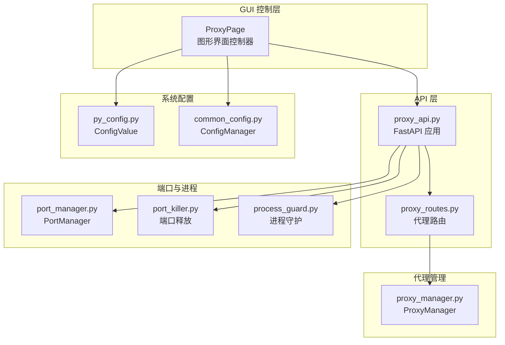
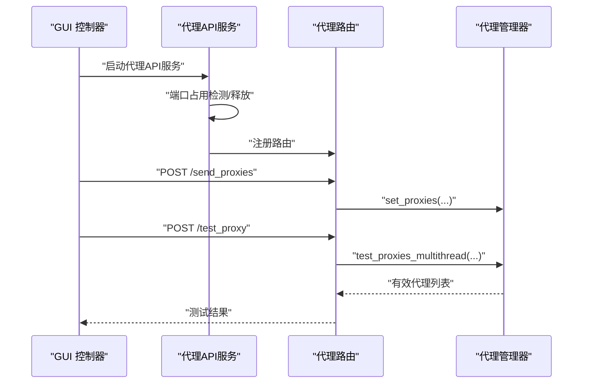
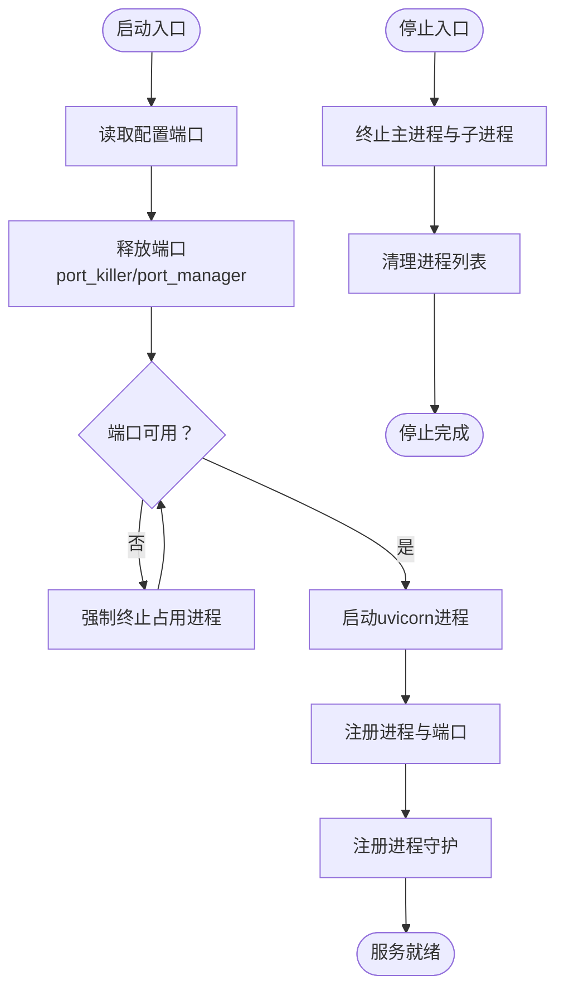
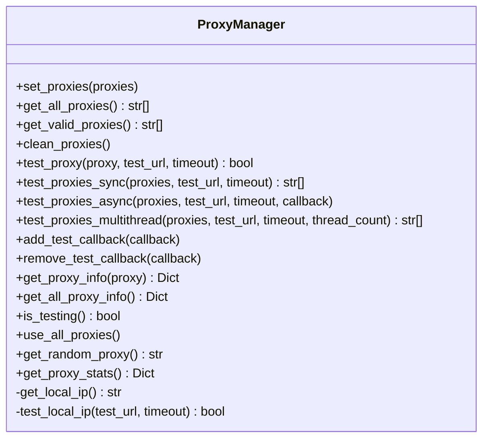
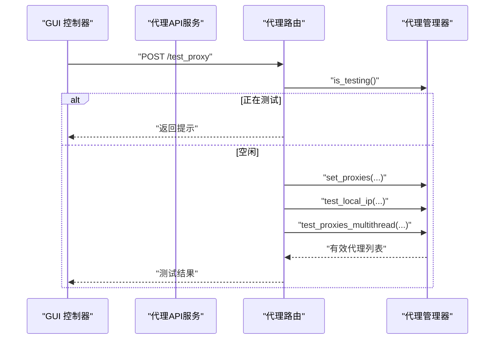
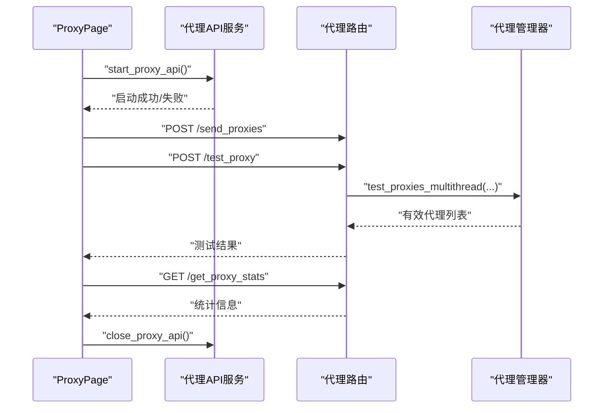
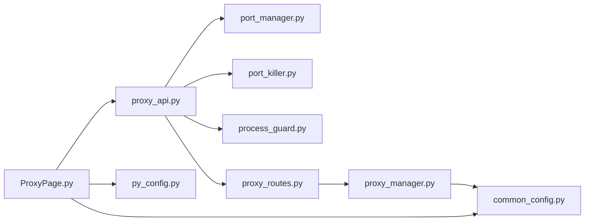

# 代理服务管理

<cite>
**本文引用的文件**
- [api/proxy_api.py](file://api/proxy_api.py)
- [api/proxy_routes/proxy_routes.py](file://api/proxy_routes/proxy_routes.py)
- [utils/proxy_manager.py](file://utils/proxy_manager.py)
- [gui/ProxyPage.py](file://gui/ProxyPage.py)
- [config/py_config.py](file://config/py_config.py)
- [config/common_config.py](file://config/common_config.py)
- [lite_modules/port_manager.py](file://lite_modules/port_manager.py)
- [lite_modules/port_killer.py](file://lite_modules/port_killer.py)
- [utils/process_guard.py](file://utils/process_guard.py)
- [modules/config_manager.py](file://modules/config_manager.py)
- [配置文件_系统配置/py_config_value.txt](file://配置文件_系统配置/py_config_value.txt)
- [配置文件_系统配置/proxy.txt](file://配置文件_系统配置/proxy.txt)
</cite>

## 目录
1. [简介](#简介)
2. [项目结构](#项目结构)
3. [核心组件](#核心组件)
4. [架构总览](#架构总览)
5. [详细组件分析](#详细组件分析)
6. [依赖关系分析](#依赖关系分析)
7. [性能考量与优化策略](#性能考量与优化策略)
8. [监控与故障排除指南](#监控与故障排除指南)
9. [与业务模块的集成方式](#与业务模块的集成方式)
10. [安全性与稳定性保障](#安全性与稳定性保障)
11. [扩展与自定义开发建议](#扩展与自定义开发建议)
12. [结论](#结论)

## 简介
本文件面向 ikun_temu_system 的代理服务管理，系统性阐述代理服务器架构、IP 代理管理机制、代理 API 服务实现与配置方法、性能优化策略、监控与故障排除、与业务模块的集成方式以及安全与稳定性保障措施，并提供扩展与自定义开发建议。读者可据此快速理解并运维代理服务，同时指导后续功能扩展。

## 项目结构
代理服务相关代码主要分布在以下模块：
- API 层：FastAPI 应用与路由，负责对外提供代理管理接口
- 代理管理器：统一的代理 IP 测试、筛选与统计
- GUI 控制层：图形界面启动/停止代理服务，与 API 交互
- 配置层：系统配置与数据库配置管理
- 端口管理与进程守护：端口占用检测与进程生命周期管理

**图表来源**
- [api/proxy_api.py:1-214](file://api/proxy_api.py#L1-L214)
- [api/proxy_routes/proxy_routes.py:1-218](file://api/proxy_routes/proxy_routes.py#L1-L218)
- [utils/proxy_manager.py:1-400](file://utils/proxy_manager.py#L1-L400)
- [gui/ProxyPage.py:1-931](file://gui/ProxyPage.py#L1-L931)
- [config/py_config.py:1-93](file://config/py_config.py#L1-L93)
- [config/common_config.py:1-394](file://config/common_config.py#L1-L394)
- [lite_modules/port_manager.py:1-338](file://lite_modules/port_manager.py#L1-L338)
- [lite_modules/port_killer.py:1-283](file://lite_modules/port_killer.py#L1-L283)
- [utils/process_guard.py:1-68](file://utils/process_guard.py#L1-L68)

**章节来源**
- [api/proxy_api.py:1-214](file://api/proxy_api.py#L1-L214)
- [api/proxy_routes/proxy_routes.py:1-218](file://api/proxy_routes/proxy_routes.py#L1-L218)
- [utils/proxy_manager.py:1-400](file://utils/proxy_manager.py#L1-L400)
- [gui/ProxyPage.py:1-931](file://gui/ProxyPage.py#L1-L931)
- [config/py_config.py:1-93](file://config/py_config.py#L1-L93)
- [config/common_config.py:1-394](file://config/common_config.py#L1-L394)
- [lite_modules/port_manager.py:1-338](file://lite_modules/port_manager.py#L1-L338)
- [lite_modules/port_killer.py:1-283](file://lite_modules/port_killer.py#L1-L283)
- [utils/process_guard.py:1-68](file://utils/process_guard.py#L1-L68)

## 核心组件
- 代理 API 服务：基于 FastAPI 的本地代理管理服务，提供代理列表接收、测试、统计等接口；由 Multiprocessing 进程托管，具备端口占用检测与释放能力。
- 代理管理器：集中管理代理 IP 列表，支持同步/异步/多线程测试，记录测试历史与统计信息，提供随机代理选择与回调机制。
- GUI 控制器：提供“启动/停止”代理服务的图形界面入口，负责与 API 服务交互、日志输出与状态更新。
- 系统配置：从配置文件读取代理服务端口、文件路径等；使用数据库配置管理器实现运行时配置热更新。
- 端口管理与进程守护：统一检测/释放端口，注册/注销进程，优雅退出与异常清理。

**章节来源**
- [api/proxy_api.py:40-128](file://api/proxy_api.py#L40-L128)
- [utils/proxy_manager.py:16-350](file://utils/proxy_manager.py#L16-L350)
- [gui/ProxyPage.py:73-162](file://gui/ProxyPage.py#L73-L162)
- [config/py_config.py:4-85](file://config/py_config.py#L4-L85)
- [config/common_config.py:344-376](file://config/common_config.py#L344-L376)
- [lite_modules/port_manager.py:17-312](file://lite_modules/port_manager.py#L17-L312)
- [utils/process_guard.py:8-67](file://utils/process_guard.py#L8-L67)

## 架构总览
代理服务采用“GUI 控制层—API 层—代理管理器—系统配置/端口管理”的分层架构。GUI 通过 HTTP 请求与 API 交互，API 使用 uvicorn 在本地 127.0.0.1 上启动服务，代理管理器负责代理 IP 的测试与筛选，端口管理器与进程守护保障服务稳定运行。

**图表来源**
- [gui/ProxyPage.py:728-800](file://gui/ProxyPage.py#L728-L800)
- [api/proxy_api.py:40-128](file://api/proxy_api.py#L40-L128)
- [api/proxy_routes/proxy_routes.py:20-124](file://api/proxy_routes/proxy_routes.py#L20-L124)
- [utils/proxy_manager.py:168-227](file://utils/proxy_manager.py#L168-L227)

## 详细组件分析

### 代理 API 服务（FastAPI）
- 应用初始化与中间件：创建 FastAPI 实例，启用 CORS，注册代理路由。
- 后台运行：使用 uvicorn 在 127.0.0.1 指定端口启动，单 worker，reload 关闭。
- 启动流程：端口释放（优先 port_killer，失败回退 port_manager），进程注册与守护注册。
- 停止流程：递归终止子进程，超时强制杀死，清理进程列表。

**图表来源**
- [api/proxy_api.py:56-128](file://api/proxy_api.py#L56-L128)
- [lite_modules/port_killer.py:103-134](file://lite_modules/port_killer.py#L103-L134)
- [lite_modules/port_manager.py:176-201](file://lite_modules/port_manager.py#L176-L201)
- [utils/process_guard.py:46-64](file://utils/process_guard.py#L46-L64)

**章节来源**
- [api/proxy_api.py:21-128](file://api/proxy_api.py#L21-L128)
- [lite_modules/port_killer.py:103-134](file://lite_modules/port_killer.py#L103-L134)
- [lite_modules/port_manager.py:176-201](file://lite_modules/port_manager.py#L176-L201)
- [utils/process_guard.py:46-64](file://utils/process_guard.py#L46-L64)

### 代理管理器（ProxyManager）
- 功能概览：设置/获取代理列表、清空、测试单个/同步/异步/多线程测试、回调、统计、随机代理、本机网络连通性测试。
- 并发控制：测试锁防止并发测试；多线程测试使用线程池与结果锁。
- 配置联动：测试超时从数据库配置管理器读取。
- 统计与历史：记录每次测试状态、耗时、错误信息，提供统计接口。

**图表来源**
- [utils/proxy_manager.py:16-350](file://utils/proxy_manager.py#L16-L350)
- [config/common_config.py:344-376](file://config/common_config.py#L344-L376)

**章节来源**
- [utils/proxy_manager.py:16-350](file://utils/proxy_manager.py#L16-L350)
- [config/common_config.py:344-376](file://config/common_config.py#L344-L376)

### 代理路由（FastAPI 路由）
- 接口清单：
  - POST /send_proxies：接收代理列表并设置到代理管理器
  - GET /：连通性测试（GET）
  - POST /：连通性测试（POST）
  - GET /get_proxies：获取有效代理
  - GET /get_all_proxies：获取全部代理
  - GET /clean_proxies：清空代理
  - POST /test_proxy：多线程测试代理（带本机网络连通性前置测试）
  - GET /test_proxy_result：获取测试结果与统计
  - GET /test_proxy_use_all：将全部代理设为有效
  - POST /test_local_ip：测试本机网络连通性
  - GET /get_local_ip：获取本机IP
  - GET /get_proxy_stats：获取代理统计
  - GET /get_random_proxy：获取随机有效代理

**图表来源**
- [api/proxy_routes/proxy_routes.py:20-145](file://api/proxy_routes/proxy_routes.py#L20-L145)
- [utils/proxy_manager.py:168-227](file://utils/proxy_manager.py#L168-L227)

**章节来源**
- [api/proxy_routes/proxy_routes.py:1-218](file://api/proxy_routes/proxy_routes.py#L1-L218)

### GUI 控制器（ProxyPage）
- 功能要点：
  - 启动/停止代理服务：异步线程启动 API 服务，等待连通性验证；停止时先清空代理列表，再关闭 API 服务。
  - 与 API 交互：发送代理列表、测试代理、获取统计等。
  - 配置读取：从数据库配置管理器读取测试超时、线程数、URL 等参数。
  - 日志与状态：通过信号与槽更新界面日志与按钮状态。

**图表来源**
- [gui/ProxyPage.py:668-723](file://gui/ProxyPage.py#L668-L723)
- [gui/ProxyPage.py:728-800](file://gui/ProxyPage.py#L728-L800)
- [api/proxy_routes/proxy_routes.py:20-201](file://api/proxy_routes/proxy_routes.py#L20-L201)

**章节来源**
- [gui/ProxyPage.py:73-162](file://gui/ProxyPage.py#L73-L162)
- [gui/ProxyPage.py:668-800](file://gui/ProxyPage.py#L668-L800)

### 系统配置与数据库配置
- 配置读取：ConfigValue 从配置文件读取端口、文件路径等；API 地址由端口拼接生成。
- 数据库配置：ConfigManager 提供键值配置的读取/设置/批量初始化/类型转换等能力，支持热更新。
- 代理文件：proxy.txt 为默认代理文件路径，GUI 可读取并保存代理列表。

**章节来源**
- [config/py_config.py:4-85](file://config/py_config.py#L4-L85)
- [config/common_config.py:344-376](file://config/common_config.py#L344-L376)
- [配置文件_系统配置/py_config_value.txt:1-4](file://配置文件_系统配置/py_config_value.txt#L1-L4)
- [配置文件_系统配置/proxy.txt:1-2](file://配置文件_系统配置/proxy.txt#L1-L2)

### 端口管理与进程守护
- 端口管理：PortManager 提供端口占用检测、PID 获取、进程终止、注册/注销进程、统一停止等能力。
- 端口释放：port_killer 提供 is_port_in_use、kill_process_by_pid、release_port 等便捷函数。
- 进程守护：ProcessGuard 注册 atexit 与信号处理器，确保异常退出时清理子进程。

**章节来源**
- [lite_modules/port_manager.py:17-312](file://lite_modules/port_manager.py#L17-L312)
- [lite_modules/port_killer.py:11-134](file://lite_modules/port_killer.py#L11-L134)
- [utils/process_guard.py:8-67](file://utils/process_guard.py#L8-L67)

## 依赖关系分析
- GUI 控制器依赖 API 服务与配置管理器；API 服务依赖端口管理与进程守护；代理路由依赖代理管理器；代理管理器依赖数据库配置管理器。
- 配置文件与数据库共同支撑运行时参数，形成“文件配置 + 数据库配置”的双通道。

**图表来源**
- [gui/ProxyPage.py:1-931](file://gui/ProxyPage.py#L1-L931)
- [api/proxy_api.py:1-214](file://api/proxy_api.py#L1-L214)
- [api/proxy_routes/proxy_routes.py:1-218](file://api/proxy_routes/proxy_routes.py#L1-L218)
- [utils/proxy_manager.py:1-400](file://utils/proxy_manager.py#L1-L400)
- [config/py_config.py:1-93](file://config/py_config.py#L1-L93)
- [config/common_config.py:1-394](file://config/common_config.py#L1-L394)
- [lite_modules/port_manager.py:1-338](file://lite_modules/port_manager.py#L1-L338)
- [lite_modules/port_killer.py:1-283](file://lite_modules/port_killer.py#L1-L283)
- [utils/process_guard.py:1-68](file://utils/process_guard.py#L1-L68)

**章节来源**
- [gui/ProxyPage.py:1-931](file://gui/ProxyPage.py#L1-L931)
- [api/proxy_api.py:1-214](file://api/proxy_api.py#L1-L214)
- [api/proxy_routes/proxy_routes.py:1-218](file://api/proxy_routes/proxy_routes.py#L1-L218)
- [utils/proxy_manager.py:1-400](file://utils/proxy_manager.py#L1-L400)
- [config/py_config.py:1-93](file://config/py_config.py#L1-L93)
- [config/common_config.py:1-394](file://config/common_config.py#L1-L394)
- [lite_modules/port_manager.py:1-338](file://lite_modules/port_manager.py#L1-L338)
- [lite_modules/port_killer.py:1-283](file://lite_modules/port_killer.py#L1-L283)
- [utils/process_guard.py:1-68](file://utils/process_guard.py#L1-L68)

## 性能考量与优化策略
- 测试并发与超时
  - 多线程测试：根据代理数量与网络状况合理设置线程数，避免过多线程导致资源争用。
  - 超时控制：测试超时从数据库配置读取，建议按网络环境调整；总超时 = 单代理超时 × 代理数 + 缓冲时间。
- 端口与进程
  - 启动前严格释放端口，必要时强制终止占用进程，减少启动失败与资源泄漏。
  - 使用进程守护与统一注册，确保异常退出时清理子进程。
- 网络与连通性
  - 先测试本机网络连通性，再进行代理测试，避免因本地网络问题导致误判。
- I/O 与日志
  - 使用异步/多线程提升吞吐，注意日志级别与输出频率，避免 I/O 成为瓶颈。

**章节来源**
- [utils/proxy_manager.py:168-227](file://utils/proxy_manager.py#L168-L227)
- [gui/ProxyPage.py:856-878](file://gui/ProxyPage.py#L856-L878)
- [api/proxy_api.py:67-106](file://api/proxy_api.py#L67-L106)
- [utils/process_guard.py:46-64](file://utils/process_guard.py#L46-L64)

## 监控与故障排除指南
- 常见问题
  - 端口被占用：启动前使用端口管理器检测并释放；若仍占用，强制终止占用进程。
  - 启动超时：检查端口可达性、防火墙与杀毒软件；确认 uvicorn 启动参数与端口配置。
  - 代理测试失败：确认测试 URL 可达、超时设置合理；先测试本机网络连通性。
- 排障步骤
  - GUI 日志：查看启动/停止过程中的日志输出，定位失败阶段。
  - API 路由：使用 GET / 与 GET /get_proxy_stats 快速验证服务与状态。
  - 进程清理：若异常退出，依赖进程守护清理子进程；必要时手动终止相关 PID。
- 建议
  - 在生产环境固定端口并加入防火墙白名单。
  - 对代理测试结果进行定期统计与告警阈值设置。

**章节来源**
- [api/proxy_api.py:67-128](file://api/proxy_api.py#L67-L128)
- [api/proxy_routes/proxy_routes.py:31-47](file://api/proxy_routes/proxy_routes.py#L31-L47)
- [utils/proxy_manager.py:291-315](file://utils/proxy_manager.py#L291-L315)
- [utils/process_guard.py:51-64](file://utils/process_guard.py#L51-L64)

## 与业务模块的集成方式
- GUI 集成：ProxyPage 作为入口，负责启动/停止代理服务并与 API 交互，展示日志与状态。
- 配置集成：通过数据库配置管理器读取/设置测试超时、线程数、URL 等参数，实现热更新。
- 文件集成：proxy.txt 作为代理文件路径，GUI 可读取与保存代理列表，便于业务侧维护。
- 路由集成：业务侧可通过 HTTP 请求调用代理路由，实现代理列表下发、测试与统计。

**章节来源**
- [gui/ProxyPage.py:174-194](file://gui/ProxyPage.py#L174-L194)
- [config/common_config.py:344-376](file://config/common_config.py#L344-L376)
- [配置文件_系统配置/proxy.txt:1-2](file://配置文件_系统配置/proxy.txt#L1-L2)
- [api/proxy_routes/proxy_routes.py:20-201](file://api/proxy_routes/proxy_routes.py#L20-L201)

## 安全性与稳定性保障
- 安全性
  - 本地回环地址：API 仅绑定 127.0.0.1，降低外网暴露风险。
  - CORS 配置：允许跨域访问，便于前端调用；建议在生产环境限制具体源。
  - 进程隔离：使用 Multiprocessing 进程运行 API，避免主线程阻塞。
- 稳定性
  - 端口管理：双重释放策略（port_killer 与 port_manager），提高成功率。
  - 进程守护：atexit 与信号处理器确保异常退出时清理资源。
  - 超时与重试：GUI 启动时轮询等待与最大等待时间，避免无限阻塞。

**章节来源**
- [api/proxy_api.py:24-31](file://api/proxy_api.py#L24-L31)
- [api/proxy_api.py:108-128](file://api/proxy_api.py#L108-L128)
- [utils/process_guard.py:27-44](file://utils/process_guard.py#L27-L44)
- [gui/ProxyPage.py:740-762](file://gui/ProxyPage.py#L740-L762)

## 扩展与自定义开发建议
- 新增代理测试策略
  - 在代理管理器中扩展测试方法（如按延迟排序、按状态码过滤），并在路由中提供相应接口。
- 配置热更新
  - 使用数据库配置管理器新增键值，GUI 中增加输入框与保存逻辑，实现运行时参数调整。
- 端口与进程扩展
  - 在 PortManager 中增加更多平台适配与进程信息查询能力，便于运维监控。
- GUI 交互增强
  - 增加代理测试历史可视化、统计图表与告警通知，提升可观测性。
- 安全加固
  - 在生产环境限制 CORS 源、增加鉴权机制或本地认证，避免未授权访问。

**章节来源**
- [utils/proxy_manager.py:16-350](file://utils/proxy_manager.py#L16-L350)
- [modules/config_manager.py:154-189](file://modules/config_manager.py#L154-L189)
- [lite_modules/port_manager.py:17-312](file://lite_modules/port_manager.py#L17-L312)
- [gui/ProxyPage.py:164-194](file://gui/ProxyPage.py#L164-L194)

## 结论
本代理服务管理方案以 FastAPI 为核心，结合代理管理器、GUI 控制器、端口管理与进程守护，构建了高可用、可扩展的本地代理服务。通过合理的性能优化、完善的监控与故障排除流程、严格的安全部署与稳定的进程管理，能够满足业务侧对代理 IP 的测试与筛选需求，并为后续扩展提供清晰的演进路径。