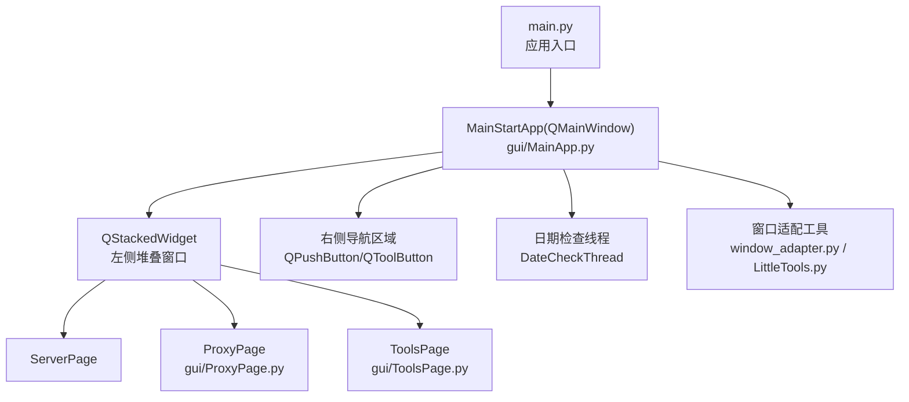
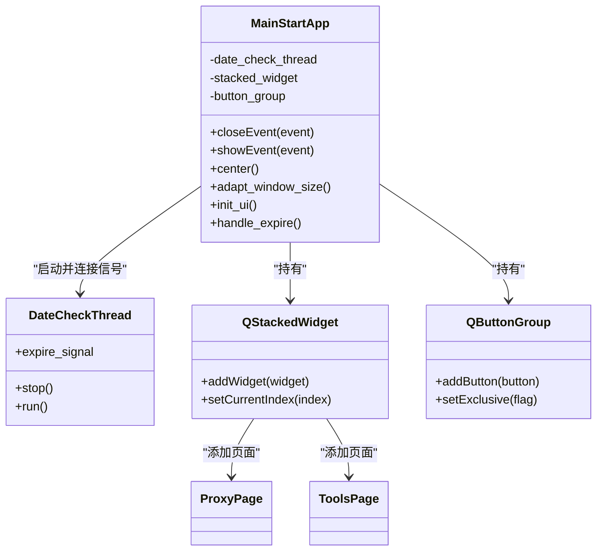
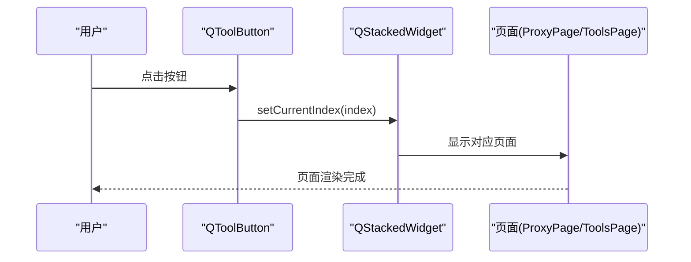
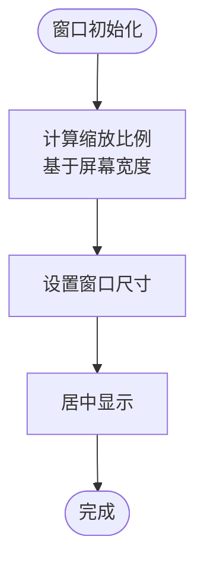
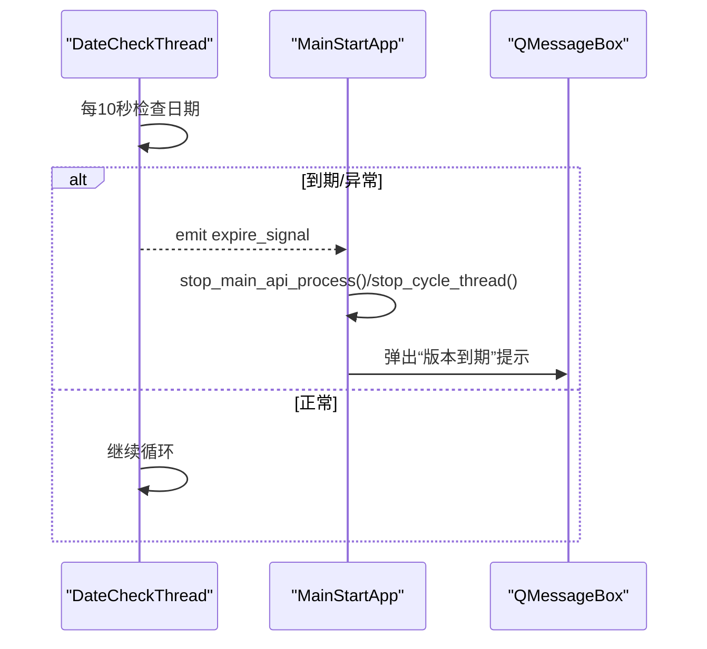
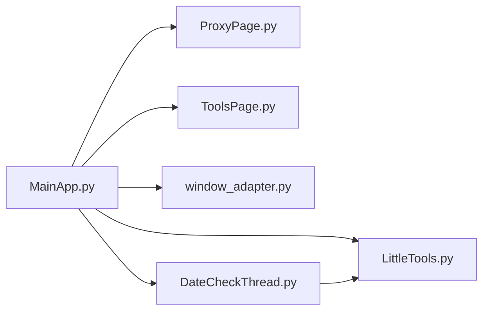

# 主窗口框架

<cite>
**本文档引用的文件**
- [MainApp.py](file://gui/MainApp.py)
- [main.py](file://main.py)
- [DateCheckThread.py](file://lite_modules/DateCheckThread.py)
- [window_adapter.py](file://gui/utils/window_adapter.py)
- [LittleTools.py](file://lite_modules/LittleTools.py)
- [ProxyPage.py](file://gui/ProxyPage.py)
- [ToolsPage.py](file://gui/ToolsPage.py)
</cite>

## 目录
1. [简介](#简介)
2. [项目结构](#项目结构)
3. [核心组件](#核心组件)
4. [架构总览](#架构总览)
5. [详细组件分析](#详细组件分析)
6. [依赖分析](#依赖分析)
7. [性能考虑](#性能考虑)
8. [故障排查指南](#故障排查指南)
9. [结论](#结论)

## 简介
本文件面向 ikun_temu_system 的主窗口框架，聚焦于 MainStartApp 类的架构设计与实现原理，系统性阐述：
- 主窗口布局结构：左侧堆叠窗口区域与右侧导航区域的设计思路与职责划分
- QStackedWidget 的使用方式与页面切换机制
- 按钮组的实现与样式定制策略
- 窗口居中与动态尺寸适配的实现细节
- 主窗口事件处理机制（关闭事件、显示事件等）
- 日期检查线程的集成与到期处理逻辑
- 开发最佳实践与性能优化建议

## 项目结构
主窗口框架位于 gui/MainApp.py，作为应用入口 main.py 初始化 QApplication 并创建主窗口。窗口采用左右分区布局：
- 左侧：堆叠窗口区域（QStackedWidget），承载多个功能页面（服务器、代理IP、工具箱等）
- 右侧：导航区域（QPushButton/QToolButton 组合），提供快速入口与文件操作

图表来源
- [main.py:160-170](file://main.py#L160-L170)
- [MainApp.py:347-368](file://gui/MainApp.py#L347-L368)
- [MainApp.py:496-508](file://gui/MainApp.py#L496-L508)
- [DateCheckThread.py:9-11](file://lite_modules/DateCheckThread.py#L9-L11)
- [window_adapter.py:9-36](file://gui/utils/window_adapter.py#L9-L36)
- [LittleTools.py:148-198](file://lite_modules/LittleTools.py#L148-L198)

章节来源
- [main.py:160-170](file://main.py#L160-L170)
- [MainApp.py:312-508](file://gui/MainApp.py#L312-L508)

## 核心组件
- MainStartApp：主窗口类，负责整体布局、页面切换、事件处理与线程集成
- QStackedWidget：左侧堆叠窗口，承载多个页面并支持切换
- QButtonGroup/QToolButton：左侧按钮组，配合 QStackedWidget 实现页面切换
- QPushButton/QGroupBox：右侧导航区域，提供功能入口与文件操作
- DateCheckThread：后台日期检查线程，到期时向主线程发出信号
- 适配工具：window_adapter.py 与 LittleTools.py 提供窗口与组件尺寸的动态适配

章节来源
- [MainApp.py:179-306](file://gui/MainApp.py#L179-L306)
- [DateCheckThread.py:9-54](file://lite_modules/DateCheckThread.py#L9-L54)
- [window_adapter.py:9-36](file://gui/utils/window_adapter.py#L9-L36)
- [LittleTools.py:148-198](file://lite_modules/LittleTools.py#L148-L198)

## 架构总览
主窗口采用“左侧堆叠页面 + 右侧导航”的双栏布局。左侧通过 QStackedWidget 切换不同页面；右侧通过按钮组提供快速入口与文件操作。主窗口还集成了日期检查线程，到期时在主线程弹窗提示并停止后台任务。

图表来源
- [MainApp.py:179-306](file://gui/MainApp.py#L179-L306)
- [MainApp.py:347-368](file://gui/MainApp.py#L347-L368)
- [MainApp.py:407-492](file://gui/MainApp.py#L407-L492)
- [DateCheckThread.py:9-54](file://lite_modules/DateCheckThread.py#L9-L54)
- [ProxyPage.py:73-96](file://gui/ProxyPage.py#L73-L96)
- [ToolsPage.py:25-48](file://gui/ToolsPage.py#L25-L48)

## 详细组件分析

### MainStartApp 类架构与实现
- 继承关系：继承自 QMainWindow，作为应用主窗口
- 关闭事件：重写 closeEvent，实现退出确认、进度弹窗与任务清理
- 显示事件：重写 showEvent，在首次显示时自动居中
- 窗口适配：通过 adapt_window_size 结合 window_adapter.py/LittleTools.py 实现动态尺寸适配
- 页面切换：通过 QStackedWidget 与 QButtonGroup 实现左侧页面切换
- 导航区域：右侧 QPushButton/QToolButton 组合，提供数据库、任务管理、设置、说明与文件操作入口
- 日期检查：启动 DateCheckThread，连接到期信号到 handle_expire

章节来源
- [MainApp.py:179-306](file://gui/MainApp.py#L179-L306)
- [MainApp.py:312-508](file://gui/MainApp.py#L312-L508)
- [MainApp.py:634-649](file://gui/MainApp.py#L634-L649)
- [MainApp.py:1164-1206](file://gui/MainApp.py#L1164-L1206)

### 左侧堆叠窗口区域
- 布局：左侧容器使用 QVBoxLayout，包含 QStackedWidget 与底部按钮栏
- 页面添加：将 ServerPage、ProxyPage、ToolsPage 添加到 QStackedWidget
- 切换机制：每个按钮通过 clicked 信号调用 stacked_widget.setCurrentIndex(index) 实现页面切换
- 样式：QToolButton 使用圆角与悬停/选中状态样式，实现视觉反馈

图表来源
- [MainApp.py:417-492](file://gui/MainApp.py#L417-L492)
- [MainApp.py:347-368](file://gui/MainApp.py#L347-L368)

章节来源
- [MainApp.py:341-493](file://gui/MainApp.py#L341-L493)

### 右侧导航区域
- 布局：右侧容器使用 QVBoxLayout，包含“快捷导航”与“文件操作”两组 QGroupBox
- 快捷导航：QPushButton 提供数据库、任务管理、设置、说明入口
- 文件操作：根据权限动态显示系统配置、工具配置表、实拍图配置、结算导出、成本配置、财务汇总等入口
- 样式：统一的蓝色主题样式，悬停与按下状态颜色变化

章节来源
- [MainApp.py:496-633](file://gui/MainApp.py#L496-L633)

### 按钮组与样式定制
- QButtonGroup：设置 exclusive=True，确保同一时刻只有一个按钮处于选中状态
- QToolButton：设置 checkable=True，结合样式表实现选中态高亮
- QPushButton：统一的蓝色主题样式，通过 adapt_component_size 动态调整尺寸与内边距

章节来源
- [MainApp.py:407-492](file://gui/MainApp.py#L407-L492)
- [MainApp.py:510-567](file://gui/MainApp.py#L510-L567)

### 窗口居中与动态尺寸适配
- 居中：center 方法基于主屏可用几何，使用当前窗口尺寸计算居中坐标
- 动态适配：adapt_window_size 结合 window_adapter.py 与 LittleTools.py 的 adapt_component_size，按屏幕宽度比例缩放窗口与组件尺寸
- 首次显示：showEvent 中首次显示时自动居中，避免重复居中

图表来源
- [MainApp.py:641-649](file://gui/MainApp.py#L641-L649)
- [window_adapter.py:9-36](file://gui/utils/window_adapter.py#L9-L36)
- [LittleTools.py:148-198](file://lite_modules/LittleTools.py#L148-L198)

章节来源
- [MainApp.py:634-649](file://gui/MainApp.py#L634-L649)
- [window_adapter.py:9-36](file://gui/utils/window_adapter.py#L9-L36)
- [LittleTools.py:148-198](file://lite_modules/LittleTools.py#L148-L198)

### 事件处理机制
- 关闭事件：closeEvent 实现退出确认、进度弹窗与任务清理（API进程、代理API、循环线程、数据库等）
- 显示事件：showEvent 首次显示时居中，避免重复居中
- 退出进度弹窗：ExitProgressDialog 提供状态文本与进度条，实时刷新界面

章节来源
- [MainApp.py:185-280](file://gui/MainApp.py#L185-L280)
- [MainApp.py:35-102](file://gui/MainApp.py#L35-L102)
- [MainApp.py:634-639](file://gui/MainApp.py#L634-L639)

### 日期检查线程集成与到期处理
- 线程启动：MainStartApp 构造函数中创建 DateCheckThread，连接 expire_signal 到 handle_expire
- 线程逻辑：run 循环每10秒检查配置中的日期有效性，异常或到期即发送信号并退出
- 到期处理：handle_expire 停止后台任务、禁用主窗口交互、弹出模态提示，保留主界面

图表来源
- [MainApp.py:300-306](file://gui/MainApp.py#L300-L306)
- [MainApp.py:1164-1206](file://gui/MainApp.py#L1164-L1206)
- [DateCheckThread.py:25-54](file://lite_modules/DateCheckThread.py#L25-L54)

章节来源
- [MainApp.py:300-306](file://gui/MainApp.py#L300-L306)
- [MainApp.py:1164-1206](file://gui/MainApp.py#L1164-L1206)
- [DateCheckThread.py:9-54](file://lite_modules/DateCheckThread.py#L9-L54)

## 依赖分析
- 主窗口依赖：gui/MainApp.py 依赖 gui/ProxyPage.py、gui/ToolsPage.py、gui/utils/window_adapter.py、lite_modules/DateCheckThread.py、lite_modules/LittleTools.py
- 线程依赖：DateCheckThread 依赖 lite_modules/LittleTools.py 的日期校验函数
- 事件依赖：主窗口通过 pyqtSignal 与线程通信，确保线程安全

图表来源
- [MainApp.py:179-306](file://gui/MainApp.py#L179-L306)
- [ProxyPage.py:73-96](file://gui/ProxyPage.py#L73-L96)
- [ToolsPage.py:25-48](file://gui/ToolsPage.py#L25-L48)
- [window_adapter.py:9-36](file://gui/utils/window_adapter.py#L9-L36)
- [LittleTools.py:148-198](file://lite_modules/LittleTools.py#L148-L198)
- [DateCheckThread.py:9-54](file://lite_modules/DateCheckThread.py#L9-L54)

章节来源
- [MainApp.py:179-306](file://gui/MainApp.py#L179-L306)
- [DateCheckThread.py:9-54](file://lite_modules/DateCheckThread.py#L9-L54)

## 性能考虑
- 线程安全：DateCheckThread 使用 QMutex 保护 stop_flag，避免竞态条件
- UI刷新：退出进度弹窗使用 QApplication.processEvents() 强制刷新，避免界面卡顿
- 尺寸适配：仅在初始化阶段计算缩放比例，避免频繁查询屏幕尺寸
- 事件处理：关闭事件中分步骤清理，避免阻塞主线程
- 组件复用：QButtonGroup 与 QStackedWidget 复用同一套样式与尺寸策略，减少重复计算

[本节为通用性能建议，不直接分析具体文件]

## 故障排查指南
- 退出异常：若退出流程出现异常，handle_expire 会弹出错误提示并尝试强制退出
- 图标缺失：主窗口设置图标时若文件不存在，会记录警告日志
- 权限与路径：打开文件夹时若路径不存在或权限不足，会弹出具体错误提示
- 线程异常：DateCheckThread 在异常时也会延迟并记录错误日志，避免死循环

章节来源
- [MainApp.py:185-280](file://gui/MainApp.py#L185-L280)
- [MainApp.py:329-333](file://gui/MainApp.py#L329-L333)
- [MainApp.py:1040-1077](file://gui/MainApp.py#L1040-L1077)
- [DateCheckThread.py:48-54](file://lite_modules/DateCheckThread.py#L48-L54)

## 结论
MainStartApp 通过清晰的左右分区布局、稳定的 QStackedWidget 页面切换机制、完善的事件处理与线程集成，构建了易用、可扩展的主窗口框架。配合动态尺寸适配与样式定制，能够在不同分辨率下提供一致的用户体验。建议在后续迭代中持续关注线程安全与 UI 刷新策略，确保复杂场景下的稳定性与性能表现。