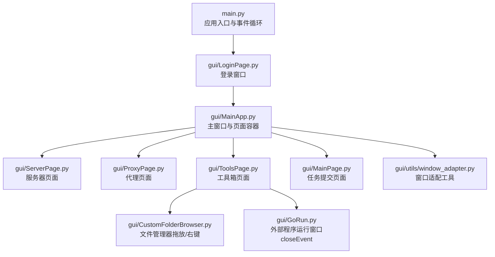
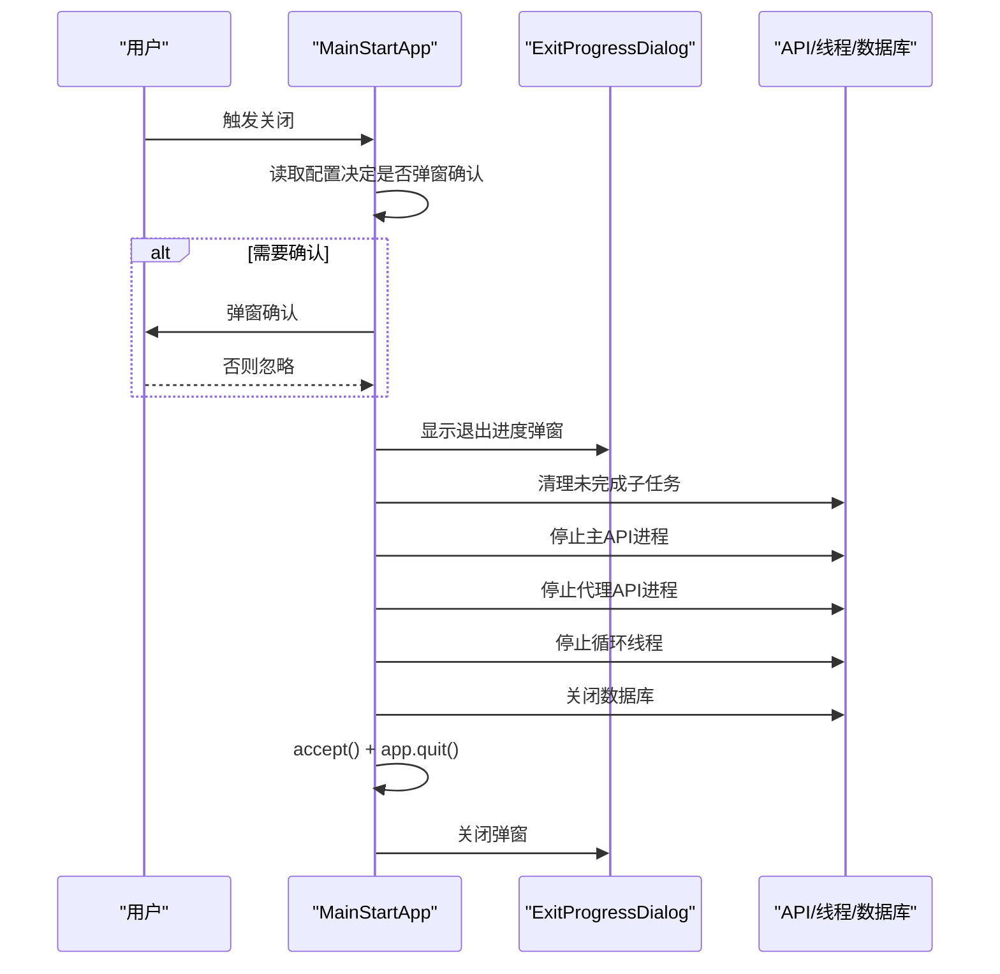
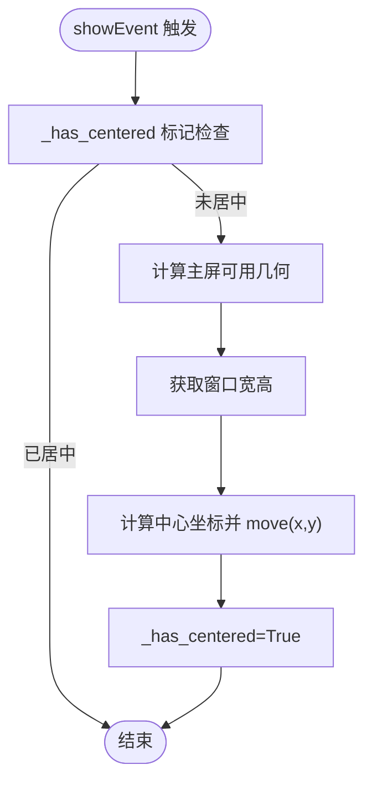
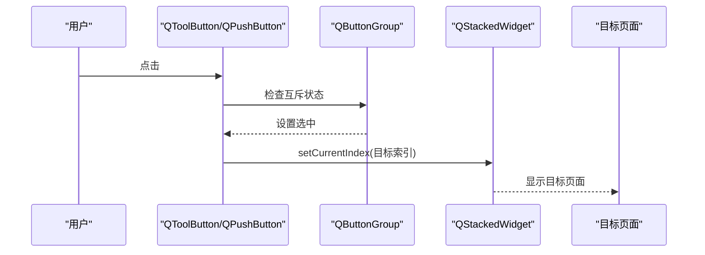
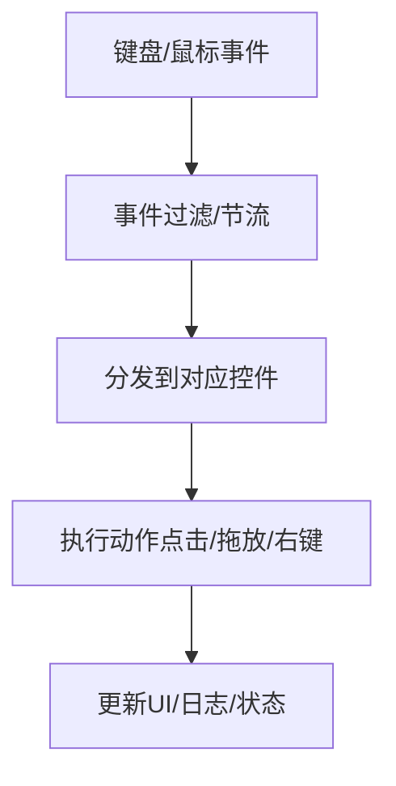
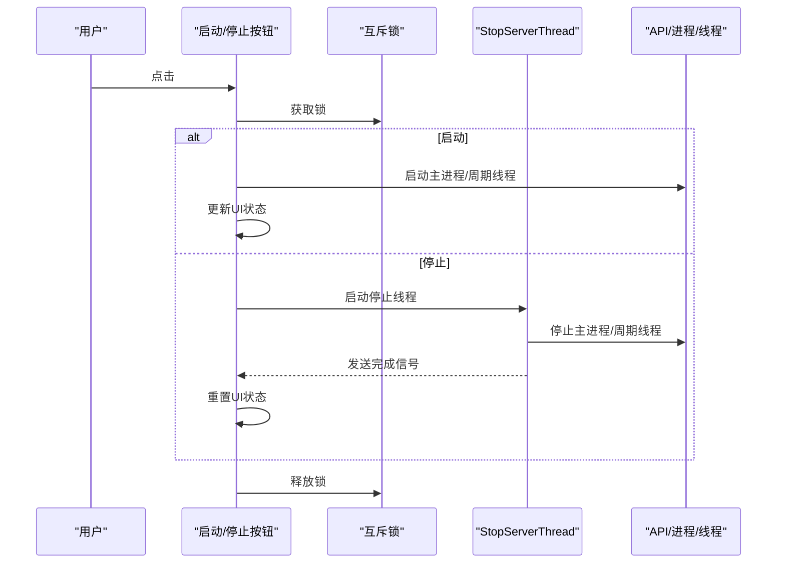
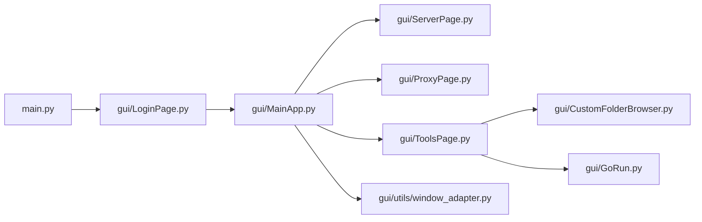

# 事件处理机制

<cite>
**本文档引用的文件**
- [main.py](file://main.py)
- [gui/MainApp.py](file://gui/MainApp.py)
- [gui/LoginPage.py](file://gui/LoginPage.py)
- [gui/MainPage.py](file://gui/MainPage.py)
- [gui/ProxyPage.py](file://gui/ProxyPage.py)
- [gui/ServerPage.py](file://gui/ServerPage.py)
- [gui/ToolsPage.py](file://gui/ToolsPage.py)
- [gui/CustomFolderBrowser.py](file://gui/CustomFolderBrowser.py)
- [gui/GoRun.py](file://gui/GoRun.py)
- [gui/utils/window_adapter.py](file://gui/utils/window_adapter.py)
</cite>

## 目录
1. [简介](#简介)
2. [项目结构](#项目结构)
3. [核心组件](#核心组件)
4. [架构总览](#架构总览)
5. [详细组件分析](#详细组件分析)
6. [依赖分析](#依赖分析)
7. [性能考虑](#性能考虑)
8. [故障排查指南](#故障排查指南)
9. [结论](#结论)

## 简介
本文件系统性梳理 ikun_temu_system 的事件处理机制，重点覆盖：
- 窗口事件重写与退出流程管理（closeEvent）
- 首次显示初始化（showEvent）
- 窗口居中与屏幕适配
- 按钮点击事件与页面切换
- 键盘与鼠标事件处理
- 事件传播与拦截
- 调试技巧与性能优化
- 常见问题与最佳实践

## 项目结构
项目采用 PyQt5 GUI + Python 后端的桌面应用架构，事件处理主要集中在主窗口、登录窗口、页面容器与工具页面中。核心入口负责初始化 QApplication 与事件循环，主窗口负责页面切换与全局事件处理，页面组件负责局部事件与业务逻辑。



图表来源
- [main.py:120-172](file://main.py#L120-L172)
- [gui/MainApp.py:312-649](file://gui/MainApp.py#L312-L649)
- [gui/ServerPage.py:150-180](file://gui/ServerPage.py#L150-L180)
- [gui/ProxyPage.py:98-163](file://gui/ProxyPage.py#L98-L163)
- [gui/ToolsPage.py:49-86](file://gui/ToolsPage.py#L49-L86)
- [gui/utils/window_adapter.py:9-36](file://gui/utils/window_adapter.py#L9-L36)
- [gui/CustomFolderBrowser.py:180-238](file://gui/CustomFolderBrowser.py#L180-L238)
- [gui/GoRun.py:156-196](file://gui/GoRun.py#L156-L196)

章节来源
- [main.py:120-172](file://main.py#L120-L172)
- [gui/MainApp.py:312-649](file://gui/MainApp.py#L312-L649)

## 核心组件
- 应用入口与事件循环：负责创建 QApplication、QEventLoop 并启动事件循环，统一异常捕获与退出清理。
- 主窗口 MainStartApp：重写 closeEvent 实现优雅退出，showEvent 实现首次显示居中，管理页面切换与全局布局。
- 页面容器：ServerPage、ProxyPage、ToolsPage、MainPage 等，各自处理按钮点击、配置保存、线程异步操作与日志输出。
- 工具与适配：window_adapter 提供窗口尺寸与组件尺寸的统一适配；CustomFolderBrowser 支持拖放与右键菜单事件。

章节来源
- [main.py:21-53](file://main.py#L21-L53)
- [gui/MainApp.py:179-280](file://gui/MainApp.py#L179-L280)
- [gui/MainApp.py:634-649](file://gui/MainApp.py#L634-L649)
- [gui/utils/window_adapter.py:9-36](file://gui/utils/window_adapter.py#L9-L36)

## 架构总览
应用采用“入口初始化 + 主窗口容器 + 多页面组件”的分层设计。事件处理贯穿：
- 入口层：全局异常捕获与退出清理
- 主窗口层：窗口生命周期事件、页面切换与全局布局
- 页面层：按钮点击、配置变更、线程与信号槽、日志输出
- 工具层：窗口适配、拖放与右键菜单

```mermaid
sequenceDiagram
participant Entry as "main.py"
participant App as "QApplication"
participant Loop as "QEventLoop"
participant Login as "LoginWindow"
participant Main as "MainStartApp"
participant Page as "页面组件"
Entry->>App : 创建QApplication
Entry->>Loop : 设置事件循环
Entry->>Login : 显示登录窗口
Login-->>Entry : 登录成功/失败
alt 登录成功
Entry->>Main : 创建主窗口
Main-->>App : show()
App-->>Page : 事件分发
else 登录失败
Entry->>Entry : 记录异常并清理
end
```

图表来源
- [main.py:120-172](file://main.py#L120-L172)
- [gui/LoginPage.py:462-490](file://gui/LoginPage.py#L462-L490)
- [gui/MainApp.py:312-327](file://gui/MainApp.py#L312-L327)

## 详细组件分析

### 主窗口事件处理：closeEvent 与 showEvent
- closeEvent 重写：实现退出确认、进度弹窗、任务清理与数据库安全关闭，确保异常与正常路径均能退出。
- showEvent：首次显示时自动居中，避免重复居中与闪烁。
- 页面切换：通过 QStackedWidget 与 QToolButton 组合实现页面切换，按钮组确保互斥选中。



图表来源
- [gui/MainApp.py:185-280](file://gui/MainApp.py#L185-L280)
- [gui/MainApp.py:35-102](file://gui/MainApp.py#L35-L102)

章节来源
- [gui/MainApp.py:185-280](file://gui/MainApp.py#L185-L280)
- [gui/MainApp.py:35-102](file://gui/MainApp.py#L35-L102)
- [gui/MainApp.py:634-649](file://gui/MainApp.py#L634-L649)

### 窗口居中与屏幕适配
- showEvent 首次显示居中：基于主屏可用几何，计算窗口中心点并移动。
- 窗口尺寸适配：根据 2560 基准分辨率计算缩放比例，动态设置窗口尺寸。
- 组件尺寸适配：通过统一工具函数计算按钮、字体、内边距等，确保高分屏一致性。



图表来源
- [gui/MainApp.py:634-649](file://gui/MainApp.py#L634-L649)
- [gui/utils/window_adapter.py:9-36](file://gui/utils/window_adapter.py#L9-L36)

章节来源
- [gui/MainApp.py:634-649](file://gui/MainApp.py#L634-L649)
- [gui/utils/window_adapter.py:9-36](file://gui/utils/window_adapter.py#L9-L36)

### 按钮点击事件与页面切换
- 主窗口底部按钮组：QToolButton + QButtonGroup，互斥选中，点击切换 QStackedWidget 页面。
- 快捷导航按钮：QPushButton 点击事件连接到具体功能（数据库、任务管理、设置、说明等）。
- 页面内部按钮：如 ServerPage 的启动/停止按钮、ToolsPage 的启动/停止按钮，均通过 clicked.connect 绑定槽函数。



图表来源
- [gui/MainApp.py:407-492](file://gui/MainApp.py#L407-L492)
- [gui/ServerPage.py:167-176](file://gui/ServerPage.py#L167-L176)
- [gui/ToolsPage.py:240-250](file://gui/ToolsPage.py#L240-L250)

章节来源
- [gui/MainApp.py:407-492](file://gui/MainApp.py#L407-L492)
- [gui/ServerPage.py:167-176](file://gui/ServerPage.py#L167-L176)
- [gui/ToolsPage.py:240-250](file://gui/ToolsPage.py#L240-L250)

### 键盘与鼠标事件处理
- 键盘事件：在 LoginPage 中通过 RateLimiter 控制登录请求频率，避免频繁点击；在 ToolsPage 的帮助文本中启用文本可选择（TextSelectableByKeyboard）。
- 鼠标事件：在 MainPage 的自定义下拉框 CheckableComboBox 中重写 mousePressEvent 与 eventFilter，实现点击展开/收起与复选状态切换。
- 拖放与右键菜单：CustomFolderBrowser 支持拖入/放下文件，右键菜单实现删除、复制、粘贴、重命名等操作。



图表来源
- [gui/LoginPage.py:188-207](file://gui/LoginPage.py#L188-L207)
- [gui/MainPage.py:115-127](file://gui/MainPage.py#L115-L127)
- [gui/CustomFolderBrowser.py:180-238](file://gui/CustomFolderBrowser.py#L180-L238)

章节来源
- [gui/LoginPage.py:188-207](file://gui/LoginPage.py#L188-L207)
- [gui/MainPage.py:115-127](file://gui/MainPage.py#L115-L127)
- [gui/CustomFolderBrowser.py:180-238](file://gui/CustomFolderBrowser.py#L180-L238)

### 服务器页面事件：异步启动/停止与线程安全
- 启动/停止按钮：通过互斥锁与线程锁避免并发操作；启动时异步清理残留进程，停止时使用独立线程执行停止逻辑并发出信号。
- 日志输出：使用信号与槽将日志从工作线程安全地更新到主线程 UI。
- 关闭事件：窗口关闭时异步停止服务器并重置状态。



图表来源
- [gui/ServerPage.py:354-361](file://gui/ServerPage.py#L354-L361)
- [gui/ServerPage.py:448-471](file://gui/ServerPage.py#L448-L471)
- [gui/ServerPage.py:579-588](file://gui/ServerPage.py#L579-L588)

章节来源
- [gui/ServerPage.py:354-361](file://gui/ServerPage.py#L354-L361)
- [gui/ServerPage.py:448-471](file://gui/ServerPage.py#L448-L471)
- [gui/ServerPage.py:579-588](file://gui/ServerPage.py#L579-L588)

### 代理页面事件：线程与信号通信
- 启动/停止：通过线程与信号实现异步启动与停止，避免阻塞 UI。
- 配置保存：通过信号槽将编辑框变化保存到配置管理器。
- 日志更新：通过信号将日志从工作线程更新到主线程。

章节来源
- [gui/ProxyPage.py:98-163](file://gui/ProxyPage.py#L98-L163)
- [gui/ProxyPage.py:668-723](file://gui/ProxyPage.py#L668-L723)

### 工具箱页面事件：外部程序运行窗口
- closeEvent 优化：区分父窗口关闭与用户手动关闭，避免不必要的弹窗提示。
- 进程管理：通过进程 ID 查找与终止外部程序，确保资源清理。

章节来源
- [gui/GoRun.py:156-196](file://gui/GoRun.py#L156-L196)

### 登录窗口事件：请求节流与自动登录
- 请求节流：RateLimiter 控制登录请求频率，避免触发服务端限制。
- 自动登录：根据配置在窗口初始化后自动触发登录流程。

章节来源
- [gui/LoginPage.py:188-207](file://gui/LoginPage.py#L188-L207)
- [gui/LoginPage.py:228-238](file://gui/LoginPage.py#L228-L238)

## 依赖分析
- 入口依赖：main.py 依赖 gui.LoginPage 与 gui.MainApp，负责应用初始化与事件循环。
- 主窗口依赖：MainApp 依赖各页面组件与工具模块，负责页面容器与事件转发。
- 页面组件依赖：各页面组件依赖配置管理器、API 模块与线程/信号机制，实现业务逻辑与事件处理。
- 工具依赖：window_adapter 提供统一的尺寸适配，CustomFolderBrowser 提供拖放与右键菜单事件。



图表来源
- [main.py:120-172](file://main.py#L120-L172)
- [gui/MainApp.py:312-370](file://gui/MainApp.py#L312-L370)
- [gui/ToolsPage.py:49-86](file://gui/ToolsPage.py#L49-L86)

章节来源
- [main.py:120-172](file://main.py#L120-L172)
- [gui/MainApp.py:312-370](file://gui/MainApp.py#L312-L370)
- [gui/ToolsPage.py:49-86](file://gui/ToolsPage.py#L49-L86)

## 性能考虑
- 异步化：服务器与代理页面均采用线程与信号机制，避免阻塞 UI。
- 事件刷新：退出进度弹窗使用 QApplication.processEvents() 实时刷新，避免界面卡顿。
- 资源清理：退出流程中清理未完成子任务、停止 API 进程、关闭数据库，减少资源泄漏。
- 适配优化：统一的窗口与组件尺寸适配，减少布局重绘与闪烁。

[本节为通用指导，无需特定文件引用]

## 故障排查指南
- 退出异常：若退出流程异常，弹窗会提示并强制退出，随后清理未完成子任务。检查日志与异常捕获。
- 窗口不居中：确认 showEvent 是否被多次触发，检查 _has_centered 标记；检查主屏几何与窗口尺寸。
- 页面切换无效：检查 QButtonGroup 的互斥设置与 QStackedWidget 的索引映射。
- 服务器启动失败：查看日志输出与端口占用情况；确认进程清理与配置参数。
- 代理停止异常：检查停止线程与 API 服务器状态；确认网络请求超时与异常处理。
- 外部程序无法关闭：检查父窗口关闭状态判断与进程查找逻辑。

章节来源
- [gui/MainApp.py:185-280](file://gui/MainApp.py#L185-L280)
- [gui/MainApp.py:634-649](file://gui/MainApp.py#L634-L649)
- [gui/ServerPage.py:448-471](file://gui/ServerPage.py#L448-L471)
- [gui/ProxyPage.py:668-723](file://gui/ProxyPage.py#L668-L723)
- [gui/GoRun.py:156-196](file://gui/GoRun.py#L156-L196)

## 结论
本项目在事件处理方面实现了：
- 窗口生命周期事件的重写与优雅退出
- 首次显示居中与屏幕适配
- 按钮点击与页面切换的清晰事件链路
- 键盘与鼠标事件的合理使用与拦截
- 异步线程与信号机制保障 UI 响应
- 统一的事件调试与性能优化策略

建议在后续迭代中进一步完善事件过滤器与拦截机制，增强事件传播的可控性与可追踪性。