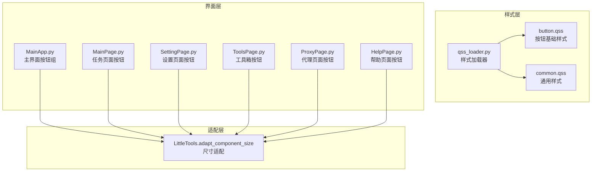
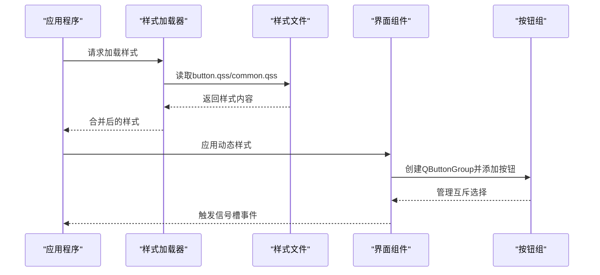
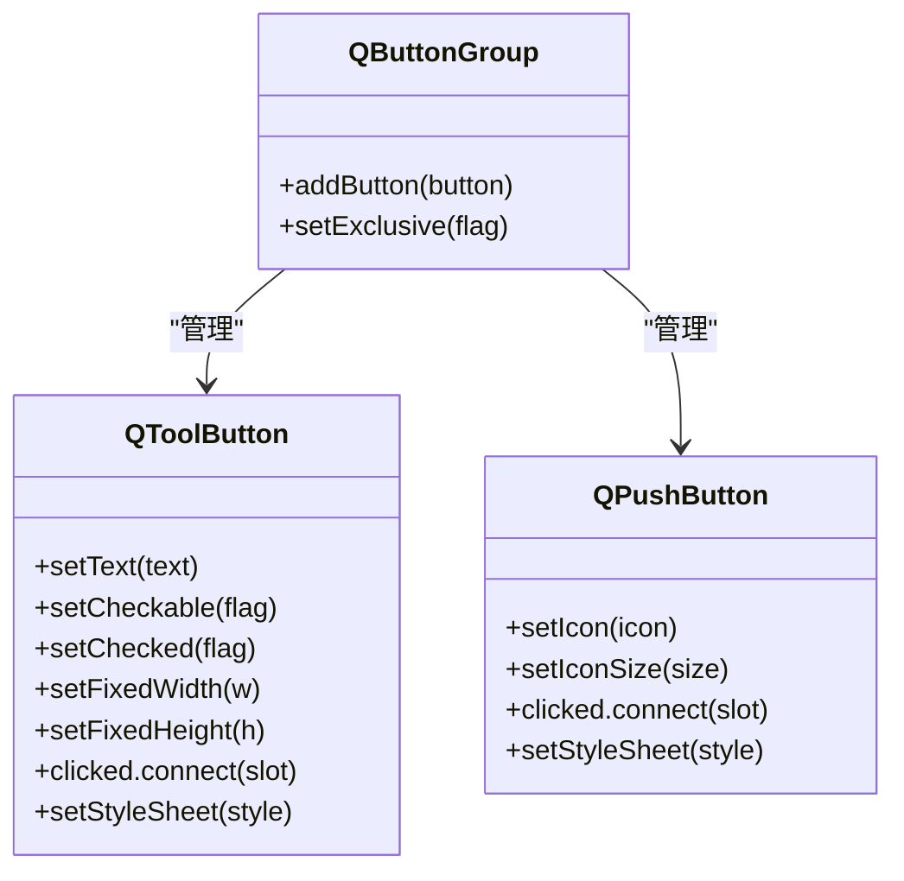
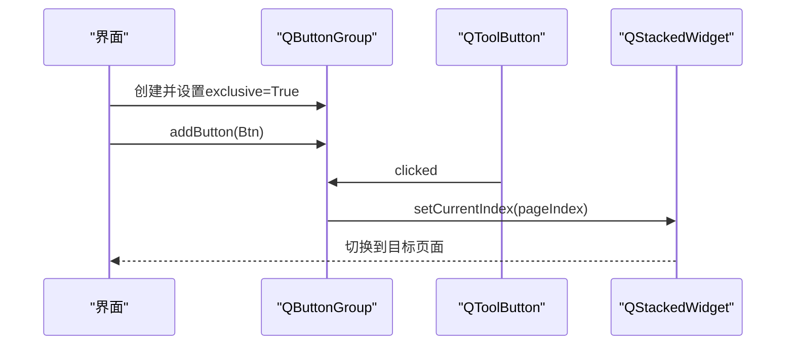
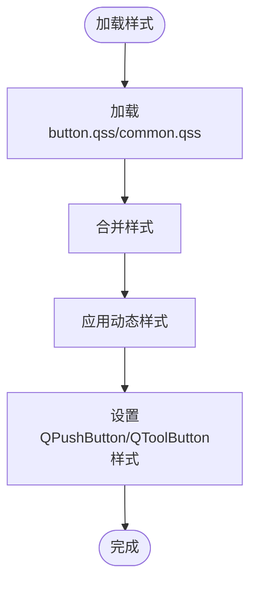
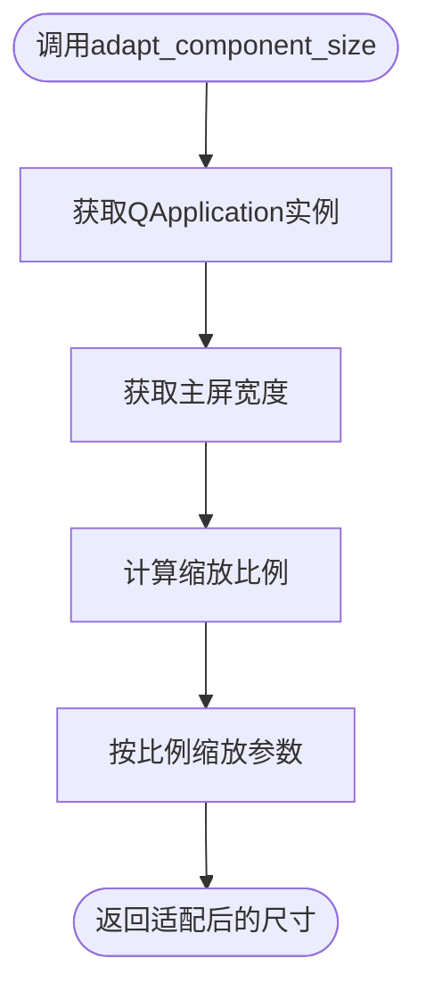
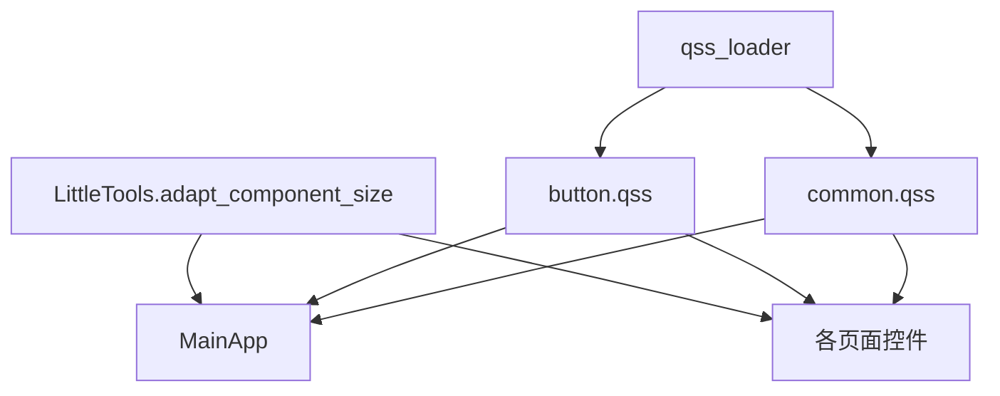

# 按钮系统设计

<cite>
**本文档引用的文件**
- [MainApp.py](file://gui/MainApp.py)
- [LittleTools.py](file://lite_modules/LittleTools.py)
- [button.qss](file://gui/static/qss/button.qss)
- [common.qss](file://gui/static/qss/common.qss)
- [qss_loader.py](file://gui/static/qss/qss_loader.py)
- [MainPage.py](file://gui/MainPage.py)
- [SettingPage.py](file://gui/SettingPage.py)
- [ToolsPage.py](file://gui/ToolsPage.py)
- [ProxyPage.py](file://gui/ProxyPage.py)
- [HelpPage.py](file://gui/HelpPage.py)
</cite>

## 目录
1. [简介](#简介)
2. [项目结构](#项目结构)
3. [核心组件](#核心组件)
4. [架构概览](#架构概览)
5. [详细组件分析](#详细组件分析)
6. [依赖关系分析](#依赖关系分析)
7. [性能考虑](#性能考虑)
8. [故障排查指南](#故障排查指南)
9. [结论](#结论)

## 简介
本文件系统性梳理 ikun_temu_system 的按钮系统设计，覆盖以下关键主题：
- QToolButton 与 QPushButton 的使用方式与样式定制
- QButtonGroup 的实现原理与事件绑定机制
- 按钮样式表设计（悬停、按下、选中状态）
- 按钮尺寸适配机制（adapt_component_size 的应用）
- 布局排列与间距控制策略
- 事件处理最佳实践（信号槽连接与事件转发）
- 可扩展性设计（新增按钮类型的开发指南）
- 样式定制示例与 CSS 说明

## 项目结构
按钮系统主要分布在 GUI 层，采用“样式文件 + 动态样式 + 控件实例”的组合方式：
- 样式文件：button.qss、common.qss 提供基础样式
- 样式加载器：qss_loader.py 统一加载与合并样式
- 适配工具：LittleTools.adapt_component_size 提供跨分辨率适配
- 控件实例：MainApp 中的 QToolButton/QPushButton，以及各页面中的 QPushButton

**图表来源**
- [MainApp.py:370-569](file://gui/MainApp.py#L370-L569)
- [LittleTools.py:148-198](file://lite_modules/LittleTools.py#L148-L198)
- [button.qss:1-54](file://gui/static/qss/button.qss#L1-L54)
- [common.qss:1-117](file://gui/static/qss/common.qss#L1-L117)
- [qss_loader.py:1-57](file://gui/static/qss/qss_loader.py#L1-L57)

**章节来源**
- [MainApp.py:370-569](file://gui/MainApp.py#L370-L569)
- [LittleTools.py:148-198](file://lite_modules/LittleTools.py#L148-L198)
- [button.qss:1-54](file://gui/static/qss/button.qss#L1-L54)
- [common.qss:1-117](file://gui/static/qss/common.qss#L1-L117)
- [qss_loader.py:1-57](file://gui/static/qss/qss_loader.py#L1-L57)

## 核心组件
- QToolButton：用于主界面底部导航按钮组，支持选中态与圆角样式
- QPushButton：用于各页面的功能按钮，支持图标、样式表与信号槽绑定
- QButtonGroup：用于按钮组的互斥选择与事件管理
- adapt_component_size：统一的尺寸适配函数，按屏幕分辨率缩放
- 样式表：button.qss 提供基础按钮样式，common.qss 提供通用控件样式

**章节来源**
- [MainApp.py:406-492](file://gui/MainApp.py#L406-L492)
- [MainPage.py:192-224](file://gui/MainPage.py#L192-L224)
- [SettingPage.py:87-90](file://gui/SettingPage.py#L87-L90)
- [ToolsPage.py:233-242](file://gui/ToolsPage.py#L233-L242)
- [ProxyPage.py:128-133](file://gui/ProxyPage.py#L128-L133)
- [LittleTools.py:148-198](file://lite_modules/LittleTools.py#L148-L198)

## 架构概览
按钮系统采用“样式文件 + 动态样式 + 事件绑定”的三层架构：
- 样式文件层：提供基础视觉风格
- 动态样式层：在运行时根据屏幕分辨率生成样式
- 事件绑定层：通过信号槽连接实现交互逻辑

**图表来源**
- [qss_loader.py:32-57](file://gui/static/qss/qss_loader.py#L32-L57)
- [button.qss:1-54](file://gui/static/qss/button.qss#L1-L54)
- [common.qss:1-117](file://gui/static/qss/common.qss#L1-L117)
- [MainApp.py:406-492](file://gui/MainApp.py#L406-L492)

## 详细组件分析

### QToolButton 与 QPushButton 的使用方式
- QToolButton：主要用于主界面底部导航，支持 setCheckable、setChecked、setFixedWidth/Height 与样式表设置
- QPushButton：广泛用于各页面，支持图标、点击事件与样式表

**图表来源**
- [MainApp.py:416-478](file://gui/MainApp.py#L416-L478)
- [MainPage.py:192-224](file://gui/MainPage.py#L192-L224)
- [SettingPage.py:87-90](file://gui/SettingPage.py#L87-L90)
- [ToolsPage.py:233-242](file://gui/ToolsPage.py#L233-L242)
- [ProxyPage.py:128-133](file://gui/ProxyPage.py#L128-L133)

**章节来源**
- [MainApp.py:416-478](file://gui/MainApp.py#L416-L478)
- [MainPage.py:192-224](file://gui/MainPage.py#L192-L224)
- [SettingPage.py:87-90](file://gui/SettingPage.py#L87-L90)
- [ToolsPage.py:233-242](file://gui/ToolsPage.py#L233-L242)
- [ProxyPage.py:128-133](file://gui/ProxyPage.py#L128-L133)

### QButtonGroup 的实现原理与事件绑定机制
- 创建与配置：在 MainApp 中创建 QButtonGroup 并设置 exclusive=True
- 添加按钮：将 QToolButton 添加到按钮组中
- 事件绑定：通过 lambda 将按钮点击事件绑定到堆栈窗口的页面切换

**图表来源**
- [MainApp.py:406-492](file://gui/MainApp.py#L406-L492)

**章节来源**
- [MainApp.py:406-492](file://gui/MainApp.py#L406-L492)

### 按钮样式表设计
- 基础样式：button.qss 定义 QPushButton 的默认外观与伪状态（hover、pressed）
- 特殊样式：danger/success/warning 类别按钮的差异化颜色
- 通用样式：common.qss 定义通用控件样式，保证整体风格一致
- 动态样式：MainApp 中为 QToolButton 生成动态样式，包含圆角、内边距与选中态高亮

**图表来源**
- [qss_loader.py:32-57](file://gui/static/qss/qss_loader.py#L32-L57)
- [button.qss:1-54](file://gui/static/qss/button.qss#L1-L54)
- [common.qss:1-117](file://gui/static/qss/common.qss#L1-L117)
- [MainApp.py:380-404](file://gui/MainApp.py#L380-L404)

**章节来源**
- [button.qss:1-54](file://gui/static/qss/button.qss#L1-L54)
- [common.qss:1-117](file://gui/static/qss/common.qss#L1-L117)
- [qss_loader.py:32-57](file://gui/static/qss/qss_loader.py#L32-L57)
- [MainApp.py:380-404](file://gui/MainApp.py#L380-L404)

### 尺寸适配机制
- adapt_component_size：根据主屏宽度按比例缩放传入的尺寸参数
- 应用场景：QToolButton 与 QPushButton 的尺寸、内边距、字体大小均通过该函数进行缩放
- 适配策略：优先复用已存在的 QApplication 实例，避免重复创建导致的初始化错误

**图表来源**
- [LittleTools.py:148-198](file://lite_modules/LittleTools.py#L148-L198)
- [MainApp.py:377](file://gui/MainApp.py#L377)
- [MainApp.py:410](file://gui/MainApp.py#L410)
- [MainApp.py:526](file://gui/MainApp.py#L526)

**章节来源**
- [LittleTools.py:148-198](file://lite_modules/LittleTools.py#L148-L198)
- [MainApp.py:377-412](file://gui/MainApp.py#L377-L412)
- [MainApp.py:526-527](file://gui/MainApp.py#L526-L527)

### 布局排列与间距控制
- 按钮容器：使用 QHBoxLayout 管理按钮排列，设置 setSpacing(0) 实现紧密排列
- 圆角与边框：通过样式表为首个与最后一个按钮设置圆角，形成连续的视觉效果
- 间距策略：移除按钮间距，通过边框与内边距控制视觉分隔

**章节来源**
- [MainApp.py:372-375](file://gui/MainApp.py#L372-L375)
- [MainApp.py:389-397](file://gui/MainApp.py#L389-L397)

### 事件处理最佳实践
- 信号槽连接：统一使用 clicked.connect 连接事件，避免使用 lambda 时捕获变量
- 事件转发：通过 QButtonGroup 管理互斥选择，减少重复逻辑
- 图标与尺寸：为按钮设置图标与图标尺寸，提升可识别性

**章节来源**
- [MainApp.py:422](file://gui/MainApp.py#L422)
- [MainPage.py:195](file://gui/MainPage.py#L195)
- [SettingPage.py:88](file://gui/SettingPage.py#L88)
- [ToolsPage.py:239](file://gui/ToolsPage.py#L239)
- [ProxyPage.py:131](file://gui/ProxyPage.py#L131)

### 可扩展性设计
- 新增按钮类型：遵循“先创建控件实例，再设置样式与事件，最后加入按钮组”的流程
- 样式扩展：在 button.qss 中新增类别选择器，或在页面中使用 setStyleSheet 动态注入
- 适配扩展：通过 adapt_component_size 对新按钮的尺寸进行统一缩放

**章节来源**
- [MainApp.py:406-492](file://gui/MainApp.py#L406-L492)
- [button.qss:19-54](file://gui/static/qss/button.qss#L19-L54)

## 依赖关系分析
按钮系统的关键依赖关系如下：
- MainApp 依赖 LittleTools.adapt_component_size 进行尺寸适配
- 各页面依赖 QPushButton/QToolButton 实现功能与导航
- 样式层通过 qss_loader.py 统一加载 button.qss 与 common.qss

**图表来源**
- [LittleTools.py:148-198](file://lite_modules/LittleTools.py#L148-L198)
- [MainApp.py:377-412](file://gui/MainApp.py#L377-L412)
- [qss_loader.py:32-57](file://gui/static/qss/qss_loader.py#L32-L57)
- [button.qss:1-54](file://gui/static/qss/button.qss#L1-L54)
- [common.qss:1-117](file://gui/static/qss/common.qss#L1-L117)

**章节来源**
- [LittleTools.py:148-198](file://lite_modules/LittleTools.py#L148-L198)
- [MainApp.py:377-412](file://gui/MainApp.py#L377-L412)
- [qss_loader.py:32-57](file://gui/static/qss/qss_loader.py#L32-L57)
- [button.qss:1-54](file://gui/static/qss/button.qss#L1-L54)
- [common.qss:1-117](file://gui/static/qss/common.qss#L1-L117)

## 性能考虑
- 样式加载：通过 qss_loader 合并样式，减少多次 I/O 操作
- 尺寸适配：仅在初始化阶段计算缩放比例，避免频繁计算
- 事件绑定：使用 QButtonGroup 管理互斥选择，减少重复逻辑与状态维护成本

## 故障排查指南
- 样式不生效：检查 qss_loader 是否正确加载 button.qss/common.qss，确认样式拼接逻辑
- 尺寸异常：确认 QApplication 实例已初始化，避免在无实例环境下调用 adapt_component_size
- 事件无响应：检查 clicked 信号是否正确连接，避免 lambda 捕获变量导致的引用问题

**章节来源**
- [qss_loader.py:8-23](file://gui/static/qss/qss_loader.py#L8-L23)
- [LittleTools.py:155-173](file://lite_modules/LittleTools.py#L155-L173)
- [MainApp.py:422](file://gui/MainApp.py#L422)

## 结论
本按钮系统通过样式文件、动态样式与尺寸适配的协同，实现了跨分辨率的一致视觉体验；通过 QButtonGroup 与信号槽机制，提供了清晰的事件处理与互斥选择能力。整体设计具备良好的可扩展性，便于新增按钮类型与样式变体。