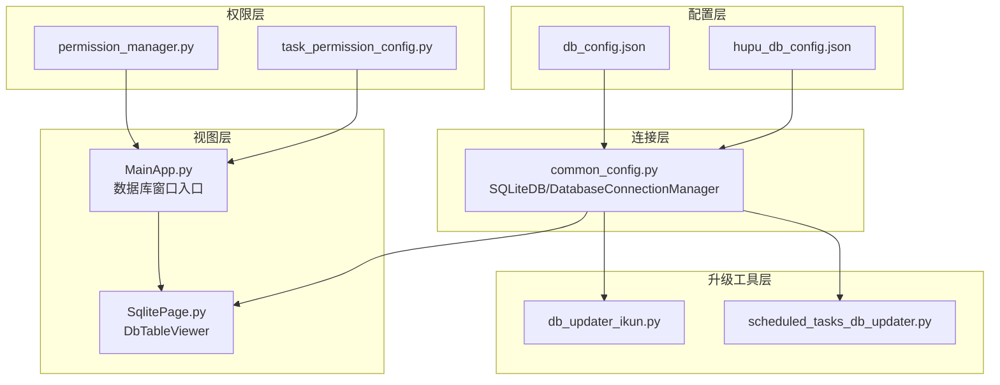
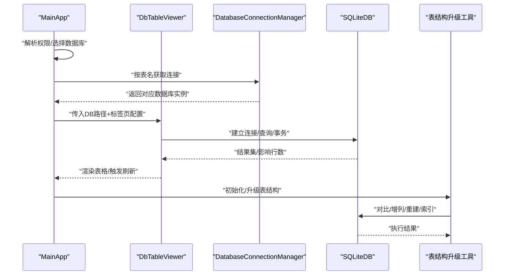
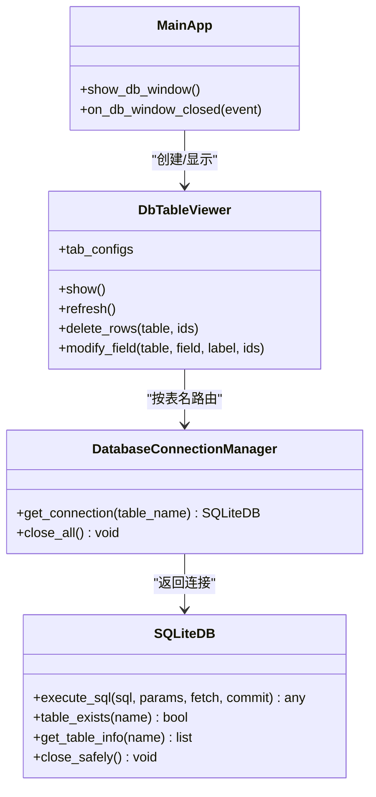
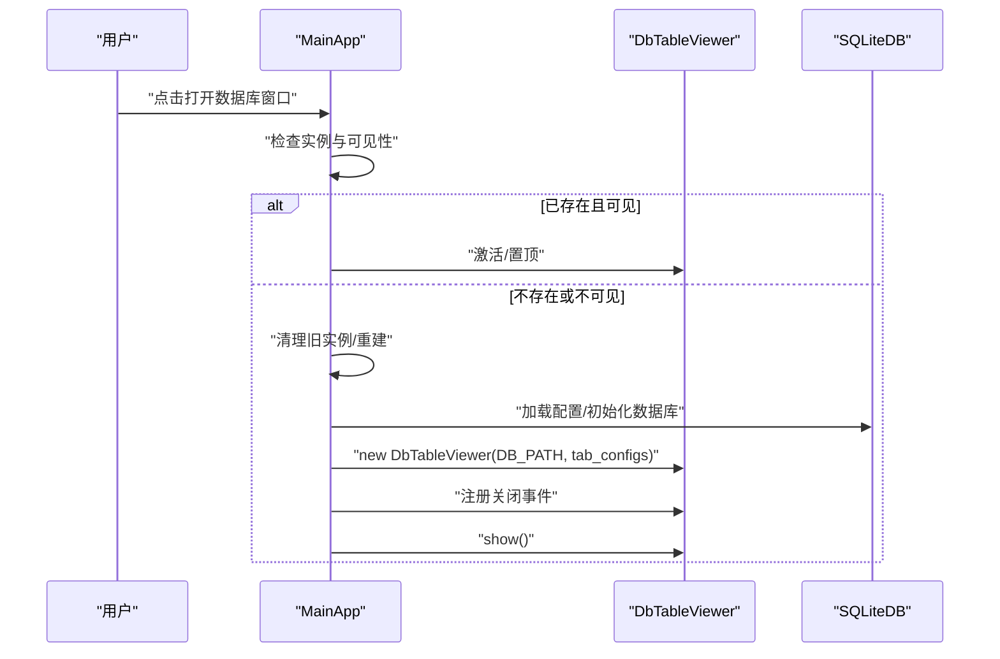
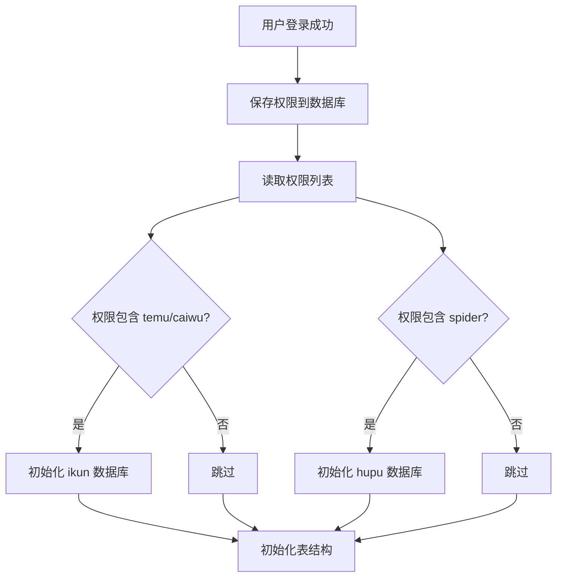
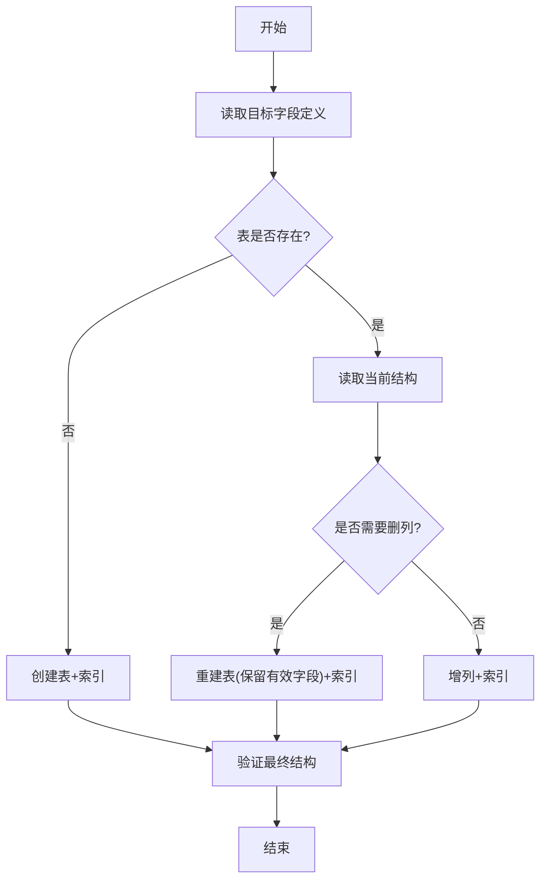
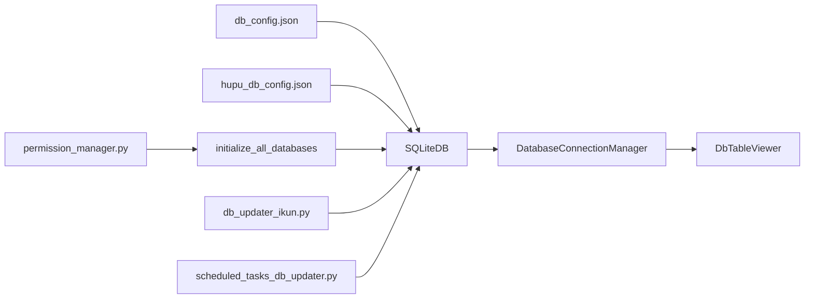

# 数据库集成管理

<cite>
**本文档引用的文件**
- [common_config.py](file://config/common_config.py)
- [permission_manager.py](file://config/permission_manager.py)
- [task_permission_config.py](file://config/task_permission_config.py)
- [classSQLite.py](file://modules/classSQLite.py)
- [db_updater_ikun.py](file://utils/db_updater_ikun.py)
- [scheduled_tasks_db_updater.py](file://utils/scheduled_tasks_db_updater.py)
- [SqlitePage.py](file://gui/SqlitePage.py)
- [MainApp.py](file://gui/MainApp.py)
- [LoginPage.py](file://gui/LoginPage.py)
- [db_config.json](file://配置文件_系统配置/db_config.json)
- [hupu_db_config.json](file://配置文件_系统配置/hupu_db_config.json)
</cite>

## 目录
1. [简介](#简介)
2. [项目结构](#项目结构)
3. [核心组件](#核心组件)
4. [架构总览](#架构总览)
5. [组件详解](#组件详解)
6. [依赖关系分析](#依赖关系分析)
7. [性能与安全](#性能与安全)
8. [故障排查指南](#故障排查指南)
9. [结论](#结论)
10. [附录](#附录)

## 简介
本文件面向“ikun_temu_system”的数据库集成管理，围绕以下目标展开：
- 解释 DbTableViewer 的实现原理与数据库连接管理
- 说明数据库窗口的创建、显示与可见性控制
- 描述不同权限模式下的数据库页面配置与访问控制
- 详述任务管理、店铺管理、AI分析等数据表的显示配置
- 说明数据库连接的动态配置与路径管理机制
- 提供安全与性能优化建议
- 给出扩展方式与新增表支持的开发流程
- 提供连接错误处理与故障排除指南

## 项目结构
数据库相关能力由“配置层”“连接层”“视图层”“权限层”“升级工具层”共同组成：
- 配置层：db_config.json、hupu_db_config.json 提供数据库路径、连接参数、连接池配置等
- 连接层：common_config.py 中的 SQLiteDB 与 DatabaseConnectionManager 提供连接与路由
- 视图层：SqlitePage.py 中的 DbTableViewer 负责多标签页表格展示与交互
- 权限层：permission_manager.py、task_permission_config.py 控制页面与功能访问
- 升级工具层：db_updater_ikun.py、scheduled_tasks_db_updater.py 管理表结构演进

图表来源
- [common_config.py:15-51](file://config/common_config.py#L15-L51)
- [SqlitePage.py:3520-3600](file://gui/SqlitePage.py#L3520-L3600)
- [MainApp.py:650-957](file://gui/MainApp.py#L650-L957)
- [permission_manager.py:12-126](file://config/permission_manager.py#L12-L126)
- [task_permission_config.py:7-84](file://config/task_permission_config.py#L7-L84)
- [db_updater_ikun.py:10-148](file://utils/db_updater_ikun.py#L10-L148)
- [scheduled_tasks_db_updater.py:17-161](file://utils/scheduled_tasks_db_updater.py#L17-L161)

章节来源
- [common_config.py:15-51](file://config/common_config.py#L15-L51)
- [db_config.json:1-19](file://配置文件_系统配置/db_config.json#L1-L19)
- [hupu_db_config.json:1-18](file://配置文件_系统配置/hupu_db_config.json#L1-L18)

## 核心组件
- SQLiteDB：封装 SQLite 连接、连接池、事务、查询构建与 WAL 合并等能力，支持同步/异步、线程本地连接、预热校验等
- DatabaseConnectionManager：按表名路由到主库或虎扑库，统一连接缓存与关闭
- DbTableViewer：基于 PyQt5 的多标签页表格查看器，负责按配置渲染列、宽度、右键菜单、搜索与刷新
- 权限体系：PermissionManager 负责权限持久化与加载；task_permission_config 定义任务类型与权限映射
- 表结构升级工具：db_updater_ikun.py、scheduled_tasks_db_updater.py 提供通用表结构对比、增列、重建表、索引保证等

章节来源
- [classSQLite.py:357-400](file://modules/classSQLite.py#L357-L400)
- [common_config.py:16-48](file://config/common_config.py#L16-L48)
- [SqlitePage.py:3520-3600](file://gui/SqlitePage.py#L3520-L3600)
- [permission_manager.py:12-126](file://config/permission_manager.py#L12-L126)
- [task_permission_config.py:7-84](file://config/task_permission_config.py#L7-L84)
- [db_updater_ikun.py:10-148](file://utils/db_updater_ikun.py#L10-L148)
- [scheduled_tasks_db_updater.py:17-161](file://utils/scheduled_tasks_db_updater.py#L17-L161)

## 架构总览
数据库集成采用“配置驱动 + 动态路由 + 视图渲染 + 权限控制 + 结构升级”的分层设计。

图表来源
- [MainApp.py:650-957](file://gui/MainApp.py#L650-L957)
- [common_config.py:16-48](file://config/common_config.py#L16-L48)
- [SqlitePage.py:3520-3600](file://gui/SqlitePage.py#L3520-L3600)
- [db_updater_ikun.py:10-148](file://utils/db_updater_ikun.py#L10-L148)

## 组件详解

### DbTableViewer 实现原理与数据库连接管理
- 视图职责
  - 多标签页展示不同表，每个标签页可配置列集合、列宽策略、右键菜单动作、搜索条件等
  - 通过父类传递的数据库路径与配置数组，动态生成表格控件
  - 提供搜索、刷新、编辑字段、删除行等操作回调
- 连接管理
  - 通过 DatabaseConnectionManager 按表名路由到主库或虎扑库
  - 使用 SQLiteDB 的连接池与线程本地连接，减少频繁连接开销
  - 在视图生命周期内保持连接复用，避免重复创建/销毁
- 窗口生命周期
  - MainApp 统一创建 DbTableViewer 实例，保存引用并注册关闭事件
  - 若窗口已存在且不可见，先清理再重建，确保唯一实例与资源释放

图表来源
- [common_config.py:16-48](file://config/common_config.py#L16-L48)
- [SqlitePage.py:3520-3600](file://gui/SqlitePage.py#L3520-L3600)
- [MainApp.py:650-957](file://gui/MainApp.py#L650-L957)

章节来源
- [SqlitePage.py:3520-3600](file://gui/SqlitePage.py#L3520-L3600)
- [MainApp.py:650-957](file://gui/MainApp.py#L650-L957)
- [common_config.py:16-48](file://config/common_config.py#L16-L48)

### 数据库窗口创建与显示机制（含实例管理与可见性控制）
- 创建流程
  - MainApp 根据应用根目录拼接 db_config.json 路径
  - 依据用户权限决定初始化哪些数据库（如 temu/caiwu 初始化 ikun 数据库；spider 初始化虎扑数据库）
  - 构造 DbTableViewer 并传入标签页配置数组
  - 保存窗口引用，绑定关闭事件，调用 show() 显示
- 实例管理
  - 若已有实例且可见，激活并置顶
  - 若实例存在但不可见，先 close/deleteLater 再重建
  - 关闭事件中将引用置空，避免内存泄漏
- 可见性控制
  - 通过 isVisible() 判断，避免重复创建
  - raise_()/activateWindow() 确保窗口在前台

图表来源
- [MainApp.py:650-957](file://gui/MainApp.py#L650-L957)

章节来源
- [MainApp.py:650-957](file://gui/MainApp.py#L650-L957)

### 不同权限模式下的数据库页面配置与访问控制
- 权限持久化与加载
  - 登录成功后，将权限写入数据库 config 表
  - 后续从数据库读取权限，用于判断页面与功能可用性
- 任务类型与权限映射
  - 任务类型（如上传实拍图、核价、JIT维护库存、财务报表、虎扑采集等）与权限（temu/caiwu/spider）一一对应
  - check_task_permission 支持中文任务名称与数字编码
- 页面访问控制
  - 根据权限决定是否初始化对应数据库与表结构
  - 在视图层结合权限过滤菜单项与按钮，避免越权操作

图表来源
- [LoginPage.py:418-443](file://gui/LoginPage.py#L418-L443)
- [permission_manager.py:16-87](file://config/permission_manager.py#L16-L87)
- [task_permission_config.py:55-84](file://config/task_permission_config.py#L55-L84)
- [common_config.py:245-334](file://config/common_config.py#L245-L334)

章节来源
- [LoginPage.py:418-443](file://gui/LoginPage.py#L418-L443)
- [permission_manager.py:12-126](file://config/permission_manager.py#L12-L126)
- [task_permission_config.py:7-84](file://config/task_permission_config.py#L7-L84)
- [common_config.py:245-334](file://config/common_config.py#L245-L334)

### 任务管理、店铺管理、AI分析等数据表的显示配置
- 配置模型
  - 每个标签页通过 create_tab_config 定义：tab_name、table_name、columns_to_display、column_width_config、context_menu_actions
  - 支持固定列宽、右键菜单动作（修改字段、删除行、清空认证等）
- 店铺管理（shops）
  - 展示字段：id、shop_name、shop_abbr、phone、password、connect_status、create_time、update_time、headers、cookies 等
  - 右键菜单：修改手机号、修改密码、清空认证、删除选中行
- 任务管理（task）
  - 展示字段：task_name、task_id、status、msg、remarks、task_group、func_name、mall_id、task_kwargs、is_main_task、is_maintain_task、auto_rerun_time、parent_task_id、log、create_time、update_time、func_path、ip 等
  - 右键菜单：删除选中行、刷新状态等（具体以实现为准）
- AI分析（ai_analysis）
  - 通过 DatabaseConnectionManager 路由到主库，按配置渲染列与菜单
- 虎扑采集（hupu_*）
  - 通过 DatabaseConnectionManager 路由到虎扑库，按配置渲染列与菜单

章节来源
- [SqlitePage.py:4122-4151](file://gui/SqlitePage.py#L4122-L4151)
- [common_config.py:28-37](file://config/common_config.py#L28-L37)

### 数据库连接的动态配置与路径管理机制
- 配置文件
  - db_config.json：ikun.db 路径、超时、外键、WAL、缓存、同步级别、连接池参数、调试开关
  - hupu_db_config.json：hupu.db 路径、超时、外键、WAL、缓存、同步级别、连接池参数、调试开关
- 初始化流程
  - 若配置文件不存在，自动创建默认配置
  - 初始化时根据权限决定是否初始化 ikun 或 hupu 数据库
  - WAL 检查点与连接关闭在全局安全关闭流程中执行
- 路由机制
  - DatabaseConnectionManager 按表名将 task/shop/ai_analysis 路由到主库，hupu_* 路由到虎扑库

章节来源
- [db_config.json:1-19](file://配置文件_系统配置/db_config.json#L1-L19)
- [hupu_db_config.json:1-18](file://配置文件_系统配置/hupu_db_config.json#L1-L18)
- [common_config.py:157-196](file://config/common_config.py#L157-L196)
- [common_config.py:197-243](file://config/common_config.py#L197-L243)
- [common_config.py:245-334](file://config/common_config.py#L245-L334)
- [common_config.py:46-48](file://config/common_config.py#L46-L48)

### 表结构升级与扩展支持
- 通用升级流程
  - update_table_structure：对比目标字段与当前结构，必要时重建表（保留有效字段）、增列、创建索引、验证最终结构
  - 支持唯一约束、索引、外键（定时任务表）等
- 典型表升级
  - shops：新增字段、唯一约束、索引
  - task：字段与索引
  - scheduled_tasks：外键、索引
- 扩展新表流程
  - 在 utils 下新增升级脚本，定义目标字段、唯一约束、索引、外键
  - 在初始化流程中调用相应初始化函数
  - 在 DbTableViewer 的标签页配置中增加新表的展示配置

图表来源
- [db_updater_ikun.py:10-148](file://utils/db_updater_ikun.py#L10-L148)
- [scheduled_tasks_db_updater.py:17-161](file://utils/scheduled_tasks_db_updater.py#L17-L161)

章节来源
- [db_updater_ikun.py:150-196](file://utils/db_updater_ikun.py#L150-L196)
- [db_updater_ikun.py:198-250](file://utils/db_updater_ikun.py#L198-L250)
- [scheduled_tasks_db_updater.py:163-195](file://utils/scheduled_tasks_db_updater.py#L163-L195)

## 依赖关系分析
- 配置文件依赖 SQLiteDB：db_config.json/hupu_db_config.json 作为 SQLiteDB 的输入
- DatabaseConnectionManager 依赖 SQLiteDB：按表名返回连接实例
- DbTableViewer 依赖 DatabaseConnectionManager：按表名获取连接并渲染
- 初始化流程依赖权限：根据权限决定初始化哪些数据库与表结构
- 升级工具依赖 SQLiteDB：执行结构变更 SQL

图表来源
- [db_config.json:1-19](file://配置文件_系统配置/db_config.json#L1-L19)
- [hupu_db_config.json:1-18](file://配置文件_系统配置/hupu_db_config.json#L1-L18)
- [common_config.py:16-48](file://config/common_config.py#L16-L48)
- [SqlitePage.py:3520-3600](file://gui/SqlitePage.py#L3520-L3600)
- [permission_manager.py:12-126](file://config/permission_manager.py#L12-L126)
- [db_updater_ikun.py:10-148](file://utils/db_updater_ikun.py#L10-L148)
- [scheduled_tasks_db_updater.py:17-161](file://utils/scheduled_tasks_db_updater.py#L17-L161)

章节来源
- [common_config.py:16-48](file://config/common_config.py#L16-L48)
- [SqlitePage.py:3520-3600](file://gui/SqlitePage.py#L3520-L3600)
- [permission_manager.py:12-126](file://config/permission_manager.py#L12-L126)
- [db_updater_ikun.py:10-148](file://utils/db_updater_ikun.py#L10-L148)
- [scheduled_tasks_db_updater.py:17-161](file://utils/scheduled_tasks_db_updater.py#L17-L161)

## 性能与安全
- 性能优化
  - 使用 WAL 模式与合理的 cache_size、synchronous，提升并发读写性能
  - 启用连接池与连接预热（pool_pre_ping），降低连接抖动
  - 为高频查询字段建立索引，避免全表扫描
  - 批量更新使用事务与参数化查询，减少往返次数
- 安全加固
  - 严格权限控制：页面与功能访问均基于权限判定
  - 数据库关闭时执行 WAL 检查点，合并 WAL/SHM，避免文件损坏
  - 对外部输入进行参数化绑定，避免 SQL 注入
  - 配置文件与数据库文件权限最小化，避免被恶意读取

章节来源
- [common_config.py:82-130](file://config/common_config.py#L82-L130)
- [db_config.json:6-8](file://配置文件_系统配置/db_config.json#L6-L8)
- [hupu_db_config.json:6-8](file://配置文件_系统配置/hupu_db_config.json#L6-L8)

## 故障排查指南
- 数据库初始化失败
  - 检查 db_config.json/hupu_db_config.json 是否存在且可读
  - 确认数据库文件路径正确，权限允许读写
  - 查看日志中“初始化 ikun/hupu 数据库失败”的具体原因
- 表结构不一致
  - 运行表结构升级工具，确认目标字段、索引、唯一约束与外键
  - 如需删列，注意数据丢失风险，必要时备份数据库
- 视图无法显示或崩溃
  - 检查 DbTableViewer 的标签页配置是否正确
  - 确认父级窗口引用与 tab_widget 有效
- 权限导致页面不可用
  - 检查数据库中 config 表的 permissions 字段
  - 确认任务类型与权限映射是否匹配
- 连接异常或文件占用
  - 关闭其他可能占用数据库的进程
  - 执行安全关闭流程，确保 WAL 检查点完成

章节来源
- [common_config.py:245-334](file://config/common_config.py#L245-L334)
- [db_updater_ikun.py:71-86](file://utils/db_updater_ikun.py#L71-L86)
- [SqlitePage.py:3120-3144](file://gui/SqlitePage.py#L3120-L3144)
- [permission_manager.py:57-87](file://config/permission_manager.py#L57-L87)

## 结论
本系统通过“配置驱动 + 动态路由 + 视图渲染 + 权限控制 + 结构升级”的架构，实现了数据库的统一接入与灵活扩展。DbTableViewer 提供了直观的表格展示与交互能力；DatabaseConnectionManager 与 SQLiteDB 确保连接与性能；权限体系保障了访问安全；升级工具使表结构演进可控。遵循本文的扩展流程与最佳实践，可快速支持新表与新功能。

## 附录
- 新增表支持流程
  - 在 utils 下编写升级脚本，定义目标字段、索引、唯一约束、外键
  - 在初始化流程中调用相应初始化函数
  - 在 DbTableViewer 的标签页配置中增加新表的展示配置
  - 根据需要在权限体系中补充任务类型与权限映射

章节来源
- [db_updater_ikun.py:150-196](file://utils/db_updater_ikun.py#L150-L196)
- [scheduled_tasks_db_updater.py:163-195](file://utils/scheduled_tasks_db_updater.py#L163-L195)
- [SqlitePage.py:4122-4151](file://gui/SqlitePage.py#L4122-L4151)
- [task_permission_config.py:55-84](file://config/task_permission_config.py#L55-L84)