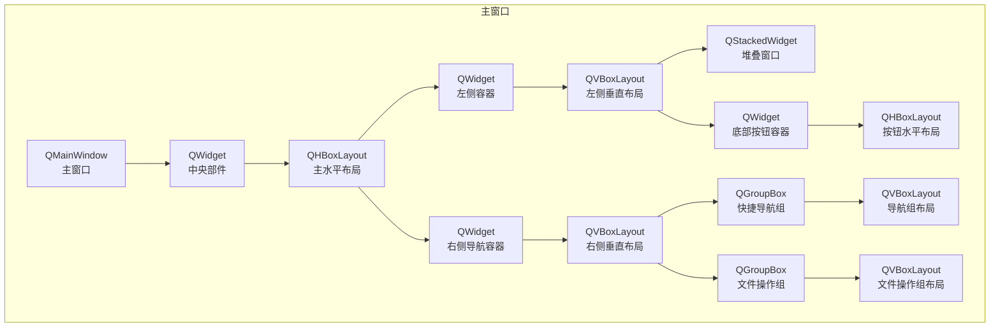
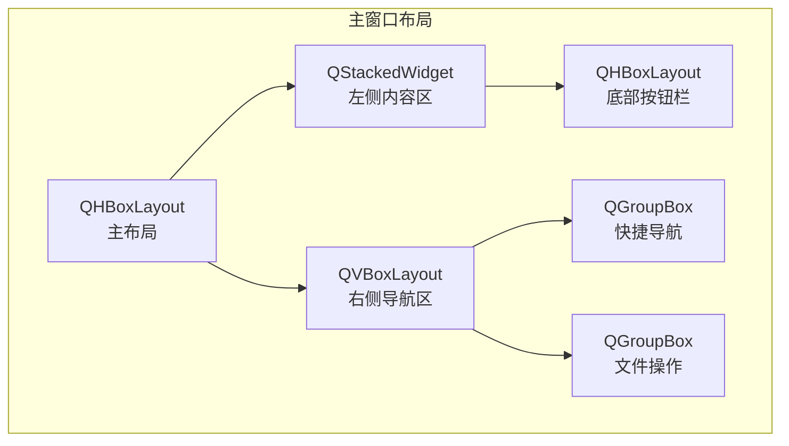
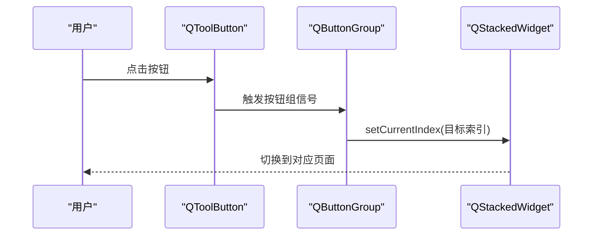
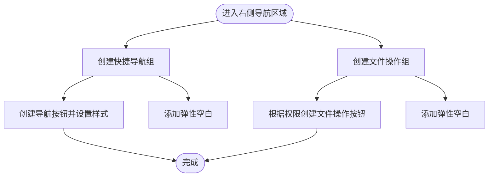
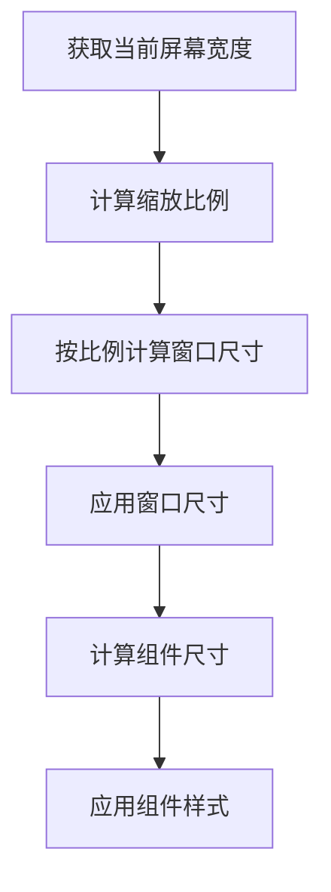
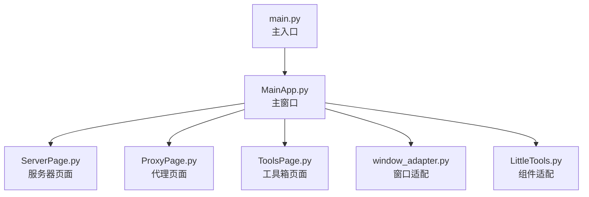

# 窗口布局设计

<cite>
**本文档引用的文件**
- [MainApp.py](file://gui/MainApp.py)
- [MainPage.py](file://gui/MainPage.py)
- [ProxyPage.py](file://gui/ProxyPage.py)
- [ServerPage.py](file://gui/ServerPage.py)
- [ToolsPage.py](file://gui/ToolsPage.py)
- [window_adapter.py](file://gui/utils/window_adapter.py)
- [LittleTools.py](file://lite_modules/LittleTools.py)
- [main.py](file://main.py)
</cite>

## 目录
1. [简介](#简介)
2. [项目结构](#项目结构)
3. [核心组件](#核心组件)
4. [架构总览](#架构总览)
5. [详细组件分析](#详细组件分析)
6. [依赖分析](#依赖分析)
7. [性能考虑](#性能考虑)
8. [故障排查指南](#故障排查指南)
9. [结论](#结论)
10. [附录](#附录)

## 简介
本文件面向 ikun_temu_system 的主窗口布局设计，系统性阐述主窗口的整体布局架构、左右分区设计理念、容器组件的尺寸分配策略、左侧堆叠窗口的页面管理与切换机制、右侧导航区域的组织方式、动态适配机制与响应式设计、组件间距与对齐控制，以及布局优化最佳实践与常见问题解决方案。

## 项目结构
主窗口布局位于 GUI 层，采用 PyQt5 实现，核心入口在主程序中初始化并展示主窗口。主窗口采用水平方向的主布局，左侧为内容区（堆叠窗口 + 底部按钮栏），右侧为导航区（分组按钮与文件操作按钮）。布局具备动态适配能力，能够根据屏幕分辨率等比例缩放组件尺寸。

图表来源
- [MainApp.py:334-508](file://gui/MainApp.py#L334-L508)

章节来源
- [MainApp.py:312-508](file://gui/MainApp.py#L312-L508)
- [main.py:120-170](file://main.py#L120-L170)

## 核心组件
- 主窗口与中央部件：主窗口为 QMainWindow，中央部件为 QWidget，承载主布局。
- 左侧内容区：采用 QStackedWidget 管理多个页面（服务器、代理、工具箱等），并配合底部按钮栏实现页面切换。
- 右侧导航区：分为“快捷导航”和“文件操作”两个 QGroupBox，内部使用 QVBoxLayout 组织按钮。
- 动态适配：通过窗口适配工具与组件尺寸适配工具，按屏幕宽度等比例缩放窗口与组件尺寸。

章节来源
- [MainApp.py:334-508](file://gui/MainApp.py#L334-L508)
- [window_adapter.py:9-36](file://gui/utils/window_adapter.py#L9-L36)
- [LittleTools.py:148-198](file://lite_modules/LittleTools.py#L148-L198)

## 架构总览
主窗口采用“左右分区 + 响应式”的布局策略：
- 左侧内容区（70%）：堆叠窗口承载页面，底部按钮栏提供页面切换入口。
- 右侧导航区（30%）：快捷导航与文件操作按钮分组，便于用户快速定位功能与文件夹。
- 适配策略：主窗口尺寸按基准分辨率等比缩放；组件尺寸通过统一的适配函数动态计算。

图表来源
- [MainApp.py:334-508](file://gui/MainApp.py#L334-L508)

章节来源
- [MainApp.py:334-508](file://gui/MainApp.py#L334-L508)

## 详细组件分析

### 左侧堆叠窗口区域（内容区）
- 容器与布局
  - 左侧容器为 QWidget，内部使用 QVBoxLayout 管理堆叠窗口与底部按钮栏。
  - 堆叠窗口 QStackedWidget 默认显示服务器页面，其他页面（代理、工具箱等）按需添加。
- 页面管理与切换
  - 底部按钮栏使用 QToolButton + QButtonGroup 实现页面切换，按钮组设置为互斥（exclusive），确保同一时刻仅有一个页面处于激活状态。
  - 按钮点击事件绑定到 QStackedWidget 的 setCurrentIndex，实现页面切换。
- 尺寸分配
  - 左侧容器在主布局中使用 stretch=70，占据主窗口约 70% 的宽度。
  - 堆叠窗口使用 stretch=1，使其在垂直方向上占据剩余空间，底部按钮栏高度固定。
- 组件间距与对齐
  - 左侧容器的垂直布局设置内容区与按钮栏之间的间距为 20 像素。
  - 底部按钮栏内部使用 QHBoxLayout，按钮样式通过统一的样式表设置圆角与悬停/选中状态。

图表来源
- [MainApp.py:407-492](file://gui/MainApp.py#L407-L492)

章节来源
- [MainApp.py:341-492](file://gui/MainApp.py#L341-L492)

### 右侧导航区域（快捷导航与文件操作）
- 容器与布局
  - 右侧容器为 QWidget，内部使用 QVBoxLayout，顶部对齐，设置内容边距与间距为 0。
  - 导航区在主布局中使用 stretch=30，占据主窗口约 30% 的宽度。
- 快捷导航组
  - 使用 QGroupBox 包裹，内部 QVBoxLayout 组织按钮，设置统一的内边距与间距。
  - 按钮样式通过样式表设置背景色、圆角、字体大小、最小高度等，支持悬停与按下状态。
- 文件操作组
  - 使用 QGroupBox 包裹，内部 QVBoxLayout 组织按钮，根据权限动态显示“系统配置”、“工具配置表”、“实拍图配置”、“结算导出”、“成本配置”、“财务汇总”等按钮。
  - 按钮样式与快捷导航一致，便于用户识别与操作。
- 对齐与间距
  - 右侧容器布局设置为顶部对齐，按钮组之间通过统一的间距控制，确保视觉平衡。

图表来源
- [MainApp.py:496-633](file://gui/MainApp.py#L496-L633)

章节来源
- [MainApp.py:496-633](file://gui/MainApp.py#L496-L633)

### 动态适配机制与响应式设计
- 窗口尺寸适配
  - 通过窗口适配工具函数，以 2560 分辨率作为基准，按当前屏幕宽度等比缩放窗口尺寸。
  - 主窗口在初始化时调用适配函数，确保在不同分辨率下窗口大小合理。
- 组件尺寸适配
  - 通过组件尺寸适配函数，将按钮、字体、内边距等尺寸按比例缩放，保证在高 DPI 屏幕上的可读性与可用性。
  - 适配函数在运行时复用已存在的 QApplication 实例，避免重复创建导致的初始化问题。
- 响应式布局
  - 主布局使用 stretch 比例分配左右区域，保证在窗口缩放时比例保持稳定。
  - 右侧导航区的最大/最小宽度通过适配函数动态设置，确保在不同分辨率下导航区宽度合理。

图表来源
- [window_adapter.py:9-36](file://gui/utils/window_adapter.py#L9-L36)
- [LittleTools.py:148-198](file://lite_modules/LittleTools.py#L148-L198)
- [MainApp.py:308-327](file://gui/MainApp.py#L308-L327)

章节来源
- [window_adapter.py:9-36](file://gui/utils/window_adapter.py#L9-L36)
- [LittleTools.py:148-198](file://lite_modules/LittleTools.py#L148-L198)
- [MainApp.py:308-327](file://gui/MainApp.py#L308-L327)

### 组件间的间距控制与对齐方式
- 左侧容器
  - 内容边距：上下左右分别为 10、0、10、20（像素）。
  - 垂直间距：内容区与按钮栏之间为 20 像素。
- 右侧容器
  - 内容边距与间距均设置为 0，确保导航区紧贴窗口边缘。
  - 按钮组内部设置统一的内边距与间距，保证按钮排列整齐。
- 主布局
  - 左右分区使用 setSpacing(0)，避免两侧留白造成视觉不协调。

章节来源
- [MainApp.py:342-345](file://gui/MainApp.py#L342-L345)
- [MainApp.py:498-508](file://gui/MainApp.py#L498-L508)

### 页面与功能模块的集成
- 服务器页面
  - 作为堆叠窗口的第一个页面，负责启动/停止服务器与日志输出。
  - 通过信号与主窗口联动，实现页面切换与状态同步。
- 代理页面
  - 提供代理 IP 管理、接口模式、格式转换等功能，页面通过堆叠窗口集成到主窗口。
- 工具箱页面
  - 提供 HTTP 请求、请求设置、实拍图标注测试、压测模块等功能，页面通过堆叠窗口集成到主窗口。

章节来源
- [ServerPage.py:118-137](file://gui/ServerPage.py#L118-L137)
- [ProxyPage.py:73-96](file://gui/ProxyPage.py#L73-L96)
- [ToolsPage.py:25-48](file://gui/ToolsPage.py#L25-L48)

## 依赖分析
- 主窗口依赖
  - 主窗口依赖于页面模块（服务器、代理、工具箱）作为堆叠窗口的页面。
  - 导航区依赖权限管理模块，根据权限动态显示文件操作按钮。
- 适配工具依赖
  - 窗口适配工具依赖 QApplication.primaryScreen 获取当前屏幕分辨率。
  - 组件适配工具依赖 QApplication.instance 获取应用实例，避免重复创建。
- 入口依赖
  - 主程序负责初始化 QApplication 与事件循环，然后创建并显示主窗口。

图表来源
- [MainApp.py:353-367](file://gui/MainApp.py#L353-L367)
- [main.py:120-170](file://main.py#L120-L170)

章节来源
- [MainApp.py:353-367](file://gui/MainApp.py#L353-L367)
- [main.py:120-170](file://main.py#L120-L170)

## 性能考虑
- 布局性能
  - 使用 stretch 比例分配减少频繁的尺寸计算与重绘。
  - 将按钮样式集中设置，避免在运行时频繁修改样式导致的性能损耗。
- 适配性能
  - 适配函数仅在窗口初始化与尺寸变化时调用，避免在高频事件中重复计算。
  - 组件适配函数复用现有 QApplication 实例，避免重复创建带来的开销。
- 页面切换性能
  - 堆叠窗口切换页面时仅切换可见页面，其他页面不参与渲染，降低内存与 CPU 占用。

## 故障排查指南
- 窗口尺寸异常
  - 检查窗口适配函数是否正确获取当前屏幕宽度，确认缩放比例计算无误。
  - 确认主窗口在初始化时调用了适配函数。
- 组件尺寸不一致
  - 检查组件适配函数是否在运行时获取到 QApplication 实例。
  - 确认样式表中使用的尺寸单位与适配函数返回值一致。
- 页面切换无效
  - 检查按钮组是否设置为互斥（exclusive），确保只有一个按钮处于选中状态。
  - 确认按钮点击事件正确绑定到 QStackedWidget 的 setCurrentIndex。
- 导航按钮显示异常
  - 检查权限管理模块是否正确加载权限，确认文件操作按钮的显示逻辑。
  - 确认按钮样式表设置是否正确，避免样式覆盖导致按钮不可见。

章节来源
- [window_adapter.py:9-36](file://gui/utils/window_adapter.py#L9-L36)
- [LittleTools.py:148-198](file://lite_modules/LittleTools.py#L148-L198)
- [MainApp.py:407-492](file://gui/MainApp.py#L407-L492)

## 结论
本布局设计以“左右分区 + 堆叠窗口 + 导航区”的方式实现了清晰的功能划分与良好的用户体验。通过动态适配机制，系统能够在不同分辨率与 DPI 下保持一致的视觉与交互体验。底部按钮栏与导航区的组织方式提升了页面切换与功能访问的效率。建议在后续迭代中进一步优化按钮组的样式一致性与权限控制的可扩展性。

## 附录
- 最佳实践
  - 使用 stretch 比例分配主布局，确保在窗口缩放时比例稳定。
  - 将样式表集中管理，避免在运行时频繁修改样式。
  - 在权限控制中采用统一的权限管理模块，确保按钮显示逻辑清晰。
- 常见问题
  - 窗口适配失败：检查 QApplication 实例是否已创建。
  - 组件适配异常：确认适配函数在运行时获取到正确的屏幕宽度。
  - 页面切换失效：检查按钮组互斥设置与信号绑定。