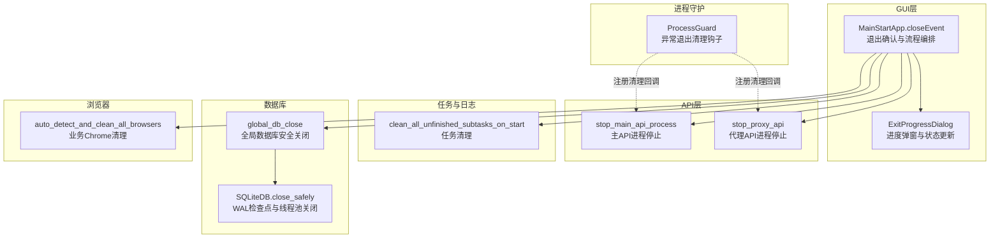
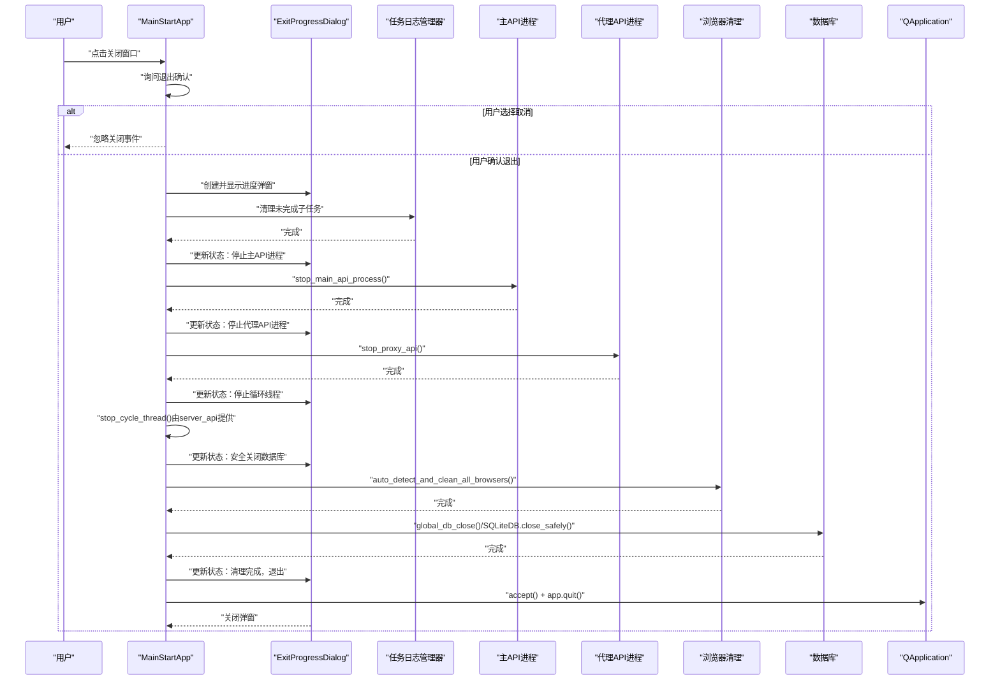
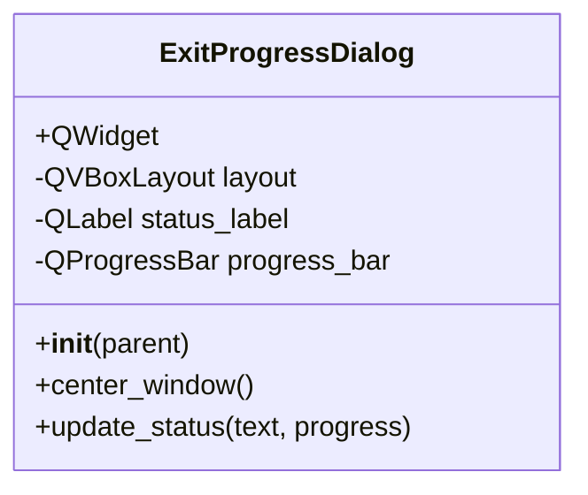
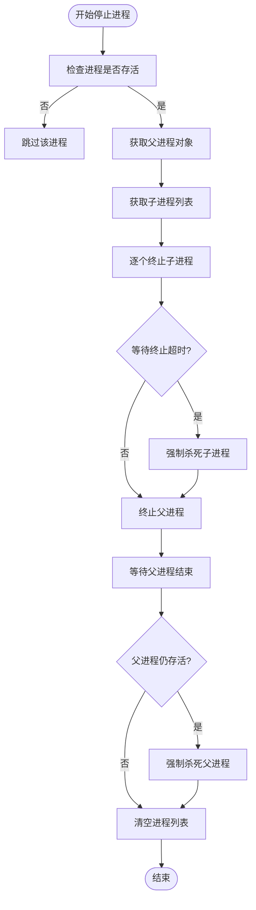
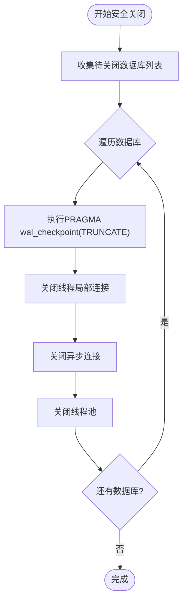
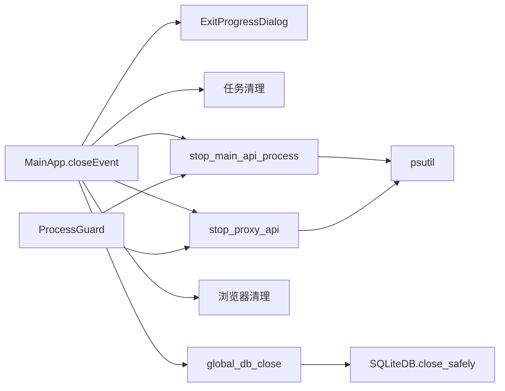

# 退出流程管理

<cite>
**本文引用的文件**
- [MainApp.py](file://gui/MainApp.py)
- [server_api.py](file://api/server_api.py)
- [proxy_api.py](file://api/proxy_api.py)
- [common_config.py](file://config/common_config.py)
- [classSQLite.py](file://modules/classSQLite.py)
- [multiThreading_log_manager.py](file://utils/multiThreading_log_manager.py)
- [process_guard.py](file://utils/process_guard.py)
- [directClient.py](file://utils/directClient.py)
</cite>

## 目录
1. [简介](#简介)
2. [项目结构](#项目结构)
3. [核心组件](#核心组件)
4. [架构总览](#架构总览)
5. [详细组件分析](#详细组件分析)
6. [依赖分析](#依赖分析)
7. [性能考虑](#性能考虑)
8. [故障排查指南](#故障排查指南)
9. [结论](#结论)
10. [附录](#附录)

## 简介
本文件面向 ikun_temu_system 的退出流程管理，围绕 ExitProgressDialog 类的实现原理与进度显示机制展开，系统性阐述完整的退出流程：包括任务清理、API 停止、数据库安全关闭、浏览器资源清理等步骤；解释退出确认对话框的交互逻辑；详述各清理步骤的状态更新与进度条显示机制；给出异常场景下的强制退出与资源清理策略；提供性能优化建议、最佳实践、错误处理与异常恢复机制，以及调试与监控方法。

## 项目结构
与退出流程直接相关的模块分布如下：
- GUI 层：MainApp.py 中的 MainStartApp.closeEvent 与 ExitProgressDialog
- API 层：server_api.py（主 API 进程停止）、proxy_api.py（代理 API 进程停止）
- 配置与数据库：common_config.py（全局数据库安全关闭）、modules/classSQLite.py（数据库安全关闭细节）
- 任务与日志：utils/multiThreading_log_manager.py（未完成子任务清理）
- 进程守护：utils/process_guard.py（异常退出时的进程清理钩子）
- 浏览器清理：utils/directClient.py（业务 Chrome 浏览器检测与关闭）

图表来源
- [MainApp.py:185-280](file://gui/MainApp.py#L185-L280)
- [server_api.py:249-315](file://api/server_api.py#L249-L315)
- [proxy_api.py:131-194](file://api/proxy_api.py#L131-L194)
- [common_config.py:59-135](file://config/common_config.py#L59-L135)
- [classSQLite.py:1417-1496](file://modules/classSQLite.py#L1417-L1496)
- [multiThreading_log_manager.py:374-423](file://utils/multiThreading_log_manager.py#L374-L423)
- [process_guard.py:1-67](file://utils/process_guard.py#L1-L67)
- [directClient.py:420-443](file://utils/directClient.py#L420-L443)

章节来源
- [MainApp.py:185-280](file://gui/MainApp.py#L185-L280)
- [server_api.py:249-315](file://api/server_api.py#L249-L315)
- [proxy_api.py:131-194](file://api/proxy_api.py#L131-L194)
- [common_config.py:59-135](file://config/common_config.py#L59-L135)
- [classSQLite.py:1417-1496](file://modules/classSQLite.py#L1417-L1496)
- [multiThreading_log_manager.py:374-423](file://utils/multiThreading_log_manager.py#L374-L423)
- [process_guard.py:1-67](file://utils/process_guard.py#L1-L67)
- [directClient.py:420-443](file://utils/directClient.py#L420-L443)

## 核心组件
- ExitProgressDialog：模态进度弹窗，负责显示当前清理步骤与进度条，实时刷新界面。
- MainStartApp.closeEvent：重写窗口关闭事件，串联退出确认、进度弹窗、清理与收尾。
- API 停止函数：stop_main_api_process、stop_proxy_api，使用进程树递归终止与超时强制清理。
- 任务清理：clean_all_unfinished_subtasks_on_start，将未完成任务标记为停止并清理重复主任务。
- 数据库安全关闭：global_db_close 与 SQLiteDB.close_safely，执行 WAL 检查点、关闭连接与线程池。
- 浏览器清理：auto_detect_and_clean_all_browsers，基于 CDP 与兜底策略关闭业务 Chrome 进程。
- 进程守护：ProcessGuard，注册清理回调，异常退出时统一回收。

章节来源
- [MainApp.py:35-102](file://gui/MainApp.py#L35-L102)
- [MainApp.py:185-280](file://gui/MainApp.py#L185-L280)
- [server_api.py:249-315](file://api/server_api.py#L249-L315)
- [proxy_api.py:131-194](file://api/proxy_api.py#L131-L194)
- [multiThreading_log_manager.py:374-423](file://utils/multiThreading_log_manager.py#L374-L423)
- [common_config.py:59-135](file://config/common_config.py#L59-L135)
- [classSQLite.py:1417-1496](file://modules/classSQLite.py#L1417-L1496)
- [directClient.py:420-443](file://utils/directClient.py#L420-L443)
- [process_guard.py:1-67](file://utils/process_guard.py#L1-L67)

## 架构总览
退出流程采用“确认对话框 → 进度弹窗 → 多阶段清理 → 安全收尾”的顺序控制，结合异常分支与 finally 确保弹窗关闭与资源回收。

图表来源
- [MainApp.py:185-280](file://gui/MainApp.py#L185-L280)
- [server_api.py:384-412](file://api/server_api.py#L384-L412)
- [proxy_api.py:131-194](file://api/proxy_api.py#L131-L194)
- [common_config.py:59-135](file://config/common_config.py#L59-L135)
- [classSQLite.py:1417-1496](file://modules/classSQLite.py#L1417-L1496)
- [multiThreading_log_manager.py:374-423](file://utils/multiThreading_log_manager.py#L374-L423)
- [directClient.py:420-443](file://utils/directClient.py#L420-L443)

## 详细组件分析

### ExitProgressDialog 类分析
- 设计目标：在主窗口上方显示模态进度弹窗，实时反馈退出阶段与进度。
- 关键属性与布局：垂直布局、状态标签、进度条（0-100）、固定尺寸、居中显示。
- 状态更新：update_status(text, progress) 同步更新文本与进度值，并调用 QApplication.processEvents() 刷新界面，避免卡顿。
- 居中逻辑：优先相对父窗口中心，否则屏幕中心。

图表来源
- [MainApp.py:35-102](file://gui/MainApp.py#L35-L102)

章节来源
- [MainApp.py:35-102](file://gui/MainApp.py#L35-L102)

### 退出确认对话框与交互逻辑
- 触发时机：MainStartApp.closeEvent 拦截窗口关闭事件。
- 配置项：从系统配置读取关闭确认开关，若启用则弹出确认对话框。
- 用户选择：选择“是”进入退出流程；选择“否”忽略事件，继续运行。

章节来源
- [MainApp.py:185-200](file://gui/MainApp.py#L185-L200)
- [MainApp.py:289-298](file://gui/MainApp.py#L289-L298)

### 任务清理与状态更新
- 清理入口：退出流程开始即调用 clean_all_unfinished_subtasks_on_start。
- 行为：将 RUNNING/PENDING 的子任务标记为 STOPPED，并清理重复主任务，确保数据库状态一致。
- 作用：避免遗留任务占用资源或产生脏数据。

章节来源
- [multiThreading_log_manager.py:374-423](file://utils/multiThreading_log_manager.py#L374-L423)

### API 停止机制
- 主 API 停止：stop_main_api_process
  - 遍历进程列表，对每个进程递归终止其子进程，等待超时后强制 kill。
  - 清空进程列表，确保无残留引用。
- 代理 API 停止：stop_proxy_api
  - 与主 API 类似，递归终止子进程并强制清理，最后清空进程引用。
- 进程守护：ProcessGuard.register_cleanup 将上述停止函数注册为清理回调，异常退出时统一回收。

图表来源
- [server_api.py:249-315](file://api/server_api.py#L249-L315)
- [proxy_api.py:131-194](file://api/proxy_api.py#L131-L194)
- [process_guard.py:46-64](file://utils/process_guard.py#L46-L64)

章节来源
- [server_api.py:249-315](file://api/server_api.py#L249-L315)
- [proxy_api.py:131-194](file://api/proxy_api.py#L131-L194)
- [process_guard.py:1-67](file://utils/process_guard.py#L1-L67)

### 数据库安全关闭
- 全局关闭：global_db_close
  - 对 ikun.db 与 hupu.db 依次执行：WAL 检查点（TRUNCATE）、关闭主线程连接、关闭异步连接、关闭线程池。
  - 记录日志，容忍部分异常（非致命）。
- SQLiteDB 安全关闭：close_safely
  - 关闭线程局部连接与异步连接，多次重试 WAL 检查点，最终关闭线程池。
  - 提供上下文管理与析构保障。

图表来源
- [common_config.py:59-135](file://config/common_config.py#L59-L135)
- [classSQLite.py:1417-1496](file://modules/classSQLite.py#L1417-L1496)

章节来源
- [common_config.py:59-135](file://config/common_config.py#L59-L135)
- [classSQLite.py:1417-1496](file://modules/classSQLite.py#L1417-L1496)

### 浏览器资源清理
- auto_detect_and_clean_all_browsers
  - 基于 CDP 精准检测业务 Chrome 标签页，关闭无效进程。
  - 兜底策略：对无 CDP 端口的业务进程进行强制关闭。
  - 作用：释放浏览器资源，避免残留进程影响后续启动或系统资源。

章节来源
- [directClient.py:420-443](file://utils/directClient.py#L420-L443)

### 异常处理与强制退出
- 异常捕获：MainStartApp.closeEvent 使用 try-except 捕获退出流程异常。
- 强制退出：更新进度弹窗状态为“异常，强制退出”，执行必要清理（如任务清理），接受事件并退出应用。
- finally 保障：确保进度弹窗关闭，避免资源泄露。

章节来源
- [MainApp.py:262-280](file://gui/MainApp.py#L262-L280)

## 依赖分析
- MainStartApp.closeEvent 依赖：
  - ExitProgressDialog：进度弹窗与状态更新。
  - multiThreading_log_manager.clean_all_unfinished_subtasks_on_start：任务清理。
  - server_api.stop_main_api_process、proxy_api.stop_proxy_api：API 停止。
  - directClient.auto_detect_and_clean_all_browsers：浏览器清理。
  - config.common_config.global_db_close：数据库安全关闭。
- API 停止函数依赖 psutil 进行进程树管理。
- 数据库关闭依赖 SQLiteDB 的线程池与连接管理。
- 进程守护通过 atexit 与信号注册清理回调。

图表来源
- [MainApp.py:185-280](file://gui/MainApp.py#L185-L280)
- [server_api.py:249-315](file://api/server_api.py#L249-L315)
- [proxy_api.py:131-194](file://api/proxy_api.py#L131-L194)
- [common_config.py:59-135](file://config/common_config.py#L59-L135)
- [classSQLite.py:1417-1496](file://modules/classSQLite.py#L1417-L1496)
- [process_guard.py:1-67](file://utils/process_guard.py#L1-L67)

章节来源
- [MainApp.py:185-280](file://gui/MainApp.py#L185-L280)
- [server_api.py:249-315](file://api/server_api.py#L249-L315)
- [proxy_api.py:131-194](file://api/proxy_api.py#L131-L194)
- [common_config.py:59-135](file://config/common_config.py#L59-L135)
- [classSQLite.py:1417-1496](file://modules/classSQLite.py#L1417-L1496)
- [process_guard.py:1-67](file://utils/process_guard.py#L1-L67)

## 性能考虑
- 进度弹窗刷新：在每步清理后调用 QApplication.processEvents()，确保 UI 实时响应，避免阻塞主线程。
- 进程停止超时：API 停止函数对子进程与主进程分别设置超时等待与强制杀死，平衡稳定性与性能。
- 数据库 WAL 检查点：在关闭前合并 WAL 文件，减少文件损坏风险并提升下次启动速度。
- 循环线程退出：周期线程采用分段休眠与退出标志，快速响应退出请求。
- 浏览器清理：CDP 精准检测与兜底强制关闭相结合，降低无效进程占用。

章节来源
- [MainApp.py:96-101](file://gui/MainApp.py#L96-L101)
- [server_api.py:287-311](file://api/server_api.py#L287-L311)
- [common_config.py:82-94](file://config/common_config.py#L82-L94)
- [server_api.py:318-346](file://api/server_api.py#L318-L346)
- [directClient.py:420-443](file://utils/directClient.py#L420-L443)

## 故障排查指南
- 退出卡顿或界面不刷新
  - 检查是否在大量 UI 更新时遗漏 QApplication.processEvents()。
  - 章节来源: [MainApp.py:96-101](file://gui/MainApp.py#L96-L101)
- API 进程无法停止
  - 查看进程是否存在、是否被其他进程持有句柄；确认 stop_main_api_process/stop_proxy_api 的超时与强制杀死逻辑是否生效。
  - 章节来源: [server_api.py:287-311](file://api/server_api.py#L287-L311), [proxy_api.py:166-187](file://api/proxy_api.py#L166-L187)
- 数据库文件损坏或锁文件问题
  - 确认 WAL 检查点是否执行成功；检查 global_db_close 与 SQLiteDB.close_safely 的日志输出。
  - 章节来源: [common_config.py:82-129](file://config/common_config.py#L82-L129), [classSQLite.py:1476-1484](file://modules/classSQLite.py#L1476-L1484)
- 任务状态异常或重复主任务
  - 检查 clean_all_unfinished_subtasks_on_start 的执行结果与数据库状态。
  - 章节来源: [multiThreading_log_manager.py:374-423](file://utils/multiThreading_log_manager.py#L374-L423)
- 业务 Chrome 进程残留
  - 检查 auto_detect_and_clean_all_browsers 的 CDP 连接与兜底强制关闭逻辑。
  - 章节来源: [directClient.py:420-443](file://utils/directClient.py#L420-L443)
- 异常退出后的资源清理
  - 确认 ProcessGuard 是否正确注册清理回调，异常信号是否触发清理。
  - 章节来源: [process_guard.py:27-64](file://utils/process_guard.py#L27-L64)

## 结论
退出流程通过“确认对话框 + 进度弹窗 + 多阶段清理 + 安全收尾”的设计，实现了可控、可观测、可恢复的优雅退出。ExitProgressDialog 提供了直观的进度反馈；API 停止、任务清理、数据库安全关闭与浏览器清理共同保障资源释放；异常分支与 finally 语义确保弹窗与资源的最终回收。配合 WAL 检查点、分段休眠与超时强制策略，整体具备良好的性能与稳定性。

## 附录
- 最佳实践
  - 在每步清理后及时更新进度弹窗状态并刷新 UI。
  - 为关键清理步骤设置合理的超时与重试策略。
  - 在异常分支中仍执行必要的清理动作，避免资源泄漏。
  - 使用进程守护统一注册清理回调，增强异常场景的健壮性。
- 调试与监控
  - 关注日志输出，特别是数据库关闭与进程停止阶段的日志。
  - 在开发环境开启更详细的日志级别，定位异常节点。
  - 使用系统监控工具观察进程树与端口占用，验证清理效果。