# 页面管理机制

<cite>
**本文档引用的文件**
- [MainApp.py](file://gui/MainApp.py)
- [ServerPage.py](file://gui/ServerPage.py)
- [ProxyPage.py](file://gui/ProxyPage.py)
- [ToolsPage.py](file://gui/ToolsPage.py)
- [MainPage.py](file://gui/MainPage.py)
- [SqlitePage.py](file://gui/SqlitePage.py)
- [SettingPage.py](file://gui/SettingPage.py)
- [main.py](file://main.py)
</cite>

## 目录
1. [简介](#简介)
2. [项目结构](#项目结构)
3. [核心组件](#核心组件)
4. [架构概览](#架构概览)
5. [详细组件分析](#详细组件分析)
6. [依赖分析](#依赖分析)
7. [性能考虑](#性能考虑)
8. [故障排除指南](#故障排除指南)
9. [结论](#结论)

## 简介

ikun_temu_system采用QStackedWidget实现多页面管理机制，通过堆叠窗口实现页面的切换和状态保持。该系统集成了服务器管理、代理IP管理、工具箱等多个功能页面，提供了完整的页面生命周期管理和通信机制。

## 项目结构

系统采用模块化的GUI架构设计，主要文件组织如下：

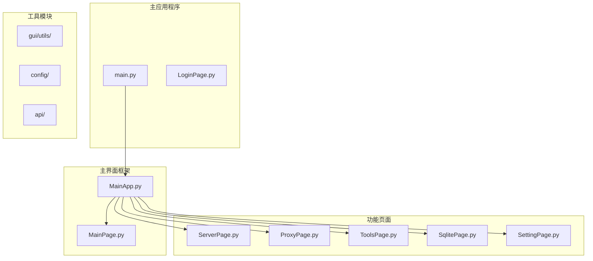

**图表来源**
- [main.py:1-233](file://main.py#L1-L233)
- [MainApp.py:179-494](file://gui/MainApp.py#L179-L494)

**章节来源**
- [main.py:120-170](file://main.py#L120-L170)
- [MainApp.py:312-370](file://gui/MainApp.py#L312-L370)

## 核心组件

### QStackedWidget页面管理器

系统使用QStackedWidget作为核心页面容器，实现了页面的堆叠管理和切换控制：

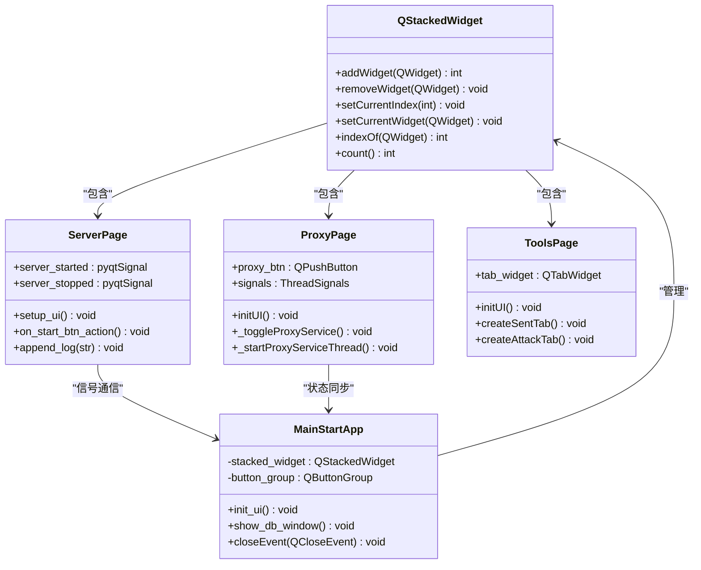

**图表来源**
- [MainApp.py:347-367](file://gui/MainApp.py#L347-L367)
- [ServerPage.py:118-137](file://gui/ServerPage.py#L118-L137)
- [ProxyPage.py:73-96](file://gui/ProxyPage.py#L73-L96)
- [ToolsPage.py:25-48](file://gui/ToolsPage.py#L25-L48)

### 页面初始化流程

页面管理采用延迟加载和懒加载策略，确保性能优化：

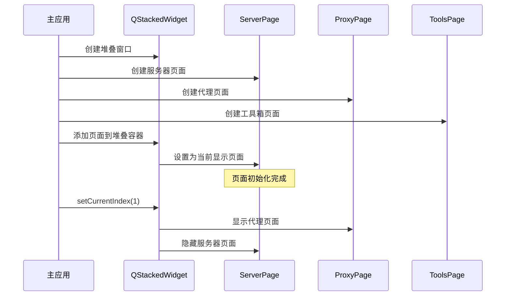

**图表来源**
- [MainApp.py:347-367](file://gui/MainApp.py#L347-L367)
- [MainApp.py:416-478](file://gui/MainApp.py#L416-L478)

**章节来源**
- [MainApp.py:347-494](file://gui/MainApp.py#L347-L494)

## 架构概览

系统采用分层架构设计，实现了页面间的松耦合通信：

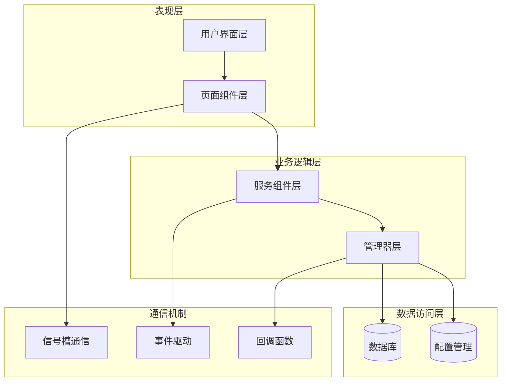

**图表来源**
- [MainApp.py:179-306](file://gui/MainApp.py#L179-L306)
- [ServerPage.py:118-137](file://gui/ServerPage.py#L118-L137)

## 详细组件分析

### 服务器页面管理

ServerPage实现了完整的服务器生命周期管理：

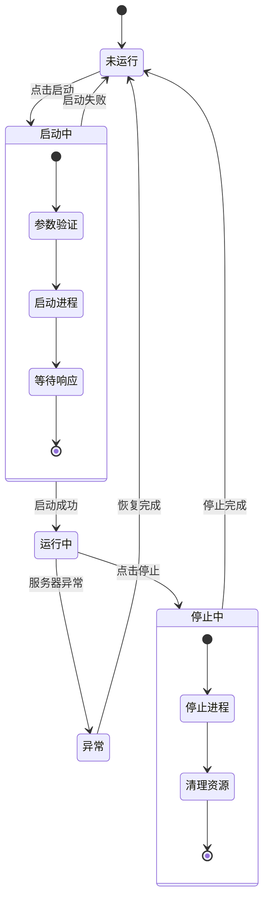

**图表来源**
- [ServerPage.py:353-471](file://gui/ServerPage.py#L353-L471)

#### 服务器启动流程

服务器启动采用异步线程管理，确保UI响应性：

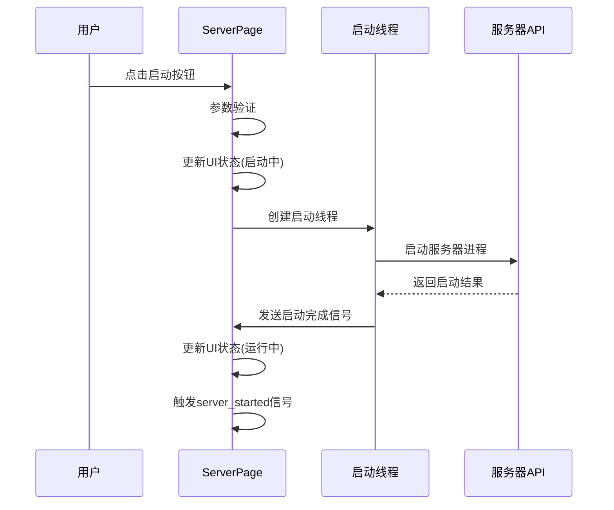

**图表来源**
- [ServerPage.py:419-433](file://gui/ServerPage.py#L419-L433)
- [ServerPage.py:473-500](file://gui/ServerPage.py#L473-L500)

**章节来源**
- [ServerPage.py:118-500](file://gui/ServerPage.py#L118-L500)

### 代理页面管理

ProxyPage实现了代理服务的完整生命周期管理：

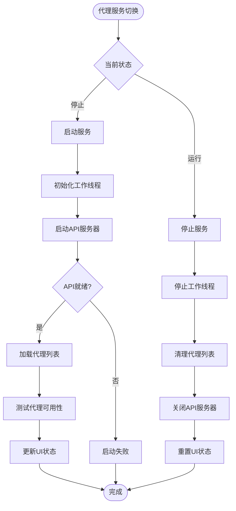

**图表来源**
- [ProxyPage.py:668-727](file://gui/ProxyPage.py#L668-L727)

#### 代理服务状态管理

代理页面采用线程安全的状态管理模式：

**章节来源**
- [ProxyPage.py:73-96](file://gui/ProxyPage.py#L73-L96)
- [ProxyPage.py:668-727](file://gui/ProxyPage.py#L668-L727)

### 工具箱页面管理

ToolsPage实现了多选项卡的复杂页面管理：

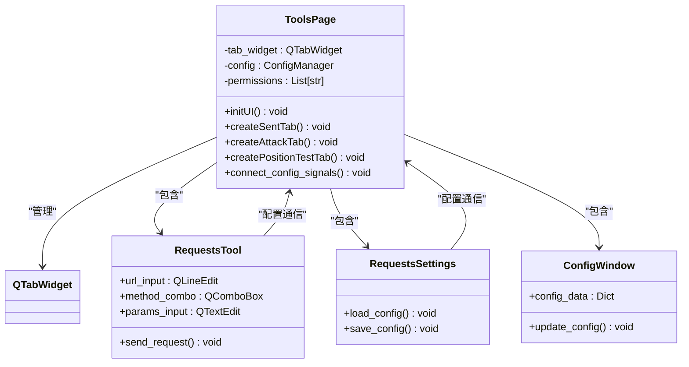

**图表来源**
- [ToolsPage.py:25-86](file://gui/ToolsPage.py#L25-L86)
- [ToolsPage.py:183-225](file://gui/ToolsPage.py#L183-L225)

**章节来源**
- [ToolsPage.py:25-576](file://gui/ToolsPage.py#L25-L576)

### 数据库页面管理

SqlitePage实现了复杂的数据库表格管理功能：

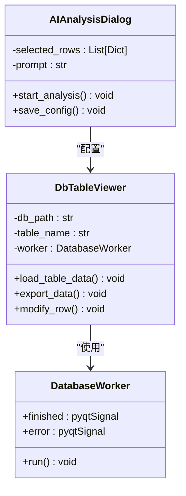

**图表来源**
- [SqlitePage.py:85-102](file://gui/SqlitePage.py#L85-L102)
- [SqlitePage.py:431-448](file://gui/SqlitePage.py#L431-L448)

**章节来源**
- [SqlitePage.py:1-800](file://gui/SqlitePage.py#L1-L800)

## 依赖分析

### 页面间通信机制

系统采用多种通信机制实现页面间的数据传递：

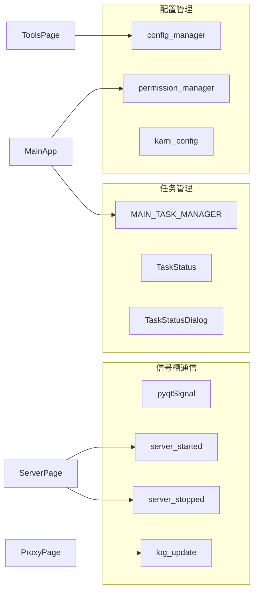

**图表来源**
- [ServerPage.py:118-120](file://gui/ServerPage.py#L118-L120)
- [ProxyPage.py:21-26](file://gui/ProxyPage.py#L21-L26)
- [MainApp.py:19-21](file://gui/MainApp.py#L19-L21)

### 数据流管理

页面间的数据传递遵循单向数据流原则：

**章节来源**
- [MainApp.py:179-306](file://gui/MainApp.py#L179-L306)
- [ServerPage.py:118-137](file://gui/ServerPage.py#L118-L137)

## 性能考虑

### 内存管理策略

系统采用多种内存管理策略确保性能：

1. **页面懒加载**：页面仅在需要时创建和初始化
2. **资源清理**：窗口关闭时自动清理相关资源
3. **线程池管理**：使用QThread实现异步操作
4. **数据库连接池**：优化数据库访问性能

### 缓存策略

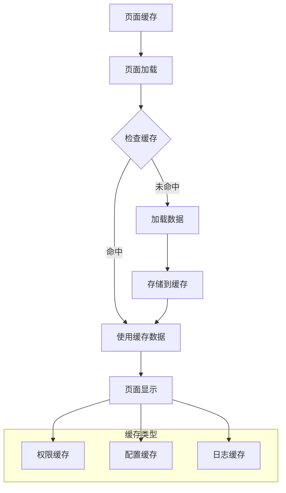

**章节来源**
- [MainApp.py:650-666](file://gui/MainApp.py#L650-L666)
- [ServerPage.py:181-217](file://gui/ServerPage.py#L181-L217)

## 故障排除指南

### 常见问题及解决方案

#### 服务器启动失败

**问题症状**：服务器启动按钮卡在"启动中"状态

**解决方案**：
1. 检查端口占用情况
2. 验证配置参数有效性
3. 查看服务器日志获取详细错误信息

#### 代理服务异常

**问题症状**：代理服务无法正常启动或停止

**解决方案**：
1. 检查代理API服务器状态
2. 验证代理IP列表格式
3. 确认网络连接状态

#### 页面切换问题

**问题症状**：页面切换时出现闪烁或数据丢失

**解决方案**：
1. 确保QStackedWidget正确配置
2. 检查页面初始化顺序
3. 验证信号槽连接完整性

**章节来源**
- [ServerPage.py:434-439](file://gui/ServerPage.py#L434-L439)
- [ProxyPage.py:760-762](file://gui/ProxyPage.py#L760-L762)

## 结论

ikun_temu_system的页面管理机制通过QStackedWidget实现了高效的多页面管理，采用了以下关键技术：

1. **模块化设计**：每个功能页面独立封装，便于维护和扩展
2. **异步处理**：使用线程和信号槽实现非阻塞操作
3. **状态管理**：完善的页面生命周期管理机制
4. **通信机制**：多种通信方式确保页面间数据传递
5. **性能优化**：懒加载和缓存策略提升用户体验

该系统为类似桌面应用的页面管理提供了良好的参考实现，具有较强的可扩展性和维护性。