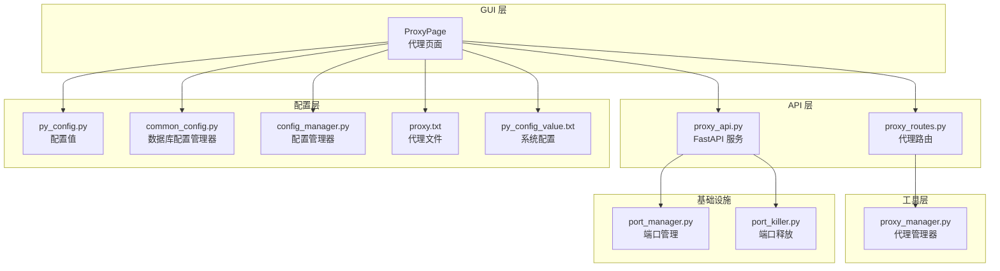
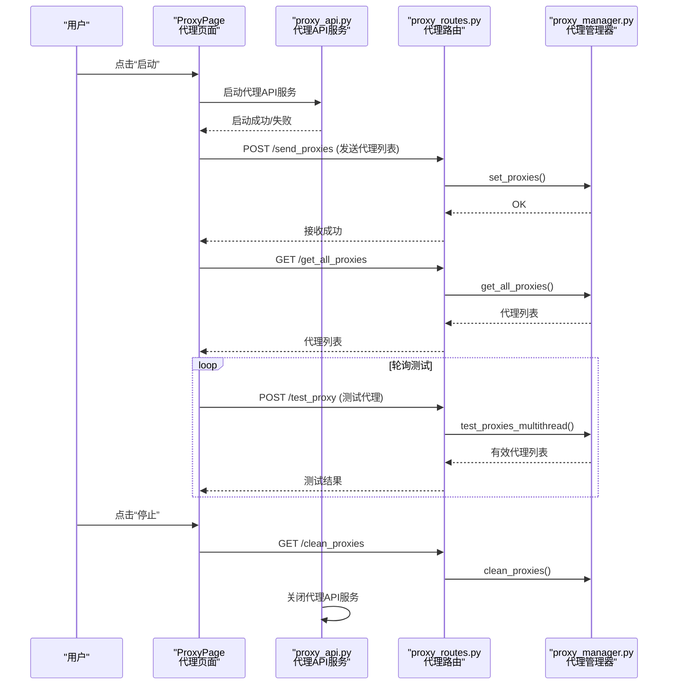
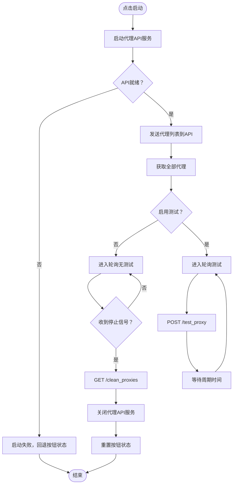
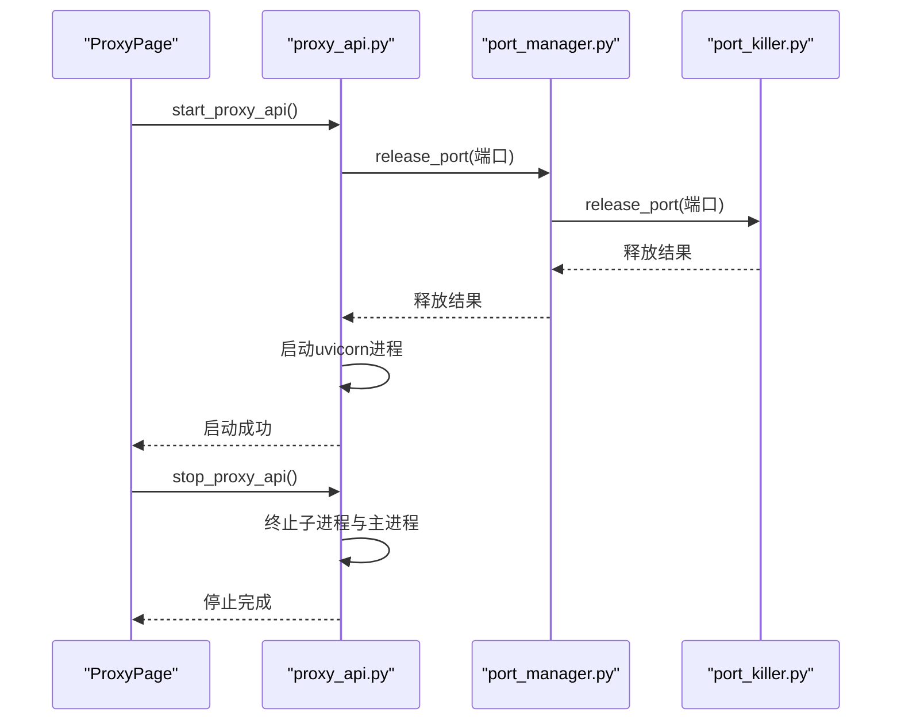
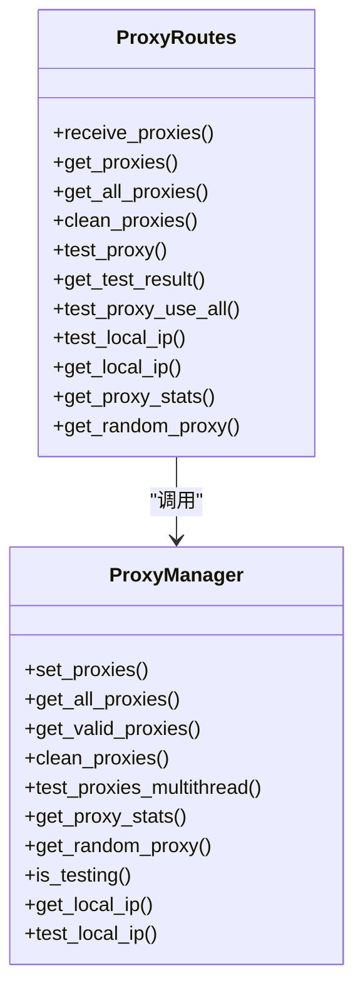
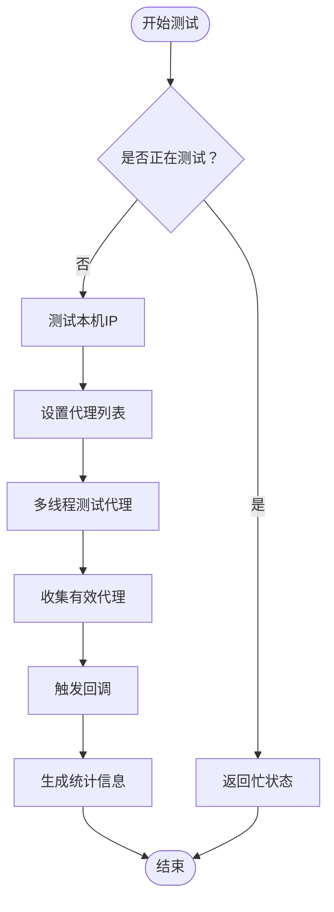
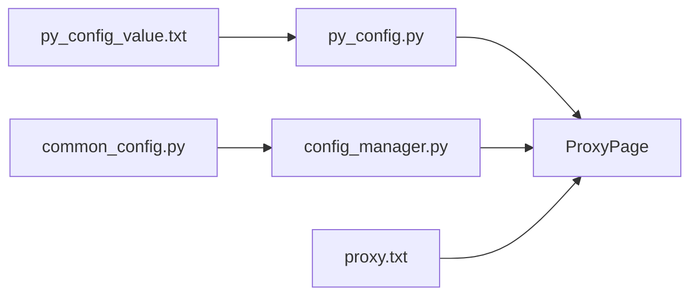
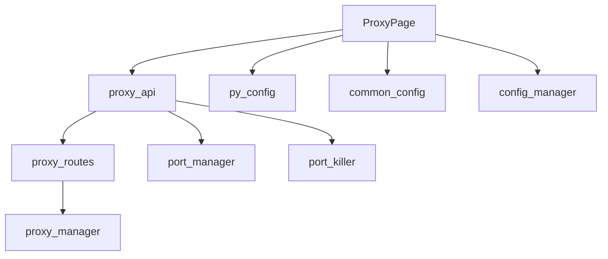

# 代理页面

<cite>
**本文档引用的文件**
- [ProxyPage.py](file://gui/ProxyPage.py)
- [proxy_api.py](file://api/proxy_api.py)
- [proxy_routes.py](file://api/proxy_routes/proxy_routes.py)
- [proxy_manager.py](file://utils/proxy_manager.py)
- [py_config.py](file://config/py_config.py)
- [common_config.py](file://config/common_config.py)
- [config_manager.py](file://modules/config_manager.py)
- [port_manager.py](file://lite_modules/port_manager.py)
- [port_killer.py](file://lite_modules/port_killer.py)
- [proxy.txt](file://配置文件_系统配置/proxy.txt)
- [py_config_value.txt](file://配置文件_系统配置/py_config_value.txt)
</cite>

## 目录
1. [简介](#简介)
2. [项目结构](#项目结构)
3. [核心组件](#核心组件)
4. [架构总览](#架构总览)
5. [详细组件分析](#详细组件分析)
6. [依赖关系分析](#依赖关系分析)
7. [性能考虑](#性能考虑)
8. [故障排查指南](#故障排查指南)
9. [结论](#结论)
10. [附录](#附录)

## 简介
本文件面向 ikun_temu_system 的代理页面，系统性阐述代理IP管理界面的设计与功能、代理服务器的配置与管理机制、代理IP的获取、验证与轮换逻辑、代理状态监控与故障处理、代理页面与代理API服务的交互方式、代理配置的导入导出能力、以及代理性能监控与统计信息展示。文末提供使用示例与最佳实践，帮助开发者与运维人员高效、稳定地使用代理功能。

## 项目结构
代理页面位于 GUI 层，负责用户交互与控制；代理 API 服务位于后端，提供代理IP的接收、测试、轮询与统计接口；代理管理器位于工具层，封装代理IP的测试、筛选与统计逻辑；配置层负责端口、文件路径与界面配置的持久化。

**图表来源**
- [ProxyPage.py:73-96](file://gui/ProxyPage.py#L73-L96)
- [proxy_api.py:21-34](file://api/proxy_api.py#L21-L34)
- [proxy_routes.py:8-9](file://api/proxy_routes/proxy_routes.py#L8-L9)
- [proxy_manager.py:16-25](file://utils/proxy_manager.py#L16-L25)
- [py_config.py:4-22](file://config/py_config.py#L4-L22)
- [common_config.py:14-14](file://config/common_config.py#L14-L14)
- [config_manager.py:6-20](file://modules/config_manager.py#L6-L20)
- [port_manager.py:17-23](file://lite_modules/port_manager.py#L17-L23)
- [port_killer.py:103-134](file://lite_modules/port_killer.py#L103-L134)
- [proxy.txt:1-2](file://配置文件_系统配置/proxy.txt#L1-L2)
- [py_config_value.txt:1-4](file://配置文件_系统配置/py_config_value.txt#L1-L4)

**章节来源**
- [ProxyPage.py:73-96](file://gui/ProxyPage.py#L73-L96)
- [proxy_api.py:21-34](file://api/proxy_api.py#L21-L34)
- [proxy_routes.py:8-9](file://api/proxy_routes/proxy_routes.py#L8-L9)
- [proxy_manager.py:16-25](file://utils/proxy_manager.py#L16-L25)
- [py_config.py:4-22](file://config/py_config.py#L4-L22)
- [common_config.py:14-14](file://config/common_config.py#L14-L14)
- [config_manager.py:6-20](file://modules/config_manager.py#L6-L20)
- [port_manager.py:17-23](file://lite_modules/port_manager.py#L17-L23)
- [port_killer.py:103-134](file://lite_modules/port_killer.py#L103-L134)
- [proxy.txt:1-2](file://配置文件_系统配置/proxy.txt#L1-L2)
- [py_config_value.txt:1-4](file://配置文件_系统配置/py_config_value.txt#L1-L4)

## 核心组件
- 代理页面（ProxyPage）：提供代理IP管理界面，支持普通模式与接口模式，具备日志、格式转换、说明等辅助功能；负责启动/停止代理API服务、轮询测试代理有效性、动态更新配置。
- 代理API服务（proxy_api.py）：基于 FastAPI 的本地服务，提供CORS支持，负责启动/停止代理API进程、端口释放与进程守护。
- 代理路由（proxy_routes.py）：提供代理IP接收、测试、统计、随机代理获取等REST接口，与代理管理器协作完成代理生命周期管理。
- 代理管理器（proxy_manager.py）：统一处理代理IP的测试、筛选、统计与状态管理，支持同步/异步/多线程测试，提供测试历史与回调机制。
- 配置系统：py_config.py 提供端口与URL等配置值；common_config.py 初始化数据库与配置管理器；config_manager.py 提供键值配置的读写与类型转换；proxy.txt 与 py_config_value.txt 提供代理文件路径与端口配置。

**章节来源**
- [ProxyPage.py:73-96](file://gui/ProxyPage.py#L73-L96)
- [proxy_api.py:56-128](file://api/proxy_api.py#L56-L128)
- [proxy_routes.py:20-218](file://api/proxy_routes/proxy_routes.py#L20-L218)
- [proxy_manager.py:16-351](file://utils/proxy_manager.py#L16-L351)
- [py_config.py:4-22](file://config/py_config.py#L4-L22)
- [common_config.py:213-214](file://config/common_config.py#L213-L214)
- [config_manager.py:154-189](file://modules/config_manager.py#L154-L189)
- [proxy.txt:1-2](file://配置文件_系统配置/proxy.txt#L1-L2)
- [py_config_value.txt:1-4](file://配置文件_系统配置/py_config_value.txt#L1-L4)

## 架构总览
代理页面通过 HTTP 与代理API服务交互，代理API服务内部调用代理管理器完成代理IP的接收、测试与统计。启动时，代理页面先启动代理API服务，随后将本地代理文件加载到API服务，再进入轮询测试阶段；停止时，代理页面触发清理流程并关闭API服务。

**图表来源**
- [ProxyPage.py:668-895](file://gui/ProxyPage.py#L668-L895)
- [proxy_api.py:56-128](file://api/proxy_api.py#L56-L128)
- [proxy_routes.py:20-218](file://api/proxy_routes/proxy_routes.py#L20-L218)
- [proxy_manager.py:168-227](file://utils/proxy_manager.py#L168-L227)

**章节来源**
- [ProxyPage.py:668-895](file://gui/ProxyPage.py#L668-L895)
- [proxy_api.py:56-128](file://api/proxy_api.py#L56-L128)
- [proxy_routes.py:20-218](file://api/proxy_routes/proxy_routes.py#L20-L218)
- [proxy_manager.py:168-227](file://utils/proxy_manager.py#L168-L227)

## 详细组件分析

### 代理页面（ProxyPage）
- 界面设计：采用分组框+选项卡布局，包含“日志”、“普通模式”、“接口模式”、“格式转换”、“说明”五个选项卡，底部提供启动/停止按钮与测试配置（超时、测试URL、线程数）。
- 代理配置与导入导出：
  - 普通模式：从配置文件加载代理列表，支持保存为标准格式（socks5://账号:密码@ip:端口），并提供格式转换（IP/端口/账号/密码 ↔ 标准格式）。
  - 接口模式：保存API地址列表至配置文件，支持轮询模式、随机模式、智能切换（由上层逻辑控制，页面提供配置项）。
- 代理服务启动与停止：
  - 启动：在后台线程中启动代理API服务，等待服务就绪后发送代理列表并获取全部代理；随后进入轮询测试阶段。
  - 停止：异步停止，先清空代理列表，再关闭API服务，最终重置按钮状态。
- 轮询测试逻辑：根据配置的测试URL、超时时间与线程数，定期向API发起测试请求，计算合理超时时间，输出测试结果与下次测试时间。
- 日志与提示：通过信号机制在主线程更新日志与消息框，保证UI线程安全。

**图表来源**
- [ProxyPage.py:668-895](file://gui/ProxyPage.py#L668-L895)
- [proxy_routes.py:71-80](file://api/proxy_routes/proxy_routes.py#L71-L80)

**章节来源**
- [ProxyPage.py:98-162](file://gui/ProxyPage.py#L98-L162)
- [ProxyPage.py:248-318](file://gui/ProxyPage.py#L248-L318)
- [ProxyPage.py:385-420](file://gui/ProxyPage.py#L385-L420)
- [ProxyPage.py:520-621](file://gui/ProxyPage.py#L520-L621)
- [ProxyPage.py:668-895](file://gui/ProxyPage.py#L668-L895)

### 代理API服务（proxy_api.py）
- 服务启动：使用多进程启动 FastAPI 应用，绑定本地回环地址与配置端口；启动前释放端口并注册进程信息，确保端口可用。
- 服务停止：通过进程守护器递归终止子进程与主进程，支持超时与强制杀死，最终清空进程列表。
- CORS 支持：允许跨域访问，便于前端页面直接调用。

**图表来源**
- [proxy_api.py:56-128](file://api/proxy_api.py#L56-L128)
- [proxy_api.py:131-195](file://api/proxy_api.py#L131-L195)
- [port_manager.py:176-201](file://lite_modules/port_manager.py#L176-L201)
- [port_killer.py:103-134](file://lite_modules/port_killer.py#L103-L134)

**章节来源**
- [proxy_api.py:56-128](file://api/proxy_api.py#L56-L128)
- [proxy_api.py:131-195](file://api/proxy_api.py#L131-L195)
- [port_manager.py:176-201](file://lite_modules/port_manager.py#L176-L201)
- [port_killer.py:103-134](file://lite_modules/port_killer.py#L103-L134)

### 代理路由（proxy_routes.py）
- 接口职责：
  - 接收代理列表：/send_proxies
  - 获取代理列表：/get_all_proxies、/get_proxies
  - 清空代理：/clean_proxies
  - 测试代理：/test_proxy（多线程测试，支持并发测试状态检查）
  - 获取测试结果：/test_proxy_result
  - 使用全部代理：/test_proxy_use_all
  - 本机IP测试与获取：/test_local_ip、/get_local_ip
  - 统计信息：/get_proxy_stats
  - 随机代理：/get_random_proxy
- 与代理管理器协作：路由层负责参数解析与响应封装，具体测试与统计由代理管理器完成。

**图表来源**
- [proxy_routes.py:20-218](file://api/proxy_routes/proxy_routes.py#L20-L218)
- [proxy_manager.py:26-351](file://utils/proxy_manager.py#L26-L351)

**章节来源**
- [proxy_routes.py:20-218](file://api/proxy_routes/proxy_routes.py#L20-L218)
- [proxy_manager.py:26-351](file://utils/proxy_manager.py#L26-L351)

### 代理管理器（proxy_manager.py）
- 功能要点：
  - 代理列表管理：set_proxies、get_all_proxies、get_valid_proxies、clean_proxies
  - 代理测试：test_proxy（单个）、test_proxies_sync（同步）、test_proxies_async（异步）、test_proxies_multithread（多线程）
  - 并发控制：测试锁防止并发测试；回调机制通知测试完成
  - 本机IP测试：test_local_ip，用于判断网络连通性
  - 统计信息：get_proxy_stats，包含总数、有效数、无效数、有效率、状态分布与测试状态
  - 随机代理：get_random_proxy
- 性能与可靠性：多线程测试提升吞吐；测试历史记录便于追踪；类型转换与异常捕获增强稳定性。

**图表来源**
- [proxy_manager.py:82-144](file://utils/proxy_manager.py#L82-L144)
- [proxy_manager.py:168-227](file://utils/proxy_manager.py#L168-L227)
- [proxy_manager.py:291-315](file://utils/proxy_manager.py#L291-L315)
- [proxy_manager.py:327-350](file://utils/proxy_manager.py#L327-L350)

**章节来源**
- [proxy_manager.py:57-106](file://utils/proxy_manager.py#L57-L106)
- [proxy_manager.py:107-144](file://utils/proxy_manager.py#L107-L144)
- [proxy_manager.py:168-227](file://utils/proxy_manager.py#L168-L227)
- [proxy_manager.py:291-315](file://utils/proxy_manager.py#L291-L315)
- [proxy_manager.py:327-350](file://utils/proxy_manager.py#L327-L350)

### 配置系统
- 系统配置（py_config.py）：从配置文件读取代理文件路径、API代理端口与API地址。
- 数据库配置管理器（common_config.py）：初始化数据库与配置管理器，提供全局配置读取与类型转换。
- 配置管理器（config_manager.py）：提供键值配置的读取/设置/批量初始化/类型转换等功能，支持热更新。
- 代理文件（proxy.txt）：存放代理IP列表；系统配置（py_config_value.txt）：存放代理文件路径与端口等。

**图表来源**
- [py_config.py:4-22](file://config/py_config.py#L4-L22)
- [common_config.py:213-214](file://config/common_config.py#L213-L214)
- [config_manager.py:154-189](file://modules/config_manager.py#L154-L189)
- [proxy.txt:1-2](file://配置文件_系统配置/proxy.txt#L1-L2)
- [py_config_value.txt:1-4](file://配置文件_系统配置/py_config_value.txt#L1-L4)

**章节来源**
- [py_config.py:4-22](file://config/py_config.py#L4-L22)
- [common_config.py:213-214](file://config/common_config.py#L213-L214)
- [config_manager.py:154-189](file://modules/config_manager.py#L154-L189)
- [proxy.txt:1-2](file://配置文件_系统配置/proxy.txt#L1-L2)
- [py_config_value.txt:1-4](file://配置文件_系统配置/py_config_value.txt#L1-L4)

## 依赖关系分析
- 低耦合高内聚：代理页面仅通过HTTP与代理API交互，代理API仅通过路由与代理管理器交互，职责清晰。
- 配置解耦：配置读取与管理通过独立模块完成，避免硬编码，支持热更新。
- 端口管理：端口释放与进程管理由专用模块完成，保障服务启动/停止的可靠性。

**图表来源**
- [ProxyPage.py:73-96](file://gui/ProxyPage.py#L73-L96)
- [proxy_api.py:21-34](file://api/proxy_api.py#L21-L34)
- [proxy_routes.py:8-9](file://api/proxy_routes/proxy_routes.py#L8-L9)
- [proxy_manager.py:16-25](file://utils/proxy_manager.py#L16-L25)
- [py_config.py:4-22](file://config/py_config.py#L4-L22)
- [common_config.py:213-214](file://config/common_config.py#L213-L214)
- [config_manager.py:6-20](file://modules/config_manager.py#L6-L20)
- [port_manager.py:17-23](file://lite_modules/port_manager.py#L17-L23)
- [port_killer.py:103-134](file://lite_modules/port_killer.py#L103-L134)

**章节来源**
- [ProxyPage.py:73-96](file://gui/ProxyPage.py#L73-L96)
- [proxy_api.py:21-34](file://api/proxy_api.py#L21-L34)
- [proxy_routes.py:8-9](file://api/proxy_routes/proxy_routes.py#L8-L9)
- [proxy_manager.py:16-25](file://utils/proxy_manager.py#L16-L25)
- [py_config.py:4-22](file://config/py_config.py#L4-L22)
- [common_config.py:213-214](file://config/common_config.py#L213-L214)
- [config_manager.py:6-20](file://modules/config_manager.py#L6-L20)
- [port_manager.py:17-23](file://lite_modules/port_manager.py#L17-L23)
- [port_killer.py:103-134](file://lite_modules/port_killer.py#L103-L134)

## 性能考虑
- 多线程测试：代理管理器支持多线程测试，显著提升代理筛选效率；线程数可通过界面配置。
- 超时策略：代理页面根据代理数量与超时时间计算合理总超时，避免长时间阻塞。
- 轮询周期：支持动态调整轮询周期，平衡实时性与资源消耗。
- 端口与进程管理：启动前释放端口，停止时递归终止进程，减少资源泄漏风险。

[本节为通用指导，无需特定文件引用]

## 故障排查指南
- 启动失败：检查端口是否被占用，确认端口释放流程是否成功；查看代理API服务日志。
- 代理列表为空：确认代理文件路径与内容，检查保存逻辑与读取逻辑。
- 测试无响应：检查测试URL与超时设置，确认网络连通性；查看代理管理器测试历史。
- 停止异常：确认停止线程是否收到信号，检查API服务关闭流程。
- 配置不生效：确认配置管理器键值是否正确，检查热更新是否触发。

**章节来源**
- [proxy_api.py:56-128](file://api/proxy_api.py#L56-L128)
- [proxy_api.py:131-195](file://api/proxy_api.py#L131-L195)
- [ProxyPage.py:668-895](file://gui/ProxyPage.py#L668-L895)
- [proxy_manager.py:57-106](file://utils/proxy_manager.py#L57-L106)

## 结论
代理页面通过清晰的界面设计与可靠的后端服务，实现了代理IP的导入、验证、轮询与统计。配合完善的配置与端口管理机制，系统在易用性与稳定性方面表现良好。建议在生产环境中结合实际网络状况调整测试参数与轮询周期，并持续关注代理质量与可用性。

[本节为总结性内容，无需特定文件引用]

## 附录

### 代理页面功能清单
- 普通模式：编辑与保存代理列表，支持格式转换与自动校验。
- 接口模式：保存API地址列表，支持轮询/随机/智能切换（由上层逻辑控制）。
- 日志与说明：提供详细使用说明与日志输出。
- 轮询测试：按配置周期测试代理有效性，输出统计与下次测试时间。
- 停止清理：异步停止并清理代理列表与服务。

**章节来源**
- [ProxyPage.py:98-162](file://gui/ProxyPage.py#L98-L162)
- [ProxyPage.py:248-318](file://gui/ProxyPage.py#L248-L318)
- [ProxyPage.py:385-420](file://gui/ProxyPage.py#L385-L420)
- [ProxyPage.py:520-621](file://gui/ProxyPage.py#L520-L621)
- [ProxyPage.py:668-895](file://gui/ProxyPage.py#L668-L895)

### 代理配置导入导出说明
- 导入：普通模式从代理文件读取；接口模式从API文件读取。
- 导出：普通模式保存为标准格式；格式转换选项卡支持双向转换与复制。
- 配置持久化：界面配置通过数据库配置管理器持久化，支持热更新。

**章节来源**
- [ProxyPage.py:319-340](file://gui/ProxyPage.py#L319-L340)
- [ProxyPage.py:421-442](file://gui/ProxyPage.py#L421-L442)
- [ProxyPage.py:520-621](file://gui/ProxyPage.py#L520-L621)
- [config_manager.py:92-153](file://modules/config_manager.py#L92-L153)

### 代理性能监控与统计
- 统计接口：/get_proxy_stats 返回总数、有效数、无效数、有效率与状态分布。
- 测试结果：/test_proxy_result 返回测试统计与本机IP连通性。
- 随机代理：/get_random_proxy 返回随机有效代理。

**章节来源**
- [proxy_routes.py:193-201](file://api/proxy_routes/proxy_routes.py#L193-L201)
- [proxy_routes.py:126-145](file://api/proxy_routes/proxy_routes.py#L126-L145)
- [proxy_routes.py:203-218](file://api/proxy_routes/proxy_routes.py#L203-L218)
- [proxy_manager.py:327-350](file://utils/proxy_manager.py#L327-L350)

### 使用示例与最佳实践
- 启动流程：准备代理文件 → 点击启动 → 观察日志 → 确认轮询测试开始。
- 参数调优：根据网络状况调整测试URL、超时与线程数；合理设置轮询周期。
- 故障处理：遇到端口占用时先释放端口；测试失败时检查网络与代理质量。
- 配置管理：通过界面修改配置后，确认数据库配置管理器已更新。

**章节来源**
- [ProxyPage.py:668-895](file://gui/ProxyPage.py#L668-L895)
- [proxy_api.py:56-128](file://api/proxy_api.py#L56-L128)
- [proxy_manager.py:168-227](file://utils/proxy_manager.py#L168-L227)