# 图形用户界面

<cite>
**本文档引用的文件**
- [MainApp.py](file://gui/MainApp.py)
- [MainPage.py](file://gui/MainPage.py)
- [LoginPage.py](file://gui/LoginPage.py)
- [SettingPage.py](file://gui/SettingPage.py)
- [ProxyPage.py](file://gui/ProxyPage.py)
- [HelpPage.py](file://gui/HelpPage.py)
- [ToolsPage.py](file://gui/ToolsPage.py)
- [ServerPage.py](file://gui/ServerPage.py)
- [common.qss](file://gui/static/qss/common.qss)
- [button.qss](file://gui/static/qss/button.qss)
</cite>

## 目录
1. [简介](#简介)
2. [项目结构](#项目结构)
3. [核心组件](#核心组件)
4. [架构概览](#架构概览)
5. [详细组件分析](#详细组件分析)
6. [依赖分析](#依赖分析)
7. [性能考虑](#性能考虑)
8. [故障排除指南](#故障排除指南)
9. [结论](#结论)
10. [附录](#附录)

## 简介
本文件为 ikun_temu_system 的图形用户界面（GUI）技术文档，基于 PyQt5 框架实现。文档涵盖界面设计原则、功能页面布局与控件、交互逻辑、主窗口导航与页面切换机制、界面定制指南（主题与样式）、用户交互流程与响应机制、组件状态管理与事件处理，以及开发最佳实践与性能优化建议。

## 项目结构
GUI 相关代码主要位于 gui 目录，采用按功能模块划分的组织方式：
- 主窗口与导航：MainApp.py
- 登录与权限：LoginPage.py
- 页面组件：ServerPage.py、ProxyPage.py、ToolsPage.py、HelpPage.py、SettingPage.py
- 样式资源：gui/static/qss/*.qss
- 工具与加密：gui/utils/*
- 数据库与配置：config/*

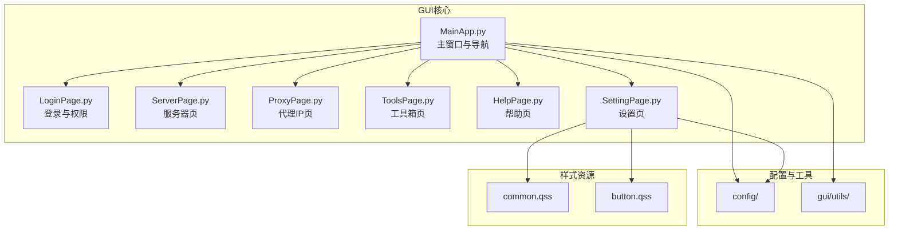

**图表来源**
- [MainApp.py:179-494](file://gui/MainApp.py#L179-L494)
- [LoginPage.py:209-487](file://gui/LoginPage.py#L209-L487)
- [ServerPage.py:118-535](file://gui/ServerPage.py#L118-L535)
- [ProxyPage.py:73-723](file://gui/ProxyPage.py#L73-L723)
- [ToolsPage.py:25-576](file://gui/ToolsPage.py#L25-L576)
- [HelpPage.py:72-112](file://gui/HelpPage.py#L72-L112)
- [SettingPage.py:28-85](file://gui/SettingPage.py#L28-L85)

**章节来源**
- [MainApp.py:179-494](file://gui/MainApp.py#L179-L494)
- [LoginPage.py:209-487](file://gui/LoginPage.py#L209-L487)

## 核心组件
- 主窗口 MainStartApp：负责整体布局、页面切换、退出流程与系统集成。
- 登录窗口 LoginWindow：处理卡密验证、离线登录、权限加载与数据库初始化。
- 页面组件：ServerPage（服务器控制与日志）、ProxyPage（代理IP管理与测试）、ToolsPage（HTTP请求与压测工具）、HelpPage（说明与贡献）、SettingPage（系统与业务配置）。
- 样式系统：通过 QSS 文件统一管理通用样式与按钮样式。

**章节来源**
- [MainApp.py:179-494](file://gui/MainApp.py#L179-L494)
- [LoginPage.py:209-487](file://gui/LoginPage.py#L209-L487)
- [ServerPage.py:118-535](file://gui/ServerPage.py#L118-L535)
- [ProxyPage.py:73-723](file://gui/ProxyPage.py#L73-L723)
- [ToolsPage.py:25-576](file://gui/ToolsPage.py#L25-L576)
- [HelpPage.py:72-112](file://gui/HelpPage.py#L72-L112)
- [SettingPage.py:28-85](file://gui/SettingPage.py#L28-L85)

## 架构概览
系统采用“主窗口 + 堆叠页面 + 导航按钮”的布局模式：
- 左侧：QStackedWidget 管理多个页面（服务器、代理IP、工具箱），通过底部 QToolButton 切换。
- 右侧：导航区域包含快捷按钮（数据库、任务管理、设置、说明）与文件操作按钮组。
- 顶部：标题栏显示用户签名，窗口居中与尺寸自适应。

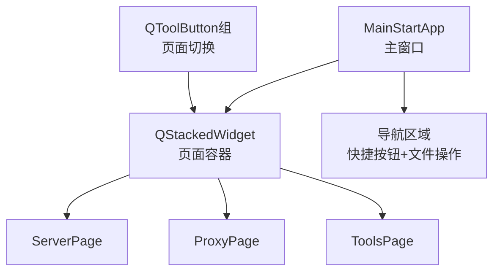

**图表来源**
- [MainApp.py:341-494](file://gui/MainApp.py#L341-L494)

**章节来源**
- [MainApp.py:312-494](file://gui/MainApp.py#L312-L494)

## 详细组件分析

### 主窗口与导航（MainStartApp）
- 布局策略：左侧堆叠页面 + 底部按钮栏，右侧导航区域。
- 页面切换：QToolButton 组合，点击设置 QStackedWidget 的 currentIndex。
- 退出流程：重写 closeEvent，弹出进度对话框，依次清理任务、API、数据库与浏览器资源。
- 窗口适配：动态尺寸适配与居中显示。

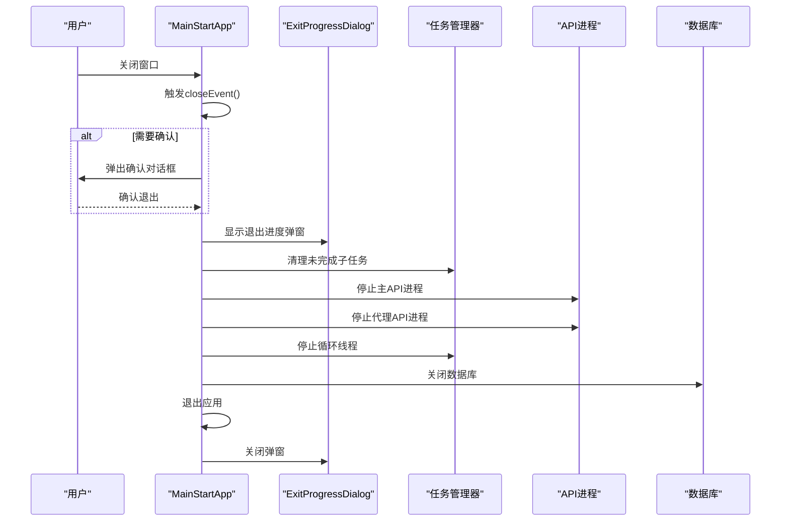

**图表来源**
- [MainApp.py:185-280](file://gui/MainApp.py#L185-L280)

**章节来源**
- [MainApp.py:179-280](file://gui/MainApp.py#L179-L280)

### 登录流程（LoginWindow）
- 登录线程：LoginThread 异步验证卡密，支持在线与离线模式。
- 权限加载：从配置文件读取权限并初始化数据库。
- 法律声明：通过模态对话框展示法律声明与卡密剩余天数。
- 机器码：异步加载并持久化到数据库。

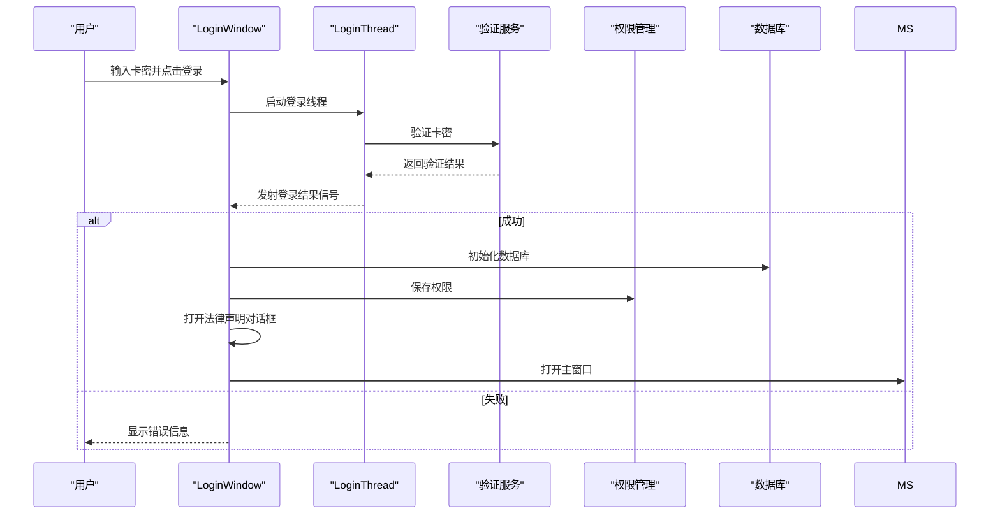

**图表来源**
- [LoginPage.py:24-186](file://gui/LoginPage.py#L24-L186)
- [LoginPage.py:462-490](file://gui/LoginPage.py#L462-L490)

**章节来源**
- [LoginPage.py:24-186](file://gui/LoginPage.py#L24-L186)
- [LoginPage.py:462-490](file://gui/LoginPage.py#L462-L490)

### 服务器页（ServerPage）
- 控制逻辑：启动/停止按钮加锁，防止并发操作；异步停止线程避免阻塞。
- 配置管理：通过 config_manager 保存/加载服务器参数（IP、端口、进程数、Token、认证、线程模式、运行模式、重启间隔）。
- 日志系统：实时追加日志并滚动到底部。
- 自动启动：根据配置在程序启动后自动启动服务器。

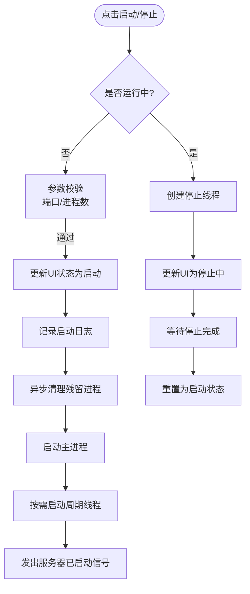

**图表来源**
- [ServerPage.py:353-471](file://gui/ServerPage.py#L353-L471)

**章节来源**
- [ServerPage.py:118-535](file://gui/ServerPage.py#L118-L535)

### 代理IP页（ProxyPage）
- 模式管理：普通模式（本地IP列表）、接口模式（远程API）、格式转换、说明。
- 测试设置：支持超时时间、测试URL、线程数与测试开关。
- 异步操作：启动/停止代理服务均在后台线程执行，避免阻塞主线程。
- 配置持久化：通过 config_manager 保存/加载代理相关参数。

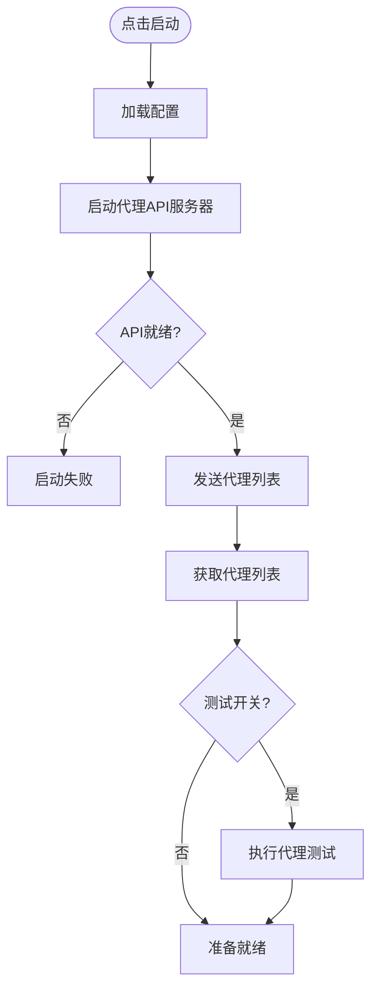

**图表来源**
- [ProxyPage.py:668-723](file://gui/ProxyPage.py#L668-L723)

**章节来源**
- [ProxyPage.py:73-723](file://gui/ProxyPage.py#L73-L723)

### 工具箱页（ToolsPage）
- HTTP请求工具：RequestsTool，支持保存/加载请求配置。
- 请求设置：RequestsSettings，集中管理HTTP请求参数。
- 压测模块：ZiyanWindow，支持多种压测模式、连接模式、代理配置与版本选择。
- 实拍图标注测试：ConfigWindow，复用现有组件。

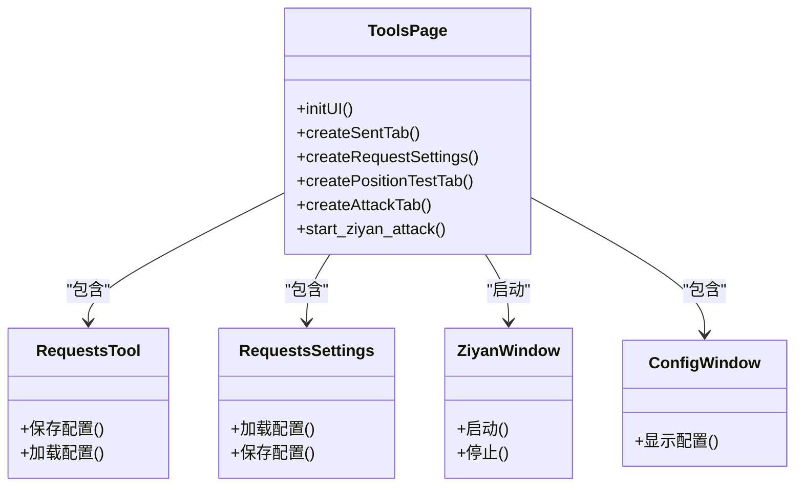

**图表来源**
- [ToolsPage.py:25-576](file://gui/ToolsPage.py#L25-L576)

**章节来源**
- [ToolsPage.py:25-576](file://gui/ToolsPage.py#L25-L576)

### 帮助页（HelpPage）
- 我的信息：展示用户签名、卡密、权限、到期时间与机器码（异步加载）。
- 赞助窗口：异步加载图片并提供复制地址功能。
- 贡献与说明：提供联系方式与使用教程。

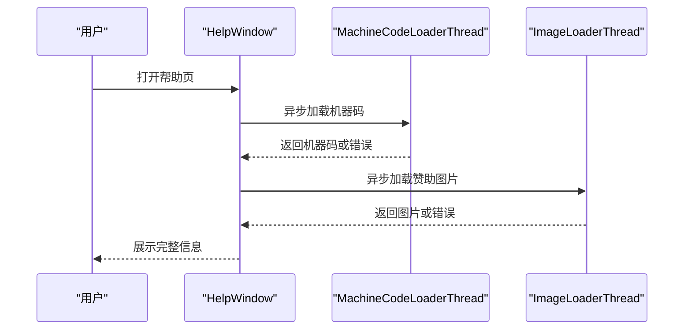

**图表来源**
- [HelpPage.py:26-69](file://gui/HelpPage.py#L26-L69)
- [HelpPage.py:250-307](file://gui/HelpPage.py#L250-L307)

**章节来源**
- [HelpPage.py:72-307](file://gui/HelpPage.py#L72-L307)

### 设置页（SettingPage）
- 分组选项卡：程序配置、线程数配置、AI工具、Temu任务配置、爬虫设置、财务报表设置。
- 权限控制：根据用户权限动态显示/隐藏选项卡。
- 配置持久化：统一通过 config_manager 保存/加载设置。
- 数据库表结构更新：一键修复与更新数据库表结构。

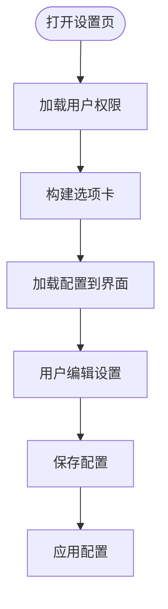

**图表来源**
- [SettingPage.py:28-85](file://gui/SettingPage.py#L28-L85)
- [SettingPage.py:92-483](file://gui/SettingPage.py#L92-L483)

**章节来源**
- [SettingPage.py:28-483](file://gui/SettingPage.py#L28-L483)

### 页面组件（MainPage）
- 提交任务页：支持多平台任务提交、输入框切换、日志展示与任务状态轮询。
- 任务状态轮询：定时器每秒轮询任务状态，通过信号槽更新UI。

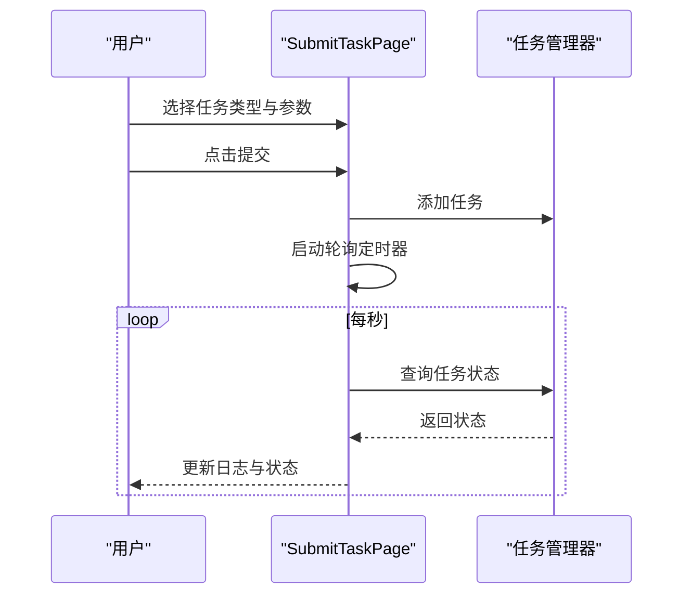

**图表来源**
- [MainPage.py:129-411](file://gui/MainPage.py#L129-L411)

**章节来源**
- [MainPage.py:129-411](file://gui/MainPage.py#L129-L411)

## 依赖分析
- 组件耦合：主窗口通过 QStackedWidget 管理页面，页面间通过信号/槽通信（如 ServerPage 的启动/停止信号）。
- 外部依赖：API 进程、数据库、配置管理器、权限管理器、网络验证模块。
- 样式依赖：QSS 文件提供统一的通用样式与按钮样式，便于主题切换与定制。

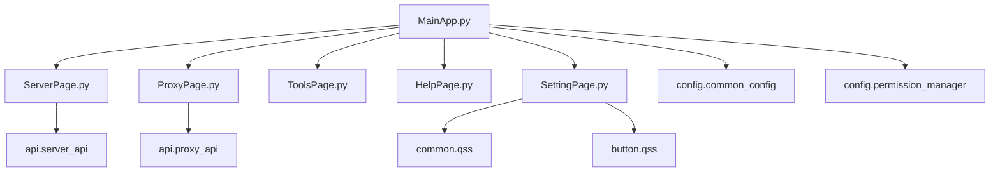

**图表来源**
- [MainApp.py:179-494](file://gui/MainApp.py#L179-L494)
- [ServerPage.py:16-22](file://gui/ServerPage.py#L16-L22)
- [ProxyPage.py:16-18](file://gui/ProxyPage.py#L16-L18)
- [SettingPage.py:19-25](file://gui/SettingPage.py#L19-L25)

**章节来源**
- [MainApp.py:179-494](file://gui/MainApp.py#L179-L494)
- [ServerPage.py:16-22](file://gui/ServerPage.py#L16-L22)
- [ProxyPage.py:16-18](file://gui/ProxyPage.py#L16-L18)
- [SettingPage.py:19-25](file://gui/SettingPage.py#L19-L25)

## 性能考虑
- 异步操作：登录、代理启动/停止、服务器停止、图片加载均通过线程实现，避免阻塞主线程。
- 轮询优化：任务状态轮询间隔为1秒，可根据需求调整；日志滚动延迟确保UI流畅。
- 资源清理：退出流程与关闭事件中确保清理任务、API、数据库与浏览器资源，防止资源泄漏。
- 样式与布局：使用 QSS 统一样式，减少重复样式设置带来的性能损耗。

[本节为通用指导，无需特定文件引用]

## 故障排除指南
- 登录失败：检查卡密有效性、网络状态与服务器可用性；离线模式需满足机器码匹配与有效期。
- 服务器启动失败：检查端口占用、进程数配置与重启间隔；查看日志定位具体错误。
- 代理IP无效：确认代理格式、测试开关与超时设置；检查代理API可用性。
- 工具箱功能异常：验证目标URL协议完整性、并发数与连接模式配置；确保代理服务可用。
- 设置保存失败：检查配置键名与值类型，确保权限正确；查看错误日志定位问题。

**章节来源**
- [LoginPage.py:345-461](file://gui/LoginPage.py#L345-L461)
- [ServerPage.py:362-439](file://gui/ServerPage.py#L362-L439)
- [ProxyPage.py:668-723](file://gui/ProxyPage.py#L668-L723)
- [ToolsPage.py:456-509](file://gui/ToolsPage.py#L456-L509)
- [SettingPage.py:295-483](file://gui/SettingPage.py#L295-L483)

## 结论
本项目基于 PyQt5 构建的 GUI 系统具备清晰的模块化结构与良好的扩展性。通过主窗口 + 堆叠页面 + 导航按钮的设计，实现了直观的页面切换与统一的交互体验。异步线程与信号槽机制保证了界面响应性与稳定性。配合完善的配置管理与样式系统，能够满足多权限、多业务场景下的界面定制与维护需求。

[本节为总结性内容，无需特定文件引用]

## 附录

### 界面定制指南
- 主题设置：通过设置页的主题下拉框切换“默认主题/新年主题”，重启后生效。
- 样式修改：在 common.qss 与 button.qss 中修改通用样式与按钮样式，支持颜色、字体、边框等属性。
- 字体与尺寸：通过 adapt_window_size 与 adapt_component_size 实现自适应布局，确保不同分辨率下的显示一致性。
- 图标与资源：使用 gui/img 目录下的图标资源，确保按钮与对话框的视觉统一。

**章节来源**
- [SettingPage.py:583-593](file://gui/SettingPage.py#L583-L593)
- [common.qss:1-117](file://gui/static/qss/common.qss#L1-L117)
- [button.qss:1-54](file://gui/static/qss/button.qss#L1-L54)

### 用户交互流程与事件处理
- 事件绑定：通过信号槽连接控件事件（如按钮点击、文本变化、复选框状态变化）。
- 状态管理：使用互斥锁与状态标记（如 is_running、stop_event）确保并发安全与状态一致性。
- 日志与反馈：统一通过 append_log 与消息框提供用户反馈，确保操作可追踪。

**章节来源**
- [ServerPage.py:537-577](file://gui/ServerPage.py#L537-L577)
- [ProxyPage.py:158-173](file://gui/ProxyPage.py#L158-L173)
- [ToolsPage.py:87-114](file://gui/ToolsPage.py#L87-L114)

### 开发最佳实践
- 使用线程处理耗时操作，避免阻塞主线程。
- 通过信号槽进行跨组件通信，降低耦合度。
- 统一配置管理与持久化，确保设置一致性。
- 严格的状态检查与异常处理，提升系统稳定性。
- 使用 QSS 统一样式，便于主题切换与维护。

[本节为通用指导，无需特定文件引用]