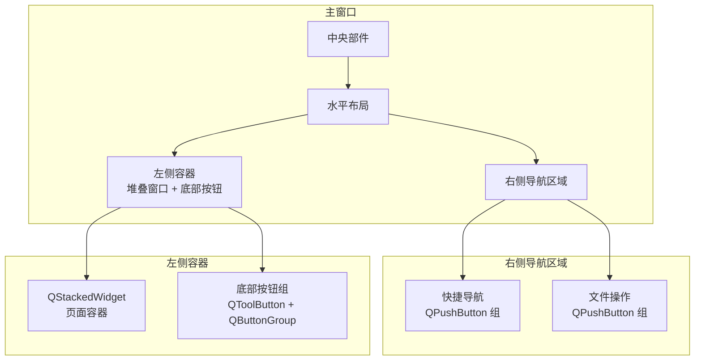
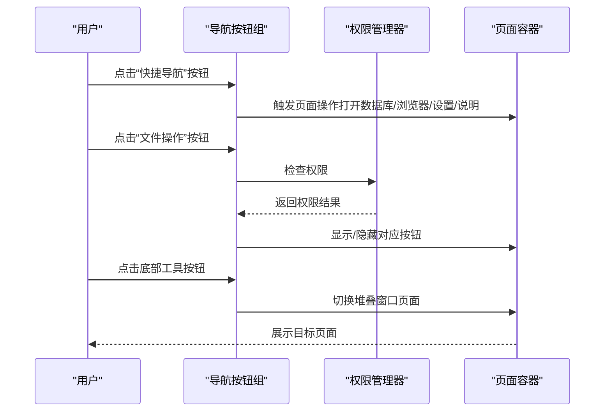
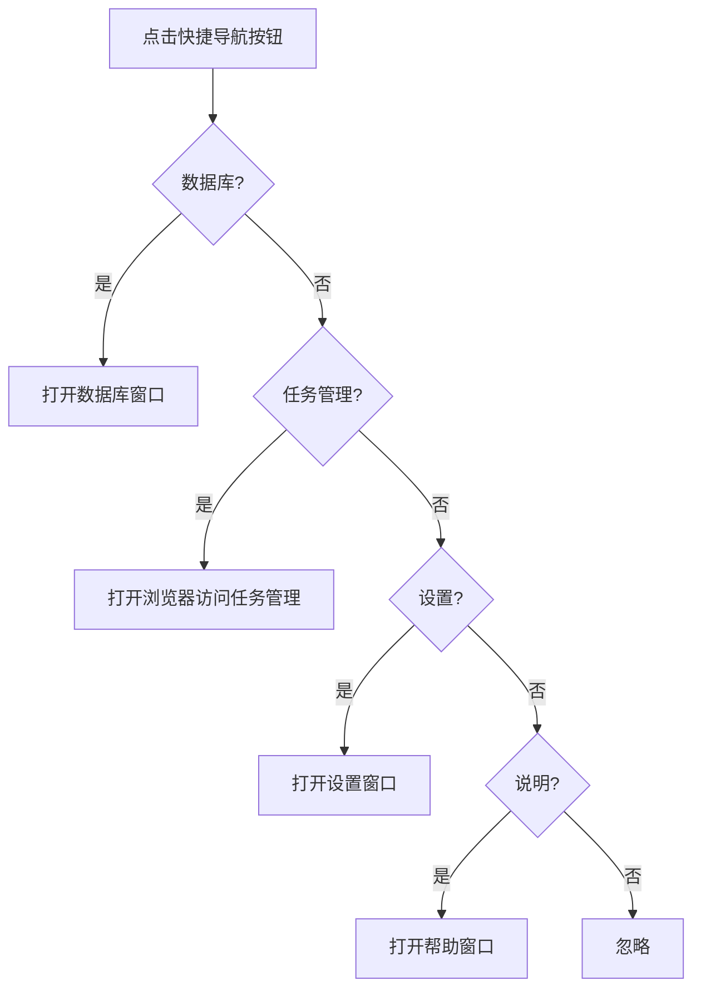
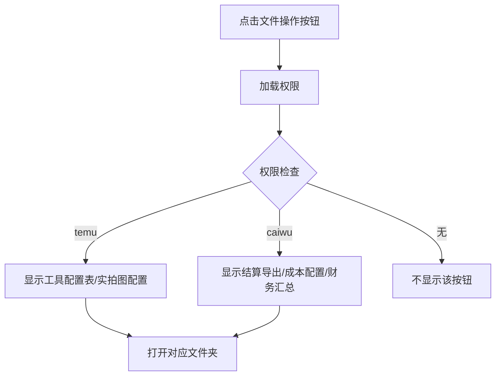
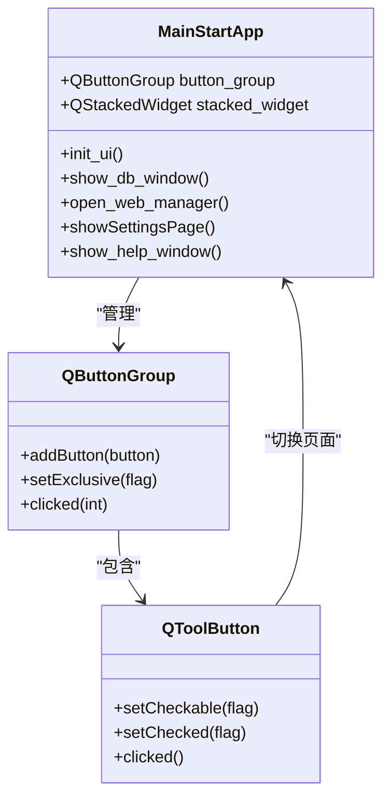
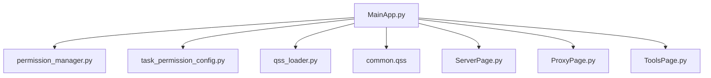

# 导航系统

<cite>
**本文档引用的文件**
- [MainApp.py](file://gui/MainApp.py)
- [permission_manager.py](file://config/permission_manager.py)
- [task_permission_config.py](file://config/task_permission_config.py)
- [common.qss](file://gui/static/qss/common.qss)
- [qss_loader.py](file://gui/static/qss/qss_loader.py)
- [ProxyPage.py](file://gui/ProxyPage.py)
- [ServerPage.py](file://gui/ServerPage.py)
- [ToolsPage.py](file://gui/ToolsPage.py)
</cite>

## 目录
1. [简介](#简介)
2. [项目结构](#项目结构)
3. [核心组件](#核心组件)
4. [架构概览](#架构概览)
5. [详细组件分析](#详细组件分析)
6. [依赖分析](#依赖分析)
7. [性能考虑](#性能考虑)
8. [故障排查指南](#故障排查指南)
9. [结论](#结论)
10. [附录](#附录)

## 简介
本文件针对 ikun_temu_system 的导航系统进行全面技术文档化，重点覆盖以下方面：
- 导航按钮组的设计与实现原理
- 快捷导航与文件操作导航的区别与用途
- 导航按钮的样式定制与响应机制
- 导航状态管理与用户界面反馈
- 导航系统与权限控制的集成方式
- 导航系统的扩展方法与自定义选项
- 导航性能优化与用户体验改进措施
- 导航系统的测试方法与调试技巧

## 项目结构
导航系统主要分布在主应用框架与样式资源中，采用“右侧导航区域 + 左侧内容区”的双栏布局：
- 右侧导航区域包含“快捷导航”和“文件操作”两大按钮组
- 左侧内容区采用堆叠窗口（QStackedWidget）承载多个页面（服务器、代理IP、工具箱等）
- 底部提供一组工具按钮（QToolButton），通过按钮组（QButtonGroup）实现互斥切换

图表来源
- [MainApp.py:341-508](file://gui/MainApp.py#L341-L508)

章节来源
- [MainApp.py:312-508](file://gui/MainApp.py#L312-L508)

## 核心组件
- 导航按钮组（右侧）
  - 快捷导航：数据库、任务管理、设置、说明
  - 文件操作：系统配置、工具配置表、实拍图配置、结算导出、成本配置、财务汇总等（受权限控制）
- 底部工具按钮组（左侧）
  - 服务器、代理IP、工具箱（互斥切换）
- 权限管理
  - 权限加载与检查，依据权限动态显示文件操作按钮
- 样式系统
  - 通用样式与按钮样式加载器，支持主题化与一致性

章节来源
- [MainApp.py:510-632](file://gui/MainApp.py#L510-L632)
- [MainApp.py:407-492](file://gui/MainApp.py#L407-L492)
- [permission_manager.py:12-126](file://config/permission_manager.py#L12-L126)
- [task_permission_config.py:7-84](file://config/task_permission_config.py#L7-L84)
- [common.qss:1-117](file://gui/static/qss/common.qss#L1-L117)
- [qss_loader.py:5-57](file://gui/static/qss/qss_loader.py#L5-L57)

## 架构概览
导航系统采用“按钮驱动页面切换 + 权限驱动菜单显隐”的架构：
- 事件绑定：按钮点击事件连接到页面切换或外部操作（打开文件夹、浏览器）
- 状态管理：QButtonGroup 管理底部工具按钮的互斥选中状态
- 权限集成：权限管理器在初始化时加载权限，动态决定文件操作按钮的显示
- 样式统一：通过 QSS 加载器集中管理按钮与通用样式

图表来源
- [MainApp.py:546-567](file://gui/MainApp.py#L546-L567)
- [MainApp.py:586-632](file://gui/MainApp.py#L586-L632)
- [MainApp.py:416-492](file://gui/MainApp.py#L416-L492)
- [permission_manager.py:58-87](file://config/permission_manager.py#L58-L87)

## 详细组件分析

### 快捷导航按钮组
- 组成：数据库、任务管理、设置、说明
- 行为：点击后触发相应动作（打开数据库窗口、浏览器、设置窗口、帮助窗口）
- 样式：统一的 QPushButton 样式，支持悬停与按下状态

图表来源
- [MainApp.py:546-567](file://gui/MainApp.py#L546-L567)
- [MainApp.py:953-1031](file://gui/MainApp.py#L953-L1031)

章节来源
- [MainApp.py:546-567](file://gui/MainApp.py#L546-L567)
- [MainApp.py:953-1031](file://gui/MainApp.py#L953-L1031)

### 文件操作按钮组
- 组成：系统配置、工具配置表、实拍图配置、结算导出、成本配置、财务汇总（按权限显示）
- 行为：点击后在资源管理器中打开对应文件夹
- 权限控制：根据权限列表动态显示按钮

图表来源
- [MainApp.py:586-632](file://gui/MainApp.py#L586-L632)
- [permission_manager.py:58-87](file://config/permission_manager.py#L58-L87)
- [task_permission_config.py:7-84](file://config/task_permission_config.py#L7-L84)

章节来源
- [MainApp.py:586-632](file://gui/MainApp.py#L586-L632)
- [permission_manager.py:58-87](file://config/permission_manager.py#L58-L87)
- [task_permission_config.py:67-84](file://config/task_permission_config.py#L67-L84)

### 底部工具按钮组
- 组成：服务器、代理IP、工具箱（互斥）
- 行为：通过 QButtonGroup 实现互斥选中，点击切换堆叠窗口页面
- 样式：QToolButton，支持圆角与选中高亮

图表来源
- [MainApp.py:407-492](file://gui/MainApp.py#L407-L492)
- [MainApp.py:312-371](file://gui/MainApp.py#L312-L371)

章节来源
- [MainApp.py:407-492](file://gui/MainApp.py#L407-L492)
- [MainApp.py:312-371](file://gui/MainApp.py#L312-L371)

### 样式定制与响应机制
- 样式来源：common.qss 提供通用样式，qss_loader 提供加载器
- 快捷导航按钮：统一背景色、圆角、内边距、字体大小与最小高度
- 底部工具按钮：边框、圆角、悬停与选中状态高亮
- 响应机制：按钮点击事件绑定到具体动作；权限变化时重新渲染文件操作按钮

章节来源
- [common.qss:1-117](file://gui/static/qss/common.qss#L1-L117)
- [qss_loader.py:5-57](file://gui/static/qss/qss_loader.py#L5-L57)
- [MainApp.py:529-544](file://gui/MainApp.py#L529-L544)
- [MainApp.py:380-404](file://gui/MainApp.py#L380-L404)

### 导航状态管理与用户界面反馈
- 状态管理：QButtonGroup 管理底部工具按钮互斥选中；页面切换通过 QStackedWidget 实现
- 反馈机制：按钮点击后即时更新 UI（文字、图标、样式）；权限变化时动态调整按钮显示
- 退出流程：主窗口关闭事件中包含进度弹窗与清理逻辑，保证状态一致性

章节来源
- [MainApp.py:414-492](file://gui/MainApp.py#L414-L492)
- [MainApp.py:179-280](file://gui/MainApp.py#L179-L280)

### 权限控制集成
- 权限来源：数据库配置，支持保存、加载与清除
- 检查逻辑：根据任务类型映射到所需权限，判断用户是否具备
- 集成方式：导航初始化时加载权限，动态决定文件操作按钮的显示与行为

章节来源
- [permission_manager.py:12-126](file://config/permission_manager.py#L12-L126)
- [task_permission_config.py:7-84](file://config/task_permission_config.py#L7-L84)
- [MainApp.py:576-584](file://gui/MainApp.py#L576-L584)

### 扩展方法与自定义选项
- 新增快捷导航按钮：在快捷导航组中添加 QPushButton 并绑定动作
- 新增文件操作按钮：在文件操作组中添加 QPushButton，结合权限控制显示
- 自定义样式：通过 qss_loader 加载自定义 QSS，或在按钮上设置样式表
- 页面扩展：在堆叠窗口中添加新页面，并在底部工具按钮组中增加对应按钮

章节来源
- [MainApp.py:510-632](file://gui/MainApp.py#L510-L632)
- [MainApp.py:348-368](file://gui/MainApp.py#L348-L368)
- [qss_loader.py:25-57](file://gui/static/qss/qss_loader.py#L25-L57)

## 依赖分析
导航系统的关键依赖关系如下：
- MainApp 依赖权限管理器与任务权限配置，用于动态显示文件操作按钮
- 样式系统通过 qss_loader 统一加载，保证界面风格一致
- 页面容器依赖堆叠窗口与按钮组，实现页面切换与状态管理

图表来源
- [MainApp.py:17-32](file://gui/MainApp.py#L17-L32)
- [permission_manager.py:25-49](file://config/permission_manager.py#L25-L49)
- [task_permission_config.py:49-66](file://config/task_permission_config.py#L49-L66)
- [qss_loader.py:8-24](file://gui/static/qss/qss_loader.py#L8-L24)

章节来源
- [MainApp.py:17-32](file://gui/MainApp.py#L17-L32)
- [permission_manager.py:25-49](file://config/permission_manager.py#L25-L49)
- [task_permission_config.py:49-66](file://config/task_permission_config.py#L49-L66)
- [qss_loader.py:8-24](file://gui/static/qss/qss_loader.py#L8-L24)

## 性能考虑
- 样式加载：通过 qss_loader 批量加载样式，减少重复 I/O
- 页面切换：QStackedWidget 仅维护当前页面，避免频繁创建销毁
- 权限检查：权限加载与检查在初始化阶段完成，运行时仅做简单判断
- 事件绑定：按钮事件绑定一次性完成，避免重复绑定导致的性能损耗

## 故障排查指南
- 按钮无响应
  - 检查按钮事件绑定是否正确（快捷导航与文件操作按钮均通过 clicked.connect 绑定）
  - 确认权限加载是否成功，权限不足会导致部分按钮不显示
- 样式异常
  - 检查 qss_loader 是否正确加载 common.qss 与按钮样式
  - 确认按钮样式表拼接是否正确（颜色、字体、内边距等）
- 页面切换失效
  - 检查 QButtonGroup 是否设置为互斥（setExclusive），以及按钮是否加入按钮组
  - 确认 QStackedWidget 的页面索引与按钮动作是否匹配
- 权限相关问题
  - 使用权限管理器的 load_permissions 检查数据库中权限配置
  - 通过任务权限配置的 check_task_permission 验证权限映射

章节来源
- [MainApp.py:546-567](file://gui/MainApp.py#L546-L567)
- [MainApp.py:586-632](file://gui/MainApp.py#L586-L632)
- [MainApp.py:414-492](file://gui/MainApp.py#L414-L492)
- [permission_manager.py:58-87](file://config/permission_manager.py#L58-L87)
- [task_permission_config.py:67-84](file://config/task_permission_config.py#L67-L84)

## 结论
导航系统通过清晰的布局与职责分离，实现了“快捷导航 + 文件操作 + 底部工具按钮”的一体化体验。其核心优势在于：
- 权限驱动的菜单显隐，确保功能安全可控
- 统一的样式体系与互斥状态管理，提供一致的交互体验
- 可扩展的结构设计，便于新增页面与按钮

## 附录
- 测试建议
  - 单元测试：对权限检查函数与按钮事件绑定进行单元测试
  - 集成测试：验证页面切换、权限变更与样式加载的协同工作
- 调试技巧
  - 使用日志记录按钮点击与页面切换事件
  - 在权限变更时重新初始化导航按钮组，确保 UI 与权限状态一致