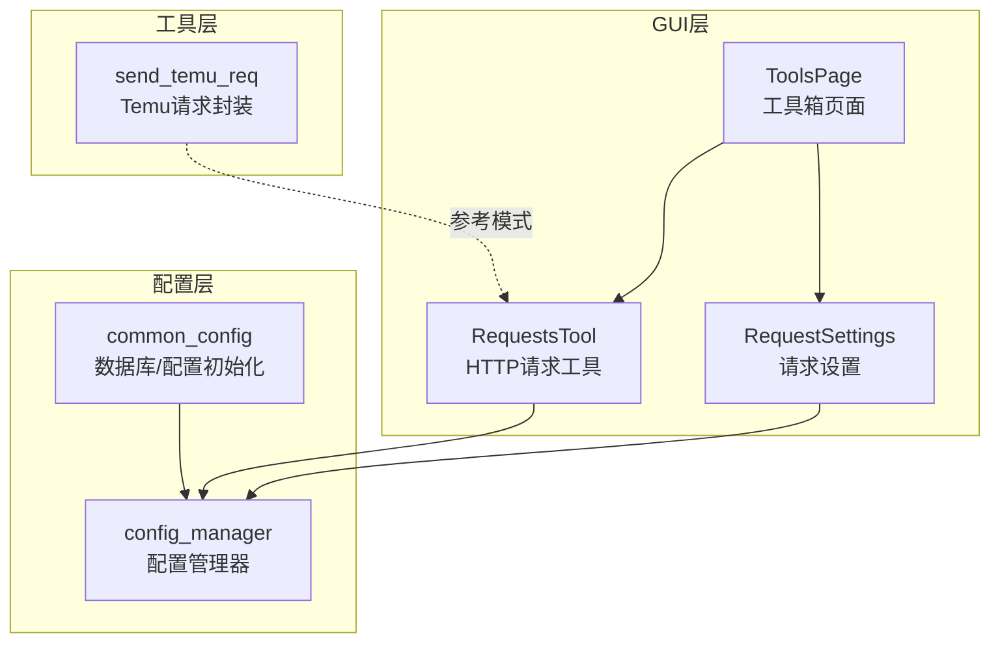
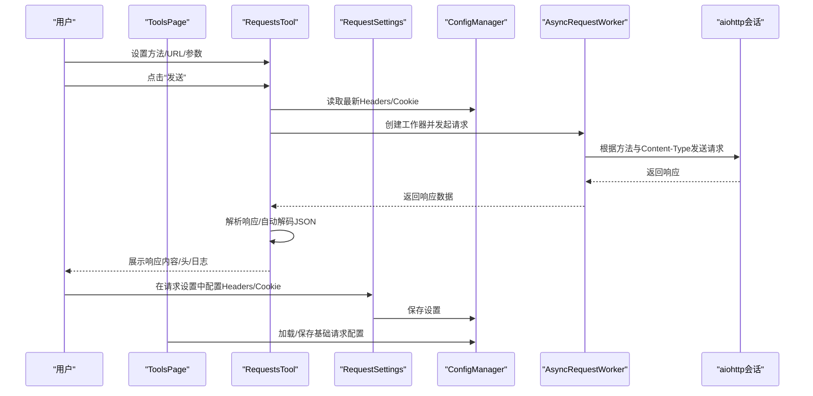
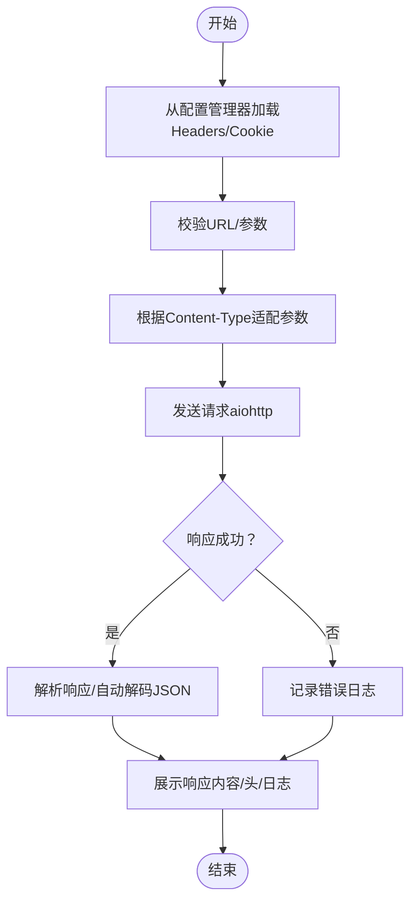
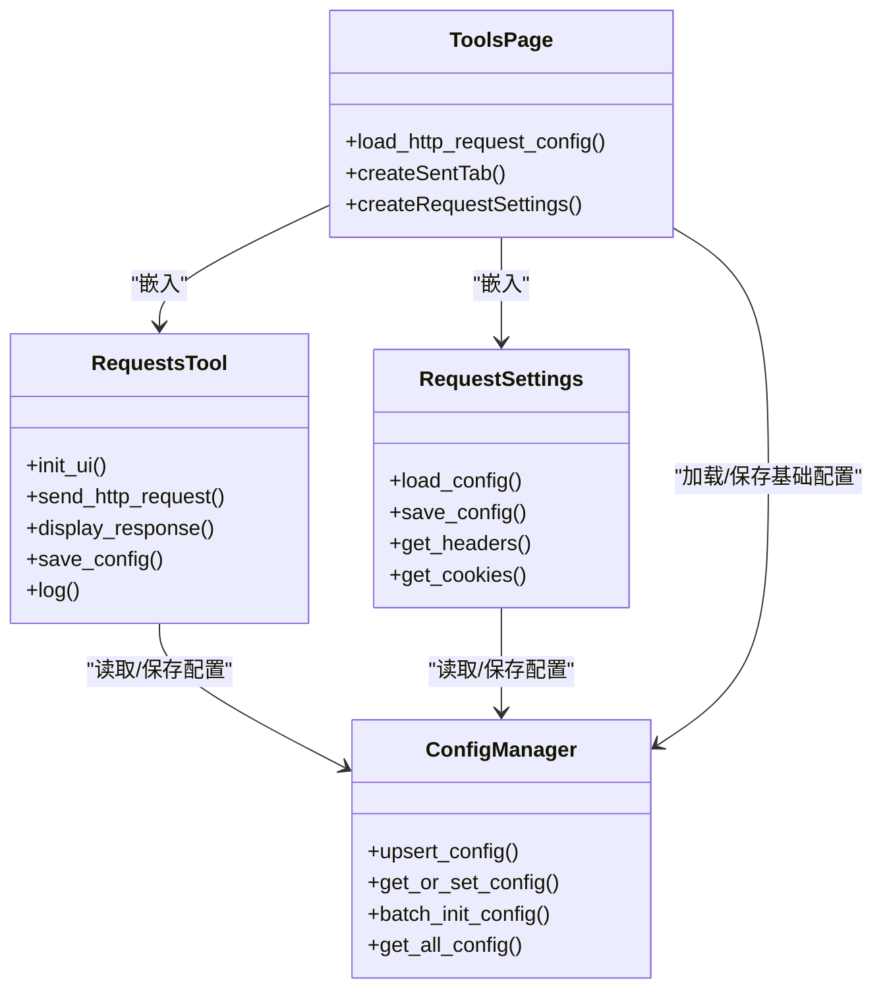

# HTTP请求工具

<cite>
**本文档引用的文件**
- [RequestsTool.py](file://gui/RequestsTool.py)
- [RequestSettings.py](file://gui/RequestSettings.py)
- [ToolsPage.py](file://gui/ToolsPage.py)
- [common_config.py](file://config/common_config.py)
- [config_manager.py](file://modules/config_manager.py)
- [send_temu_req.py](file://utils/send_temu_req.py)
</cite>

## 目录
1. [简介](#简介)
2. [项目结构](#项目结构)
3. [核心组件](#核心组件)
4. [架构总览](#架构总览)
5. [详细组件分析](#详细组件分析)
6. [依赖关系分析](#依赖关系分析)
7. [性能考虑](#性能考虑)
8. [故障排查指南](#故障排查指南)
9. [结论](#结论)
10. [附录](#附录)

## 简介
本文件面向HTTP请求工具的使用者与维护者，系统性说明其功能特性、界面布局、操作流程、参数配置、请求头与请求体构造、文件上传支持、响应展示与解析、常见使用场景、与系统其他组件的集成关系，以及配置管理与历史记录能力。该工具基于PyQt5构建，采用异步请求（aiohttp）实现高并发与良好的用户体验，并通过SQLite配置表持久化用户偏好与请求设置。

## 项目结构
HTTP请求工具位于GUI层，与配置管理、工具箱页面、请求设置组件协同工作：
- GUI层
  - RequestsTool：核心HTTP请求工具窗体，负责基础设置、发送/停止请求、响应展示、日志输出、参数编辑对话框、配置保存。
  - RequestSettings：请求头与Cookie配置组件，支持默认/自定义模式、Content-Type、User-Agent、Cookie等。
  - ToolsPage：工具箱页面，承载RequestsTool与RequestSettings两个选项卡，并负责从配置表加载/保存基础请求配置。
- 配置层
  - common_config：数据库初始化、全局配置管理器实例化、并发配置等。
  - config_manager：配置管理器，提供键值存取、类型转换、批量初始化、软删除等能力。
- 工具层
  - send_temu_req：Temu相关请求封装（非HTTP请求工具），但体现了系统中请求处理的一般模式（会话、UA、重试、限流等），可作为参考。

图表来源
- [ToolsPage.py:183-197](file://gui/ToolsPage.py#L183-L197)
- [RequestsTool.py:126-141](file://gui/RequestsTool.py#L126-L141)
- [RequestSettings.py:12-32](file://gui/RequestSettings.py#L12-L32)
- [common_config.py:213-213](file://config/common_config.py#L213-L213)
- [config_manager.py:6-20](file://modules/config_manager.py#L6-L20)
- [send_temu_req.py:64-80](file://utils/send_temu_req.py#L64-L80)

章节来源
- [ToolsPage.py:183-197](file://gui/ToolsPage.py#L183-L197)
- [RequestsTool.py:126-141](file://gui/RequestsTool.py#L126-L141)
- [RequestSettings.py:12-32](file://gui/RequestSettings.py#L12-L32)
- [common_config.py:213-213](file://config/common_config.py#L213-L213)
- [config_manager.py:6-20](file://modules/config_manager.py#L6-L20)
- [send_temu_req.py:64-80](file://utils/send_temu_req.py#L64-L80)

## 核心组件
- RequestsTool（HTTP请求工具）
  - 功能：基础请求设置（方法、URL、参数）、发送/停止请求、响应展示（内容/头）、日志输出、参数编辑对话框、配置保存。
  - 异步请求：使用AsyncRequestWorker与aiohttp，支持GET/POST/PUT/DELETE，自动根据Content-Type选择参数传递方式。
  - 配置加载：启动时加载基础配置；每次请求前从配置管理器读取最新Headers/Cookie。
  - 展示：支持JSON自动解码（当Content-Type为application/json时）。
- RequestSettings（请求设置）
  - 功能：Headers模式（默认/自定义）、Content-Type、User-Agent、Cookie模式（不使用/自定义）。
  - 交互：单选按钮切换模式，勾选框控制UA是否使用默认值，文本域输入JSON格式的Headers/Cookie。
  - 保存：将当前设置写入配置表，供RequestsTool在请求前读取。
- ToolsPage（工具箱页面）
  - 功能：承载RequestsTool与RequestSettings两个选项卡；从配置表加载基础请求配置到RequestsTool；保存基础配置。
- 配置管理器（ConfigManager）
  - 功能：键值存取、类型自动转换（str/int/float/list/dict/tuple/bool）、批量初始化、软删除、全量查询。
  - 作用：RequestsTool与RequestSettings通过它读取/保存配置；ToolsPage也使用它加载/保存基础请求配置。

章节来源
- [RequestsTool.py:126-471](file://gui/RequestsTool.py#L126-L471)
- [RequestSettings.py:12-251](file://gui/RequestSettings.py#L12-L251)
- [ToolsPage.py:151-181](file://gui/ToolsPage.py#L151-L181)
- [config_manager.py:92-189](file://modules/config_manager.py#L92-L189)

## 架构总览
HTTP请求工具的运行流程如下：
- 用户在RequestsTool中设置请求方法、URL、参数，点击“发送”。
- RequestsTool每次请求前从配置管理器读取最新Headers/Cookie。
- 异步请求工作器根据方法与Content-Type自动选择参数传递方式（GET参数在URL，其他方法参数作为JSON）。
- 请求完成后，将响应内容与响应头显示在界面，并可选地对JSON内容进行自动解码。
- 日志输出包含请求信息、错误信息、成功提示等。
- 用户可在RequestSettings中配置Headers/Cookie，并保存到配置表；ToolsPage负责加载/保存基础请求配置。

图表来源
- [RequestsTool.py:318-396](file://gui/RequestsTool.py#L318-L396)
- [RequestsTool.py:416-434](file://gui/RequestsTool.py#L416-L434)
- [RequestsTool.py:252-316](file://gui/RequestsTool.py#L252-L316)
- [RequestSettings.py:196-209](file://gui/RequestSettings.py#L196-L209)
- [ToolsPage.py:151-181](file://gui/ToolsPage.py#L151-L181)
- [config_manager.py:92-189](file://modules/config_manager.py#L92-L189)

## 详细组件分析

### RequestsTool（HTTP请求工具）
- 界面布局
  - 基础请求设置：请求方法（下拉）、请求URL（输入框）、请求参数（文本域，支持JSON格式）、按钮区（添加参数、发送、停止、清空日志、保存配置、JSON自动解码开关）。
  - 响应区域：三个标签页（响应内容、响应头、日志）。
- 操作流程
  - 输入校验：URL非空、自动补全协议。
  - 配置加载：每次请求前从配置管理器读取Headers/Cookie。
  - 参数适配：根据Content-Type自动区分GET参数位置与JSON参数传递。
  - 响应展示：支持JSON自动解码；响应头以键值对形式展示。
  - 停止请求：通过工作器的停止标志中断请求。
- 支持的HTTP方法
  - GET、POST、PUT、DELETE（大小写不敏感）。
- 参数配置
  - 支持JSON格式参数；可通过“添加参数”弹窗以键值对形式编辑。
  - 参数在GET时拼接到URL查询字符串，在其他方法时作为请求体JSON传递。
- 请求头设置
  - 默认Headers包含Accept、Accept-Language、Connection、Content-Type、User-Agent。
  - 可通过RequestSettings切换默认/自定义模式，自定义模式下可输入JSON格式的Headers。
- 请求体构造
  - 支持application/json、application/x-www-form-urlencoded、multipart/form-data、text/plain、text/html、application/xml等Content-Type。
  - 自动根据Content-Type选择参数传递方式。
- 文件上传
  - 代码中未见显式的multipart/form-data文件上传实现；如需上传文件，建议使用自定义Headers与application/x-www-form-urlencoded或application/json配合后端接口约定。
- 响应展示与解析
  - 响应内容与响应头分别展示；支持对application/json响应进行自动解码。
  - 日志区域输出请求过程与错误信息。
- 历史记录与配置
  - 通过配置管理器保存基础请求配置（URL、方法、参数）与请求设置（Headers/Cookie）。
  - ToolsPage负责从配置表加载这些配置到RequestsTool。

图表来源
- [RequestsTool.py:252-316](file://gui/RequestsTool.py#L252-L316)
- [RequestsTool.py:318-396](file://gui/RequestsTool.py#L318-L396)
- [RequestsTool.py:416-434](file://gui/RequestsTool.py#L416-L434)

章节来源
- [RequestsTool.py:126-471](file://gui/RequestsTool.py#L126-L471)
- [RequestsTool.py:473-581](file://gui/RequestsTool.py#L473-L581)
- [RequestsTool.py:583-657](file://gui/RequestsTool.py#L583-L657)

### RequestSettings（请求设置）
- 功能要点
  - Headers模式：默认模式（可自定义Content-Type/User-Agent）与自定义模式（完全自定义Headers）。
  - Content-Type：下拉选择常用类型。
  - User-Agent：勾选“使用默认”时自动填充默认UA，否则可输入自定义UA。
  - Cookie模式：不使用/自定义两种，自定义时输入JSON格式Cookie。
- 交互逻辑
  - 切换模式时启用/禁用相应控件。
  - 保存配置时将当前设置写入配置表。
- 与RequestsTool的协作
  - RequestsTool在每次请求前从配置管理器读取Headers/Cookie，从而应用RequestSettings的设置。

章节来源
- [RequestSettings.py:12-251](file://gui/RequestSettings.py#L12-L251)

### ToolsPage（工具箱页面）
- 功能要点
  - 承载RequestsTool与RequestSettings两个选项卡。
  - 从配置表加载基础请求配置（URL、方法、参数）到RequestsTool。
  - 保存基础请求配置到配置表。
- 与RequestsTool/RequestSettings的协作
  - 通过配置管理器读取/写入基础请求配置与请求设置。

章节来源
- [ToolsPage.py:151-181](file://gui/ToolsPage.py#L151-L181)
- [ToolsPage.py:183-197](file://gui/ToolsPage.py#L183-L197)

### 配置管理器（ConfigManager）
- 功能要点
  - upsert_config：智能插入/更新配置，支持类型转换与JSON序列化。
  - get_or_set_config：查询配置（不存在则自动创建并赋默认值）。
  - 批量初始化、软删除、全量查询。
- 与RequestsTool/RequestSettings/ToolsPage的协作
  - 三者均通过ConfigManager读取/保存配置，实现热更新与跨模块共享。

章节来源
- [config_manager.py:92-189](file://modules/config_manager.py#L92-L189)

## 依赖关系分析
- RequestsTool依赖
  - 配置管理器：读取Headers/Cookie与基础请求配置。
  - AsyncRequestWorker/aiohttp：异步请求与响应处理。
  - PyQt5：界面与事件驱动。
- RequestSettings依赖
  - 配置管理器：保存Headers/Cookie设置。
  - PyQt5：界面与事件驱动。
- ToolsPage依赖
  - 配置管理器：加载/保存基础请求配置。
  - RequestsTool/RequestSettings：作为子组件嵌入。
- 配置管理器依赖
  - SQLiteDB：底层数据库执行器。
- send_temu_req（参考）
  - 体现系统中请求处理的一般模式（会话、UA、重试、限流），可作为HTTP请求工具的扩展参考。

图表来源
- [RequestsTool.py:126-141](file://gui/RequestsTool.py#L126-L141)
- [RequestSettings.py:12-32](file://gui/RequestSettings.py#L12-L32)
- [ToolsPage.py:183-197](file://gui/ToolsPage.py#L183-L197)
- [config_manager.py:6-20](file://modules/config_manager.py#L6-L20)

章节来源
- [RequestsTool.py:126-141](file://gui/RequestsTool.py#L126-L141)
- [RequestSettings.py:12-32](file://gui/RequestSettings.py#L12-L32)
- [ToolsPage.py:183-197](file://gui/ToolsPage.py#L183-L197)
- [config_manager.py:6-20](file://modules/config_manager.py#L6-L20)

## 性能考虑
- 异步请求：使用aiohttp与async/await，避免阻塞UI线程，提高并发与响应速度。
- 参数适配：根据Content-Type自动选择参数传递方式，减少错误与额外序列化开销。
- JSON自动解码：仅在Content-Type为application/json时进行解码，避免不必要的处理。
- 配置热更新：每次请求前从配置管理器读取最新配置，确保设置即时生效。
- 建议
  - 对于大量请求，建议合理设置并发与重试策略，避免对目标服务器造成过大压力。
  - 如需上传文件，建议使用multipart/form-data并配合后端接口规范。

[本节为通用性能讨论，不直接分析具体文件]

## 故障排查指南
- 常见问题
  - URL为空：发送前会提示错误并终止请求。
  - 协议缺失：自动补全为http://，建议明确使用https://。
  - Headers/Cookie解析失败：自定义模式下JSON解析失败时回退到默认组合值。
  - 请求被取消：点击“停止”按钮后请求会被中断。
  - JSON自动解码失败：Content-Type不是application/json或响应非合法JSON时不会解码。
- 日志定位
  - 日志区域包含请求信息、错误信息与成功提示，便于定位问题。
- 配置检查
  - 确认RequestSettings中的Headers/Cookie设置正确。
  - 确认ToolsPage已从配置表加载基础请求配置。
- 参考模式
  - 可参考send_temu_req中的请求封装模式（会话、UA、重试、限流），用于扩展或调试。

章节来源
- [RequestsTool.py:332-352](file://gui/RequestsTool.py#L332-L352)
- [RequestsTool.py:273-282](file://gui/RequestsTool.py#L273-L282)
- [RequestsTool.py:407-414](file://gui/RequestsTool.py#L407-L414)
- [RequestsTool.py:421-427](file://gui/RequestsTool.py#L421-L427)
- [send_temu_req.py:64-80](file://utils/send_temu_req.py#L64-L80)

## 结论
HTTP请求工具提供了简洁直观的界面与完善的配置管理机制，支持常见的HTTP方法与参数传递方式，并通过异步请求保障良好的用户体验。RequestSettings与ToolsPage分别负责请求设置与基础配置的加载/保存，ConfigManager提供统一的键值存取与类型转换能力。对于文件上传等高级场景，可结合Content-Type与后端接口约定进行扩展。

[本节为总结性内容，不直接分析具体文件]

## 附录

### 常见HTTP请求场景示例
- GET请求
  - 设置方法为GET，参数以JSON形式输入；参数将被编码到URL查询字符串。
- POST请求
  - 设置方法为POST，参数以JSON形式输入；参数将作为请求体JSON发送。
- PUT/DELETE请求
  - 设置方法为PUT/DELETE，参数以JSON形式输入；参数将作为请求体JSON发送。
- 自定义Headers
  - 在RequestSettings中选择“完全自定义Headers”，输入JSON格式的Headers。
- 自定义Cookie
  - 在RequestSettings中选择“自定义Cookie”，输入JSON格式的Cookie。
- 保存配置
  - 在RequestsTool中点击“保存配置”，基础请求配置与请求设置将被写入配置表。

章节来源
- [RequestsTool.py:154-167](file://gui/RequestsTool.py#L154-L167)
- [RequestsTool.py:252-316](file://gui/RequestsTool.py#L252-L316)
- [RequestsTool.py:583-657](file://gui/RequestsTool.py#L583-L657)
- [RequestSettings.py:196-209](file://gui/RequestSettings.py#L196-L209)