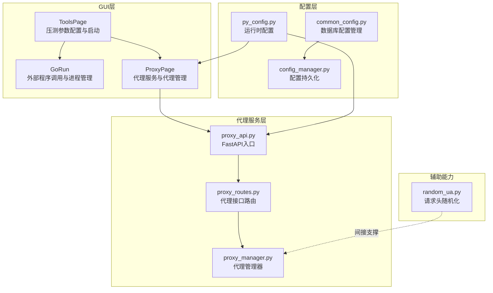
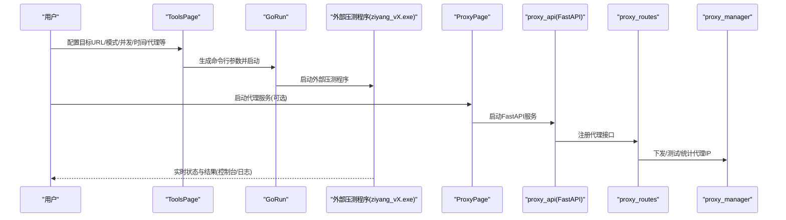
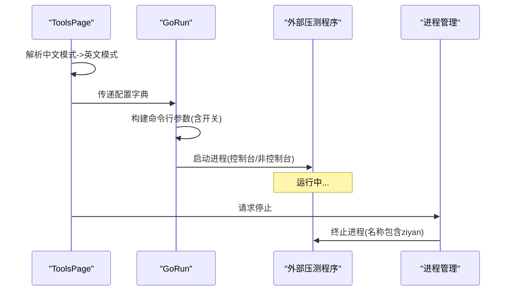
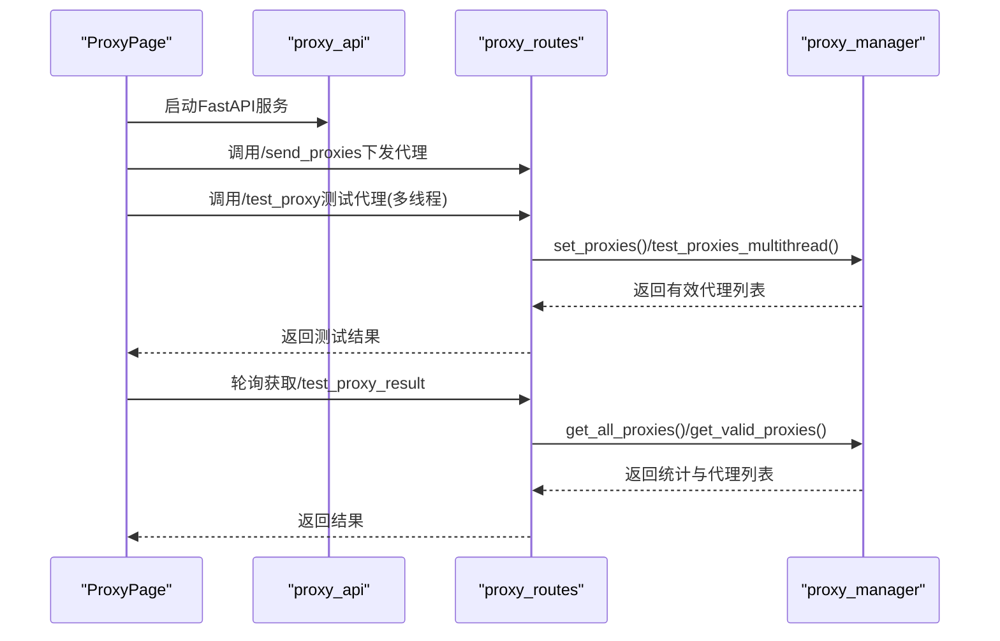
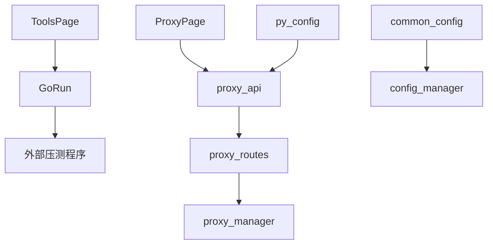

# 压力测试模块

<cite>
**本文档引用的文件**
- [ToolsPage.py](file://gui/ToolsPage.py)
- [GoRun.py](file://gui/GoRun.py)
- [proxy_routes.py](file://api/proxy_routes/proxy_routes.py)
- [proxy_api.py](file://api/proxy_api.py)
- [ProxyPage.py](file://gui/ProxyPage.py)
- [py_config.py](file://config/py_config.py)
- [common_config.py](file://config/common_config.py)
- [config_manager.py](file://modules/config_manager.py)
- [proxy_manager.py](file://utils/proxy_manager.py)
- [random_ua.py](file://spider_modules/random_ua.py)
</cite>

## 目录
1. [简介](#简介)
2. [项目结构](#项目结构)
3. [核心组件](#核心组件)
4. [架构总览](#架构总览)
5. [详细组件分析](#详细组件分析)
6. [依赖关系分析](#依赖关系分析)
7. [性能考量](#性能考量)
8. [故障排查指南](#故障排查指南)
9. [结论](#结论)
10. [附录](#附录)

## 简介
本模块为“自研混合压力测试模型”，提供图形化界面与外部Go程序协同工作的压测能力。用户可通过界面配置目标URL、压测模式、并发数、持续时间、代理策略等参数，一键启动/停止压测。模块同时内置代理服务与代理IP管理能力，支持本地代理IP文件与云端代理API两种来源，具备代理可用性检测、轮询/随机/智能切换等模式。

## 项目结构
压力测试模块主要涉及GUI配置界面、外部压测程序调用、代理服务与代理管理等几个方面：
- GUI配置与启动：ToolsPage负责压测参数收集与启动；GoRun负责调用外部Go压测程序并管理其生命周期。
- 代理服务：ProxyPage负责启动/停止代理API服务，提供代理IP下发、测试、统计等能力；proxy_api.py与proxy_routes.py构成FastAPI服务。
- 配置与参数：py_config.py提供运行时配置（如代理API端口、地址等）；common_config.py与config_manager.py提供数据库驱动的配置持久化与热更新。
- 代理管理：proxy_manager.py负责代理IP集合管理、可用性测试、统计与随机选取；random_ua.py提供请求头随机化能力（间接支撑压测流量多样性）。

**图表来源**
- [ToolsPage.py:227-488](file://gui/ToolsPage.py#L227-L488)
- [GoRun.py:12-90](file://gui/GoRun.py#L12-L90)
- [ProxyPage.py:73-162](file://gui/ProxyPage.py#L73-L162)
- [proxy_api.py:21-34](file://api/proxy_api.py#L21-L34)
- [proxy_routes.py:1-218](file://api/proxy_routes/proxy_routes.py#L1-L218)
- [py_config.py:4-31](file://config/py_config.py#L4-L31)
- [common_config.py:140-147](file://config/common_config.py#L140-L147)
- [config_manager.py:6-20](file://modules/config_manager.py#L6-L20)
- [random_ua.py:92-127](file://spider_modules/random_ua.py#L92-L127)

**章节来源**
- [ToolsPage.py:227-488](file://gui/ToolsPage.py#L227-L488)
- [GoRun.py:12-90](file://gui/GoRun.py#L12-L90)
- [ProxyPage.py:73-162](file://gui/ProxyPage.py#L73-L162)
- [proxy_api.py:21-34](file://api/proxy_api.py#L21-L34)
- [proxy_routes.py:1-218](file://api/proxy_routes/proxy_routes.py#L1-L218)
- [py_config.py:4-31](file://config/py_config.py#L4-L31)
- [common_config.py:140-147](file://config/common_config.py#L140-L147)
- [config_manager.py:6-20](file://modules/config_manager.py#L6-L20)
- [random_ua.py:92-127](file://spider_modules/random_ua.py#L92-L127)

## 核心组件
- 压测参数配置与启动
  - 目标URL、压测模式（混合/全随机/洪水/慢连接/异步）、并发数、持续时间、控制台模式、代理策略（本地/云端/禁用）、自动并发、连接模式（自动/普通/长连接）等。
  - 通过ToolsPage收集参数，映射为外部Go程序的命令行参数并启动。
- 外部压测程序调用
  - GoRun负责构建命令行参数、启动/停止外部Go压测程序，支持控制台展示与非控制台模式。
- 代理服务与代理管理
  - ProxyPage负责启动/停止代理API服务，提供代理IP列表下发、测试、统计与随机选取。
  - proxy_api.py与proxy_routes.py提供REST接口，proxy_manager.py负责代理集合与测试逻辑。
- 配置与持久化
  - py_config.py提供运行时配置（如代理API端口与URL）。
  - common_config.py与config_manager.py提供数据库驱动的配置读取/写入与类型转换。

**章节来源**
- [ToolsPage.py:258-289](file://gui/ToolsPage.py#L258-L289)
- [ToolsPage.py:456-488](file://gui/ToolsPage.py#L456-L488)
- [GoRun.py:34-64](file://gui/GoRun.py#L34-L64)
- [ProxyPage.py:668-722](file://gui/ProxyPage.py#L668-L722)
- [proxy_routes.py:20-124](file://api/proxy_routes/proxy_routes.py#L20-L124)
- [proxy_api.py:56-128](file://api/proxy_api.py#L56-L128)
- [py_config.py:13-15](file://config/py_config.py#L13-L15)
- [config_manager.py:154-189](file://modules/config_manager.py#L154-L189)

## 架构总览
压力测试模块采用“GUI配置 + 外部压测程序 + 代理服务”的分层架构：
- GUI层：ToolsPage与GoRun负责参数收集与外部程序调用。
- 代理服务层：FastAPI提供REST接口，统一代理IP下发、测试与统计。
- 配置层：py_config与config_manager提供运行时配置与持久化。
- 辅助能力：random_ua提供请求头随机化，间接提升压测流量多样性。

**图表来源**
- [ToolsPage.py:456-488](file://gui/ToolsPage.py#L456-L488)
- [GoRun.py:34-64](file://gui/GoRun.py#L34-L64)
- [ProxyPage.py:728-797](file://gui/ProxyPage.py#L728-L797)
- [proxy_api.py:21-34](file://api/proxy_api.py#L21-L34)
- [proxy_routes.py:20-124](file://api/proxy_routes/proxy_routes.py#L20-L124)

## 详细组件分析

### 组件A：压测参数与启动流程
- 参数映射
  - 目标URL、压测模式（混合/全随机/洪水/慢连接/异步）、并发数、持续时间、控制台模式、代理策略（本地/云端/禁用）、自动并发、连接模式（自动/普通/长连接）。
  - ToolsPage将中文模式映射为英文模式字符串，传递给GoRun。
- 启动流程
  - GoRun根据配置构建命令行参数，区分--no-proxy与--console等开关，然后启动外部压测程序。
  - 支持控制台展示与非控制台模式，便于观察实时状态与日志。
- 停止流程
  - 通过进程扫描终止名称包含“ziyan”的进程，确保压测程序被完全清理。

**图表来源**
- [ToolsPage.py:456-488](file://gui/ToolsPage.py#L456-L488)
- [GoRun.py:34-64](file://gui/GoRun.py#L34-L64)
- [GoRun.py:199-222](file://gui/GoRun.py#L199-L222)

**章节来源**
- [ToolsPage.py:258-289](file://gui/ToolsPage.py#L258-L289)
- [ToolsPage.py:456-488](file://gui/ToolsPage.py#L456-L488)
- [GoRun.py:34-64](file://gui/GoRun.py#L34-L64)
- [GoRun.py:199-222](file://gui/GoRun.py#L199-L222)

### 组件B：代理服务与代理管理
- 代理服务启动
  - ProxyPage启动FastAPI服务，监听本地端口；支持测试本机网络连通性、下发代理列表、测试代理有效性、获取统计信息等。
- 接口能力
  - /send_proxies：接收代理列表。
  - /test_proxy：多线程测试代理有效性。
  - /get_all_proxies、/get_proxies：获取全部/有效代理。
  - /test_proxy_result、/get_proxy_stats：获取测试结果与统计。
  - /test_local_ip、/get_local_ip：测试本机IP与获取本机IP。
- 代理管理
  - proxy_manager负责代理集合管理、测试历史记录、有效代理筛选、随机代理选取等。
- 代理格式与转换
  - 支持socks5://账号:密码@ip:端口与IP/端口/账号/密码等多种格式，提供双向转换与校验。

**图表来源**
- [ProxyPage.py:728-797](file://gui/ProxyPage.py#L728-L797)
- [proxy_routes.py:20-124](file://api/proxy_routes/proxy_routes.py#L20-L124)
- [proxy_routes.py:126-145](file://api/proxy_routes/proxy_routes.py#L126-L145)
- [proxy_api.py:56-128](file://api/proxy_api.py#L56-L128)

**章节来源**
- [ProxyPage.py:73-162](file://gui/ProxyPage.py#L73-L162)
- [proxy_routes.py:20-124](file://api/proxy_routes/proxy_routes.py#L20-L124)
- [proxy_routes.py:126-145](file://api/proxy_routes/proxy_routes.py#L126-L145)
- [proxy_api.py:56-128](file://api/proxy_api.py#L56-L128)

### 组件C：压测模式与适用场景
- 混合模式（推荐）
  - 多种模式混合进行，自动检测网站连通性并动态切换模式，兼顾稳定性与效果。
- 全随机模式
  - 随机时长切换模式，模拟更真实的访问行为。
- 洪水模式
  - 仅进行高并发请求，快速消耗服务器CPU/内存等资源，适合强压测试。
- 慢连接模式
  - 建立连接后缓慢发送请求，逐步消耗目标网站最大连接数，易造成连接耗尽。
- 异步模式
  - 通过异步I/O提升并发效率，适合高吞吐场景。

**章节来源**
- [ToolsPage.py:518-537](file://gui/ToolsPage.py#L518-L537)

### 组件D：配置参数与调优策略
- 目标URL
  - 必须包含完整协议（http://或https://），建议直接复制浏览器地址栏URL。
- 并发数
  - 建议16核16G配置区间20000-80000；网络上传速率50M以上可压制大部分网站服务器。
- 持续时间
  - 单位秒；支持“无限时间”勾选后持续运行。
- 连接模式
  - 自动（推荐）：短/长连接混合；普通：短连接；长连接：仅长连接。
- 代理策略
  - 启用代理服务：使用代理；启用本地代理IP：使用本地代理文件；官方云端代理IP：高质量匿名代理。
- 低伤害模式
  - 根据核心数分配安全并发数，降低对自身设备的影响。
- 控制台模式
  - 启动后显示控制台，便于查看实时状态与提示信息。

**章节来源**
- [ToolsPage.py:258-289](file://gui/ToolsPage.py#L258-L289)
- [ToolsPage.py:518-537](file://gui/ToolsPage.py#L518-L537)

### 组件E：代理服务配置与使用
- 启动代理服务
  - ProxyPage提供“启动/停止”按钮，异步启动/停止代理API服务，避免阻塞主线程。
  - 启动时自动等待API可用，失败则提示端口占用等问题。
- 代理IP来源
  - 普通模式：本地代理IP文件（支持socks5://账号:密码@ip:端口与IP/端口/账号/密码格式）。
  - 接口模式：动态获取代理API（支持HTTP/HTTPS，文本/JSON格式）。
- 代理测试
  - 支持测试超时时间、测试URL、线程数等配置；多线程并发测试代理有效性。
- 统计与结果
  - 提供代理总数、有效数量、测试历史、本机IP连通性等信息。

**章节来源**
- [ProxyPage.py:668-722](file://gui/ProxyPage.py#L668-L722)
- [ProxyPage.py:728-797](file://gui/ProxyPage.py#L728-L797)
- [proxy_routes.py:82-124](file://api/proxy_routes/proxy_routes.py#L82-L124)
- [proxy_routes.py:126-145](file://api/proxy_routes/proxy_routes.py#L126-L145)

### 组件F：执行流程与监控机制
- 执行流程
  - GUI收集参数 -> 映射为外部程序参数 -> 启动外部压测程序 -> 实时输出控制台日志 -> 支持停止并清理进程。
- 监控机制
  - 外部程序控制台输出实时状态与提示信息。
  - 代理服务提供测试结果轮询接口，便于监控代理有效性与统计信息。

**章节来源**
- [GoRun.py:34-64](file://gui/GoRun.py#L34-L64)
- [ProxyPage.py:823-895](file://gui/ProxyPage.py#L823-L895)
- [proxy_routes.py:126-145](file://api/proxy_routes/proxy_routes.py#L126-L145)

### 组件G：不同网络环境下的参数建议
- 低带宽环境
  - 降低并发数与持续时间，启用低伤害模式，减少对自身设备影响。
- 中等带宽环境
  - 并发数可适度提升，结合混合模式与代理服务，平衡效果与稳定性。
- 高带宽环境
  - 可使用洪水/慢连接模式，配合高质量代理，追求更强压测效果。

**章节来源**
- [ToolsPage.py:522-534](file://gui/ToolsPage.py#L522-L534)

### 组件H：安全考虑与最佳实践
- 合规与授权
  - 仅对授权范围内的目标进行压测，遵守法律法规与服务条款。
- 代理与隐私
  - 使用高质量匿名代理，避免泄露本机IP；定期清理代理列表，确保有效性。
- 资源保护
  - 启用低伤害模式与自动并发，避免过度消耗自身网络与硬件资源。
- 进程清理
  - 停止压测时确保外部程序进程被完全终止，避免残留进程影响系统性能。

**章节来源**
- [ToolsPage.py:528-531](file://gui/ToolsPage.py#L528-L531)
- [GoRun.py:199-222](file://gui/GoRun.py#L199-L222)

### 组件I：结果分析与评估方法
- 代理有效性
  - 通过/test_proxy_result接口获取代理总数、有效数量、测试历史与本机IP连通性，评估代理质量。
- 压测效果
  - 结合外部程序控制台输出与日志，评估目标系统的响应时间、错误率、吞吐量等指标。
- 调优建议
  - 根据测试结果调整并发数、持续时间、代理策略与连接模式，逐步逼近系统瓶颈。

**章节来源**
- [proxy_routes.py:126-145](file://api/proxy_routes/proxy_routes.py#L126-L145)
- [GoRun.py:34-64](file://gui/GoRun.py#L34-L64)

## 依赖关系分析
- GUI与外部程序
  - ToolsPage依赖GoRun进行外部程序调用；GoRun依赖外部可执行文件路径与命令行参数构建。
- 代理服务
  - ProxyPage依赖proxy_api与proxy_routes；proxy_api依赖FastAPI与CORS中间件；proxy_routes依赖proxy_manager。
- 配置
  - py_config提供运行时配置（端口、URL等）；common_config与config_manager提供数据库驱动的配置持久化与类型转换。

**图表来源**
- [ToolsPage.py:456-488](file://gui/ToolsPage.py#L456-L488)
- [GoRun.py:34-64](file://gui/GoRun.py#L34-L64)
- [ProxyPage.py:728-797](file://gui/ProxyPage.py#L728-L797)
- [proxy_api.py:21-34](file://api/proxy_api.py#L21-L34)
- [proxy_routes.py:1-218](file://api/proxy_routes/proxy_routes.py#L1-L218)
- [py_config.py:13-15](file://config/py_config.py#L13-L15)
- [common_config.py:140-147](file://config/common_config.py#L140-L147)
- [config_manager.py:6-20](file://modules/config_manager.py#L6-L20)

**章节来源**
- [ToolsPage.py:456-488](file://gui/ToolsPage.py#L456-L488)
- [GoRun.py:34-64](file://gui/GoRun.py#L34-L64)
- [ProxyPage.py:728-797](file://gui/ProxyPage.py#L728-L797)
- [proxy_api.py:21-34](file://api/proxy_api.py#L21-L34)
- [proxy_routes.py:1-218](file://api/proxy_routes/proxy_routes.py#L1-L218)
- [py_config.py:13-15](file://config/py_config.py#L13-L15)
- [common_config.py:140-147](file://config/common_config.py#L140-L147)
- [config_manager.py:6-20](file://modules/config_manager.py#L6-L20)

## 性能考量
- 并发与带宽
  - 并发数与网络上传速率成正比，建议根据实际带宽调整并发规模，避免带宽成为瓶颈。
- 代理质量
  - 使用高质量匿名代理可显著提升压测效果；定期测试与清理代理列表，确保有效性。
- 连接模式
  - 自动模式在混合短/长连接下通常更稳定；长连接模式适合高吞吐场景但需注意连接数限制。
- 进程与资源
  - 启用低伤害模式与自动并发，避免过度消耗CPU/内存；停止压测时确保进程被完全终止。

[本节为通用指导，无需具体文件分析]

## 故障排查指南
- 代理API启动失败
  - 检查端口占用情况，必要时使用端口管理器或强制释放；确认代理API端口配置正确。
- 代理测试失败
  - 检查测试URL与超时设置；确认网络连通性；尝试提高线程数与超时时间。
- 外部压测程序无法启动
  - 检查可执行文件路径与版本；确认命令行参数正确；查看控制台输出定位问题。
- 压测程序无法停止
  - 通过进程扫描终止名称包含“ziyan”的进程；确保无残留子进程影响系统。

**章节来源**
- [proxy_api.py:56-128](file://api/proxy_api.py#L56-L128)
- [ProxyPage.py:823-895](file://gui/ProxyPage.py#L823-L895)
- [GoRun.py:199-222](file://gui/GoRun.py#L199-L222)

## 结论
本模块通过GUI配置与外部压测程序协同，结合代理服务与代理管理，提供了灵活、可控的压力测试能力。通过合理配置目标URL、压测模式、并发数、持续时间与代理策略，可在不同网络环境下实现高效、稳定的压测。建议在合规前提下，结合代理质量与资源保护策略，逐步逼近系统瓶颈并评估压测效果。

[本节为总结性内容，无需具体文件分析]

## 附录
- 配置文件位置
  - 代理API端口与URL：py_config.py中读取配置文件生成。
  - 数据库配置与热更新：common_config.py与config_manager.py提供持久化与类型转换。
- 请求头随机化
  - random_ua.py提供多样化的请求头，间接提升压测流量的真实性与多样性。

**章节来源**
- [py_config.py:32-61](file://config/py_config.py#L32-L61)
- [common_config.py:140-147](file://config/common_config.py#L140-L147)
- [config_manager.py:154-189](file://modules/config_manager.py#L154-L189)
- [random_ua.py:92-127](file://spider_modules/random_ua.py#L92-L127)