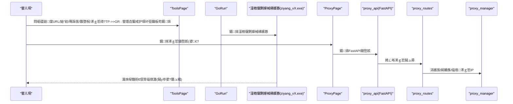
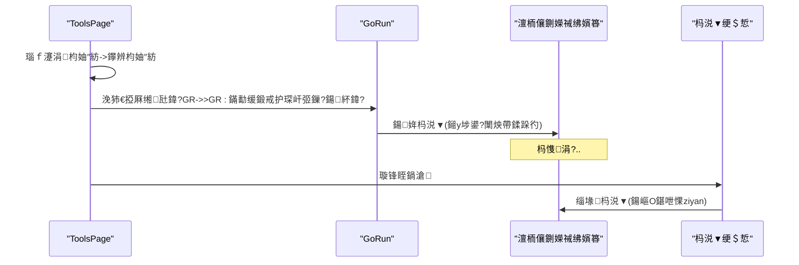
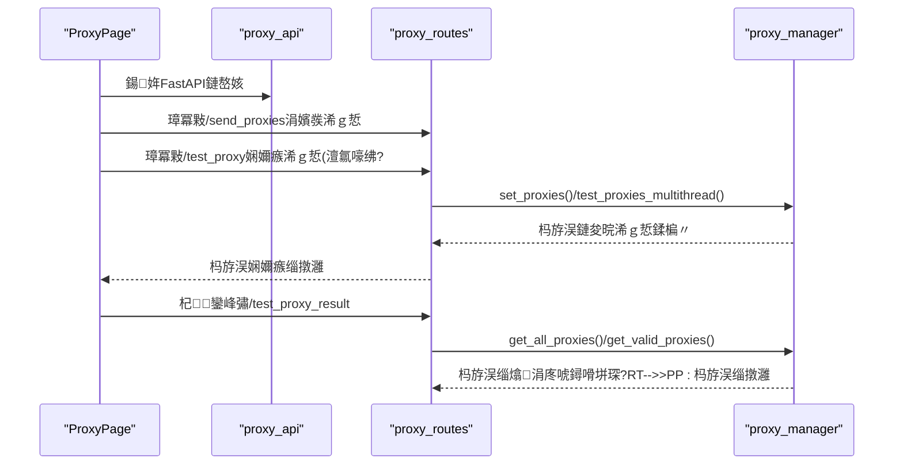
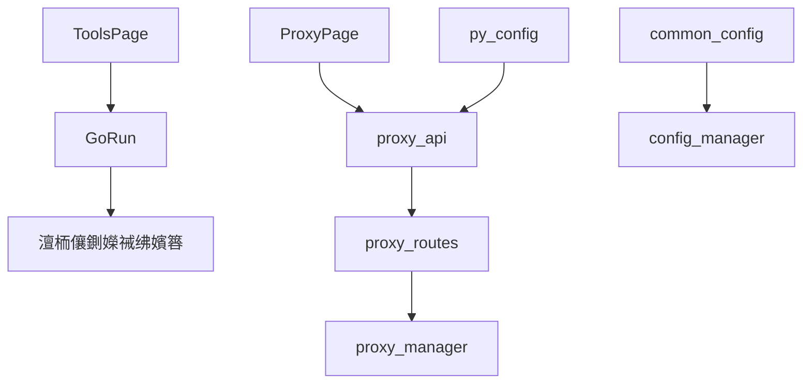

# 鍘嬪姏娴嬭瘯妯″潡

<cite>
**鏈枃妗ｅ紩鐢ㄧ殑鏂囦欢**
- [ToolsPage.py](file://gui/ToolsPage.py)
- [GoRun.py](file://gui/GoRun.py)
- [proxy_routes.py](file://api/proxy_routes/proxy_routes.py)
- [proxy_api.py](file://api/proxy_api.py)
- [ProxyPage.py](file://gui/ProxyPage.py)
- [py_config.py](file://config/py_config.py)
- [common_config.py](file://config/common_config.py)
- [config_manager.py](file://modules/config_manager.py)
- [proxy_manager.py](file://utils/proxy_manager.py)
- [random_ua.py](file://spider_modules/random_ua.py)
</cite>

## 鐩綍
1. [绠€浠媇(#绠€浠?
2. [椤圭洰缁撴瀯](#椤圭洰缁撴瀯)
3. [鏍稿績缁勪欢](#鏍稿績缁勪欢)
4. [鏋舵瀯鎬昏](#鏋舵瀯鎬昏)
5. [璇︾粏缁勪欢鍒嗘瀽](#璇︾粏缁勪欢鍒嗘瀽)
6. [渚濊禆鍏崇郴鍒嗘瀽](#渚濊禆鍏崇郴鍒嗘瀽)
7. [鎬ц兘鑰冮噺](#鎬ц兘鑰冮噺)
8. [鏁呴殰鎺掓煡鎸囧崡](#鏁呴殰鎺掓煡鎸囧崡)
9. [缁撹](#缁撹)
10. [闄勫綍](#闄勫綍)

## 绠€浠?鏈ā鍧椾负鈥滆嚜鐮旀贩鍚堝帇鍔涙祴璇曟ā鍨嬧€濓紝鎻愪緵鍥惧舰鍖栫晫闈笌澶栭儴Go绋嬪簭鍗忓悓宸ヤ綔鐨勫帇娴嬭兘鍔涖€傜敤鎴峰彲閫氳繃鐣岄潰閰嶇疆鐩爣URL銆佸帇娴嬫ā寮忋€佸苟鍙戞暟銆佹寔缁椂闂淬€佷唬鐞嗙瓥鐣ョ瓑鍙傛暟锛屼竴閿惎鍔?鍋滄鍘嬫祴銆傛ā鍧楀悓鏃跺唴缃唬鐞嗘湇鍔′笌浠ｇ悊IP绠＄悊鑳藉姏锛屾敮鎸佹湰鍦颁唬鐞咺P鏂囦欢涓庝簯绔唬鐞咥PI涓ょ鏉ユ簮锛屽叿澶囦唬鐞嗗彲鐢ㄦ€ф娴嬨€佽疆璇?闅忔満/鏅鸿兘鍒囨崲绛夋ā寮忋€?
## 椤圭洰缁撴瀯
鍘嬪姏娴嬭瘯妯″潡涓昏娑夊強GUI閰嶇疆鐣岄潰銆佸閮ㄥ帇娴嬬▼搴忚皟鐢ㄣ€佷唬鐞嗘湇鍔′笌浠ｇ悊绠＄悊绛夊嚑涓柟闈細
- GUI閰嶇疆涓庡惎鍔細ToolsPage璐熻矗鍘嬫祴鍙傛暟鏀堕泦涓庡惎鍔紱GoRun璐熻矗璋冪敤澶栭儴Go鍘嬫祴绋嬪簭骞剁鐞嗗叾鐢熷懡鍛ㄦ湡銆?- 浠ｇ悊鏈嶅姟锛歅roxyPage璐熻矗鍚姩/鍋滄浠ｇ悊API鏈嶅姟锛屾彁渚涗唬鐞咺P涓嬪彂銆佹祴璇曘€佺粺璁＄瓑鑳藉姏锛沺roxy_api.py涓巔roxy_routes.py鏋勬垚FastAPI鏈嶅姟銆?- 閰嶇疆涓庡弬鏁帮細py_config.py鎻愪緵杩愯鏃堕厤缃紙濡備唬鐞咥PI绔彛銆佸湴鍧€绛夛級锛沜ommon_config.py涓巆onfig_manager.py鎻愪緵鏁版嵁搴撻┍鍔ㄧ殑閰嶇疆鎸佷箙鍖栦笌鐑洿鏂般€?- 浠ｇ悊绠＄悊锛歱roxy_manager.py璐熻矗浠ｇ悊IP闆嗗悎绠＄悊銆佸彲鐢ㄦ€ф祴璇曘€佺粺璁′笌闅忔満閫夊彇锛況andom_ua.py鎻愪緵璇锋眰澶撮殢鏈哄寲鑳藉姏锛堥棿鎺ユ敮鎾戝帇娴嬫祦閲忓鏍锋€э級銆?
```mermaid
graph TB
subgraph "GUI灞?
TP["ToolsPage<br/>鍘嬫祴鍙傛暟閰嶇疆涓庡惎鍔?]
GP["GoRun<br/>澶栭儴绋嬪簭璋冪敤涓庤繘绋嬬鐞?]
PP["ProxyPage<br/>浠ｇ悊鏈嶅姟涓庝唬鐞嗙鐞?]
end
subgraph "浠ｇ悊鏈嶅姟灞?
API["proxy_api.py<br/>FastAPI鍏ュ彛"]
ROUTES["proxy_routes.py<br/>浠ｇ悊鎺ュ彛璺敱"]
PM["proxy_manager.py<br/>浠ｇ悊绠＄悊鍣?]
end
subgraph "閰嶇疆灞?
PC["py_config.py<br/>杩愯鏃堕厤缃?]
CC["common_config.py<br/>鏁版嵁搴撻厤缃鐞?]
CM["config_manager.py<br/>閰嶇疆鎸佷箙鍖?]
end
subgraph "杈呭姪鑳藉姏"
UA["random_ua.py<br/>璇锋眰澶撮殢鏈哄寲"]
end
TP --> GP
TP --> PP
PP --> API
API --> ROUTES
ROUTES --> PM
PC --> API
PC --> PP
CC --> CM
UA -. 闂存帴鏀拺 .-> PM
```

**鍥捐〃鏉ユ簮**
- [ToolsPage.py:227-488](file://gui/ToolsPage.py#L227-L488)
- [GoRun.py:12-90](file://gui/GoRun.py#L12-L90)
- [ProxyPage.py:73-162](file://gui/ProxyPage.py#L73-L162)
- [proxy_api.py:21-34](file://api/proxy_api.py#L21-L34)
- [proxy_routes.py:1-218](file://api/proxy_routes/proxy_routes.py#L1-L218)
- [py_config.py:4-31](file://config/py_config.py#L4-L31)
- [common_config.py:140-147](file://config/common_config.py#L140-L147)
- [config_manager.py:6-20](file://modules/config_manager.py#L6-L20)
- [random_ua.py:92-127](file://spider_modules/random_ua.py#L92-L127)

**绔犺妭鏉ユ簮**
- [ToolsPage.py:227-488](file://gui/ToolsPage.py#L227-L488)
- [GoRun.py:12-90](file://gui/GoRun.py#L12-L90)
- [ProxyPage.py:73-162](file://gui/ProxyPage.py#L73-L162)
- [proxy_api.py:21-34](file://api/proxy_api.py#L21-L34)
- [proxy_routes.py:1-218](file://api/proxy_routes/proxy_routes.py#L1-L218)
- [py_config.py:4-31](file://config/py_config.py#L4-L31)
- [common_config.py:140-147](file://config/common_config.py#L140-L147)
- [config_manager.py:6-20](file://modules/config_manager.py#L6-L20)
- [random_ua.py:92-127](file://spider_modules/random_ua.py#L92-L127)

## 鏍稿績缁勪欢
- 鍘嬫祴鍙傛暟閰嶇疆涓庡惎鍔?  - 鐩爣URL銆佸帇娴嬫ā寮忥紙娣峰悎/鍏ㄩ殢鏈?娲按/鎱㈣繛鎺?寮傛锛夈€佸苟鍙戞暟銆佹寔缁椂闂淬€佹帶鍒跺彴妯″紡銆佷唬鐞嗙瓥鐣ワ紙鏈湴/浜戠/绂佺敤锛夈€佽嚜鍔ㄥ苟鍙戙€佽繛鎺ユā寮忥紙鑷姩/鏅€?闀胯繛鎺ワ級绛夈€?  - 閫氳繃ToolsPage鏀堕泦鍙傛暟锛屾槧灏勪负澶栭儴Go绋嬪簭鐨勫懡浠よ鍙傛暟骞跺惎鍔ㄣ€?- 澶栭儴鍘嬫祴绋嬪簭璋冪敤
  - GoRun璐熻矗鏋勫缓鍛戒护琛屽弬鏁般€佸惎鍔?鍋滄澶栭儴Go鍘嬫祴绋嬪簭锛屾敮鎸佹帶鍒跺彴灞曠ず涓庨潪鎺у埗鍙版ā寮忋€?- 浠ｇ悊鏈嶅姟涓庝唬鐞嗙鐞?  - ProxyPage璐熻矗鍚姩/鍋滄浠ｇ悊API鏈嶅姟锛屾彁渚涗唬鐞咺P鍒楄〃涓嬪彂銆佹祴璇曘€佺粺璁′笌闅忔満閫夊彇銆?  - proxy_api.py涓巔roxy_routes.py鎻愪緵REST鎺ュ彛锛宲roxy_manager.py璐熻矗浠ｇ悊闆嗗悎涓庢祴璇曢€昏緫銆?- 閰嶇疆涓庢寔涔呭寲
  - py_config.py鎻愪緵杩愯鏃堕厤缃紙濡備唬鐞咥PI绔彛涓嶶RL锛夈€?  - common_config.py涓巆onfig_manager.py鎻愪緵鏁版嵁搴撻┍鍔ㄧ殑閰嶇疆璇诲彇/鍐欏叆涓庣被鍨嬭浆鎹€?
**绔犺妭鏉ユ簮**
- [ToolsPage.py:258-289](file://gui/ToolsPage.py#L258-L289)
- [ToolsPage.py:456-488](file://gui/ToolsPage.py#L456-L488)
- [GoRun.py:34-64](file://gui/GoRun.py#L34-L64)
- [ProxyPage.py:668-722](file://gui/ProxyPage.py#L668-L722)
- [proxy_routes.py:20-124](file://api/proxy_routes/proxy_routes.py#L20-L124)
- [proxy_api.py:56-128](file://api/proxy_api.py#L56-L128)
- [py_config.py:13-15](file://config/py_config.py#L13-L15)
- [config_manager.py:154-189](file://modules/config_manager.py#L154-L189)

## 鏋舵瀯鎬昏
鍘嬪姏娴嬭瘯妯″潡閲囩敤鈥淕UI閰嶇疆 + 澶栭儴鍘嬫祴绋嬪簭 + 浠ｇ悊鏈嶅姟鈥濈殑鍒嗗眰鏋舵瀯锛?- GUI灞傦細ToolsPage涓嶨oRun璐熻矗鍙傛暟鏀堕泦涓庡閮ㄧ▼搴忚皟鐢ㄣ€?- 浠ｇ悊鏈嶅姟灞傦細FastAPI鎻愪緵REST鎺ュ彛锛岀粺涓€浠ｇ悊IP涓嬪彂銆佹祴璇曚笌缁熻銆?- 閰嶇疆灞傦細py_config涓巆onfig_manager鎻愪緵杩愯鏃堕厤缃笌鎸佷箙鍖栥€?- 杈呭姪鑳藉姏锛歳andom_ua鎻愪緵璇锋眰澶撮殢鏈哄寲锛岄棿鎺ユ彁鍗囧帇娴嬫祦閲忓鏍锋€с€?


**鍥捐〃鏉ユ簮**
- [ToolsPage.py:456-488](file://gui/ToolsPage.py#L456-L488)
- [GoRun.py:34-64](file://gui/GoRun.py#L34-L64)
- [ProxyPage.py:728-797](file://gui/ProxyPage.py#L728-L797)
- [proxy_api.py:21-34](file://api/proxy_api.py#L21-L34)
- [proxy_routes.py:20-124](file://api/proxy_routes/proxy_routes.py#L20-L124)

## 璇︾粏缁勪欢鍒嗘瀽

### 缁勪欢A锛氬帇娴嬪弬鏁颁笌鍚姩娴佺▼
- 鍙傛暟鏄犲皠
  - 鐩爣URL銆佸帇娴嬫ā寮忥紙娣峰悎/鍏ㄩ殢鏈?娲按/鎱㈣繛鎺?寮傛锛夈€佸苟鍙戞暟銆佹寔缁椂闂淬€佹帶鍒跺彴妯″紡銆佷唬鐞嗙瓥鐣ワ紙鏈湴/浜戠/绂佺敤锛夈€佽嚜鍔ㄥ苟鍙戙€佽繛鎺ユā寮忥紙鑷姩/鏅€?闀胯繛鎺ワ級銆?  - ToolsPage灏嗕腑鏂囨ā寮忔槧灏勪负鑻辨枃妯″紡瀛楃涓诧紝浼犻€掔粰GoRun銆?- 鍚姩娴佺▼
  - GoRun鏍规嵁閰嶇疆鏋勫缓鍛戒护琛屽弬鏁帮紝鍖哄垎--no-proxy涓?-console绛夊紑鍏筹紝鐒跺悗鍚姩澶栭儴鍘嬫祴绋嬪簭銆?  - 鏀寔鎺у埗鍙板睍绀轰笌闈炴帶鍒跺彴妯″紡锛屼究浜庤瀵熷疄鏃剁姸鎬佷笌鏃ュ織銆?- 鍋滄娴佺▼
  - 閫氳繃杩涚▼鎵弿缁堟鍚嶇О鍖呭惈鈥渮iyan鈥濈殑杩涚▼锛岀‘淇濆帇娴嬬▼搴忚瀹屽叏娓呯悊銆?


**鍥捐〃鏉ユ簮**
- [ToolsPage.py:456-488](file://gui/ToolsPage.py#L456-L488)
- [GoRun.py:34-64](file://gui/GoRun.py#L34-L64)
- [GoRun.py:199-222](file://gui/GoRun.py#L199-L222)

**绔犺妭鏉ユ簮**
- [ToolsPage.py:258-289](file://gui/ToolsPage.py#L258-L289)
- [ToolsPage.py:456-488](file://gui/ToolsPage.py#L456-L488)
- [GoRun.py:34-64](file://gui/GoRun.py#L34-L64)
- [GoRun.py:199-222](file://gui/GoRun.py#L199-L222)

### 缁勪欢B锛氫唬鐞嗘湇鍔′笌浠ｇ悊绠＄悊
- 浠ｇ悊鏈嶅姟鍚姩
  - ProxyPage鍚姩FastAPI鏈嶅姟锛岀洃鍚湰鍦扮鍙ｏ紱鏀寔娴嬭瘯鏈満缃戠粶杩為€氭€с€佷笅鍙戜唬鐞嗗垪琛ㄣ€佹祴璇曚唬鐞嗘湁鏁堟€с€佽幏鍙栫粺璁′俊鎭瓑銆?- 鎺ュ彛鑳藉姏
  - /send_proxies锛氭帴鏀朵唬鐞嗗垪琛ㄣ€?  - /test_proxy锛氬绾跨▼娴嬭瘯浠ｇ悊鏈夋晥鎬с€?  - /get_all_proxies銆?get_proxies锛氳幏鍙栧叏閮?鏈夋晥浠ｇ悊銆?  - /test_proxy_result銆?get_proxy_stats锛氳幏鍙栨祴璇曠粨鏋滀笌缁熻銆?  - /test_local_ip銆?get_local_ip锛氭祴璇曟湰鏈篒P涓庤幏鍙栨湰鏈篒P銆?- 浠ｇ悊绠＄悊
  - proxy_manager璐熻矗浠ｇ悊闆嗗悎绠＄悊銆佹祴璇曞巻鍙茶褰曘€佹湁鏁堜唬鐞嗙瓫閫夈€侀殢鏈轰唬鐞嗛€夊彇绛夈€?- 浠ｇ悊鏍煎紡涓庤浆鎹?  - 鏀寔socks5://璐﹀彿:瀵嗙爜@ip:绔彛涓嶪P/绔彛/璐﹀彿/瀵嗙爜绛夊绉嶆牸寮忥紝鎻愪緵鍙屽悜杞崲涓庢牎楠屻€?


**鍥捐〃鏉ユ簮**
- [ProxyPage.py:728-797](file://gui/ProxyPage.py#L728-L797)
- [proxy_routes.py:20-124](file://api/proxy_routes/proxy_routes.py#L20-L124)
- [proxy_routes.py:126-145](file://api/proxy_routes/proxy_routes.py#L126-L145)
- [proxy_api.py:56-128](file://api/proxy_api.py#L56-L128)

**绔犺妭鏉ユ簮**
- [ProxyPage.py:73-162](file://gui/ProxyPage.py#L73-L162)
- [proxy_routes.py:20-124](file://api/proxy_routes/proxy_routes.py#L20-L124)
- [proxy_routes.py:126-145](file://api/proxy_routes/proxy_routes.py#L126-L145)
- [proxy_api.py:56-128](file://api/proxy_api.py#L56-L128)

### 缁勪欢C锛氬帇娴嬫ā寮忎笌閫傜敤鍦烘櫙
- 娣峰悎妯″紡锛堟帹鑽愶級
  - 澶氱妯″紡娣峰悎杩涜锛岃嚜鍔ㄦ娴嬬綉绔欒繛閫氭€у苟鍔ㄦ€佸垏鎹㈡ā寮忥紝鍏奸【绋冲畾鎬т笌鏁堟灉銆?- 鍏ㄩ殢鏈烘ā寮?  - 闅忔満鏃堕暱鍒囨崲妯″紡锛屾ā鎷熸洿鐪熷疄鐨勮闂涓恒€?- 娲按妯″紡
  - 浠呰繘琛岄珮骞跺彂璇锋眰锛屽揩閫熸秷鑰楁湇鍔″櫒CPU/鍐呭瓨绛夎祫婧愶紝閫傚悎寮哄帇娴嬭瘯銆?- 鎱㈣繛鎺ユā寮?  - 寤虹珛杩炴帴鍚庣紦鎱㈠彂閫佽姹傦紝閫愭娑堣€楃洰鏍囩綉绔欐渶澶ц繛鎺ユ暟锛屾槗閫犳垚杩炴帴鑰楀敖銆?- 寮傛妯″紡
  - 閫氳繃寮傛I/O鎻愬崌骞跺彂鏁堢巼锛岄€傚悎楂樺悶鍚愬満鏅€?
**绔犺妭鏉ユ簮**
- [ToolsPage.py:518-537](file://gui/ToolsPage.py#L518-L537)

### 缁勪欢D锛氶厤缃弬鏁颁笌璋冧紭绛栫暐
- 鐩爣URL
  - 蹇呴』鍖呭惈瀹屾暣鍗忚锛坔ttp://鎴杊ttps://锛夛紝寤鸿鐩存帴澶嶅埗娴忚鍣ㄥ湴鍧€鏍廢RL銆?- 骞跺彂鏁?  - 寤鸿16鏍?6G閰嶇疆鍖洪棿20000-80000锛涚綉缁滀笂浼犻€熺巼50M浠ヤ笂鍙帇鍒跺ぇ閮ㄥ垎缃戠珯鏈嶅姟鍣ㄣ€?- 鎸佺画鏃堕棿
  - 鍗曚綅绉掞紱鏀寔鈥滄棤闄愭椂闂粹€濆嬀閫夊悗鎸佺画杩愯銆?- 杩炴帴妯″紡
  - 鑷姩锛堟帹鑽愶級锛氱煭/闀胯繛鎺ユ贩鍚堬紱鏅€氾細鐭繛鎺ワ紱闀胯繛鎺ワ細浠呴暱杩炴帴銆?- 浠ｇ悊绛栫暐
  - 鍚敤浠ｇ悊鏈嶅姟锛氫娇鐢ㄤ唬鐞嗭紱鍚敤鏈湴浠ｇ悊IP锛氫娇鐢ㄦ湰鍦颁唬鐞嗘枃浠讹紱瀹樻柟浜戠浠ｇ悊IP锛氶珮璐ㄩ噺鍖垮悕浠ｇ悊銆?- 浣庝激瀹虫ā寮?  - 鏍规嵁鏍稿績鏁板垎閰嶅畨鍏ㄥ苟鍙戞暟锛岄檷浣庡鑷韩璁惧鐨勫奖鍝嶃€?- 鎺у埗鍙版ā寮?  - 鍚姩鍚庢樉绀烘帶鍒跺彴锛屼究浜庢煡鐪嬪疄鏃剁姸鎬佷笌鎻愮ず淇℃伅銆?
**绔犺妭鏉ユ簮**
- [ToolsPage.py:258-289](file://gui/ToolsPage.py#L258-L289)
- [ToolsPage.py:518-537](file://gui/ToolsPage.py#L518-L537)

### 缁勪欢E锛氫唬鐞嗘湇鍔￠厤缃笌浣跨敤
- 鍚姩浠ｇ悊鏈嶅姟
  - ProxyPage鎻愪緵鈥滃惎鍔?鍋滄鈥濇寜閽紝寮傛鍚姩/鍋滄浠ｇ悊API鏈嶅姟锛岄伩鍏嶉樆濉炰富绾跨▼銆?  - 鍚姩鏃惰嚜鍔ㄧ瓑寰匒PI鍙敤锛屽け璐ュ垯鎻愮ず绔彛鍗犵敤绛夐棶棰樸€?- 浠ｇ悊IP鏉ユ簮
  - 鏅€氭ā寮忥細鏈湴浠ｇ悊IP鏂囦欢锛堟敮鎸乻ocks5://璐﹀彿:瀵嗙爜@ip:绔彛涓嶪P/绔彛/璐﹀彿/瀵嗙爜鏍煎紡锛夈€?  - 鎺ュ彛妯″紡锛氬姩鎬佽幏鍙栦唬鐞咥PI锛堟敮鎸丠TTP/HTTPS锛屾枃鏈?JSON鏍煎紡锛夈€?- 浠ｇ悊娴嬭瘯
  - 鏀寔娴嬭瘯瓒呮椂鏃堕棿銆佹祴璇昒RL銆佺嚎绋嬫暟绛夐厤缃紱澶氱嚎绋嬪苟鍙戞祴璇曚唬鐞嗘湁鏁堟€с€?- 缁熻涓庣粨鏋?  - 鎻愪緵浠ｇ悊鎬绘暟銆佹湁鏁堟暟閲忋€佹祴璇曞巻鍙层€佹湰鏈篒P杩為€氭€х瓑淇℃伅銆?
**绔犺妭鏉ユ簮**
- [ProxyPage.py:668-722](file://gui/ProxyPage.py#L668-L722)
- [ProxyPage.py:728-797](file://gui/ProxyPage.py#L728-L797)
- [proxy_routes.py:82-124](file://api/proxy_routes/proxy_routes.py#L82-L124)
- [proxy_routes.py:126-145](file://api/proxy_routes/proxy_routes.py#L126-L145)

### 缁勪欢F锛氭墽琛屾祦绋嬩笌鐩戞帶鏈哄埗
- 鎵ц娴佺▼
  - GUI鏀堕泦鍙傛暟 -> 鏄犲皠涓哄閮ㄧ▼搴忓弬鏁?-> 鍚姩澶栭儴鍘嬫祴绋嬪簭 -> 瀹炴椂杈撳嚭鎺у埗鍙版棩蹇?-> 鏀寔鍋滄骞舵竻鐞嗚繘绋嬨€?- 鐩戞帶鏈哄埗
  - 澶栭儴绋嬪簭鎺у埗鍙拌緭鍑哄疄鏃剁姸鎬佷笌鎻愮ず淇℃伅銆?  - 浠ｇ悊鏈嶅姟鎻愪緵娴嬭瘯缁撴灉杞鎺ュ彛锛屼究浜庣洃鎺т唬鐞嗘湁鏁堟€т笌缁熻淇℃伅銆?
**绔犺妭鏉ユ簮**
- [GoRun.py:34-64](file://gui/GoRun.py#L34-L64)
- [ProxyPage.py:823-895](file://gui/ProxyPage.py#L823-L895)
- [proxy_routes.py:126-145](file://api/proxy_routes/proxy_routes.py#L126-L145)

### 缁勪欢G锛氫笉鍚岀綉缁滅幆澧冧笅鐨勫弬鏁板缓璁?- 浣庡甫瀹界幆澧?  - 闄嶄綆骞跺彂鏁颁笌鎸佺画鏃堕棿锛屽惎鐢ㄤ綆浼ゅ妯″紡锛屽噺灏戝鑷韩璁惧褰卞搷銆?- 涓瓑甯﹀鐜
  - 骞跺彂鏁板彲閫傚害鎻愬崌锛岀粨鍚堟贩鍚堟ā寮忎笌浠ｇ悊鏈嶅姟锛屽钩琛℃晥鏋滀笌绋冲畾鎬с€?- 楂樺甫瀹界幆澧?  - 鍙娇鐢ㄦ椽姘?鎱㈣繛鎺ユā寮忥紝閰嶅悎楂樿川閲忎唬鐞嗭紝杩芥眰鏇村己鍘嬫祴鏁堟灉銆?
**绔犺妭鏉ユ簮**
- [ToolsPage.py:522-534](file://gui/ToolsPage.py#L522-L534)

### 缁勪欢H锛氬畨鍏ㄨ€冭檻涓庢渶浣冲疄璺?- 鍚堣涓庢巿鏉?  - 浠呭鎺堟潈鑼冨洿鍐呯殑鐩爣杩涜鍘嬫祴锛岄伒瀹堟硶寰嬫硶瑙勪笌鏈嶅姟鏉℃銆?- 浠ｇ悊涓庨殣绉?  - 浣跨敤楂樿川閲忓尶鍚嶄唬鐞嗭紝閬垮厤娉勯湶鏈満IP锛涘畾鏈熸竻鐞嗕唬鐞嗗垪琛紝纭繚鏈夋晥鎬с€?- 璧勬簮淇濇姢
  - 鍚敤浣庝激瀹虫ā寮忎笌鑷姩骞跺彂锛岄伩鍏嶈繃搴︽秷鑰楄嚜韬綉缁滀笌纭欢璧勬簮銆?- 杩涚▼娓呯悊
  - 鍋滄鍘嬫祴鏃剁‘淇濆閮ㄧ▼搴忚繘绋嬭瀹屽叏缁堟锛岄伩鍏嶆畫鐣欒繘绋嬪奖鍝嶇郴缁熸€ц兘銆?
**绔犺妭鏉ユ簮**
- [ToolsPage.py:528-531](file://gui/ToolsPage.py#L528-L531)
- [GoRun.py:199-222](file://gui/GoRun.py#L199-L222)

### 缁勪欢I锛氱粨鏋滃垎鏋愪笌璇勪及鏂规硶
- 浠ｇ悊鏈夋晥鎬?  - 閫氳繃/test_proxy_result鎺ュ彛鑾峰彇浠ｇ悊鎬绘暟銆佹湁鏁堟暟閲忋€佹祴璇曞巻鍙蹭笌鏈満IP杩為€氭€э紝璇勪及浠ｇ悊璐ㄩ噺銆?- 鍘嬫祴鏁堟灉
  - 缁撳悎澶栭儴绋嬪簭鎺у埗鍙拌緭鍑轰笌鏃ュ織锛岃瘎浼扮洰鏍囩郴缁熺殑鍝嶅簲鏃堕棿銆侀敊璇巼銆佸悶鍚愰噺绛夋寚鏍囥€?- 璋冧紭寤鸿
  - 鏍规嵁娴嬭瘯缁撴灉璋冩暣骞跺彂鏁般€佹寔缁椂闂淬€佷唬鐞嗙瓥鐣ヤ笌杩炴帴妯″紡锛岄€愭閫艰繎绯荤粺鐡堕銆?
**绔犺妭鏉ユ簮**
- [proxy_routes.py:126-145](file://api/proxy_routes/proxy_routes.py#L126-L145)
- [GoRun.py:34-64](file://gui/GoRun.py#L34-L64)

## 渚濊禆鍏崇郴鍒嗘瀽
- GUI涓庡閮ㄧ▼搴?  - ToolsPage渚濊禆GoRun杩涜澶栭儴绋嬪簭璋冪敤锛汫oRun渚濊禆澶栭儴鍙墽琛屾枃浠惰矾寰勪笌鍛戒护琛屽弬鏁版瀯寤恒€?- 浠ｇ悊鏈嶅姟
  - ProxyPage渚濊禆proxy_api涓巔roxy_routes锛沺roxy_api渚濊禆FastAPI涓嶤ORS涓棿浠讹紱proxy_routes渚濊禆proxy_manager銆?- 閰嶇疆
  - py_config鎻愪緵杩愯鏃堕厤缃紙绔彛銆乁RL绛夛級锛沜ommon_config涓巆onfig_manager鎻愪緵鏁版嵁搴撻┍鍔ㄧ殑閰嶇疆鎸佷箙鍖栦笌绫诲瀷杞崲銆?


**鍥捐〃鏉ユ簮**
- [ToolsPage.py:456-488](file://gui/ToolsPage.py#L456-L488)
- [GoRun.py:34-64](file://gui/GoRun.py#L34-L64)
- [ProxyPage.py:728-797](file://gui/ProxyPage.py#L728-L797)
- [proxy_api.py:21-34](file://api/proxy_api.py#L21-L34)
- [proxy_routes.py:1-218](file://api/proxy_routes/proxy_routes.py#L1-L218)
- [py_config.py:13-15](file://config/py_config.py#L13-L15)
- [common_config.py:140-147](file://config/common_config.py#L140-L147)
- [config_manager.py:6-20](file://modules/config_manager.py#L6-L20)

**绔犺妭鏉ユ簮**
- [ToolsPage.py:456-488](file://gui/ToolsPage.py#L456-L488)
- [GoRun.py:34-64](file://gui/GoRun.py#L34-L64)
- [ProxyPage.py:728-797](file://gui/ProxyPage.py#L728-L797)
- [proxy_api.py:21-34](file://api/proxy_api.py#L21-L34)
- [proxy_routes.py:1-218](file://api/proxy_routes/proxy_routes.py#L1-L218)
- [py_config.py:13-15](file://config/py_config.py#L13-L15)
- [common_config.py:140-147](file://config/common_config.py#L140-L147)
- [config_manager.py:6-20](file://modules/config_manager.py#L6-L20)

## 鎬ц兘鑰冮噺
- 骞跺彂涓庡甫瀹?  - 骞跺彂鏁颁笌缃戠粶涓婁紶閫熺巼鎴愭姣旓紝寤鸿鏍规嵁瀹為檯甯﹀璋冩暣骞跺彂瑙勬ā锛岄伩鍏嶅甫瀹芥垚涓虹摱棰堛€?- 浠ｇ悊璐ㄩ噺
  - 浣跨敤楂樿川閲忓尶鍚嶄唬鐞嗗彲鏄捐憲鎻愬崌鍘嬫祴鏁堟灉锛涘畾鏈熸祴璇曚笌娓呯悊浠ｇ悊鍒楄〃锛岀‘淇濇湁鏁堟€с€?- 杩炴帴妯″紡
  - 鑷姩妯″紡鍦ㄦ贩鍚堢煭/闀胯繛鎺ヤ笅閫氬父鏇寸ǔ瀹氾紱闀胯繛鎺ユā寮忛€傚悎楂樺悶鍚愬満鏅絾闇€娉ㄦ剰杩炴帴鏁伴檺鍒躲€?- 杩涚▼涓庤祫婧?  - 鍚敤浣庝激瀹虫ā寮忎笌鑷姩骞跺彂锛岄伩鍏嶈繃搴︽秷鑰桟PU/鍐呭瓨锛涘仠姝㈠帇娴嬫椂纭繚杩涚▼琚畬鍏ㄧ粓姝€?
[鏈妭涓洪€氱敤鎸囧锛屾棤闇€鍏蜂綋鏂囦欢鍒嗘瀽]

## 鏁呴殰鎺掓煡鎸囧崡
- 浠ｇ悊API鍚姩澶辫触
  - 妫€鏌ョ鍙ｅ崰鐢ㄦ儏鍐碉紝蹇呰鏃朵娇鐢ㄧ鍙ｇ鐞嗗櫒鎴栧己鍒堕噴鏀撅紱纭浠ｇ悊API绔彛閰嶇疆姝ｇ‘銆?- 浠ｇ悊娴嬭瘯澶辫触
  - 妫€鏌ユ祴璇昒RL涓庤秴鏃惰缃紱纭缃戠粶杩為€氭€э紱灏濊瘯鎻愰珮绾跨▼鏁颁笌瓒呮椂鏃堕棿銆?- 澶栭儴鍘嬫祴绋嬪簭鏃犳硶鍚姩
  - 妫€鏌ュ彲鎵ц鏂囦欢璺緞涓庣増鏈紱纭鍛戒护琛屽弬鏁版纭紱鏌ョ湅鎺у埗鍙拌緭鍑哄畾浣嶉棶棰樸€?- 鍘嬫祴绋嬪簭鏃犳硶鍋滄
  - 閫氳繃杩涚▼鎵弿缁堟鍚嶇О鍖呭惈鈥渮iyan鈥濈殑杩涚▼锛涚‘淇濇棤娈嬬暀瀛愯繘绋嬪奖鍝嶇郴缁熴€?
**绔犺妭鏉ユ簮**
- [proxy_api.py:56-128](file://api/proxy_api.py#L56-L128)
- [ProxyPage.py:823-895](file://gui/ProxyPage.py#L823-L895)
- [GoRun.py:199-222](file://gui/GoRun.py#L199-L222)

## 缁撹
鏈ā鍧楅€氳繃GUI閰嶇疆涓庡閮ㄥ帇娴嬬▼搴忓崗鍚岋紝缁撳悎浠ｇ悊鏈嶅姟涓庝唬鐞嗙鐞嗭紝鎻愪緵浜嗙伒娲汇€佸彲鎺х殑鍘嬪姏娴嬭瘯鑳藉姏銆傞€氳繃鍚堢悊閰嶇疆鐩爣URL銆佸帇娴嬫ā寮忋€佸苟鍙戞暟銆佹寔缁椂闂翠笌浠ｇ悊绛栫暐锛屽彲鍦ㄤ笉鍚岀綉缁滅幆澧冧笅瀹炵幇楂樻晥銆佺ǔ瀹氱殑鍘嬫祴銆傚缓璁湪鍚堣鍓嶆彁涓嬶紝缁撳悎浠ｇ悊璐ㄩ噺涓庤祫婧愪繚鎶ょ瓥鐣ワ紝閫愭閫艰繎绯荤粺鐡堕骞惰瘎浼板帇娴嬫晥鏋溿€?
[鏈妭涓烘€荤粨鎬у唴瀹癸紝鏃犻渶鍏蜂綋鏂囦欢鍒嗘瀽]

## 闄勫綍
- 閰嶇疆鏂囦欢浣嶇疆
  - 浠ｇ悊API绔彛涓嶶RL锛歱y_config.py涓鍙栭厤缃枃浠剁敓鎴愩€?  - 鏁版嵁搴撻厤缃笌鐑洿鏂帮細common_config.py涓巆onfig_manager.py鎻愪緵鎸佷箙鍖栦笌绫诲瀷杞崲銆?- 璇锋眰澶撮殢鏈哄寲
  - random_ua.py鎻愪緵澶氭牱鍖栫殑璇锋眰澶达紝闂存帴鎻愬崌鍘嬫祴娴侀噺鐨勭湡瀹炴€т笌澶氭牱鎬с€?
**绔犺妭鏉ユ簮**
- [py_config.py:32-61](file://config/py_config.py#L32-L61)
- [common_config.py:140-147](file://config/common_config.py#L140-L147)
- [config_manager.py:154-189](file://modules/config_manager.py#L154-L189)
- [random_ua.py:92-127](file://spider_modules/random_ua.py#L92-L127)

