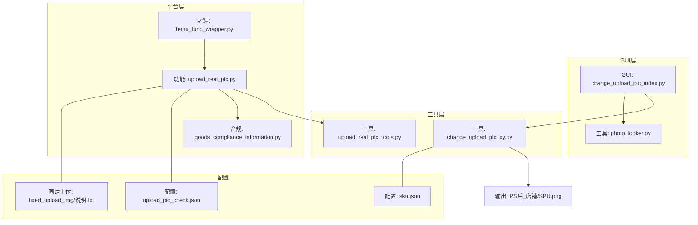
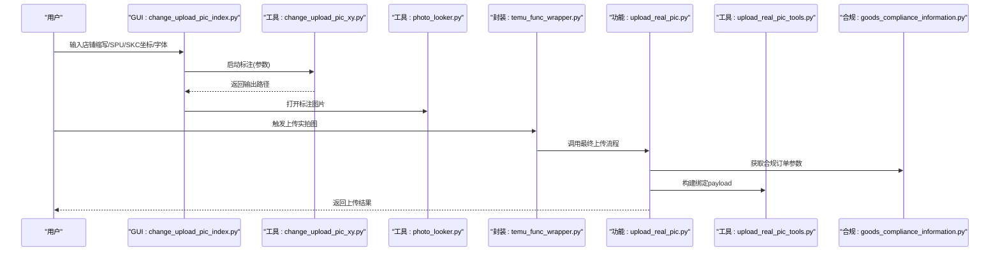
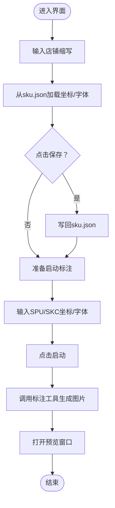
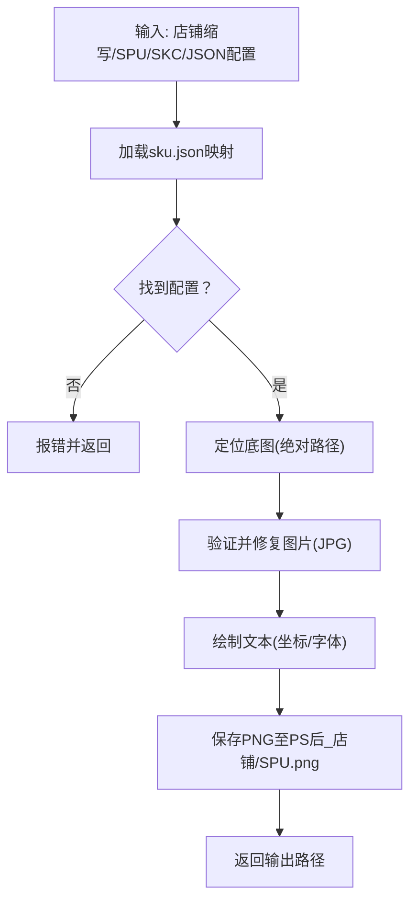
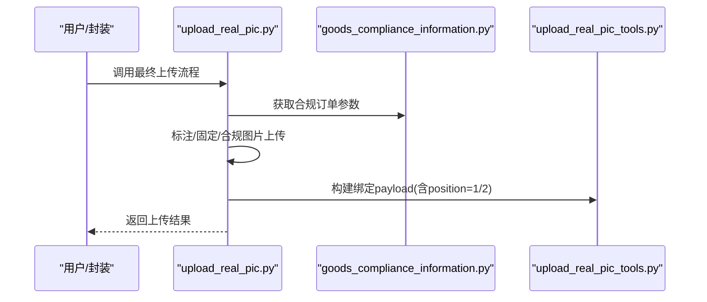
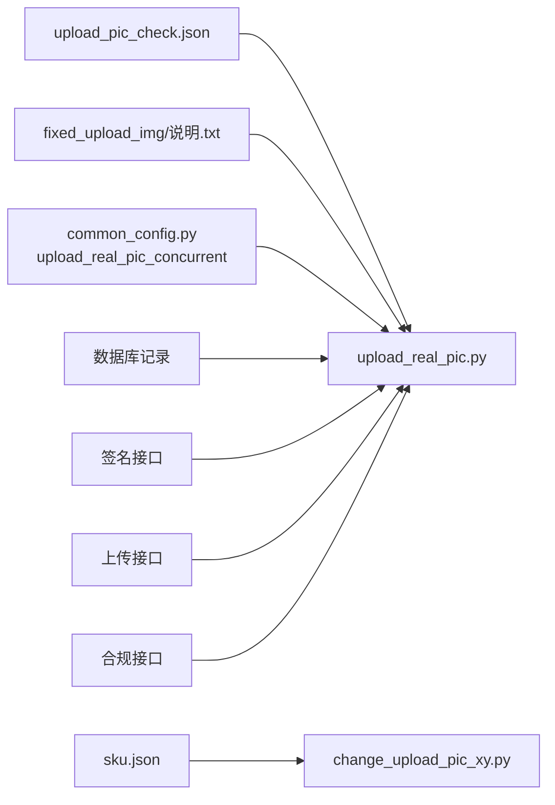

# 实拍图位置测试

<cite>
**本文引用的文件**
- [upload_real_pic.py](file://temu_modules/temu_function/upload_real_pic.py)
- [upload_real_pic_tools.py](file://temu_modules/temu_modules_tools/upload_real_pic_tools.py)
- [goods_compliance_information.py](file://temu_modules/temu_function/goods_compliance_information.py)
- [change_upload_pic_index.py](file://gui/change_upload_pic_index.py)
- [change_upload_pic_xy.py](file://lite_modules/change_upload_pic_xy.py)
- [photo_looker.py](file://lite_modules/photo_looker.py)
- [common_config.py](file://config/common_config.py)
- [upload_pic_check.json](file://配置文件_实拍图配置/upload_pic_check.json)
- [sku.json](file://配置文件_实拍图配置/sku.json)
- [说明.txt](file://配置文件_实拍图配置/fixed_upload_img/说明.txt)
- [temu_func_wrapper.py](file://temu_modules/temu_func_wrapper.py)
</cite>

## 目录
1. [简介](#简介)
2. [项目结构](#项目结构)
3. [核心组件](#核心组件)
4. [架构总览](#架构总览)
5. [详细组件分析](#详细组件分析)
6. [依赖分析](#依赖分析)
7. [性能考虑](#性能考虑)
8. [故障排查指南](#故障排查指南)
9. [结论](#结论)
10. [附录](#附录)

## 简介
本文件面向“实拍图位置测试”功能，围绕实拍图标注测试工具的设计目的、使用场景、界面操作流程、功能特性、图片上传与标注绘制、坐标记录、参数配置、测试结果保存与导出、上传前预检与验证、与Temu平台实拍图上传功能的集成关系，以及常见问题与解决方案进行全面说明。文档同时提供可视化架构与流程图，帮助非技术读者理解整体工作流。

## 项目结构
实拍图位置测试涉及三层：GUI交互层、标注与上传工具层、Temu平台接口层。核心文件分布如下：
- GUI层：提供实拍图标注测试界面，支持坐标输入、保存、启动标注与预览。
- 工具层：负责图片验证、标注绘制、输出结果展示。
- 平台层：对接Temu实拍图上传接口，完成签名获取、图片上传、绑定实拍图等。

**图表来源**
- [change_upload_pic_index.py:1-258](file://gui/change_upload_pic_index.py#L1-L258)
- [change_upload_pic_xy.py:1-221](file://lite_modules/change_upload_pic_xy.py#L1-L221)
- [photo_looker.py:1-68](file://lite_modules/photo_looker.py#L1-L68)
- [upload_real_pic.py:1-1148](file://temu_modules/temu_function/upload_real_pic.py#L1-L1148)
- [upload_real_pic_tools.py:1-187](file://temu_modules/temu_modules_tools/upload_real_pic_tools.py#L1-L187)
- [goods_compliance_information.py:1-293](file://temu_modules/temu_function/goods_compliance_information.py#L1-L293)
- [sku.json:1-338](file://配置文件_实拍图配置/sku.json#L1-L338)
- [upload_pic_check.json:1-48](file://配置文件_实拍图配置/upload_pic_check.json#L1-L48)
- [说明.txt:1-1](file://配置文件_实拍图配置/fixed_upload_img/说明.txt#L1-L1)
- [temu_func_wrapper.py:72-95](file://temu_modules/temu_func_wrapper.py#L72-L95)

**章节来源**
- [change_upload_pic_index.py:1-258](file://gui/change_upload_pic_index.py#L1-L258)
- [change_upload_pic_xy.py:1-221](file://lite_modules/change_upload_pic_xy.py#L1-L221)
- [photo_looker.py:1-68](file://lite_modules/photo_looker.py#L1-L68)
- [upload_real_pic.py:1-1148](file://temu_modules/temu_function/upload_real_pic.py#L1-L1148)
- [upload_real_pic_tools.py:1-187](file://temu_modules/temu_modules_tools/upload_real_pic_tools.py#L1-L187)
- [goods_compliance_information.py:1-293](file://temu_modules/temu_function/goods_compliance_information.py#L1-L293)
- [sku.json:1-338](file://配置文件_实拍图配置/sku.json#L1-L338)
- [upload_pic_check.json:1-48](file://配置文件_实拍图配置/upload_pic_check.json#L1-L48)
- [说明.txt:1-1](file://配置文件_实拍图配置/fixed_upload_img/说明.txt#L1-L1)
- [temu_func_wrapper.py:72-95](file://temu_modules/temu_func_wrapper.py#L72-L95)

## 核心组件
- GUI标注测试界面：提供店铺缩写、SPU、SKC ID、X/Y坐标、字体大小输入，支持保存与启动标注。
- 标注绘制工具：根据sku.json配置定位标注位置，对底图进行坐标标注并输出PNG。
- 图片预览工具：打开并缩放显示标注后的图片。
- 实拍图上传工具：负责签名获取、图片上传、构建绑定payload、调用上传接口。
- 配置文件：upload_pic_check.json定义异常类型与对应标签图；sku.json定义各店铺缩写坐标与字体；fixed_upload_img目录用于固定上传图片。

**章节来源**
- [change_upload_pic_index.py:1-258](file://gui/change_upload_pic_index.py#L1-L258)
- [change_upload_pic_xy.py:1-221](file://lite_modules/change_upload_pic_xy.py#L1-L221)
- [photo_looker.py:1-68](file://lite_modules/photo_looker.py#L1-L68)
- [upload_real_pic.py:1-1148](file://temu_modules/temu_function/upload_real_pic.py#L1-L1148)
- [upload_pic_check.json:1-48](file://配置文件_实拍图配置/upload_pic_check.json#L1-L48)
- [sku.json:1-338](file://配置文件_实拍图配置/sku.json#L1-L338)
- [说明.txt:1-1](file://配置文件_实拍图配置/fixed_upload_img/说明.txt#L1-L1)

## 架构总览
实拍图位置测试的端到端流程包括：GUI输入参数与触发、标注绘制与预览、上传实拍图到Temu平台、结果记录与导出。下图展示了关键模块间的调用关系：

**图表来源**
- [change_upload_pic_index.py:184-224](file://gui/change_upload_pic_index.py#L184-L224)
- [change_upload_pic_xy.py:118-204](file://lite_modules/change_upload_pic_xy.py#L118-L204)
- [photo_looker.py:28-59](file://lite_modules/photo_looker.py#L28-L59)
- [temu_func_wrapper.py:72-95](file://temu_modules/temu_func_wrapper.py#L72-L95)
- [upload_real_pic.py:918-1148](file://temu_modules/temu_function/upload_real_pic.py#L918-L1148)
- [upload_real_pic_tools.py:85-127](file://temu_modules/temu_modules_tools/upload_real_pic_tools.py#L85-L127)
- [goods_compliance_information.py:10-51](file://temu_modules/temu_function/goods_compliance_information.py#L10-L51)

## 详细组件分析

### GUI标注测试界面
- 功能特性
  - 店铺缩写输入联动：根据输入从sku.json加载对应坐标与字体。
  - 保存坐标：将X/Y坐标与字体大小写回sku.json。
  - 启动标注：调用标注工具生成PS后_店铺/SPU.png并自动打开预览。
- 参数配置
  - 输入项：店铺缩写、保存的文件名（SPU）、SKC ID、X坐标、Y坐标、字体大小。
  - 依赖：sku.json、change_upload_pic_xy.py、photo_looker.py。
- 界面操作流程
  1) 输入店铺缩写，自动填充X/Y与字体。
  2) 修改坐标或字体后点击“保存”，写回配置。
  3) 输入SPU与SKC ID后点击“启动”，生成标注图并弹窗预览。

**图表来源**
- [change_upload_pic_index.py:118-224](file://gui/change_upload_pic_index.py#L118-L224)
- [sku.json:1-338](file://配置文件_实拍图配置/sku.json#L1-L338)
- [change_upload_pic_xy.py:118-204](file://lite_modules/change_upload_pic_xy.py#L118-L204)
- [photo_looker.py:28-59](file://lite_modules/photo_looker.py#L28-L59)

**章节来源**
- [change_upload_pic_index.py:1-258](file://gui/change_upload_pic_index.py#L1-L258)
- [sku.json:1-338](file://配置文件_实拍图配置/sku.json#L1-L338)
- [photo_looker.py:1-68](file://lite_modules/photo_looker.py#L1-L68)

### 标注绘制与坐标记录
- 图片验证与修复
  - 支持多种图片格式，自动转换为JPG并修复损坏图片。
  - 使用绝对路径定位配置目录与底图，提升稳定性。
- 标注绘制
  - 从sku.json读取目标店铺缩写对应的X/Y坐标与字体大小。
  - 在底图上绘制SKC ID文本，输出PNG至PS后_店铺/SPU.png。
- 坐标记录
  - 通过GUI界面保存X/Y与字体大小到sku.json，便于后续批量测试。

**图表来源**
- [change_upload_pic_xy.py:118-204](file://lite_modules/change_upload_pic_xy.py#L118-L204)
- [sku.json:1-338](file://配置文件_实拍图配置/sku.json#L1-L338)

**章节来源**
- [change_upload_pic_xy.py:1-221](file://lite_modules/change_upload_pic_xy.py#L1-L221)
- [sku.json:1-338](file://配置文件_实拍图配置/sku.json#L1-L338)

### 实拍图上传与绑定
- 上传流程
  - 获取上传签名 -> 上传图片 -> 构建绑定payload -> 调用上传接口。
  - 支持异常类型映射：根据upload_pic_check.json将异常类型映射到标签图。
  - 支持固定上传图片：勾选后上传fixed_upload_img目录下的图片。
- 绑定payload
  - 强制position=1与position=2均需至少一张图，按SKU维度构造。
- 结果记录
  - 可选记录成功SPU列表到数据库，支持去重与排序。

**图表来源**
- [upload_real_pic.py:918-1148](file://temu_modules/temu_function/upload_real_pic.py#L918-L1148)
- [goods_compliance_information.py:10-51](file://temu_modules/temu_function/goods_compliance_information.py#L10-L51)
- [upload_real_pic_tools.py:85-127](file://temu_modules/temu_modules_tools/upload_real_pic_tools.py#L85-L127)

**章节来源**
- [upload_real_pic.py:1-1148](file://temu_modules/temu_function/upload_real_pic.py#L1-L1148)
- [upload_real_pic_tools.py:1-187](file://temu_modules/temu_modules_tools/upload_real_pic_tools.py#L1-L187)
- [goods_compliance_information.py:1-293](file://temu_modules/temu_function/goods_compliance_information.py#L1-L293)
- [upload_pic_check.json:1-48](file://配置文件_实拍图配置/upload_pic_check.json#L1-L48)
- [说明.txt:1-1](file://配置文件_实拍图配置/fixed_upload_img/说明.txt#L1-L1)

### 图片预览与展示
- 功能：打开并缩放显示标注后的图片，支持完整性校验。
- 用途：标注完成后快速核对坐标与字体是否符合预期。

**章节来源**
- [photo_looker.py:1-68](file://lite_modules/photo_looker.py#L1-L68)

## 依赖分析
- 配置文件依赖
  - upload_pic_check.json：异常类型到标签图的映射。
  - sku.json：各店铺缩写坐标与字体配置。
  - fixed_upload_img：固定上传图片目录说明。
- 运行时依赖
  - 线程并发：common_config.py中upload_real_pic_concurrent控制并发度。
  - 数据库：记录成功SPU列表，支持UPSERT与查询。
  - 接口：Temu实拍图上传接口、签名接口、合规信息接口。

**图表来源**
- [upload_pic_check.json:1-48](file://配置文件_实拍图配置/upload_pic_check.json#L1-L48)
- [sku.json:1-338](file://配置文件_实拍图配置/sku.json#L1-L338)
- [说明.txt:1-1](file://配置文件_实拍图配置/fixed_upload_img/说明.txt#L1-L1)
- [common_config.py:143-153](file://config/common_config.py#L143-L153)
- [upload_real_pic.py:1-1148](file://temu_modules/temu_function/upload_real_pic.py#L1-L1148)

**章节来源**
- [common_config.py:143-153](file://config/common_config.py#L143-L153)
- [upload_real_pic.py:1-1148](file://temu_modules/temu_function/upload_real_pic.py#L1-L1148)

## 性能考虑
- 并发控制：通过common_config.py中的upload_real_pic_concurrent限制并发线程数，避免接口限流与资源争用。
- 分页与去重：按页处理SPU，结合数据库记录避免重复上传。
- 随机休眠：线程内随机休眠降低请求频率，提高稳定性。
- 图片处理：PIL解压炸弹阈值提升，支持大图处理；自动格式修复减少失败重试。

**章节来源**
- [common_config.py:143-153](file://config/common_config.py#L143-L153)
- [upload_real_pic.py:612-617](file://temu_modules/temu_function/upload_real_pic.py#L612-L617)
- [change_upload_pic_xy.py:8-9](file://lite_modules/change_upload_pic_xy.py#L8-L9)

## 故障排查指南
- 常见问题
  - 底图找不到：检查配置目录与文件名，确保绝对路径可用。
  - 图片格式错误：工具会自动转换为JPG，若仍失败检查文件完整性。
  - 坐标无效：确认sku.json中对应店铺缩写的X/Y与字体大小。
  - 上传失败：检查签名接口与上传接口返回，关注403/401等鉴权错误。
  - 固定上传图片未生效：确认勾选“自定义固定上传图片”，并检查fixed_upload_img目录。
- 解决方案
  - 使用photo_looker.py预览标注图，确认坐标与字体。
  - 查看日志与auto_print_logger输出，定位具体环节。
  - 如遇登录失效，系统会更新连接状态，需重新登录后重试。

**章节来源**
- [change_upload_pic_xy.py:27-64](file://lite_modules/change_upload_pic_xy.py#L27-L64)
- [photo_looker.py:28-49](file://lite_modules/photo_looker.py#L28-L49)
- [upload_real_pic.py:618-638](file://temu_modules/temu_function/upload_real_pic.py#L618-L638)
- [说明.txt:1-1](file://配置文件_实拍图配置/fixed_upload_img/说明.txt#L1-L1)

## 结论
实拍图位置测试通过GUI与工具链的协同，实现了从坐标配置、标注绘制、图片预览到实拍图上传与结果记录的完整闭环。其设计强调可配置性、可验证性与可扩展性，既满足日常测试需求，也为后续接入更多异常类型与平台接口提供了良好基础。

## 附录

### 使用场景与操作要点
- 场景
  - 新店铺缩写上线前的坐标验证。
  - 异常类型标签图的准确性核对。
  - 固定上传图片的批量测试。
- 操作要点
  - 先在GUI中保存坐标，再启动标注核对。
  - 标注完成后使用photo_looker.py确认效果。
  - 上传前检查upload_pic_check.json与fixed_upload_img配置。

**章节来源**
- [change_upload_pic_index.py:150-224](file://gui/change_upload_pic_index.py#L150-L224)
- [photo_looker.py:28-59](file://lite_modules/photo_looker.py#L28-L59)
- [upload_pic_check.json:1-48](file://配置文件_实拍图配置/upload_pic_check.json#L1-L48)
- [说明.txt:1-1](file://配置文件_实拍图配置/fixed_upload_img/说明.txt#L1-L1)