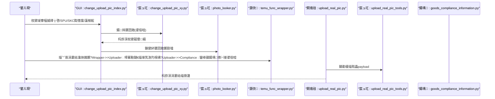
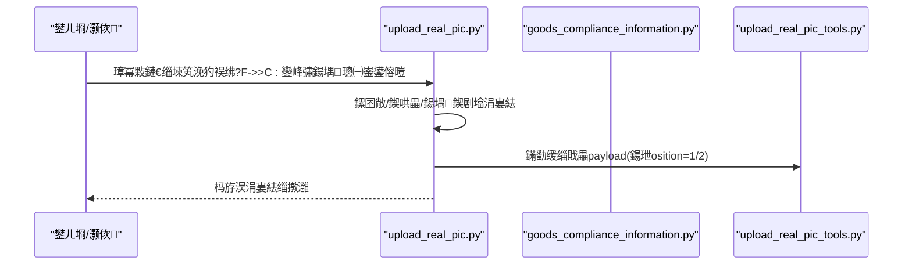

# 瀹炴媿鍥句綅缃祴璇?
<cite>
**鏈枃寮曠敤鐨勬枃浠?*
- [upload_real_pic.py](file://temu_modules/temu_function/upload_real_pic.py)
- [upload_real_pic_tools.py](file://temu_modules/temu_modules_tools/upload_real_pic_tools.py)
- [goods_compliance_information.py](file://temu_modules/temu_function/goods_compliance_information.py)
- [change_upload_pic_index.py](file://gui/change_upload_pic_index.py)
- [change_upload_pic_xy.py](file://lite_modules/change_upload_pic_xy.py)
- [photo_looker.py](file://lite_modules/photo_looker.py)
- [common_config.py](file://config/common_config.py)
- [upload_pic_check.json](file://閰嶇疆鏂囦欢_瀹炴媿鍥鹃厤缃?upload_pic_check.json)
- [sku.json](file://閰嶇疆鏂囦欢_瀹炴媿鍥鹃厤缃?sku.json)
- [璇存槑.txt](file://閰嶇疆鏂囦欢_瀹炴媿鍥鹃厤缃?fixed_upload_img/璇存槑.txt)
- [temu_func_wrapper.py](file://temu_modules/temu_func_wrapper.py)
</cite>

## 鐩綍
1. [绠€浠媇(#绠€浠?
2. [椤圭洰缁撴瀯](#椤圭洰缁撴瀯)
3. [鏍稿績缁勪欢](#鏍稿績缁勪欢)
4. [鏋舵瀯鎬昏](#鏋舵瀯鎬昏)
5. [璇︾粏缁勪欢鍒嗘瀽](#璇︾粏缁勪欢鍒嗘瀽)
6. [渚濊禆鍒嗘瀽](#渚濊禆鍒嗘瀽)
7. [鎬ц兘鑰冭檻](#鎬ц兘鑰冭檻)
8. [鏁呴殰鎺掓煡鎸囧崡](#鏁呴殰鎺掓煡鎸囧崡)
9. [缁撹](#缁撹)
10. [闄勫綍](#闄勫綍)

## 绠€浠?鏈枃浠堕潰鍚戔€滃疄鎷嶅浘浣嶇疆娴嬭瘯鈥濆姛鑳斤紝鍥寸粫瀹炴媿鍥炬爣娉ㄦ祴璇曞伐鍏风殑璁捐鐩殑銆佷娇鐢ㄥ満鏅€佺晫闈㈡搷浣滄祦绋嬨€佸姛鑳界壒鎬с€佸浘鐗囦笂浼犱笌鏍囨敞缁樺埗銆佸潗鏍囪褰曘€佸弬鏁伴厤缃€佹祴璇曠粨鏋滀繚瀛樹笌瀵煎嚭銆佷笂浼犲墠棰勬涓庨獙璇併€佷笌Temu骞冲彴瀹炴媿鍥句笂浼犲姛鑳界殑闆嗘垚鍏崇郴锛屼互鍙婂父瑙侀棶棰樹笌瑙ｅ喅鏂规杩涜鍏ㄩ潰璇存槑銆傛枃妗ｅ悓鏃舵彁渚涘彲瑙嗗寲鏋舵瀯涓庢祦绋嬪浘锛屽府鍔╅潪鎶€鏈鑰呯悊瑙ｆ暣浣撳伐浣滄祦銆?
## 椤圭洰缁撴瀯
瀹炴媿鍥句綅缃祴璇曟秹鍙婁笁灞傦細GUI浜や簰灞傘€佹爣娉ㄤ笌涓婁紶宸ュ叿灞傘€乀emu骞冲彴鎺ュ彛灞傘€傛牳蹇冩枃浠跺垎甯冨涓嬶細
- GUI灞傦細鎻愪緵瀹炴媿鍥炬爣娉ㄦ祴璇曠晫闈紝鏀寔鍧愭爣杈撳叆銆佷繚瀛樸€佸惎鍔ㄦ爣娉ㄤ笌棰勮銆?- 宸ュ叿灞傦細璐熻矗鍥剧墖楠岃瘉銆佹爣娉ㄧ粯鍒躲€佽緭鍑虹粨鏋滃睍绀恒€?- 骞冲彴灞傦細瀵规帴Temu瀹炴媿鍥句笂浼犳帴鍙ｏ紝瀹屾垚绛惧悕鑾峰彇銆佸浘鐗囦笂浼犮€佺粦瀹氬疄鎷嶅浘绛夈€?
```mermaid
graph TB
subgraph "GUI灞?
GUI_Index["GUI: change_upload_pic_index.py"]
Photo_Looker["宸ュ叿: photo_looker.py"]
end
subgraph "宸ュ叿灞?
XY_Tool["宸ュ叿: change_upload_pic_xy.py"]
Upload_Tools["宸ュ叿: upload_real_pic_tools.py"]
end
subgraph "骞冲彴灞?
RealPic["鍔熻兘: upload_real_pic.py"]
Compliance["鍚堣: goods_compliance_information.py"]
Wrapper["灏佽: temu_func_wrapper.py"]
end
subgraph "閰嶇疆"
SKU_JSON["閰嶇疆: sku.json"]
CHECK_JSON["閰嶇疆: upload_pic_check.json"]
FIXED_IMG["鍥哄畾涓婁紶: fixed_upload_img/璇存槑.txt"]
end
GUI_Index --> XY_Tool
GUI_Index --> Photo_Looker
XY_Tool --> UPLOAD_PATH["杈撳嚭: PS鍚巁搴楅摵/SPU.png"]
RealPic --> Upload_Tools
RealPic --> Compliance
Wrapper --> RealPic
XY_Tool --- SKU_JSON
RealPic --- CHECK_JSON
RealPic --- FIXED_IMG
```

**鍥捐〃鏉ユ簮**
- [change_upload_pic_index.py:1-258](file://gui/change_upload_pic_index.py#L1-L258)
- [change_upload_pic_xy.py:1-221](file://lite_modules/change_upload_pic_xy.py#L1-L221)
- [photo_looker.py:1-68](file://lite_modules/photo_looker.py#L1-L68)
- [upload_real_pic.py:1-1148](file://temu_modules/temu_function/upload_real_pic.py#L1-L1148)
- [upload_real_pic_tools.py:1-187](file://temu_modules/temu_modules_tools/upload_real_pic_tools.py#L1-L187)
- [goods_compliance_information.py:1-293](file://temu_modules/temu_function/goods_compliance_information.py#L1-L293)
- [sku.json:1-338](file://閰嶇疆鏂囦欢_瀹炴媿鍥鹃厤缃?sku.json#L1-L338)
- [upload_pic_check.json:1-48](file://閰嶇疆鏂囦欢_瀹炴媿鍥鹃厤缃?upload_pic_check.json#L1-L48)
- [璇存槑.txt:1-1](file://閰嶇疆鏂囦欢_瀹炴媿鍥鹃厤缃?fixed_upload_img/璇存槑.txt#L1-L1)
- [temu_func_wrapper.py:72-95](file://temu_modules/temu_func_wrapper.py#L72-L95)

**绔犺妭鏉ユ簮**
- [change_upload_pic_index.py:1-258](file://gui/change_upload_pic_index.py#L1-L258)
- [change_upload_pic_xy.py:1-221](file://lite_modules/change_upload_pic_xy.py#L1-L221)
- [photo_looker.py:1-68](file://lite_modules/photo_looker.py#L1-L68)
- [upload_real_pic.py:1-1148](file://temu_modules/temu_function/upload_real_pic.py#L1-L1148)
- [upload_real_pic_tools.py:1-187](file://temu_modules/temu_modules_tools/upload_real_pic_tools.py#L1-L187)
- [goods_compliance_information.py:1-293](file://temu_modules/temu_function/goods_compliance_information.py#L1-L293)
- [sku.json:1-338](file://閰嶇疆鏂囦欢_瀹炴媿鍥鹃厤缃?sku.json#L1-L338)
- [upload_pic_check.json:1-48](file://閰嶇疆鏂囦欢_瀹炴媿鍥鹃厤缃?upload_pic_check.json#L1-L48)
- [璇存槑.txt:1-1](file://閰嶇疆鏂囦欢_瀹炴媿鍥鹃厤缃?fixed_upload_img/璇存槑.txt#L1-L1)
- [temu_func_wrapper.py:72-95](file://temu_modules/temu_func_wrapper.py#L72-L95)

## 鏍稿績缁勪欢
- GUI鏍囨敞娴嬭瘯鐣岄潰锛氭彁渚涘簵閾虹缉鍐欍€丼PU銆丼KC ID銆乆/Y鍧愭爣銆佸瓧浣撳ぇ灏忚緭鍏ワ紝鏀寔淇濆瓨涓庡惎鍔ㄦ爣娉ㄣ€?- 鏍囨敞缁樺埗宸ュ叿锛氭牴鎹畇ku.json閰嶇疆瀹氫綅鏍囨敞浣嶇疆锛屽搴曞浘杩涜鍧愭爣鏍囨敞骞惰緭鍑篜NG銆?- 鍥剧墖棰勮宸ュ叿锛氭墦寮€骞剁缉鏀炬樉绀烘爣娉ㄥ悗鐨勫浘鐗囥€?- 瀹炴媿鍥句笂浼犲伐鍏凤細璐熻矗绛惧悕鑾峰彇銆佸浘鐗囦笂浼犮€佹瀯寤虹粦瀹歱ayload銆佽皟鐢ㄤ笂浼犳帴鍙ｃ€?- 閰嶇疆鏂囦欢锛歶pload_pic_check.json瀹氫箟寮傚父绫诲瀷涓庡搴旀爣绛惧浘锛泂ku.json瀹氫箟鍚勫簵閾虹缉鍐欏潗鏍囦笌瀛椾綋锛沠ixed_upload_img鐩綍鐢ㄤ簬鍥哄畾涓婁紶鍥剧墖銆?
**绔犺妭鏉ユ簮**
- [change_upload_pic_index.py:1-258](file://gui/change_upload_pic_index.py#L1-L258)
- [change_upload_pic_xy.py:1-221](file://lite_modules/change_upload_pic_xy.py#L1-L221)
- [photo_looker.py:1-68](file://lite_modules/photo_looker.py#L1-L68)
- [upload_real_pic.py:1-1148](file://temu_modules/temu_function/upload_real_pic.py#L1-L1148)
- [upload_pic_check.json:1-48](file://閰嶇疆鏂囦欢_瀹炴媿鍥鹃厤缃?upload_pic_check.json#L1-L48)
- [sku.json:1-338](file://閰嶇疆鏂囦欢_瀹炴媿鍥鹃厤缃?sku.json#L1-L338)
- [璇存槑.txt:1-1](file://閰嶇疆鏂囦欢_瀹炴媿鍥鹃厤缃?fixed_upload_img/璇存槑.txt#L1-L1)

## 鏋舵瀯鎬昏
瀹炴媿鍥句綅缃祴璇曠殑绔埌绔祦绋嬪寘鎷細GUI杈撳叆鍙傛暟涓庤Е鍙戙€佹爣娉ㄧ粯鍒朵笌棰勮銆佷笂浼犲疄鎷嶅浘鍒癟emu骞冲彴銆佺粨鏋滆褰曚笌瀵煎嚭銆備笅鍥惧睍绀轰簡鍏抽敭妯″潡闂寸殑璋冪敤鍏崇郴锛?


**鍥捐〃鏉ユ簮**
- [change_upload_pic_index.py:184-224](file://gui/change_upload_pic_index.py#L184-L224)
- [change_upload_pic_xy.py:118-204](file://lite_modules/change_upload_pic_xy.py#L118-L204)
- [photo_looker.py:28-59](file://lite_modules/photo_looker.py#L28-L59)
- [temu_func_wrapper.py:72-95](file://temu_modules/temu_func_wrapper.py#L72-L95)
- [upload_real_pic.py:918-1148](file://temu_modules/temu_function/upload_real_pic.py#L918-L1148)
- [upload_real_pic_tools.py:85-127](file://temu_modules/temu_modules_tools/upload_real_pic_tools.py#L85-L127)
- [goods_compliance_information.py:10-51](file://temu_modules/temu_function/goods_compliance_information.py#L10-L51)

## 璇︾粏缁勪欢鍒嗘瀽

### GUI鏍囨敞娴嬭瘯鐣岄潰
- 鍔熻兘鐗规€?  - 搴楅摵缂╁啓杈撳叆鑱斿姩锛氭牴鎹緭鍏ヤ粠sku.json鍔犺浇瀵瑰簲鍧愭爣涓庡瓧浣撱€?  - 淇濆瓨鍧愭爣锛氬皢X/Y鍧愭爣涓庡瓧浣撳ぇ灏忓啓鍥瀞ku.json銆?  - 鍚姩鏍囨敞锛氳皟鐢ㄦ爣娉ㄥ伐鍏风敓鎴怭S鍚巁搴楅摵/SPU.png骞惰嚜鍔ㄦ墦寮€棰勮銆?- 鍙傛暟閰嶇疆
  - 杈撳叆椤癸細搴楅摵缂╁啓銆佷繚瀛樼殑鏂囦欢鍚嶏紙SPU锛夈€丼KC ID銆乆鍧愭爣銆乊鍧愭爣銆佸瓧浣撳ぇ灏忋€?  - 渚濊禆锛歴ku.json銆乧hange_upload_pic_xy.py銆乸hoto_looker.py銆?- 鐣岄潰鎿嶄綔娴佺▼
  1) 杈撳叆搴楅摵缂╁啓锛岃嚜鍔ㄥ～鍏匵/Y涓庡瓧浣撱€?  2) 淇敼鍧愭爣鎴栧瓧浣撳悗鐐瑰嚮鈥滀繚瀛樷€濓紝鍐欏洖閰嶇疆銆?  3) 杈撳叆SPU涓嶴KC ID鍚庣偣鍑烩€滃惎鍔ㄢ€濓紝鐢熸垚鏍囨敞鍥惧苟寮圭獥棰勮銆?
```mermaid
flowchart TD
Start(["杩涘叆鐣岄潰"]) --> InputShop["杈撳叆搴楅摵缂╁啓"]
InputShop --> LoadCfg["浠巗ku.json鍔犺浇鍧愭爣/瀛椾綋"]
LoadCfg --> SaveBtn{"鐐瑰嚮淇濆瓨锛?}
SaveBtn --> |鏄瘄 WriteCfg["鍐欏洖sku.json"]
SaveBtn --> |鍚 StartOp["鍑嗗鍚姩鏍囨敞"]
WriteCfg --> StartOp
StartOp --> InputParams["杈撳叆SPU/SKC鍧愭爣/瀛椾綋"]
InputParams --> Launch["鐐瑰嚮鍚姩"]
Launch --> Draw["璋冪敤鏍囨敞宸ュ叿鐢熸垚鍥剧墖"]
Draw --> Preview["鎵撳紑棰勮绐楀彛"]
Preview --> End(["缁撴潫"])
```

**鍥捐〃鏉ユ簮**
- [change_upload_pic_index.py:118-224](file://gui/change_upload_pic_index.py#L118-L224)
- [sku.json:1-338](file://閰嶇疆鏂囦欢_瀹炴媿鍥鹃厤缃?sku.json#L1-L338)
- [change_upload_pic_xy.py:118-204](file://lite_modules/change_upload_pic_xy.py#L118-L204)
- [photo_looker.py:28-59](file://lite_modules/photo_looker.py#L28-L59)

**绔犺妭鏉ユ簮**
- [change_upload_pic_index.py:1-258](file://gui/change_upload_pic_index.py#L1-L258)
- [sku.json:1-338](file://閰嶇疆鏂囦欢_瀹炴媿鍥鹃厤缃?sku.json#L1-L338)
- [photo_looker.py:1-68](file://lite_modules/photo_looker.py#L1-L68)

### 鏍囨敞缁樺埗涓庡潗鏍囪褰?- 鍥剧墖楠岃瘉涓庝慨澶?  - 鏀寔澶氱鍥剧墖鏍煎紡锛岃嚜鍔ㄨ浆鎹负JPG骞朵慨澶嶆崯鍧忓浘鐗囥€?  - 浣跨敤缁濆璺緞瀹氫綅閰嶇疆鐩綍涓庡簳鍥撅紝鎻愬崌绋冲畾鎬с€?- 鏍囨敞缁樺埗
  - 浠巗ku.json璇诲彇鐩爣搴楅摵缂╁啓瀵瑰簲鐨刋/Y鍧愭爣涓庡瓧浣撳ぇ灏忋€?  - 鍦ㄥ簳鍥句笂缁樺埗SKC ID鏂囨湰锛岃緭鍑篜NG鑷砅S鍚巁搴楅摵/SPU.png銆?- 鍧愭爣璁板綍
  - 閫氳繃GUI鐣岄潰淇濆瓨X/Y涓庡瓧浣撳ぇ灏忓埌sku.json锛屼究浜庡悗缁壒閲忔祴璇曘€?
```mermaid
flowchart TD
A["杈撳叆: 搴楅摵缂╁啓/SPU/SKC/JSON閰嶇疆"] --> B["鍔犺浇sku.json鏄犲皠"]
B --> C{"鎵惧埌閰嶇疆锛?}
C --> |鍚 E["鎶ラ敊骞惰繑鍥?]
C --> |鏄瘄 D["瀹氫綅搴曞浘(缁濆璺緞)"]
D --> F["楠岃瘉骞朵慨澶嶅浘鐗?JPG)"]
F --> G["缁樺埗鏂囨湰(鍧愭爣/瀛椾綋)"]
G --> H["淇濆瓨PNG鑷砅S鍚巁搴楅摵/SPU.png"]
H --> I["杩斿洖杈撳嚭璺緞"]
```

**鍥捐〃鏉ユ簮**
- [change_upload_pic_xy.py:118-204](file://lite_modules/change_upload_pic_xy.py#L118-L204)
- [sku.json:1-338](file://閰嶇疆鏂囦欢_瀹炴媿鍥鹃厤缃?sku.json#L1-L338)

**绔犺妭鏉ユ簮**
- [change_upload_pic_xy.py:1-221](file://lite_modules/change_upload_pic_xy.py#L1-L221)
- [sku.json:1-338](file://閰嶇疆鏂囦欢_瀹炴媿鍥鹃厤缃?sku.json#L1-L338)

### 瀹炴媿鍥句笂浼犱笌缁戝畾
- 涓婁紶娴佺▼
  - 鑾峰彇涓婁紶绛惧悕 -> 涓婁紶鍥剧墖 -> 鏋勫缓缁戝畾payload -> 璋冪敤涓婁紶鎺ュ彛銆?  - 鏀寔寮傚父绫诲瀷鏄犲皠锛氭牴鎹畊pload_pic_check.json灏嗗紓甯哥被鍨嬫槧灏勫埌鏍囩鍥俱€?  - 鏀寔鍥哄畾涓婁紶鍥剧墖锛氬嬀閫夊悗涓婁紶fixed_upload_img鐩綍涓嬬殑鍥剧墖銆?- 缁戝畾payload
  - 寮哄埗position=1涓巔osition=2鍧囬渶鑷冲皯涓€寮犲浘锛屾寜SKU缁村害鏋勯€犮€?- 缁撴灉璁板綍
  - 鍙€夎褰曟垚鍔烻PU鍒楄〃鍒版暟鎹簱锛屾敮鎸佸幓閲嶄笌鎺掑簭銆?


**鍥捐〃鏉ユ簮**
- [upload_real_pic.py:918-1148](file://temu_modules/temu_function/upload_real_pic.py#L918-L1148)
- [goods_compliance_information.py:10-51](file://temu_modules/temu_function/goods_compliance_information.py#L10-L51)
- [upload_real_pic_tools.py:85-127](file://temu_modules/temu_modules_tools/upload_real_pic_tools.py#L85-L127)

**绔犺妭鏉ユ簮**
- [upload_real_pic.py:1-1148](file://temu_modules/temu_function/upload_real_pic.py#L1-L1148)
- [upload_real_pic_tools.py:1-187](file://temu_modules/temu_modules_tools/upload_real_pic_tools.py#L1-L187)
- [goods_compliance_information.py:1-293](file://temu_modules/temu_function/goods_compliance_information.py#L1-L293)
- [upload_pic_check.json:1-48](file://閰嶇疆鏂囦欢_瀹炴媿鍥鹃厤缃?upload_pic_check.json#L1-L48)
- [璇存槑.txt:1-1](file://閰嶇疆鏂囦欢_瀹炴媿鍥鹃厤缃?fixed_upload_img/璇存槑.txt#L1-L1)

### 鍥剧墖棰勮涓庡睍绀?- 鍔熻兘锛氭墦寮€骞剁缉鏀炬樉绀烘爣娉ㄥ悗鐨勫浘鐗囷紝鏀寔瀹屾暣鎬ф牎楠屻€?- 鐢ㄩ€旓細鏍囨敞瀹屾垚鍚庡揩閫熸牳瀵瑰潗鏍囦笌瀛椾綋鏄惁绗﹀悎棰勬湡銆?
**绔犺妭鏉ユ簮**
- [photo_looker.py:1-68](file://lite_modules/photo_looker.py#L1-L68)

## 渚濊禆鍒嗘瀽
- 閰嶇疆鏂囦欢渚濊禆
  - upload_pic_check.json锛氬紓甯哥被鍨嬪埌鏍囩鍥剧殑鏄犲皠銆?  - sku.json锛氬悇搴楅摵缂╁啓鍧愭爣涓庡瓧浣撻厤缃€?  - fixed_upload_img锛氬浐瀹氫笂浼犲浘鐗囩洰褰曡鏄庛€?- 杩愯鏃朵緷璧?  - 绾跨▼骞跺彂锛歝ommon_config.py涓璾pload_real_pic_concurrent鎺у埗骞跺彂搴︺€?  - 鏁版嵁搴擄細璁板綍鎴愬姛SPU鍒楄〃锛屾敮鎸乁PSERT涓庢煡璇€?  - 鎺ュ彛锛歍emu瀹炴媿鍥句笂浼犳帴鍙ｃ€佺鍚嶆帴鍙ｃ€佸悎瑙勪俊鎭帴鍙ｃ€?
```mermaid
graph LR
CFG1["upload_pic_check.json"] --> UP["upload_real_pic.py"]
CFG2["sku.json"] --> XY["change_upload_pic_xy.py"]
FIXED["fixed_upload_img/璇存槑.txt"] --> UP
CONC["common_config.py<br/>upload_real_pic_concurrent"] --> UP
DB["鏁版嵁搴撹褰?] --> UP
API1["绛惧悕鎺ュ彛"] --> UP
API2["涓婁紶鎺ュ彛"] --> UP
API3["鍚堣鎺ュ彛"] --> UP
```

**鍥捐〃鏉ユ簮**
- [upload_pic_check.json:1-48](file://閰嶇疆鏂囦欢_瀹炴媿鍥鹃厤缃?upload_pic_check.json#L1-L48)
- [sku.json:1-338](file://閰嶇疆鏂囦欢_瀹炴媿鍥鹃厤缃?sku.json#L1-L338)
- [璇存槑.txt:1-1](file://閰嶇疆鏂囦欢_瀹炴媿鍥鹃厤缃?fixed_upload_img/璇存槑.txt#L1-L1)
- [common_config.py:143-153](file://config/common_config.py#L143-L153)
- [upload_real_pic.py:1-1148](file://temu_modules/temu_function/upload_real_pic.py#L1-L1148)

**绔犺妭鏉ユ簮**
- [common_config.py:143-153](file://config/common_config.py#L143-L153)
- [upload_real_pic.py:1-1148](file://temu_modules/temu_function/upload_real_pic.py#L1-L1148)

## 鎬ц兘鑰冭檻
- 骞跺彂鎺у埗锛氶€氳繃common_config.py涓殑upload_real_pic_concurrent闄愬埗骞跺彂绾跨▼鏁帮紝閬垮厤鎺ュ彛闄愭祦涓庤祫婧愪簤鐢ㄣ€?- 鍒嗛〉涓庡幓閲嶏細鎸夐〉澶勭悊SPU锛岀粨鍚堟暟鎹簱璁板綍閬垮厤閲嶅涓婁紶銆?- 闅忔満浼戠湢锛氱嚎绋嬪唴闅忔満浼戠湢闄嶄綆璇锋眰棰戠巼锛屾彁楂樼ǔ瀹氭€с€?- 鍥剧墖澶勭悊锛歅IL瑙ｅ帇鐐稿脊闃堝€兼彁鍗囷紝鏀寔澶у浘澶勭悊锛涜嚜鍔ㄦ牸寮忎慨澶嶅噺灏戝け璐ラ噸璇曘€?
**绔犺妭鏉ユ簮**
- [common_config.py:143-153](file://config/common_config.py#L143-L153)
- [upload_real_pic.py:612-617](file://temu_modules/temu_function/upload_real_pic.py#L612-L617)
- [change_upload_pic_xy.py:8-9](file://lite_modules/change_upload_pic_xy.py#L8-L9)

## 鏁呴殰鎺掓煡鎸囧崡
- 甯歌闂
  - 搴曞浘鎵句笉鍒帮細妫€鏌ラ厤缃洰褰曚笌鏂囦欢鍚嶏紝纭繚缁濆璺緞鍙敤銆?  - 鍥剧墖鏍煎紡閿欒锛氬伐鍏蜂細鑷姩杞崲涓篔PG锛岃嫢浠嶅け璐ユ鏌ユ枃浠跺畬鏁存€с€?  - 鍧愭爣鏃犳晥锛氱‘璁ku.json涓搴斿簵閾虹缉鍐欑殑X/Y涓庡瓧浣撳ぇ灏忋€?  - 涓婁紶澶辫触锛氭鏌ョ鍚嶆帴鍙ｄ笌涓婁紶鎺ュ彛杩斿洖锛屽叧娉?03/401绛夐壌鏉冮敊璇€?  - 鍥哄畾涓婁紶鍥剧墖鏈敓鏁堬細纭鍕鹃€夆€滆嚜瀹氫箟鍥哄畾涓婁紶鍥剧墖鈥濓紝骞舵鏌ixed_upload_img鐩綍銆?- 瑙ｅ喅鏂规
  - 浣跨敤photo_looker.py棰勮鏍囨敞鍥撅紝纭鍧愭爣涓庡瓧浣撱€?  - 鏌ョ湅鏃ュ織涓巃uto_print_logger杈撳嚭锛屽畾浣嶅叿浣撶幆鑺傘€?  - 濡傞亣鐧诲綍澶辨晥锛岀郴缁熶細鏇存柊杩炴帴鐘舵€侊紝闇€閲嶆柊鐧诲綍鍚庨噸璇曘€?
**绔犺妭鏉ユ簮**
- [change_upload_pic_xy.py:27-64](file://lite_modules/change_upload_pic_xy.py#L27-L64)
- [photo_looker.py:28-49](file://lite_modules/photo_looker.py#L28-L49)
- [upload_real_pic.py:618-638](file://temu_modules/temu_function/upload_real_pic.py#L618-L638)
- [璇存槑.txt:1-1](file://閰嶇疆鏂囦欢_瀹炴媿鍥鹃厤缃?fixed_upload_img/璇存槑.txt#L1-L1)

## 缁撹
瀹炴媿鍥句綅缃祴璇曢€氳繃GUI涓庡伐鍏烽摼鐨勫崗鍚岋紝瀹炵幇浜嗕粠鍧愭爣閰嶇疆銆佹爣娉ㄧ粯鍒躲€佸浘鐗囬瑙堝埌瀹炴媿鍥句笂浼犱笌缁撴灉璁板綍鐨勫畬鏁撮棴鐜€傚叾璁捐寮鸿皟鍙厤缃€с€佸彲楠岃瘉鎬т笌鍙墿灞曟€э紝鏃㈡弧瓒虫棩甯告祴璇曢渶姹傦紝涔熶负鍚庣画鎺ュ叆鏇村寮傚父绫诲瀷涓庡钩鍙版帴鍙ｆ彁渚涗簡鑹ソ鍩虹銆?
## 闄勫綍

### 浣跨敤鍦烘櫙涓庢搷浣滆鐐?- 鍦烘櫙
  - 鏂板簵閾虹缉鍐欎笂绾垮墠鐨勫潗鏍囬獙璇併€?  - 寮傚父绫诲瀷鏍囩鍥剧殑鍑嗙‘鎬ф牳瀵广€?  - 鍥哄畾涓婁紶鍥剧墖鐨勬壒閲忔祴璇曘€?- 鎿嶄綔瑕佺偣
  - 鍏堝湪GUI涓繚瀛樺潗鏍囷紝鍐嶅惎鍔ㄦ爣娉ㄦ牳瀵广€?  - 鏍囨敞瀹屾垚鍚庝娇鐢╬hoto_looker.py纭鏁堟灉銆?  - 涓婁紶鍓嶆鏌pload_pic_check.json涓巉ixed_upload_img閰嶇疆銆?
**绔犺妭鏉ユ簮**
- [change_upload_pic_index.py:150-224](file://gui/change_upload_pic_index.py#L150-L224)
- [photo_looker.py:28-59](file://lite_modules/photo_looker.py#L28-L59)
- [upload_pic_check.json:1-48](file://閰嶇疆鏂囦欢_瀹炴媿鍥鹃厤缃?upload_pic_check.json#L1-L48)
- [璇存槑.txt:1-1](file://閰嶇疆鏂囦欢_瀹炴媿鍥鹃厤缃?fixed_upload_img/璇存槑.txt#L1-L1)

