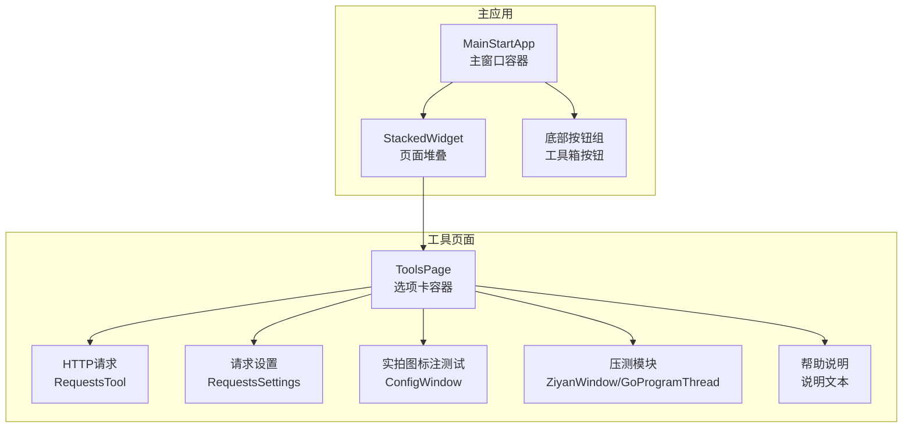
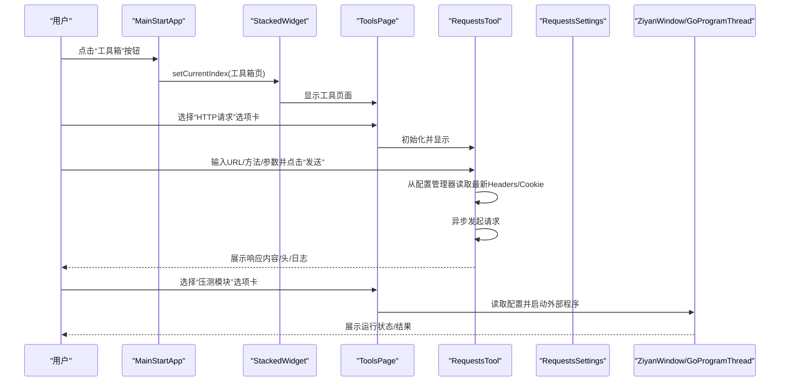
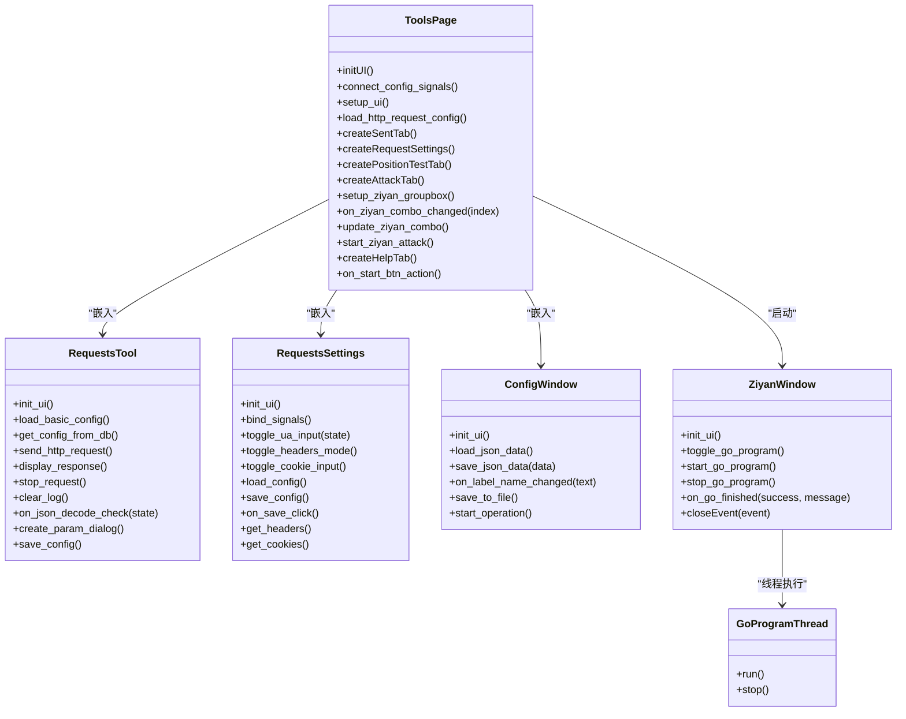
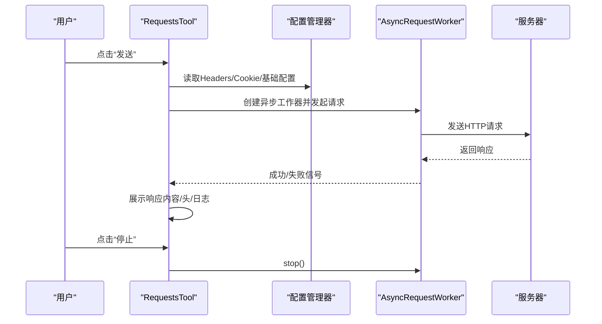
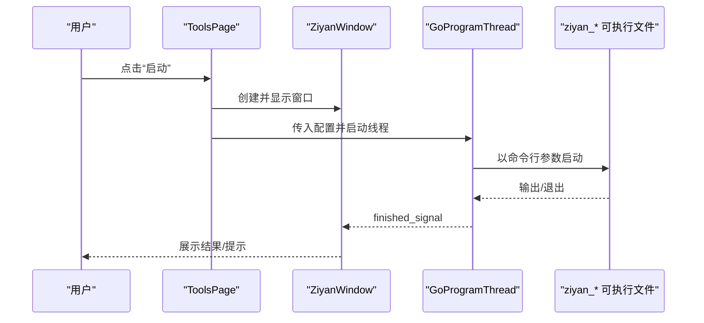
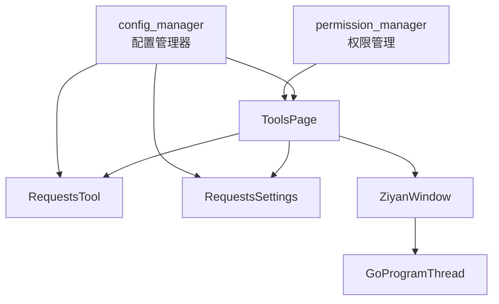
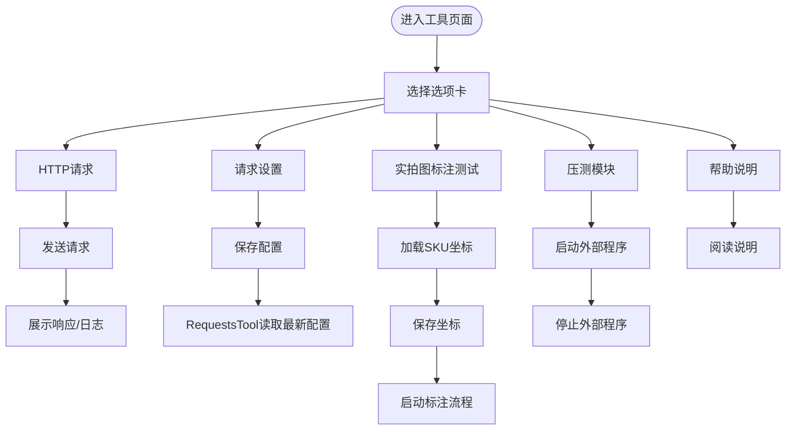

# 工具页面

<cite>
**本文引用的文件**
- [ToolsPage.py](file://gui/ToolsPage.py)
- [RequestsTool.py](file://gui/RequestsTool.py)
- [RequestSettings.py](file://gui/RequestSettings.py)
- [MainApp.py](file://gui/MainApp.py)
- [MainPage.py](file://gui/MainPage.py)
- [GoRun.py](file://gui/GoRun.py)
- [change_upload_pic_index.py](file://gui/change_upload_pic_index.py)
- [common_config.py](file://config/common_config.py)
- [permission_manager.py](file://config/permission_manager.py)
- [LittleTools.py](file://lite_modules/LittleTools.py)
- [main.py](file://main.py)
</cite>

## 目录
1. [简介](#简介)
2. [项目结构](#项目结构)
3. [核心组件](#核心组件)
4. [架构总览](#架构总览)
5. [详细组件分析](#详细组件分析)
6. [依赖关系分析](#依赖关系分析)
7. [性能考量](#性能考量)
8. [故障排查指南](#故障排查指南)
9. [结论](#结论)
10. [附录](#附录)

## 简介
本文件面向 ikun_temu_system 的“工具页面”，系统化梳理工具箱界面的设计与功能集合，解释工具的分类与组织方式，描述页面布局与交互逻辑，详述各工具的功能特点与使用方法，说明工具页面与核心业务的集成关系，给出扩展与自定义机制，以及工具使用统计与历史记录的现状与建议，并提供使用技巧与效率提升建议。

## 项目结构
工具页面位于 GUI 层，作为主应用的一个子页面存在，主要由以下模块构成：
- 工具页面容器：ToolsPage（选项卡式布局，包含 HTTP 请求、请求设置、实拍图标注测试、压测模块、帮助说明）
- HTTP 请求工具：RequestsTool（异步请求、参数编辑、响应展示、配置保存）
- 请求设置组件：RequestsSettings（Headers/Cookie 配置，保存到配置管理器）
- 实拍图标注测试：ConfigWindow（复用组件，支持坐标保存与预览）
- 压测模块：ZiyanWindow + GoProgramThread（外部 Go 程序启动与控制）
- 权限与配置：permission_manager、config_manager、encryptor
- 主应用集成：MainStartApp（将工具页面嵌入主界面）

图表来源
- [MainApp.py:350-490](file://gui/MainApp.py#L350-L490)
- [ToolsPage.py:49-86](file://gui/ToolsPage.py#L49-L86)
- [RequestsTool.py:126-240](file://gui/RequestsTool.py#L126-L240)
- [RequestSettings.py:12-32](file://gui/RequestSettings.py#L12-L32)
- [change_upload_pic_index.py:19-95](file://gui/change_upload_pic_index.py#L19-L95)
- [GoRun.py:92-155](file://gui/GoRun.py#L92-L155)

章节来源
- [MainApp.py:350-490](file://gui/MainApp.py#L350-L490)
- [ToolsPage.py:49-86](file://gui/ToolsPage.py#L49-L86)

## 核心组件
- 工具页面容器（ToolsPage）
  - 选项卡组织：HTTP 请求、请求设置、实拍图标注测试、压测模块、帮助说明
  - 权限控制：根据权限动态显示/启用特定选项卡
  - 配置持久化：使用配置管理器保存/加载工具相关设置
- HTTP 请求工具（RequestsTool）
  - 异步请求：基于 aiohttp，支持 GET/POST/PUT/DELETE
  - 参数编辑：参数对话框，支持 JSON/表单两种格式
  - 响应展示：响应内容、响应头、日志输出
  - 配置保存：将基础请求配置与请求设置同步保存
- 请求设置组件（RequestsSettings）
  - Headers 配置：默认模式与自定义模式，支持 Content-Type、User-Agent
  - Cookie 配置：不使用/自定义两种模式
  - 配置保存：保存到配置管理器
- 实拍图标注测试（ConfigWindow）
  - 输入：店铺缩写、产品 ID、SKC ID、X/Y 坐标、字体大小
  - 功能：加载 SKU 坐标、保存坐标、启动标注流程并预览
- 压测模块（ZiyanWindow + GoProgramThread）
  - 外部程序：gui/Go 下的 ziyan_* 可执行文件
  - 控制：启动/停止、控制台模式、代理模式、连接模式等
  - 线程：后台线程执行外部程序，主线程接收结果

章节来源
- [ToolsPage.py:25-86](file://gui/ToolsPage.py#L25-L86)
- [RequestsTool.py:126-240](file://gui/RequestsTool.py#L126-L240)
- [RequestSettings.py:12-32](file://gui/RequestSettings.py#L12-L32)
- [change_upload_pic_index.py:19-95](file://gui/change_upload_pic_index.py#L19-L95)
- [GoRun.py:92-155](file://gui/GoRun.py#L92-L155)

## 架构总览
工具页面与主应用通过堆叠窗口集成，底部按钮组切换页面。工具页面内部采用选项卡组织，每个选项卡承载一个功能域组件。配置管理器贯穿工具页面与请求设置组件，实现跨组件的配置共享与持久化。

图表来源
- [MainApp.py:416-487](file://gui/MainApp.py#L416-L487)
- [ToolsPage.py:214-225](file://gui/ToolsPage.py#L214-L225)
- [RequestsTool.py:318-396](file://gui/RequestsTool.py#L318-L396)
- [GoRun.py:125-154](file://gui/GoRun.py#L125-L154)

## 详细组件分析

### 工具页面（ToolsPage）
- 布局与交互
  - 顶部选项卡：HTTP 请求、请求设置、实拍图标注测试、压测模块、帮助说明
  - 权限控制：仅当具备“temu”权限时显示“实拍图标注测试”选项卡
  - 配置持久化：使用配置管理器保存压测相关设置
  - 延迟加载：HTTP 请求配置在 UI 初始化后延迟加载
- 选项卡组织
  - HTTP 请求：嵌入 RequestsTool
  - 请求设置：嵌入 RequestsSettings
  - 实拍图标注测试：嵌入 ConfigWindow（复用组件）
  - 压测模块：自研混合压力测试模型，启动外部 Go 程序
  - 帮助说明：内置说明文本
- 信号与配置
  - 连接控件信号到配置更新函数
  - 从配置管理器加载设置到 UI

图表来源
- [ToolsPage.py:25-576](file://gui/ToolsPage.py#L25-L576)
- [RequestsTool.py:126-657](file://gui/RequestsTool.py#L126-L657)
- [RequestSettings.py:12-251](file://gui/RequestSettings.py#L12-L251)
- [change_upload_pic_index.py:19-224](file://gui/change_upload_pic_index.py#L19-L224)
- [GoRun.py:92-244](file://gui/GoRun.py#L92-L244)

章节来源
- [ToolsPage.py:49-86](file://gui/ToolsPage.py#L49-L86)
- [ToolsPage.py:183-225](file://gui/ToolsPage.py#L183-L225)
- [ToolsPage.py:214-225](file://gui/ToolsPage.py#L214-L225)
- [ToolsPage.py:227-366](file://gui/ToolsPage.py#L227-L366)
- [ToolsPage.py:456-508](file://gui/ToolsPage.py#L456-L508)

### HTTP 请求工具（RequestsTool）
- 功能要点
  - 异步请求：基于 aiohttp，自动适配 Content-Type 与参数位置（GET 放查询串，POST/PUT 放 JSON）
  - 参数编辑：对话框支持新增/删除参数行，JSON/表单格式解析
  - 响应展示：三个标签页分别显示响应内容、响应头、日志
  - 配置保存：将基础请求配置与请求设置同步保存到配置管理器
- 交互流程
  - 从配置管理器读取最新 Headers/Cookie
  - 校验 URL 协议，打印请求日志
  - 异步执行请求，处理成功/失败回调
  - 支持停止请求、清空日志、JSON 自动解码

图表来源
- [RequestsTool.py:318-396](file://gui/RequestsTool.py#L318-L396)
- [RequestsTool.py:416-447](file://gui/RequestsTool.py#L416-L447)
- [RequestsTool.py:583-657](file://gui/RequestsTool.py#L583-L657)

章节来源
- [RequestsTool.py:126-240](file://gui/RequestsTool.py#L126-L240)
- [RequestsTool.py:241-317](file://gui/RequestsTool.py#L241-L317)
- [RequestsTool.py:318-396](file://gui/RequestsTool.py#L318-L396)
- [RequestsTool.py:416-447](file://gui/RequestsTool.py#L416-L447)
- [RequestsTool.py:458-471](file://gui/RequestsTool.py#L458-L471)
- [RequestsTool.py:473-581](file://gui/RequestsTool.py#L473-L581)
- [RequestsTool.py:583-657](file://gui/RequestsTool.py#L583-L657)

### 请求设置组件（RequestsSettings）
- 功能要点
  - Headers 模式：默认模式（可自定义 Content-Type/User-Agent）与自定义模式
  - Cookie 模式：不使用/自定义两种
  - 配置保存：保存到配置管理器，供 RequestsTool 读取
- 交互要点
  - 切换模式时动态启用/禁用相应输入框
  - 保存按钮触发配置写入

章节来源
- [RequestSettings.py:12-32](file://gui/RequestSettings.py#L12-L32)
- [RequestSettings.py:33-144](file://gui/RequestSettings.py#L33-L144)
- [RequestSettings.py:146-176](file://gui/RequestSettings.py#L146-L176)
- [RequestSettings.py:177-194](file://gui/RequestSettings.py#L177-L194)
- [RequestSettings.py:196-217](file://gui/RequestSettings.py#L196-L217)
- [RequestSettings.py:219-251](file://gui/RequestSettings.py#L219-L251)

### 实拍图标注测试（ConfigWindow）
- 功能要点
  - 输入：店铺缩写、产品 ID、SKC ID、X/Y 坐标、字体大小
  - 自动加载：根据店铺缩写从 sku.json 加载坐标
  - 保存坐标：更新 sku.json 对应项
  - 启动标注：调用标注主流程并预览结果
- 交互要点
  - 文本变化触发自动加载
  - 保存/启动按钮触发相应动作

章节来源
- [change_upload_pic_index.py:19-95](file://gui/change_upload_pic_index.py#L19-L95)
- [change_upload_pic_index.py:97-144](file://gui/change_upload_pic_index.py#L97-L144)
- [change_upload_pic_index.py:150-182](file://gui/change_upload_pic_index.py#L150-L182)
- [change_upload_pic_index.py:184-224](file://gui/change_upload_pic_index.py#L184-L224)

### 压测模块（ZiyanWindow + GoProgramThread）
- 功能要点
  - 外部程序：gui/Go 下的 ziyan_* 可执行文件
  - 配置映射：将 UI 选项映射为命令行参数
  - 控制台模式：可选择显示控制台输出
  - 线程执行：后台线程启动外部程序，主线程接收结果
- 交互要点
  - 启动/停止按钮切换状态
  - 关闭窗口时根据运行状态弹窗确认或直接终止进程

图表来源
- [ToolsPage.py:456-508](file://gui/ToolsPage.py#L456-L508)
- [GoRun.py:125-154](file://gui/GoRun.py#L125-L154)
- [GoRun.py:198-222](file://gui/GoRun.py#L198-L222)

章节来源
- [ToolsPage.py:227-366](file://gui/ToolsPage.py#L227-L366)
- [ToolsPage.py:368-407](file://gui/ToolsPage.py#L368-L407)
- [ToolsPage.py:408-455](file://gui/ToolsPage.py#L408-L455)
- [GoRun.py:92-155](file://gui/GoRun.py#L92-L155)
- [GoRun.py:156-197](file://gui/GoRun.py#L156-L197)

### 帮助说明（内置说明）
- 内容覆盖：目标 URL、压测模式、并发数、持续时间、无限时间、版本、控制台模式、代理服务、本地代理 IP、云端代理 IP、低伤害模式、连接模式、进程守护等
- 设计：只读文本编辑器，支持自动换行与文本选择

章节来源
- [ToolsPage.py:510-556](file://gui/ToolsPage.py#L510-L556)

## 依赖关系分析
- 权限与配置
  - ToolsPage 读取权限决定是否显示“实拍图标注测试”选项卡
  - RequestsTool 与 RequestsSettings 通过配置管理器共享配置
  - 配置管理器封装 SQLite 持久化
- 主应用集成
  - MainStartApp 将工具页面嵌入堆叠窗口，底部按钮组切换页面
- 外部程序
  - 压测模块依赖 gui/Go 下的外部可执行文件

图表来源
- [permission_manager.py:12-126](file://config/permission_manager.py#L12-L126)
- [common_config.py:344-376](file://config/common_config.py#L344-L376)
- [ToolsPage.py:44-45](file://gui/ToolsPage.py#L44-L45)
- [RequestsTool.py:135-140](file://gui/RequestsTool.py#L135-L140)
- [RequestSettings.py:24-29](file://gui/RequestSettings.py#L24-L29)
- [GoRun.py:12-21](file://gui/GoRun.py#L12-L21)

章节来源
- [permission_manager.py:57-87](file://config/permission_manager.py#L57-L87)
- [common_config.py:344-376](file://config/common_config.py#L344-L376)
- [MainApp.py:350-490](file://gui/MainApp.py#L350-L490)

## 性能考量
- 异步请求：RequestsTool 使用 aiohttp 异步发起请求，避免阻塞 UI，适合高并发场景
- 线程执行：压测模块通过后台线程执行外部程序，主线程负责 UI 更新
- 配置读取：每次请求前从配置管理器读取最新配置，保证一致性
- 资源释放：主应用退出时统一关闭数据库与线程池，避免资源泄露

章节来源
- [RequestsTool.py:318-396](file://gui/RequestsTool.py#L318-L396)
- [GoRun.py:125-154](file://gui/GoRun.py#L125-L154)
- [MainApp.py:185-280](file://gui/MainApp.py#L185-L280)

## 故障排查指南
- HTTP 请求失败
  - 检查 URL 协议与网络连通性
  - 查看日志输出与响应头
  - 确认 Headers/Cookie 配置是否正确
- 压测模块无法启动
  - 确认 gui/Go 下存在 ziyan_* 可执行文件
  - 检查权限与控制台模式设置
  - 查看外部程序输出与返回码
- 配置未生效
  - 确认配置管理器是否成功保存
  - 重启工具页面或延迟加载逻辑是否执行

章节来源
- [RequestsTool.py:407-414](file://gui/RequestsTool.py#L407-L414)
- [GoRun.py:198-222](file://gui/GoRun.py#L198-L222)
- [ToolsPage.py:151-182](file://gui/ToolsPage.py#L151-L182)

## 结论
工具页面以选项卡形式组织多种实用工具，涵盖 HTTP 请求、请求设置、实拍图标注测试、压测模块与帮助说明。通过配置管理器实现跨组件配置共享，结合权限控制与外部程序集成，形成完整的工具生态。建议在后续迭代中完善使用统计与历史记录功能，并进一步优化配置加载与错误提示体验。

## 附录

### 工具页面布局与交互流程（流程图）

图表来源
- [ToolsPage.py:49-86](file://gui/ToolsPage.py#L49-L86)
- [RequestsTool.py:318-396](file://gui/RequestsTool.py#L318-L396)
- [RequestSettings.py:196-217](file://gui/RequestSettings.py#L196-L217)
- [change_upload_pic_index.py:150-182](file://gui/change_upload_pic_index.py#L150-L182)
- [GoRun.py:125-154](file://gui/GoRun.py#L125-L154)

### 工具页面与核心业务的集成关系
- 主应用集成：工具页面作为主应用的一个页面存在，通过底部按钮组切换
- 权限集成：根据权限动态显示/启用特定工具
- 配置集成：统一通过配置管理器持久化与共享

章节来源
- [MainApp.py:350-490](file://gui/MainApp.py#L350-L490)
- [permission_manager.py:57-87](file://config/permission_manager.py#L57-L87)
- [common_config.py:344-376](file://config/common_config.py#L344-L376)

### 工具页面的扩展机制与自定义
- 新增选项卡：在 ToolsPage 中新增 createXxxTab 方法并添加到 tab_widget
- 新增组件：在 RequestsTool/RequestsSettings 基础上扩展功能
- 配置扩展：通过配置管理器新增键值对，组件中读取与保存
- 外部程序：在 gui/Go 下新增可执行文件，ToolsPage 中自动发现并排序

章节来源
- [ToolsPage.py:183-225](file://gui/ToolsPage.py#L183-L225)
- [ToolsPage.py:295-326](file://gui/ToolsPage.py#L295-L326)
- [ToolsPage.py:408-455](file://gui/ToolsPage.py#L408-L455)

### 工具使用统计与历史记录
- 现状：工具页面未内置使用统计与历史记录功能
- 建议：可在配置管理器中新增统计表，记录工具使用次数、最近使用时间、常用参数等；在 UI 中增加“历史记录”选项卡展示

章节来源
- [common_config.py:344-376](file://config/common_config.py#L344-L376)

### 工具页面使用技巧与效率提升
- HTTP 请求
  - 使用“自动解码JSON”快速查看结构化响应
  - 通过“保存配置”将常用请求参数与 Headers/Cookie 保存，减少重复输入
  - 使用参数对话框批量管理复杂参数
- 压测模块
  - 根据硬件配置选择合适并发数与模式
  - 启用控制台模式便于观察实时状态
  - 使用“无限时间”进行长时间稳定性测试
- 实拍图标注测试
  - 先加载 SKU 坐标，再进行保存与启动，提高效率
  - 使用预览功能快速验证标注准确性

章节来源
- [RequestsTool.py:200-204](file://gui/RequestsTool.py#L200-L204)
- [RequestsTool.py:583-657](file://gui/RequestsTool.py#L583-L657)
- [ToolsPage.py:456-508](file://gui/ToolsPage.py#L456-L508)
- [change_upload_pic_index.py:184-224](file://gui/change_upload_pic_index.py#L184-L224)