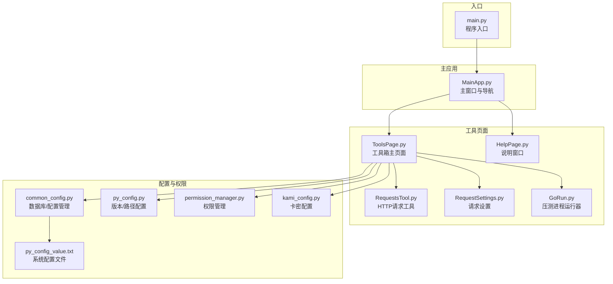
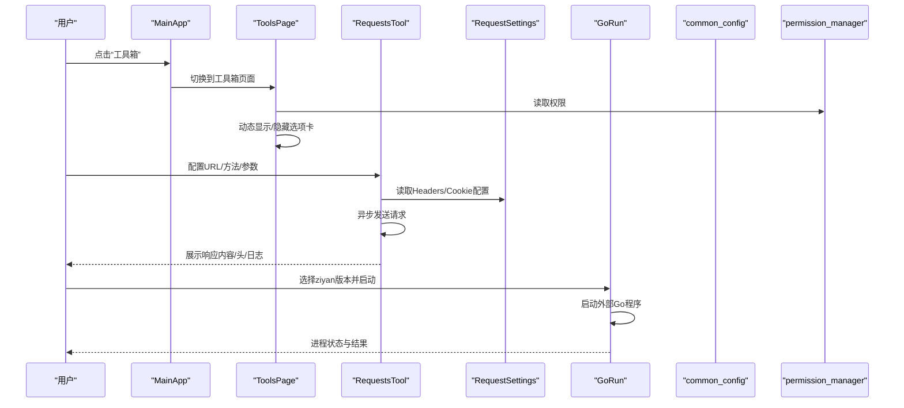
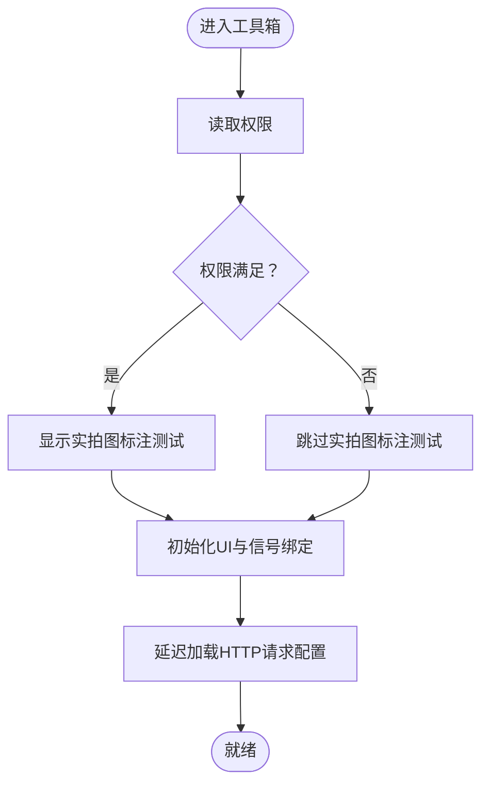
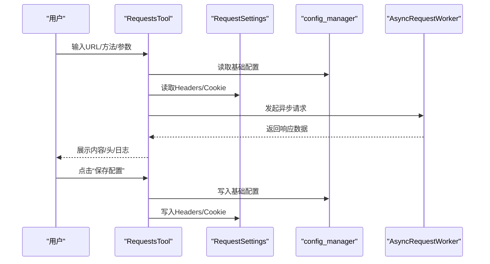
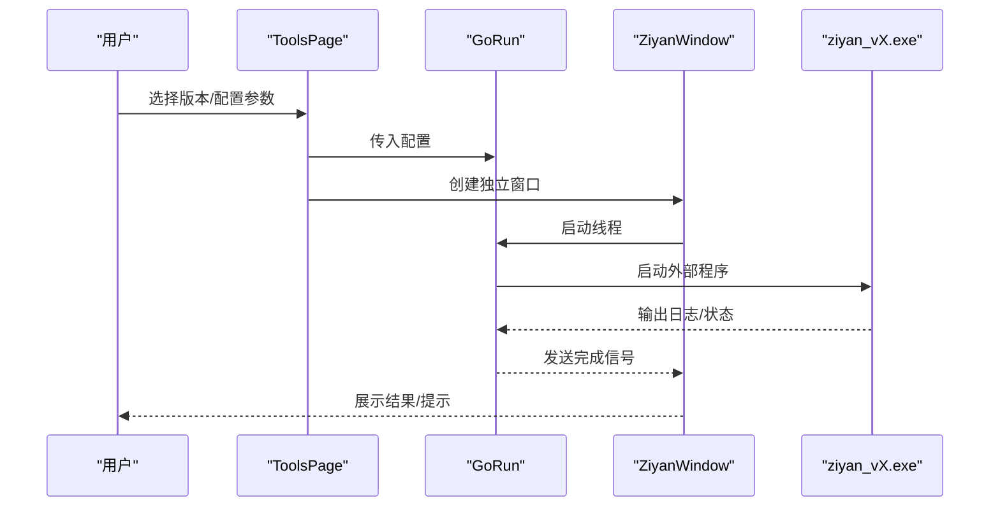
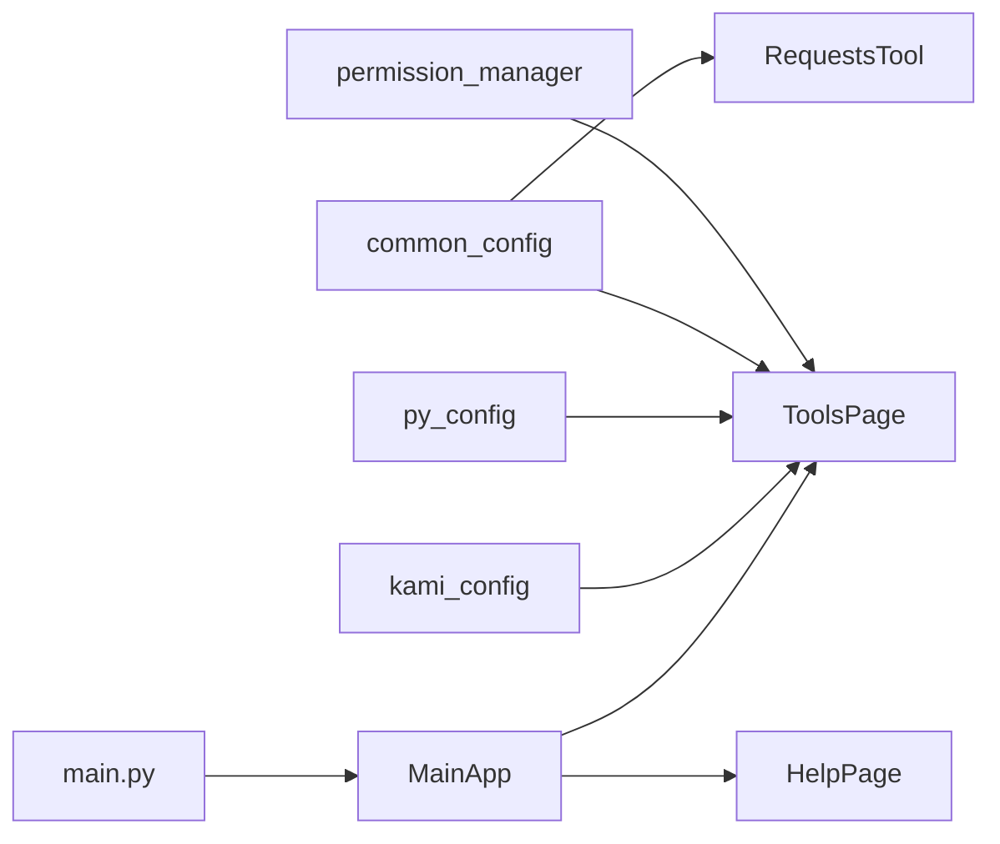

# 帮助文档

<cite>
**本文引用的文件**
- [HelpPage.py](file://gui/HelpPage.py)
- [ToolsPage.py](file://gui/ToolsPage.py)
- [RequestsTool.py](file://gui/RequestsTool.py)
- [RequestSettings.py](file://gui/RequestSettings.py)
- [GoRun.py](file://gui/GoRun.py)
- [MainApp.py](file://gui/MainApp.py)
- [main.py](file://main.py)
- [common_config.py](file://config/common_config.py)
- [py_config.py](file://config/py_config.py)
- [permission_manager.py](file://config/permission_manager.py)
- [kami_config.py](file://config/kami_config.py)
- [py_config_value.txt](file://配置文件_系统配置/py_config_value.txt)
</cite>

## 目录
1. [简介](#简介)
2. [项目结构](#项目结构)
3. [核心组件](#核心组件)
4. [架构总览](#架构总览)
5. [详细组件分析](#详细组件分析)
6. [依赖分析](#依赖分析)
7. [性能考虑](#性能考虑)
8. [故障排除指南](#故障排除指南)
9. [结论](#结论)
10. [附录](#附录)

## 简介
本帮助文档面向工具页面的使用者与维护者，系统性说明工具页面的界面布局、导航方式、功能组织、使用流程、注意事项与安全提醒、常见问题与故障排除、版本信息与更新机制、技术支持与反馈渠道，以及最佳实践与扩展定制建议。文档基于仓库中的 GUI 与配置模块进行梳理，确保信息准确可追溯。

## 项目结构
工具页面位于 GUI 层，围绕“工具箱”“HTTP 请求工具”“请求设置”“压测模块”“说明”等选项卡展开，配合主应用窗口的导航按钮与数据库配置管理器实现权限控制与持久化配置。

图表来源
- [MainApp.py:312-640](file://gui/MainApp.py#L312-L640)
- [ToolsPage.py:25-86](file://gui/ToolsPage.py#L25-L86)
- [HelpPage.py:72-121](file://gui/HelpPage.py#L72-L121)
- [RequestsTool.py:126-240](file://gui/RequestsTool.py#L126-L240)
- [RequestSettings.py:12-32](file://gui/RequestSettings.py#L12-L32)
- [GoRun.py:92-155](file://gui/GoRun.py#L92-L155)
- [common_config.py:197-334](file://config/common_config.py#L197-L334)
- [py_config.py:4-31](file://config/py_config.py#L4-L31)
- [permission_manager.py:12-88](file://config/permission_manager.py#L12-L88)
- [kami_config.py:6-56](file://config/kami_config.py#L6-L56)
- [py_config_value.txt:1-4](file://配置文件_系统配置/py_config_value.txt#L1-L4)

章节来源
- [MainApp.py:312-640](file://gui/MainApp.py#L312-L640)
- [ToolsPage.py:25-86](file://gui/ToolsPage.py#L25-L86)

## 核心组件
- 工具箱主页面（ToolsPage）：承载 HTTP 请求工具、请求设置、实拍图标注测试、压测模块、说明等选项卡，依据权限动态显示/隐藏功能。
- HTTP 请求工具（RequestsTool）：提供异步发送 HTTP 请求的能力，支持 GET/POST/PUT/DELETE，参数可 JSON 或表单格式，支持自动解码 JSON 响应。
- 请求设置（RequestSettings）：集中管理 Headers 与 Cookie 的配置，支持默认模式与自定义模式，便于跨请求复用。
- 压测模块（GoRun + ToolsPage）：通过下拉选择“ziyan_vX.exe”，结合配置参数启动外部 Go 程序进行压测，支持控制台模式、代理、连接模式等。
- 说明窗口（HelpPage）：提供“我的信息”“平台信息”“贡献/赞助”“离线卡密”“网络优化”等选项卡，含异步加载机器码、复制地址等功能。
- 主应用（MainApp）：整合导航按钮与右侧快捷操作，统一管理数据库关闭、任务清理、退出流程等。

章节来源
- [ToolsPage.py:25-86](file://gui/ToolsPage.py#L25-L86)
- [RequestsTool.py:126-240](file://gui/RequestsTool.py#L126-L240)
- [RequestSettings.py:12-32](file://gui/RequestSettings.py#L12-L32)
- [GoRun.py:92-155](file://gui/GoRun.py#L92-L155)
- [HelpPage.py:72-121](file://gui/HelpPage.py#L72-L121)
- [MainApp.py:312-640](file://gui/MainApp.py#L312-L640)

## 架构总览
工具页面采用“主窗口 + 选项卡 + 子组件”的分层设计：
- 主窗口负责导航与页面切换；
- 选项卡承载具体功能；
- 子组件（RequestsTool、RequestSettings、GoRun）负责具体任务；
- 配置与权限通过 common_config、permission_manager、py_config、kami_config 等模块统一管理；
- 数据库初始化与关闭由 main.py 与 common_config 协同完成。

图表来源
- [MainApp.py:416-490](file://gui/MainApp.py#L416-L490)
- [ToolsPage.py:183-225](file://gui/ToolsPage.py#L183-L225)
- [RequestsTool.py:318-396](file://gui/RequestsTool.py#L318-L396)
- [RequestSettings.py:196-217](file://gui/RequestSettings.py#L196-L217)
- [GoRun.py:12-90](file://gui/GoRun.py#L12-L90)
- [permission_manager.py:57-87](file://config/permission_manager.py#L57-L87)

## 详细组件分析

### 工具箱主页面（ToolsPage）
- 页面布局：顶部选项卡，包含“HTTP请求”“请求设置”“实拍图标注测试”“压测模块”“压力模块说明”“说明”等。
- 权限控制：根据权限动态显示“实拍图标注测试”；压测模块根据 DDoS 权限启用/禁用启动按钮。
- 配置持久化：通过 config_manager 将 UI 配置保存到数据库，支持跨会话恢复。
- HTTP 请求配置加载：延迟加载，确保 UI 初始化后再读取配置。

图表来源
- [ToolsPage.py:47-86](file://gui/ToolsPage.py#L47-L86)
- [ToolsPage.py:183-225](file://gui/ToolsPage.py#L183-L225)

章节来源
- [ToolsPage.py:25-86](file://gui/ToolsPage.py#L25-L86)
- [ToolsPage.py:183-225](file://gui/ToolsPage.py#L183-L225)

### HTTP 请求工具（RequestsTool）
- 功能要点
  - 支持 GET/POST/PUT/DELETE 方法；
  - 参数支持 JSON 与表单两种格式，自动识别 Content-Type；
  - 自动解码 JSON 响应；
  - 异步请求，支持停止；
  - 响应内容、响应头、日志三页签展示；
  - 与 RequestSettings 配置联动，每次请求前从数据库读取最新配置。
- 使用流程
  1) 在“基础请求设置”填写 URL、方法、参数；
  2) 在“请求设置”配置 Headers/Cookie；
  3) 点击“发送”，查看响应；
  4) 可选“停止”中断请求；
  5) “保存配置”将基础设置与请求设置写回数据库。

图表来源
- [RequestsTool.py:126-240](file://gui/RequestsTool.py#L126-L240)
- [RequestsTool.py:318-396](file://gui/RequestsTool.py#L318-L396)
- [RequestsTool.py:583-657](file://gui/RequestsTool.py#L583-L657)
- [RequestSettings.py:196-217](file://gui/RequestSettings.py#L196-L217)

章节来源
- [RequestsTool.py:126-240](file://gui/RequestsTool.py#L126-L240)
- [RequestsTool.py:318-396](file://gui/RequestsTool.py#L318-L396)
- [RequestsTool.py:583-657](file://gui/RequestsTool.py#L583-L657)
- [RequestSettings.py:12-32](file://gui/RequestSettings.py#L12-L32)

### 请求设置（RequestSettings）
- 功能要点
  - Headers 模式：默认模式（可自定义 Content-Type/User-Agent）或自定义模式（JSON）；
  - Cookie 模式：不使用或自定义（JSON）；
  - 保存配置到数据库，供 RequestsTool 每次请求前读取。
- 使用建议
  - 默认模式适合大多数场景；
  - 自定义模式适用于特殊接口或需要精确控制的场景；
  - Cookie 建议使用 JSON 字符串，避免格式错误。

章节来源
- [RequestSettings.py:12-32](file://gui/RequestSettings.py#L12-L32)
- [RequestSettings.py:177-217](file://gui/RequestSettings.py#L177-L217)
- [RequestSettings.py:219-251](file://gui/RequestSettings.py#L219-L251)

### 压测模块（GoRun + ToolsPage）
- 功能要点
  - 通过下拉选择“ziyan_vX.exe”版本；
  - 支持模式：混合/全随机/洪水/慢连接/异步；
  - 支持连接模式：自动/普通/长连接；
  - 支持控制台模式、代理、本地代理、云端代理、低伤害模式、进程守护等；
  - 通过 config_manager 保存/恢复 UI 配置；
  - 启动后弹出独立窗口，显示运行状态与结果。
- 使用流程
  1) 在“压测模块”配置目标 URL、并发数、持续时间、版本、模式、连接模式等；
  2) 点击“启动”，弹出独立窗口；
  3) 控制台模式下可在控制台查看实时状态；
  4) 如需停止，可在独立窗口点击“停止攻击”。

图表来源
- [ToolsPage.py:456-510](file://gui/ToolsPage.py#L456-L510)
- [GoRun.py:92-155](file://gui/GoRun.py#L92-L155)
- [GoRun.py:12-90](file://gui/GoRun.py#L12-L90)

章节来源
- [ToolsPage.py:214-366](file://gui/ToolsPage.py#L214-L366)
- [ToolsPage.py:368-510](file://gui/ToolsPage.py#L368-L510)
- [GoRun.py:92-155](file://gui/GoRun.py#L92-L155)
- [GoRun.py:12-90](file://gui/GoRun.py#L12-L90)

### 说明窗口（HelpPage）
- 功能要点
  - “我的信息”：展示用户签名、卡密、时长、到期时间、权限状态、机器码（异步加载）、当前版本；
  - “平台信息”：使用教程与注意事项；
  - “贡献/赞助”：USDT 地址与二维码图片（异步加载）；
  - “离线卡密”：联系方式与官网；
  - “网络优化”：网络优化建议；
  - “关于”：安全与版本信息。
- 注意事项
  - 机器码首次加载可能延迟，加载完成后会持久化到数据库；
  - 赞助弹窗支持复制地址与异步加载二维码。

章节来源
- [HelpPage.py:72-121](file://gui/HelpPage.py#L72-L121)
- [HelpPage.py:122-307](file://gui/HelpPage.py#L122-L307)
- [HelpPage.py:356-418](file://gui/HelpPage.py#L356-L418)
- [HelpPage.py:420-453](file://gui/HelpPage.py#L420-L453)
- [HelpPage.py:593-625](file://gui/HelpPage.py#L593-L625)
- [HelpPage.py:628-700](file://gui/HelpPage.py#L628-L700)
- [HelpPage.py:700-800](file://gui/HelpPage.py#L700-L800)

## 依赖分析
- 权限与配置
  - permission_manager：保存/读取权限，用于控制 UI 与功能显示；
  - config_manager：统一配置读写，支撑 RequestsTool/ToolsPage 的持久化；
  - py_config：版本号、路径、静态配置；
  - kami_config：卡密配置；
  - common_config：数据库初始化/关闭、并发配置、雪花生成器等。
- 运行时与入口
  - main.py：全局异常捕获、数据库初始化、日志清理、事件循环与退出流程；
  - MainApp：主窗口、导航按钮、退出进度弹窗、数据库关闭与任务清理。

图表来源
- [permission_manager.py:12-88](file://config/permission_manager.py#L12-L88)
- [common_config.py:197-334](file://config/common_config.py#L197-L334)
- [py_config.py:4-31](file://config/py_config.py#L4-L31)
- [kami_config.py:6-56](file://config/kami_config.py#L6-L56)
- [main.py:62-201](file://main.py#L62-L201)
- [MainApp.py:312-640](file://gui/MainApp.py#L312-L640)

章节来源
- [permission_manager.py:12-88](file://config/permission_manager.py#L12-L88)
- [common_config.py:197-334](file://config/common_config.py#L197-L334)
- [py_config.py:4-31](file://config/py_config.py#L4-L31)
- [kami_config.py:6-56](file://config/kami_config.py#L6-L56)
- [main.py:62-201](file://main.py#L62-L201)
- [MainApp.py:312-640](file://gui/MainApp.py#L312-L640)

## 性能考虑
- 异步请求：RequestsTool 使用异步客户端，避免阻塞 UI；
- 线程化压测：GoRun 通过线程启动外部程序，支持控制台模式与非控制台模式；
- 数据库连接：common_config 提供连接管理器与 WAL 检查点，确保数据库安全关闭；
- 配置缓存：ToolsPage/RequestsTool 从数据库读取配置，减少重复解析；
- 资源释放：HelpPage 的图片加载线程与机器码加载线程在完成后销毁，避免资源泄露。

章节来源
- [RequestsTool.py:318-396](file://gui/RequestsTool.py#L318-L396)
- [GoRun.py:12-90](file://gui/GoRun.py#L12-L90)
- [common_config.py:59-134](file://config/common_config.py#L59-L134)
- [HelpPage.py:250-307](file://gui/HelpPage.py#L250-L307)

## 故障排除指南
- HTTP 请求失败
  - 检查 URL 协议（建议使用完整协议）；
  - 确认 Headers/Cookie 配置是否正确（默认模式/自定义模式）；
  - 若响应为 JSON，可启用“自动解码 JSON”查看格式化内容；
  - 使用“停止”中断长时间请求。
- 压测模块无法启动
  - 确认已选择有效的“ziyan_vX.exe”版本；
  - 检查“控制台模式”“代理”“连接模式”等参数；
  - 若程序未退出，可在独立窗口点击“停止攻击”或通过进程管理终止。
- 说明窗口加载异常
  - 机器码加载失败会在“我的信息”中显示错误提示；
  - 赞助弹窗图片加载失败会显示错误信息，可稍后重试。
- 权限不足
  - “实拍图标注测试”或压测模块启动按钮可能被禁用，需具备相应权限；
  - 通过权限管理器保存/读取权限。
- 退出异常
  - 主应用退出时会显示进度弹窗，包含数据库关闭、任务清理等步骤；
  - 若出现异常，程序会强制退出并记录日志。

章节来源
- [RequestsTool.py:318-396](file://gui/RequestsTool.py#L318-L396)
- [GoRun.py:135-155](file://gui/GoRun.py#L135-L155)
- [HelpPage.py:287-307](file://gui/HelpPage.py#L287-L307)
- [permission_manager.py:57-87](file://config/permission_manager.py#L57-L87)
- [MainApp.py:185-280](file://gui/MainApp.py#L185-L280)

## 结论
工具页面以“权限驱动 + 配置持久化 + 异步处理 + 线程隔离”的方式构建，既保证了易用性，又兼顾了安全性与稳定性。通过 HTTP 请求工具、请求设置、压测模块与说明窗口的协同，用户可以高效完成日常任务与辅助诊断。建议在使用前明确权限与参数配置，遵循安全与合规要求，并在遇到问题时参考故障排除指南与技术支持渠道。

## 附录

### 版本信息与更新日志
- 当前版本：由配置模块提供，可通过配置文件读取；
- 版本生成策略：可按日期生成版本号；
- 版本校验：入口处对版本号进行一致性检查，提示修改。

章节来源
- [py_config.py:27-31](file://config/py_config.py#L27-L31)
- [py_config.py:64-81](file://config/py_config.py#L64-L81)
- [main.py:227-232](file://main.py#L227-L232)

### 技术支持与反馈渠道
- 贡献/赞助：提供 USDT 地址与二维码，支持复制地址；
- 离线卡密：提供 Telegram、邮箱、官网等联系方式；
- 平台信息：提供使用教程与注意事项。

章节来源
- [HelpPage.py:455-561](file://gui/HelpPage.py#L455-L561)
- [HelpPage.py:593-625](file://gui/HelpPage.py#L593-L625)
- [HelpPage.py:356-418](file://gui/HelpPage.py#L356-L418)

### 最佳实践与效率提升建议
- HTTP 请求
  - 使用默认 Headers 模式，仅在必要时切换自定义模式；
  - 参数尽量使用 JSON 格式，便于解析与调试；
  - 启用“自动解码 JSON”以提升阅读体验；
  - 对于大响应体，建议先查看响应头与状态码，再决定是否展开内容。
- 压测模块
  - 初次使用建议勾选“控制台模式”以便观察实时状态；
  - 根据网络带宽与目标服务器情况调整并发数与持续时间；
  - 使用“低伤害模式”降低对本机硬件的影响；
  - 合理选择连接模式，避免对目标造成不必要的压力。
- 权限与安全
  - 严格遵守权限范围，避免越权操作；
  - 定期清理临时进程与日志，保持系统整洁；
  - 遇到异常及时记录日志并反馈。

### 扩展与定制指南
- 新增选项卡
  - 在 ToolsPage 中新增选项卡，复用现有组件或新建子组件；
  - 通过权限管理器控制显示/隐藏；
  - 使用 config_manager 保存/恢复 UI 配置。
- 自定义请求设置
  - 在 RequestSettings 中新增配置项，注意与 RequestsTool 的联动；
  - 确保配置项的默认值与校验逻辑完善。
- 压测模块扩展
  - 在 gui/Go 目录新增外部程序，ToolsPage 会自动扫描并排序；
  - 通过参数映射与配置项对接，确保参数传递正确。

章节来源
- [ToolsPage.py:183-225](file://gui/ToolsPage.py#L183-L225)
- [RequestSettings.py:196-217](file://gui/RequestSettings.py#L196-L217)
- [ToolsPage.py:295-326](file://gui/ToolsPage.py#L295-L326)