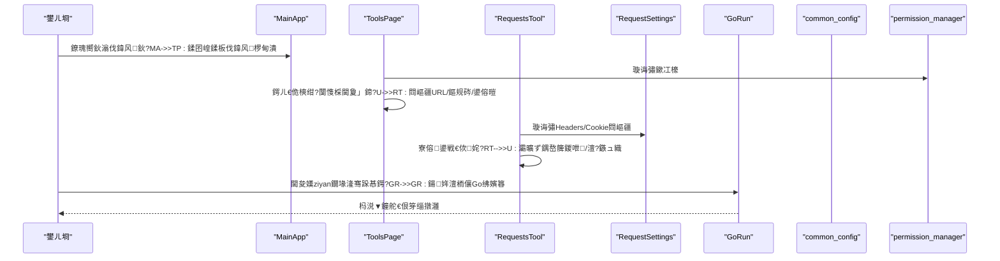
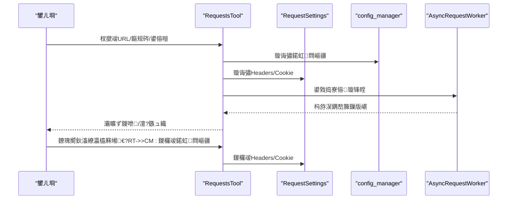
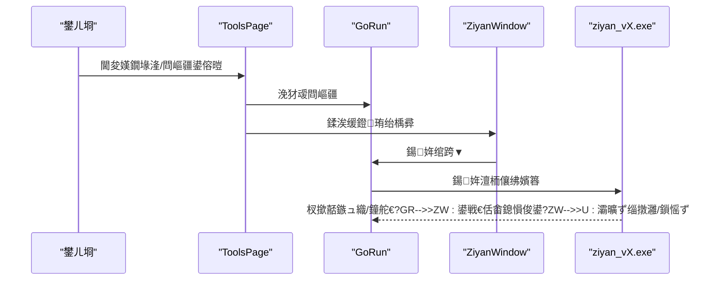
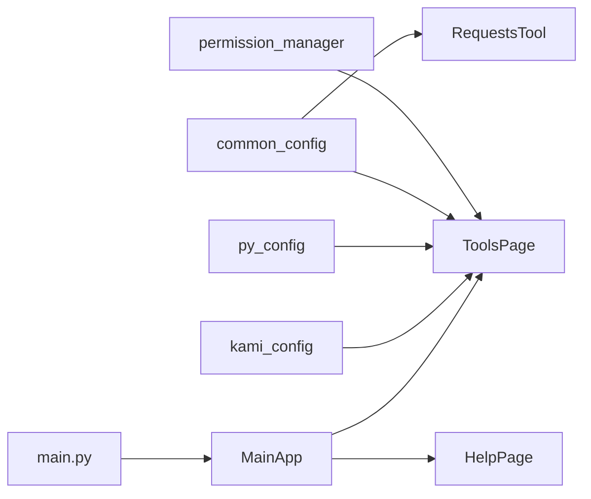

# 甯姪鏂囨。

<cite>
**鏈枃寮曠敤鐨勬枃浠?*
- [HelpPage.py](file://gui/HelpPage.py)
- [ToolsPage.py](file://gui/ToolsPage.py)
- [RequestsTool.py](file://gui/RequestsTool.py)
- [RequestSettings.py](file://gui/RequestSettings.py)
- [GoRun.py](file://gui/GoRun.py)
- [MainApp.py](file://gui/MainApp.py)
- [main.py](file://main.py)
- [common_config.py](file://config/common_config.py)
- [py_config.py](file://config/py_config.py)
- [permission_manager.py](file://config/permission_manager.py)
- [kami_config.py](file://config/kami_config.py)
- [py_config_value.txt](file://閰嶇疆鏂囦欢_绯荤粺閰嶇疆/py_config_value.txt)
</cite>

## 鐩綍
1. [绠€浠媇(#绠€浠?
2. [椤圭洰缁撴瀯](#椤圭洰缁撴瀯)
3. [鏍稿績缁勪欢](#鏍稿績缁勪欢)
4. [鏋舵瀯鎬昏](#鏋舵瀯鎬昏)
5. [璇︾粏缁勪欢鍒嗘瀽](#璇︾粏缁勪欢鍒嗘瀽)
6. [渚濊禆鍒嗘瀽](#渚濊禆鍒嗘瀽)
7. [鎬ц兘鑰冭檻](#鎬ц兘鑰冭檻)
8. [鏁呴殰鎺掗櫎鎸囧崡](#鏁呴殰鎺掗櫎鎸囧崡)
9. [缁撹](#缁撹)
10. [闄勫綍](#闄勫綍)

## 绠€浠?鏈府鍔╂枃妗ｉ潰鍚戝伐鍏烽〉闈㈢殑浣跨敤鑰呬笌缁存姢鑰咃紝绯荤粺鎬ц鏄庡伐鍏烽〉闈㈢殑鐣岄潰甯冨眬銆佸鑸柟寮忋€佸姛鑳界粍缁囥€佷娇鐢ㄦ祦绋嬨€佹敞鎰忎簨椤逛笌瀹夊叏鎻愰啋銆佸父瑙侀棶棰樹笌鏁呴殰鎺掗櫎銆佺増鏈俊鎭笌鏇存柊鏈哄埗銆佹妧鏈敮鎸佷笌鍙嶉娓犻亾锛屼互鍙婃渶浣冲疄璺典笌鎵╁睍瀹氬埗寤鸿銆傛枃妗ｅ熀浜庝粨搴撲腑鐨?GUI 涓庨厤缃ā鍧楄繘琛屾⒊鐞嗭紝纭繚淇℃伅鍑嗙‘鍙拷婧€?
## 椤圭洰缁撴瀯
宸ュ叿椤甸潰浣嶄簬 GUI 灞傦紝鍥寸粫鈥滃伐鍏风鈥濃€淗TTP 璇锋眰宸ュ叿鈥濃€滆姹傝缃€濃€滃帇娴嬫ā鍧椻€濃€滆鏄庘€濈瓑閫夐」鍗″睍寮€锛岄厤鍚堜富搴旂敤绐楀彛鐨勫鑸寜閽笌鏁版嵁搴撻厤缃鐞嗗櫒瀹炵幇鏉冮檺鎺у埗涓庢寔涔呭寲閰嶇疆銆?
```mermaid
graph TB
subgraph "涓诲簲鐢?
MA["MainApp.py<br/>涓荤獥鍙ｄ笌瀵艰埅"]
end
subgraph "宸ュ叿椤甸潰"
TP["ToolsPage.py<br/>宸ュ叿绠变富椤甸潰"]
HT["HelpPage.py<br/>璇存槑绐楀彛"]
RT["RequestsTool.py<br/>HTTP璇锋眰宸ュ叿"]
RS["RequestSettings.py<br/>璇锋眰璁剧疆"]
GR["GoRun.py<br/>鍘嬫祴杩涚▼杩愯鍣?]
end
subgraph "閰嶇疆涓庢潈闄?
CC["common_config.py<br/>鏁版嵁搴?閰嶇疆绠＄悊"]
PC["py_config.py<br/>鐗堟湰/璺緞閰嶇疆"]
PM["permission_manager.py<br/>鏉冮檺绠＄悊"]
KC["kami_config.py<br/>鍗″瘑閰嶇疆"]
PV["py_config_value.txt<br/>绯荤粺閰嶇疆鏂囦欢"]
end
subgraph "鍏ュ彛"
M["main.py<br/>绋嬪簭鍏ュ彛"]
end
M --> MA
MA --> TP
MA --> HT
TP --> RT
TP --> RS
TP --> GR
TP --> PM
TP --> PC
TP --> CC
TP --> KC
CC --> PV
```

鍥捐〃鏉ユ簮
- [MainApp.py:312-640](file://gui/MainApp.py#L312-L640)
- [ToolsPage.py:25-86](file://gui/ToolsPage.py#L25-L86)
- [HelpPage.py:72-121](file://gui/HelpPage.py#L72-L121)
- [RequestsTool.py:126-240](file://gui/RequestsTool.py#L126-L240)
- [RequestSettings.py:12-32](file://gui/RequestSettings.py#L12-L32)
- [GoRun.py:92-155](file://gui/GoRun.py#L92-L155)
- [common_config.py:197-334](file://config/common_config.py#L197-L334)
- [py_config.py:4-31](file://config/py_config.py#L4-L31)
- [permission_manager.py:12-88](file://config/permission_manager.py#L12-L88)
- [kami_config.py:6-56](file://config/kami_config.py#L6-L56)
- [py_config_value.txt:1-4](file://閰嶇疆鏂囦欢_绯荤粺閰嶇疆/py_config_value.txt#L1-L4)

绔犺妭鏉ユ簮
- [MainApp.py:312-640](file://gui/MainApp.py#L312-L640)
- [ToolsPage.py:25-86](file://gui/ToolsPage.py#L25-L86)

## 鏍稿績缁勪欢
- 宸ュ叿绠变富椤甸潰锛圱oolsPage锛夛細鎵胯浇 HTTP 璇锋眰宸ュ叿銆佽姹傝缃€佸疄鎷嶅浘鏍囨敞娴嬭瘯銆佸帇娴嬫ā鍧椼€佽鏄庣瓑閫夐」鍗★紝渚濇嵁鏉冮檺鍔ㄦ€佹樉绀?闅愯棌鍔熻兘銆?- HTTP 璇锋眰宸ュ叿锛圧equestsTool锛夛細鎻愪緵寮傛鍙戦€?HTTP 璇锋眰鐨勮兘鍔涳紝鏀寔 GET/POST/PUT/DELETE锛屽弬鏁板彲 JSON 鎴栬〃鍗曟牸寮忥紝鏀寔鑷姩瑙ｇ爜 JSON 鍝嶅簲銆?- 璇锋眰璁剧疆锛圧equestSettings锛夛細闆嗕腑绠＄悊 Headers 涓?Cookie 鐨勯厤缃紝鏀寔榛樿妯″紡涓庤嚜瀹氫箟妯″紡锛屼究浜庤法璇锋眰澶嶇敤銆?- 鍘嬫祴妯″潡锛圙oRun + ToolsPage锛夛細閫氳繃涓嬫媺閫夋嫨鈥渮iyan_vX.exe鈥濓紝缁撳悎閰嶇疆鍙傛暟鍚姩澶栭儴 Go 绋嬪簭杩涜鍘嬫祴锛屾敮鎸佹帶鍒跺彴妯″紡銆佷唬鐞嗐€佽繛鎺ユā寮忕瓑銆?- 璇存槑绐楀彛锛圚elpPage锛夛細鎻愪緵鈥滄垜鐨勪俊鎭€濃€滃钩鍙颁俊鎭€濃€滆础鐚?璧炲姪鈥濃€滅绾垮崱瀵嗏€濃€滅綉缁滀紭鍖栤€濈瓑閫夐」鍗★紝鍚紓姝ュ姞杞芥満鍣ㄧ爜銆佸鍒跺湴鍧€绛夊姛鑳姐€?- 涓诲簲鐢紙MainApp锛夛細鏁村悎瀵艰埅鎸夐挳涓庡彸渚у揩鎹锋搷浣滐紝缁熶竴绠＄悊鏁版嵁搴撳叧闂€佷换鍔℃竻鐞嗐€侀€€鍑烘祦绋嬬瓑銆?
绔犺妭鏉ユ簮
- [ToolsPage.py:25-86](file://gui/ToolsPage.py#L25-L86)
- [RequestsTool.py:126-240](file://gui/RequestsTool.py#L126-L240)
- [RequestSettings.py:12-32](file://gui/RequestSettings.py#L12-L32)
- [GoRun.py:92-155](file://gui/GoRun.py#L92-L155)
- [HelpPage.py:72-121](file://gui/HelpPage.py#L72-L121)
- [MainApp.py:312-640](file://gui/MainApp.py#L312-L640)

## 鏋舵瀯鎬昏
宸ュ叿椤甸潰閲囩敤鈥滀富绐楀彛 + 閫夐」鍗?+ 瀛愮粍浠垛€濈殑鍒嗗眰璁捐锛?- 涓荤獥鍙ｈ礋璐ｅ鑸笌椤甸潰鍒囨崲锛?- 閫夐」鍗℃壙杞藉叿浣撳姛鑳斤紱
- 瀛愮粍浠讹紙RequestsTool銆丷equestSettings銆丟oRun锛夎礋璐ｅ叿浣撲换鍔★紱
- 閰嶇疆涓庢潈闄愰€氳繃 common_config銆乸ermission_manager銆乸y_config銆乲ami_config 绛夋ā鍧楃粺涓€绠＄悊锛?- 鏁版嵁搴撳垵濮嬪寲涓庡叧闂敱 main.py 涓?common_config 鍗忓悓瀹屾垚銆?


鍥捐〃鏉ユ簮
- [MainApp.py:416-490](file://gui/MainApp.py#L416-L490)
- [ToolsPage.py:183-225](file://gui/ToolsPage.py#L183-L225)
- [RequestsTool.py:318-396](file://gui/RequestsTool.py#L318-L396)
- [RequestSettings.py:196-217](file://gui/RequestSettings.py#L196-L217)
- [GoRun.py:12-90](file://gui/GoRun.py#L12-L90)
- [permission_manager.py:57-87](file://config/permission_manager.py#L57-L87)

## 璇︾粏缁勪欢鍒嗘瀽

### 宸ュ叿绠变富椤甸潰锛圱oolsPage锛?- 椤甸潰甯冨眬锛氶《閮ㄩ€夐」鍗★紝鍖呭惈鈥淗TTP璇锋眰鈥濃€滆姹傝缃€濃€滃疄鎷嶅浘鏍囨敞娴嬭瘯鈥濃€滃帇娴嬫ā鍧椻€濃€滃帇鍔涙ā鍧楄鏄庘€濃€滆鏄庘€濈瓑銆?- 鏉冮檺鎺у埗锛氭牴鎹潈闄愬姩鎬佹樉绀衡€滃疄鎷嶅浘鏍囨敞娴嬭瘯鈥濓紱鍘嬫祴妯″潡鏍规嵁 DDoS 鏉冮檺鍚敤/绂佺敤鍚姩鎸夐挳銆?- 閰嶇疆鎸佷箙鍖栵細閫氳繃 config_manager 灏?UI 閰嶇疆淇濆瓨鍒版暟鎹簱锛屾敮鎸佽法浼氳瘽鎭㈠銆?- HTTP 璇锋眰閰嶇疆鍔犺浇锛氬欢杩熷姞杞斤紝纭繚 UI 鍒濆鍖栧悗鍐嶈鍙栭厤缃€?
```mermaid
flowchart TD
Start(["杩涘叆宸ュ叿绠?]) --> LoadPerm["璇诲彇鏉冮檺"]
LoadPerm --> AddTabs{"鏉冮檺婊¤冻锛?}
AddTabs --> |鏄瘄 ShowPos["鏄剧ず瀹炴媿鍥炬爣娉ㄦ祴璇?]
AddTabs --> |鍚 SkipPos["璺宠繃瀹炴媿鍥炬爣娉ㄦ祴璇?]
ShowPos --> InitUI["鍒濆鍖朥I涓庝俊鍙风粦瀹?]
SkipPos --> InitUI
InitUI --> DelayLoad["寤惰繜鍔犺浇HTTP璇锋眰閰嶇疆"]
DelayLoad --> Ready(["灏辩华"])
```

鍥捐〃鏉ユ簮
- [ToolsPage.py:47-86](file://gui/ToolsPage.py#L47-L86)
- [ToolsPage.py:183-225](file://gui/ToolsPage.py#L183-L225)

绔犺妭鏉ユ簮
- [ToolsPage.py:25-86](file://gui/ToolsPage.py#L25-L86)
- [ToolsPage.py:183-225](file://gui/ToolsPage.py#L183-L225)

### HTTP 璇锋眰宸ュ叿锛圧equestsTool锛?- 鍔熻兘瑕佺偣
  - 鏀寔 GET/POST/PUT/DELETE 鏂规硶锛?  - 鍙傛暟鏀寔 JSON 涓庤〃鍗曚袱绉嶆牸寮忥紝鑷姩璇嗗埆 Content-Type锛?  - 鑷姩瑙ｇ爜 JSON 鍝嶅簲锛?  - 寮傛璇锋眰锛屾敮鎸佸仠姝紱
  - 鍝嶅簲鍐呭銆佸搷搴斿ご銆佹棩蹇椾笁椤电灞曠ず锛?  - 涓?RequestSettings 閰嶇疆鑱斿姩锛屾瘡娆¤姹傚墠浠庢暟鎹簱璇诲彇鏈€鏂伴厤缃€?- 浣跨敤娴佺▼
  1) 鍦ㄢ€滃熀纭€璇锋眰璁剧疆鈥濆～鍐?URL銆佹柟娉曘€佸弬鏁帮紱
  2) 鍦ㄢ€滆姹傝缃€濋厤缃?Headers/Cookie锛?  3) 鐐瑰嚮鈥滃彂閫佲€濓紝鏌ョ湅鍝嶅簲锛?  4) 鍙€夆€滃仠姝⑩€濅腑鏂姹傦紱
  5) 鈥滀繚瀛橀厤缃€濆皢鍩虹璁剧疆涓庤姹傝缃啓鍥炴暟鎹簱銆?


鍥捐〃鏉ユ簮
- [RequestsTool.py:126-240](file://gui/RequestsTool.py#L126-L240)
- [RequestsTool.py:318-396](file://gui/RequestsTool.py#L318-L396)
- [RequestsTool.py:583-657](file://gui/RequestsTool.py#L583-L657)
- [RequestSettings.py:196-217](file://gui/RequestSettings.py#L196-L217)

绔犺妭鏉ユ簮
- [RequestsTool.py:126-240](file://gui/RequestsTool.py#L126-L240)
- [RequestsTool.py:318-396](file://gui/RequestsTool.py#L318-L396)
- [RequestsTool.py:583-657](file://gui/RequestsTool.py#L583-L657)
- [RequestSettings.py:12-32](file://gui/RequestSettings.py#L12-L32)

### 璇锋眰璁剧疆锛圧equestSettings锛?- 鍔熻兘瑕佺偣
  - Headers 妯″紡锛氶粯璁ゆā寮忥紙鍙嚜瀹氫箟 Content-Type/User-Agent锛夋垨鑷畾涔夋ā寮忥紙JSON锛夛紱
  - Cookie 妯″紡锛氫笉浣跨敤鎴栬嚜瀹氫箟锛圝SON锛夛紱
  - 淇濆瓨閰嶇疆鍒版暟鎹簱锛屼緵 RequestsTool 姣忔璇锋眰鍓嶈鍙栥€?- 浣跨敤寤鸿
  - 榛樿妯″紡閫傚悎澶у鏁板満鏅紱
  - 鑷畾涔夋ā寮忛€傜敤浜庣壒娈婃帴鍙ｆ垨闇€瑕佺簿纭帶鍒剁殑鍦烘櫙锛?  - Cookie 寤鸿浣跨敤 JSON 瀛楃涓诧紝閬垮厤鏍煎紡閿欒銆?
绔犺妭鏉ユ簮
- [RequestSettings.py:12-32](file://gui/RequestSettings.py#L12-L32)
- [RequestSettings.py:177-217](file://gui/RequestSettings.py#L177-L217)
- [RequestSettings.py:219-251](file://gui/RequestSettings.py#L219-L251)

### 鍘嬫祴妯″潡锛圙oRun + ToolsPage锛?- 鍔熻兘瑕佺偣
  - 閫氳繃涓嬫媺閫夋嫨鈥渮iyan_vX.exe鈥濈増鏈紱
  - 鏀寔妯″紡锛氭贩鍚?鍏ㄩ殢鏈?娲按/鎱㈣繛鎺?寮傛锛?  - 鏀寔杩炴帴妯″紡锛氳嚜鍔?鏅€?闀胯繛鎺ワ紱
  - 鏀寔鎺у埗鍙版ā寮忋€佷唬鐞嗐€佹湰鍦颁唬鐞嗐€佷簯绔唬鐞嗐€佷綆浼ゅ妯″紡銆佽繘绋嬪畧鎶ょ瓑锛?  - 閫氳繃 config_manager 淇濆瓨/鎭㈠ UI 閰嶇疆锛?  - 鍚姩鍚庡脊鍑虹嫭绔嬬獥鍙ｏ紝鏄剧ず杩愯鐘舵€佷笌缁撴灉銆?- 浣跨敤娴佺▼
  1) 鍦ㄢ€滃帇娴嬫ā鍧椻€濋厤缃洰鏍?URL銆佸苟鍙戞暟銆佹寔缁椂闂淬€佺増鏈€佹ā寮忋€佽繛鎺ユā寮忕瓑锛?  2) 鐐瑰嚮鈥滃惎鍔ㄢ€濓紝寮瑰嚭鐙珛绐楀彛锛?  3) 鎺у埗鍙版ā寮忎笅鍙湪鎺у埗鍙版煡鐪嬪疄鏃剁姸鎬侊紱
  4) 濡傞渶鍋滄锛屽彲鍦ㄧ嫭绔嬬獥鍙ｇ偣鍑烩€滃仠姝㈡敾鍑烩€濄€?


鍥捐〃鏉ユ簮
- [ToolsPage.py:456-510](file://gui/ToolsPage.py#L456-L510)
- [GoRun.py:92-155](file://gui/GoRun.py#L92-L155)
- [GoRun.py:12-90](file://gui/GoRun.py#L12-L90)

绔犺妭鏉ユ簮
- [ToolsPage.py:214-366](file://gui/ToolsPage.py#L214-L366)
- [ToolsPage.py:368-510](file://gui/ToolsPage.py#L368-L510)
- [GoRun.py:92-155](file://gui/GoRun.py#L92-L155)
- [GoRun.py:12-90](file://gui/GoRun.py#L12-L90)

### 璇存槑绐楀彛锛圚elpPage锛?- 鍔熻兘瑕佺偣
  - 鈥滄垜鐨勪俊鎭€濓細灞曠ず鐢ㄦ埛绛惧悕銆佸崱瀵嗐€佹椂闀裤€佸埌鏈熸椂闂淬€佹潈闄愮姸鎬併€佹満鍣ㄧ爜锛堝紓姝ュ姞杞斤級銆佸綋鍓嶇増鏈紱
  - 鈥滃钩鍙颁俊鎭€濓細浣跨敤鏁欑▼涓庢敞鎰忎簨椤癸紱
  - 鈥滆础鐚?璧炲姪鈥濓細USDT 鍦板潃涓庝簩缁寸爜鍥剧墖锛堝紓姝ュ姞杞斤級锛?  - 鈥滅绾垮崱瀵嗏€濓細鑱旂郴鏂瑰紡涓庡畼缃戯紱
  - 鈥滅綉缁滀紭鍖栤€濓細缃戠粶浼樺寲寤鸿锛?  - 鈥滃叧浜庘€濓細瀹夊叏涓庣増鏈俊鎭€?- 娉ㄦ剰浜嬮」
  - 鏈哄櫒鐮侀娆″姞杞藉彲鑳藉欢杩燂紝鍔犺浇瀹屾垚鍚庝細鎸佷箙鍖栧埌鏁版嵁搴擄紱
  - 璧炲姪寮圭獥鏀寔澶嶅埗鍦板潃涓庡紓姝ュ姞杞戒簩缁寸爜銆?
绔犺妭鏉ユ簮
- [HelpPage.py:72-121](file://gui/HelpPage.py#L72-L121)
- [HelpPage.py:122-307](file://gui/HelpPage.py#L122-L307)
- [HelpPage.py:356-418](file://gui/HelpPage.py#L356-L418)
- [HelpPage.py:420-453](file://gui/HelpPage.py#L420-L453)
- [HelpPage.py:593-625](file://gui/HelpPage.py#L593-L625)
- [HelpPage.py:628-700](file://gui/HelpPage.py#L628-L700)
- [HelpPage.py:700-800](file://gui/HelpPage.py#L700-L800)

## 渚濊禆鍒嗘瀽
- 鏉冮檺涓庨厤缃?  - permission_manager锛氫繚瀛?璇诲彇鏉冮檺锛岀敤浜庢帶鍒?UI 涓庡姛鑳芥樉绀猴紱
  - config_manager锛氱粺涓€閰嶇疆璇诲啓锛屾敮鎾?RequestsTool/ToolsPage 鐨勬寔涔呭寲锛?  - py_config锛氱増鏈彿銆佽矾寰勩€侀潤鎬侀厤缃紱
  - kami_config锛氬崱瀵嗛厤缃紱
  - common_config锛氭暟鎹簱鍒濆鍖?鍏抽棴銆佸苟鍙戦厤缃€侀洩鑺辩敓鎴愬櫒绛夈€?- 杩愯鏃朵笌鍏ュ彛
  - main.py锛氬叏灞€寮傚父鎹曡幏銆佹暟鎹簱鍒濆鍖栥€佹棩蹇楁竻鐞嗐€佷簨浠跺惊鐜笌閫€鍑烘祦绋嬶紱
  - MainApp锛氫富绐楀彛銆佸鑸寜閽€侀€€鍑鸿繘搴﹀脊绐椼€佹暟鎹簱鍏抽棴涓庝换鍔℃竻鐞嗐€?


鍥捐〃鏉ユ簮
- [permission_manager.py:12-88](file://config/permission_manager.py#L12-L88)
- [common_config.py:197-334](file://config/common_config.py#L197-L334)
- [py_config.py:4-31](file://config/py_config.py#L4-L31)
- [kami_config.py:6-56](file://config/kami_config.py#L6-L56)
- [main.py:62-201](file://main.py#L62-L201)
- [MainApp.py:312-640](file://gui/MainApp.py#L312-L640)

绔犺妭鏉ユ簮
- [permission_manager.py:12-88](file://config/permission_manager.py#L12-L88)
- [common_config.py:197-334](file://config/common_config.py#L197-L334)
- [py_config.py:4-31](file://config/py_config.py#L4-L31)
- [kami_config.py:6-56](file://config/kami_config.py#L6-L56)
- [main.py:62-201](file://main.py#L62-L201)
- [MainApp.py:312-640](file://gui/MainApp.py#L312-L640)

## 鎬ц兘鑰冭檻
- 寮傛璇锋眰锛歊equestsTool 浣跨敤寮傛瀹㈡埛绔紝閬垮厤闃诲 UI锛?- 绾跨▼鍖栧帇娴嬶細GoRun 閫氳繃绾跨▼鍚姩澶栭儴绋嬪簭锛屾敮鎸佹帶鍒跺彴妯″紡涓庨潪鎺у埗鍙版ā寮忥紱
- 鏁版嵁搴撹繛鎺ワ細common_config 鎻愪緵杩炴帴绠＄悊鍣ㄤ笌 WAL 妫€鏌ョ偣锛岀‘淇濇暟鎹簱瀹夊叏鍏抽棴锛?- 閰嶇疆缂撳瓨锛歍oolsPage/RequestsTool 浠庢暟鎹簱璇诲彇閰嶇疆锛屽噺灏戦噸澶嶈В鏋愶紱
- 璧勬簮閲婃斁锛欻elpPage 鐨勫浘鐗囧姞杞界嚎绋嬩笌鏈哄櫒鐮佸姞杞界嚎绋嬪湪瀹屾垚鍚庨攢姣侊紝閬垮厤璧勬簮娉勯湶銆?
绔犺妭鏉ユ簮
- [RequestsTool.py:318-396](file://gui/RequestsTool.py#L318-L396)
- [GoRun.py:12-90](file://gui/GoRun.py#L12-L90)
- [common_config.py:59-134](file://config/common_config.py#L59-L134)
- [HelpPage.py:250-307](file://gui/HelpPage.py#L250-L307)

## 鏁呴殰鎺掗櫎鎸囧崡
- HTTP 璇锋眰澶辫触
  - 妫€鏌?URL 鍗忚锛堝缓璁娇鐢ㄥ畬鏁村崗璁級锛?  - 纭 Headers/Cookie 閰嶇疆鏄惁姝ｇ‘锛堥粯璁ゆā寮?鑷畾涔夋ā寮忥級锛?  - 鑻ュ搷搴斾负 JSON锛屽彲鍚敤鈥滆嚜鍔ㄨВ鐮?JSON鈥濇煡鐪嬫牸寮忓寲鍐呭锛?  - 浣跨敤鈥滃仠姝⑩€濅腑鏂暱鏃堕棿璇锋眰銆?- 鍘嬫祴妯″潡鏃犳硶鍚姩
  - 纭宸查€夋嫨鏈夋晥鐨勨€渮iyan_vX.exe鈥濈増鏈紱
  - 妫€鏌モ€滄帶鍒跺彴妯″紡鈥濃€滀唬鐞嗏€濃€滆繛鎺ユā寮忊€濈瓑鍙傛暟锛?  - 鑻ョ▼搴忔湭閫€鍑猴紝鍙湪鐙珛绐楀彛鐐瑰嚮鈥滃仠姝㈡敾鍑烩€濇垨閫氳繃杩涚▼绠＄悊缁堟銆?- 璇存槑绐楀彛鍔犺浇寮傚父
  - 鏈哄櫒鐮佸姞杞藉け璐ヤ細鍦ㄢ€滄垜鐨勪俊鎭€濅腑鏄剧ず閿欒鎻愮ず锛?  - 璧炲姪寮圭獥鍥剧墖鍔犺浇澶辫触浼氭樉绀洪敊璇俊鎭紝鍙◢鍚庨噸璇曘€?- 鏉冮檺涓嶈冻
  - 鈥滃疄鎷嶅浘鏍囨敞娴嬭瘯鈥濇垨鍘嬫祴妯″潡鍚姩鎸夐挳鍙兘琚鐢紝闇€鍏峰鐩稿簲鏉冮檺锛?  - 閫氳繃鏉冮檺绠＄悊鍣ㄤ繚瀛?璇诲彇鏉冮檺銆?- 閫€鍑哄紓甯?  - 涓诲簲鐢ㄩ€€鍑烘椂浼氭樉绀鸿繘搴﹀脊绐楋紝鍖呭惈鏁版嵁搴撳叧闂€佷换鍔℃竻鐞嗙瓑姝ラ锛?  - 鑻ュ嚭鐜板紓甯革紝绋嬪簭浼氬己鍒堕€€鍑哄苟璁板綍鏃ュ織銆?
绔犺妭鏉ユ簮
- [RequestsTool.py:318-396](file://gui/RequestsTool.py#L318-L396)
- [GoRun.py:135-155](file://gui/GoRun.py#L135-L155)
- [HelpPage.py:287-307](file://gui/HelpPage.py#L287-L307)
- [permission_manager.py:57-87](file://config/permission_manager.py#L57-L87)
- [MainApp.py:185-280](file://gui/MainApp.py#L185-L280)

## 缁撹
宸ュ叿椤甸潰浠モ€滄潈闄愰┍鍔?+ 閰嶇疆鎸佷箙鍖?+ 寮傛澶勭悊 + 绾跨▼闅旂鈥濈殑鏂瑰紡鏋勫缓锛屾棦淇濊瘉浜嗘槗鐢ㄦ€э紝鍙堝吋椤句簡瀹夊叏鎬т笌绋冲畾鎬с€傞€氳繃 HTTP 璇锋眰宸ュ叿銆佽姹傝缃€佸帇娴嬫ā鍧椾笌璇存槑绐楀彛鐨勫崗鍚岋紝鐢ㄦ埛鍙互楂樻晥瀹屾垚鏃ュ父浠诲姟涓庤緟鍔╄瘖鏂€傚缓璁湪浣跨敤鍓嶆槑纭潈闄愪笌鍙傛暟閰嶇疆锛岄伒寰畨鍏ㄤ笌鍚堣瑕佹眰锛屽苟鍦ㄩ亣鍒伴棶棰樻椂鍙傝€冩晠闅滄帓闄ゆ寚鍗椾笌鎶€鏈敮鎸佹笭閬撱€?
## 闄勫綍

### 鐗堟湰淇℃伅涓庢洿鏂版棩蹇?- 褰撳墠鐗堟湰锛氱敱閰嶇疆妯″潡鎻愪緵锛屽彲閫氳繃閰嶇疆鏂囦欢璇诲彇锛?- 鐗堟湰鐢熸垚绛栫暐锛氬彲鎸夋棩鏈熺敓鎴愮増鏈彿锛?- 鐗堟湰鏍￠獙锛氬叆鍙ｅ瀵圭増鏈彿杩涜涓€鑷存€ф鏌ワ紝鎻愮ず淇敼銆?
绔犺妭鏉ユ簮
- [py_config.py:27-31](file://config/py_config.py#L27-L31)
- [py_config.py:64-81](file://config/py_config.py#L64-L81)
- [main.py:227-232](file://main.py#L227-L232)

### 鎶€鏈敮鎸佷笌鍙嶉娓犻亾
- 璐＄尞/璧炲姪锛氭彁渚?USDT 鍦板潃涓庝簩缁寸爜锛屾敮鎸佸鍒跺湴鍧€锛?- 绂荤嚎鍗″瘑锛氭彁渚?Telegram銆侀偖绠便€佸畼缃戠瓑鑱旂郴鏂瑰紡锛?- 骞冲彴淇℃伅锛氭彁渚涗娇鐢ㄦ暀绋嬩笌娉ㄦ剰浜嬮」銆?
绔犺妭鏉ユ簮
- [HelpPage.py:455-561](file://gui/HelpPage.py#L455-L561)
- [HelpPage.py:593-625](file://gui/HelpPage.py#L593-L625)
- [HelpPage.py:356-418](file://gui/HelpPage.py#L356-L418)

### 鏈€浣冲疄璺典笌鏁堢巼鎻愬崌寤鸿
- HTTP 璇锋眰
  - 浣跨敤榛樿 Headers 妯″紡锛屼粎鍦ㄥ繀瑕佹椂鍒囨崲鑷畾涔夋ā寮忥紱
  - 鍙傛暟灏介噺浣跨敤 JSON 鏍煎紡锛屼究浜庤В鏋愪笌璋冭瘯锛?  - 鍚敤鈥滆嚜鍔ㄨВ鐮?JSON鈥濅互鎻愬崌闃呰浣撻獙锛?  - 瀵逛簬澶у搷搴斾綋锛屽缓璁厛鏌ョ湅鍝嶅簲澶翠笌鐘舵€佺爜锛屽啀鍐冲畾鏄惁灞曞紑鍐呭銆?- 鍘嬫祴妯″潡
  - 鍒濇浣跨敤寤鸿鍕鹃€夆€滄帶鍒跺彴妯″紡鈥濅互渚胯瀵熷疄鏃剁姸鎬侊紱
  - 鏍规嵁缃戠粶甯﹀涓庣洰鏍囨湇鍔″櫒鎯呭喌璋冩暣骞跺彂鏁颁笌鎸佺画鏃堕棿锛?  - 浣跨敤鈥滀綆浼ゅ妯″紡鈥濋檷浣庡鏈満纭欢鐨勫奖鍝嶏紱
  - 鍚堢悊閫夋嫨杩炴帴妯″紡锛岄伩鍏嶅鐩爣閫犳垚涓嶅繀瑕佺殑鍘嬪姏銆?- 鏉冮檺涓庡畨鍏?  - 涓ユ牸閬靛畧鏉冮檺鑼冨洿锛岄伩鍏嶈秺鏉冩搷浣滐紱
  - 瀹氭湡娓呯悊涓存椂杩涚▼涓庢棩蹇楋紝淇濇寔绯荤粺鏁存磥锛?  - 閬囧埌寮傚父鍙婃椂璁板綍鏃ュ織骞跺弽棣堛€?
### 鎵╁睍涓庡畾鍒舵寚鍗?- 鏂板閫夐」鍗?  - 鍦?ToolsPage 涓柊澧為€夐」鍗★紝澶嶇敤鐜版湁缁勪欢鎴栨柊寤哄瓙缁勪欢锛?  - 閫氳繃鏉冮檺绠＄悊鍣ㄦ帶鍒舵樉绀?闅愯棌锛?  - 浣跨敤 config_manager 淇濆瓨/鎭㈠ UI 閰嶇疆銆?- 鑷畾涔夎姹傝缃?  - 鍦?RequestSettings 涓柊澧為厤缃」锛屾敞鎰忎笌 RequestsTool 鐨勮仈鍔紱
  - 纭繚閰嶇疆椤圭殑榛樿鍊间笌鏍￠獙閫昏緫瀹屽杽銆?- 鍘嬫祴妯″潡鎵╁睍
  - 鍦?gui/Go 鐩綍鏂板澶栭儴绋嬪簭锛孴oolsPage 浼氳嚜鍔ㄦ壂鎻忓苟鎺掑簭锛?  - 閫氳繃鍙傛暟鏄犲皠涓庨厤缃」瀵规帴锛岀‘淇濆弬鏁颁紶閫掓纭€?
绔犺妭鏉ユ簮
- [ToolsPage.py:183-225](file://gui/ToolsPage.py#L183-L225)
- [RequestSettings.py:196-217](file://gui/RequestSettings.py#L196-L217)
- [ToolsPage.py:295-326](file://gui/ToolsPage.py#L295-L326)

