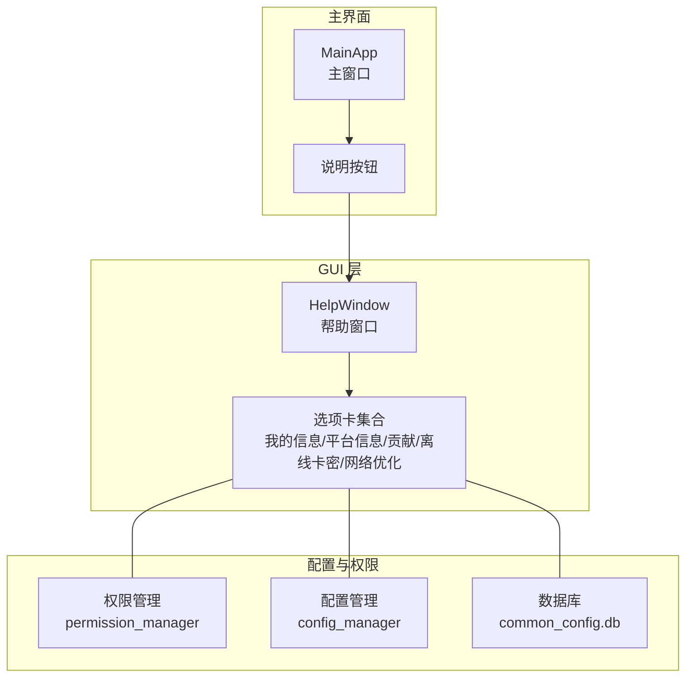
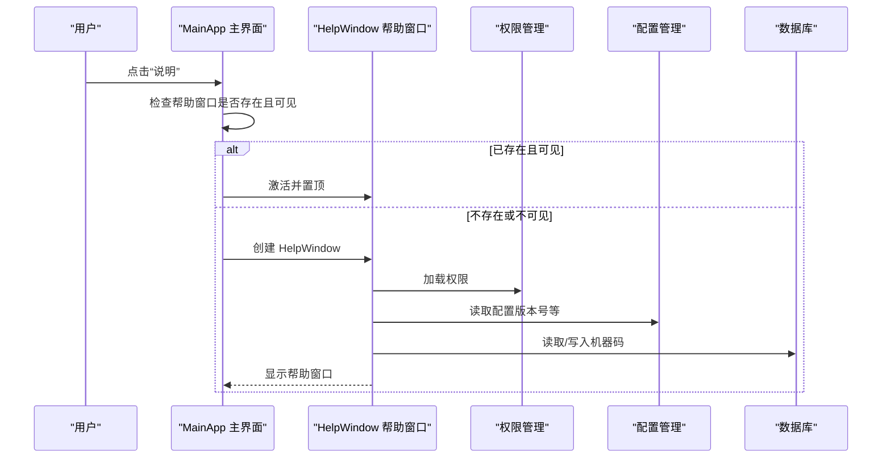
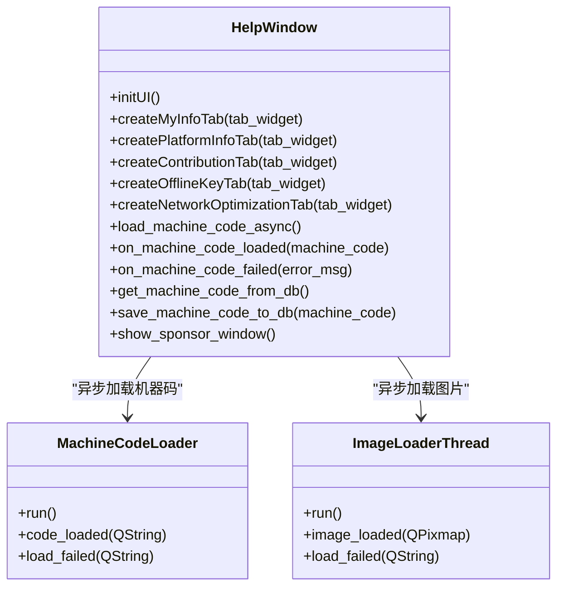
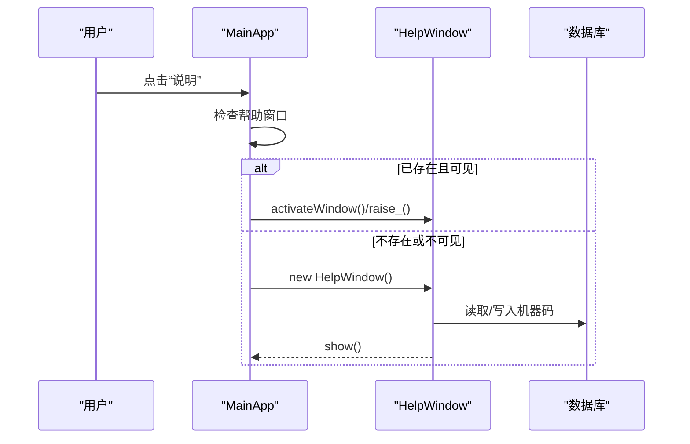
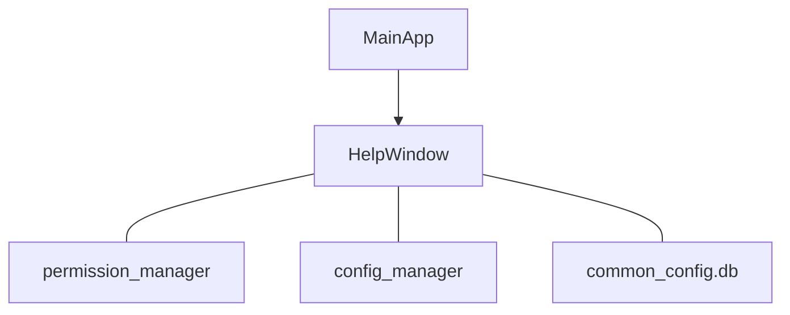

# 帮助系统

<cite>
**本文档引用的文件**
- [HelpPage.py](file://gui/HelpPage.py)
- [MainApp.py](file://gui/MainApp.py)
- [common_config.py](file://config/common_config.py)
- [main.py](file://main.py)
- [ToolsPage.py](file://gui/ToolsPage.py)
- [添加新任务功能.md](file://代码规范/添加新任务功能.md)
</cite>

## 目录
1. [简介](#简介)
2. [项目结构](#项目结构)
3. [核心组件](#核心组件)
4. [架构总览](#架构总览)
5. [详细组件分析](#详细组件分析)
6. [依赖分析](#依赖分析)
7. [性能考虑](#性能考虑)
8. [故障排查指南](#故障排查指南)
9. [结论](#结论)
10. [附录](#附录)

## 简介
本文件面向 ikun_temu_system 的帮助系统，系统性阐述帮助窗口的设计与内容组织、信息分类与检索机制、用户界面与交互方式、内容更新与维护流程、与主界面的集成方式、扩展与自定义方法、统计与反馈机制以及测试与质量保证措施。帮助系统以 PyQt5 为基础，采用多选项卡组织信息，支持异步加载与本地持久化，兼顾易用性与可维护性。

## 项目结构
帮助系统主要位于 GUI 层，核心入口为帮助窗口类，负责承载“我的信息”“平台信息”“贡献”“离线卡密”“网络优化”等选项卡内容；与主界面通过统一的“说明”按钮触发；与配置层、权限层、数据库层存在间接耦合，用于读取用户权限、卡密、到期时间等上下文信息。

**图表来源**
- [HelpPage.py:72-121](file://gui/HelpPage.py#L72-L121)
- [MainApp.py:1005-1031](file://gui/MainApp.py#L1005-L1031)
- [common_config.py:15-51](file://config/common_config.py#L15-L51)

**章节来源**
- [HelpPage.py:72-121](file://gui/HelpPage.py#L72-L121)
- [MainApp.py:1005-1031](file://gui/MainApp.py#L1005-L1031)
- [common_config.py:15-51](file://config/common_config.py#L15-L51)

## 核心组件
- 帮助窗口类 HelpWindow：负责创建与渲染帮助界面，包含多个选项卡，支持异步加载机器码与图片，提供复制地址、清理进程、解绑卡密等便捷操作。
- 主界面 MainApp：提供“说明”按钮，统一触发帮助窗口的创建与显示，具备窗口生命周期管理与错误提示。
- 配置与权限：帮助窗口读取用户权限、卡密、到期时间、版本号等信息，部分信息来自配置管理与数据库。
- 数据持久化：机器码等信息通过数据库进行缓存，避免重复计算与网络请求。

**章节来源**
- [HelpPage.py:72-121](file://gui/HelpPage.py#L72-L121)
- [HelpPage.py:122-355](file://gui/HelpPage.py#L122-L355)
- [HelpPage.py:356-453](file://gui/HelpPage.py#L356-L453)
- [HelpPage.py:455-561](file://gui/HelpPage.py#L455-L561)
- [HelpPage.py:593-626](file://gui/HelpPage.py#L593-L626)
- [HelpPage.py:628-832](file://gui/HelpPage.py#L628-L832)
- [MainApp.py:1005-1031](file://gui/MainApp.py#L1005-L1031)

## 架构总览
帮助系统采用“主界面触发—窗口类承载—配置/权限/数据库支撑”的分层架构。主界面负责入口与生命周期管理，帮助窗口负责内容组织与交互，配置与权限层提供上下文数据，数据库层提供持久化能力。

**图表来源**
- [MainApp.py:1005-1031](file://gui/MainApp.py#L1005-L1031)
- [HelpPage.py:122-193](file://gui/HelpPage.py#L122-L193)
- [HelpPage.py:308-355](file://gui/HelpPage.py#L308-L355)

## 详细组件分析

### 帮助窗口类与选项卡组织
- 我的信息：展示用户签名、卡密、时长、到期时间、权限状态、机器码（异步加载）、当前版本等；提供“解绑卡密”“清理ikun进程”按钮。
- 平台信息：以富文本形式呈现使用教程与注意事项，便于用户快速上手。
- 贡献：展示联系方式与官网地址，支持复制地址与赞助弹窗（含动画效果）。
- 离线卡密：展示离线联系方式与官网地址。
- 网络优化：预留扩展选项卡，用于网络相关帮助内容。

**图表来源**
- [HelpPage.py:26-44](file://gui/HelpPage.py#L26-L44)
- [HelpPage.py:47-69](file://gui/HelpPage.py#L47-L69)
- [HelpPage.py:72-121](file://gui/HelpPage.py#L72-L121)
- [HelpPage.py:122-355](file://gui/HelpPage.py#L122-L355)
- [HelpPage.py:455-561](file://gui/HelpPage.py#L455-L561)

**章节来源**
- [HelpPage.py:72-121](file://gui/HelpPage.py#L72-L121)
- [HelpPage.py:122-355](file://gui/HelpPage.py#L122-L355)
- [HelpPage.py:356-453](file://gui/HelpPage.py#L356-L453)
- [HelpPage.py:455-561](file://gui/HelpPage.py#L455-L561)
- [HelpPage.py:593-626](file://gui/HelpPage.py#L593-L626)
- [HelpPage.py:628-832](file://gui/HelpPage.py#L628-L832)

### 信息分类与检索机制
- 分类组织：按“我的信息”“平台信息”“贡献/离线卡密”“网络优化”划分，满足不同用户关注点。
- 检索方式：当前采用富文本与选项卡浏览，未内置全文检索；可通过复制文本、选择性阅读实现快速定位。
- 权限与上下文：根据权限动态展示功能状态，结合到期时间、版本号等上下文信息增强可信度。

**章节来源**
- [HelpPage.py:122-193](file://gui/HelpPage.py#L122-L193)
- [HelpPage.py:356-453](file://gui/HelpPage.py#L356-L453)

### 用户界面与交互方式
- 触发入口：主界面导航区“说明”按钮统一触发帮助窗口。
- 生命周期管理：支持重复点击激活、自动清理不可见窗口、错误提示弹窗。
- 交互细节：提供复制地址、赞助弹窗、机器码异步加载、图片异步加载、按钮动画等增强体验。

**图表来源**
- [MainApp.py:1005-1031](file://gui/MainApp.py#L1005-L1031)

**章节来源**
- [MainApp.py:1005-1031](file://gui/MainApp.py#L1005-L1031)
- [HelpPage.py:455-561](file://gui/HelpPage.py#L455-L561)

### 内容更新与维护流程
- 平台信息：富文本内容集中维护，便于集中更新使用教程与注意事项。
- 机器码：首次加载异步获取并持久化至数据库，后续直接读取，减少网络依赖。
- 赞助弹窗：图片异步加载，失败时显示错误提示，保障用户体验。
- 扩展建议：新增选项卡时，遵循现有创建与样式风格，确保一致性。

**章节来源**
- [HelpPage.py:308-355](file://gui/HelpPage.py#L308-L355)
- [HelpPage.py:455-561](file://gui/HelpPage.py#L455-L561)
- [HelpPage.py:593-626](file://gui/HelpPage.py#L593-L626)

### 与主界面的集成方式
- 触发方式：主界面导航按钮“说明”绑定到 HelpWindow 的创建与显示。
- 窗口管理：统一处理窗口存在性、可见性、激活与销毁，避免重复创建与资源泄漏。
- 错误处理：创建失败时弹出错误提示并记录日志。

**章节来源**
- [MainApp.py:1005-1031](file://gui/MainApp.py#L1005-L1031)

### 扩展方法与自定义功能
- 新增选项卡：参考现有 createMyInfoTab/createPlatformInfoTab 等方法，创建新选项卡并加入 tab_widget。
- 自定义样式：沿用现有样式风格（QTextEdit 无边框、透明背景、自动换行、只读等），保持一致性。
- 功能扩展：可增加搜索框、标签页导航、折叠面板等，提升信息密度与查找效率。
- 外部资源：可引入外部文档或网页，通过 QWebEngineView 或外部链接方式集成。

**章节来源**
- [HelpPage.py:122-193](file://gui/HelpPage.py#L122-L193)
- [HelpPage.py:356-453](file://gui/HelpPage.py#L356-L453)

### 统计与反馈机制
- 当前实现：未发现内置统计与反馈收集机制。
- 建议方案：
  - 帮助窗口访问次数统计：在 HelpWindow 初始化时记录访问次数并持久化。
  - 选项卡点击统计：记录各选项卡的点击频次，辅助优化内容布局。
  - 反馈入口：在帮助窗口中增加“问题反馈”按钮，引导用户提交反馈。
  - 日志采集：结合现有日志框架，记录帮助窗口关键事件与异常。

**章节来源**
- [HelpPage.py:72-121](file://gui/HelpPage.py#L72-L121)

### 测试方法与质量保证
- 单元测试：针对 HelpWindow 的关键方法（如机器码读取、文本渲染、按钮交互）编写单元测试。
- 集成测试：模拟主界面触发帮助窗口的完整流程，验证窗口生命周期与错误处理。
- 回归测试：在新增选项卡或修改样式后，回归验证所有选项卡的显示与交互。
- 性能测试：对异步加载（机器码、图片）进行压力测试，确保在弱网环境下仍可稳定工作。
- 兼容性测试：在不同操作系统与分辨率下验证界面布局与交互一致性。

**章节来源**
- [HelpPage.py:26-44](file://gui/HelpPage.py#L26-L44)
- [HelpPage.py:47-69](file://gui/HelpPage.py#L47-L69)
- [MainApp.py:1005-1031](file://gui/MainApp.py#L1005-L1031)

## 依赖分析
帮助系统与配置、权限、数据库存在间接依赖，用于提供上下文信息与持久化能力；与主界面通过事件绑定形成松耦合集成。

**图表来源**
- [HelpPage.py:122-193](file://gui/HelpPage.py#L122-L193)
- [HelpPage.py:308-355](file://gui/HelpPage.py#L308-L355)
- [MainApp.py:1005-1031](file://gui/MainApp.py#L1005-L1031)
- [common_config.py:15-51](file://config/common_config.py#L15-L51)

**章节来源**
- [HelpPage.py:122-193](file://gui/HelpPage.py#L122-L193)
- [HelpPage.py:308-355](file://gui/HelpPage.py#L308-L355)
- [MainApp.py:1005-1031](file://gui/MainApp.py#L1005-L1031)
- [common_config.py:15-51](file://config/common_config.py#L15-L51)

## 性能考虑
- 异步加载：机器码与图片采用线程异步加载，避免阻塞 UI。
- 缓存策略：机器码读取优先本地数据库，失败再发起网络请求，减少重复请求。
- 资源释放：窗口关闭后及时释放线程与资源，防止内存泄漏。
- 文本渲染：使用 QTextEdit 并设置自动换行与只读，降低渲染负担。

**章节来源**
- [HelpPage.py:26-44](file://gui/HelpPage.py#L26-L44)
- [HelpPage.py:47-69](file://gui/HelpPage.py#L47-L69)
- [HelpPage.py:308-355](file://gui/HelpPage.py#L308-L355)

## 故障排查指南
- 帮助窗口无法创建：检查主界面按钮绑定与窗口生命周期管理，查看日志错误。
- 机器码加载失败：检查网络连通性与数据库写入权限，查看异常提示。
- 图片加载失败：检查网络与图片格式，查看错误提示并重试。
- 权限信息缺失：检查权限管理模块初始化与数据库状态。

**章节来源**
- [MainApp.py:1005-1031](file://gui/MainApp.py#L1005-L1031)
- [HelpPage.py:287-306](file://gui/HelpPage.py#L287-L306)
- [HelpPage.py:552-561](file://gui/HelpPage.py#L552-L561)

## 结论
帮助系统以简洁直观的方式组织信息，通过异步加载与本地缓存提升用户体验，与主界面集成良好。建议在未来版本中引入统计与反馈机制、增强检索能力，并完善测试体系，以进一步提升系统的可维护性与用户满意度。

## 附录
- 相关文档与规范：可参考“添加新任务功能指南”，学习系统化的功能扩展与测试方法，为帮助系统的扩展提供参考。

**章节来源**
- [添加新任务功能.md:1-395](file://代码规范/添加新任务功能.md#L1-L395)