# 数据库查看器

<cite>
**本文档引用的文件**
- [SqlitePage.py](file://gui/SqlitePage.py)
- [classSQLite.py](file://modules/classSQLite.py)
- [db_config.json](file://配置文件_系统配置/db_config.json)
- [hupu_db_config.json](file://配置文件_系统配置/hupu_db_config.json)
- [MainPage.py](file://gui/MainPage.py)
</cite>

## 目录
1. [简介](#简介)
2. [项目结构](#项目结构)
3. [核心组件](#核心组件)
4. [架构概览](#架构概览)
5. [详细组件分析](#详细组件分析)
6. [依赖关系分析](#依赖关系分析)
7. [性能考虑](#性能考虑)
8. [故障排除指南](#故障排除指南)
9. [结论](#结论)

## 简介

数据库查看器是 ikun_temu_system 项目中的核心数据库管理组件，基于 PyQt5 和 SQLite 技术构建。该系统提供了直观的图形化界面，支持多标签页的数据浏览、编辑和删除功能，具备强大的查询筛选能力，以及完整的数据导出备份功能。

系统采用现代化的数据库设计模式，支持多数据库连接管理、异步数据处理、批量操作和权限控制。通过模块化的架构设计，实现了高度的可扩展性和维护性。

## 项目结构

数据库查看器位于项目的 GUI 层，主要文件结构如下：

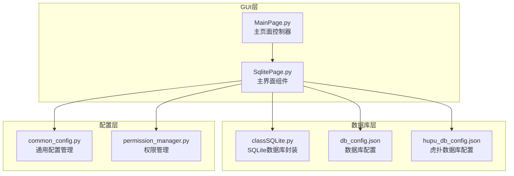

**图表来源**
- [SqlitePage.py:1-50](file://gui/SqlitePage.py#L1-L50)
- [classSQLite.py:1-50](file://modules/classSQLite.py#L1-L50)

**章节来源**
- [SqlitePage.py:1-100](file://gui/SqlitePage.py#L1-L100)
- [classSQLite.py:1-100](file://modules/classSQLite.py#L1-L100)

## 核心组件

### 主要组件架构

数据库查看器采用分层架构设计，包含以下核心组件：

1. **DbTableViewer**: 主窗口控制器，管理多标签页界面
2. **TableTabWidget**: 单个标签页的数据展示组件
3. **DatabaseWorker**: 数据库查询工作线程
4. **SQLiteDB**: 数据库连接管理封装
5. **AIAnalysisWorker**: AI分析异步处理组件

### 数据库连接管理

系统支持多数据库连接管理，通过统一的配置文件进行数据库配置：

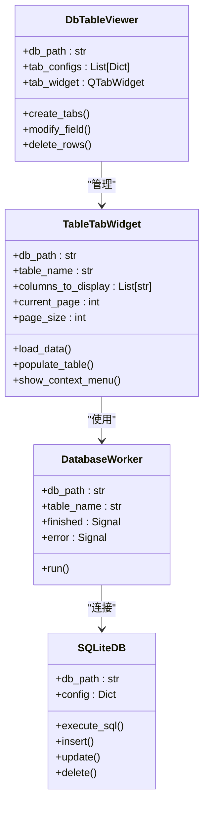

**图表来源**
- [SqlitePage.py:3521-3580](file://gui/SqlitePage.py#L3521-L3580)
- [SqlitePage.py:870-920](file://gui/SqlitePage.py#L870-L920)
- [SqlitePage.py:85-135](file://gui/SqlitePage.py#L85-L135)
- [classSQLite.py:359-420](file://modules/classSQLite.py#L359-L420)

**章节来源**
- [SqlitePage.py:3521-3580](file://gui/SqlitePage.py#L3521-L3580)
- [classSQLite.py:359-420](file://modules/classSQLite.py#L359-L420)

## 架构概览

### 系统架构图

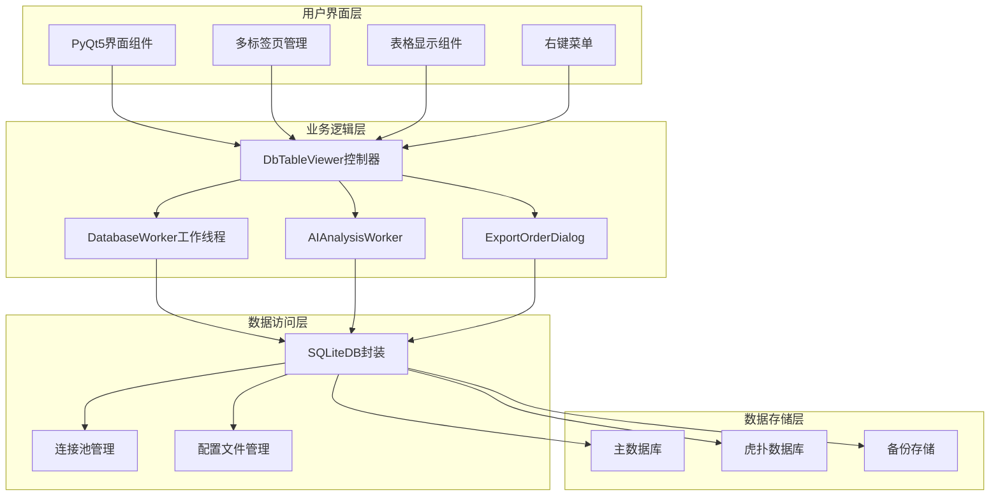

**图表来源**
- [SqlitePage.py:3521-3580](file://gui/SqlitePage.py#L3521-L3580)
- [SqlitePage.py:85-135](file://gui/SqlitePage.py#L85-L135)
- [classSQLite.py:294-330](file://modules/classSQLite.py#L294-L330)

### 数据流处理流程

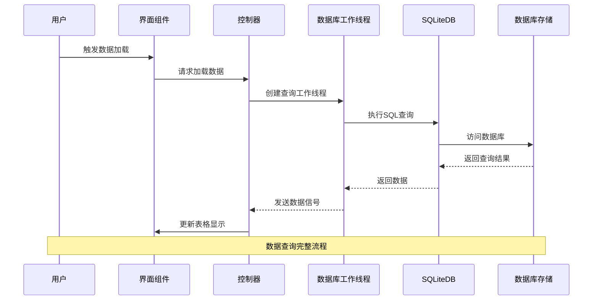

**图表来源**
- [SqlitePage.py:1268-1348](file://gui/SqlitePage.py#L1268-L1348)
- [SqlitePage.py:42-83](file://gui/SqlitePage.py#L42-L83)
- [classSQLite.py:436-531](file://modules/classSQLite.py#L436-L531)

**章节来源**
- [SqlitePage.py:1268-1348](file://gui/SqlitePage.py#L1268-L1348)
- [SqlitePage.py:42-83](file://gui/SqlitePage.py#L42-L83)

## 详细组件分析

### 多标签页数据浏览机制

#### 标签页管理架构

数据库查看器采用 QTabWidget 实现多标签页管理，每个标签页独立管理自己的数据源和配置：

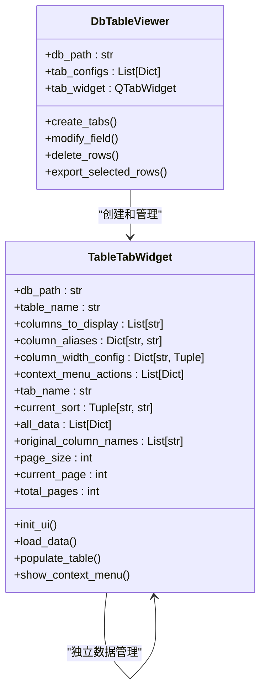

**图表来源**
- [SqlitePage.py:870-920](file://gui/SqlitePage.py#L870-L920)
- [SqlitePage.py:3521-3580](file://gui/SqlitePage.py#L3521-L3580)

#### 分页机制实现

系统实现了高效的分页机制，支持大数据量的快速浏览：

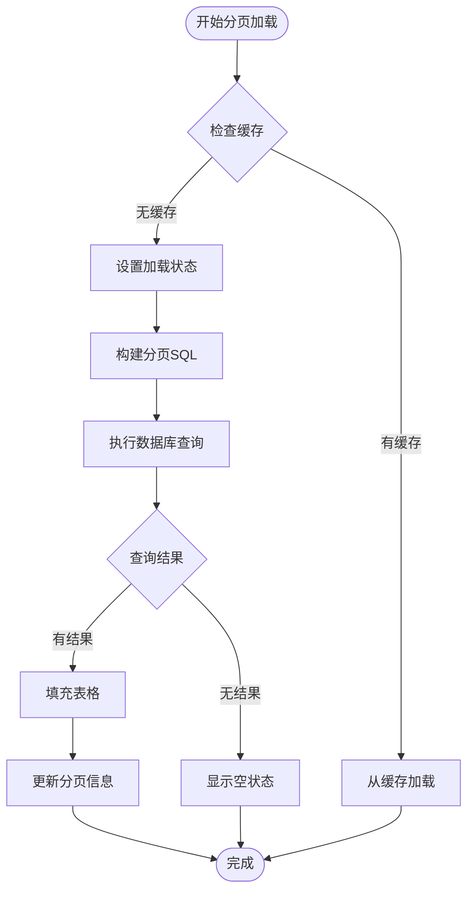

**图表来源**
- [SqlitePage.py:1268-1348](file://gui/SqlitePage.py#L1268-L1348)
- [SqlitePage.py:1449-1529](file://gui/SqlitePage.py#L1449-L1529)

**章节来源**
- [SqlitePage.py:870-920](file://gui/SqlitePage.py#L870-L920)
- [SqlitePage.py:1268-1348](file://gui/SqlitePage.py#L1268-L1348)

### 表格数据显示、编辑和删除功能

#### 数据显示优化

系统对表格显示进行了多项优化，包括：

1. **智能列宽管理**: 支持自动调整和手动调整列宽
2. **状态颜色显示**: 根据任务状态显示不同的颜色
3. **大数据量处理**: 使用批量更新和延迟渲染技术
4. **格式化显示**: 对JSON、日期等复杂数据类型进行格式化

#### 编辑功能实现

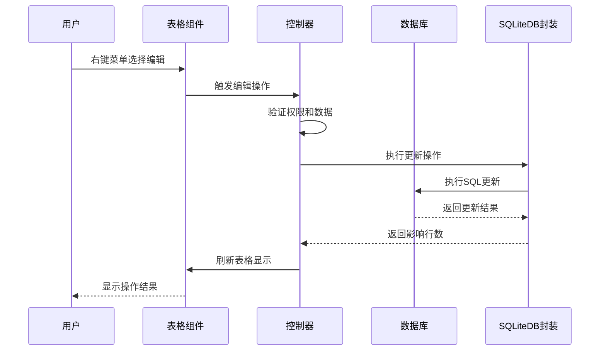

**图表来源**
- [SqlitePage.py:3581-3619](file://gui/SqlitePage.py#L3581-L3619)
- [SqlitePage.py:3723-3761](file://gui/SqlitePage.py#L3723-L3761)

#### 删除功能实现

系统提供了安全的删除机制，包含多重确认和权限验证：

**章节来源**
- [SqlitePage.py:3581-3619](file://gui/SqlitePage.py#L3581-L3619)
- [SqlitePage.py:3762-3804](file://gui/SqlitePage.py#L3762-L3804)

### 数据库连接管理和配置选项

#### 连接池管理

系统采用连接池模式管理数据库连接，支持多线程并发访问：

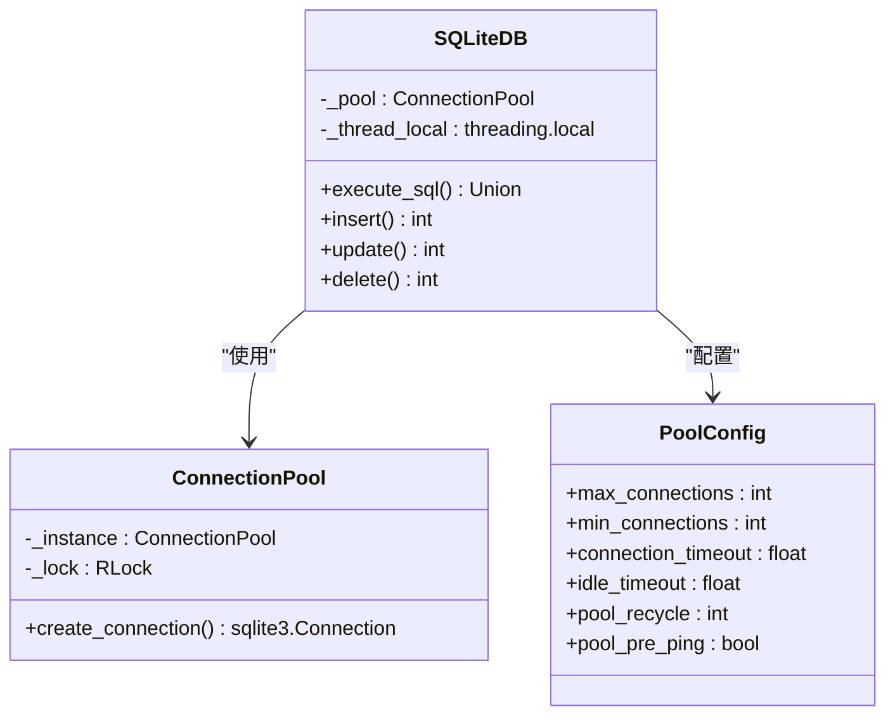

**图表来源**
- [classSQLite.py:294-330](file://modules/classSQLite.py#L294-L330)
- [classSQLite.py:372-420](file://modules/classSQLite.py#L372-L420)
- [classSQLite.py:30-40](file://modules/classSQLite.py#L30-L40)

#### 配置文件管理

系统支持多种数据库配置文件：

**主数据库配置** (`db_config.json`):
- 数据库路径: `./配置文件_系统配置/ikun.db`
- 连接超时: 30.0秒
- 缓存大小: -20000
- 日志模式: WAL
- 同步级别: NORMAL

**虎扑数据库配置** (`hupu_db_config.json`):
- 数据库路径: `./配置文件_系统配置/hupu.db`
- 配置与主数据库相同，用于存储虎扑相关数据

**章节来源**
- [classSQLite.py:294-330](file://modules/classSQLite.py#L294-L330)
- [db_config.json:1-19](file://配置文件_系统配置/db_config.json#L1-L19)
- [hupu_db_config.json:1-18](file://配置文件_系统配置/hupu_db_config.json#L1-L18)

### 上下文菜单的右键操作和批量处理功能

#### 右键菜单架构

系统实现了丰富的右键菜单功能，支持不同表类型的特定操作：

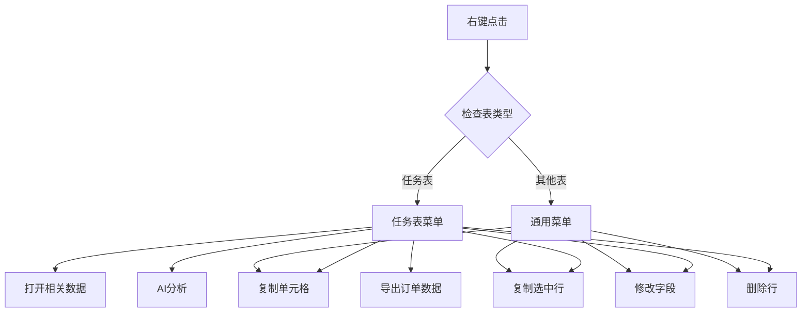

**图表来源**
- [SqlitePage.py:1768-1881](file://gui/SqlitePage.py#L1768-L1881)
- [SqlitePage.py:1897-2010](file://gui/SqlitePage.py#L1897-L2010)

#### 批量处理功能

系统支持多种批量操作：

1. **批量复制**: 支持复制多个选中行的数据
2. **批量修改**: 支持同时修改多个选中行的字段
3. **批量删除**: 支持一次性删除多个选中行
4. **批量导出**: 支持导出多个选中行的数据

**章节来源**
- [SqlitePage.py:1768-1881](file://gui/SqlitePage.py#L1768-L1881)
- [SqlitePage.py:3805-3854](file://gui/SqlitePage.py#L3805-L3854)

### 数据库查询和筛选功能

#### 高级搜索功能

系统提供了强大的搜索功能，支持多种搜索模式：

1. **模糊搜索**: 支持部分匹配和通配符搜索
2. **范围搜索**: 支持数值范围查询（如100-200）
3. **多条件组合**: 支持多个搜索条件的组合查询
4. **动态搜索**: 实时搜索和结果高亮

#### 搜索条件处理

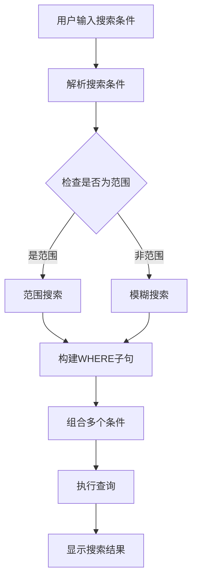

**图表来源**
- [SqlitePage.py:1229-1261](file://gui/SqlitePage.py#L1229-L1261)
- [SqlitePage.py:2434-2472](file://gui/SqlitePage.py#L2434-L2472)

**章节来源**
- [SqlitePage.py:1229-1261](file://gui/SqlitePage.py#L1229-L1261)
- [SqlitePage.py:2434-2472](file://gui/SqlitePage.py#L2434-L2472)

### 数据导出和备份功能

#### 导出格式支持

系统支持多种数据导出格式：

1. **Excel格式** (`.xlsx`): 使用pandas或openpyxl库
2. **CSV格式** (`.csv`): 标准CSV文件格式
3. **文本格式** (`.txt`): 制表符分隔的纯文本文件

#### 导出功能实现

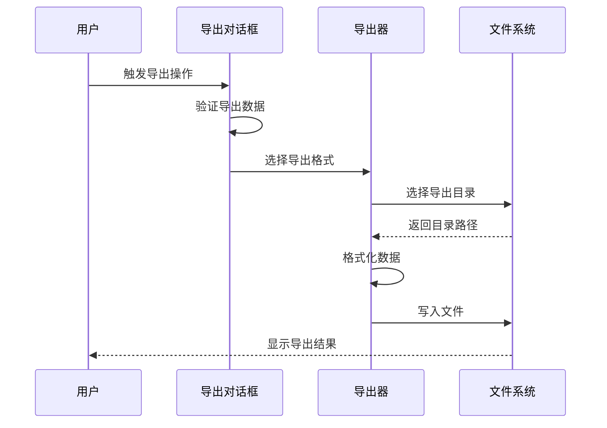

**图表来源**
- [SqlitePage.py:2434-2472](file://gui/SqlitePage.py#L2434-L2472)
- [SqlitePage.py:2473-2586](file://gui/SqlitePage.py#L2473-L2586)

#### 备份功能

系统提供了自动备份机制，支持：

1. **自动备份**: 定期自动备份数据库文件
2. **手动备份**: 支持用户手动触发备份操作
3. **增量备份**: 支持增量备份以节省存储空间
4. **备份验证**: 备份完成后自动验证备份文件完整性

**章节来源**
- [SqlitePage.py:2434-2472](file://gui/SqlitePage.py#L2434-L2472)
- [SqlitePage.py:2473-2586](file://gui/SqlitePage.py#L2473-L2586)

## 依赖关系分析

### 组件依赖图

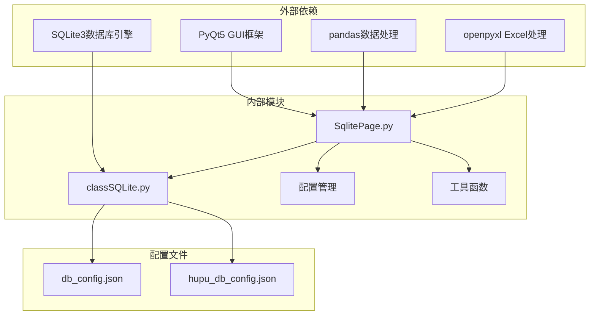

**图表来源**
- [SqlitePage.py:1-25](file://gui/SqlitePage.py#L1-L25)
- [classSQLite.py:1-30](file://modules/classSQLite.py#L1-L30)

### 数据库依赖关系

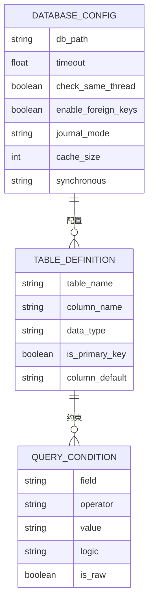

**图表来源**
- [db_config.json:1-19](file://配置文件_系统配置/db_config.json#L1-L19)
- [hupu_db_config.json:1-18](file://配置文件_系统配置/hupu_db_config.json#L1-L18)

**章节来源**
- [SqlitePage.py:1-25](file://gui/SqlitePage.py#L1-L25)
- [classSQLite.py:1-30](file://modules/classSQLite.py#L1-L30)

## 性能考虑

### 性能优化策略

系统采用了多项性能优化措施：

1. **连接池管理**: 使用连接池减少数据库连接开销
2. **异步查询**: 使用工作线程处理耗时的数据库操作
3. **分页加载**: 大数据量分页显示，避免内存溢出
4. **批量操作**: 支持批量插入和更新操作
5. **缓存机制**: 实现数据缓存减少重复查询

### 内存管理

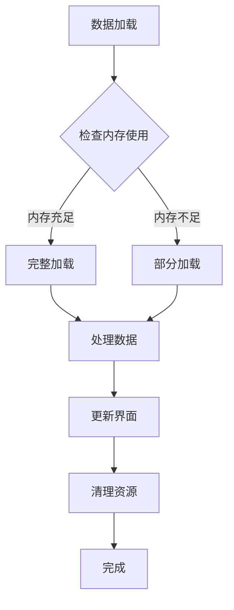

**图表来源**
- [SqlitePage.py:1660-1682](file://gui/SqlitePage.py#L1660-L1682)
- [SqlitePage.py:913-921](file://gui/SqlitePage.py#L913-L921)

### 并发处理

系统支持多线程并发处理，通过以下机制保证数据一致性：

1. **线程安全**: 使用锁机制保护共享资源
2. **异步操作**: 非阻塞的数据库操作
3. **状态同步**: 实时同步数据库状态变化
4. **错误处理**: 完善的异常处理和恢复机制

## 故障排除指南

### 常见问题及解决方案

#### 数据库连接问题

**问题**: 数据库连接失败
**解决方案**:
1. 检查数据库文件路径配置
2. 确认数据库文件权限设置
3. 验证数据库文件完整性
4. 检查数据库文件是否被其他程序占用

#### 性能问题

**问题**: 数据加载缓慢
**解决方案**:
1. 调整分页大小设置
2. 优化搜索条件
3. 关闭不必要的标签页
4. 检查系统内存使用情况

#### 内存泄漏问题

**问题**: 应用程序内存持续增长
**解决方案**:
1. 确保及时释放数据库连接
2. 检查事件循环中的循环引用
3. 使用弱引用避免循环引用
4. 定期清理临时对象

### 调试工具

系统提供了完善的调试工具：

1. **日志记录**: 详细的错误日志和操作日志
2. **状态监控**: 实时监控数据库连接状态
3. **性能分析**: 性能瓶颈分析工具
4. **内存监控**: 内存使用情况监控

**章节来源**
- [SqlitePage.py:1633-1648](file://gui/SqlitePage.py#L1633-L1648)
- [SqlitePage.py:3117-3144](file://gui/SqlitePage.py#L3117-L3144)

## 结论

数据库查看器是一个功能完善、架构清晰的数据库管理工具。通过采用现代化的设计模式和技术栈，系统实现了高性能、易扩展、用户友好的数据库管理功能。

### 主要优势

1. **模块化设计**: 清晰的分层架构，易于维护和扩展
2. **性能优化**: 多项性能优化措施，支持大数据量处理
3. **用户体验**: 直观的图形界面，丰富的交互功能
4. **安全性**: 完善的权限控制和数据保护机制
5. **可扩展性**: 支持自定义配置和功能扩展

### 技术特色

1. **多数据库支持**: 支持主数据库和虎扑数据库的分离管理
2. **异步处理**: 非阻塞的数据库操作，提升用户体验
3. **批量操作**: 支持高效的批量数据处理
4. **智能搜索**: 强大的搜索和筛选功能
5. **数据导出**: 多格式的数据导出功能

该系统为 ikun_temu_system 项目提供了强大的数据库管理能力，是整个系统的重要组成部分。通过持续的优化和完善，数据库查看器将继续为用户提供更好的数据库管理体验。