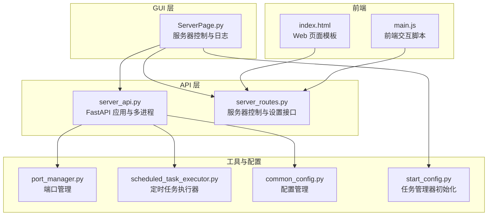
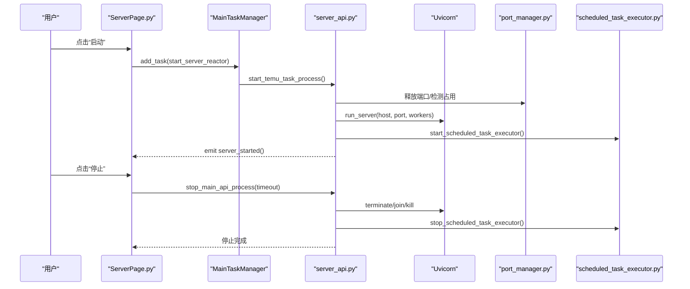
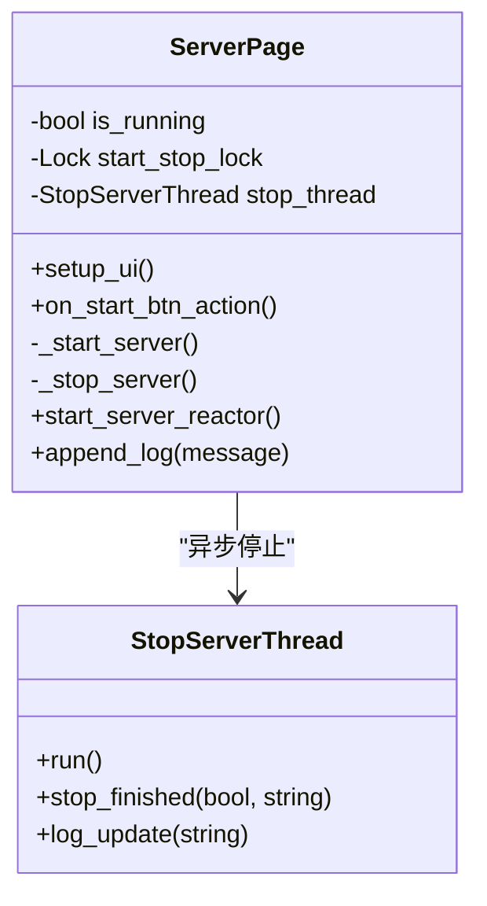
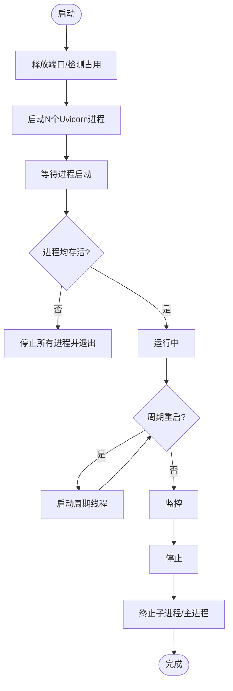
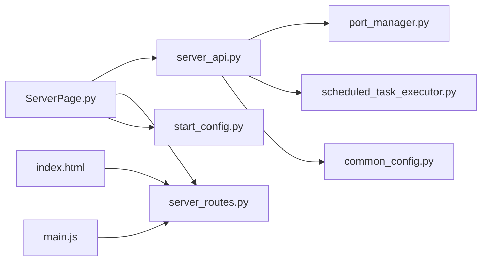

# 服务器页面

<cite>
**本文引用的文件**
- [ServerPage.py](file://gui/ServerPage.py)
- [server_api.py](file://api/server_api.py)
- [server_routes.py](file://api/server_routes/server_routes.py)
- [port_manager.py](file://lite_modules/port_manager.py)
- [python_process_killer.py](file://lite_modules/python_process_killer.py)
- [common_config.py](file://config/common_config.py)
- [start_config.py](file://config/start_config.py)
- [scheduled_task_executor.py](file://utils/scheduled_task_executor.py)
- [index.html](file://templates/index.html)
- [main.js](file://static/js/main.js)
</cite>

## 目录
1. [简介](#简介)
2. [项目结构](#项目结构)
3. [核心组件](#核心组件)
4. [架构总览](#架构总览)
5. [详细组件分析](#详细组件分析)
6. [依赖分析](#依赖分析)
7. [性能考虑](#性能考虑)
8. [故障排查指南](#故障排查指南)
9. [结论](#结论)
10. [附录](#附录)

## 简介
本文件面向 ikun_temu_system 的“服务器页面”，系统性阐述服务器管理界面的设计与实现，覆盖以下方面：
- FastAPI 服务器的启动、停止与状态监控机制
- 服务器配置参数的设置与管理
- 服务器状态指示器与日志显示功能
- 服务器页面与 API 服务的通信协议
- 服务器性能监控与资源使用展示
- 服务器故障诊断与错误处理机制
- 服务器页面的操作指南与故障排除方法

## 项目结构
服务器页面由桌面 GUI（PyQt5）与 Web API（FastAPI）协同组成：
- GUI 层：位于 gui/ServerPage.py，提供可视化配置与控制面板，负责启动/停止 FastAPI 进程、显示日志、持久化配置。
- API 层：位于 api/server_api.py，封装 FastAPI 应用、生命周期管理、多进程启动与停止、周期线程重启。
- 路由层：位于 api/server_routes/server_routes.py，提供服务器状态、设置读取/保存、启动/停止/重启等接口。
- 端口管理：位于 lite_modules/port_manager.py，提供端口检测、释放、进程终止等能力。
- 任务调度：位于 utils/scheduled_task_executor.py，提供定时任务执行器的启动/停止。
- 配置管理：位于 config/common_config.py、config/start_config.py，提供全局配置与任务管理器初始化。
- 前端模板与 JS：位于 templates/index.html、static/js/main.js，提供 Web 界面与与 API 的交互。

图表来源
- [ServerPage.py:118-602](file://gui/ServerPage.py#L118-L602)
- [server_api.py:122-474](file://api/server_api.py#L122-L474)
- [server_routes.py:17-289](file://api/server_routes/server_routes.py#L17-L289)
- [port_manager.py:17-338](file://lite_modules/port_manager.py#L17-L338)
- [scheduled_task_executor.py:18-242](file://utils/scheduled_task_executor.py#L18-L242)
- [common_config.py:15-394](file://config/common_config.py#L15-L394)
- [start_config.py:19-24](file://config/start_config.py#L19-L24)
- [index.html:1-200](file://templates/index.html#L1-L200)
- [main.js:7131-7169](file://static/js/main.js#L7131-L7169)

章节来源
- [ServerPage.py:118-602](file://gui/ServerPage.py#L118-L602)
- [server_api.py:122-474](file://api/server_api.py#L122-L474)
- [server_routes.py:17-289](file://api/server_routes/server_routes.py#L17-L289)
- [port_manager.py:17-338](file://lite_modules/port_manager.py#L17-L338)
- [scheduled_task_executor.py:18-242](file://utils/scheduled_task_executor.py#L18-L242)
- [common_config.py:15-394](file://config/common_config.py#L15-L394)
- [start_config.py:19-24](file://config/start_config.py#L19-L24)
- [index.html:1-200](file://templates/index.html#L1-L200)
- [main.js:7131-7169](file://static/js/main.js#L7131-L7169)

## 核心组件
- 服务器控制面板（GUI）：提供启动/停止按钮、IP/端口/进程数、Token、认证开关、线程模式、运行模式、重启间隔等配置项，并实时显示日志。
- FastAPI 服务器：多进程运行，支持 Worker 数配置、生命周期管理、CORS、静态资源与模板挂载。
- 服务器控制接口：提供状态查询、设置读取/保存、启动/停止/重启等 API。
- 端口管理：检测/释放端口，必要时强制终止占用进程。
- 任务调度执行器：定时任务执行器的启动/停止，配合任务管理器。
- 配置持久化：通过配置管理器将 GUI 与 API 的配置持久化到数据库。

章节来源
- [ServerPage.py:150-352](file://gui/ServerPage.py#L150-L352)
- [server_api.py:122-247](file://api/server_api.py#L122-L247)
- [server_routes.py:91-289](file://api/server_routes/server_routes.py#L91-L289)
- [port_manager.py:17-201](file://lite_modules/port_manager.py#L17-L201)
- [scheduled_task_executor.py:18-73](file://utils/scheduled_task_executor.py#L18-L73)
- [common_config.py:201-334](file://config/common_config.py#L201-L334)

## 架构总览
服务器页面的启动/停止/状态监控流程如下：

图表来源
- [ServerPage.py:473-500](file://gui/ServerPage.py#L473-L500)
- [server_api.py:454-462](file://api/server_api.py#L454-L462)
- [server_api.py:249-316](file://api/server_api.py#L249-L316)
- [server_api.py:214-247](file://api/server_api.py#L214-L247)
- [port_manager.py:176-201](file://lite_modules/port_manager.py#L176-L201)
- [scheduled_task_executor.py:217-235](file://utils/scheduled_task_executor.py#L217-L235)

## 详细组件分析

### GUI 服务器控制面板（ServerPage）
- 控件与布局：包含启动/停止按钮、内网IP/公网IP/端口/进程数、Token、认证开关、线程模式、运行模式、重启间隔、日志显示区与清空按钮。
- 并发控制：使用线程锁与互斥锁防止重复启动/停止；异步线程执行停止逻辑，避免阻塞 UI。
- 配置持久化：编辑框变更时即时保存到配置管理器；启动前清理残留进程；启动后触发“服务器已启动”信号。
- 日志显示：带时间戳的文本框，自动滚动至最新日志。

图表来源
- [ServerPage.py:118-180](file://gui/ServerPage.py#L118-L180)
- [ServerPage.py:448-471](file://gui/ServerPage.py#L448-L471)
- [ServerPage.py:473-500](file://gui/ServerPage.py#L473-L500)

章节来源
- [ServerPage.py:150-352](file://gui/ServerPage.py#L150-L352)
- [ServerPage.py:353-471](file://gui/ServerPage.py#L353-L471)
- [ServerPage.py:473-500](file://gui/ServerPage.py#L473-L500)

### FastAPI 服务器启动与停止（server_api）
- 多进程启动：根据配置的进程数与每进程 Worker 数，启动多个 Uvicorn 进程。
- 生命周期管理：使用 lifespan 管理任务管理器的启动/停止。
- 端口释放：启动前释放目标端口，必要时强制终止占用进程。
- 停止策略：递归终止子进程，等待 join，超时则强制 kill；清理进程列表。
- 周期线程：按配置的重启间隔启动/停止周期线程，实现定时重启。

图表来源
- [server_api.py:139-247](file://api/server_api.py#L139-L247)
- [server_api.py:249-316](file://api/server_api.py#L249-L316)
- [server_api.py:349-412](file://api/server_api.py#L349-L412)
- [port_manager.py:176-201](file://lite_modules/port_manager.py#L176-L201)

章节来源
- [server_api.py:122-247](file://api/server_api.py#L122-L247)
- [server_api.py:249-316](file://api/server_api.py#L249-L316)
- [server_api.py:349-412](file://api/server_api.py#L349-L412)
- [port_manager.py:176-201](file://lite_modules/port_manager.py#L176-L201)

### 服务器控制与设置接口（server_routes）
- 状态接口：返回服务器运行状态、启动时间、运行时长等。
- 设置接口：读取/保存服务器配置（IP、端口、进程数、Worker 数、Token、认证开关、线程模式、运行模式、重启间隔、CDN 模式、音乐设置等）。
- 控制接口：启动/停止/重启服务器（当前实现为返回成功消息，实际由 GUI 调用 API 层执行）。

章节来源
- [server_routes.py:91-289](file://api/server_routes/server_routes.py#L91-L289)

### 端口管理（port_manager）
- 端口检测：尝试绑定以判断是否被占用。
- 进程终止：根据 PID 终止进程及其子进程，支持强制终止。
- 端口释放：Windows 下优先使用命令行方式，其次调用进程终止；非 Windows 直接终止监听进程；验证释放结果。

章节来源
- [port_manager.py:17-201](file://lite_modules/port_manager.py#L17-L201)

### 定时任务执行器（scheduled_task_executor）
- 启动/停止：线程守护，可中断睡眠；执行定时任务并更新下次执行时间。
- 任务重跑：通过任务 ID 触发重跑，权限校验后执行。

章节来源
- [scheduled_task_executor.py:18-73](file://utils/scheduled_task_executor.py#L18-L73)
- [scheduled_task_executor.py:94-162](file://utils/scheduled_task_executor.py#L94-L162)

### 配置管理与任务管理器（common_config、start_config）
- 配置管理：SQLiteDB + ConfigManager，提供配置的读取/写入/初始化。
- 任务管理器：MainTaskManager 初始化并启动，作为 GUI 与 API 的任务调度中枢。

章节来源
- [common_config.py:201-334](file://config/common_config.py#L201-L334)
- [start_config.py:19-24](file://config/start_config.py#L19-L24)

### 前端模板与交互（index.html、main.js）
- 模板：提供服务器控制区、进程列表、设置区等。
- 交互：通过 main.js 发起 /api/start_server、/api/stop_server、/api/restart_server、/api/get_settings、/api/save_settings 等请求，更新页面状态与日志。

章节来源
- [index.html:851-882](file://templates/index.html#L851-L882)
- [main.js:7131-7169](file://static/js/main.js#L7131-L7169)

## 依赖分析
- GUI 依赖 API 层：ServerPage 通过任务管理器调用 API 层的启动/停止函数。
- API 依赖端口管理与定时任务执行器：启动前释放端口，启动后启动定时任务执行器。
- 配置依赖：GUI 与 API 的配置均通过配置管理器持久化到数据库。

图表来源
- [ServerPage.py:16-21](file://gui/ServerPage.py#L16-L21)
- [server_api.py:22-27](file://api/server_api.py#L22-L27)
- [server_routes.py:8-9](file://api/server_routes/server_routes.py#L8-L9)
- [port_manager.py:13-14](file://lite_modules/port_manager.py#L13-L14)
- [scheduled_task_executor.py:12-15](file://utils/scheduled_task_executor.py#L12-L15)
- [common_config.py:11-12](file://config/common_config.py#L11-L12)
- [start_config.py:15](file://config/start_config.py#L15)
- [index.html:1-200](file://templates/index.html#L1-L200)
- [main.js:7131-7169](file://static/js/main.js#L7131-L7169)

章节来源
- [ServerPage.py:16-21](file://gui/ServerPage.py#L16-L21)
- [server_api.py:22-27](file://api/server_api.py#L22-L27)
- [server_routes.py:8-9](file://api/server_routes/server_routes.py#L8-L9)
- [port_manager.py:13-14](file://lite_modules/port_manager.py#L13-L14)
- [scheduled_task_executor.py:12-15](file://utils/scheduled_task_executor.py#L12-L15)
- [common_config.py:11-12](file://config/common_config.py#L11-L12)
- [start_config.py:15](file://config/start_config.py#L15)
- [index.html:1-200](file://templates/index.html#L1-L200)
- [main.js:7131-7169](file://static/js/main.js#L7131-L7169)

## 性能考虑
- 多进程与 Worker：通过进程数与每进程 Worker 数提升并发处理能力，但需合理分配 CPU 与内存资源。
- 端口占用检测与释放：启动前释放端口，减少启动失败概率；必要时强制终止占用进程，避免长时间阻塞。
- 日志与 UI：日志追加与滚动采用延时，避免频繁 UI 刷新造成卡顿。
- 定时任务执行器：采用可中断睡眠，降低资源占用。

章节来源
- [server_api.py:214-247](file://api/server_api.py#L214-L247)
- [server_api.py:349-412](file://api/server_api.py#L349-L412)
- [ServerPage.py:528-535](file://gui/ServerPage.py#L528-L535)
- [scheduled_task_executor.py:43-56](file://utils/scheduled_task_executor.py#L43-L56)

## 故障排查指南
- 启动失败（端口被占用）
  - 现象：启动后进程立即退出或日志提示端口占用。
  - 处理：检查端口占用进程，使用端口管理器释放端口；必要时强制终止占用进程。
  - 参考
    - [server_api.py:169-211](file://api/server_api.py#L169-L211)
    - [port_manager.py:176-201](file://lite_modules/port_manager.py#L176-L201)
- 停止超时或进程残留
  - 现象：停止后仍有进程或线程未退出。
  - 处理：检查停止逻辑的超时与强制终止分支；确认任务管理器清理任务；必要时手动终止残留进程。
  - 参考
    - [server_api.py:249-316](file://api/server_api.py#L249-L316)
    - [ServerPage.py:448-471](file://gui/ServerPage.py#L448-L471)
- 重启不生效
  - 现象：设置了重启间隔但未自动重启。
  - 处理：确认周期线程已启动；检查配置项“ServerPage_restart_interval”的值；查看日志中周期线程的启动与退出信息。
  - 参考
    - [server_api.py:349-412](file://api/server_api.py#L349-L412)
- 日志不显示或乱码
  - 现象：日志未显示或出现乱码。
  - 处理：检查日志输出编码；确认 UI 文本框的样式与滚动逻辑；检查前端请求是否成功。
  - 参考
    - [ServerPage.py:327-352](file://gui/ServerPage.py#L327-L352)
    - [main.js:7131-7169](file://static/js/main.js#L7131-L7169)
- Python 进程残留
  - 现象：系统中存在遗留的 Python 进程。
  - 处理：使用进程清理工具终止遗留进程。
  - 参考
    - [python_process_killer.py:6-43](file://lite_modules/python_process_killer.py#L6-L43)

章节来源
- [server_api.py:169-211](file://api/server_api.py#L169-L211)
- [server_api.py:249-316](file://api/server_api.py#L249-L316)
- [server_api.py:349-412](file://api/server_api.py#L349-L412)
- [ServerPage.py:327-352](file://gui/ServerPage.py#L327-L352)
- [main.js:7131-7169](file://static/js/main.js#L7131-L7169)
- [python_process_killer.py:6-43](file://lite_modules/python_process_killer.py#L6-L43)

## 结论
服务器页面通过 GUI 与 API 的紧密协作，提供了完整的服务器启动/停止/监控与配置管理能力。其设计强调：
- 并发安全与异步化：避免 UI 阻塞，保障用户体验。
- 端口与进程治理：启动前释放端口，停止时递归终止进程，提高稳定性。
- 配置持久化与一致性：GUI 与 API 的配置通过统一的配置管理器持久化，确保状态一致。
- 可扩展性：支持多进程、多 Worker、定时任务等扩展能力。

## 附录

### 服务器页面操作指南
- 启动服务器
  - 在“服务器”分组框中设置内网IP、公网IP、端口、进程数、Token、认证开关、线程模式、运行模式、重启间隔。
  - 点击“启动”按钮，等待服务器启动完成并显示日志。
  - 参考
    - [ServerPage.py:362-439](file://gui/ServerPage.py#L362-L439)
- 停止服务器
  - 点击“停止”按钮，系统将异步停止服务器并清理资源。
  - 参考
    - [ServerPage.py:448-471](file://gui/ServerPage.py#L448-L471)
- 查看日志
  - 在“日志”分组框中查看实时日志，支持清空。
  - 参考
    - [ServerPage.py:327-352](file://gui/ServerPage.py#L327-L352)
- 配置管理
  - 通过“服务器”分组框的下拉框与输入框修改配置，系统将自动保存。
  - 参考
    - [ServerPage.py:181-217](file://gui/ServerPage.py#L181-L217)

### 服务器页面与 API 通信协议
- GET /api/server_status：获取服务器状态（运行中、启动时间、运行时长）。
- GET /api/get_settings：获取服务器配置。
- POST /api/save_settings：保存服务器配置。
- POST /api/start_server：启动服务器（当前实现为返回成功消息，实际由 GUI 调用 API 层执行）。
- POST /api/stop_server：停止服务器（当前实现为返回成功消息，实际由 GUI 调用 API 层执行）。
- POST /api/restart_server：重启服务器（当前实现为返回成功消息，实际由 GUI 调用 API 层执行）。
- 参考
  - [server_routes.py:91-289](file://api/server_routes/server_routes.py#L91-L289)
  - [main.js:7131-7169](file://static/js/main.js#L7131-L7169)