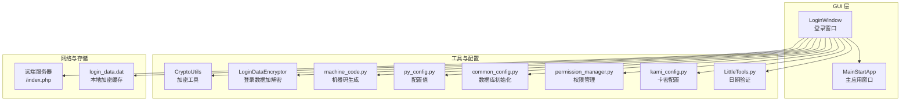
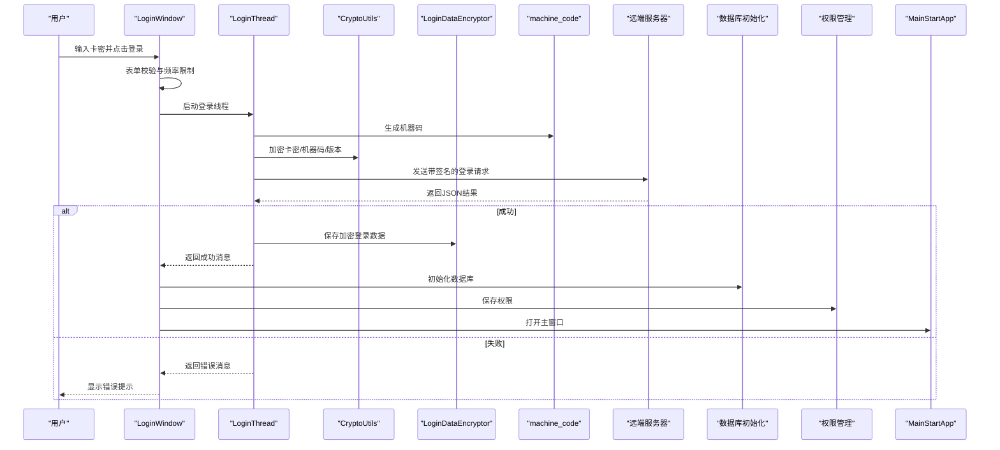
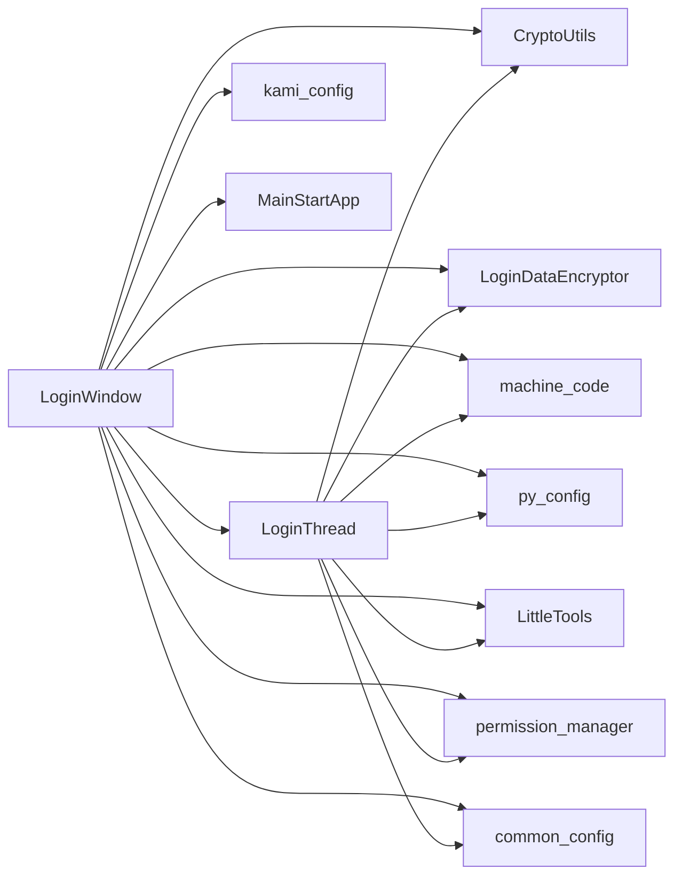
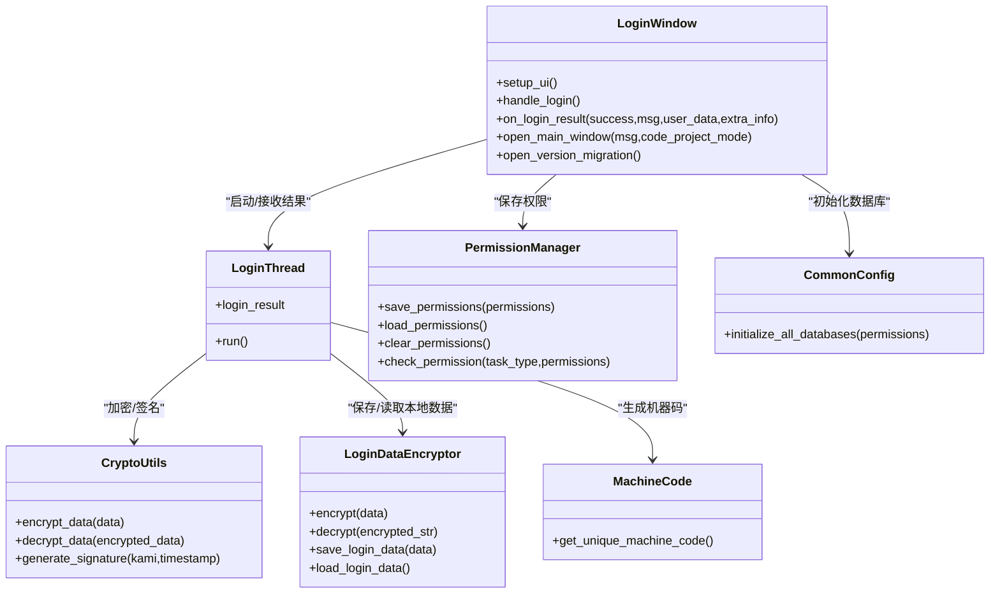
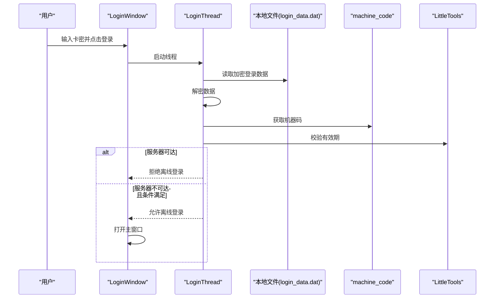

# 登录页面

<cite>
**本文档引用的文件**
- [LoginPage.py](file://gui/LoginPage.py)
- [MainApp.py](file://gui/MainApp.py)
- [encryptData.py](file://gui/utils/encryptData.py)
- [jiami.py](file://gui/utils/jiami.py)
- [machine_code.py](file://modules/machine_code.py)
- [py_config.py](file://config/py_config.py)
- [common_config.py](file://config/common_config.py)
- [permission_manager.py](file://config/permission_manager.py)
- [login_data.dat](file://config/login_data.dat)
- [kami_config.py](file://config/kami_config.py)
- [LittleTools.py](file://lite_modules/LittleTools.py)
- [common.qss](file://gui/static/qss/common.qss)
- [button.qss](file://gui/static/qss/button.qss)
- [test2_login.py](file://test2_login.py)
- [test1_download_caiwu.py](file://test1_download_caiwu.py)
</cite>

## 目录
1. [简介](#简介)
2. [项目结构](#项目结构)
3. [核心组件](#核心组件)
4. [架构总览](#架构总览)
5. [详细组件分析](#详细组件分析)
6. [依赖分析](#依赖分析)
7. [性能考虑](#性能考虑)
8. [故障排查指南](#故障排查指南)
9. [结论](#结论)
10. [附录](#附录)

## 简介
本文件面向 ikun_temu_system 的登录页面，系统性阐述登录界面设计、认证流程、权限验证、表单控件布局与交互逻辑、密码加密与安全校验、登录成功后的界面跳转与权限初始化、样式定制与用户体验优化、错误处理与用户反馈机制，以及测试与调试方法。文档旨在帮助开发者与测试人员快速理解并高效维护登录模块。

## 项目结构
登录页面位于 GUI 层，核心文件包括登录窗口、线程处理、加密工具、机器码生成、配置与权限管理等模块。整体采用 PyQt5 界面层 + 线程异步网络请求 + 本地加密缓存 + 权限持久化的分层设计。

**图表来源**
- [LoginPage.py:209-586](file://gui/LoginPage.py#L209-L586)
- [MainApp.py:179-800](file://gui/MainApp.py#L179-L800)
- [encryptData.py:13-37](file://gui/utils/encryptData.py#L13-L37)
- [jiami.py:13-256](file://gui/utils/jiami.py#L13-L256)
- [machine_code.py:59-183](file://modules/machine_code.py#L59-L183)
- [py_config.py:4-93](file://config/py_config.py#L4-L93)
- [common_config.py:245-334](file://config/common_config.py#L245-L334)
- [permission_manager.py:12-126](file://config/permission_manager.py#L12-L126)
- [kami_config.py:6-56](file://config/kami_config.py#L6-L56)
- [LittleTools.py:57-93](file://lite_modules/LittleTools.py#L57-L93)

**章节来源**
- [LoginPage.py:209-586](file://gui/LoginPage.py#L209-L586)
- [py_config.py:4-93](file://config/py_config.py#L4-L93)

## 核心组件
- 登录窗口 LoginWindow：负责 UI 布局、表单交互、登录按钮防抖、线程调度与结果回调。
- 登录线程 LoginThread：负责网络请求、签名生成、数据加解密、离线/在线登录策略、错误上报。
- 加密工具 CryptoUtils：提供 AES/CBC 加密、解密与 HMAC-SHA256 签名。
- 登录数据加密器 LoginDataEncryptor：负责本地登录数据的加密存储与解密读取。
- 机器码生成 machine_code.py：生成稳定的设备指纹，用于绑定与校验。
- 配置与权限 common_config.py、permission_manager.py：统一数据库初始化、权限持久化与加载。
- 卡密配置 kami_config.py：保存/读取卡密，支持自动登录。
- 日期验证 LittleTools.py：基于互联网时间的到期校验，保证跨平台一致性。

**章节来源**
- [LoginPage.py:24-186](file://gui/LoginPage.py#L24-L186)
- [encryptData.py:13-37](file://gui/utils/encryptData.py#L13-L37)
- [jiami.py:13-89](file://gui/utils/jiami.py#L13-L89)
- [machine_code.py:59-183](file://modules/machine_code.py#L59-L183)
- [common_config.py:245-334](file://config/common_config.py#L245-L334)
- [permission_manager.py:12-126](file://config/permission_manager.py#L12-L126)
- [kami_config.py:6-56](file://config/kami_config.py#L6-L56)
- [LittleTools.py:57-93](file://lite_modules/LittleTools.py#L57-L93)

## 架构总览
登录流程分为“在线验证”和“离线登录”两条路径，均通过 LoginThread 异步执行，LoginWindow 负责 UI 与用户交互。成功后初始化数据库与权限，再打开主应用窗口。

**图表来源**
- [LoginPage.py:345-461](file://gui/LoginPage.py#L345-L461)
- [LoginPage.py:33-186](file://gui/LoginPage.py#L33-L186)
- [encryptData.py:16-37](file://gui/utils/encryptData.py#L16-L37)
- [jiami.py:58-89](file://gui/utils/jiami.py#L58-L89)
- [machine_code.py:59-114](file://modules/machine_code.py#L59-L114)
- [common_config.py:245-334](file://config/common_config.py#L245-L334)
- [permission_manager.py:16-55](file://config/permission_manager.py#L16-L55)
- [MainApp.py:179-800](file://gui/MainApp.py#L179-L800)

## 详细组件分析

### 登录窗口 LoginWindow
- 布局与控件
  - 标题标签、表单帧、卡密输入框、版本迁移按钮、登录按钮。
  - 使用样式表设置字体、颜色、圆角与悬停效果。
  - 支持窗口大小变化时背景图自适应。
- 交互逻辑
  - 登录按钮点击触发 handle_login：表单校验、频率限制、禁用控件、启动 LoginThread。
  - on_login_result：根据返回结果处理成功/失败、版本过低、权限保存、数据库初始化、打开主窗口。
  - open_version_migration：打开版本迁移窗口并关闭登录窗口。
  - open_main_window：法律声明弹窗，用户同意后进入主应用。
- 自动登录
  - 若配置开启，启动时自动填充卡密并触发登录。

**章节来源**
- [LoginPage.py:240-338](file://gui/LoginPage.py#L240-L338)
- [LoginPage.py:345-461](file://gui/LoginPage.py#L345-L461)
- [LoginPage.py:462-490](file://gui/LoginPage.py#L462-L490)
- [LoginPage.py:491-532](file://gui/LoginPage.py#L491-L532)
- [LoginPage.py:225-238](file://gui/LoginPage.py#L225-L238)

### 登录线程 LoginThread
- 在线验证流程
  - 生成时间戳与签名，加密卡密、机器码、版本号，POST 请求远端接口。
  - 解析 JSON，处理版本过低、卡密无效、数据处理异常等错误。
  - 成功后解密返回的用户数据，校验有效期，保存本地登录数据。
- 离线登录流程（当卡密为特定值时）
  - 仅在服务器不可达且设备联网条件下允许。
  - 读取本地加密数据，校验机器码与有效期，允许离线登录。
- 错误处理
  - 网络异常、签名/加密失败、服务器非 200、JSON 解析失败等均有明确提示。

**章节来源**
- [LoginPage.py:33-186](file://gui/LoginPage.py#L33-L186)

### 加密与签名机制
- CryptoUtils
  - AES-256-CBC 加密/解密，IV 固定；HMAC-SHA256 签名，时间戳窗口控制。
- LoginDataEncryptor
  - 本地登录数据加密存储，支持读取/写入，文件路径来自配置。
- LoginWindow 在线流程中对卡密、机器码、版本号分别加密并签名，确保传输安全。

**章节来源**
- [encryptData.py:13-37](file://gui/utils/encryptData.py#L13-L37)
- [jiami.py:13-89](file://gui/utils/jiami.py#L13-L89)
- [LoginPage.py:112-123](file://gui/LoginPage.py#L112-L123)

### 机器码与绑定校验
- machine_code.py
  - 通过 WMI/系统接口组合 CPU、磁盘、显卡、MAC、UUID 等信息生成稳定指纹。
  - 支持缓存，避免重复获取。
- LoginThread
  - 在线登录时将机器码与卡密一起发送；离线登录时校验机器码一致性。

**章节来源**
- [machine_code.py:59-183](file://modules/machine_code.py#L59-L183)
- [LoginPage.py:72-80](file://gui/LoginPage.py#L72-L80)

### 权限验证与初始化
- 权限保存
  - 登录成功后将权限列表保存至数据库配置项，供后续功能模块使用。
- 数据库初始化
  - 根据权限决定初始化 ikun 或 hupu 数据库，创建表结构与锁文件。
- 主窗口加载
  - MainStartApp 读取权限并据此显示/启用相应功能页签与按钮。

**章节来源**
- [permission_manager.py:16-55](file://config/permission_manager.py#L16-L55)
- [common_config.py:245-334](file://config/common_config.py#L245-L334)
- [MainApp.py:576-584](file://gui/MainApp.py#L576-L584)

### 表单控件布局与样式
- 控件
  - 卡密输入框：占位符、样式、字号与权重。
  - 版本迁移按钮：黄色主题，悬停变深色。
  - 登录按钮：蓝色主题，悬停变深蓝。
- 布局
  - 标题居中、表单帧居中、按钮水平等比分布。
- 样式来源
  - 通过内联样式表与公共 QSS 文件共同实现。

**章节来源**
- [LoginPage.py:254-337](file://gui/LoginPage.py#L254-L337)
- [common.qss:1-117](file://gui/static/qss/common.qss#L1-L117)
- [button.qss:1-54](file://gui/static/qss/button.qss#L1-L54)

### 登录成功后的界面跳转与权限初始化
- 法律声明弹窗：展示登录成功提示与卡密剩余天数，用户同意后进入主窗口。
- 权限初始化：保存权限到数据库，启动定时任务执行器，确保权限生效。
- 主窗口：根据权限动态构建导航与功能页签。

**章节来源**
- [LoginPage.py:462-490](file://gui/LoginPage.py#L462-L490)
- [permission_manager.py:16-55](file://config/permission_manager.py#L16-L55)
- [MainApp.py:576-584](file://gui/MainApp.py#L576-L584)

### 错误处理与用户反馈
- 登录失败
  - 版本过低：弹出更新对话框，支持打开官网。
  - 卡密无效/过期：提示具体原因。
  - 网络异常：提示联网状态或离线卡密登录方式。
- 频率限制
  - 2 秒内最多 3 次请求，避免滥用。
- 本地异常
  - 读取/写入配置文件失败、解密失败等均有明确提示。

**章节来源**
- [LoginPage.py:351-353](file://gui/LoginPage.py#L351-L353)
- [LoginPage.py:456-460](file://gui/LoginPage.py#L456-L460)
- [LoginPage.py:515-532](file://gui/LoginPage.py#L515-L532)

## 依赖分析
- LoginWindow 依赖 LoginThread、RateLimiter、CryptoUtils、LoginDataEncryptor、machine_code、py_config、kami_config、LittleTools、permission_manager、common_config、MainStartApp。
- LoginThread 依赖 requests、CryptoUtils、LoginDataEncryptor、machine_code、py_config、LittleTools、permission_manager、common_config。
- 加密工具与配置贯穿登录流程，确保数据安全与版本一致性。

**图表来源**
- [LoginPage.py:24-186](file://gui/LoginPage.py#L24-L186)
- [LoginPage.py:209-586](file://gui/LoginPage.py#L209-L586)
- [encryptData.py:13-37](file://gui/utils/encryptData.py#L13-L37)
- [jiami.py:13-89](file://gui/utils/jiami.py#L13-L89)
- [machine_code.py:59-183](file://modules/machine_code.py#L59-L183)
- [py_config.py:4-93](file://config/py_config.py#L4-L93)
- [kami_config.py:6-56](file://config/kami_config.py#L6-L56)
- [LittleTools.py:57-93](file://lite_modules/LittleTools.py#L57-L93)
- [permission_manager.py:12-126](file://config/permission_manager.py#L12-L126)
- [common_config.py:245-334](file://config/common_config.py#L245-L334)
- [MainApp.py:179-800](file://gui/MainApp.py#L179-L800)

**章节来源**
- [LoginPage.py:209-586](file://gui/LoginPage.py#L209-L586)

## 性能考虑
- 异步登录：使用 QThread 避免 UI 阻塞，提升响应速度。
- 速率限制：2 秒 3 次请求，降低服务器压力与风控风险。
- 本地缓存：登录数据加密存储于本地，减少重复网络请求。
- 数据库懒加载：按权限初始化对应数据库，避免不必要的初始化开销。
- 机器码缓存：避免重复生成，提高登录效率。

[本节为通用指导，无需列出具体文件来源]

## 故障排查指南
- 登录失败
  - 检查网络连通性与服务器状态；若服务器可达，离线卡密将被拒绝。
  - 核对卡密是否正确、是否过期；使用有效期验证工具确认。
- 本地数据异常
  - 清理 login_data.dat 后重新登录；确认 LoginDataEncryptor 能正常读取/写入。
- 权限未生效
  - 确认 permission_manager 已保存权限；重启应用后权限应立即生效。
- UI 交互异常
  - 检查按钮状态是否被禁用；确认频率限制是否触发。
- 自动登录失败
  - 检查 kami_config 中卡密是否正确；确认 auto_login 配置项。

**章节来源**
- [LoginPage.py:345-461](file://gui/LoginPage.py#L345-L461)
- [LittleTools.py:57-93](file://lite_modules/LittleTools.py#L57-L93)
- [jiami.py:69-89](file://gui/utils/jiami.py#L69-L89)
- [permission_manager.py:16-55](file://config/permission_manager.py#L16-L55)
- [kami_config.py:38-45](file://config/kami_config.py#L38-L45)

## 结论
登录页面通过严谨的加密签名、严格的机器码绑定、灵活的在线/离线登录策略、完善的权限与数据库初始化机制，实现了安全、稳定、易用的用户认证体验。配合清晰的错误反馈与性能优化，能够满足复杂业务场景下的登录需求。

[本节为总结性内容，无需列出具体文件来源]

## 附录

### 登录流程类图

**图表来源**
- [LoginPage.py:24-186](file://gui/LoginPage.py#L24-L186)
- [LoginPage.py:209-586](file://gui/LoginPage.py#L209-L586)
- [encryptData.py:13-37](file://gui/utils/encryptData.py#L13-L37)
- [jiami.py:13-89](file://gui/utils/jiami.py#L13-L89)
- [machine_code.py:59-183](file://modules/machine_code.py#L59-L183)
- [permission_manager.py:12-126](file://config/permission_manager.py#L12-L126)
- [common_config.py:245-334](file://config/common_config.py#L245-L334)

### 登录流程时序图（离线登录）

**图表来源**
- [LoginPage.py:47-99](file://gui/LoginPage.py#L47-L99)
- [login_data.dat:1-1](file://config/login_data.dat#L1-L1)
- [machine_code.py:59-114](file://modules/machine_code.py#L59-L114)
- [LittleTools.py:57-93](file://lite_modules/LittleTools.py#L57-L93)

### 测试与调试建议
- 单元测试
  - 使用 LoginDataEncryptor 的测试入口验证加解密与文件读写。
  - 使用 LittleTools 的 check_date_validation_by_config 验证有效期逻辑。
- 集成测试
  - 使用 test2_login.py 与 test1_download_caiwu.py 模拟登录与数据下载流程，验证权限与会话有效性。
- 调试技巧
  - 打开日志输出，定位网络请求与异常栈。
  - 临时禁用速率限制与本地缓存，验证服务端逻辑。
  - 使用不同卡密与机器码组合，覆盖边界场景。

**章节来源**
- [jiami.py:90-256](file://gui/utils/jiami.py#L90-L256)
- [LittleTools.py:95-115](file://lite_modules/LittleTools.py#L95-L115)
- [test2_login.py:1-56](file://test2_login.py#L1-L56)
- [test1_download_caiwu.py:1-90](file://test1_download_caiwu.py#L1-L90)