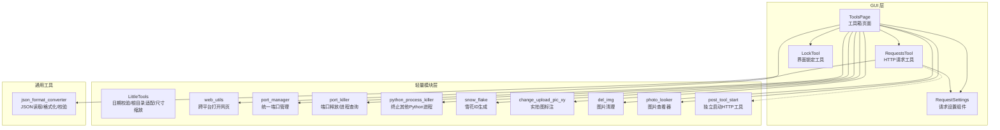
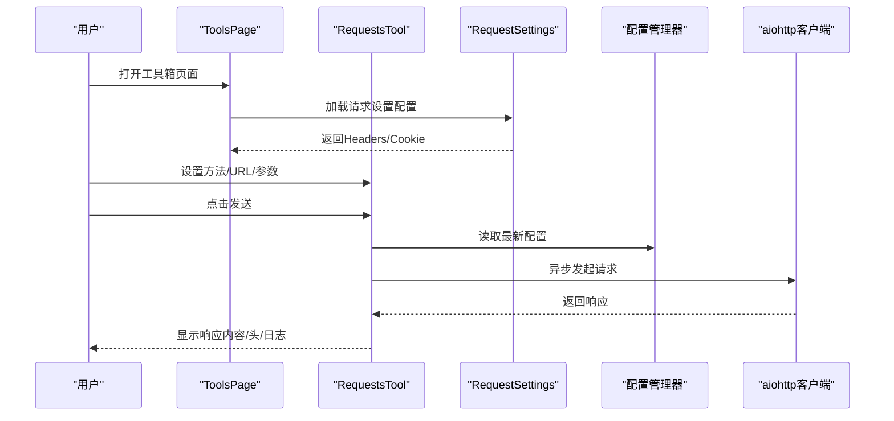
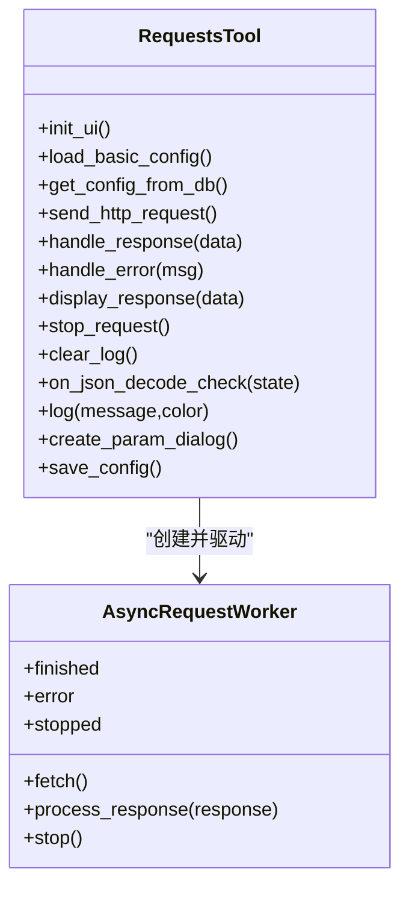
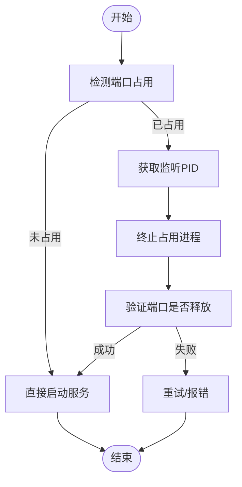
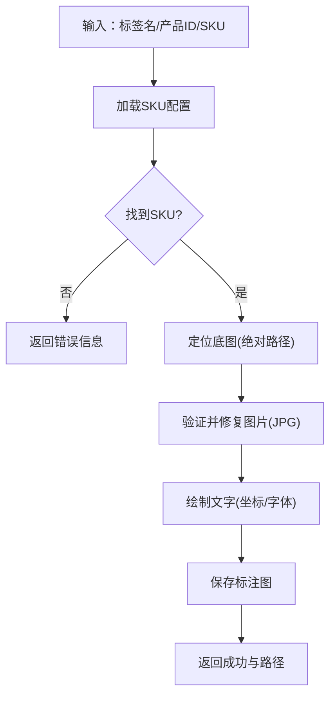
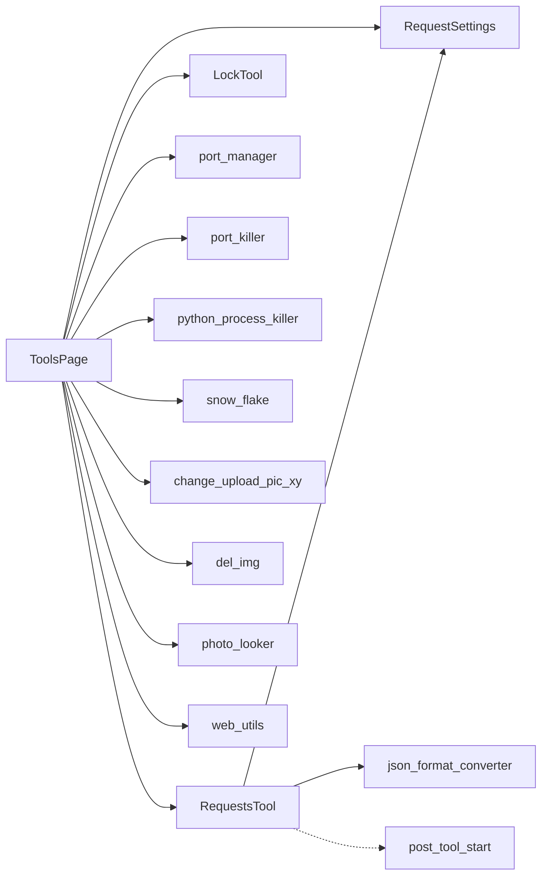

# 工具箱功能

<cite>
**本文档引用的文件**
- [lite_modules/LittleTools.py](file://lite_modules/LittleTools.py)
- [gui/ToolsPage.py](file://gui/ToolsPage.py)
- [gui/RequestsTool.py](file://gui/RequestsTool.py)
- [gui/RequestSettings.py](file://gui/RequestSettings.py)
- [gui/LockTool.py](file://gui/LockTool.py)
- [modules/json_format_converter.py](file://modules/json_format_converter.py)
- [lite_modules/web_utils.py](file://lite_modules/web_utils.py)
- [lite_modules/port_manager.py](file://lite_modules/port_manager.py)
- [lite_modules/port_killer.py](file://lite_modules/port_killer.py)
- [lite_modules/python_process_killer.py](file://lite_modules/python_process_killer.py)
- [lite_modules/snow_flake.py](file://lite_modules/snow_flake.py)
- [lite_modules/change_upload_pic_xy.py](file://lite_modules/change_upload_pic_xy.py)
- [lite_modules/del_img.py](file://lite_modules/del_img.py)
- [lite_modules/photo_looker.py](file://lite_modules/photo_looker.py)
- [lite_modules/post_tool_start.py](file://lite_modules/post_tool_start.py)
</cite>

## 目录
1. [简介](#简介)
2. [项目结构](#项目结构)
3. [核心组件](#核心组件)
4. [架构总览](#架构总览)
5. [详细组件分析](#详细组件分析)
6. [依赖分析](#依赖分析)
7. [性能考虑](#性能考虑)
8. [故障排除指南](#故障排除指南)
9. [结论](#结论)
10. [附录](#附录)

## 简介
本文件系统性梳理 ikun_temu_system 的“工具箱功能”，围绕轻量级工具集合的设计理念、使用场景、实用工具函数、辅助功能模块、开发者工具集成与扩展能力、开发指南与最佳实践，以及性能优化与故障排除建议展开。工具箱既包含 GUI 交互页面（HTTP 请求、请求设置、压测模块、帮助说明），也包含大量可复用的轻量模块（端口管理、进程清理、图片处理、ID 生成、JSON 工具、网页打开等），旨在为日常开发、联调、运维与测试提供即插即用的能力。

## 项目结构
工具箱功能主要分布在以下区域：
- GUI 页面与组件：ToolsPage、RequestsTool、RequestSettings、LockTool
- 轻量模块：LittleTools、web_utils、port_manager、port_killer、python_process_killer、snow_flake、change_upload_pic_xy、del_img、photo_looker、post_tool_start
- 通用工具：json_format_converter

**图表来源**
- [gui/ToolsPage.py:25-86](file://gui/ToolsPage.py#L25-L86)
- [gui/RequestsTool.py:126-141](file://gui/RequestsTool.py#L126-L141)
- [gui/RequestSettings.py:12-32](file://gui/RequestSettings.py#L12-L32)
- [gui/LockTool.py:5-48](file://gui/LockTool.py#L5-L48)
- [lite_modules/LittleTools.py:14-198](file://lite_modules/LittleTools.py#L14-L198)
- [lite_modules/web_utils.py:14-56](file://lite_modules/web_utils.py#L14-L56)
- [lite_modules/port_manager.py:17-338](file://lite_modules/port_manager.py#L17-L338)
- [lite_modules/port_killer.py:11-283](file://lite_modules/port_killer.py#L11-L283)
- [lite_modules/python_process_killer.py:6-43](file://lite_modules/python_process_killer.py#L6-L43)
- [lite_modules/snow_flake.py:5-97](file://lite_modules/snow_flake.py#L5-L97)
- [lite_modules/change_upload_pic_xy.py:16-221](file://lite_modules/change_upload_pic_xy.py#L16-L221)
- [lite_modules/del_img.py:10-194](file://lite_modules/del_img.py#L10-L194)
- [lite_modules/photo_looker.py:9-68](file://lite_modules/photo_looker.py#L9-L68)
- [lite_modules/post_tool_start.py:10-24](file://lite_modules/post_tool_start.py#L10-L24)
- [modules/json_format_converter.py:5-110](file://modules/json_format_converter.py#L5-L110)

**章节来源**
- [gui/ToolsPage.py:25-86](file://gui/ToolsPage.py#L25-L86)
- [gui/RequestsTool.py:126-141](file://gui/RequestsTool.py#L126-L141)
- [gui/RequestSettings.py:12-32](file://gui/RequestSettings.py#L12-L32)
- [gui/LockTool.py:5-48](file://gui/LockTool.py#L5-L48)
- [lite_modules/LittleTools.py:14-198](file://lite_modules/LittleTools.py#L14-L198)
- [lite_modules/web_utils.py:14-56](file://lite_modules/web_utils.py#L14-L56)
- [lite_modules/port_manager.py:17-338](file://lite_modules/port_manager.py#L17-L338)
- [lite_modules/port_killer.py:11-283](file://lite_modules/port_killer.py#L11-L283)
- [lite_modules/python_process_killer.py:6-43](file://lite_modules/python_process_killer.py#L6-L43)
- [lite_modules/snow_flake.py:5-97](file://lite_modules/snow_flake.py#L5-L97)
- [lite_modules/change_upload_pic_xy.py:16-221](file://lite_modules/change_upload_pic_xy.py#L16-L221)
- [lite_modules/del_img.py:10-194](file://lite_modules/del_img.py#L10-L194)
- [lite_modules/photo_looker.py:9-68](file://lite_modules/photo_looker.py#L9-L68)
- [lite_modules/post_tool_start.py:10-24](file://lite_modules/post_tool_start.py#L10-L24)
- [modules/json_format_converter.py:5-110](file://modules/json_format_converter.py#L5-L110)

## 核心组件
- 工具箱页面（ToolsPage）：聚合 HTTP 请求、请求设置、实拍图标注测试、压测模块、帮助说明等子功能，统一配置保存与加载。
- HTTP 请求工具（RequestsTool）：基于异步 aiohttp 的请求发送器，支持自动解析参数、Content-Type 适配、Cookie 管理、日志输出与 JSON 自动解码。
- 请求设置组件（RequestSettings）：独立的 Headers/Cookie 配置组件，支持默认/自定义模式、UA 与 Content-Type 控制。
- 界面锁定工具（LockTool）：对特定选项卡进行覆盖层锁定，禁用/启用控件，避免误操作。
- 轻量工具集（LittleTools）：日期验证（基于百度互联网时间）、根目录适配、尺寸缩放等。
- 网络与进程工具：端口管理（统一/便捷接口）、端口释放（多平台）、进程清理（Python 进程）、压测模块（外部 EXE 集成）。
- 图像与 JSON 工具：实拍图标注（坐标写入）、图片清理（按时间）、图片查看器、JSON 读取/格式化/校验。
- 开发者工具：独立启动 HTTP 工具（post_tool_start），便于调试与集成。

**章节来源**
- [gui/ToolsPage.py:25-86](file://gui/ToolsPage.py#L25-L86)
- [gui/RequestsTool.py:126-141](file://gui/RequestsTool.py#L126-L141)
- [gui/RequestSettings.py:12-32](file://gui/RequestSettings.py#L12-L32)
- [gui/LockTool.py:5-48](file://gui/LockTool.py#L5-L48)
- [lite_modules/LittleTools.py:14-198](file://lite_modules/LittleTools.py#L14-L198)
- [lite_modules/port_manager.py:17-338](file://lite_modules/port_manager.py#L17-L338)
- [lite_modules/port_killer.py:11-283](file://lite_modules/port_killer.py#L11-L283)
- [lite_modules/python_process_killer.py:6-43](file://lite_modules/python_process_killer.py#L6-L43)
- [lite_modules/change_upload_pic_xy.py:118-204](file://lite_modules/change_upload_pic_xy.py#L118-L204)
- [lite_modules/del_img.py:62-144](file://lite_modules/del_img.py#L62-L144)
- [lite_modules/photo_looker.py:28-59](file://lite_modules/photo_looker.py#L28-L59)
- [lite_modules/post_tool_start.py:10-24](file://lite_modules/post_tool_start.py#L10-L24)
- [modules/json_format_converter.py:5-110](file://modules/json_format_converter.py#L5-L110)

## 架构总览
工具箱采用“GUI 页面 + 可复用模块”的分层设计：
- GUI 页面负责组织与编排，统一读取/保存配置，调度各子组件。
- 子组件（RequestsTool、RequestSettings、LockTool）提供具体功能与交互。
- 轻量模块提供底层能力（网络、进程、图像、ID、JSON、网页打开等），可被 GUI 或独立脚本调用。
- 开发者工具（post_tool_start）提供独立运行环境，便于快速调试。

**图表来源**
- [gui/ToolsPage.py:151-182](file://gui/ToolsPage.py#L151-L182)
- [gui/RequestsTool.py:318-397](file://gui/RequestsTool.py#L318-L397)
- [gui/RequestSettings.py:177-210](file://gui/RequestSettings.py#L177-L210)

**章节来源**
- [gui/ToolsPage.py:151-182](file://gui/ToolsPage.py#L151-L182)
- [gui/RequestsTool.py:318-397](file://gui/RequestsTool.py#L318-L397)
- [gui/RequestSettings.py:177-210](file://gui/RequestSettings.py#L177-L210)

## 详细组件分析

### HTTP 请求工具（RequestsTool）
- 功能要点
  - 异步请求：基于 aiohttp，支持 GET/POST/PUT/DELETE，自动解析参数（JSON 或 form）。
  - Headers/Cookie 管理：支持默认/自定义模式、UA 与 Content-Type 控制、Cookie 解析与注入。
  - 日志与展示：响应内容、响应头、日志输出，支持 JSON 自动解码。
  - 配置持久化：与配置管理器联动，支持保存/加载基础配置与请求设置。
- 关键流程
  - 读取配置（Headers/Cookie/参数）→ 构造请求 → 异步发送 → 处理响应 → 展示与记录日志。
- 性能与健壮性
  - 使用 CookieJar 管理会话 Cookie，减少重复构造。
  - 对 Content-Type 进行分支处理，避免错误参数导致的请求失败。
  - 异常捕获与取消处理，保证 UI 与事件循环稳定。

**图表来源**
- [gui/RequestsTool.py:25-124](file://gui/RequestsTool.py#L25-L124)
- [gui/RequestsTool.py:126-657](file://gui/RequestsTool.py#L126-L657)

**章节来源**
- [gui/RequestsTool.py:25-124](file://gui/RequestsTool.py#L25-L124)
- [gui/RequestsTool.py:126-657](file://gui/RequestsTool.py#L126-L657)

### 请求设置组件（RequestSettings）
- 功能要点
  - Headers 模式：默认模式（可自定义 CT/UA）与自定义模式（JSON）。
  - Cookie 模式：不使用/自定义（JSON）。
  - 保存与加载：与配置管理器交互，支持即时保存与加载。
- 使用建议
  - 默认模式适合大多数场景；自定义模式用于特殊协议或认证场景。
  - UA 与 Content-Type 与请求方法/参数配合，避免 4xx/5xx。

**章节来源**
- [gui/RequestSettings.py:12-32](file://gui/RequestSettings.py#L12-L32)
- [gui/RequestSettings.py:177-251](file://gui/RequestSettings.py#L177-L251)

### 工具箱页面（ToolsPage）
- 功能要点
  - 选项卡组织：HTTP 请求、请求设置、实拍图标注测试（按权限）、压测模块、帮助说明。
  - 配置持久化：统一保存/加载 ToolsPage_* 相关配置。
  - 压测模块：动态扫描 gui/Go 下的 EXE，支持版本选择、代理、连接模式、进程守护等。
- 注意事项
  - DDOS 权限控制：无权限时禁用启动按钮。
  - UI 信号绑定：将控件变更同步到配置管理器。

**章节来源**
- [gui/ToolsPage.py:25-86](file://gui/ToolsPage.py#L25-L86)
- [gui/ToolsPage.py:183-576](file://gui/ToolsPage.py#L183-L576)

### 界面锁定工具（LockTool）
- 功能要点
  - 对目标选项卡添加覆盖层，禁用其中非标签控件，提示“界面已锁定”。
  - 响应窗口尺寸变化，保持覆盖层与主窗口一致。
- 使用场景
  - 在执行耗时或危险操作时，防止误触 UI 导致中断或错误。

**章节来源**
- [gui/LockTool.py:5-48](file://gui/LockTool.py#L5-L48)

### 轻量工具（LittleTools）
- 日期验证（基于百度互联网时间）：避免本地时间偏差，支持永久有效期与到期校验。
- 根目录适配：兼容 IDE 运行与打包后运行，返回应用根目录。
- 尺寸缩放：基于 PyQt5 屏幕分辨率计算缩放比例，保持 UI 一致性。

**章节来源**
- [lite_modules/LittleTools.py:14-198](file://lite_modules/LittleTools.py#L14-L198)

### 网络与进程工具
- 端口管理（port_manager）
  - 统一接口：检测占用、获取监听 PID、杀死进程、释放端口、注册/注销/停止进程。
  - 平台适配：Windows 优先命令行方式，其他平台使用 psutil。
- 端口释放（port_killer）
  - 多策略：IPv4/IPv6 检测、进程 PID 查询、批量终止、安全启动服务。
  - 辅助函数：获取自身 PID、根据 PID 查询占用端口、自清理流程。
- Python 进程清理（python_process_killer）
  - 遍历系统进程，终止非当前进程的 Python 进程，支持超时与强制终止。

**图表来源**
- [lite_modules/port_killer.py:103-135](file://lite_modules/port_killer.py#L103-L135)
- [lite_modules/port_manager.py:176-202](file://lite_modules/port_manager.py#L176-L202)

**章节来源**
- [lite_modules/port_manager.py:17-338](file://lite_modules/port_manager.py#L17-L338)
- [lite_modules/port_killer.py:103-135](file://lite_modules/port_killer.py#L103-L135)
- [lite_modules/python_process_killer.py:6-43](file://lite_modules/python_process_killer.py#L6-L43)

### 图像与 JSON 工具
- 实拍图标注（change_upload_pic_xy）
  - 图片修复与格式转换（JPG）、绝对路径查找、坐标写入、字体加载与保存。
- 图片清理（del_img）
  - 递归扫描、按修改时间删除、统计与日志输出。
- 图片查看器（photo_looker）
  - 基于 PyQt5 的图片预览窗口，支持缩放与异常提示。
- JSON 工具（json_format_converter）
  - 读取/格式化/保存、校验、美化打印。

**图表来源**
- [lite_modules/change_upload_pic_xy.py:118-204](file://lite_modules/change_upload_pic_xy.py#L118-L204)

**章节来源**
- [lite_modules/change_upload_pic_xy.py:16-221](file://lite_modules/change_upload_pic_xy.py#L16-L221)
- [lite_modules/del_img.py:62-144](file://lite_modules/del_img.py#L62-L144)
- [lite_modules/photo_looker.py:28-59](file://lite_modules/photo_looker.py#L28-L59)
- [modules/json_format_converter.py:5-110](file://modules/json_format_converter.py#L5-L110)

### 开发者工具（post_tool_start）
- 独立启动 RequestsTool，设置异步事件循环，便于快速调试与集成。

**章节来源**
- [lite_modules/post_tool_start.py:10-24](file://lite_modules/post_tool_start.py#L10-L24)

## 依赖分析
- 组件耦合
  - ToolsPage 与 RequestsTool/RequestSettings/LockTool 存在直接依赖，通过信号与配置管理器解耦。
  - RequestsTool 依赖 RequestSettings 的配置输出，二者通过配置管理器共享数据。
- 外部依赖
  - RequestsTool 使用 aiohttp、qasync、PyQt5。
  - 端口与进程工具依赖 psutil、subprocess、socket、platform。
  - 图像工具依赖 Pillow、PyQt5。
  - 网页工具依赖 webbrowser、platform。
- 循环依赖
  - 未发现循环导入；模块间通过配置管理器与工具函数进行松耦合通信。

**图表来源**
- [gui/ToolsPage.py:25-86](file://gui/ToolsPage.py#L25-L86)
- [gui/RequestsTool.py:126-141](file://gui/RequestsTool.py#L126-L141)
- [gui/RequestSettings.py:12-32](file://gui/RequestSettings.py#L12-L32)
- [gui/LockTool.py:5-48](file://gui/LockTool.py#L5-L48)
- [modules/json_format_converter.py:5-110](file://modules/json_format_converter.py#L5-L110)
- [lite_modules/port_manager.py:17-338](file://lite_modules/port_manager.py#L17-L338)
- [lite_modules/port_killer.py:11-283](file://lite_modules/port_killer.py#L11-L283)
- [lite_modules/python_process_killer.py:6-43](file://lite_modules/python_process_killer.py#L6-L43)
- [lite_modules/snow_flake.py:5-97](file://lite_modules/snow_flake.py#L5-L97)
- [lite_modules/change_upload_pic_xy.py:16-221](file://lite_modules/change_upload_pic_xy.py#L16-L221)
- [lite_modules/del_img.py:10-194](file://lite_modules/del_img.py#L10-L194)
- [lite_modules/photo_looker.py:9-68](file://lite_modules/photo_looker.py#L9-L68)
- [lite_modules/post_tool_start.py:10-24](file://lite_modules/post_tool_start.py#L10-L24)
- [lite_modules/web_utils.py:14-56](file://lite_modules/web_utils.py#L14-L56)

**章节来源**
- [gui/ToolsPage.py:25-86](file://gui/ToolsPage.py#L25-L86)
- [gui/RequestsTool.py:126-141](file://gui/RequestsTool.py#L126-L141)
- [gui/RequestSettings.py:12-32](file://gui/RequestSettings.py#L12-L32)
- [gui/LockTool.py:5-48](file://gui/LockTool.py#L5-L48)
- [modules/json_format_converter.py:5-110](file://modules/json_format_converter.py#L5-L110)
- [lite_modules/port_manager.py:17-338](file://lite_modules/port_manager.py#L17-L338)
- [lite_modules/port_killer.py:11-283](file://lite_modules/port_killer.py#L11-L283)
- [lite_modules/python_process_killer.py:6-43](file://lite_modules/python_process_killer.py#L6-L43)
- [lite_modules/snow_flake.py:5-97](file://lite_modules/snow_flake.py#L5-L97)
- [lite_modules/change_upload_pic_xy.py:16-221](file://lite_modules/change_upload_pic_xy.py#L16-L221)
- [lite_modules/del_img.py:10-194](file://lite_modules/del_img.py#L10-L194)
- [lite_modules/photo_looker.py:9-68](file://lite_modules/photo_looker.py#L9-L68)
- [lite_modules/post_tool_start.py:10-24](file://lite_modules/post_tool_start.py#L10-L24)
- [lite_modules/web_utils.py:14-56](file://lite_modules/web_utils.py#L14-L56)

## 性能考虑
- 异步请求：RequestsTool 使用 aiohttp 与 qasync，避免阻塞 UI，提高并发效率。
- 参数解析：根据 Content-Type 自动选择参数位置（GET 查询串 vs POST JSON），减少无效请求。
- 端口释放：优先命令行方式（Windows）与 psutil 双通道，缩短等待时间。
- 图像处理：Pillow 设置 MAX_IMAGE_PIXELS 提升大图处理能力；仅在必要时转换格式。
- UI 缩放：基于屏幕分辨率计算缩放比例，避免布局抖动与重绘开销。

[本节为通用指导，无需特定文件引用]

## 故障排除指南
- HTTP 请求失败
  - 检查 URL 协议与方法，确认 Headers/Cookie 配置是否正确。
  - 开启 JSON 自动解码，查看响应头 Content-Type 是否为 application/json。
  - 使用日志输出定位异常，必要时在 RequestsTool 中增加异常捕获。
- 端口占用
  - 使用 port_killer 或 port_manager 获取 PID 并终止进程。
  - Windows 下可使用 release_port_windows_cmd 作为备选。
- 图片处理异常
  - change_upload_pic_xy 会尝试修复图片并转换为 JPG；若仍失败，检查文件是否存在、大小与格式。
  - photo_looker 无法打开图片时，确认路径与权限。
- 配置不同步
  - ToolsPage 与 RequestsTool 均通过配置管理器保存/加载，确保保存按钮已点击并确认成功。

**章节来源**
- [gui/RequestsTool.py:384-447](file://gui/RequestsTool.py#L384-L447)
- [lite_modules/port_killer.py:103-135](file://lite_modules/port_killer.py#L103-L135)
- [lite_modules/change_upload_pic_xy.py:27-64](file://lite_modules/change_upload_pic_xy.py#L27-L64)
- [lite_modules/photo_looker.py:28-49](file://lite_modules/photo_looker.py#L28-L49)
- [gui/ToolsPage.py:115-143](file://gui/ToolsPage.py#L115-L143)

## 结论
工具箱以“轻量、可复用、易扩展”为核心设计理念，通过 GUI 页面统一编排与轻量模块深度解耦，形成一套覆盖网络、进程、图像、ID、JSON、网页打开等领域的实用工具集。开发者可在现有基础上快速集成新功能，或独立调用模块完成特定任务。

[本节为总结性内容，无需特定文件引用]

## 附录
- 开发指南与最佳实践
  - 配置管理：统一使用配置管理器保存/加载，避免硬编码。
  - 异步编程：保持 UI 非阻塞，合理使用事件循环与取消机制。
  - 平台兼容：网络与进程工具需区分 Windows/Linux/macOS，必要时提供降级方案。
  - 错误处理：对 IO、网络、图像等易失败环节增加异常捕获与日志输出。
  - 扩展点：新增工具优先封装为独立模块，通过工具函数或类暴露接口，便于复用与测试。

[本节为通用指导，无需特定文件引用]