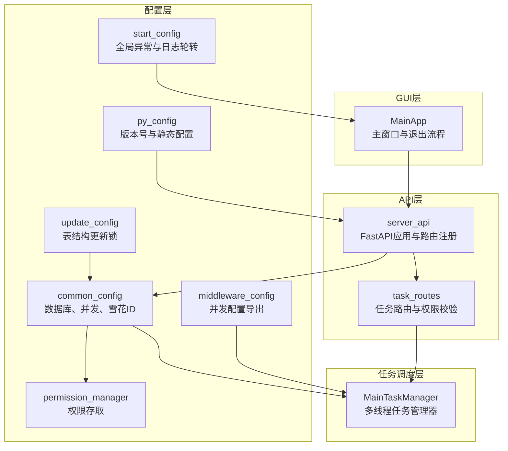
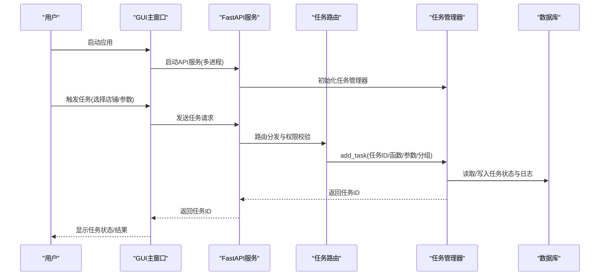
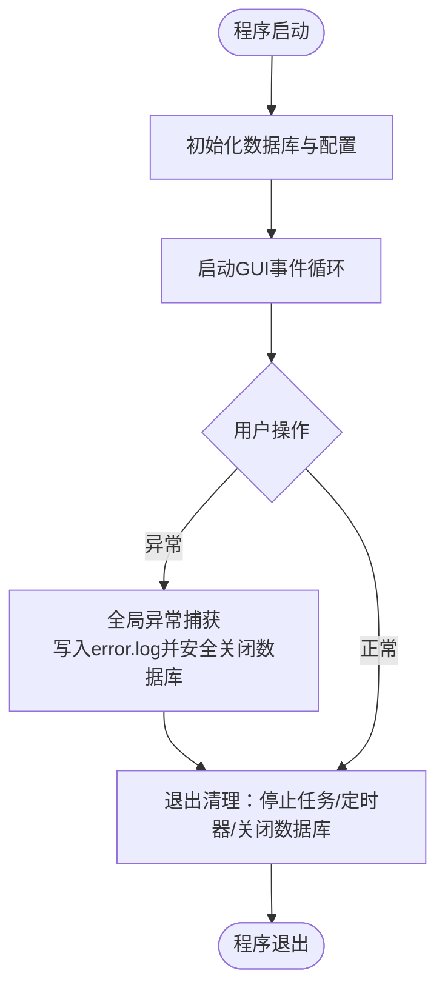
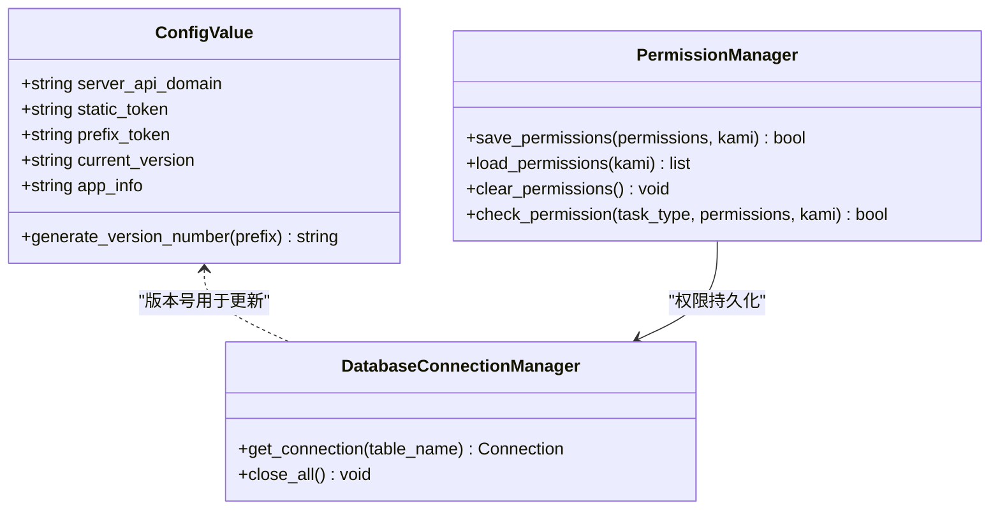
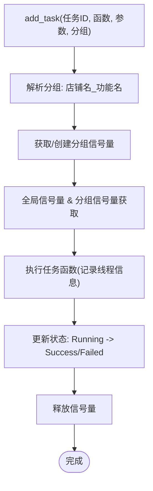
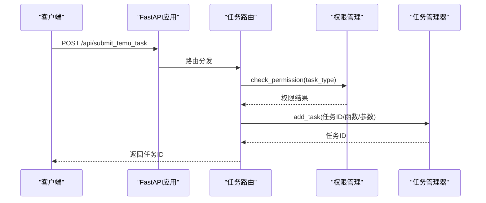
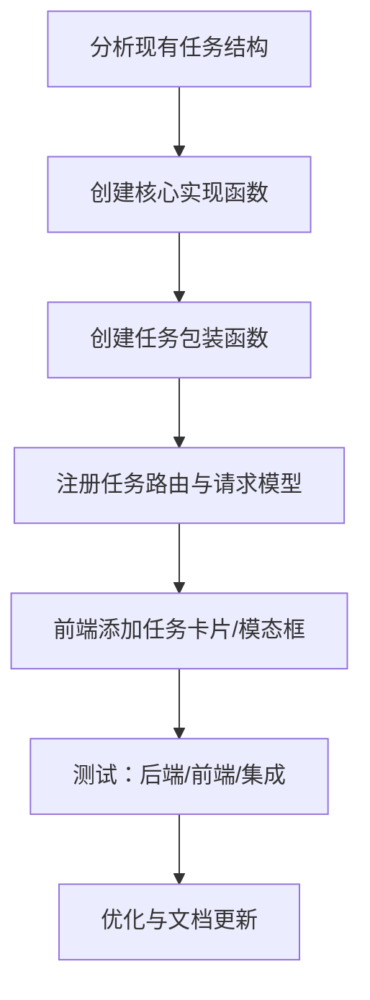
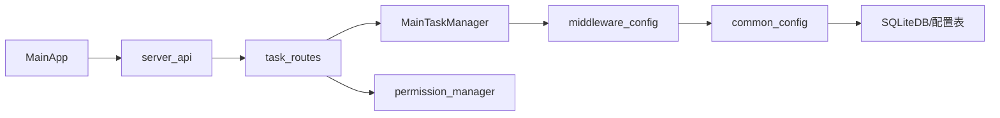

# 开发指南

<cite>
**本文引用的文件**
- [main.py](file://main.py)
- [代码规范/教程.txt](file://代码规范/教程.txt)
- [代码规范/添加新任务功能.md](file://代码规范/添加新任务功能.md)
- [config/common_config.py](file://config/common_config.py)
- [config/py_config.py](file://config/py_config.py)
- [config/start_config.py](file://config/start_config.py)
- [config/update_config.py](file://config/update_config.py)
- [config/middleware_config.py](file://config/middleware_config.py)
- [config/permission_manager.py](file://config/permission_manager.py)
- [gui/MainApp.py](file://gui/MainApp.py)
- [api/server_api.py](file://api/server_api.py)
- [api/server_routes/task_routes.py](file://api/server_routes/task_routes.py)
- [utils/multiThreading_manager.py](file://utils/multiThreading_manager.py)
- [build.bat](file://build.bat)
</cite>

## 目录
1. [简介](#简介)
2. [项目结构](#项目结构)
3. [核心组件](#核心组件)
4. [架构总览](#架构总览)
5. [详细组件分析](#详细组件分析)
6. [依赖分析](#依赖分析)
7. [性能考虑](#性能考虑)
8. [故障排查指南](#故障排查指南)
9. [结论](#结论)
10. [附录](#附录)

## 简介
本开发指南面向 ikun_temu_system 项目，旨在帮助开发者建立一致的开发规范、明确开发环境与工具准备、规范新功能开发流程、完善测试与质量保障、落实版本控制与代码审查流程、掌握调试与问题排查技巧、理解性能优化与安全注意事项，并提供扩展机制与插件开发建议。文档结合项目实际源码与配置，给出可落地的实践步骤与可视化图示。

## 项目结构
项目采用“GUI + 后端API + 任务调度 + 配置中心 + 工具模块”的分层组织方式：
- GUI 层：PyQt5 界面与页面组件，负责用户交互与入口控制
- API 层：FastAPI 提供 REST 接口，路由按功能拆分
- 任务调度层：多线程任务管理器与日志管理器，统一并发与状态追踪
- 配置层：集中管理数据库、权限、版本、并发等配置
- 工具与模块：爬虫、Temu 功能封装、日志清理、端口管理等

图表来源
- [gui/MainApp.py:179-200](file://gui/MainApp.py#L179-L200)
- [api/server_api.py:59-104](file://api/server_api.py#L59-L104)
- [api/server_routes/task_routes.py:1-60](file://api/server_routes/task_routes.py#L1-L60)
- [utils/multiThreading_manager.py:42-107](file://utils/multiThreading_manager.py#L42-L107)
- [config/common_config.py:15-60](file://config/common_config.py#L15-L60)
- [config/py_config.py:4-31](file://config/py_config.py#L4-L31)
- [config/start_config.py:19-25](file://config/start_config.py#L19-L25)
- [config/update_config.py:7-23](file://config/update_config.py#L7-L23)
- [config/middleware_config.py:1-13](file://config/middleware_config.py#L1-L13)
- [config/permission_manager.py:12-56](file://config/permission_manager.py#L12-L56)

章节来源
- [main.py:204-233](file://main.py#L204-L233)
- [config/common_config.py:245-334](file://config/common_config.py#L245-L334)
- [config/start_config.py:109-154](file://config/start_config.py#L109-L154)

## 核心组件
- 入口与异常处理：全局异常捕获、数据库安全关闭、日志轮转与提示
- 配置中心：数据库初始化、并发配置、版本号与静态配置、权限持久化
- 任务调度：基于分组信号量的并发控制、任务状态追踪、超时与结果轮询
- API 服务：FastAPI 生命周期管理、CORS、静态资源与模板、路由注册
- GUI 主窗口：退出流程、进度弹窗、清理步骤与优雅停机

章节来源
- [main.py:21-53](file://main.py#L21-L53)
- [config/common_config.py:59-135](file://config/common_config.py#L59-L135)
- [config/common_config.py:245-334](file://config/common_config.py#L245-L334)
- [utils/multiThreading_manager.py:15-41](file://utils/multiThreading_manager.py#L15-L41)
- [utils/multiThreading_manager.py:42-107](file://utils/multiThreading_manager.py#L42-L107)
- [api/server_api.py:40-57](file://api/server_api.py#L40-L57)
- [api/server_api.py:87-101](file://api/server_api.py#L87-L101)
- [gui/MainApp.py:35-102](file://gui/MainApp.py#L35-L102)

## 架构总览
系统采用“GUI 启动 + FastAPI 服务 + 任务管理器 + 配置中心”的架构。GUI 负责用户交互与入口控制；API 层提供 REST 接口，路由按功能拆分；任务管理器统一调度与并发控制；配置中心集中管理数据库、权限、版本与并发策略。

图表来源
- [gui/MainApp.py:179-200](file://gui/MainApp.py#L179-L200)
- [api/server_api.py:122-138](file://api/server_api.py#L122-L138)
- [api/server_routes/task_routes.py:66-200](file://api/server_routes/task_routes.py#L66-L200)
- [utils/multiThreading_manager.py:108-136](file://utils/multiThreading_manager.py#L108-L136)
- [config/common_config.py:245-334](file://config/common_config.py#L245-L334)

## 详细组件分析

### 入口与异常处理
- 全局异常捕获：记录堆栈至 error.log 并安全关闭数据库，避免文件损坏
- 日志轮转：启动时检查 error.log 条目数量，超过阈值保留最近 20%
- 退出流程：GUI 退出时弹出进度对话框，依次停止任务管理器、定时任务执行器、关闭数据库

图表来源
- [main.py:21-53](file://main.py#L21-L53)
- [config/start_config.py:27-106](file://config/start_config.py#L27-L106)
- [config/common_config.py:59-135](file://config/common_config.py#L59-L135)
- [gui/MainApp.py:35-102](file://gui/MainApp.py#L35-L102)

章节来源
- [main.py:21-53](file://main.py#L21-L53)
- [config/start_config.py:27-106](file://config/start_config.py#L27-L106)
- [config/common_config.py:59-135](file://config/common_config.py#L59-L135)
- [gui/MainApp.py:35-102](file://gui/MainApp.py#L35-L102)

### 配置中心
- 数据库初始化：ikun.db、hupu.db、scheduled_tasks 表结构初始化与修复
- 并发配置：从配置表读取并动态生成任务并发字典
- 版本号与静态配置：版本号生成、静态令牌、服务器域名
- 权限管理：权限保存/读取/清除，与任务权限检查配合
- 软件更新：通过锁文件触发表结构更新

图表来源
- [config/py_config.py:4-31](file://config/py_config.py#L4-L31)
- [config/py_config.py:64-81](file://config/py_config.py#L64-L81)
- [config/permission_manager.py:12-56](file://config/permission_manager.py#L12-L56)
- [config/common_config.py:15-60](file://config/common_config.py#L15-L60)
- [config/common_config.py:245-334](file://config/common_config.py#L245-L334)

章节来源
- [config/py_config.py:4-31](file://config/py_config.py#L4-L31)
- [config/py_config.py:64-81](file://config/py_config.py#L64-L81)
- [config/permission_manager.py:12-56](file://config/permission_manager.py#L12-L56)
- [config/common_config.py:245-334](file://config/common_config.py#L245-L334)

### 任务调度与并发控制
- 分组信号量：按“店铺名_功能名”解析分组，动态创建信号量，实现功能级并发控制
- 全局并发：兜底全局信号量，避免整体过载
- 任务状态：Pending/Running/Success/Failed/Timeout
- 结果轮询：Future 结果获取与超时处理

图表来源
- [utils/multiThreading_manager.py:71-107](file://utils/multiThreading_manager.py#L71-L107)
- [utils/multiThreading_manager.py:179-200](file://utils/multiThreading_manager.py#L179-L200)
- [utils/multiThreading_manager.py:137-164](file://utils/multiThreading_manager.py#L137-L164)

章节来源
- [utils/multiThreading_manager.py:42-107](file://utils/multiThreading_manager.py#L42-L107)
- [utils/multiThreading_manager.py:137-164](file://utils/multiThreading_manager.py#L137-L164)

### API 服务与路由
- FastAPI 生命周期：工作进程启动/停止时初始化/优雅停止任务管理器
- 跨域与静态资源：CORS、静态文件与模板目录挂载
- 路由注册：通用、店铺、任务、服务器路由模块化注册
- 任务路由：权限检查、任务类型映射、任务参数注入与任务 ID 生成

图表来源
- [api/server_api.py:40-57](file://api/server_api.py#L40-L57)
- [api/server_api.py:87-101](file://api/server_api.py#L87-L101)
- [api/server_routes/task_routes.py:66-200](file://api/server_routes/task_routes.py#L66-L200)
- [config/permission_manager.py:106-123](file://config/permission_manager.py#L106-L123)

章节来源
- [api/server_api.py:59-104](file://api/server_api.py#L59-L104)
- [api/server_routes/task_routes.py:66-200](file://api/server_routes/task_routes.py#L66-L200)
- [config/permission_manager.py:106-123](file://config/permission_manager.py#L106-L123)

### 新功能开发流程（添加新任务）
参考“添加新任务功能指南”，核心步骤如下：
- 分析现有任务结构（包装函数、核心实现、前端卡片/模态框、路由处理）
- 创建核心实现函数与任务包装函数
- 注册任务路由与请求模型
- 前端添加任务卡片与模态框参数
- 集成测试与文档更新

图表来源
- [代码规范/添加新任务功能.md:7-395](file://代码规范/添加新任务功能.md#L7-L395)

章节来源
- [代码规范/教程.txt:1-4](file://代码规范/教程.txt#L1-L4)
- [代码规范/添加新任务功能.md:7-395](file://代码规范/添加新任务功能.md#L7-L395)

## 依赖分析
- 组件耦合：API 路由依赖权限管理与任务管理器；任务管理器依赖并发配置；GUI 依赖 API 与清理流程
- 外部依赖：FastAPI、PyQt5、loguru、sqlite3、psutil、uvicorn 等
- 循环依赖规避：middleware_config 仅导出变量，避免在配置层初始化任务管理器

图表来源
- [gui/MainApp.py:179-200](file://gui/MainApp.py#L179-L200)
- [api/server_api.py:59-104](file://api/server_api.py#L59-L104)
- [api/server_routes/task_routes.py:1-36](file://api/server_routes/task_routes.py#L1-L36)
- [utils/multiThreading_manager.py:11-13](file://utils/multiThreading_manager.py#L11-L13)
- [config/middleware_config.py:1-13](file://config/middleware_config.py#L1-L13)
- [config/common_config.py:1-14](file://config/common_config.py#L1-L14)

章节来源
- [config/middleware_config.py:1-13](file://config/middleware_config.py#L1-L13)
- [config/common_config.py:1-14](file://config/common_config.py#L1-L14)

## 性能考虑
- 并发控制：功能级分组信号量 + 全局信号量，避免全局拥塞；支持动态调整并发上限
- 数据库：WAL 模式、检查点合并、线程池与异步连接安全关闭，降低 I/O 抖动
- 任务超时：统一超时时间，避免僵尸任务占用资源
- 打包优化：Nuitka 单文件打包、排除测试与开发依赖、启用 PyQt5 插件

章节来源
- [utils/multiThreading_manager.py:42-107](file://utils/multiThreading_manager.py#L42-L107)
- [config/common_config.py:59-135](file://config/common_config.py#L59-L135)
- [build.bat:179-214](file://build.bat#L179-L214)

## 故障排查指南
- 全局异常：检查 error.log 分隔符与轮转逻辑，定位异常堆栈
- 数据库异常：确认 WAL 检查点与连接关闭流程，避免文件损坏
- 任务超时：检查任务超时阈值与日志轮询间隔，必要时增大阈值
- API 启动失败：端口占用导致启动失败，使用端口释放工具或更换端口
- GUI 退出卡顿：确认退出流程中的清理步骤顺序与进度弹窗刷新

章节来源
- [config/start_config.py:27-106](file://config/start_config.py#L27-L106)
- [config/common_config.py:59-135](file://config/common_config.py#L59-L135)
- [api/server_api.py:122-138](file://api/server_api.py#L122-L138)
- [gui/MainApp.py:35-102](file://gui/MainApp.py#L35-L102)

## 结论
本指南基于项目实际代码与配置，给出了开发规范、环境准备、新功能开发流程、测试与质量保障、版本控制与代码审查、调试与排错、性能与安全、扩展与插件开发的系统化建议。建议在开发过程中严格遵循“配置集中、路由清晰、任务可控、异常可溯、退出可管”的原则，确保系统稳定性与可维护性。

## 附录
- 开发规范与流程参考文件：[代码规范/教程.txt](file://代码规范/教程.txt)、[代码规范/添加新任务功能.md](file://代码规范/添加新任务功能.md)
- 打包脚本：[build.bat](file://build.bat)