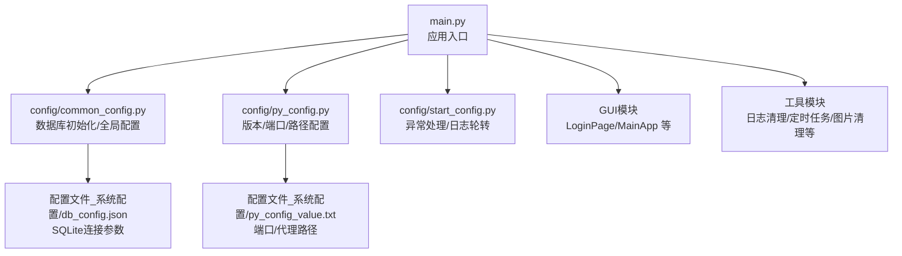
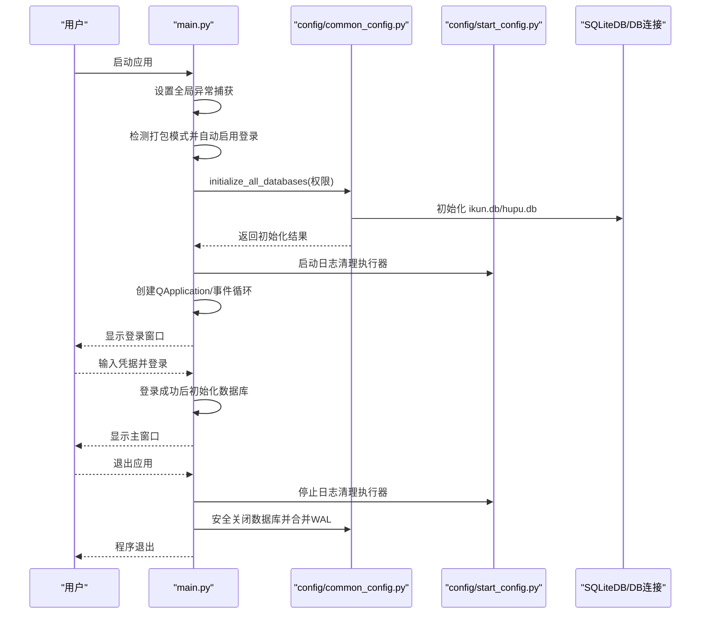
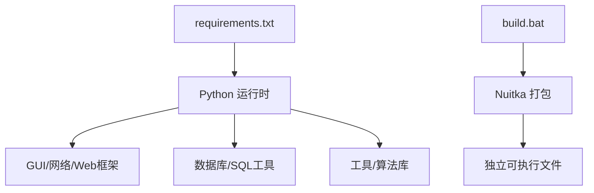

# 快速开始

<cite>
**本文引用的文件**
- [main.py](file://main.py)
- [start.bat](file://start.bat)
- [build.bat](file://build.bat)
- [requirements.txt](file://requirements.txt)
- [config/common_config.py](file://config/common_config.py)
- [config/py_config.py](file://config/py_config.py)
- [config/start_config.py](file://config/start_config.py)
- [config/update_config.py](file://config/update_config.py)
- [config/permission_manager.py](file://config/permission_manager.py)
- [配置文件_系统配置/db_config.json](file://配置文件_系统配置/db_config.json)
- [配置文件_系统配置/py_config_value.txt](file://配置文件_系统配置/py_config_value.txt)
- [v.bat](file://v.bat)
- [other/setup.py](file://other/setup.py)
</cite>

## 更新摘要
**所做更改**
- 更新了启动模式说明，反映应用启动模式从开发模式改为生产模式（package_mode=1）
- 新增了自动启用登录模式的说明
- 更新了启动应用章节，明确区分开发模式和生产模式的行为差异
- 修改了相关配置说明，反映打包模式下的自动配置

## 目录
1. [简介](#简介)
2. [项目结构](#项目结构)
3. [核心组件](#核心组件)
4. [架构总览](#架构总览)
5. [详细组件分析](#详细组件分析)
6. [依赖分析](#依赖分析)
7. [性能考虑](#性能考虑)
8. [故障排除指南](#故障排除指南)
9. [结论](#结论)
10. [附录](#附录)

## 简介
本指南面向首次接触 ikun_temu_system 的用户，帮助你在最短时间内完成环境准备、依赖安装、数据库初始化与应用启动。文档覆盖生产模式与开发模式的差异、常用配置项说明、基本使用示例以及常见问题排查建议。

**更新** 应用现已默认以生产模式启动，自动启用登录模式，提供更安全的用户体验。

## 项目结构
项目采用"功能模块 + 配置文件 + GUI界面 + 工具模块"的组织方式，核心入口为 Python 主程序，配合 Qt 图形界面与多类工具模块协同工作；配置集中在"配置文件_系统配置"目录下，数据库配置与初始化由公共配置模块负责。

**图表来源**
- [main.py:1-233](file://main.py#L1-L233)
- [config/common_config.py:1-394](file://config/common_config.py#L1-L394)
- [config/py_config.py:1-93](file://config/py_config.py#L1-L93)
- [config/start_config.py:1-161](file://config/start_config.py#L1-L161)
- [配置文件_系统配置/db_config.json:1-19](file://配置文件_系统配置/db_config.json#L1-L19)
- [配置文件_系统配置/py_config_value.txt:1-4](file://配置文件_系统配置/py_config_value.txt#L1-L4)

**章节来源**
- [main.py:1-233](file://main.py#L1-L233)
- [config/common_config.py:1-394](file://config/common_config.py#L1-L394)
- [config/py_config.py:1-93](file://config/py_config.py#L1-L93)
- [config/start_config.py:1-161](file://config/start_config.py#L1-L161)
- [配置文件_系统配置/db_config.json:1-19](file://配置文件_系统配置/db_config.json#L1-L19)
- [配置文件_系统配置/py_config_value.txt:1-4](file://配置文件_系统配置/py_config_value.txt#L1-L4)

## 核心组件
- 应用入口与生命周期
  - 入口文件负责全局异常捕获、数据库初始化、日志清理、事件循环与优雅退出。
  - 支持登录模式与直接启动两种运行方式，生产模式下默认启用登录验证，确保应用安全性。
- 数据库初始化
  - 统一初始化 ikun.db 与 hupu.db，创建表结构并写入初始化锁文件，避免重复初始化。
  - 支持并发配置与任务表修复，保证定时任务稳定运行。
- 配置系统
  - 通过 py_config.py 读取版本号、API 代理端口与路径；通过 py_config_value.txt 提供端口与代理文件路径。
  - db_config.json 提供 SQLite 连接参数（超时、WAL、连接池等），common_config.py 负责加载与初始化。
- 日志与异常
  - start_config.py 提供全局异常钩子与 error.log 轮转策略；main.py 同样记录异常并安全关闭数据库。
- 打包与构建
  - build.bat 使用 Nuitka 进行独立打包，支持选择是否显示控制台窗口，包含 PyQt5、FastAPI、Uvicorn 等依赖的打包选项。

**章节来源**
- [main.py:20-233](file://main.py#L20-L233)
- [config/common_config.py:197-334](file://config/common_config.py#L197-L334)
- [config/py_config.py:32-81](file://config/py_config.py#L32-L81)
- [config/start_config.py:27-106](file://config/start_config.py#L27-L106)
- [配置文件_系统配置/db_config.json:1-19](file://配置文件_系统配置/db_config.json#L1-L19)
- [build.bat:156-214](file://build.bat#L156-L214)

## 架构总览
下面的序列图展示了应用启动的关键流程：入口初始化、数据库与权限检查、日志清理、事件循环与退出清理。

**图表来源**
- [main.py:62-201](file://main.py#L62-L201)
- [config/common_config.py:245-334](file://config/common_config.py#L245-L334)
- [config/start_config.py:19-24](file://config/start_config.py#L19-L24)

**章节来源**
- [main.py:62-201](file://main.py#L62-L201)
- [config/common_config.py:245-334](file://config/common_config.py#L245-L334)
- [config/start_config.py:19-24](file://config/start_config.py#L19-L24)

## 详细组件分析

### 环境与依赖准备
- Python 版本
  - 项目使用 PyQt5、asyncio、loguru、Nuitka 等依赖，建议使用较新的 Python 3.11~3.12，确保兼容性。
- 虚拟环境
  - 推荐使用 venv 创建虚拟环境，并在启动脚本中激活。
  - 可使用 v.bat 快速激活虚拟环境。
- 依赖安装
  - 使用 requirements.txt 安装全部依赖，确保网络可用。
  - 若出现安装缓慢，可使用国内镜像源或离线安装包。

**章节来源**
- [requirements.txt:1-168](file://requirements.txt#L1-L168)
- [v.bat:1-1](file://v.bat#L1-L1)

### 首次运行配置
- 数据库配置
  - db_config.json 已内置默认连接参数（WAL、连接池等），无需手动修改。
  - 如需调整路径或参数，可在 common_config.py 中创建配置文件或通过配置表动态读取。
- 版本与代理配置
  - py_config_value.txt 提供代理端口与代理文件路径，API 代理地址由 py_config.py 动态拼接。
  - 当前版本号由 py_config.py 自动生成，如需手动修改可在相应位置调整。
- 权限与初始化
  - 生产模式下默认启用登录验证，登录成功后才进行数据库初始化。
  - 开发模式下可通过 main.py 的权限列表初始化对应数据库与表结构。
  - 初始化完成后会在配置目录写入初始化锁文件，避免重复初始化。

**章节来源**
- [配置文件_系统配置/db_config.json:1-19](file://配置文件_系统配置/db_config.json#L1-L19)
- [config/common_config.py:197-334](file://config/common_config.py#L197-L334)
- [config/py_config.py:32-81](file://config/py_config.py#L32-L81)
- [配置文件_系统配置/py_config_value.txt:1-4](file://配置文件_系统配置/py_config_value.txt#L1-L4)
- [main.py:84-101](file://main.py#L84-L101)

### 启动应用（生产模式）
- 方式一：双击启动脚本
  - 使用 start.bat 激活虚拟环境并运行 main.py。
- 方式二：命令行启动
  - 先激活虚拟环境，再执行 python main.py。
- 行为说明
  - **自动登录模式**：生产模式下自动启用登录验证，必须输入有效凭据才能访问系统。
  - 初始化数据库：登录成功后进行数据库初始化与表结构创建。
  - 安全退出：退出时安全关闭数据库并合并 WAL 文件。

**更新** 应用现已默认以生产模式启动，自动启用登录验证，提供更安全的用户体验。

**章节来源**
- [start.bat:1-1](file://start.bat#L1-L1)
- [main.py:120-201](file://main.py#L120-L201)

### 启动应用（开发模式）
- 方式一：双击启动脚本
  - 使用 start.bat 激活虚拟环境并运行 main.py。
- 方式二：命令行启动
  - 先激活虚拟环境，再执行 python main.py。
- 行为说明
  - **直接启动模式**：开发模式下可直接进入主界面，无需登录验证。
  - 初始化数据库：直接进行数据库初始化与表结构创建。
  - 权限调试：支持权限调试模式，可自定义权限列表进行功能测试。

**更新** 开发模式现已标记为历史模式，生产模式为默认启动方式。

**章节来源**
- [start.bat:1-1](file://start.bat#L1-L1)
- [main.py:120-201](file://main.py#L120-L201)

### 启动应用（打包模式）
- 使用 build.bat 进行打包
  - 自动检查虚拟环境与 Nuitka 安装状态，按需安装 Nuitka。
  - 支持选择是否显示控制台窗口（无控制台/控制台模式）。
  - 打包包含 PyQt5、FastAPI、Uvicorn、Playwright 等依赖。
- 注意事项
  - 打包前请确保磁盘空间充足，避免杀毒软件拦截。
  - 如失败，参考故障排除指南中的常见原因与解决方法。

**章节来源**
- [build.bat:156-214](file://build.bat#L156-L214)
- [build.bat:221-237](file://build.bat#L221-L237)

### 基本使用示例
- 登录与主界面
  - **生产模式**：先输入凭据登录，登录成功后初始化数据库并进入主界面。
  - **开发模式**：直接进入主界面，适合开发调试。
- 数据库初始化
  - 登录成功后自动初始化 ikun.db 与 hupu.db，并创建表结构。
- 日志与异常
  - 发生未处理异常时，程序会记录到 error.log 并弹窗提示；同时安全关闭数据库。

**更新** 生产模式下登录验证为强制要求，确保系统安全性。

**章节来源**
- [main.py:131-169](file://main.py#L131-L169)
- [config/common_config.py:245-334](file://config/common_config.py#L245-L334)
- [config/start_config.py:27-106](file://config/start_config.py#L27-L106)

## 依赖分析
- 运行时依赖
  - GUI：PyQt5、qasync、PyQtWebEngine
  - Web：fastapi、uvicorn、starlette、anyio、pydantic
  - 网络与HTTP：requests、httpx、httpcore、httpcore-happyeyeballs
  - 数据库与SQL：sqlalchemy、aiosqlite、sqlite3（内置）
  - 工具与算法：numpy、pandas、openai、playwright、loguru、schedule
  - 其他：pyyaml、click、rich、setuptools、wheel、Nuitka（打包）
- 依赖来源
  - requirements.txt 列出了完整依赖清单，建议一次性安装。
  - Nuitka 用于独立打包，build.bat 中已配置相关参数。

**图表来源**
- [requirements.txt:1-168](file://requirements.txt#L1-L168)
- [build.bat:156-214](file://build.bat#L156-L214)

**章节来源**
- [requirements.txt:1-168](file://requirements.txt#L1-L168)
- [build.bat:156-214](file://build.bat#L156-L214)

## 性能考虑
- 数据库连接与并发
  - 通过 db_config.json 启用 WAL 模式与连接池，提升并发读写性能。
  - 任务并发配置可从配置表读取，避免硬编码带来的维护成本。
- 日志与清理
  - 启动时检查 error.log 数量并进行轮转，避免日志过大影响性能。
  - 定期清理临时图片与日志，释放磁盘空间。
- 打包优化
  - Nuitka 打包时启用多核编译与包含必要包，减少运行时开销。

**章节来源**
- [配置文件_系统配置/db_config.json:1-19](file://配置文件_系统配置/db_config.json#L1-L19)
- [config/common_config.py:344-376](file://config/common_config.py#L344-L376)
- [config/start_config.py:109-151](file://config/start_config.py#L109-L151)
- [build.bat:179-214](file://build.bat#L179-L214)

## 故障排除指南
- 无法启动或黑屏
  - 确认已激活虚拟环境后再运行 main.py。
  - 检查 PyQt5 是否安装成功，必要时重新安装。
- 登录失败
  - **生产模式**：确认登录凭据正确，登录数据文件完整。
  - 检查 config/login_data.dat 文件是否存在且有效。
- 数据库初始化失败
  - 检查 db_config.json 路径与权限，确认 SQLite 文件可读写。
  - 删除初始化锁文件后重启应用，重新初始化数据库。
- 打包失败
  - 检查磁盘空间、杀软拦截与虚拟环境完整性。
  - 以管理员身份运行或暂时关闭杀软后重试。
- 异常日志过多
  - 程序会自动轮转 error.log，保留最近20%条目；如仍过大，可手动清理。
- 代理与网络
  - 检查 py_config_value.txt 中的代理端口与代理文件路径，确保代理服务正常。

**更新** 新增登录失败相关故障排除指导。

**章节来源**
- [start.bat:1-1](file://start.bat#L1-L1)
- [config/common_config.py:245-334](file://config/common_config.py#L245-L334)
- [config/start_config.py:109-151](file://config/start_config.py#L109-L151)
- [build.bat:221-237](file://build.bat#L221-L237)
- [配置文件_系统配置/py_config_value.txt:1-4](file://配置文件_系统配置/py_config_value.txt#L1-L4)

## 结论
通过本指南，你可以在本地快速完成环境准备、依赖安装与数据库初始化，并成功启动应用。生产模式提供更安全的登录验证机制，适合分发给最终用户；开发模式适合调试与功能验证。遇到问题时，优先检查虚拟环境、数据库路径与日志轮转策略；登录失败时检查凭据有效性；打包失败时关注磁盘空间与杀软拦截。

## 附录
- 快速命令参考
  - 激活虚拟环境：使用 v.bat 或手动执行 .venv\Scripts\activate.bat
  - 启动应用：start.bat 或 python main.py
  - 打包应用：build.bat
- 关键配置文件定位
  - 数据库连接参数：配置文件_系统配置/db_config.json
  - 版本与代理配置：配置文件_系统配置/py_config_value.txt
  - 版本号生成逻辑：config/py_config.py
  - 登录数据文件：config/login_data.dat
- 扩展与二次开发
  - 如需添加新功能模块，遵循现有模块结构并在 main.py 中按需初始化数据库与权限。
  - 打包时可按需增删 include-package 与 include-data-files，确保运行时资源完整。

**更新** 新增登录数据文件配置说明。

**章节来源**
- [v.bat:1-1](file://v.bat#L1-L1)
- [start.bat:1-1](file://start.bat#L1-L1)
- [build.bat:156-214](file://build.bat#L156-L214)
- [config/py_config.py:64-81](file://config/py_config.py#L64-L81)
- [配置文件_系统配置/db_config.json:1-19](file://配置文件_系统配置/db_config.json#L1-L19)
- [配置文件_系统配置/py_config_value.txt:1-4](file://配置文件_系统配置/py_config_value.txt#L1-L4)
- [config/login_data.dat:1-1](file://config/login_data.dat#L1-L1)