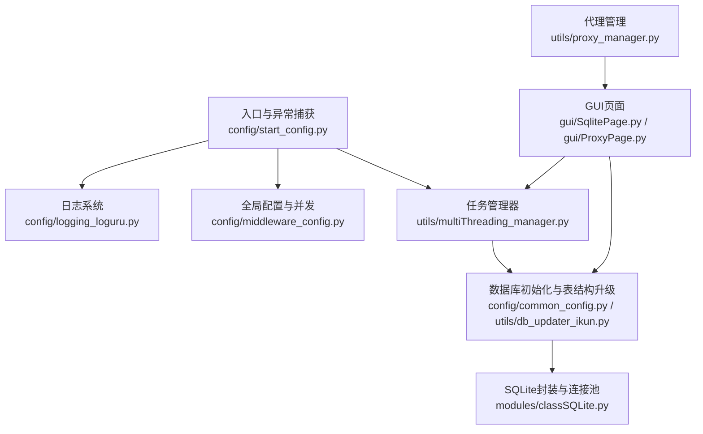
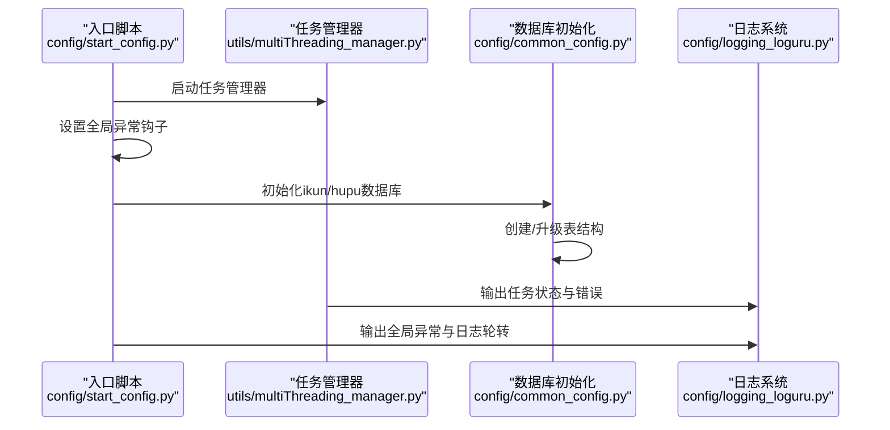
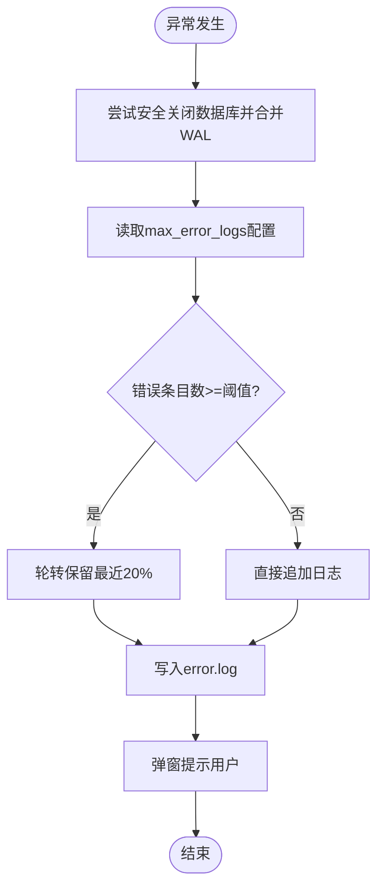
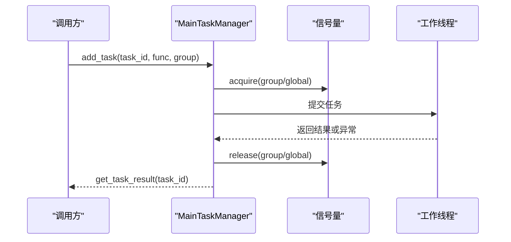
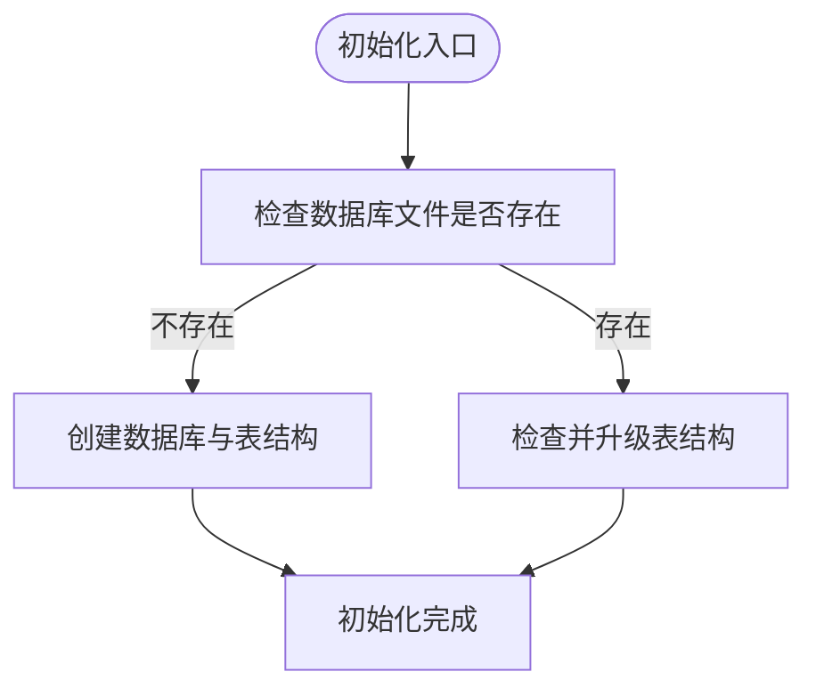
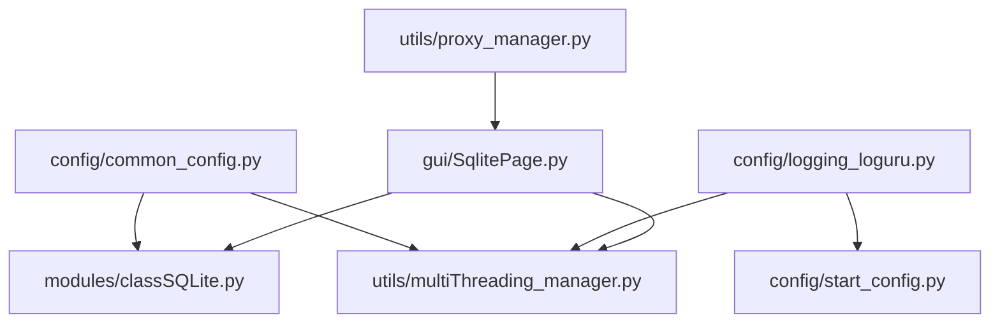

# 故障排除和常见问题

<cite>
**本文引用的文件**
- [config/common_config.py](file://config/common_config.py)
- [config/start_config.py](file://config/start_config.py)
- [config/logging_loguru.py](file://config/logging_loguru.py)
- [modules/classSQLite.py](file://modules/classSQLite.py)
- [utils/db_updater_ikun.py](file://utils/db_updater_ikun.py)
- [utils/log_utils.py](file://utils/log_utils.py)
- [utils/multiThreading_manager.py](file://utils/multiThreading_manager.py)
- [config/middleware_config.py](file://config/middleware_config.py)
- [config/py_config.py](file://config/py_config.py)
- [config/update_config.py](file://config/update_config.py)
- [gui/SqlitePage.py](file://gui/SqlitePage.py)
- [utils/proxy_manager.py](file://utils/proxy_manager.py)
- [gui/ProxyPage.py](file://gui/ProxyPage.py)
- [bug.txt](file://bug.txt)
</cite>

## 目录
1. [简介](#简介)
2. [项目结构](#项目结构)
3. [核心组件](#核心组件)
4. [架构总览](#架构总览)
5. [详细组件分析](#详细组件分析)
6. [依赖分析](#依赖分析)
7. [性能考虑](#性能考虑)
8. [故障排除指南](#故障排除指南)
9. [结论](#结论)
10. [附录](#附录)

## 简介
本文件面向ikun_temu_system项目的使用者与维护者，提供系统化的故障排除与常见问题解答。内容涵盖错误代码与解决方案、调试技巧与诊断方法、性能问题识别与优化策略、系统崩溃与异常处理、配置错误检查清单与修复步骤、网络连接与数据库问题排查、日志分析与错误定位方法，以及用户反馈的问题分类与处理流程。

## 项目结构
系统采用“配置-日志-任务-数据库-界面”分层组织，核心入口负责全局异常捕获与任务管理器启动；配置模块统一管理数据库、并发与日志；数据库模块提供SQLite封装与表结构升级；日志模块提供统一彩色日志输出；GUI模块承载用户交互与可视化展示。

**图表来源**
- [config/start_config.py:19-24](file://config/start_config.py#L19-L24)
- [utils/multiThreading_manager.py:417-424](file://utils/multiThreading_manager.py#L417-L424)
- [config/middleware_config.py:1-13](file://config/middleware_config.py#L1-L13)
- [config/common_config.py:245-334](file://config/common_config.py#L245-L334)
- [modules/classSQLite.py:359-418](file://modules/classSQLite.py#L359-L418)
- [config/logging_loguru.py:83-116](file://config/logging_loguru.py#L83-L116)
- [gui/SqlitePage.py:317-344](file://gui/SqlitePage.py#L317-L344)
- [utils/proxy_manager.py:91-213](file://utils/proxy_manager.py#L91-L213)

**章节来源**
- [config/start_config.py:19-24](file://config/start_config.py#L19-L24)
- [config/middleware_config.py:1-13](file://config/middleware_config.py#L1-L13)
- [config/common_config.py:245-334](file://config/common_config.py#L245-L334)
- [modules/classSQLite.py:359-418](file://modules/classSQLite.py#L359-L418)
- [config/logging_loguru.py:83-116](file://config/logging_loguru.py#L83-L116)
- [gui/SqlitePage.py:317-344](file://gui/SqlitePage.py#L317-L344)
- [utils/proxy_manager.py:91-213](file://utils/proxy_manager.py#L91-L213)

## 核心组件
- 全局异常捕获与日志轮转：在程序启动时检查错误日志数量并进行轮转，未处理异常被捕获并写入error/error.log，同时尝试安全关闭数据库并合并WAL文件。
- 任务管理器：基于信号量与线程池实现全局与功能维度的并发控制，支持任务超时、状态跟踪与结果查询。
- 数据库初始化与表结构升级：统一初始化ikun与hupu数据库，创建/升级表结构，自动合并WAL并安全关闭连接。
- 日志系统：提供与loguru风格一致的彩色日志输出，支持控制台与文件输出，便于快速定位问题。
- GUI与代理管理：提供数据库操作错误信号与代理测试能力，辅助定位网络与数据库问题。

**章节来源**
- [config/start_config.py:27-106](file://config/start_config.py#L27-L106)
- [utils/multiThreading_manager.py:42-106](file://utils/multiThreading_manager.py#L42-L106)
- [config/common_config.py:197-334](file://config/common_config.py#L197-L334)
- [config/logging_loguru.py:83-116](file://config/logging_loguru.py#L83-L116)
- [gui/SqlitePage.py:317-344](file://gui/SqlitePage.py#L317-L344)
- [utils/proxy_manager.py:91-213](file://utils/proxy_manager.py#L91-L213)

## 架构总览
系统通过入口脚本启动任务管理器与全局异常捕获，配置模块提供数据库与并发参数，数据库模块负责SQLite连接与表结构管理，日志模块统一输出，GUI与代理模块提供用户交互与网络连通性测试。

**图表来源**
- [config/start_config.py:19-24](file://config/start_config.py#L19-L24)
- [config/start_config.py:27-106](file://config/start_config.py#L27-L106)
- [config/common_config.py:197-334](file://config/common_config.py#L197-L334)
- [config/logging_loguru.py:83-116](file://config/logging_loguru.py#L83-L116)

## 详细组件分析

### 组件A：全局异常捕获与错误日志
- 功能要点
  - 捕获未处理异常，写入error/error.log，包含时间戳与堆栈信息。
  - 在写入前尝试安全关闭数据库并合并WAL，降低文件损坏风险。
  - 支持配置最大错误日志条目数，超过阈值时进行轮转，保留最近20%。
- 常见问题
  - error.log过大：检查max_error_logs配置，必要时手动清理或调整阈值。
  - 异常未写入：确认全局异常钩子已设置，且error目录可写。
- 诊断步骤
  - 查看error/error.log中最近异常条目，结合堆栈定位模块。
  - 检查数据库是否处于安全关闭状态（WAL合并）。

**图表来源**
- [config/start_config.py:27-106](file://config/start_config.py#L27-L106)

**章节来源**
- [config/start_config.py:27-106](file://config/start_config.py#L27-L106)

### 组件B：任务管理器与并发控制
- 功能要点
  - 全局信号量与功能分组信号量双重控制，支持动态更新功能并发上限。
  - 任务超时检测，超时标记为TIMEOUT并记录错误。
  - 任务状态跟踪（PENDING/RUNNING/SUCCESS/FAILED/TIMEOUT）。
- 常见问题
  - 任务长时间无响应：检查任务超时配置与功能并发上限。
  - 并发过高导致资源争用：适当降低功能并发或全局并发上限。
- 诊断步骤
  - 通过任务状态查询接口获取任务列表与状态。
  - 检查分组信号量与全局信号量剩余许可数，判断是否达到上限。

**图表来源**
- [utils/multiThreading_manager.py:108-135](file://utils/multiThreading_manager.py#L108-L135)
- [utils/multiThreading_manager.py:179-281](file://utils/multiThreading_manager.py#L179-L281)
- [utils/multiThreading_manager.py:305-341](file://utils/multiThreading_manager.py#L305-L341)

**章节来源**
- [utils/multiThreading_manager.py:42-106](file://utils/multiThreading_manager.py#L42-L106)
- [utils/multiThreading_manager.py:179-281](file://utils/multiThreading_manager.py#L179-L281)
- [utils/multiThreading_manager.py:305-341](file://utils/multiThreading_manager.py#L305-L341)

### 组件C：数据库初始化与表结构升级
- 功能要点
  - 初始化ikun与hupu数据库，创建/升级表结构，自动合并WAL并安全关闭。
  - 通用表结构更新函数支持字段增删与索引维护，重建表时保留有效字段。
- 常见问题
  - 表结构更新失败：确认数据库文件存在且未被占用，检查权限。
  - 首次运行无表：初始化流程会自动创建所需表，检查日志输出。
- 诊断步骤
  - 查看数据库初始化日志，确认各表创建/更新成功。
  - 若需强制重建，删除数据库文件与初始化锁后重启程序。

**图表来源**
- [config/common_config.py:197-334](file://config/common_config.py#L197-L334)
- [utils/db_updater_ikun.py:328-395](file://utils/db_updater_ikun.py#L328-L395)

**章节来源**
- [config/common_config.py:197-334](file://config/common_config.py#L197-L334)
- [utils/db_updater_ikun.py:328-395](file://utils/db_updater_ikun.py#L328-L395)

### 组件D：日志系统与彩色输出
- 功能要点
  - 提供与loguru风格一致的彩色日志输出，支持控制台与文件输出。
  - 注册SUCCESS级别，便于与loguru保持一致的使用体验。
- 常见问题
  - 日志输出异常：检查日志器初始化与格式化器配置。
  - 文件输出无颜色：确认使用纯文本格式化器。
- 诊断步骤
  - 通过日志器输出不同级别日志验证输出效果。
  - 检查日志文件路径与权限。

**章节来源**
- [config/logging_loguru.py:83-116](file://config/logging_loguru.py#L83-L116)

### 组件E：GUI数据库操作与代理测试
- 功能要点
  - 数据库操作异常时发出错误信号，区分数据库连接与SQL语法错误。
  - 代理测试支持同步/异步测试，记录测试历史与状态。
- 常见问题
  - 数据库连接错误：检查数据库文件是否存在、权限与占用情况。
  - 代理测试失败：检查网络连通性与代理可用性。
- 诊断步骤
  - GUI页面监听错误信号并提示用户。
  - 代理测试页面显示测试结果与下次测试时间。

**章节来源**
- [gui/SqlitePage.py:317-344](file://gui/SqlitePage.py#L317-L344)
- [utils/proxy_manager.py:91-213](file://utils/proxy_manager.py#L91-L213)
- [gui/ProxyPage.py:852-878](file://gui/ProxyPage.py#L852-L878)

## 依赖分析
- 配置模块依赖数据库模块与任务管理器参数，确保并发与数据库初始化正确。
- 日志模块独立，但被全局异常捕获与任务管理器广泛使用。
- GUI模块依赖数据库与代理管理模块，提供用户交互与可视化。

**图表来源**
- [config/common_config.py:197-334](file://config/common_config.py#L197-L334)
- [modules/classSQLite.py:359-418](file://modules/classSQLite.py#L359-L418)
- [utils/multiThreading_manager.py:417-424](file://utils/multiThreading_manager.py#L417-L424)
- [config/logging_loguru.py:83-116](file://config/logging_loguru.py#L83-L116)
- [config/start_config.py:27-106](file://config/start_config.py#L27-L106)
- [gui/SqlitePage.py:317-344](file://gui/SqlitePage.py#L317-L344)
- [utils/proxy_manager.py:91-213](file://utils/proxy_manager.py#L91-L213)

**章节来源**
- [config/common_config.py:197-334](file://config/common_config.py#L197-L334)
- [modules/classSQLite.py:359-418](file://modules/classSQLite.py#L359-L418)
- [utils/multiThreading_manager.py:417-424](file://utils/multiThreading_manager.py#L417-L424)
- [config/logging_loguru.py:83-116](file://config/logging_loguru.py#L83-L116)
- [config/start_config.py:27-106](file://config/start_config.py#L27-L106)
- [gui/SqlitePage.py:317-344](file://gui/SqlitePage.py#L317-L344)
- [utils/proxy_manager.py:91-213](file://utils/proxy_manager.py#L91-L213)

## 性能考虑
- 并发控制
  - 全局并发与功能并发双重限制，避免资源争用与系统过载。
  - 动态调整功能并发上限，按需扩容。
- 数据库性能
  - WAL模式与PRAGMA参数优化，合理设置缓存与同步级别。
  - 批量插入与连接池减少开销。
- 日志性能
  - 控制台彩色输出不影响性能，文件输出建议按需开启。

**章节来源**
- [utils/multiThreading_manager.py:42-106](file://utils/multiThreading_manager.py#L42-L106)
- [modules/classSQLite.py:359-418](file://modules/classSQLite.py#L359-L418)
- [config/common_config.py:157-196](file://config/common_config.py#L157-L196)

## 故障排除指南

### 常见错误代码与解决方案
- 数据库初始化失败
  - 现象：初始化日志显示失败，数据库未创建或表结构未升级。
  - 解决：检查数据库配置文件与路径，确认权限；删除数据库文件与初始化锁后重启。
  - 参考：[config/common_config.py:197-334](file://config/common_config.py#L197-L334)，[utils/db_updater_ikun.py:328-395](file://utils/db_updater_ikun.py#L328-L395)
- 任务超时
  - 现象：任务状态为TIMEOUT，日志显示超时。
  - 解决：提高任务超时时间或降低功能并发上限。
  - 参考：[utils/multiThreading_manager.py:232-260](file://utils/multiThreading_manager.py#L232-L260)
- 代理测试失败
  - 现象：代理测试返回失败或异常。
  - 解决：检查网络连通性与代理可用性，调整超时与线程数。
  - 参考：[utils/proxy_manager.py:91-213](file://utils/proxy_manager.py#L91-L213)，[gui/ProxyPage.py:852-878](file://gui/ProxyPage.py#L852-L878)
- GUI数据库操作异常
  - 现象：数据库操作失败并发出错误信号。
  - 解决：检查数据库文件是否存在、权限与占用情况；SQL语法错误需修正查询语句。
  - 参考：[gui/SqlitePage.py:317-344](file://gui/SqlitePage.py#L317-L344)

### 调试技巧与问题诊断
- 日志分析
  - 使用彩色日志快速定位错误级别与模块来源。
  - 结合全局异常捕获日志与任务管理器日志，定位异常传播链。
- 任务状态查询
  - 通过任务管理器的状态查询接口获取任务列表与状态，判断阻塞点。
- 数据库诊断
  - 检查数据库配置文件与路径，确认PRAGMA参数设置。
  - 使用表结构升级工具修复或重建表结构。

**章节来源**
- [config/logging_loguru.py:83-116](file://config/logging_loguru.py#L83-L116)
- [config/start_config.py:27-106](file://config/start_config.py#L27-L106)
- [utils/multiThreading_manager.py:381-414](file://utils/multiThreading_manager.py#L381-L414)
- [config/common_config.py:157-196](file://config/common_config.py#L157-L196)
- [utils/db_updater_ikun.py:10-147](file://utils/db_updater_ikun.py#L10-L147)

### 系统崩溃与异常处理
- 全局异常捕获
  - 捕获未处理异常，写入error.log并尝试安全关闭数据库。
  - 弹窗提示用户查看错误日志。
- 任务管理器停止
  - 提供完整停止流程，确保资源释放与线程退出。
- 数据库安全关闭
  - 合并WAL并关闭连接，防止文件损坏。

**章节来源**
- [config/start_config.py:27-106](file://config/start_config.py#L27-L106)
- [utils/multiThreading_manager.py:426-508](file://utils/multiThreading_manager.py#L426-L508)
- [config/common_config.py:59-134](file://config/common_config.py#L59-L134)

### 配置错误检查清单与修复步骤
- 数据库配置
  - 检查db_config.json与hupu_db_config.json路径与内容。
  - 确认PRAGMA参数（journal_mode、cache_size、synchronous）设置合理。
- 并发配置
  - 检查middleware_config中各功能并发上限与全局并发上限。
  - 根据实际资源调整并发配置。
- 日志配置
  - 确认日志级别与输出位置，避免过多I/O开销。
- 代理配置
  - 检查代理文件路径与超时设置，确保网络连通性。

**章节来源**
- [config/common_config.py:157-196](file://config/common_config.py#L157-L196)
- [config/middleware_config.py:1-13](file://config/middleware_config.py#L1-L13)
- [config/logging_loguru.py:83-116](file://config/logging_loguru.py#L83-L116)
- [config/py_config.py:32-61](file://config/py_config.py#L32-L61)

### 网络连接与数据库问题排查
- 网络问题
  - 使用代理测试工具验证代理可用性与延迟。
  - 检查防火墙与DNS设置，确保访问目标域名可达。
- 数据库问题
  - 检查数据库文件是否存在、权限与占用情况。
  - 使用表结构升级工具修复或重建表结构。
  - 确认WAL文件合并与连接关闭流程。

**章节来源**
- [utils/proxy_manager.py:91-213](file://utils/proxy_manager.py#L91-L213)
- [gui/ProxyPage.py:852-878](file://gui/ProxyPage.py#L852-L878)
- [gui/SqlitePage.py:317-344](file://gui/SqlitePage.py#L317-L344)
- [utils/db_updater_ikun.py:10-147](file://utils/db_updater_ikun.py#L10-L147)

### 日志分析与错误定位
- 错误日志轮转
  - 检查max_error_logs配置，超过阈值时自动轮转保留最近20%。
- 任务日志
  - 通过任务管理器日志查看任务状态变化与异常堆栈。
- 数据库日志
  - 关注表结构升级与连接池相关日志，定位初始化问题。

**章节来源**
- [config/start_config.py:109-154](file://config/start_config.py#L109-L154)
- [utils/multiThreading_manager.py:222-272](file://utils/multiThreading_manager.py#L222-L272)
- [utils/db_updater_ikun.py:328-395](file://utils/db_updater_ikun.py#L328-L395)

### 用户反馈的问题分类与处理流程
- 问题分类
  - 数据库类：连接失败、表结构异常、初始化失败。
  - 任务类：任务超时、并发不足、状态异常。
  - 网络类：代理不可用、DNS解析失败、访问超时。
  - 日志类：日志缺失、轮转异常、输出异常。
- 处理流程
  - 收集日志与错误信息，定位问题根因。
  - 根据问题类型采取相应修复措施（调整配置、重启服务、修复表结构）。
  - 验证修复效果并归档问题与方案。

**章节来源**
- [bug.txt:1-6](file://bug.txt#L1-L6)
- [config/start_config.py:27-106](file://config/start_config.py#L27-L106)
- [utils/multiThreading_manager.py:232-260](file://utils/multiThreading_manager.py#L232-L260)
- [utils/proxy_manager.py:91-213](file://utils/proxy_manager.py#L91-L213)

## 结论
本指南提供了ikun_temu_system的系统化故障排除方法与最佳实践。通过理解核心组件与日志体系，结合并发与数据库配置的优化，能够快速定位并解决问题。建议在日常运维中定期检查日志轮转、数据库WAL合并与代理连通性，确保系统稳定运行。

## 附录
- 相关文件与路径
  - 入口与异常捕获：[config/start_config.py](file://config/start_config.py)
  - 任务管理器：[utils/multiThreading_manager.py](file://utils/multiThreading_manager.py)
  - 数据库初始化与表结构升级：[config/common_config.py](file://config/common_config.py)，[utils/db_updater_ikun.py](file://utils/db_updater_ikun.py)
  - 日志系统：[config/logging_loguru.py](file://config/logging_loguru.py)
  - GUI数据库操作与代理测试：[gui/SqlitePage.py](file://gui/SqlitePage.py)，[utils/proxy_manager.py](file://utils/proxy_manager.py)，[gui/ProxyPage.py](file://gui/ProxyPage.py)
  - 配置文件：[config/middleware_config.py](file://config/middleware_config.py)，[config/py_config.py](file://config/py_config.py)，[config/update_config.py](file://config/update_config.py)
  - 已知问题记录：[bug.txt](file://bug.txt)