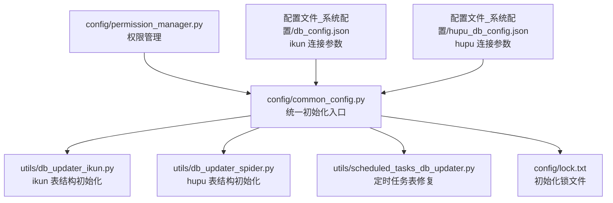
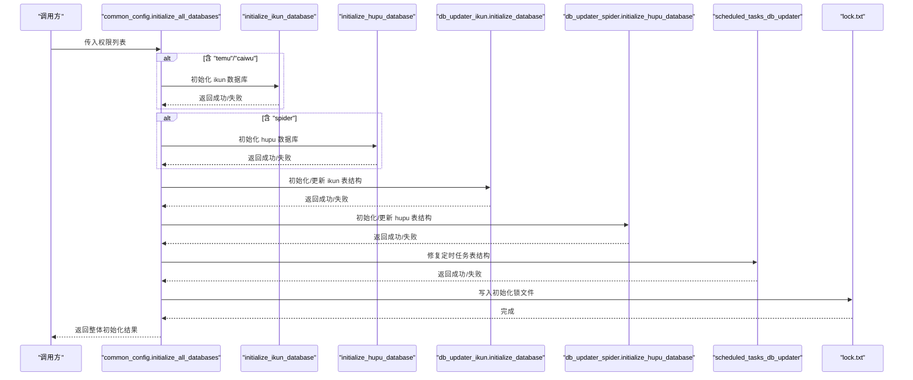
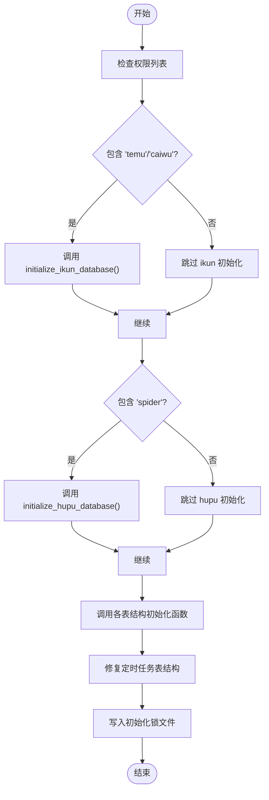
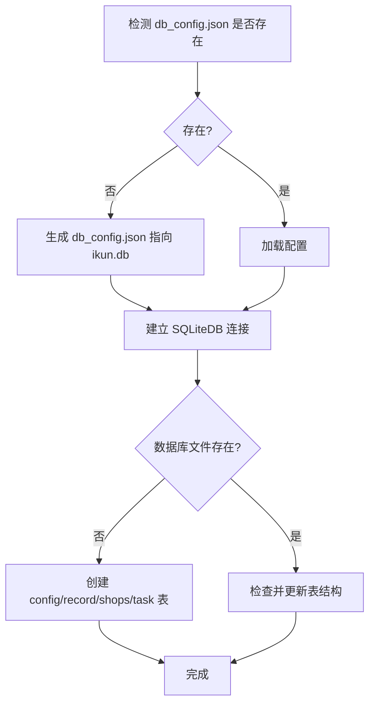
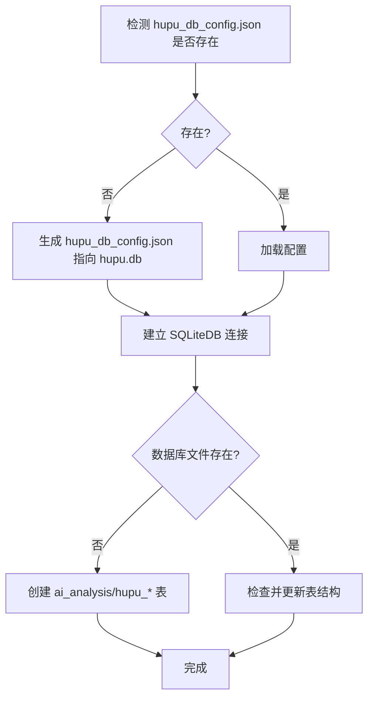
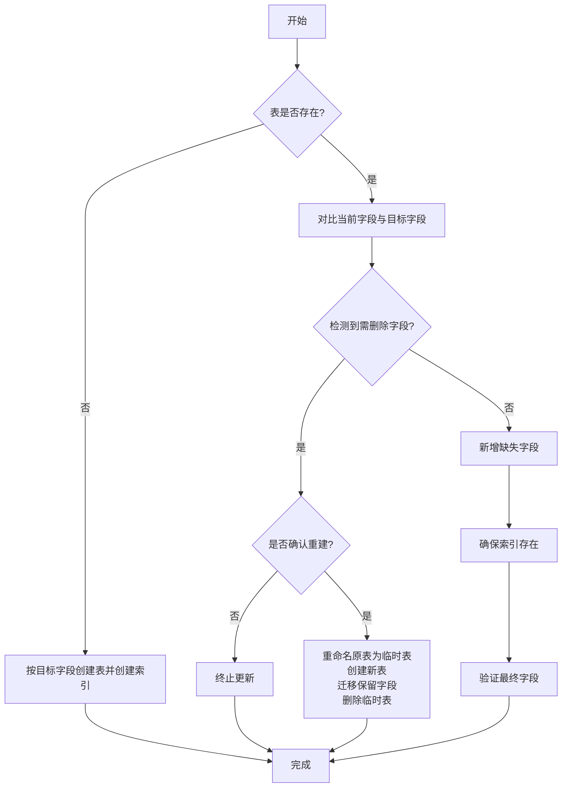
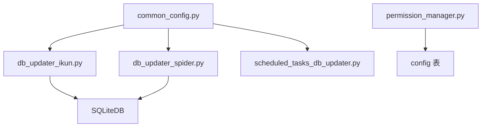

# 数据库初始化

<cite>
**本文引用的文件**
- [config/common_config.py](file://config/common_config.py)
- [utils/db_updater_ikun.py](file://utils/db_updater_ikun.py)
- [utils/db_updater_spider.py](file://utils/db_updater_spider.py)
- [config/permission_manager.py](file://config/permission_manager.py)
- [config/db_config.json](file://配置文件_系统配置/db_config.json)
- [config/hupu_db_config.json](file://配置文件_系统配置/hupu_db_config.json)
- [config/lock.txt](file://config/lock.txt)
- [gui/SettingPage.py](file://gui/SettingPage.py)
- [utils/scheduled_tasks_db_updater.py](file://utils/scheduled_tasks_db_updater.py)
</cite>

## 目录
1. [简介](#简介)
2. [项目结构](#项目结构)
3. [核心组件](#核心组件)
4. [架构总览](#架构总览)
5. [详细组件分析](#详细组件分析)
6. [依赖分析](#依赖分析)
7. [性能考虑](#性能考虑)
8. [故障排除指南](#故障排除指南)
9. [结论](#结论)
10. [附录](#附录)

## 简介
本文档围绕 ikun_temu_system 的数据库初始化流程进行系统化说明，重点覆盖以下内容：
- initialize_all_databases 函数的完整初始化流程与控制流
- ikun 数据库与 hupu 数据库的分别初始化过程与差异
- 数据库表结构的自动创建与更新机制（含字段、索引、唯一约束）
- 数据库配置文件的生成与管理（db_config.json、hupu_db_config.json）
- 初始化锁文件的作用与工作机制
- 错误处理与回滚策略
- 权限控制对数据库初始化的影响
- 调试与故障排除方法
- 最佳实践与注意事项

## 项目结构
数据库初始化涉及的核心文件与职责如下：
- config/common_config.py：统一入口与权限驱动的初始化调度，负责 ikun/hupu 数据库连接对象的创建与全局状态维护，并写入初始化锁文件
- utils/db_updater_ikun.py：ikun 数据库的表结构初始化与增量更新（config、record、shops、task 等）
- utils/db_updater_spider.py：hupu 数据库的表结构初始化与增量更新（ai_analysis、hupu_post_list、hupu_detail_list、hupu_score_list 等）
- config/permission_manager.py：权限持久化与读取，为初始化提供权限依据
- 配置文件：
  - 配置文件_系统配置/db_config.json：ikun 数据库连接参数
  - 配置文件_系统配置/hupu_db_config.json：hupu 数据库连接参数
- config/lock.txt：初始化锁文件，标记系统已完成初始化
- gui/SettingPage.py：图形界面中触发数据库结构更新的入口之一
- utils/scheduled_tasks_db_updater.py：定时任务表的结构修复与初始化

**图表来源**
- [config/common_config.py:245-334](file://config/common_config.py#L245-L334)
- [utils/db_updater_ikun.py:328-395](file://utils/db_updater_ikun.py#L328-L395)
- [utils/db_updater_spider.py:152-241](file://utils/db_updater_spider.py#L152-L241)
- [utils/scheduled_tasks_db_updater.py:17-195](file://utils/scheduled_tasks_db_updater.py#L17-L195)

**章节来源**
- [config/common_config.py:197-334](file://config/common_config.py#L197-L334)
- [utils/db_updater_ikun.py:328-395](file://utils/db_updater_ikun.py#L328-L395)
- [utils/db_updater_spider.py:152-241](file://utils/db_updater_spider.py#L152-L241)
- [config/db_config.json:1-19](file://配置文件_系统配置/db_config.json#L1-L19)
- [config/hupu_db_config.json:1-18](file://配置文件_系统配置/hupu_db_config.json#L1-L18)

## 核心组件
- initialize_all_databases(permissions=None)
  - 根据权限列表决定初始化范围：当包含 "temu" 或 "caiwu" 时初始化 ikun 数据库；当包含 "spider" 时初始化 hupu 数据库
  - 依次调用 ikun/hupu 表结构初始化函数
  - 对定时任务表进行结构修复
  - 成功后写入初始化锁文件
- initialize_ikun_database()
  - 若配置文件不存在则生成 db_config.json 并指向 ./配置文件_系统配置/ikun.db
  - 建立 SQLiteDB 连接并初始化 ConfigManager
- initialize_hupu_database()
  - 若配置文件不存在则生成 hupu_db_config.json 并指向 ./配置文件_系统配置/hupu.db
  - 建立 SQLiteDB 连接
- 表结构初始化与更新
  - ikun：config、record、shops、task 表的创建与结构校验
  - hupu：ai_analysis、hupu_post_list、hupu_detail_list、hupu_score_list 表的创建与结构校验
- 权限管理
  - 权限保存于 config 表的 key='permissions'，初始化时按权限决定初始化范围
- 初始化锁文件
  - 成功初始化后写入 ./config/lock.txt，作为“已初始化”的标志

**章节来源**
- [config/common_config.py:245-334](file://config/common_config.py#L245-L334)
- [config/common_config.py:197-243](file://config/common_config.py#L197-L243)
- [utils/db_updater_ikun.py:328-395](file://utils/db_updater_ikun.py#L328-L395)
- [utils/db_updater_spider.py:152-241](file://utils/db_updater_spider.py#L152-L241)
- [config/permission_manager.py:12-126](file://config/permission_manager.py#L12-L126)
- [config/lock.txt:1-1](file://config/lock.txt#L1-L1)

## 架构总览
下图展示数据库初始化的整体流程与关键交互：

**图表来源**
- [config/common_config.py:245-334](file://config/common_config.py#L245-L334)
- [utils/db_updater_ikun.py:328-395](file://utils/db_updater_ikun.py#L328-L395)
- [utils/db_updater_spider.py:152-241](file://utils/db_updater_spider.py#L152-L241)
- [utils/scheduled_tasks_db_updater.py:17-195](file://utils/scheduled_tasks_db_updater.py#L17-L195)
- [config/lock.txt:1-1](file://config/lock.txt#L1-L1)

## 详细组件分析

### initialize_all_databases 流程详解
- 输入：权限列表 permissions（如 ["temu","caiwu","spider"]）
- 控制流：
  - 若 permissions 包含 "temu" 或 "caiwu"，调用 initialize_ikun_database
  - 若 permissions 包含 "spider"，调用 initialize_hupu_database
  - 调用 utils/db_updater_ikun.initialize_database 完成 ikun 表结构初始化/更新
  - 调用 utils/db_updater_spider.initialize_hupu_database 完成 hupu 表结构初始化/更新
  - 调用 utils/scheduled_tasks_db_updater 初始化/修复定时任务表
  - 成功后写入初始化锁文件
- 输出：布尔值，表示整体初始化是否成功

**图表来源**
- [config/common_config.py:245-334](file://config/common_config.py#L245-L334)

**章节来源**
- [config/common_config.py:245-334](file://config/common_config.py#L245-L334)

### ikun 数据库初始化
- 配置文件生成与加载
  - 若 ./配置文件_系统配置/db_config.json 不存在，调用 create_db_config 生成，db_path 指向 ./配置文件_系统配置/ikun.db
  - 加载配置后建立 SQLiteDB 连接，并初始化 ConfigManager
- 表结构初始化与更新
  - 首次运行：创建 config、record、shops、task 表
  - 已存在：检查并更新上述表结构，确保字段、索引、唯一约束符合目标定义
- 目标表与关键字段
  - config：键值配置表，唯一键 key
  - record：上传图片记录等
  - shops：店铺信息、cookies、多区域 cookies、唯一 uid
  - task：任务元数据、分组、父子关系、时间戳等

**图表来源**
- [config/common_config.py:197-220](file://config/common_config.py#L197-L220)
- [utils/db_updater_ikun.py:328-395](file://utils/db_updater_ikun.py#L328-L395)
- [config/db_config.json:1-19](file://配置文件_系统配置/db_config.json#L1-L19)

**章节来源**
- [config/common_config.py:197-220](file://config/common_config.py#L197-L220)
- [utils/db_updater_ikun.py:398-525](file://utils/db_updater_ikun.py#L398-L525)
- [config/db_config.json:1-19](file://配置文件_系统配置/db_config.json#L1-L19)

### hupu 数据库初始化
- 配置文件生成与加载
  - 若 ./配置文件_系统配置/hupu_db_config.json 不存在，调用 create_db_config 生成，db_path 指向 ./配置文件_系统配置/hupu.db
  - 加载配置后建立 SQLiteDB 连接
- 表结构初始化与更新
  - 首次运行：创建 ai_analysis、hupu_post_list、hupu_detail_list、hupu_score_list 表
  - 已存在：检查并更新上述表结构，确保字段、唯一约束符合目标定义
- 目标表与关键字段
  - ai_analysis：AI 分析任务状态与摘要
  - hupu_post_list：虎扑帖子列表，唯一 posturl
  - hupu_detail_list：虎扑帖子详情，唯一 (posturl, floor)
  - hupu_score_list：虎扑评分列表，唯一 (scoreurl, name, time)

**图表来源**
- [config/common_config.py:222-243](file://config/common_config.py#L222-L243)
- [utils/db_updater_spider.py:152-241](file://utils/db_updater_spider.py#L152-L241)
- [config/hupu_db_config.json:1-18](file://配置文件_系统配置/hupu_db_config.json#L1-L18)

**章节来源**
- [config/common_config.py:222-243](file://config/common_config.py#L222-L243)
- [utils/db_updater_spider.py:244-351](file://utils/db_updater_spider.py#L244-L351)
- [config/hupu_db_config.json:1-18](file://配置文件_系统配置/hupu_db_config.json#L1-L18)

### 表结构自动创建与更新机制
- 通用更新函数 update_table_structure
  - 检查表是否存在：不存在则按目标字段定义创建完整表，并创建索引
  - 存在时对比字段：新增缺失字段；若检测到需删除字段（高风险），可选择确认后重建表以迁移保留字段
  - 确保索引存在，验证最终字段列表
- ikun 表结构目标
  - config：唯一 key
  - record：基础字段
  - shops：新增多区域 cookies、唯一 uid
  - task：任务元数据与索引
- hupu 表结构目标
  - ai_analysis：任务状态与摘要
  - hupu_post_list：唯一 posturl
  - hupu_detail_list：唯一 (posturl, floor)
  - hupu_score_list：唯一 (scoreurl, name, time)

**图表来源**
- [utils/db_updater_ikun.py:10-148](file://utils/db_updater_ikun.py#L10-L148)
- [utils/db_updater_spider.py:12-149](file://utils/db_updater_spider.py#L12-L149)

**章节来源**
- [utils/db_updater_ikun.py:10-148](file://utils/db_updater_ikun.py#L10-L148)
- [utils/db_updater_spider.py:12-149](file://utils/db_updater_spider.py#L12-L149)

### 数据库配置文件的生成与管理
- 生成规则
  - db_config.json：包含 db_path、超时、线程策略、外键开关、WAL、缓存、同步级别、连接池配置等
  - hupu_db_config.json：同上，但指向 hupu.db
- 加载与使用
  - 初始化时通过 load_db_config 读取配置，建立 SQLiteDB 连接
  - 图形界面中也存在对 hupu_db_config.json 的读取与默认配置生成逻辑

**章节来源**
- [config/common_config.py:157-194](file://config/common_config.py#L157-L194)
- [config/db_config.json:1-19](file://配置文件_系统配置/db_config.json#L1-L19)
- [config/hupu_db_config.json:1-18](file://配置文件_系统配置/hupu_db_config.json#L1-L18)
- [gui/SqlitePage.py:2704-2772](file://gui/SqlitePage.py#L2704-L2772)

### 初始化锁文件的作用与工作机制
- 作用：标记系统已完成初始化，避免重复初始化
- 写入时机：initialize_all_databases 成功后写入 ./config/lock.txt
- 重新初始化：删除数据库文件与 lock.txt 后重启程序

**章节来源**
- [config/common_config.py:318-333](file://config/common_config.py#L318-L333)
- [config/lock.txt:1-1](file://config/lock.txt#L1-L1)

### 错误处理与回滚策略
- 错误处理
  - initialize_all_databases 对每个子步骤捕获异常并记录日志，累计失败次数
  - 表结构更新函数在异常时返回 False 并输出详细错误日志
- 回滚策略
  - 通用更新函数在“需删除字段”场景采用“重建表+迁移保留字段”的方式，避免直接删除字段导致数据丢失
  - 未实现显式的事务级回滚；建议在业务层对关键初始化步骤进行二次校验与补偿

**章节来源**
- [config/common_config.py:245-334](file://config/common_config.py#L245-L334)
- [utils/db_updater_ikun.py:74-118](file://utils/db_updater_ikun.py#L74-L118)
- [utils/db_updater_spider.py:77-118](file://utils/db_updater_spider.py#L77-L118)

### 权限控制对初始化的影响
- 权限来源
  - 权限保存于 config 表 key='permissions'
  - 支持保存、加载、清除权限
- 影响范围
  - initialize_all_databases 根据权限决定是否初始化 ikun/hupu 数据库
  - GUI 中的设置页也依据权限更新对应数据库表结构

**章节来源**
- [config/permission_manager.py:12-126](file://config/permission_manager.py#L12-L126)
- [config/common_config.py:245-296](file://config/common_config.py#L245-L296)
- [gui/SettingPage.py:718-775](file://gui/SettingPage.py#L718-L775)

## 依赖分析
- 组件耦合
  - common_config 对 db_updater_ikun/spider 与 scheduled_tasks_db_updater 存在直接调用关系
  - db_updater_ikun/spider 依赖 SQLiteDB 与通用更新函数
  - permission_manager 依赖 config 表进行权限持久化
- 外部依赖
  - SQLite 数据库文件与配置 JSON
  - 日志框架（loguru）

**图表来源**
- [config/common_config.py:245-334](file://config/common_config.py#L245-L334)
- [utils/db_updater_ikun.py:328-395](file://utils/db_updater_ikun.py#L328-L395)
- [utils/db_updater_spider.py:152-241](file://utils/db_updater_spider.py#L152-L241)
- [utils/scheduled_tasks_db_updater.py:17-195](file://utils/scheduled_tasks_db_updater.py#L17-L195)
- [config/permission_manager.py:12-126](file://config/permission_manager.py#L12-L126)

**章节来源**
- [config/common_config.py:245-334](file://config/common_config.py#L245-L334)
- [utils/db_updater_ikun.py:328-395](file://utils/db_updater_ikun.py#L328-L395)
- [utils/db_updater_spider.py:152-241](file://utils/db_updater_spider.py#L152-L241)
- [utils/scheduled_tasks_db_updater.py:17-195](file://utils/scheduled_tasks_db_updater.py#L17-L195)
- [config/permission_manager.py:12-126](file://config/permission_manager.py#L12-L126)

## 性能考虑
- WAL 模式与连接池
  - 配置文件启用 WAL、设置缓存与连接池参数，有助于提升并发与写入性能
- 索引与唯一约束
  - 为高频查询字段创建索引，减少查询开销
  - 唯一约束保证数据一致性，避免重复
- 内存数据库
  - 若 db_path 为内存模式，跳过文件系统检查，适合测试场景

**章节来源**
- [config/db_config.json:1-19](file://配置文件_系统配置/db_config.json#L1-L19)
- [config/hupu_db_config.json:1-18](file://配置文件_系统配置/hupu_db_config.json#L1-L18)
- [utils/db_updater_ikun.py:344-346](file://utils/db_updater_ikun.py#L344-L346)

## 故障排除指南
- 初始化失败
  - 检查日志输出，定位具体失败步骤（ikun/hupu 初始化、表结构更新、定时任务修复）
  - 确认数据库文件与配置文件路径正确
- 表结构更新失败
  - 若提示需删除字段，确认是否允许重建表；必要时备份数据库
  - 检查唯一约束冲突与索引创建失败原因
- 权限问题
  - 确认 config 表中 key='permissions' 是否存在且格式正确
  - 通过权限管理接口重新保存权限
- 重新初始化
  - 删除数据库文件与 ./config/lock.txt 后重启程序

**章节来源**
- [config/common_config.py:245-334](file://config/common_config.py#L245-L334)
- [utils/db_updater_ikun.py:145-148](file://utils/db_updater_ikun.py#L145-L148)
- [utils/db_updater_spider.py:147-149](file://utils/db_updater_spider.py#L147-L149)
- [config/permission_manager.py:57-87](file://config/permission_manager.py#L57-L87)
- [config/lock.txt:1-1](file://config/lock.txt#L1-L1)

## 结论
本文件系统梳理了 ikun_temu_system 的数据库初始化流程，明确了：
- initialize_all_databases 的权限驱动初始化顺序与控制流
- ikun/hupu 数据库的差异化初始化策略与表结构目标
- 通用表结构更新机制与风险控制手段
- 配置文件生成、锁文件机制与权限影响
- 错误处理、回滚策略与故障排除方法
建议在生产环境遵循“最小权限、幂等初始化、充分备份”的原则。

## 附录
- 最佳实践
  - 初始化前备份数据库文件
  - 严格控制权限，避免不必要的数据库初始化
  - 使用 WAL 模式与合理连接池参数
  - 对高风险表结构变更进行灰度验证
- 注意事项
  - 重建表会迁移保留字段，需评估数据影响
  - 首次运行与后续更新的路径不同，注意日志提示
  - 定时任务表修复可能涉及外键约束调整