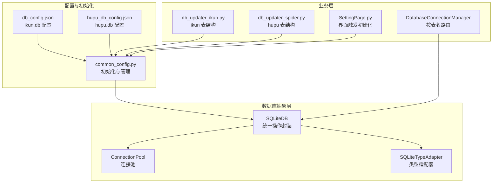
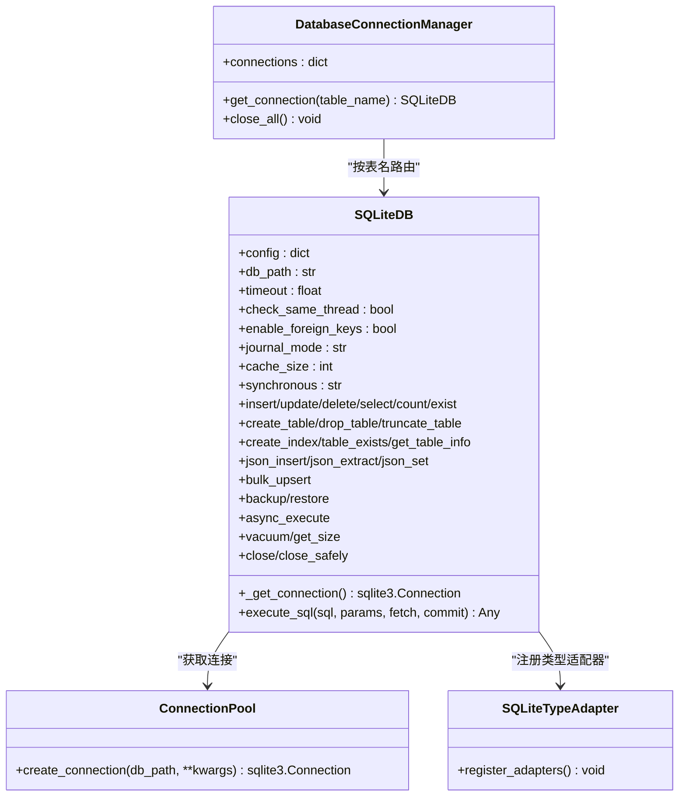
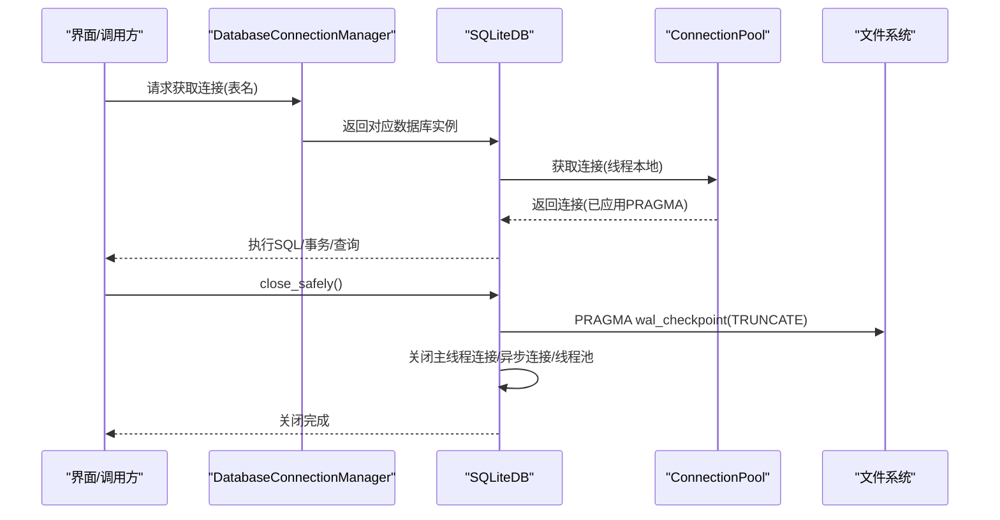
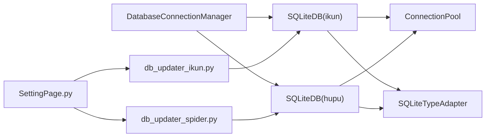

# 数据库架构

<cite>
**本文引用的文件**
- [classSQLite.py](file://modules/classSQLite.py)
- [common_config.py](file://config/common_config.py)
- [db_config.json](file://配置文件_系统配置/db_config.json)
- [hupu_db_config.json](file://配置文件_系统配置/hupu_db_config.json)
- [db_updater_ikun.py](file://utils/db_updater_ikun.py)
- [db_updater_spider.py](file://utils/db_updater_spider.py)
- [SettingPage.py](file://gui/SettingPage.py)
</cite>

## 目录
1. [简介](#简介)
2. [项目结构](#项目结构)
3. [核心组件](#核心组件)
4. [架构总览](#架构总览)
5. [组件详解](#组件详解)
6. [依赖关系分析](#依赖关系分析)
7. [性能考量](#性能考量)
8. [故障排查指南](#故障排查指南)
9. [结论](#结论)
10. [附录](#附录)

## 简介
本文件系统性阐述 ikun_temu_system 的数据库架构，重点围绕双数据库设计（ikun.db 与 hupu.db）、数据库连接管理器的设计与实现、SQLiteDB 类的封装与线程安全机制、数据库配置文件结构与参数、初始化流程与连接池配置、WAL 模式的性能优化与安全关闭流程（含 WAL 文件合并）。文档同时提供关键流程的时序与类图，帮助读者快速理解与落地实践。

## 项目结构
- 双数据库文件
  - ikun.db：位于“配置文件_系统配置/ikun.db”，对应配置文件“配置文件_系统配置/db_config.json”
  - hupu.db：位于“配置文件_系统配置/hupu.db”，对应配置文件“配置文件_系统配置/hupu_db_config.json”
- 核心数据库抽象层
  - SQLiteDB：统一的 SQLite 操作封装，支持同步/异步、连接池、事务、JSON、类型注解、查询构建器等
  - ConnectionPool：线程安全的连接池（单例 + RLock 保护）
  - SQLiteTypeAdapter：SQLite 类型适配器（JSON/DATETIME/DATE）
- 连接管理与初始化
  - DatabaseConnectionManager：按表名路由到 ikun 或 hupu 数据库
  - 初始化流程：common_config.py 中负责创建/加载配置、实例化 SQLiteDB、初始化表结构
- 表结构管理
  - db_updater_ikun.py：ikun 数据库表结构初始化与升级
  - db_updater_spider.py：hupu 数据库表结构初始化与升级

图表来源
- [common_config.py:197-243](file://config/common_config.py#L197-L243)
- [classSQLite.py:294-331](file://modules/classSQLite.py#L294-L331)
- [classSQLite.py:359-418](file://modules/classSQLite.py#L359-L418)
- [db_config.json:1-18](file://配置文件_系统配置/db_config.json#L1-L18)
- [hupu_db_config.json:1-18](file://配置文件_系统配置/hupu_db_config.json#L1-L18)

章节来源
- [common_config.py:197-243](file://config/common_config.py#L197-L243)
- [db_config.json:1-18](file://配置文件_系统配置/db_config.json#L1-L18)
- [hupu_db_config.json:1-18](file://配置文件_系统配置/hupu_db_config.json#L1-L18)

## 核心组件
- DatabaseConnectionManager：按表名将请求路由到 ikun 或 hupu 数据库，维护连接缓存，避免重复创建
- SQLiteDB：提供 CRUD、事务、表/索引管理、JSON 支持、查询构建器、备份/恢复、异步执行、安全关闭（含 WAL 合并）
- ConnectionPool：线程安全的连接池，单例模式 + RLock 保证并发安全；按配置应用 PRAGMA（外键、WAL、缓存、同步级别）
- SQLiteTypeAdapter：注册 JSON、DATETIME、DATE 的适配器与转换器，确保 Python 对象与 SQLite 存储类型互转
- 配置文件：db_config.json 与 hupu_db_config.json，定义数据库路径、超时、线程策略、外键开关、WAL、缓存大小、同步级别、连接池参数等

章节来源
- [common_config.py:16-48](file://config/common_config.py#L16-L48)
- [classSQLite.py:294-331](file://modules/classSQLite.py#L294-L331)
- [classSQLite.py:359-418](file://modules/classSQLite.py#L359-L418)
- [classSQLite.py:241-292](file://modules/classSQLite.py#L241-L292)
- [db_config.json:1-18](file://配置文件_系统配置/db_config.json#L1-L18)
- [hupu_db_config.json:1-18](file://配置文件_系统配置/hupu_db_config.json#L1-L18)

## 架构总览
双数据库架构通过 DatabaseConnectionManager 实现“表名到数据库”的路由，SQLiteDB 抽象层屏蔽底层差异，ConnectionPool 提供线程安全的连接复用，WAL 模式提升并发读写性能，安全关闭流程确保 WAL 文件合并，避免数据损坏。

图表来源
- [common_config.py:16-48](file://config/common_config.py#L16-L48)
- [classSQLite.py:294-331](file://modules/classSQLite.py#L294-L331)
- [classSQLite.py:359-418](file://modules/classSQLite.py#L359-L418)
- [classSQLite.py:241-292](file://modules/classSQLite.py#L241-L292)

## 组件详解

### DatabaseConnectionManager（表名到数据库的映射）
- 设计要点
  - 缓存机制：首次按表名获取后缓存连接，避免重复创建
  - 路由规则：
    - 任务/店铺/分析类表（如 task、shop、ai_analysis）路由至 ikun 数据库
    - 虎扑采集类表（如 hupu_post_list、hupu_detail_list、hupu_score_list）路由至 hupu 数据库
    - 默认回退到 ikun 数据库
- 线程安全：内部字典访问受 GIL 保护，结合 SQLiteDB 的线程本地连接，整体满足多线程场景需求

章节来源
- [common_config.py:16-48](file://config/common_config.py#L16-L48)

### SQLiteDB（数据库抽象与封装）
- 功能特性
  - 同步/异步统一接口
  - 连接池与线程本地连接（每个线程持有独立连接）
  - 事务上下文管理器
  - 表/索引/外键管理
  - JSON 字段支持（含路径操作）
  - 查询构建器（select/where/join/order/limit/offset/group/having/distinct）
  - 备份/恢复/清理（VACUUM）
  - 安全关闭（close_safely）：执行 WAL 检查点合并，确保文件一致性
- 线程安全机制
  - ConnectionPool 单例 + RLock 保护
  - 每个线程通过 threading.local() 持有独立连接
  - 连接创建时应用 PRAGMA（外键、WAL、缓存、同步级别）

章节来源
- [classSQLite.py:359-418](file://modules/classSQLite.py#L359-L418)
- [classSQLite.py:419-531](file://modules/classSQLite.py#L419-L531)
- [classSQLite.py:878-894](file://modules/classSQLite.py#L878-L894)
- [classSQLite.py:1417-1496](file://modules/classSQLite.py#L1417-L1496)

### ConnectionPool（连接池）
- 单例 + RLock 保证并发安全
- 按配置创建连接并应用 PRAGMA，确保各连接具备一致行为
- 与 SQLiteDB 的线程本地连接配合，避免跨线程共享连接带来的竞态

章节来源
- [classSQLite.py:294-331](file://modules/classSQLite.py#L294-L331)

### SQLiteTypeAdapter（类型适配器）
- 注册 JSON、DATETIME、DATE 的适配器与转换器
- 保证 Python 对象与 SQLite 存储类型的双向转换正确性

章节来源
- [classSQLite.py:241-292](file://modules/classSQLite.py#L241-L292)

### 配置文件结构与参数
- db_config.json（ikun.db）
  - db_path：数据库文件路径
  - timeout：连接超时秒数
  - check_same_thread：是否允许跨线程使用连接
  - enable_foreign_keys：是否启用外键约束
  - journal_mode：日志模式（默认 WAL）
  - cache_size：缓存页数（负值表示 KB）
  - synchronous：同步级别（默认 NORMAL）
  - pool_config：连接池配置
- hupu_db_config.json（hupu.db）
  - 结构与 ikun 配置一致，但 db_path 指向 hupu.db

章节来源
- [db_config.json:1-18](file://配置文件_系统配置/db_config.json#L1-L18)
- [hupu_db_config.json:1-18](file://配置文件_系统配置/hupu_db_config.json#L1-L18)

### 初始化流程与连接池配置
- 初始化顺序
  - 创建/加载配置文件（若不存在则按模板创建）
  - 实例化 SQLiteDB（传入配置路径）
  - 初始化表结构（ikun 与 hupu 分别调用对应 updater）
  - 写入初始化锁文件，避免重复初始化
- 连接池参数
  - max_connections/min_connections/connection_timeout/idle_timeout/pool_recycle/pool_pre_ping
  - 通过 PoolConfig 传入 SQLiteDB，用于线程池与连接池行为控制

章节来源
- [common_config.py:197-243](file://config/common_config.py#L197-L243)
- [common_config.py:245-334](file://config/common_config.py#L245-L334)
- [db_config.json:9-16](file://配置文件_系统配置/db_config.json#L9-L16)
- [hupu_db_config.json:9-16](file://配置文件_系统配置/hupu_db_config.json#L9-L16)

### 表结构管理与升级
- ikun 表结构
  - 初始化：config 表、record 表、shops 表、task 表
  - 升级：通用 update_table_structure 函数，支持新增字段、重建表（保留有效字段）、索引校验
- hupu 表结构
  - 初始化：ai_analysis、hupu_post_list、hupu_detail_list、hupu_score_list
  - 升级：同上

章节来源
- [db_updater_ikun.py:328-525](file://utils/db_updater_ikun.py#L328-L525)
- [db_updater_spider.py:152-461](file://utils/db_updater_spider.py#L152-L461)

### 安全关闭与 WAL 文件合并
- close_safely 流程
  - 关闭所有连接（主线程与异步连接）
  - 以新连接执行 PRAGMA wal_checkpoint(TRUNCATE)，强制合并 WAL 文件
  - 关闭线程池
- global_db_close（GUI 触发）
  - 遍历已初始化的数据库（ikun/hupu），依次执行 WAL 检查点、关闭连接与线程池

图表来源
- [common_config.py:59-134](file://config/common_config.py#L59-L134)
- [classSQLite.py:1417-1496](file://modules/classSQLite.py#L1417-L1496)

章节来源
- [common_config.py:59-134](file://config/common_config.py#L59-L134)
- [classSQLite.py:1417-1496](file://modules/classSQLite.py#L1417-L1496)

## 依赖关系分析
- DatabaseConnectionManager 依赖全局 db/hupu_db（SQLiteDB 实例）
- SQLiteDB 依赖 ConnectionPool 与 SQLiteTypeAdapter
- 初始化流程依赖 db_updater_ikun.py 与 db_updater_spider.py
- GUI 通过 SettingPage.py 触发数据库初始化

图表来源
- [common_config.py:16-48](file://config/common_config.py#L16-L48)
- [classSQLite.py:294-331](file://modules/classSQLite.py#L294-L331)
- [classSQLite.py:241-292](file://modules/classSQLite.py#L241-L292)
- [db_updater_ikun.py:328-525](file://utils/db_updater_ikun.py#L328-L525)
- [db_updater_spider.py:152-461](file://utils/db_updater_spider.py#L152-L461)
- [SettingPage.py:718-749](file://gui/SettingPage.py#L718-L749)

章节来源
- [common_config.py:16-48](file://config/common_config.py#L16-L48)
- [classSQLite.py:294-331](file://modules/classSQLite.py#L294-L331)
- [classSQLite.py:241-292](file://modules/classSQLite.py#L241-L292)
- [db_updater_ikun.py:328-525](file://utils/db_updater_ikun.py#L328-L525)
- [db_updater_spider.py:152-461](file://utils/db_updater_spider.py#L152-L461)
- [SettingPage.py:718-749](file://gui/SettingPage.py#L718-L749)

## 性能考量
- WAL 模式
  - 读写并发提升，降低锁竞争
  - 需要定期执行 WAL 检查点合并，避免 WAL 文件过大
- 缓存与同步
  - cache_size：增大缓存可提升吞吐，注意内存占用
  - synchronous：NORMAL 平衡性能与安全性；如需更强一致性可调整
- 连接池
  - max_connections 设置较高值以支持高并发
  - pool_pre_ping 可在获取连接前进行健康检查，减少无效连接
- 索引与查询
  - 通过 db_updater_* 自动创建索引，避免全表扫描
  - 使用查询构建器生成 SQL，减少手写错误

章节来源
- [db_config.json:6-8](file://配置文件_系统配置/db_config.json#L6-L8)
- [hupu_db_config.json:6-8](file://配置文件_系统配置/hupu_db_config.json#L6-L8)
- [db_config.json:9-16](file://配置文件_系统配置/db_config.json#L9-L16)
- [hupu_db_config.json:9-16](file://配置文件_系统配置/hupu_db_config.json#L9-L16)

## 故障排查指南
- 初始化失败
  - 检查配置文件是否存在与可读
  - 确认数据库文件路径与权限
  - 查看初始化日志输出，定位具体失败步骤
- 连接异常
  - 确认 check_same_thread 设置与线程使用方式一致
  - 检查连接池参数是否合理
- WAL 相关问题
  - 使用 close_safely/global_db_close 确保 WAL 合并
  - 若 WAL 文件持续增长，检查是否频繁写入且未及时关闭
- 表结构升级
  - 使用 db_updater_* 的 update_table_structure，注意字段删除风险（可能触发重建表）

章节来源
- [common_config.py:245-334](file://config/common_config.py#L245-L334)
- [classSQLite.py:1417-1496](file://modules/classSQLite.py#L1417-L1496)
- [db_updater_ikun.py:10-148](file://utils/db_updater_ikun.py#L10-L148)
- [db_updater_spider.py:12-150](file://utils/db_updater_spider.py#L12-L150)

## 结论
该数据库架构通过双数据库分离业务域、统一的 SQLiteDB 抽象层、严格的连接池与类型适配器、以及完善的初始化与安全关闭流程，实现了高性能、可维护、可扩展的 SQLite 数据方案。WAL 模式与合理的 PRAGMA 配置进一步提升了并发与可靠性。建议在生产环境中遵循“安全关闭 + WAL 合并”的流程，并根据业务负载动态调整连接池与缓存参数。

## 附录
- 表名到数据库映射规则
  - ikun：task、shop、ai_analysis
  - hupu：hupu_post_list、hupu_detail_list、hupu_score_list
  - 默认：ikun
- 初始化入口
  - GUI：SettingPage.py
  - 代码：common_config.initialize_all_databases

章节来源
- [common_config.py:28-42](file://config/common_config.py#L28-L42)
- [SettingPage.py:718-749](file://gui/SettingPage.py#L718-L749)