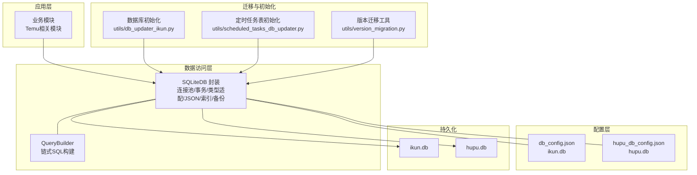
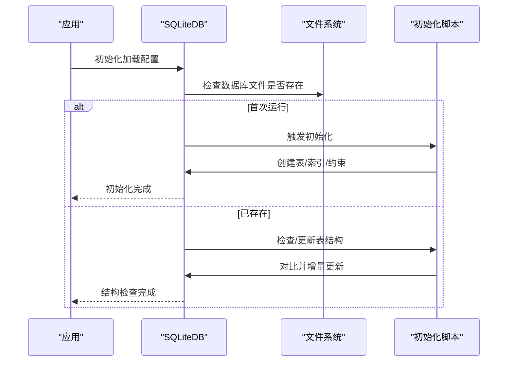
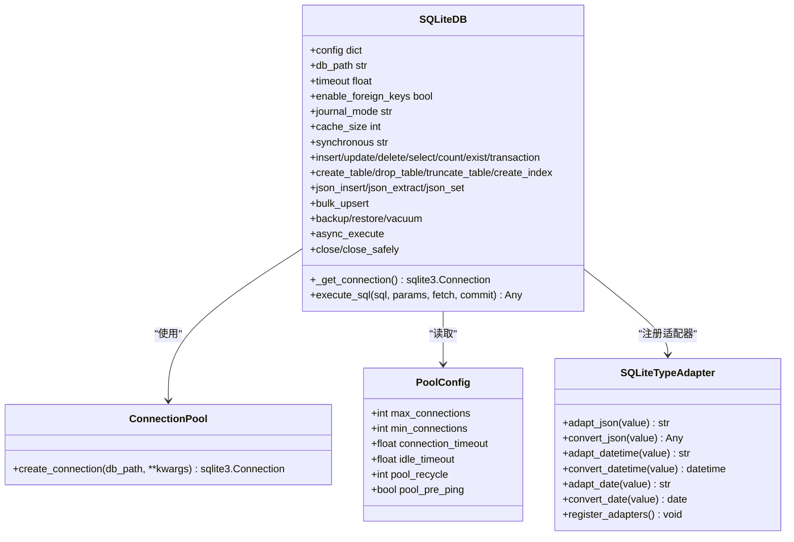
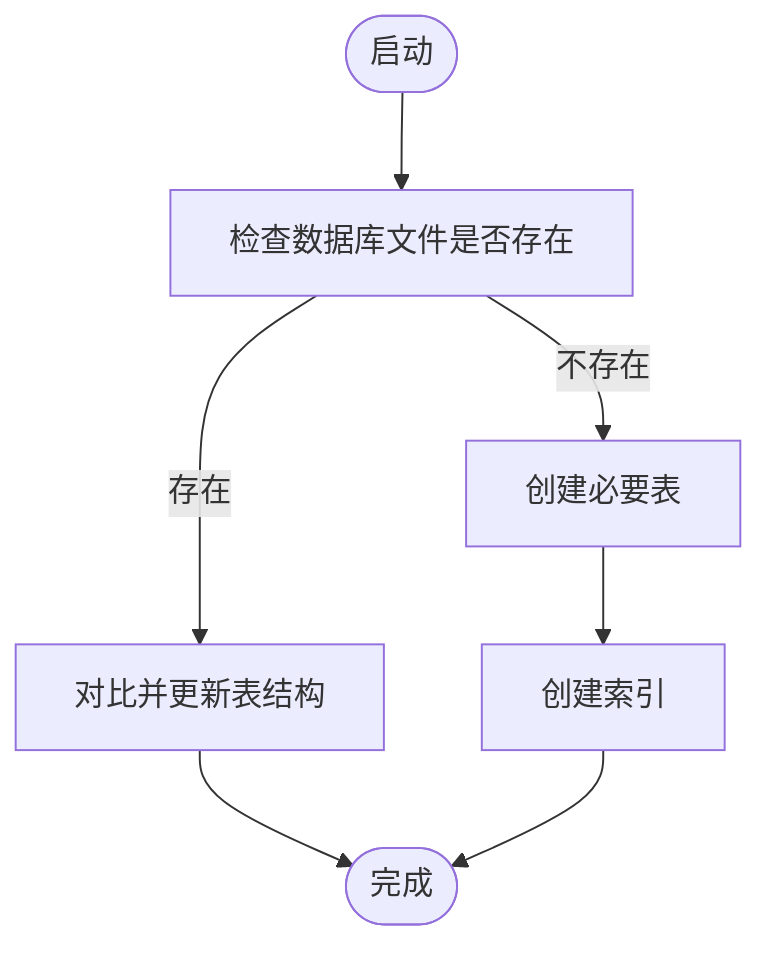
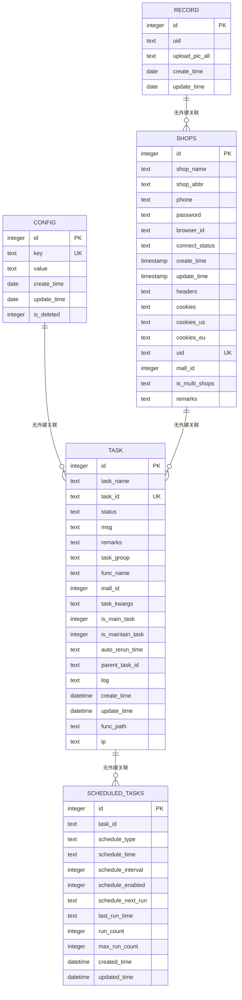
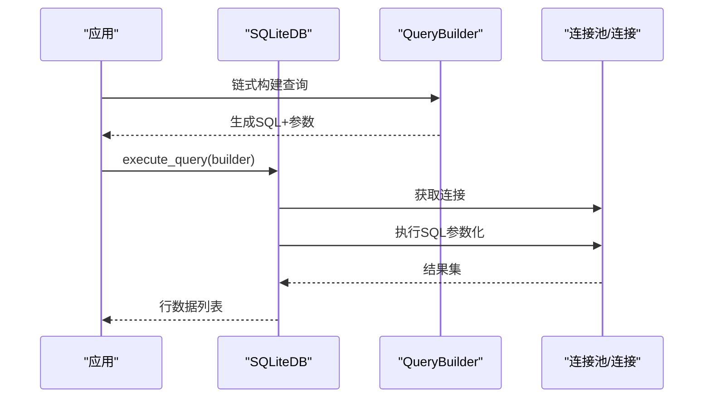
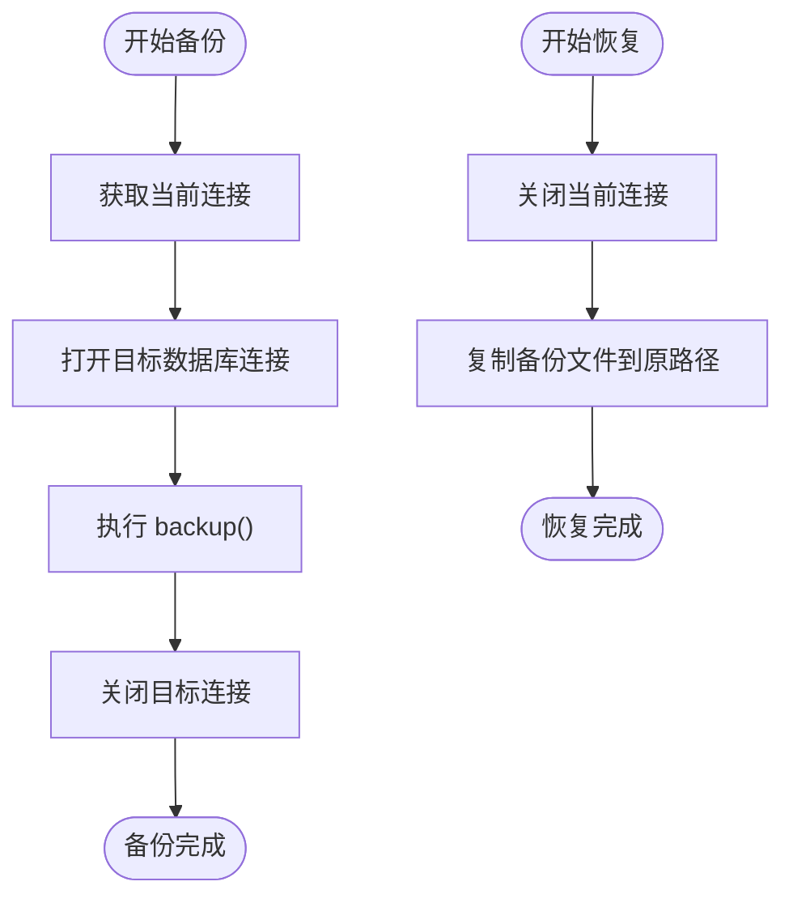
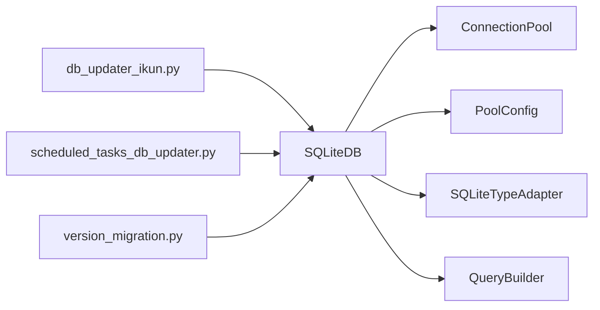

# 数据库设计

<cite>
**本文引用的文件**
- [modules/classSQLite.py](file://modules/classSQLite.py)
- [配置文件_系统配置/db_config.json](file://配置文件_系统配置/db_config.json)
- [配置文件_系统配置/hupu_db_config.json](file://配置文件_系统配置/hupu_db_config.json)
- [utils/db_updater_ikun.py](file://utils/db_updater_ikun.py)
- [utils/scheduled_tasks_db_updater.py](file://utils/scheduled_tasks_db_updater.py)
- [utils/version_migration.py](file://utils/version_migration.py)
</cite>

## 目录
1. [简介](#简介)
2. [项目结构](#项目结构)
3. [核心组件](#核心组件)
4. [架构总览](#架构总览)
5. [详细组件分析](#详细组件分析)
6. [依赖分析](#依赖分析)
7. [性能考虑](#性能考虑)
8. [故障排除指南](#故障排除指南)
9. [结论](#结论)
10. [附录](#附录)

## 简介
本文件面向 ikun_temu_system 的数据库设计，围绕以下目标展开：
- 全面说明数据库架构与表结构设计
- 解释数据模型之间的关系与约束
- 描述数据库初始化流程与版本管理策略
- 提供 Schema 图与实体关系图
- 解释数据访问模式与查询优化策略
- 描述数据迁移与备份恢复机制
- 给出性能调优与索引设计建议
- 提供故障排除与维护指南

## 项目结构
ikun_temu_system 的数据库层主要由以下模块构成：
- 数据库访问与连接池封装：modules/classSQLite.py
- 数据库配置：配置文件_系统配置/db_config.json、配置文件_系统配置/hupu_db_config.json
- 数据库初始化与版本迁移：utils/db_updater_ikun.py、utils/scheduled_tasks_db_updater.py、utils/version_migration.py

**图表来源**
- [modules/classSQLite.py:359-418](file://modules/classSQLite.py#L359-L418)
- [配置文件_系统配置/db_config.json:1-19](file://配置文件_系统配置/db_config.json#L1-L19)
- [配置文件_系统配置/hupu_db_config.json:1-18](file://配置文件_系统配置/hupu_db_config.json#L1-L18)
- [utils/db_updater_ikun.py:328-395](file://utils/db_updater_ikun.py#L328-L395)
- [utils/scheduled_tasks_db_updater.py:233-283](file://utils/scheduled_tasks_db_updater.py#L233-L283)
- [utils/version_migration.py:328-446](file://utils/version_migration.py#L328-L446)

**章节来源**
- [modules/classSQLite.py:359-418](file://modules/classSQLite.py#L359-L418)
- [配置文件_系统配置/db_config.json:1-19](file://配置文件_系统配置/db_config.json#L1-L19)
- [配置文件_系统配置/hupu_db_config.json:1-18](file://配置文件_系统配置/hupu_db_config.json#L1-L18)
- [utils/db_updater_ikun.py:328-395](file://utils/db_updater_ikun.py#L328-L395)
- [utils/scheduled_tasks_db_updater.py:233-283](file://utils/scheduled_tasks_db_updater.py#L233-L283)
- [utils/version_migration.py:328-446](file://utils/version_migration.py#L328-L446)

## 核心组件
- SQLiteDB：提供同步/异步操作、连接池、事务、ORM风格、JSON支持、类型适配器、查询构建器、索引、备份/恢复、批量UPSERT、VACUUM、WAL安全关闭等能力。
- QueryBuilder：链式构建 SELECT/JOIN/WHERE/GROUP/HAVING/ORDER/LIMIT/OFFSET/DISTINCT 等子句。
- 配置加载：load_db_config 支持自动检测编码、合并默认配置，确保 PRAGMA 参数生效（外键、WAL、缓存、同步级别）。
- 初始化与迁移：db_updater_ikun.py 提供通用表结构更新与初始化；scheduled_tasks_db_updater.py 提供定时任务表专用初始化；version_migration.py 提供跨目录迁移与备份恢复。

**章节来源**
- [modules/classSQLite.py:66-103](file://modules/classSQLite.py#L66-L103)
- [modules/classSQLite.py:106-238](file://modules/classSQLite.py#L106-L238)
- [modules/classSQLite.py:359-418](file://modules/classSQLite.py#L359-L418)
- [utils/db_updater_ikun.py:10-148](file://utils/db_updater_ikun.py#L10-L148)
- [utils/scheduled_tasks_db_updater.py:17-161](file://utils/scheduled_tasks_db_updater.py#L17-L161)
- [utils/version_migration.py:328-446](file://utils/version_migration.py#L328-L446)

## 架构总览
数据库层采用“封装 + 配置 + 初始化/迁移”的分层设计：
- 封装层：统一的 SQLiteDB 抽象，屏蔽底层差异，提供一致的 API。
- 配置层：集中管理数据库路径、超时、线程策略、外键、WAL、缓存、同步级别等。
- 初始化/迁移层：按需创建/更新表结构，保证版本演进与向后兼容。

**图表来源**
- [utils/db_updater_ikun.py:328-395](file://utils/db_updater_ikun.py#L328-L395)
- [modules/classSQLite.py:359-418](file://modules/classSQLite.py#L359-L418)

**章节来源**
- [utils/db_updater_ikun.py:328-395](file://utils/db_updater_ikun.py#L328-L395)
- [modules/classSQLite.py:359-418](file://modules/classSQLite.py#L359-L418)

## 详细组件分析

### 数据库配置与连接池
- 配置项包括：数据库路径、超时、线程策略、外键开关、WAL 模式、缓存大小、同步级别、连接池参数、调试开关。
- 连接池：ConnectionPool 单例，线程本地持有连接，按配置应用 PRAGMA。
- 类型适配：注册 dict/list/datetime/date 到 JSON/DATETIME/DATE 的适配器，支持 JSON 字段与日期时间字段的序列化/反序列化。
- 异步支持：aiosqlite 连接，按配置应用 PRAGMA，支持异步执行与事务。

**图表来源**
- [modules/classSQLite.py:29-38](file://modules/classSQLite.py#L29-L38)
- [modules/classSQLite.py:294-329](file://modules/classSQLite.py#L294-L329)
- [modules/classSQLite.py:241-292](file://modules/classSQLite.py#L241-L292)
- [modules/classSQLite.py:359-418](file://modules/classSQLite.py#L359-L418)

**章节来源**
- [配置文件_系统配置/db_config.json:1-19](file://配置文件_系统配置/db_config.json#L1-L19)
- [配置文件_系统配置/hupu_db_config.json:1-18](file://配置文件_系统配置/hupu_db_config.json#L1-L18)
- [modules/classSQLite.py:66-103](file://modules/classSQLite.py#L66-L103)
- [modules/classSQLite.py:294-329](file://modules/classSQLite.py#L294-L329)
- [modules/classSQLite.py:241-292](file://modules/classSQLite.py#L241-L292)
- [modules/classSQLite.py:359-418](file://modules/classSQLite.py#L359-L418)

### 数据库初始化与版本管理
- 初始化流程：检测数据库文件是否存在，不存在则创建必要表；存在则检查并更新表结构。
- 通用表结构更新：对比目标字段与当前结构，支持新增字段、重建表（保留有效字段）、确保索引存在。
- 定时任务表：独立初始化/更新流程，包含索引与字段校验。
- 版本迁移：提供跨目录迁移、备份恢复、关闭/重连数据库的完整流程。

**图表来源**
- [utils/db_updater_ikun.py:328-395](file://utils/db_updater_ikun.py#L328-L395)
- [utils/scheduled_tasks_db_updater.py:233-283](file://utils/scheduled_tasks_db_updater.py#L233-L283)

**章节来源**
- [utils/db_updater_ikun.py:10-148](file://utils/db_updater_ikun.py#L10-L148)
- [utils/db_updater_ikun.py:328-395](file://utils/db_updater_ikun.py#L328-L395)
- [utils/scheduled_tasks_db_updater.py:17-161](file://utils/scheduled_tasks_db_updater.py#L17-L161)
- [utils/scheduled_tasks_db_updater.py:233-283](file://utils/scheduled_tasks_db_updater.py#L233-L283)
- [utils/version_migration.py:328-446](file://utils/version_migration.py#L328-L446)

### 数据模型与表结构
基于初始化与更新脚本，可归纳出以下核心表及关键字段、约束与索引（字段类型与约束以实际初始化脚本为准）：

**图表来源**
- [utils/db_updater_ikun.py:398-525](file://utils/db_updater_ikun.py#L398-L525)
- [utils/scheduled_tasks_db_updater.py:163-230](file://utils/scheduled_tasks_db_updater.py#L163-L230)

**章节来源**
- [utils/db_updater_ikun.py:398-525](file://utils/db_updater_ikun.py#L398-L525)
- [utils/scheduled_tasks_db_updater.py:163-230](file://utils/scheduled_tasks_db_updater.py#L163-L230)

### 查询构建器与数据访问模式
- QueryBuilder 支持链式构建 SELECT/JOIN/WHERE/GROUP/HAVING/ORDER/LIMIT/OFFSET/DISTINCT，适合复杂查询组装。
- SQLiteDB 提供高层 CRUD 与聚合、计数、存在性检查、事务、批量插入/UPSERT、JSON 操作、索引管理、备份/恢复、VACUUM、安全关闭等。
- 数据访问模式建议：
  - 优先使用 SQLiteDB 的高层方法，减少手写 SQL 出错概率。
  - 大量写入场景使用批量插入/UPSERT，降低事务开销。
  - 复杂联表查询使用 QueryBuilder 组合，避免字符串拼接。
  - 对热点字段建立合适索引，结合 EXPLAIN QUERY PLAN 分析。

**图表来源**
- [modules/classSQLite.py:106-238](file://modules/classSQLite.py#L106-L238)
- [modules/classSQLite.py:863-874](file://modules/classSQLite.py#L863-L874)

**章节来源**
- [modules/classSQLite.py:106-238](file://modules/classSQLite.py#L106-L238)
- [modules/classSQLite.py:863-874](file://modules/classSQLite.py#L863-L874)

### 备份与恢复机制
- 备份：SQLiteDB.backup 使用 sqlite3.Connection.backup，将当前数据库原子性复制到目标路径。
- 恢复：SQLiteDB.restore 先关闭连接，再复制备份文件到原数据库路径，最后记录日志。
- 安全关闭：SQLiteDB.close_safely 在关闭前执行 WAL 检查点（PRAGMA wal_checkpoint(TRUNCATE)），合并 WAL/SHM 文件，确保数据落盘。

**图表来源**
- [modules/classSQLite.py:1241-1298](file://modules/classSQLite.py#L1241-L1298)
- [modules/classSQLite.py:1417-1496](file://modules/classSQLite.py#L1417-L1496)

**章节来源**
- [modules/classSQLite.py:1241-1298](file://modules/classSQLite.py#L1241-L1298)
- [modules/classSQLite.py:1417-1496](file://modules/classSQLite.py#L1417-L1496)

## 依赖分析
- 模块耦合：
  - SQLiteDB 依赖 ConnectionPool、PoolConfig、SQLiteTypeAdapter、QueryBuilder。
  - 初始化脚本依赖 SQLiteDB 的表结构更新与索引创建能力。
  - 迁移脚本依赖 SQLiteDB 的备份/恢复与安全关闭能力。
- 外部依赖：
  - aiosqlite（异步）
  - chardet（配置文件编码检测）
  - sqlite3（标准库）

**图表来源**
- [modules/classSQLite.py:29-38](file://modules/classSQLite.py#L29-L38)
- [modules/classSQLite.py:294-329](file://modules/classSQLite.py#L294-L329)
- [modules/classSQLite.py:241-292](file://modules/classSQLite.py#L241-L292)
- [utils/db_updater_ikun.py:10-148](file://utils/db_updater_ikun.py#L10-L148)
- [utils/scheduled_tasks_db_updater.py:17-161](file://utils/scheduled_tasks_db_updater.py#L17-L161)
- [utils/version_migration.py:328-446](file://utils/version_migration.py#L328-L446)

**章节来源**
- [modules/classSQLite.py:29-38](file://modules/classSQLite.py#L29-L38)
- [modules/classSQLite.py:294-329](file://modules/classSQLite.py#L294-L329)
- [modules/classSQLite.py:241-292](file://modules/classSQLite.py#L241-L292)
- [utils/db_updater_ikun.py:10-148](file://utils/db_updater_ikun.py#L10-L148)
- [utils/scheduled_tasks_db_updater.py:17-161](file://utils/scheduled_tasks_db_updater.py#L17-L161)
- [utils/version_migration.py:328-446](file://utils/version_migration.py#L328-L446)

## 性能考虑
- WAL 模式：启用 WAL 提升并发读写性能，配合 PRAGMA journal_mode=WAL。
- 缓存与同步：合理设置 cache_size 与 synchronous，在可靠性与性能之间平衡。
- 索引设计：
  - 为高频过滤/连接/排序字段建立索引（如 shops.browser_id、task.status、task.task_id 等）。
  - 对唯一约束字段（如 config.key、shops.uid、task.task_id）建立唯一索引。
  - 避免过度索引导致写入变慢。
- 查询优化：
  - 使用 QueryBuilder 组合查询，避免 N+1 查询。
  - 对大结果集使用 LIMIT/OFFSET 或分页。
  - 使用 EXPLAIN QUERY PLAN 分析执行计划。
- 批量操作：
  - 使用 insert_many/bulk_upsert 降低事务开销。
  - 事务内批量提交。
- 维护：
  - 定期 vacuum 清理碎片。
  - 定期检查 WAL 文件大小，必要时安全关闭触发合并。

[本节为通用指导，无需特定文件引用]

## 故障排除指南
- 初始化失败：
  - 检查数据库路径与权限；确认配置文件编码正确。
  - 查看初始化日志，定位具体表创建/索引创建失败原因。
- 表结构变更失败：
  - 若涉及删除字段，将触发重建表流程，注意数据丢失风险。
  - 确保无外键约束阻塞（如 scheduled_tasks 表曾检测外键并重建）。
- 备份/恢复失败：
  - 确认数据库已关闭或可被替换；检查备份路径权限。
  - 恢复后验证表结构与数据完整性。
- 性能问题：
  - 检查索引是否命中；评估 WAL 文件大小与同步级别。
  - 使用 vacuum 与安全关闭合并 WAL。
- 异步连接问题：
  - 确认异步连接已按配置应用 PRAGMA；避免混用同步/异步连接。

**章节来源**
- [utils/db_updater_ikun.py:10-148](file://utils/db_updater_ikun.py#L10-L148)
- [utils/scheduled_tasks_db_updater.py:257-283](file://utils/scheduled_tasks_db_updater.py#L257-L283)
- [modules/classSQLite.py:1241-1298](file://modules/classSQLite.py#L1241-L1298)
- [modules/classSQLite.py:1417-1496](file://modules/classSQLite.py#L1417-L1496)

## 结论
ikun_temu_system 的数据库层通过 SQLiteDB 封装实现了统一、可扩展、易维护的数据访问能力；配合完善的初始化与版本迁移机制，能够稳定支撑业务演进。建议在生产环境中：
- 明确索引策略与定期维护计划
- 使用批量与事务优化写入
- 建立自动化备份与恢复演练
- 持续监控 WAL 与查询计划

[本节为总结，无需特定文件引用]

## 附录

### 数据库 Schema 一览（字段与约束）
- config 表：主键 id，唯一键 key，其余字段见初始化脚本。
- record 表：主键 id，字段 uid、upload_pic_all、create_time、update_time。
- shops 表：主键 id，唯一键 uid，新增 cookies_us、cookies_eu、is_multi_shops、remarks 等字段，含索引 idx_browser_id。
- task 表：主键 id，唯一键 task_id，含多字段索引（parent_task_id、status、task_group、is_main_task 等）。
- scheduled_tasks 表：主键 id，字段 schedule_*、run_count、created_time、updated_time，含索引 idx_task_id、idx_schedule_next_run、idx_schedule_enabled。

**章节来源**
- [utils/db_updater_ikun.py:398-525](file://utils/db_updater_ikun.py#L398-L525)
- [utils/scheduled_tasks_db_updater.py:163-230](file://utils/scheduled_tasks_db_updater.py#L163-L230)