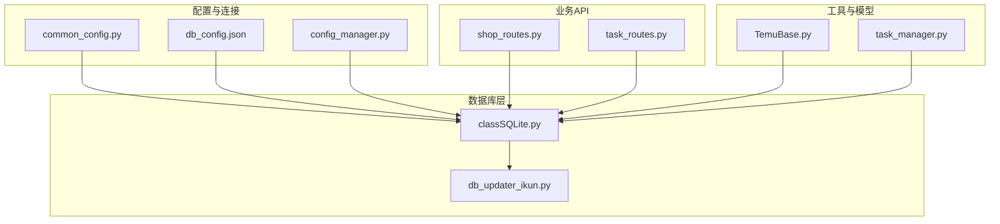
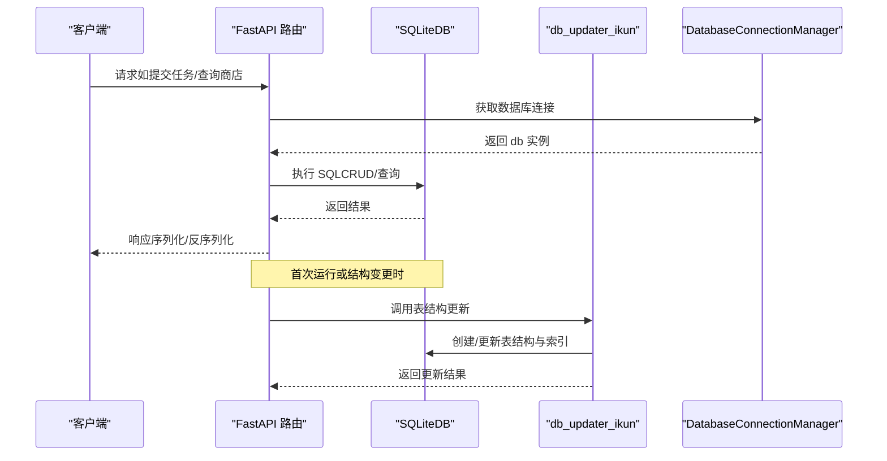
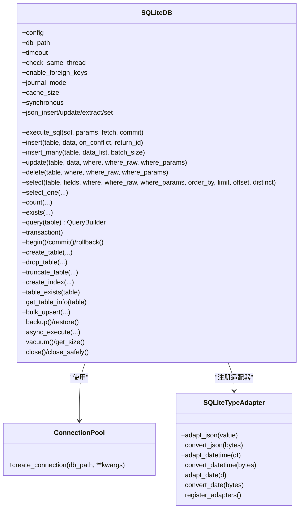
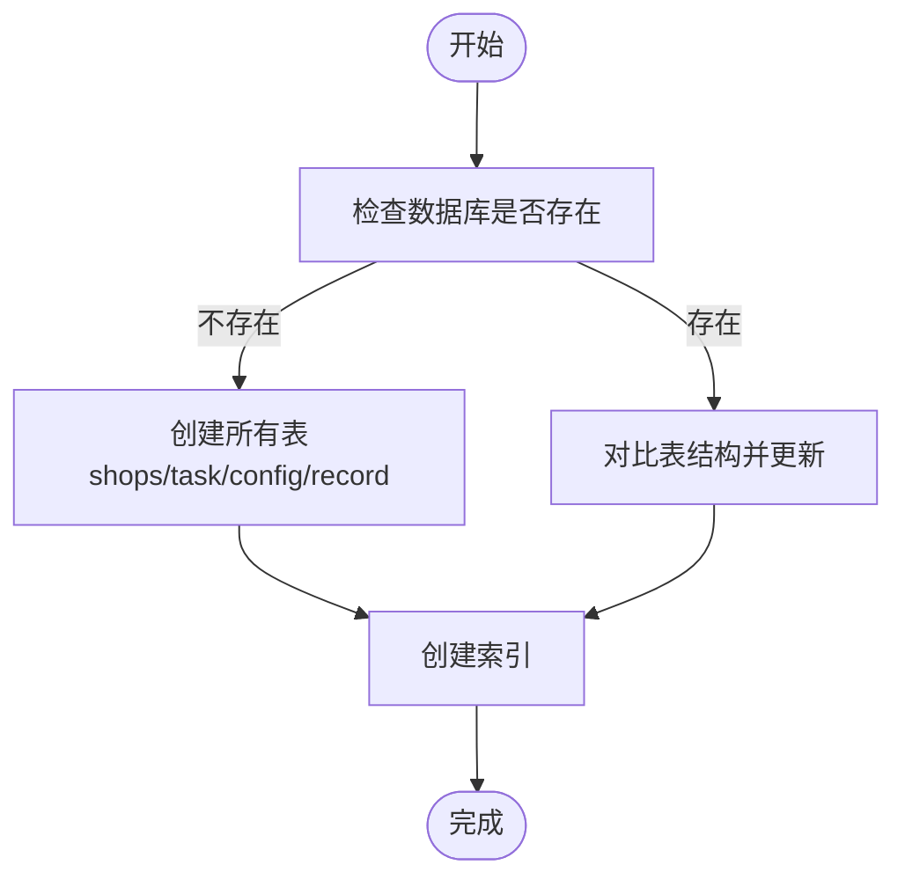
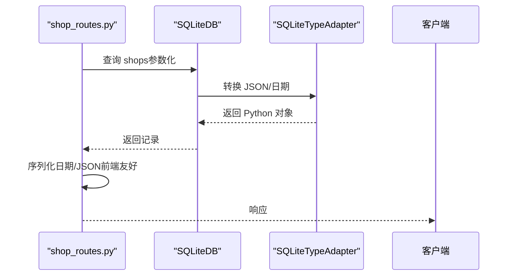
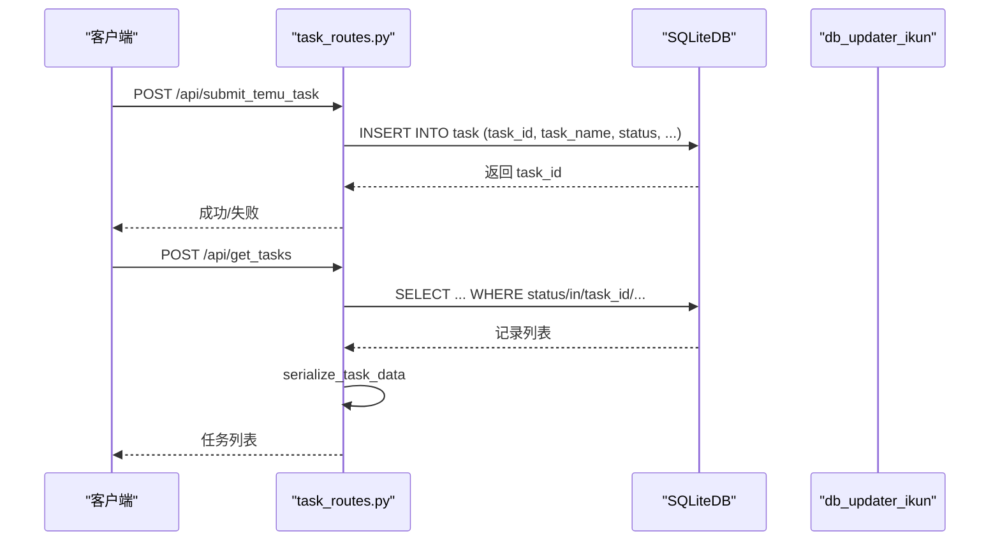
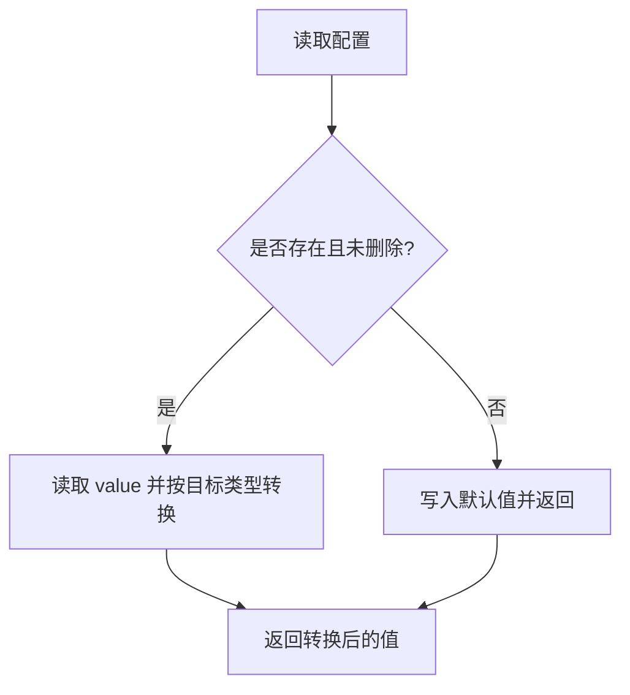
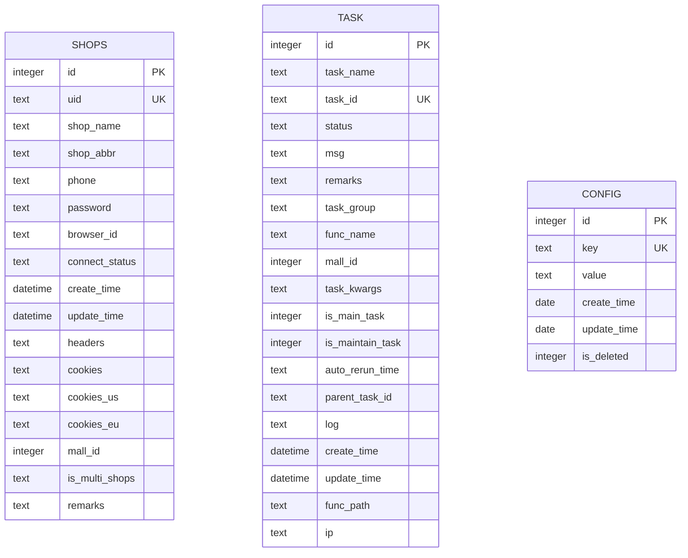
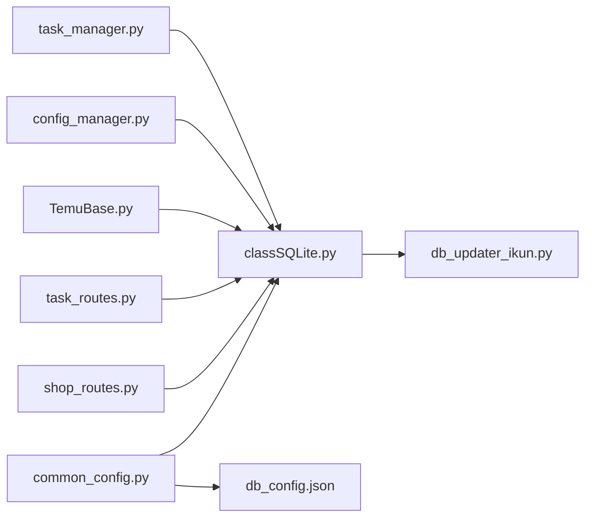

# 数据模型

<cite>
**本文引用的文件**
- [db_updater_ikun.py](file://utils/db_updater_ikun.py)
- [common_config.py](file://config/common_config.py)
- [classSQLite.py](file://modules/classSQLite.py)
- [middleware_config.py](file://config/middleware_config.py)
- [db_config.json](file://配置文件_系统配置/db_config.json)
- [TemuBase.py](file://utils/TemuBase.py)
- [shop_routes.py](file://api/server_routes/shop_routes.py)
- [task_routes.py](file://api/server_routes/task_routes.py)
- [config_manager.py](file://modules/config_manager.py)
- [task_manager.py](file://modules/task_manager.py)
</cite>

## 目录
1. [简介](#简介)
2. [项目结构](#项目结构)
3. [核心数据实体](#核心数据实体)
4. [架构总览](#架构总览)
5. [详细组件分析](#详细组件分析)
6. [依赖关系分析](#依赖关系分析)
7. [性能考量](#性能考量)
8. [故障排查指南](#故障排查指南)
9. [结论](#结论)
10. [附录](#附录)

## 简介
本文件系统性梳理 ikun_temu_system 的数据模型，聚焦于任务模型、店铺模型、配置模型等核心实体，解释其在数据库中的表结构、字段定义、索引与约束，以及在应用中的使用方式。文档还涵盖数据序列化/反序列化、缓存与性能优化、并发与线程安全、扩展点与自定义选项，并给出常见问题的排查建议。

## 项目结构
围绕数据模型的关键文件与职责如下：
- 数据库结构与迁移：utils/db_updater_ikun.py
- 数据库连接与类型适配：modules/classSQLite.py
- 全局数据库配置与连接管理：config/common_config.py
- API 层对数据模型的读写：api/server_routes/shop_routes.py、api/server_routes/task_routes.py
- 数据模型基类与工具：utils/TemuBase.py
- 配置持久化与类型转换：modules/config_manager.py
- 任务调度与并发控制：modules/task_manager.py
- 数据库配置文件：配置文件_系统配置/db_config.json

图表来源
- [common_config.py:16-51](file://config/common_config.py#L16-L51)
- [classSQLite.py:359-418](file://modules/classSQLite.py#L359-L418)
- [db_updater_ikun.py:10-148](file://utils/db_updater_ikun.py#L10-L148)
- [shop_routes.py:17-21](file://api/server_routes/shop_routes.py#L17-L21)
- [task_routes.py:27-35](file://api/server_routes/task_routes.py#L27-L35)
- [TemuBase.py:5-6](file://utils/TemuBase.py#L5-L6)
- [config_manager.py:6-20](file://modules/config_manager.py#L6-L20)
- [task_manager.py:14-20](file://modules/task_manager.py#L14-L20)

章节来源
- [common_config.py:16-51](file://config/common_config.py#L16-L51)
- [classSQLite.py:359-418](file://modules/classSQLite.py#L359-L418)
- [db_updater_ikun.py:10-148](file://utils/db_updater_ikun.py#L10-L148)
- [shop_routes.py:17-21](file://api/server_routes/shop_routes.py#L17-L21)
- [task_routes.py:27-35](file://api/server_routes/task_routes.py#L27-L35)
- [TemuBase.py:5-6](file://utils/TemuBase.py#L5-L6)
- [config_manager.py:6-20](file://modules/config_manager.py#L6-L20)
- [task_manager.py:14-20](file://modules/task_manager.py#L14-L20)

## 核心数据实体
本项目主要涉及三类核心数据实体：商店（shops）、任务（task）、配置（config）。它们分别对应数据库中的三张表，具备明确的字段、索引与约束。

- 商店（shops）
  - 关键字段：id、uid、shop_name、shop_abbr、phone、password、browser_id、connect_status、create_time、update_time、headers、cookies、cookies_us、cookies_eu、mall_id、is_multi_shops、remarks
  - 唯一约束：uid、id
  - 索引：idx_browser_id（browser_id）
  - 用途：存储 Temu 店铺的登录凭证、连接状态、多店铺标记等信息

- 任务（task）
  - 关键字段：id、task_name、task_id、status、msg、remarks、task_group、func_name、mall_id、task_kwargs、is_main_task、is_maintain_task、auto_rerun_time、parent_task_id、log、create_time、update_time、func_path、ip
  - 唯一约束：task_id
  - 索引：idx_parent_task、idx_status、idx_task_group、idx_task_main、idx_task_parent、idx_task_status
  - 用途：记录任务生命周期、状态、参数、父子关系、定时重跑等

- 配置（config）
  - 关键字段：id、key、value、create_time、update_time、is_deleted
  - 唯一约束：key
  - 用途：持久化运行期配置，支持类型自动转换与热更新

章节来源
- [db_updater_ikun.py:150-196](file://utils/db_updater_ikun.py#L150-L196)
- [db_updater_ikun.py:198-250](file://utils/db_updater_ikun.py#L198-L250)
- [db_updater_ikun.py:398-478](file://utils/db_updater_ikun.py#L398-L478)
- [db_updater_ikun.py:528-567](file://utils/db_updater_ikun.py#L528-L567)

## 架构总览
数据模型的总体架构围绕“配置/连接管理—数据库—业务API—任务调度”展开。全局数据库连接管理器负责按表名选择合适的数据库连接；SQLiteDB 提供统一的 CRUD、事务、索引、批量操作与类型适配；API 层通过 db_updater_ikun 的结构化迁移能力保证表结构一致性；任务管理器通过进程/线程模型实现高并发任务执行与状态同步。

图表来源
- [common_config.py:16-51](file://config/common_config.py#L16-L51)
- [classSQLite.py:436-531](file://modules/classSQLite.py#L436-L531)
- [db_updater_ikun.py:328-395](file://utils/db_updater_ikun.py#L328-L395)

章节来源
- [common_config.py:16-51](file://config/common_config.py#L16-L51)
- [classSQLite.py:436-531](file://modules/classSQLite.py#L436-L531)
- [db_updater_ikun.py:328-395](file://utils/db_updater_ikun.py#L328-L395)

## 详细组件分析

### 数据库连接与类型适配（SQLiteDB）
- 连接池与线程安全：每个线程持有独立连接，避免跨线程共享连接引发的竞态；提供线程本地存储与连接池封装。
- 类型适配：注册 JSON、DATETIME、DATE 的适配器与转换器，确保 Python 对象与 SQLite 存储之间的双向转换。
- 事务与批量：提供事务上下文、批量插入、批量 upsert、JSON 字段操作等高级能力。
- 配置驱动：从 db_config.json 读取参数，应用 PRAGMA（如 WAL、cache_size、synchronous）提升性能与可靠性。

图表来源
- [classSQLite.py:294-330](file://modules/classSQLite.py#L294-L330)
- [classSQLite.py:241-292](file://modules/classSQLite.py#L241-L292)
- [classSQLite.py:359-1510](file://modules/classSQLite.py#L359-L1510)

章节来源
- [classSQLite.py:294-330](file://modules/classSQLite.py#L294-L330)
- [classSQLite.py:241-292](file://modules/classSQLite.py#L241-L292)
- [classSQLite.py:359-1510](file://modules/classSQLite.py#L359-L1510)

### 数据库结构迁移与表定义（db_updater_ikun）
- 通用表结构更新：支持创建/更新表结构、新增字段、重建表（保留有效字段）、索引校验与创建。
- 商店表（shops）：新增 cookies_us、cookies_eu、uid、mall_id、is_multi_shops、remarks 等字段，唯一约束 uid、id，索引 browser_id。
- 任务表（task）：包含任务生命周期、状态、参数、父子关系、定时重跑等字段，唯一约束 task_id，多处索引加速查询。
- 配置表（config）：key 唯一，支持软删除标记。
- 初始化流程：首次运行或数据库不存在时创建所有表；存在时对比结构并更新。

图表来源
- [db_updater_ikun.py:328-395](file://utils/db_updater_ikun.py#L328-L395)
- [db_updater_ikun.py:150-196](file://utils/db_updater_ikun.py#L150-L196)
- [db_updater_ikun.py:198-250](file://utils/db_updater_ikun.py#L198-L250)
- [db_updater_ikun.py:398-478](file://utils/db_updater_ikun.py#L398-L478)
- [db_updater_ikun.py:528-567](file://utils/db_updater_ikun.py#L528-L567)

章节来源
- [db_updater_ikun.py:328-395](file://utils/db_updater_ikun.py#L328-L395)
- [db_updater_ikun.py:150-196](file://utils/db_updater_ikun.py#L150-L196)
- [db_updater_ikun.py:198-250](file://utils/db_updater_ikun.py#L198-L250)
- [db_updater_ikun.py:398-478](file://utils/db_updater_ikun.py#L398-L478)
- [db_updater_ikun.py:528-567](file://utils/db_updater_ikun.py#L528-L567)

### 店铺模型（shops）与序列化/反序列化
- 序列化：API 层在返回前对日期时间进行格式化，对 JSON 字段进行解析，确保前端可直接消费。
- 反序列化：数据库侧通过 SQLiteTypeAdapter 将 JSON/日期/时间转换为 Python 对象；API 层在入库前将对象序列化为字符串。
- 连接状态与多区域 Cookie：支持 cookies_us、cookies_eu，便于多区域运营场景。
- 并发安全：API 层通过参数化 SQL 与类型适配器避免注入与类型错误。

图表来源
- [shop_routes.py:20-119](file://api/server_routes/shop_routes.py#L20-L119)
- [classSQLite.py:241-292](file://modules/classSQLite.py#L241-L292)
- [TemuBase.py:49-132](file://utils/TemuBase.py#L49-L132)

章节来源
- [shop_routes.py:20-119](file://api/server_routes/shop_routes.py#L20-L119)
- [classSQLite.py:241-292](file://modules/classSQLite.py#L241-L292)
- [TemuBase.py:49-132](file://utils/TemuBase.py#L49-L132)

### 任务模型（task）与业务约束
- 业务约束
  - 唯一性：task_id 唯一，避免重复任务。
  - 状态机：status 字段映射为中文状态，支持 pending/running/success/failed/timeout/stopped 等。
  - 父子关系：parent_task_id 支持任务分组与层级管理。
  - 定时重跑：auto_rerun_time 支持周期性任务。
- API 使用
  - 提交任务：/api/submit_temu_task、/api/submit_spider_task，写入 task 表并设置 is_main_task/is_maintain_task 等标志位。
  - 查询任务：/api/get_tasks，支持多条件筛选、分页、排序。
  - 序列化：serialize_task_data 将 datetime 转为字符串，task_kwargs 解析为对象。

图表来源
- [task_routes.py:66-231](file://api/server_routes/task_routes.py#L66-L231)
- [task_routes.py:694-800](file://api/server_routes/task_routes.py#L694-L800)
- [db_updater_ikun.py:198-250](file://utils/db_updater_ikun.py#L198-L250)

章节来源
- [task_routes.py:66-231](file://api/server_routes/task_routes.py#L66-L231)
- [task_routes.py:694-800](file://api/server_routes/task_routes.py#L694-L800)
- [db_updater_ikun.py:198-250](file://utils/db_updater_ikun.py#L198-L250)

### 配置模型（config）与热更新
- 类型转换：支持 str/int/float/list/dict/tuple/bool，自动转换与回退。
- 热更新：每次读取均查询数据库，修改即刻生效。
- 存储：统一以字符串存储，必要时使用 JSON 编码。
- 使用：通过 ConfigManager 的 upsert_config/get_or_set_config/batch_init_config 等方法进行配置管理。

图表来源
- [config_manager.py:154-189](file://modules/config_manager.py#L154-L189)
- [config_manager.py:92-153](file://modules/config_manager.py#L92-L153)

章节来源
- [config_manager.py:154-189](file://modules/config_manager.py#L154-L189)
- [config_manager.py:92-153](file://modules/config_manager.py#L92-L153)

### 数据模型与数据库表映射关系
- shops 表：映射到商店实体，包含登录凭证、连接状态、多区域 Cookie、多店铺标记等。
- task 表：映射到任务实体，包含任务生命周期、状态、参数、父子关系、定时重跑等。
- config 表：映射到配置实体，支持键值对与类型转换。

图表来源
- [db_updater_ikun.py:150-196](file://utils/db_updater_ikun.py#L150-L196)
- [db_updater_ikun.py:198-250](file://utils/db_updater_ikun.py#L198-L250)
- [db_updater_ikun.py:398-478](file://utils/db_updater_ikun.py#L398-L478)
- [db_updater_ikun.py:528-567](file://utils/db_updater_ikun.py#L528-L567)

章节来源
- [db_updater_ikun.py:150-196](file://utils/db_updater_ikun.py#L150-L196)
- [db_updater_ikun.py:198-250](file://utils/db_updater_ikun.py#L198-L250)
- [db_updater_ikun.py:398-478](file://utils/db_updater_ikun.py#L398-L478)
- [db_updater_ikun.py:528-567](file://utils/db_updater_ikun.py#L528-L567)

### 数据模型的扩展点与自定义选项
- 自定义表结构：通过 update_table_structure 快速创建/更新任意表结构，支持唯一约束与索引。
- 字段扩展：在 shops/task/config 中新增字段时，遵循“先迁移结构，再写入数据”的流程，避免破坏既有数据。
- 配置扩展：通过 ConfigManager 扩展配置键，利用类型转换与热更新机制平滑演进。

章节来源
- [db_updater_ikun.py:10-148](file://utils/db_updater_ikun.py#L10-L148)
- [config_manager.py:92-153](file://modules/config_manager.py#L92-L153)

## 依赖关系分析
- 全局连接管理：DatabaseConnectionManager 按表名选择 db/hupu_db，避免跨库误用。
- API 依赖：shop_routes 与 task_routes 依赖 db_updater_ikun 的结构化迁移与 SQLiteDB 的统一接口。
- 配置依赖：ConfigManager 依赖 SQLiteDB 的执行能力，提供类型转换与热更新。
- 任务依赖：task_manager 通过 db_updater_ikun 的结构迁移与 SQLiteDB 的事务/批量能力保障任务状态一致性。

图表来源
- [common_config.py:16-51](file://config/common_config.py#L16-L51)
- [classSQLite.py:359-418](file://modules/classSQLite.py#L359-L418)
- [db_config.json:1-19](file://配置文件_系统配置/db_config.json#L1-L19)
- [shop_routes.py:17-21](file://api/server_routes/shop_routes.py#L17-L21)
- [task_routes.py:27-35](file://api/server_routes/task_routes.py#L27-L35)
- [TemuBase.py:5-6](file://utils/TemuBase.py#L5-L6)
- [config_manager.py:6-20](file://modules/config_manager.py#L6-L20)
- [task_manager.py:14-20](file://modules/task_manager.py#L14-L20)
- [db_updater_ikun.py:328-395](file://utils/db_updater_ikun.py#L328-L395)

章节来源
- [common_config.py:16-51](file://config/common_config.py#L16-L51)
- [classSQLite.py:359-418](file://modules/classSQLite.py#L359-L418)
- [db_config.json:1-19](file://配置文件_系统配置/db_config.json#L1-L19)
- [shop_routes.py:17-21](file://api/server_routes/shop_routes.py#L17-L21)
- [task_routes.py:27-35](file://api/server_routes/task_routes.py#L27-L35)
- [TemuBase.py:5-6](file://utils/TemuBase.py#L5-L6)
- [config_manager.py:6-20](file://modules/config_manager.py#L6-L20)
- [task_manager.py:14-20](file://modules/task_manager.py#L14-L20)
- [db_updater_ikun.py:328-395](file://utils/db_updater_ikun.py#L328-L395)

## 性能考量
- WAL 模式与缓存：db_config.json 中启用 WAL、增大 cache_size、设置 synchronous，有助于提升并发读写性能与可靠性。
- 索引优化：shops 的 browser_id、task 的多字段索引，显著降低查询与筛选开销。
- 连接池与线程安全：SQLiteDB 为每个线程维护独立连接，避免锁竞争；同时提供线程本地存储与连接池封装。
- 批量操作：insert_many、bulk_upsert、批量更新工具函数减少往返与事务开销。
- 任务并发：task_manager 通过多进程+队列分发，结合线程池控制单进程并发度，平衡吞吐与稳定性。

章节来源
- [db_config.json:1-19](file://配置文件_系统配置/db_config.json#L1-L19)
- [classSQLite.py:568-614](file://modules/classSQLite.py#L568-L614)
- [classSQLite.py:1183-1239](file://modules/classSQLite.py#L1183-L1239)
- [task_manager.py:14-20](file://modules/task_manager.py#L14-L20)

## 故障排查指南
- 表结构不一致
  - 现象：字段缺失/类型不匹配/索引缺失
  - 处理：调用 initialize_database 或对应表的 update_*_table_structure 函数，自动对比并更新
- JSON 解析失败
  - 现象：headers/cookies 解析异常
  - 处理：TemuBase 中对 JSON 解析失败进行容错，删除异常字段并记录日志
- 并发写入冲突
  - 现象：多线程/多进程写入冲突
  - 处理：使用 SQLiteDB 的事务与连接池；避免跨线程共享连接；必要时使用 WAL 模式
- 配置类型转换失败
  - 现象：读取配置时报类型错误
  - 处理：ConfigManager 自动回退为默认值；检查存储值格式（JSON/布尔等）

章节来源
- [db_updater_ikun.py:328-395](file://utils/db_updater_ikun.py#L328-L395)
- [TemuBase.py:120-131](file://utils/TemuBase.py#L120-L131)
- [config_manager.py:78-90](file://modules/config_manager.py#L78-L90)

## 结论
本项目通过结构化的数据库迁移、统一的数据库访问层与严格的类型适配，实现了商店、任务、配置三大核心数据模型的稳定运行。配合 WAL、索引、批量操作与多进程任务调度，系统在性能与可靠性之间取得良好平衡。API 层通过参数化 SQL 与序列化/反序列化保障了数据安全与前端兼容性。未来扩展可通过通用表结构更新与配置热更新机制平滑演进。

## 附录
- 使用示例与最佳实践
  - 初始化数据库：调用 initialize_database，确保表结构与索引就绪
  - 提交任务：使用 /api/submit_temu_task，设置 task_kwargs 与 is_maintain_task
  - 查询任务：使用 /api/get_tasks，组合筛选条件与分页参数
  - 修改/删除商店：使用 /api/modify_shop、/api/delete_shop
  - 配置管理：通过 ConfigManager 的 upsert_config/get_or_set_config 扩展配置键

章节来源
- [db_updater_ikun.py:328-395](file://utils/db_updater_ikun.py#L328-L395)
- [task_routes.py:66-231](file://api/server_routes/task_routes.py#L66-L231)
- [task_routes.py:694-800](file://api/server_routes/task_routes.py#L694-L800)
- [shop_routes.py:223-332](file://api/server_routes/shop_routes.py#L223-L332)
- [config_manager.py:92-153](file://modules/config_manager.py#L92-L153)