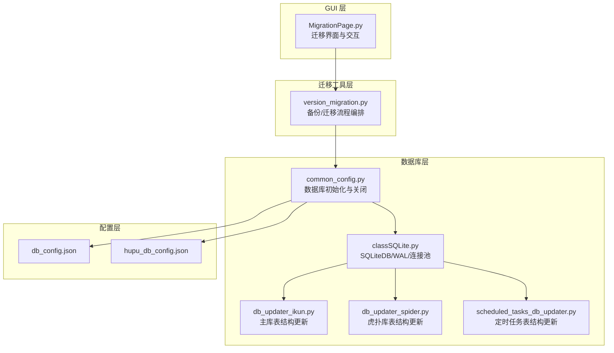
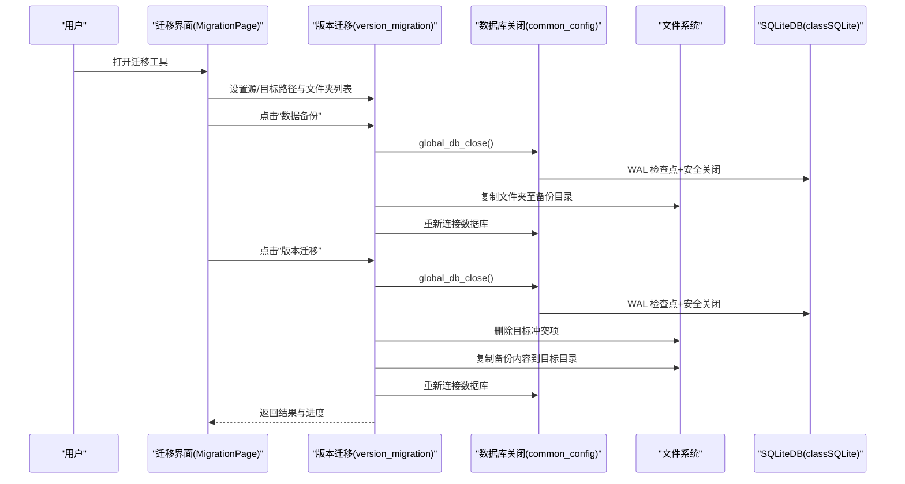
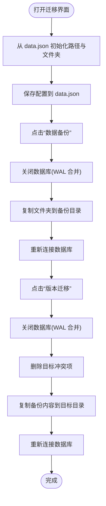
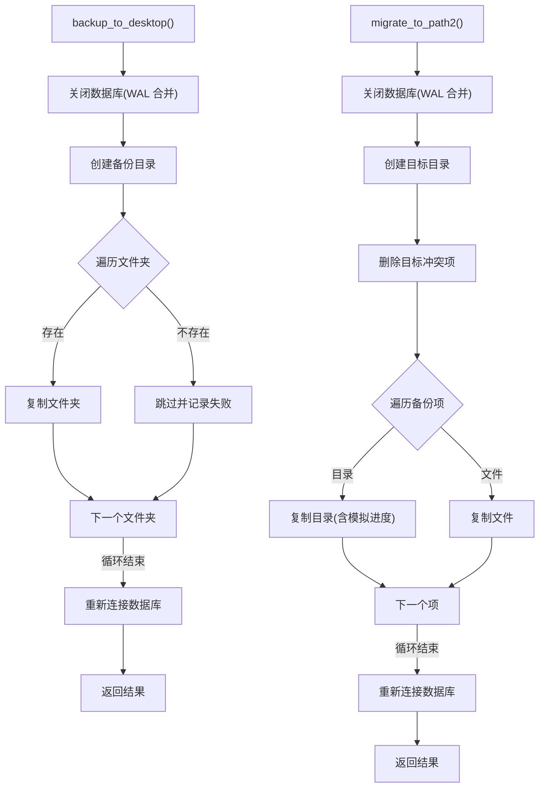
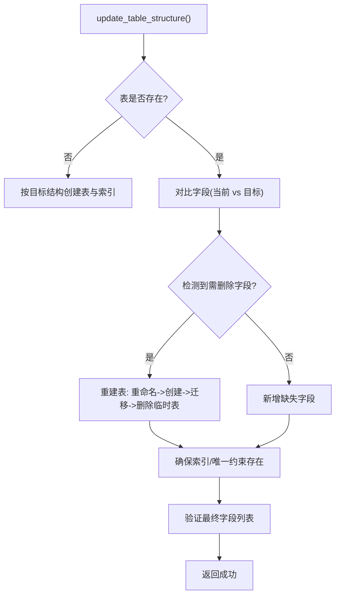
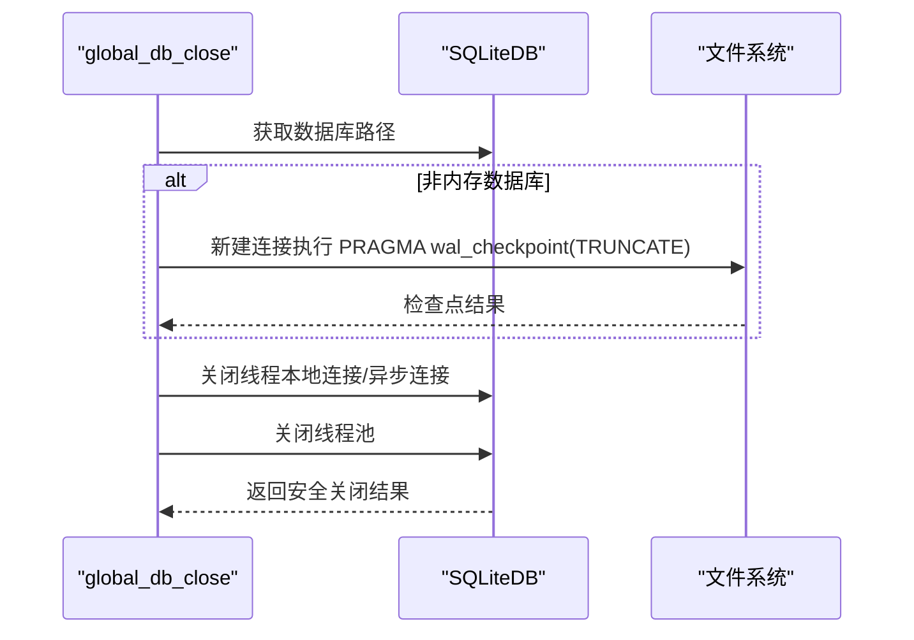
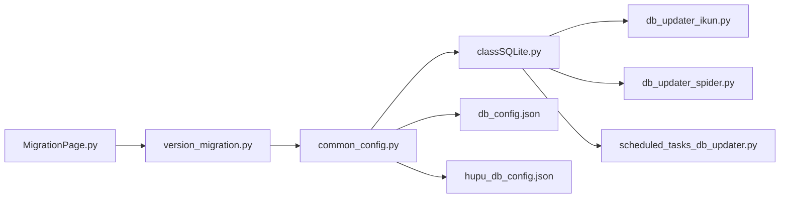

# 数据迁移

<cite>
**本文引用的文件**
- [MigrationPage.py](file://gui/MigrationPage.py)
- [version_migration.py](file://utils/version_migration.py)
- [db_updater_ikun.py](file://utils/db_updater_ikun.py)
- [db_updater_spider.py](file://utils/db_updater_spider.py)
- [scheduled_tasks_db_updater.py](file://utils/scheduled_tasks_db_updater.py)
- [classSQLite.py](file://modules/classSQLite.py)
- [common_config.py](file://config/common_config.py)
- [db_config.json](file://配置文件_系统配置/db_config.json)
- [hupu_db_config.json](file://配置文件_系统配置/hupu_db_config.json)
</cite>

## 目录
1. [简介](#简介)
2. [项目结构](#项目结构)
3. [核心组件](#核心组件)
4. [架构总览](#架构总览)
5. [详细组件分析](#详细组件分析)
6. [依赖关系分析](#依赖关系分析)
7. [性能考量](#性能考量)
8. [故障排查指南](#故障排查指南)
9. [结论](#结论)
10. [附录](#附录)

## 简介
本文件系统化阐述 ikun_temu_system 的数据迁移机制，涵盖数据库版本管理与迁移策略、表结构变更的自动检测与应用、迁移脚本的编写与执行流程、备份与恢复实现、跨版本兼容性处理、测试与验证方法、数据一致性保障、错误处理与回滚机制，以及最佳实践与常见问题解决方案。文档面向开发者与运维人员，兼顾非技术读者的理解。

## 项目结构
围绕数据迁移的关键模块包括：
- GUI 迁移界面：提供可视化路径设置、文件夹选择、备份与迁移执行、进度反馈与辅助功能。
- 版本迁移工具：封装备份与迁移流程，负责数据库安全关闭/重连、文件夹复制与冲突处理。
- 数据库结构更新工具：针对主库、虎扑库与定时任务库，提供通用表结构对比、索引/约束校验与重建。
- SQLite 抽象层：提供连接池、WAL 检查点、安全关闭、统一 SQL 执行接口。
- 配置文件：数据库路径与运行参数，确保迁移前后配置一致。

**图表来源**
- [MigrationPage.py:85-472](file://gui/MigrationPage.py#L85-L472)
- [version_migration.py:12-446](file://utils/version_migration.py#L12-L446)
- [common_config.py:59-135](file://config/common_config.py#L59-L135)
- [classSQLite.py:359-531](file://modules/classSQLite.py#L359-L531)
- [db_updater_ikun.py:10-147](file://utils/db_updater_ikun.py#L10-L147)
- [db_updater_spider.py:12-149](file://utils/db_updater_spider.py#L12-L149)
- [scheduled_tasks_db_updater.py:17-160](file://utils/scheduled_tasks_db_updater.py#L17-L160)
- [db_config.json:1-19](file://配置文件_系统配置/db_config.json#L1-L19)
- [hupu_db_config.json:1-18](file://配置文件_系统配置/hupu_db_config.json#L1-L18)

**章节来源**
- [MigrationPage.py:85-472](file://gui/MigrationPage.py#L85-L472)
- [version_migration.py:12-446](file://utils/version_migration.py#L12-L446)
- [common_config.py:59-135](file://config/common_config.py#L59-L135)
- [classSQLite.py:359-531](file://modules/classSQLite.py#L359-L531)
- [db_updater_ikun.py:10-147](file://utils/db_updater_ikun.py#L10-L147)
- [db_updater_spider.py:12-149](file://utils/db_updater_spider.py#L12-L149)
- [scheduled_tasks_db_updater.py:17-160](file://utils/scheduled_tasks_db_updater.py#L17-L160)
- [db_config.json:1-19](file://配置文件_系统配置/db_config.json#L1-L19)
- [hupu_db_config.json:1-18](file://配置文件_系统配置/hupu_db_config.json#L1-L18)

## 核心组件
- 迁移界面（MigrationPage.py）
  - 提供旧版/新版路径设置、备份保存路径设置、文件夹列表管理、备份与迁移按钮、进程清理与卡密解绑入口。
  - 使用 data.json 存储配置，避免占用数据库连接。
- 版本迁移工具（version_migration.py）
  - 封装备份与迁移流程：关闭数据库（WAL 合并）、复制文件夹、删除冲突项、重新连接数据库。
  - 支持桌面备份与目标迁移两阶段，以及一键完整流程。
- 数据库结构更新工具
  - 主库/虎扑库/定时任务库通用表结构更新函数，支持字段增删对比、索引/唯一约束校验、重建表（保留有效字段）。
  - 提供初始化函数，按需创建/更新表结构。
- SQLite 抽象层（classSQLite.py）
  - 提供 SQLiteDB 统一执行接口、连接池、WAL 检查点、安全关闭、事务与批量操作。
- 数据库配置（db_config.json、hupu_db_config.json）
  - 定义数据库路径、超时、WAL 模式、缓存与同步级别等参数，确保迁移前后配置一致。

**章节来源**
- [MigrationPage.py:85-472](file://gui/MigrationPage.py#L85-L472)
- [version_migration.py:12-446](file://utils/version_migration.py#L12-L446)
- [db_updater_ikun.py:10-147](file://utils/db_updater_ikun.py#L10-L147)
- [db_updater_spider.py:12-149](file://utils/db_updater_spider.py#L12-L149)
- [scheduled_tasks_db_updater.py:17-160](file://utils/scheduled_tasks_db_updater.py#L17-L160)
- [classSQLite.py:359-531](file://modules/classSQLite.py#L359-L531)
- [db_config.json:1-19](file://配置文件_系统配置/db_config.json#L1-L19)
- [hupu_db_config.json:1-18](file://配置文件_系统配置/hupu_db_config.json#L1-L18)

## 架构总览
整体迁移架构分为“文件级迁移”和“数据库结构迁移”两条主线，并通过统一的数据库关闭/重连流程保证数据一致性。

**图表来源**
- [MigrationPage.py:418-467](file://gui/MigrationPage.py#L418-L467)
- [version_migration.py:91-181](file://utils/version_migration.py#L91-L181)
- [version_migration.py:305-446](file://utils/version_migration.py#L305-L446)
- [common_config.py:59-135](file://config/common_config.py#L59-L135)
- [classSQLite.py:1448-1496](file://modules/classSQLite.py#L1448-L1496)

## 详细组件分析

### 组件A：迁移界面（MigrationPage）
- 功能要点
  - 路径设置：旧版程序地址、新版程序地址、备份保存地址。
  - 文件夹列表：默认文件夹集合，支持添加/重置/删除。
  - 操作按钮：保存配置、清理进程、解绑卡密、数据备份、版本迁移。
  - 进度对话框：显示处理进度与消息。
  - 关闭事件：确保数据库连接关闭。
- 数据持久化
  - 使用 data.json 存储配置，避免占用数据库连接。
- 交互流程
  - 初始化：从 data.json 读取路径与文件夹列表。
  - 保存：写入 data.json。
  - 执行：调用版本迁移工具执行备份/迁移。

**图表来源**
- [MigrationPage.py:470-472](file://gui/MigrationPage.py#L470-L472)
- [MigrationPage.py:794-800](file://gui/MigrationPage.py#L794-L800)
- [MigrationPage.py:418-467](file://gui/MigrationPage.py#L418-L467)

**章节来源**
- [MigrationPage.py:85-472](file://gui/MigrationPage.py#L85-L472)

### 组件B：版本迁移工具（version_migration.py）
- 功能要点
  - 备份到桌面：关闭数据库（WAL 合并）、复制指定文件夹、重新连接数据库。
  - 迁移到目标：关闭数据库、删除目标冲突项、复制备份内容、重新连接数据库。
  - 浏览器文件夹特殊处理：估算文件数量，后台复制+模拟进度。
  - 进度回调：支持 UI 进度条更新。
- 数据库安全
  - 统一通过全局关闭函数执行 WAL 检查点，确保数据库文件完整性。
- 返回结果
  - 包含成功/失败统计、复制/删除列表、消息提示。

**图表来源**
- [version_migration.py:91-181](file://utils/version_migration.py#L91-L181)
- [version_migration.py:305-446](file://utils/version_migration.py#L305-L446)

**章节来源**
- [version_migration.py:12-446](file://utils/version_migration.py#L12-L446)

### 组件C：数据库结构更新（db_updater_ikun/spider/scheduled_tasks）
- 通用表结构更新流程
  - 检查表是否存在：不存在则按目标结构创建表与索引。
  - 表存在时对比字段：检测需删除字段（高风险，涉及重建表）。
  - 重建表策略：重命名原表为临时表，按目标结构创建新表，迁移保留字段数据，删除临时表。
  - 确保索引/唯一约束存在。
  - 验证最终字段列表。
- 主库（ikun）与虎扑库（hupu）差异
  - 主库：shops、task、config、record 等表。
  - 虎扑库：ai_analysis、hupu_post_list、hupu_detail_list、hupu_score_list 等表。
  - 定时任务库：scheduled_tasks 表，支持索引与结构修复。
- 初始化流程
  - 初始化数据库（创建/加载配置），随后按需创建/更新各表结构。

**图表来源**
- [db_updater_ikun.py:10-147](file://utils/db_updater_ikun.py#L10-L147)
- [db_updater_spider.py:12-149](file://utils/db_updater_spider.py#L12-L149)
- [scheduled_tasks_db_updater.py:17-160](file://utils/scheduled_tasks_db_updater.py#L17-L160)

**章节来源**
- [db_updater_ikun.py:10-147](file://utils/db_updater_ikun.py#L10-L147)
- [db_updater_spider.py:12-149](file://utils/db_updater_spider.py#L12-L149)
- [scheduled_tasks_db_updater.py:17-160](file://utils/scheduled_tasks_db_updater.py#L17-L160)

### 组件D：SQLite 抽象层与数据库关闭（classSQLite.py、common_config.py）
- SQLiteDB
  - 统一 SQL 执行接口、连接池、WAL 检查点、安全关闭、批量插入、查询构建器。
  - 安全关闭流程：WAL 检查点（TRUNCATE 模式）、关闭连接与异步连接、关闭线程池。
- 数据库关闭（global_db_close）
  - 对 ikun.db 与 hupu.db 执行 WAL 检查点与安全关闭，防止文件损坏。
- 配置文件
  - db_config.json 与 hupu_db_config.json 定义数据库路径、WAL 模式、缓存与同步级别，确保迁移前后配置一致。

**图表来源**
- [common_config.py:59-135](file://config/common_config.py#L59-L135)
- [classSQLite.py:1448-1496](file://modules/classSQLite.py#L1448-L1496)
- [db_config.json:1-19](file://配置文件_系统配置/db_config.json#L1-L19)
- [hupu_db_config.json:1-18](file://配置文件_系统配置/hupu_db_config.json#L1-L18)

**章节来源**
- [classSQLite.py:359-531](file://modules/classSQLite.py#L359-L531)
- [classSQLite.py:1448-1496](file://modules/classSQLite.py#L1448-L1496)
- [common_config.py:59-135](file://config/common_config.py#L59-L135)
- [db_config.json:1-19](file://配置文件_系统配置/db_config.json#L1-L19)
- [hupu_db_config.json:1-18](file://配置文件_系统配置/hupu_db_config.json#L1-L18)

## 依赖关系分析
- 组件耦合
  - 迁移界面依赖版本迁移工具；版本迁移工具依赖数据库关闭与文件系统。
  - 数据库结构更新工具依赖 SQLiteDB 与配置文件。
  - 数据库关闭依赖 SQLiteDB 的 WAL 检查点与连接管理。
- 外部依赖
  - 配置文件（db_config.json、hupu_db_config.json）驱动数据库路径与运行参数。
  - PyQt5 用于 GUI 交互。
- 潜在风险
  - 并发文件操作与数据库文件占用冲突，需严格遵循“关闭数据库—复制—重新连接”的顺序。
  - 浏览器文件夹体积大，采用后台复制+模拟进度避免阻塞 UI。

**图表来源**
- [MigrationPage.py:85-472](file://gui/MigrationPage.py#L85-L472)
- [version_migration.py:12-446](file://utils/version_migration.py#L12-L446)
- [common_config.py:59-135](file://config/common_config.py#L59-L135)
- [classSQLite.py:359-531](file://modules/classSQLite.py#L359-L531)
- [db_updater_ikun.py:10-147](file://utils/db_updater_ikun.py#L10-L147)
- [db_updater_spider.py:12-149](file://utils/db_updater_spider.py#L12-L149)
- [scheduled_tasks_db_updater.py:17-160](file://utils/scheduled_tasks_db_updater.py#L17-L160)
- [db_config.json:1-19](file://配置文件_系统配置/db_config.json#L1-L19)
- [hupu_db_config.json:1-18](file://配置文件_系统配置/hupu_db_config.json#L1-L18)

**章节来源**
- [MigrationPage.py:85-472](file://gui/MigrationPage.py#L85-L472)
- [version_migration.py:12-446](file://utils/version_migration.py#L12-L446)
- [common_config.py:59-135](file://config/common_config.py#L59-L135)
- [classSQLite.py:359-531](file://modules/classSQLite.py#L359-L531)
- [db_updater_ikun.py:10-147](file://utils/db_updater_ikun.py#L10-L147)
- [db_updater_spider.py:12-149](file://utils/db_updater_spider.py#L12-L149)
- [scheduled_tasks_db_updater.py:17-160](file://utils/scheduled_tasks_db_updater.py#L17-L160)
- [db_config.json:1-19](file://配置文件_系统配置/db_config.json#L1-L19)
- [hupu_db_config.json:1-18](file://配置文件_系统配置/hupu_db_config.json#L1-L18)

## 性能考量
- WAL 模式与检查点
  - 使用 WAL 模式提升并发写入性能；迁移前执行 WAL 检查点，确保数据落盘，减少文件锁定时间。
- 复制策略
  - 普通文件夹直接复制；浏览器文件夹采用后台线程复制+模拟进度，避免 UI 卡顿。
- 连接池与批量操作
  - SQLiteDB 提供连接池与批量插入接口，降低频繁连接开销。
- 建议
  - 大文件夹迁移建议在低负载时段执行。
  - 预估磁盘空间，避免迁移过程中因空间不足导致失败。

[本节为通用指导，无需特定文件引用]

## 故障排查指南
- 数据库无法关闭/迁移失败
  - 确认已调用数据库关闭流程（WAL 检查点）后再执行文件复制。
  - 若重连失败，按提示重启程序确保数据一致性。
- 备份/迁移进度异常
  - 浏览器文件夹采用模拟进度，实际复制在后台线程进行；等待完成或查看日志。
- 文件夹冲突
  - 迁移前会删除目标目录中的同名文件/文件夹；若删除失败，检查权限与占用。
- 表结构更新失败
  - 若检测到需删除字段，将触发重建表流程；确认是否允许用户确认或自动执行。
- 配置不一致
  - 确认 db_config.json 与 hupu_db_config.json 路径与参数正确。

**章节来源**
- [version_migration.py:119-181](file://utils/version_migration.py#L119-L181)
- [version_migration.py:336-446](file://utils/version_migration.py#L336-L446)
- [common_config.py:59-135](file://config/common_config.py#L59-L135)
- [classSQLite.py:1448-1496](file://modules/classSQLite.py#L1448-L1496)

## 结论
本项目通过“文件级迁移 + 数据库结构更新”的双轨机制，结合 WAL 检查点与安全关闭流程，实现了稳定、可验证的数据迁移方案。GUI 界面简化了用户操作，迁移工具提供了完善的进度反馈与错误处理。数据库结构更新工具支持跨版本字段/索引/约束的自动对比与修复，确保系统在版本升级后仍保持一致的表结构与数据完整性。

[本节为总结性内容，无需特定文件引用]

## 附录

### 数据库版本管理与迁移策略
- 版本识别
  - 通过初始化流程与表结构版本化字段（如唯一约束、索引）识别当前数据库版本。
- 迁移策略
  - 增量迁移：仅新增缺失字段与索引，避免破坏现有数据。
  - 兼容性：重建表时仅迁移目标表包含的字段，丢弃不再存在的字段。
  - 回滚：重建表前保留临时表，失败时可回退。

**章节来源**
- [db_updater_ikun.py:10-147](file://utils/db_updater_ikun.py#L10-L147)
- [db_updater_spider.py:12-149](file://utils/db_updater_spider.py#L12-L149)
- [scheduled_tasks_db_updater.py:17-160](file://utils/scheduled_tasks_db_updater.py#L17-L160)

### 表结构变更的自动检测与应用
- 自动检测
  - 对比当前表结构与目标结构，识别新增/删除字段。
- 应用机制
  - 新增字段：ALTER TABLE ADD COLUMN。
  - 删除字段：重建表（保留有效字段），迁移数据后删除临时表。
  - 索引/唯一约束：确保存在，不存在则创建。

**章节来源**
- [db_updater_ikun.py:64-147](file://utils/db_updater_ikun.py#L64-L147)
- [db_updater_spider.py:66-149](file://utils/db_updater_spider.py#L66-L149)
- [scheduled_tasks_db_updater.py:48-160](file://utils/scheduled_tasks_db_updater.py#L48-L160)

### 数据迁移脚本的编写与执行流程
- 编写步骤
  - 明确源/目标路径与文件夹列表。
  - 调用备份/迁移函数，传入进度回调。
  - 执行前关闭数据库，执行后重新连接。
- 执行流程
  - 备份：关闭数据库 → 复制文件夹 → 重新连接。
  - 迁移：关闭数据库 → 删除冲突项 → 复制内容 → 重新连接。

**章节来源**
- [MigrationPage.py:418-467](file://gui/MigrationPage.py#L418-L467)
- [version_migration.py:91-181](file://utils/version_migration.py#L91-L181)
- [version_migration.py:305-446](file://utils/version_migration.py#L305-L446)

### 数据备份与恢复实现
- 备份
  - 关闭数据库（WAL 合并）→ 创建备份目录 → 复制指定文件夹 → 重新连接数据库。
- 恢复
  - 关闭数据库（WAL 合并）→ 删除目标冲突项 → 复制备份内容 → 重新连接数据库。

**章节来源**
- [version_migration.py:91-181](file://utils/version_migration.py#L91-L181)
- [version_migration.py:305-446](file://utils/version_migration.py#L305-L446)

### 跨版本的数据兼容性处理
- 字段兼容
  - 新增字段：自动添加。
  - 删除字段：重建表（保留有效字段），避免数据丢失。
- 约束与索引
  - 唯一约束/索引缺失时自动创建。
- 外键约束
  - 定时任务表结构修复流程可移除外键约束并重建。

**章节来源**
- [db_updater_ikun.py:64-147](file://utils/db_updater_ikun.py#L64-L147)
- [db_updater_spider.py:66-149](file://utils/db_updater_spider.py#L66-L149)
- [scheduled_tasks_db_updater.py:257-283](file://utils/scheduled_tasks_db_updater.py#L257-L283)

### 数据迁移的测试与验证方法
- 文件级验证
  - 校验备份/迁移后的文件夹数量与内容完整性。
- 数据库结构验证
  - 对比目标表结构与当前表结构，确认字段、索引、唯一约束一致。
- 运行时验证
  - 执行初始化流程，确保表结构更新成功且应用正常。

**章节来源**
- [db_updater_ikun.py:328-395](file://utils/db_updater_ikun.py#L328-L395)
- [db_updater_spider.py:152-241](file://utils/db_updater_spider.py#L152-L241)
- [scheduled_tasks_db_updater.py:233-283](file://utils/scheduled_tasks_db_updater.py#L233-L283)

### 数据迁移的一致性保证
- WAL 检查点：迁移前后强制合并 WAL 文件，确保数据落盘。
- 关闭/重连：严格遵循“关闭数据库—复制—重新连接”的顺序。
- 事务与批量：使用 SQLiteDB 的批量插入与事务接口，减少并发冲突。

**章节来源**
- [common_config.py:59-135](file://config/common_config.py#L59-L135)
- [classSQLite.py:1448-1496](file://modules/classSQLite.py#L1448-L1496)
- [classSQLite.py:568-614](file://modules/classSQLite.py#L568-L614)

### 错误处理与回滚机制
- 错误处理
  - 数据库关闭失败：记录警告并继续（可能影响迁移）。
  - 复制失败：记录失败项，继续后续流程。
  - 重连失败：提示重启程序确保一致性。
- 回滚机制
  - 表结构更新采用“重建表（保留有效字段）”，失败时可回退临时表。

**章节来源**
- [version_migration.py:123-135](file://utils/version_migration.py#L123-L135)
- [version_migration.py:340-356](file://utils/version_migration.py#L340-L356)
- [db_updater_ikun.py:87-118](file://utils/db_updater_ikun.py#L87-L118)

### 最佳实践与常见问题
- 最佳实践
  - 迁移前备份完整程序目录。
  - 在低负载时段执行大文件夹迁移。
  - 使用 data.json 存储配置，避免占用数据库连接。
  - 严格遵循“关闭数据库—复制—重新连接”的顺序。
- 常见问题
  - 数据库文件被占用：确保程序完全退出后执行迁移。
  - 迁移失败：检查磁盘空间、权限与日志，必要时重启程序。

**章节来源**
- [MigrationPage.py:306-359](file://gui/MigrationPage.py#L306-L359)
- [version_migration.py:119-181](file://utils/version_migration.py#L119-L181)
- [version_migration.py:332-446](file://utils/version_migration.py#L332-L446)