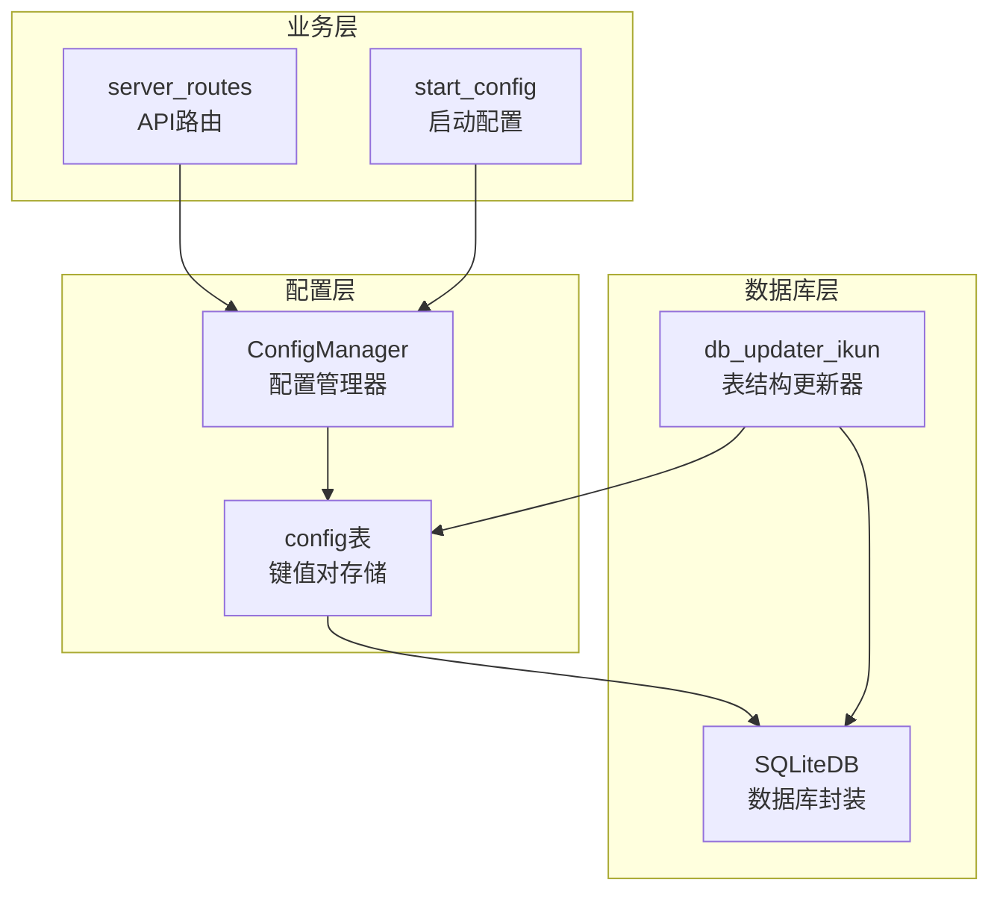
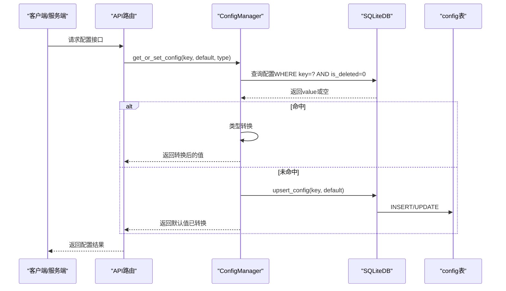
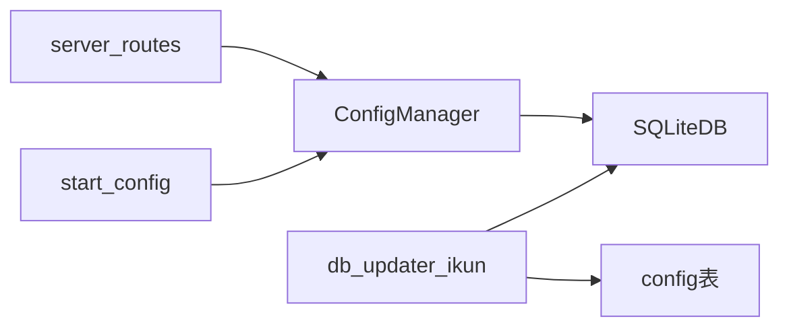

# config配置表

<cite>
**本文档引用的文件**
- [config_manager.py](file://modules/config_manager.py)
- [db_updater_ikun.py](file://utils/db_updater_ikun.py)
- [common_config.py](file://config/common_config.py)
- [classSQLite.py](file://modules/classSQLite.py)
- [common_routes.py](file://api/server_routes/common_routes.py)
- [start_config.py](file://config/start_config.py)
</cite>

## 目录
1. [简介](#简介)
2. [项目结构](#项目结构)
3. [核心组件](#核心组件)
4. [架构总览](#架构总览)
5. [详细组件分析](#详细组件分析)
6. [依赖关系分析](#依赖关系分析)
7. [性能考量](#性能考量)
8. [故障排查指南](#故障排查指南)
9. [结论](#结论)
10. [附录](#附录)

## 简介
本文件面向“config配置表”的数据库表结构与动态配置管理能力，基于仓库中的实现进行系统化梳理。内容涵盖：
- 表结构字段定义、数据类型与约束
- 唯一约束设计与配置项去重机制
- 键值对存储模式与动态配置管理
- 表结构创建SQL与字段注释建议
- 生命周期管理与软删除机制
- 配置缓存策略与热更新机制
- 配置分类管理、默认值处理与验证规则
- 常见配置项示例与最佳实践

## 项目结构
围绕config表的关键文件与职责如下：
- 配置管理器：负责配置的读取、写入、类型转换、批量初始化、软删除与全量查询
- 表结构更新器：负责创建/更新config表结构，确保唯一约束与索引
- 数据库连接与封装：提供SQLiteDB封装，支持表存在性检查、表信息查询、索引创建等
- 业务路由与入口：通过API路由与启动脚本读取/写入配置，体现热更新与动态配置能力

图表来源
- [config_manager.py](file://modules/config_manager.py)
- [db_updater_ikun.py](file://utils/db_updater_ikun.py)
- [common_routes.py](file://api/server_routes/common_routes.py)
- [start_config.py](file://config/start_config.py)

章节来源
- [config_manager.py](file://modules/config_manager.py)
- [db_updater_ikun.py](file://utils/db_updater_ikun.py)
- [common_routes.py](file://api/server_routes/common_routes.py)
- [start_config.py](file://config/start_config.py)

## 核心组件
- 配置管理器（ConfigManager）
  - 提供热更新能力：每次读取/写入均直接访问数据库，修改后下一次调用立即生效
  - 类型自动转换：支持字符串、整型、浮点、布尔、列表、字典、元组等类型转换
  - 增删改查：upsert、get_or_set、批量初始化、软删除、全量查询
- 表结构更新器（db_updater_ikun）
  - 统一的表结构更新流程：创建/对比/迁移/索引确保
  - 为config表定义字段、唯一约束与索引
- 数据库封装（SQLiteDB）
  - 提供表存在性检查、表信息查询、索引创建等能力，支撑表结构更新器
- 业务使用方
  - API路由与启动脚本通过配置管理器读取/写入配置，体现动态配置与热更新

章节来源
- [config_manager.py](file://modules/config_manager.py)
- [db_updater_ikun.py](file://utils/db_updater_ikun.py)
- [common_config.py](file://config/common_config.py)

## 架构总览
config表的实现遵循“表结构定义—管理器封装—业务使用”的分层设计。表结构由更新器统一管理，配置管理器负责业务侧的键值对读写与类型转换，业务层通过API或启动流程直接调用配置管理器，实现配置的动态变更与即时生效。

图表来源
- [config_manager.py](file://modules/config_manager.py)
- [common_routes.py](file://api/server_routes/common_routes.py)

## 详细组件分析

### 表结构与字段定义
- 表名：config
- 字段定义与约束
  - id：整型，主键，自增
  - key：文本，非空，唯一约束
  - value：文本，可空
  - create_time：日期/时间戳，用于记录创建时间
  - update_time：日期/时间戳，用于记录更新时间
  - is_deleted：整型，软删除标记（0表示未删除，1表示已删除）

字段注释建议（便于文档与维护）
- id：自增主键，唯一标识一条配置记录
- key：配置键，全局唯一，用于定位配置项
- value：配置值，以字符串形式存储，内部通过类型转换还原
- create_time：记录配置创建时间（UTC+8）
- update_time：记录配置最近更新时间（UTC+8）
- is_deleted：软删除标志位，0为有效，1为已删除

章节来源
- [db_updater_ikun.py](file://utils/db_updater_ikun.py)
- [config_manager.py](file://modules/config_manager.py)

### 唯一约束与去重机制
- 唯一约束：key字段采用唯一约束，保证同一键仅有一条有效记录
- 去重机制：
  - upsert逻辑：若key存在且未被软删除，则更新；否则插入新记录
  - 批量初始化：only_insert模式仅在不存在时新增，避免覆盖已有配置
  - 查询过滤：查询时限定is_deleted=0，确保仅读取有效配置

章节来源
- [db_updater_ikun.py](file://utils/db_updater_ikun.py)
- [config_manager.py](file://modules/config_manager.py)

### 键值对存储模式与动态配置管理
- 存储模式：采用键值对存储，value统一以字符串形式持久化，业务侧通过类型转换还原
- 动态配置管理：
  - 热更新：每次读取/写入均直接访问数据库，修改后下一次调用立即生效
  - 类型转换：支持字符串、整型、浮点、布尔、列表、字典、元组等类型自动转换
  - 默认值：未命中时自动创建并返回默认值，确保业务可用性
  - 批量初始化：支持一次性写入多条配置，适合系统启动时加载基础配置

章节来源
- [config_manager.py](file://modules/config_manager.py)

### 表结构创建SQL与字段注释
- 创建SQL（基于实现）
  - 字段定义与唯一约束由表结构更新器统一生成
  - 建议字段注释参考上文“字段注释建议”
- 索引建议
  - key字段：唯一索引（由唯一约束保证）
  - 可选：按业务查询频率考虑为update_time、create_time建立索引

章节来源
- [db_updater_ikun.py](file://utils/db_updater_ikun.py)

### 生命周期管理与软删除机制
- 生命周期
  - 创建：首次读取不存在时自动插入
  - 更新：存在即更新，更新时间同步刷新
  - 删除：默认软删除（is_deleted=1），保留历史记录
  - 查询：默认仅查询未删除记录（is_deleted=0）
- 软删除优势
  - 避免误删导致的数据丢失
  - 支持审计与回滚（可通过is_deleted=0恢复）

章节来源
- [config_manager.py](file://modules/config_manager.py)

### 配置缓存策略与热更新机制
- 缓存策略
  - 无内置缓存：每次读取/写入均直连数据库，确保配置变更即时生效
- 热更新机制
  - 读取即生效：修改配置后，下一次调用get_or_set_config即可获得最新值
  - 类型转换：读取时自动进行类型转换，减少业务侧样板代码

章节来源
- [config_manager.py](file://modules/config_manager.py)

### 配置分类管理、默认值处理与验证规则
- 分类管理
  - 通过key前缀或命名空间区分配置类别（如ServerPage_*、Settings_*）
- 默认值处理
  - 未命中时自动创建并返回默认值，支持强制覆盖
- 验证规则
  - key非空校验
  - 类型转换失败时返回默认值，避免业务中断
  - 批量初始化时仅新增不存在的键，避免覆盖

章节来源
- [config_manager.py](file://modules/config_manager.py)

### 常见配置项示例与最佳实践
- 常见配置项示例（来源于业务使用）
  - ServerPage相关：internal_ip、external_ip、port、process_count、worker_per_proc、token、auth_enabled、thread_mode、mode、restart_interval
  - 日志管理：auto_clean_log_enabled、log_char_threshold、log_keep_ratio
  - 背景音乐：background_music_enabled、background_music_autoplay、background_music_url
  - CDN模式：Settings_cdn_mode
  - 错误日志上限：max_error_logs
- 最佳实践
  - 使用命名空间前缀组织配置（如ServerPage_、Settings_）
  - 对关键配置提供合理的默认值，确保系统可启动
  - 使用批量初始化在系统启动阶段加载基础配置
  - 对外暴露的配置接口统一走upsert_config，避免直接绕过类型转换
  - 对于敏感配置（如token）注意权限控制与最小暴露面

章节来源
- [common_routes.py](file://api/server_routes/common_routes.py)
- [start_config.py](file://config/start_config.py)

## 依赖关系分析
- 配置管理器依赖数据库封装（SQLiteDB）执行SQL
- 表结构更新器依赖数据库封装进行表存在性检查、表信息查询与索引创建
- 业务层（API路由、启动脚本）依赖配置管理器进行配置读写
- 初始化流程：初始化数据库与表结构，随后加载配置管理器并读取配置

图表来源
- [config_manager.py](file://modules/config_manager.py)
- [db_updater_ikun.py](file://utils/db_updater_ikun.py)
- [common_routes.py](file://api/server_routes/common_routes.py)
- [start_config.py](file://config/start_config.py)

章节来源
- [config_manager.py](file://modules/config_manager.py)
- [db_updater_ikun.py](file://utils/db_updater_ikun.py)
- [common_routes.py](file://api/server_routes/common_routes.py)
- [start_config.py](file://config/start_config.py)

## 性能考量
- 查询路径
  - 读取：每次查询均直连数据库，避免缓存一致性问题，但可能增加I/O
  - 写入：upsert逻辑简单明确，写入开销与数据量成正比
- 索引建议
  - key字段具备唯一约束，满足去重与快速查找
  - 如存在高频按update_time或create_time查询场景，可考虑建立索引
- 并发与事务
  - SQLiteDB提供连接池与事务支持，建议在批量写入时使用事务提升性能
- WAL与同步
  - 数据库配置包含WAL模式与同步级别，有助于提升并发写入性能与可靠性

章节来源
- [common_config.py](file://config/common_config.py)
- [classSQLite.py](file://modules/classSQLite.py)

## 故障排查指南
- 配置读取为空
  - 检查key是否正确（大小写、前后空格）
  - 确认配置未被软删除（is_deleted=0）
  - 确认默认值是否合理
- 类型转换失败
  - 检查value格式是否符合目标类型（如JSON格式的列表/字典）
  - 查看日志输出，确认转换失败原因
- 写入失败
  - 检查唯一约束冲突（key重复）
  - 检查数据库连接状态与权限
- 热更新未生效
  - 确认调用的是get_or_set_config而非直接读取旧变量
  - 检查是否在同会话内多次读取导致缓存误解

章节来源
- [config_manager.py](file://modules/config_manager.py)

## 结论
config配置表通过“唯一键约束+软删除+类型转换+直连数据库”的设计，实现了简洁可靠的动态配置管理。配合表结构更新器与配置管理器，系统能够在不重启的情况下实现配置热更新，并通过批量初始化与默认值保障启动稳定性。建议在生产环境中结合命名空间、权限控制与索引策略，进一步提升可维护性与性能。

## 附录
- 表结构创建SQL（基于实现）
  - 字段与唯一约束由表结构更新器统一生成，具体SQL由更新器拼装
- 字段注释建议（便于文档与维护）
  - id：自增主键，唯一标识一条配置记录
  - key：配置键，全局唯一，用于定位配置项
  - value：配置值，以字符串形式存储，内部通过类型转换还原
  - create_time：记录配置创建时间（UTC+8）
  - update_time：记录配置最近更新时间（UTC+8）
  - is_deleted：软删除标志位，0为有效，1为已删除

章节来源
- [db_updater_ikun.py](file://utils/db_updater_ikun.py)
- [config_manager.py](file://modules/config_manager.py)