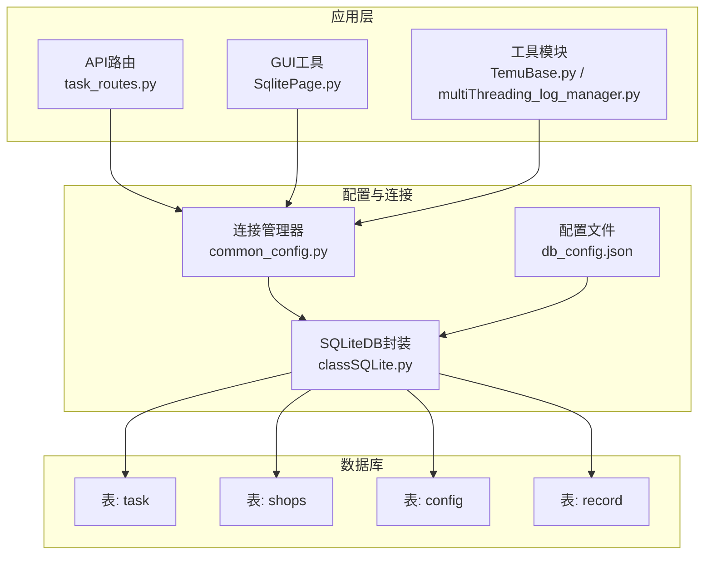
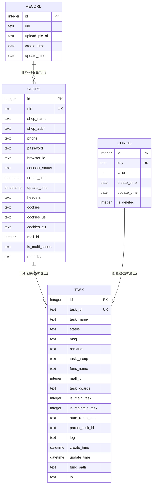
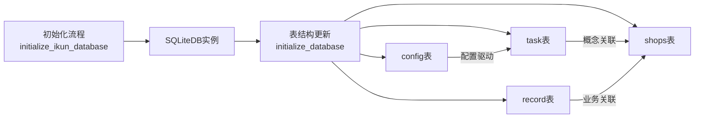

# ikun数据库表结构

<cite>
**本文档引用的文件**
- [db_updater_ikun.py](file://utils/db_updater_ikun.py)
- [common_config.py](file://config/common_config.py)
- [classSQLite.py](file://modules/classSQLite.py)
- [db_config.json](file://配置文件_系统配置/db_config.json)
- [TemuBase.py](file://utils/TemuBase.py)
- [task_routes.py](file://api/server_routes/task_routes.py)
- [SqlitePage.py](file://gui/SqlitePage.py)
- [multiThreading_log_manager.py](file://utils/multiThreading_log_manager.py)
</cite>

## 目录
1. [简介](#简介)
2. [项目结构](#项目结构)
3. [核心组件](#核心组件)
4. [架构总览](#架构总览)
5. [详细组件分析](#详细组件分析)
6. [依赖分析](#依赖分析)
7. [性能考量](#性能考量)
8. [故障排查指南](#故障排查指南)
9. [结论](#结论)
10. [附录](#附录)

## 简介
本文件面向ikun系统的SQLite数据库，聚焦于四个核心业务表：task任务表、shops店铺表、config配置表、record记录表。内容涵盖字段定义、数据类型、约束与索引设计、主外键关系、业务语义、版本演进与变更记录、索引策略与性能优化建议，以及常见查询与最佳实践。

## 项目结构
ikun数据库采用集中式SQLite方案，通过统一的数据库配置文件与连接管理器进行初始化与访问。数据库初始化流程如下：
- 通过配置文件加载数据库路径与PRAGMA参数
- 初始化SQLiteDB连接池与类型适配器
- 按需创建/校验核心表结构（task、shops、config、record）

图表来源
- [db_config.json:1-19](file://配置文件_系统配置/db_config.json#L1-L19)
- [common_config.py:197-220](file://config/common_config.py#L197-L220)
- [classSQLite.py:360-433](file://modules/classSQLite.py#L360-L433)
- [db_updater_ikun.py:328-396](file://utils/db_updater_ikun.py#L328-L396)

章节来源
- [db_config.json:1-19](file://配置文件_系统配置/db_config.json#L1-L19)
- [common_config.py:197-220](file://config/common_config.py#L197-L220)
- [classSQLite.py:360-433](file://modules/classSQLite.py#L360-L433)
- [db_updater_ikun.py:328-396](file://utils/db_updater_ikun.py#L328-L396)

## 核心组件
- 数据库配置与连接
  - 配置文件db_config.json定义数据库路径、超时、线程策略、WAL模式、缓存大小、同步级别等
  - 连接管理器common_config.py负责按表名选择数据库连接，并在初始化阶段创建ikun数据库实例
  - SQLiteDB封装classSQLite.py提供连接池、类型适配器（JSON/DATETIME/DATE）、查询构建器、事务与批量操作能力
- 表结构管理
  - db_updater_ikun.py提供通用表结构更新函数与各表的创建/升级入口，确保字段、唯一约束、索引一致性
  - 初始化流程在首次运行或数据库不存在时创建所有必要表；后续运行仅做结构校验与增量更新

章节来源
- [db_config.json:1-19](file://配置文件_系统配置/db_config.json#L1-L19)
- [common_config.py:197-220](file://config/common_config.py#L197-L220)
- [classSQLite.py:360-433](file://modules/classSQLite.py#L360-L433)
- [db_updater_ikun.py:10-148](file://utils/db_updater_ikun.py#L10-L148)

## 架构总览
ikun数据库围绕“任务调度+店铺管理+配置中心+记录归档”的业务主线组织表结构。其中：
- shops表承载店铺身份、认证信息与连接状态
- task表承载任务生命周期、状态与上下文
- config表承载系统配置键值与软删除标记
- record表承载图片上传等业务记录的时间戳

图表来源
- [db_updater_ikun.py:440-478](file://utils/db_updater_ikun.py#L440-L478)
- [db_updater_ikun.py:481-525](file://utils/db_updater_ikun.py#L481-L525)
- [db_updater_ikun.py:398-419](file://utils/db_updater_ikun.py#L398-L419)
- [db_updater_ikun.py:422-437](file://utils/db_updater_ikun.py#L422-L437)

## 详细组件分析

### shops 店铺表
- 用途
  - 存储Temu平台店铺的基本信息、认证凭据、连接状态与多店铺扩展字段
- 主键/唯一/索引
  - 主键：id（自增）
  - 唯一约束：uid、id
  - 索引：idx_browser_id（browser_id）
- 字段定义与业务语义
  - id：自增主键
  - uid：店铺唯一标识，用于跨模块识别与关联
  - shop_name/shop_abbr：店铺名称与缩写
  - phone/password：登录凭证（明文存储，注意安全）
  - browser_id：比特浏览器窗口标识，用于自动化登录
  - connect_status：连接状态（默认“未连接”，连接成功后更新为“已连接”）
  - create_time/update_time：创建与更新时间，默认使用UTC+8
  - headers/cookies/cookies_us/cookies_eu：认证信息（JSON序列化），支持多区域cookies
  - mall_id：店铺所属mall_id
  - is_multi_shops：多店铺标记（0/1）
  - remarks：备注
- 数据类型选择原因
  - 文本类字段使用text，便于存储JSON与长文本
  - 时间类字段使用timestamp/datetime/date，结合SQLite内置函数实现时区偏移
  - 整数类字段使用integer，布尔语义以0/1表达
- 约束与索引设计思路
  - uid唯一确保任务调度与日志追踪的稳定性
  - idx_browser_id加速比特浏览器窗口查找
- 表结构创建SQL与字段注释
  - 参考创建函数与字段定义
- 版本演进与字段变更
  - 新增cookies_us、cookies_eu以支持多区域cookies
  - 新增is_multi_shops、remarks字段以增强多店铺与备注能力
- 常见查询示例与最佳实践
  - 根据uid查询店铺信息
  - 根据browser_id查询店铺并连接比特浏览器
  - 批量更新连接状态与时间戳

章节来源
- [db_updater_ikun.py:440-478](file://utils/db_updater_ikun.py#L440-L478)
- [db_updater_ikun.py:150-196](file://utils/db_updater_ikun.py#L150-L196)
- [TemuBase.py:12-46](file://utils/TemuBase.py#L12-L46)
- [TemuBase.py:48-131](file://utils/TemuBase.py#L48-L131)
- [TemuBase.py:178-200](file://utils/TemuBase.py#L178-L200)

### task 任务表
- 用途
  - 记录任务生命周期、状态、上下文与日志，支撑任务调度与监控
- 主键/唯一/索引
  - 主键：id（自增）
  - 唯一约束：task_id
  - 索引：idx_parent_task、idx_status、idx_task_group、idx_task_main、idx_task_parent、idx_task_status
- 字段定义与业务语义
  - id：自增主键
  - task_id：任务唯一标识（UK），用于API与UI交互
  - task_name：任务名称（中文），用于展示
  - status：任务状态（中文/英文映射），支持待处理、进行中、已完成、异常、超时、已退出等
  - msg：任务消息（异常/提示信息）
  - remarks：备注
  - task_group：任务分组（用于批量筛选）
  - func_name：任务函数名（用于回溯）
  - mall_id：任务关联的店铺mall_id
  - task_kwargs：任务参数（JSON序列化）
  - is_main_task/is_maintain_task：任务类型标记
  - auto_rerun_time：自动重跑时间
  - parent_task_id：父任务ID（支持父子任务链）
  - log：日志内容
  - create_time/update_time：创建与更新时间，默认使用UTC+8
  - func_path/ip：函数路径与IP（用于定位）
- 数据类型选择原因
  - 文本类字段使用text，便于存储JSON与长文本
  - 时间类字段使用datetime，便于排序与统计
  - 整数类字段使用integer，布尔语义以0/1表达
- 约束与索引设计思路
  - task_id唯一确保任务幂等与去重
  - 多索引覆盖常用查询维度（状态、分组、主任务标记、父任务ID）
- 表结构创建SQL与字段注释
  - 参考创建函数与字段定义
- 版本演进与字段变更
  - 新增parent_task_id、auto_rerun_time、func_path、ip等字段以完善任务链与可观测性
- 常见查询示例与最佳实践
  - 按状态统计任务数量
  - 按任务ID或父任务ID查询任务树
  - 按任务分组与状态筛选任务列表

章节来源
- [db_updater_ikun.py:481-525](file://utils/db_updater_ikun.py#L481-L525)
- [db_updater_ikun.py:198-250](file://utils/db_updater_ikun.py#L198-L250)
- [multiThreading_log_manager.py:1014-1035](file://utils/multiThreading_log_manager.py#L1014-L1035)
- [task_routes.py:37-63](file://api/server_routes/task_routes.py#L37-L63)

### config 配置表
- 用途
  - 存储系统配置键值，支持软删除标记
- 主键/唯一/索引
  - 主键：id（自增）
  - 唯一约束：key
- 字段定义与业务语义
  - id：自增主键
  - key：配置键（UK）
  - value：配置值（文本）
  - create_time/update_time：创建与更新日期
  - is_deleted：软删除标记（0/1）
- 数据类型选择原因
  - key唯一确保配置键的唯一性
  - value使用text便于存储任意配置值
- 约束与索引设计思路
  - key唯一约束确保配置键冲突
- 表结构创建SQL与字段注释
  - 参考创建函数与字段定义
- 版本演进与字段变更
  - 保持简洁的键值结构，便于扩展
- 常见查询示例与最佳实践
  - 按key查询配置值
  - 按key设置或更新配置值

章节来源
- [db_updater_ikun.py:398-419](file://utils/db_updater_ikun.py#L398-L419)
- [db_updater_ikun.py:528-549](file://utils/db_updater_ikun.py#L528-L549)

### record 记录表
- 用途
  - 记录业务相关记录（如图片上传等）的时间戳
- 主键/唯一/索引
  - 主键：id（自增）
- 字段定义与业务语义
  - id：自增主键
  - uid：关联标识
  - upload_pic_all：上传图片相关信息（JSON序列化）
  - create_time/update_time：创建与更新日期
- 数据类型选择原因
  - 文本类字段使用text，便于存储JSON与长文本
- 约束与索引设计思路
  - 当前无唯一约束与索引，适合轻量记录表
- 表结构创建SQL与字段注释
  - 参考创建函数与字段定义
- 版本演进与字段变更
  - 保持简单结构，便于扩展
- 常见查询示例与最佳实践
  - 按uid查询记录
  - 按时间范围查询记录

章节来源
- [db_updater_ikun.py:422-437](file://utils/db_updater_ikun.py#L422-L437)
- [db_updater_ikun.py:552-567](file://utils/db_updater_ikun.py#L552-L567)

## 依赖分析
- 初始化与连接
  - 初始化ikun数据库：common_config.py调用SQLiteDB构造并创建db实例
  - 初始化数据库表结构：db_updater_ikun.py的initialize_database按顺序创建/校验各表
- 表间关系与引用完整性
  - 业务上存在概念性关联：task与shops通过mall_id关联；config与task通过配置驱动；record与shops通过业务关联
  - SQLite未启用外键约束（PRAGMA foreign_keys=OFF），因此无外键约束与级联行为
- 并发与性能
  - 使用WAL模式与连接池提升并发读写性能
  - 通过索引覆盖高频查询维度（任务状态、任务分组、任务主标记、父任务ID、店铺browser_id）

图表来源
- [common_config.py:197-220](file://config/common_config.py#L197-L220)
- [db_updater_ikun.py:328-396](file://utils/db_updater_ikun.py#L328-L396)

章节来源
- [common_config.py:197-220](file://config/common_config.py#L197-L220)
- [db_updater_ikun.py:328-396](file://utils/db_updater_ikun.py#L328-L396)

## 性能考量
- PRAGMA参数
  - WAL：提升并发读写吞吐
  - cache_size：增大缓存提升命中率
  - synchronous：NORMAL在性能与可靠性间折中
  - foreign_keys：OFF（项目中未启用外键）
- 索引策略
  - task表：多维索引覆盖状态、分组、主任务标记、父任务ID等高频过滤条件
  - shops表：按browser_id建立索引，加速比特浏览器窗口定位
- 查询建议
  - 使用索引列进行WHERE过滤与JOIN
  - 对频繁GROUP BY与COUNT的字段建立索引
  - 控制SELECT字段范围，避免不必要的JSON大字段传输
- 批量操作
  - 使用批量插入/更新减少往返开销
  - 合理设置batch_size，平衡内存与性能

章节来源
- [db_config.json:1-19](file://配置文件_系统配置/db_config.json#L1-L19)
- [classSQLite.py:305-329](file://modules/classSQLite.py#L305-L329)
- [db_updater_ikun.py:509-516](file://utils/db_updater_ikun.py#L509-L516)
- [db_updater_ikun.py:467-469](file://utils/db_updater_ikun.py#L467-L469)

## 故障排查指南
- 初始化失败
  - 检查db_config.json路径与权限
  - 确认SQLiteDB实例创建成功且PRAGMA参数生效
- 表结构不一致
  - 使用db_updater_ikun.py的通用更新函数进行结构校验与修复
  - 注意字段删除为高风险操作，遵循确认流程
- 连接状态异常
  - shops表connect_status未更新：检查比特浏览器连接与headers/cookies更新流程
  - 使用TemuBase的连接检测函数进行诊断
- 任务状态统计异常
  - 使用multiThreading_log_manager的按状态计数接口核对
- UI/接口查询异常
  - SqlitePage按task_id与id双路径查询任务类型，确认字段存在且格式正确

章节来源
- [db_updater_ikun.py:10-148](file://utils/db_updater_ikun.py#L10-L148)
- [TemuBase.py:134-175](file://utils/TemuBase.py#L134-L175)
- [multiThreading_log_manager.py:1014-1035](file://utils/multiThreading_log_manager.py#L1014-L1035)
- [SqlitePage.py:3034-3062](file://gui/SqlitePage.py#L3034-L3062)

## 结论
ikun数据库通过统一的配置与连接管理、通用化的表结构更新机制，实现了任务、店铺、配置与记录四大核心表的稳定演进。在未启用外键的前提下，通过唯一约束与索引保障了关键业务的稳定性与性能。建议在后续版本中评估引入外键以增强引用完整性，并持续优化索引覆盖与查询模式。

## 附录

### 表结构创建SQL与字段注释（路径引用）
- shops表创建与字段定义
  - [创建函数与字段定义:440-478](file://utils/db_updater_ikun.py#L440-L478)
- task表创建与字段定义
  - [创建函数与字段定义:481-525](file://utils/db_updater_ikun.py#L481-L525)
- config表创建与字段定义
  - [创建函数与字段定义:398-419](file://utils/db_updater_ikun.py#L398-L419)
- record表创建与字段定义
  - [创建函数与字段定义:422-437](file://utils/db_updater_ikun.py#L422-L437)

### 版本演进与字段变更记录
- shops表
  - 新增cookies_us、cookies_eu：支持多区域cookies
  - 新增is_multi_shops、remarks：增强多店铺与备注能力
- task表
  - 新增parent_task_id、auto_rerun_time、func_path、ip：完善任务链与可观测性
- config/record表
  - 保持简洁结构，便于扩展

章节来源
- [db_updater_ikun.py:150-196](file://utils/db_updater_ikun.py#L150-L196)
- [db_updater_ikun.py:198-250](file://utils/db_updater_ikun.py#L198-L250)
- [db_updater_ikun.py:398-419](file://utils/db_updater_ikun.py#L398-L419)
- [db_updater_ikun.py:422-437](file://utils/db_updater_ikun.py#L422-L437)

### 索引策略与性能优化建议
- task表
  - idx_status、idx_task_group、idx_task_main、idx_task_parent、idx_task_status：覆盖高频过滤与排序
- shops表
  - idx_browser_id：加速比特浏览器窗口定位
- 建议
  - 对频繁GROUP BY与COUNT的字段补充索引
  - 控制JSON字段传输范围，避免全表扫描

章节来源
- [db_updater_ikun.py:509-516](file://utils/db_updater_ikun.py#L509-L516)
- [db_updater_ikun.py:467-469](file://utils/db_updater_ikun.py#L467-L469)

### 常见查询示例与最佳实践（路径引用）
- 按状态统计任务数量
  - [按状态计数接口:1014-1035](file://utils/multiThreading_log_manager.py#L1014-L1035)
- 按任务ID或父任务ID查询任务树
  - [任务类型查询:3034-3062](file://gui/SqlitePage.py#L3034-L3062)
- 根据uid查询/更新店铺信息
  - [按uid查询与更新:48-131](file://utils/TemuBase.py#L48-L131)
  - [连接状态更新:134-175](file://utils/TemuBase.py#L134-L175)