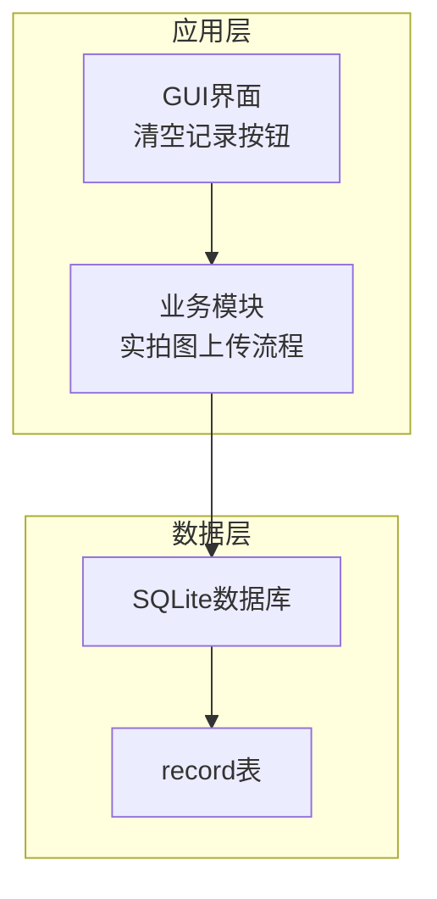
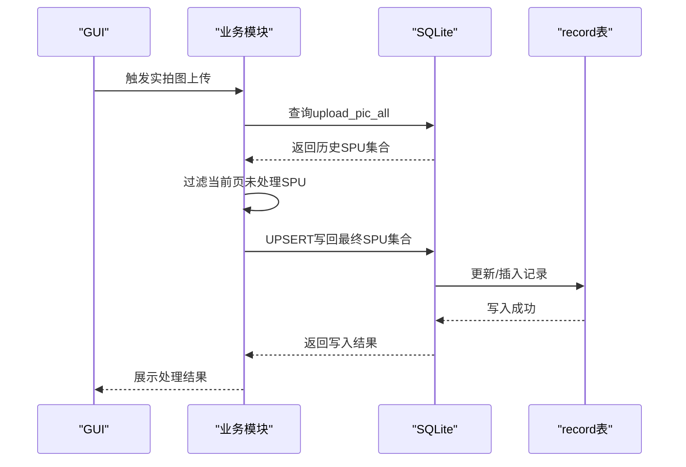
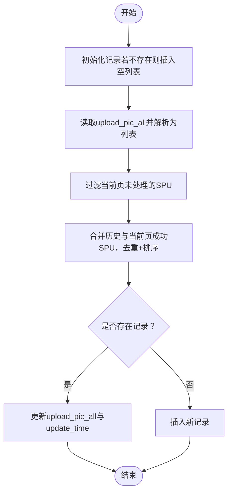
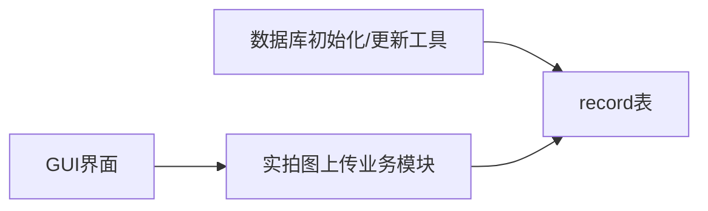

# record记录表

<cite>
**本文引用的文件**
- [db_updater_ikun.py](file://utils/db_updater_ikun.py)
- [upload_real_pic.py](file://temu_modules/temu_function/upload_real_pic.py)
- [SettingPage.py](file://gui/SettingPage.py)
- [config_manager.py](file://modules/config_manager.py)
</cite>

## 目录
1. [简介](#简介)
2. [项目结构](#项目结构)
3. [核心组件](#核心组件)
4. [架构概览](#架构概览)
5. [详细组件分析](#详细组件分析)
6. [依赖分析](#依赖分析)
7. [性能考量](#性能考量)
8. [故障排查指南](#故障排查指南)
9. [结论](#结论)
10. [附录](#附录)

## 简介
本文件面向record记录表，提供完整的数据库表结构说明、字段定义、约束与业务含义、数据存储策略、与业务流程的集成方式、数据同步机制、归档与优化建议，以及常见业务场景下的操作示例与查询优化建议。该表用于记录Temu实拍图上传任务中“已成功处理过的SPU集合”，以避免重复上传，提升效率并降低平台风控风险。

## 项目结构
- record表位于SQLite数据库中，通过统一的数据库初始化与结构更新工具创建与维护。
- 业务侧围绕Temu实拍图上传流程，通过初始化、查询、去重合并、UPSERT写回的方式，形成“增量记录”的闭环。
- GUI层提供一键清空记录的功能，便于运维与调试。

图表来源
- [db_updater_ikun.py](file://utils/db_updater_ikun.py)
- [upload_real_pic.py](file://temu_modules/temu_function/upload_real_pic.py)
- [SettingPage.py](file://gui/SettingPage.py)

章节来源
- [db_updater_ikun.py](file://utils/db_updater_ikun.py)
- [upload_real_pic.py](file://temu_modules/temu_function/upload_real_pic.py)
- [SettingPage.py](file://gui/SettingPage.py)

## 核心组件
- 表结构定义与更新：通过通用化的表结构更新函数创建/维护record表，确保字段与约束一致。
- 业务集成：在实拍图上传流程中，先初始化记录，再查询已有SPU集合，过滤当前页未处理的SPU，最后将成功SPU合并写回。
- GUI集成：提供一键清空记录的入口，便于运维与测试。

章节来源
- [db_updater_ikun.py](file://utils/db_updater_ikun.py)
- [upload_real_pic.py](file://temu_modules/temu_function/upload_real_pic.py)
- [SettingPage.py](file://gui/SettingPage.py)

## 架构概览
record表在系统中的位置与职责如下：
- 结构定义：由数据库初始化与结构更新工具负责创建与演进。
- 业务读写：在实拍图上传流程中，读取已有SPU集合，去重合并，写回数据库。
- 运维入口：GUI提供清空记录能力，便于重置状态或清理脏数据。

图表来源
- [upload_real_pic.py](file://temu_modules/temu_function/upload_real_pic.py)
- [db_updater_ikun.py](file://utils/db_updater_ikun.py)

## 详细组件分析

### 表结构定义与字段说明
- 表名：record
- 字段清单与约束：
  - id：整型，主键，自增，唯一标识每条记录。
  - uid：文本，业务唯一标识，用于区分不同店铺/会话的记录。
  - upload_pic_all：文本，存储“已成功处理的SPU ID列表”（以字符串形式存储，内部为列表字面量）。
  - create_time：日期/时间，记录创建时间。
  - update_time：日期/时间，记录最近更新时间。
- 约束与索引：
  - 主键约束：id自增唯一。
  - 唯一性约束：未在record表上定义唯一约束（可通过扩展增加）。
  - 索引：未在record表上定义专用索引（可通过扩展增加）。

字段注释（业务含义）：
- id：记录的唯一标识，便于定位与审计。
- uid：业务上下文的唯一键，通常对应店铺或会话标识，用于隔离不同业务实体的记录。
- upload_pic_all：持久化的“已处理SPU集合”，采用字符串存储列表字面量，便于跨语言/跨模块读写。
- create_time/update_time：用于追踪记录生命周期与变更频率，便于统计与归档策略制定。

章节来源
- [db_updater_ikun.py](file://utils/db_updater_ikun.py)

### 轻量级设计与数据存储策略
- 设计原则：
  - 轻量：仅存储必要字段，避免冗余列。
  - 可扩展：通过通用表结构更新函数，支持未来新增字段与约束。
  - 一致性：通过UPSERT写回，保证并发场景下的数据一致性。
- 存储策略：
  - upload_pic_all以字符串形式存储列表字面量，读取时通过安全解析还原为列表，避免JSON/序列化复杂度。
  - 时间字段使用数据库默认值或显式更新，确保时间戳准确。

章节来源
- [db_updater_ikun.py](file://utils/db_updater_ikun.py)
- [upload_real_pic.py](file://temu_modules/temu_function/upload_real_pic.py)

### 与业务流程的集成与数据同步
- 初始化：在每次上传前，若不存在对应uid的记录，则插入一条空列表记录，保证后续读写有基础。
- 读取：查询upload_pic_all，解析为原始列表；若为空或格式异常，返回空列表兜底。
- 去重合并：将当前页成功SPU与历史列表合并，去重并排序，得到最终列表。
- 写回：采用UPSERT策略，若存在则更新，否则插入，确保幂等性。
- GUI联动：提供一键清空记录功能，便于重置状态或清理脏数据。

图表来源
- [upload_real_pic.py](file://temu_modules/temu_function/upload_real_pic.py)

章节来源
- [upload_real_pic.py](file://temu_modules/temu_function/upload_real_pic.py)
- [SettingPage.py](file://gui/SettingPage.py)

### 数据完整性与业务关联性
- uid字段的业务关联性：
  - 作为业务上下文的唯一标识，用于隔离不同店铺/会话的记录，避免跨域污染。
  - 在初始化与查询/写回过程中，始终以uid为条件，确保数据归属正确。
- 数据完整性保障：
  - 初始化阶段插入空列表，避免后续查询/写回出现空指针。
  - 读取阶段进行格式校验与兜底，防止异常导致流程中断。
  - 写回阶段采用UPSERT，保证幂等性与一致性。

章节来源
- [upload_real_pic.py](file://temu_modules/temu_function/upload_real_pic.py)

### 表结构创建SQL与字段注释
- 创建SQL（基于通用更新函数的调用）：
  - 该SQL由通用函数动态拼装，包含字段定义与约束。
  - 字段定义与约束详见“表结构定义与字段说明”。

字段注释（示例，用于文档说明）：
- id：记录唯一标识，主键自增。
- uid：业务唯一标识，用于区分不同上下文。
- upload_pic_all：已处理SPU集合（字符串存储列表字面量）。
- create_time：记录创建时间。
- update_time：记录最近更新时间。

章节来源
- [db_updater_ikun.py](file://utils/db_updater_ikun.py)

### 常见业务场景与操作示例
- 场景1：首次上传
  - 行为：初始化记录（空列表），读取为空，合并后写回。
  - 结果：记录中包含当前页成功SPU。
- 场景2：重复上传
  - 行为：读取历史SPU集合，过滤已处理项，仅上传未处理项。
  - 结果：避免重复上传，节省资源。
- 场景3：清空记录
  - 行为：GUI触发清空，执行删除全部记录。
  - 结果：重置状态，后续上传将从零开始。

章节来源
- [upload_real_pic.py](file://temu_modules/temu_function/upload_real_pic.py)
- [SettingPage.py](file://gui/SettingPage.py)

### 查询优化建议
- 建议（可选）：
  - 为uid字段建立索引，加速按业务上下文的查询与写回。
  - 若SPU列表规模较大，可考虑拆分存储或引入二级索引字段（视业务需求评估）。
- 当前现状：
  - 未在record表上定义索引，查询与写回为线性扫描，满足轻量场景。

章节来源
- [db_updater_ikun.py](file://utils/db_updater_ikun.py)

## 依赖分析
- 依赖关系：
  - record表由数据库初始化与结构更新工具创建与维护。
  - 业务模块在上传流程中读取/写回记录。
  - GUI提供清空记录入口，间接影响业务流程的起点状态。

图表来源
- [db_updater_ikun.py](file://utils/db_updater_ikun.py)
- [upload_real_pic.py](file://temu_modules/temu_function/upload_real_pic.py)
- [SettingPage.py](file://gui/SettingPage.py)

章节来源
- [db_updater_ikun.py](file://utils/db_updater_ikun.py)
- [upload_real_pic.py](file://temu_modules/temu_function/upload_real_pic.py)
- [SettingPage.py](file://gui/SettingPage.py)

## 性能考量
- 当前实现：
  - 读写均为单表操作，无复杂JOIN，性能开销主要来自字符串解析与列表去重。
  - UPSERT策略保证幂等，减少重复写入。
- 优化方向（建议）：
  - 为uid建立索引，提升按业务上下文的查询与写回性能。
  - 对于大规模SPU集合，可考虑分页/分桶存储或引入辅助字段（如SPU数量、最后处理时间等）以支持更高效的统计与筛选。

## 故障排查指南
- 症状：查询不到记录或返回空列表
  - 排查：确认是否已执行初始化；检查uid是否正确；确认upload_pic_all字段是否存在且非空。
- 症状：写回失败或重复
  - 排查：确认UPSERT逻辑是否正确；检查数据库事务与并发写入；核对uid是否一致。
- 症状：GUI清空记录无效
  - 排查：确认SQL执行是否成功；检查权限与数据库连接；确认是否选择了正确的上下文。

章节来源
- [upload_real_pic.py](file://temu_modules/temu_function/upload_real_pic.py)
- [SettingPage.py](file://gui/SettingPage.py)

## 结论
record表以极简结构承载了实拍图上传的“增量记录”能力，通过初始化、读取、去重合并与UPSERT写回，实现了高效、稳定的业务闭环。当前设计满足轻量与可扩展需求；建议在未来根据业务规模与查询压力，引入索引与必要的字段扩展，以进一步提升性能与可维护性。

## 附录
- 相关配置与工具：
  - 配置管理器：提供配置的热更新与类型转换能力，支撑业务开关与行为控制。
  - 实拍图配置：包含规则与SKU标注配置，辅助上传流程的合规与标注处理。

章节来源
- [config_manager.py](file://modules/config_manager.py)