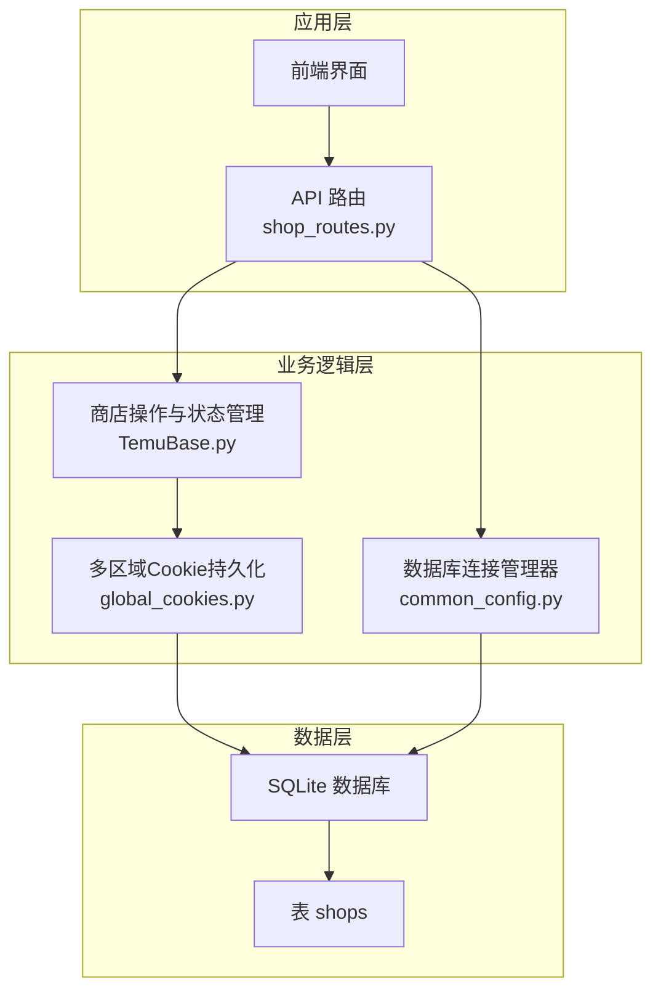
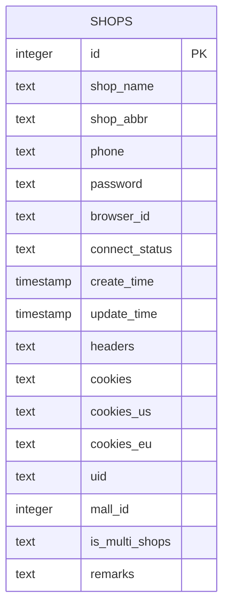
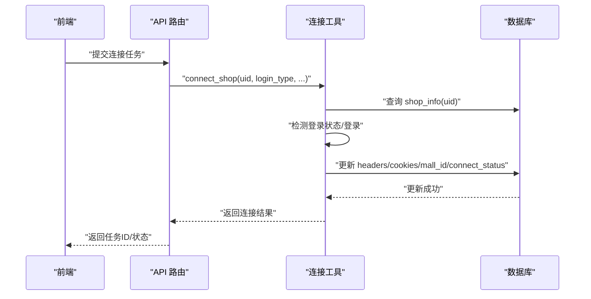
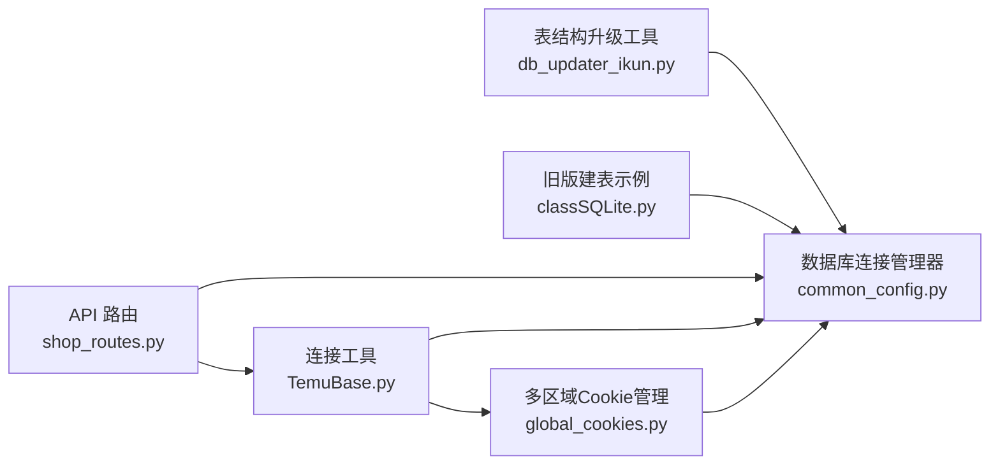

# shops店铺表

<cite>
**本文引用的文件**
- [db_updater_ikun.py](file://utils/db_updater_ikun.py)
- [classSQLite.py](file://modules/classSQLite.py)
- [shop_routes.py](file://api/server_routes/shop_routes.py)
- [TemuBase.py](file://utils/TemuBase.py)
- [global_cookies.py](file://utils/global_cookies.py)
- [common_config.py](file://config/common_config.py)
</cite>

## 目录
1. [简介](#简介)
2. [项目结构](#项目结构)
3. [核心组件](#核心组件)
4. [架构总览](#架构总览)
5. [详细组件分析](#详细组件分析)
6. [依赖分析](#依赖分析)
7. [性能考量](#性能考量)
8. [故障排查指南](#故障排查指南)
9. [结论](#结论)
10. [附录](#附录)

## 简介
本文件为 shops 店铺表的数据库结构与使用说明文档，覆盖字段定义、约束、索引、业务含义、连接状态管理、会话持久化机制、多区域 cookies 设计背景与应用、常见查询示例以及安全注意事项。旨在帮助开发者与运维人员快速理解并正确使用该表。

## 项目结构
- shops 表结构由统一的表结构升级工具维护，支持创建、对比差异、新增字段、重建表、索引保证与最终结构校验。
- 前端通过 API 路由进行分页查询、状态检测、连接开关等操作；后端连接逻辑由会话工具与登录流程负责，连接状态与 cookies 会回写至数据库。
- 数据库连接管理器集中管理不同表的连接，确保跨模块访问的一致性。

图表来源
- [shop_routes.py:1-120](file://api/server_routes/shop_routes.py#L1-L120)
- [TemuBase.py:134-176](file://utils/TemuBase.py#L134-L176)
- [global_cookies.py:664-695](file://utils/global_cookies.py#L664-L695)
- [common_config.py:16-51](file://config/common_config.py#L16-L51)

章节来源
- [db_updater_ikun.py:10-148](file://utils/db_updater_ikun.py#L10-L148)
- [classSQLite.py:1614-1623](file://modules/classSQLite.py#L1614-L1623)
- [common_config.py:16-51](file://config/common_config.py#L16-L51)

## 核心组件
- 表结构升级与初始化：统一的 update_table_structure 与 create_shops_table，确保字段、唯一约束、索引一致性。
- 连接状态与会话：通过 test_connect_shop 与 connect_shop 更新 connect_status，并持久化 headers、cookies、多区域 cookies。
- 多区域 cookies：cookies、cookies_us、cookies_eu 三字段分别存储全球区、美区、欧区会话，便于跨区域运营。
- API 路由：提供分页查询、状态检测、连接开关、增删改等接口，支撑前端管理。

章节来源
- [db_updater_ikun.py:150-196](file://utils/db_updater_ikun.py#L150-L196)
- [db_updater_ikun.py:440-478](file://utils/db_updater_ikun.py#L440-L478)
- [TemuBase.py:134-176](file://utils/TemuBase.py#L134-L176)
- [TemuBase.py:310-456](file://utils/TemuBase.py#L310-L456)
- [global_cookies.py:664-695](file://utils/global_cookies.py#L664-L695)
- [shop_routes.py:20-120](file://api/server_routes/shop_routes.py#L20-L120)

## 架构总览
下图展示 shops 表在系统中的角色与交互：

图表来源
- [db_updater_ikun.py:157-175](file://utils/db_updater_ikun.py#L157-L175)
- [db_updater_ikun.py:442-460](file://utils/db_updater_ikun.py#L442-L460)

## 详细组件分析

### 字段定义与业务含义
- id：主键，自增，唯一标识每个店铺记录。
- shop_name：店铺名称，用于展示与识别。
- shop_abbr：店铺简称，用于业务内部标识与日志输出。
- phone/password：登录凭证，用于自动化登录流程。
- browser_id：浏览器会话标识，用于比特浏览器集成。
- connect_status：连接状态，枚举值“已连接/未连接”，由连接流程自动更新。
- create_time/update_time：时间戳，记录创建与更新时间。
- headers：请求头，JSON 字符串，用于后续请求认证。
- cookies/cookies_us/cookies_eu：会话信息，JSON 字符串，分别存储全球区、美区、欧区 cookies。
- uid：全局唯一标识，用于跨模块关联与状态查询。
- mall_id：商城/店铺主体 ID，用于切换不同子店铺上下文。
- is_multi_shops：多店铺标记，用于区分主账号与子店铺。
- remarks：备注，用于扩展说明。

章节来源
- [db_updater_ikun.py:157-175](file://utils/db_updater_ikun.py#L157-L175)
- [db_updater_ikun.py:442-460](file://utils/db_updater_ikun.py#L442-L460)
- [TemuBase.py:12-35](file://utils/TemuBase.py#L12-L35)
- [TemuBase.py:310-456](file://utils/TemuBase.py#L310-L456)
- [global_cookies.py:664-695](file://utils/global_cookies.py#L664-L695)

### 约束与索引
- 唯一约束
  - uid：保证每个 uid 唯一，便于通过 uid 快速定位与状态查询。
  - id：主键唯一，保证记录唯一性。
- 索引
  - idx_browser_id：对 browser_id 建立索引，加速基于浏览器会话的查询与连接管理。

章节来源
- [db_updater_ikun.py:177-186](file://utils/db_updater_ikun.py#L177-L186)
- [db_updater_ikun.py:462-469](file://utils/db_updater_ikun.py#L462-L469)

### 多区域 cookies 设计背景与应用
- 背景：平台在不同区域（美区、欧区）可能有不同的站点与会话策略，需要独立维护各区域 cookies。
- 应用场景：
  - 跨区域运营：同一账号在不同区域站点执行任务。
  - 区域切换：根据业务需求在 cookies、cookies_us、cookies_eu 之间切换。
  - 会话复用：优先复用已保存的 cookies，失败再重新登录并落库。

章节来源
- [global_cookies.py:664-695](file://utils/global_cookies.py#L664-L695)
- [TemuBase.py:70-132](file://utils/TemuBase.py#L70-L132)

### 连接状态管理与会话持久化机制
- 状态检测：通过 test_connect_shop 对比 headers/cookies 登录有效性，成功则更新 connect_status 为“已连接”，失败则置为“未连接”。
- 连接执行：connect_shop 支持两种登录方式（比特浏览器或自动化登录），成功后回写 headers、cookies、mall_id、connect_status 等。
- 多店铺标记：当检测到多子店铺时，标记 is_multi_shops 并批量创建子店铺记录，复用主账号 cookie/headers，仅修改 mall_id。

图表来源
- [shop_routes.py:182-221](file://api/server_routes/shop_routes.py#L182-L221)
- [TemuBase.py:203-269](file://utils/TemuBase.py#L203-L269)
- [TemuBase.py:134-176](file://utils/TemuBase.py#L134-L176)

章节来源
- [TemuBase.py:134-176](file://utils/TemuBase.py#L134-L176)
- [TemuBase.py:203-269](file://utils/TemuBase.py#L203-L269)
- [TemuBase.py:310-456](file://utils/TemuBase.py#L310-L456)

### 常见查询示例
- 分页查询（支持关键词过滤与排序）
  - 关键词：支持按 shop_name、shop_abbr、browser_id 进行模糊匹配。
  - 排序：支持 id、shop_name、shop_abbr、browser_id、phone、password、create_time、update_time。
- 状态检测（按 uid 查询 connect_status）
- 连接开关（提交连接/检测任务，由任务管理器调度）

章节来源
- [shop_routes.py:20-120](file://api/server_routes/shop_routes.py#L20-L120)
- [shop_routes.py:123-147](file://api/server_routes/shop_routes.py#L123-L147)
- [shop_routes.py:150-221](file://api/server_routes/shop_routes.py#L150-L221)

### 安全考虑
- 凭证保护：phone/password 与 cookies 属于敏感信息，应避免明文存储与泄露。
- 传输安全：API 调用建议启用鉴权与 HTTPS。
- 数据库安全：定期备份数据库，限制访问权限，必要时对敏感字段进行额外加密。
- 日志脱敏：避免在日志中输出 cookies、headers、phone、password 等敏感字段。

章节来源
- [common_config.py:16-51](file://config/common_config.py#L16-L51)

## 依赖分析
- 表结构依赖：shops 表结构由 db_updater_ikun 统一维护，确保字段、唯一约束、索引一致。
- 连接依赖：API 路由依赖连接工具与任务管理器，连接工具依赖数据库读写与会话管理。
- 数据库连接：数据库连接管理器集中管理不同表的连接，避免重复连接与资源浪费。

图表来源
- [db_updater_ikun.py:10-148](file://utils/db_updater_ikun.py#L10-L148)
- [classSQLite.py:1614-1623](file://modules/classSQLite.py#L1614-L1623)
- [shop_routes.py:1-50](file://api/server_routes/shop_routes.py#L1-L50)
- [TemuBase.py:1-35](file://utils/TemuBase.py#L1-L35)
- [global_cookies.py:664-695](file://utils/global_cookies.py#L664-L695)
- [common_config.py:16-51](file://config/common_config.py#L16-L51)

章节来源
- [db_updater_ikun.py:10-148](file://utils/db_updater_ikun.py#L10-L148)
- [classSQLite.py:1614-1623](file://modules/classSQLite.py#L1614-L1623)
- [common_config.py:16-51](file://config/common_config.py#L16-L51)

## 性能考量
- 索引优化：idx_browser_id 用于加速基于 browser_id 的查询与连接管理，建议在高并发场景下保持该索引。
- 唯一约束：uid 唯一约束可避免重复数据，但也会带来写入时的冲突开销，需结合业务场景评估。
- 会话持久化：cookies、headers 以文本形式存储，建议控制其大小，避免影响索引与查询性能。
- 分页查询：分页接口已内置排序与总数统计，建议前端合理设置 page_size，避免一次性拉取过多数据。

章节来源
- [db_updater_ikun.py:183-186](file://utils/db_updater_ikun.py#L183-L186)
- [shop_routes.py:20-120](file://api/server_routes/shop_routes.py#L20-L120)

## 故障排查指南
- 连接失败
  - 检查 connect_status 是否为“未连接”，必要时重新登录或强制刷新 cookies。
  - 核对 headers/cookies 是否为空或格式异常，必要时重新登录并保存。
- 多区域问题
  - 确认 cookies_us、cookies_eu 是否正确保存，JSON 解析失败时会自动清理字段。
- 多店铺标记
  - 若 is_multi_shops 未标记，系统不会批量创建子店铺；可通过连接流程触发标记与创建。
- 数据库异常
  - 检查数据库连接管理器是否正常工作，确认 WAL 模式与连接池配置。

章节来源
- [TemuBase.py:134-176](file://utils/TemuBase.py#L134-L176)
- [TemuBase.py:310-456](file://utils/TemuBase.py#L310-L456)
- [global_cookies.py:664-695](file://utils/global_cookies.py#L664-L695)
- [common_config.py:64-135](file://config/common_config.py#L64-L135)

## 结论
shops 表通过统一的结构升级工具与完善的连接状态管理，实现了对多区域、多店铺场景的支持。合理的索引与唯一约束保障了数据一致性与查询效率，而会话持久化机制则提升了自动化任务的稳定性与可维护性。建议在生产环境中配合安全策略与监控体系，确保数据与系统的长期稳定运行。

## 附录

### 表结构创建 SQL 与字段注释
- 创建 SQL（字段定义与注释来源于字段定义与默认值）
  - id：INTEGER NOT NULL PRIMARY KEY AUTOINCREMENT
  - shop_name：TEXT
  - shop_abbr：TEXT
  - phone：TEXT
  - password：TEXT
  - browser_id：TEXT
  - connect_status：TEXT NOT NULL DEFAULT '未连接'
  - create_time：TIMESTAMP DEFAULT CURRENT_TIMESTAMP
  - update_time：TIMESTAMP DEFAULT CURRENT_TIMESTAMP
  - headers：TEXT
  - cookies：TEXT
  - cookies_us：TEXT（新增：美区 cookies）
  - cookies_eu：TEXT（新增：欧区 cookies）
  - uid：text
  - mall_id：INTEGER
  - is_multi_shops：TEXT（新增字段）
  - remarks：TEXT（新增字段）

- 唯一约束
  - UNIQUE ("uid" ASC)
  - UNIQUE ("id" ASC)

- 索引
  - CREATE INDEX IF NOT EXISTS "idx_browser_id" ON "shops" ("browser_id" ASC)

章节来源
- [db_updater_ikun.py:157-175](file://utils/db_updater_ikun.py#L157-L175)
- [db_updater_ikun.py:177-186](file://utils/db_updater_ikun.py#L177-L186)
- [db_updater_ikun.py:442-460](file://utils/db_updater_ikun.py#L442-L460)
- [db_updater_ikun.py:462-469](file://utils/db_updater_ikun.py#L462-L469)