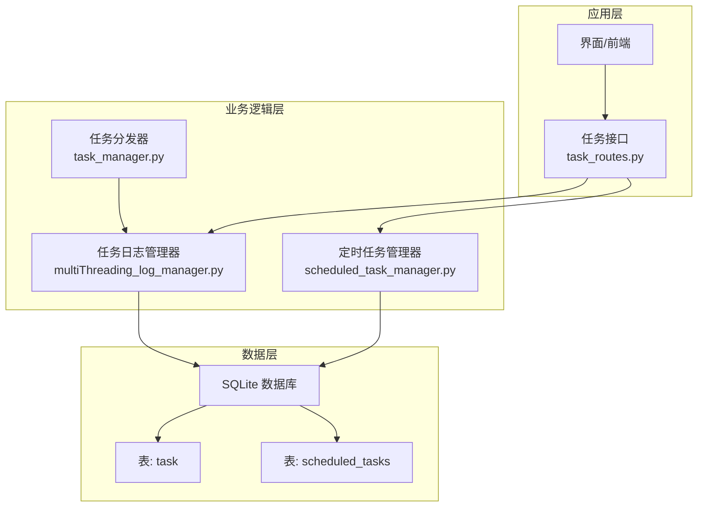
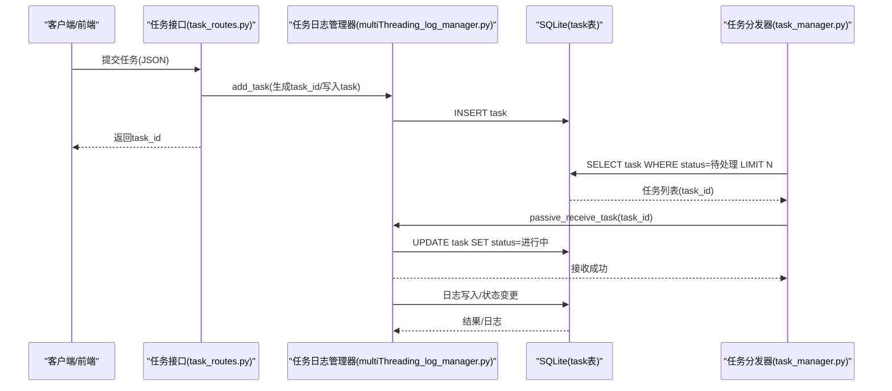
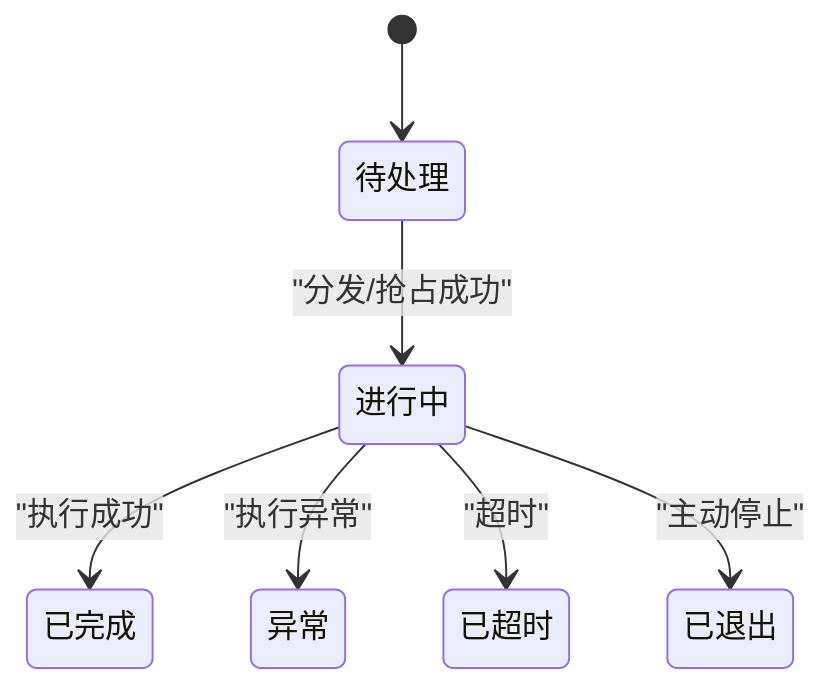
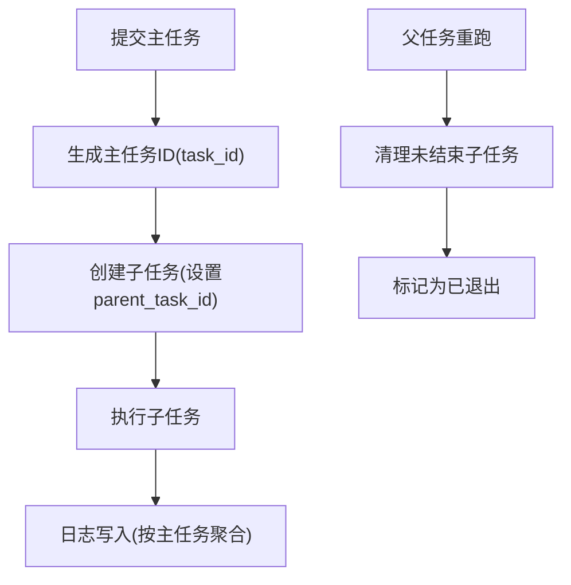
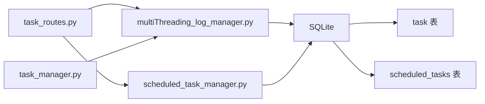

# task任务表

<cite>
**本文引用的文件**
- [db_updater_ikun.py](file://utils/db_updater_ikun.py)
- [task_routes.py](file://api/server_routes/task_routes.py)
- [multiThreading_log_manager.py](file://utils/multiThreading_log_manager.py)
- [task_manager.py](file://modules/task_manager.py)
- [scheduled_task_manager.py](file://utils/scheduled_task_manager.py)
</cite>

## 目录
1. [简介](#简介)
2. [项目结构](#项目结构)
3. [核心组件](#核心组件)
4. [架构总览](#架构总览)
5. [详细组件分析](#详细组件分析)
6. [依赖分析](#依赖分析)
7. [性能考量](#性能考量)
8. [故障排查指南](#故障排查指南)
9. [结论](#结论)
10. [附录](#附录)

## 简介
本文件面向“task任务表”的数据库结构与使用，基于仓库中的实现，系统性说明字段定义、约束、索引策略、状态流转、父子任务关系、常见查询与性能优化建议，并提供创建SQL与字段注释说明。

## 项目结构
围绕task任务表的关键实现分布在以下模块：
- 表结构定义与升级：utils/db_updater_ikun.py
- 任务提交与查询接口：api/server_routes/task_routes.py
- 任务日志与状态管理：utils/multiThreading_log_manager.py
- 任务分发与执行：modules/task_manager.py
- 定时任务关联：utils/scheduled_task_manager.py



图表来源
- [task_routes.py](file://api/server_routes/task_routes.py)
- [multiThreading_log_manager.py](file://utils/multiThreading_log_manager.py)
- [task_manager.py](file://modules/task_manager.py)
- [scheduled_task_manager.py](file://utils/scheduled_task_manager.py)

章节来源
- [db_updater_ikun.py](file://utils/db_updater_ikun.py)
- [task_routes.py](file://api/server_routes/task_routes.py)
- [multiThreading_log_manager.py](file://utils/multiThreading_log_manager.py)
- [task_manager.py](file://modules/task_manager.py)
- [scheduled_task_manager.py](file://utils/scheduled_task_manager.py)

## 核心组件
- 表结构定义与索引：通过通用更新函数维护task表字段、唯一约束与索引。
- 任务生命周期管理：提交、分发、执行、日志写入、状态更新。
- 查询与筛选：基于状态、任务ID、任务组、主任务标记、守护任务标记等条件的组合查询。
- 定时任务关联：通过scheduled_tasks表与task表建立定时执行关系。

章节来源
- [db_updater_ikun.py](file://utils/db_updater_ikun.py)
- [task_routes.py](file://api/server_routes/task_routes.py)
- [multiThreading_log_manager.py](file://utils/multiThreading_log_manager.py)
- [task_manager.py](file://modules/task_manager.py)
- [scheduled_task_manager.py](file://utils/scheduled_task_manager.py)

## 架构总览
任务从接口提交，经日志管理器入库，分发器按策略分发给子进程，执行线程更新状态与日志，查询接口按条件筛选并返回结果；定时任务通过独立表与task表关联。



图表来源
- [task_routes.py](file://api/server_routes/task_routes.py)
- [multiThreading_log_manager.py](file://utils/multiThreading_log_manager.py)
- [task_manager.py](file://modules/task_manager.py)

## 详细组件分析

### 字段定义与业务含义
以下字段来自表结构定义与使用场景，字段类型与约束以仓库实现为准：

- id：整型主键，自增，唯一标识每条记录
- task_name：文本，任务名称（如“上传实拍图”等）
- task_id：文本，NOT NULL，唯一标识任务，业务上用于幂等与追踪
- status：文本，任务状态（待处理/进行中/已完成/异常/已超时/已退出）
- msg：文本，任务消息/提示
- remarks：文本，备注/附加说明
- task_group：文本，任务组（通常为“店铺简称_任务类型”）
- func_name：文本，函数名（用于展示）
- mall_id：整型，商城ID
- task_kwargs：文本，JSON字符串，任务参数
- is_main_task：整型，默认0，标记是否为主任务（1为主任务）
- is_maintain_task：整型，默认0，标记是否为守护任务（1为守护）
- auto_rerun_time：文本，自动重跑时间（格式约定）
- parent_task_id：文本，父任务ID（用于父子任务关系）
- log：文本，任务日志内容
- create_time：日期时间，默认当前时间（UTC+8），记录创建时间
- update_time：日期时间，默认当前时间（UTC+8），记录更新时间
- func_path：文本，函数完整路径（模块.函数），用于动态导入
- ip：文本，来源IP（可选）

字段注释说明（基于实现与用途归纳）：
- 主键自增：id为自增主键，确保每条记录唯一
- 唯一约束：task_id唯一，保证任务ID全局唯一
- 索引策略：针对父任务ID、状态、任务组、主任务标记建立索引，提升查询与分发效率
- 时间字段：create_time与update_time均带UTC+8默认值，便于前端展示一致性
- 日志字段：log为累计日志，按线程写入并更新

章节来源
- [db_updater_ikun.py](file://utils/db_updater_ikun.py)
- [multiThreading_log_manager.py](file://utils/multiThreading_log_manager.py)

### 表结构创建SQL
以下SQL基于仓库中的表结构定义与索引配置生成，可用于初始化或迁移：

```sql
CREATE TABLE "task" (
  "id" INTEGER NOT NULL PRIMARY KEY AUTOINCREMENT,
  "task_name" TEXT,
  "task_id" TEXT NOT NULL,
  "status" TEXT,
  "msg" TEXT,
  "remarks" TEXT,
  "task_group" TEXT,
  "func_name" TEXT,
  "mall_id" INTEGER,
  "task_kwargs" TEXT,
  "is_main_task" INTEGER DEFAULT 0,
  "is_maintain_task" INTEGER DEFAULT 0,
  "auto_rerun_time" TEXT,
  "parent_task_id" TEXT,
  "log" TEXT,
  "create_time" DATETIME DEFAULT (datetime('now', '+8 hours')),
  "update_time" DATETIME DEFAULT (datetime('now', '+8 hours')),
  "func_path" TEXT,
  "ip" TEXT,
  UNIQUE ("task_id" ASC)
);

CREATE INDEX IF NOT EXISTS "idx_parent_task" ON "task" ("parent_task_id" ASC);
CREATE INDEX IF NOT EXISTS "idx_status" ON "task" ("status" ASC);
CREATE INDEX IF NOT EXISTS "idx_task_group" ON "task" ("task_group" ASC);
CREATE INDEX IF NOT EXISTS "idx_task_main" ON "task" ("is_main_task" ASC);
CREATE INDEX IF NOT EXISTS "idx_task_parent" ON "task" ("parent_task_id" ASC);
CREATE INDEX IF NOT EXISTS "idx_task_status" ON "task" ("status" ASC);
```

章节来源
- [db_updater_ikun.py](file://utils/db_updater_ikun.py)

### 索引策略与性能考虑
- idx_parent_task(idx_task_parent)：加速父子任务查询与清理
- idx_status(idx_task_status)：加速按状态筛选与分发
- idx_task_group：加速按任务组筛选
- idx_task_main：加速主任务筛选
- 唯一索引：task_id唯一，保障幂等与快速定位

性能建议：
- 查询条件尽量包含task_id或status，利用索引减少全表扫描
- 分页查询使用按update_time倒序，避免无序扫描
- 定时任务筛选使用EXISTS/IN子查询，注意索引命中

章节来源
- [db_updater_ikun.py](file://utils/db_updater_ikun.py)
- [task_routes.py](file://api/server_routes/task_routes.py)

### 任务状态流转机制
- 提交阶段：接口生成task_id并写入task，初始状态为“待处理”
- 分发阶段：分发器查询“待处理”任务，日志管理器原子更新为“进行中”，并写入队列
- 执行阶段：执行线程更新状态为“已完成/异常/已超时/已退出”，写入日志
- 清理阶段：启动时清理未完成子任务并去重主任务



图表来源
- [multiThreading_log_manager.py](file://utils/multiThreading_log_manager.py)
- [task_manager.py](file://modules/task_manager.py)

章节来源
- [multiThreading_log_manager.py](file://utils/multiThreading_log_manager.py)
- [task_manager.py](file://modules/task_manager.py)

### 父子任务关系设计
- 主任务：is_main_task=1，通常代表一次完整的业务流程
- 子任务：is_main_task=0，parent_task_id指向主任务ID
- 日志聚合：日志写入时通过递归获取主任务ID，将子任务日志聚合到主任务
- 清理策略：父任务重跑时清理未结束的子任务并标记为“已退出”



图表来源
- [multiThreading_log_manager.py](file://utils/multiThreading_log_manager.py)
- [task_routes.py](file://api/server_routes/task_routes.py)

章节来源
- [multiThreading_log_manager.py](file://utils/multiThreading_log_manager.py)
- [task_routes.py](file://api/server_routes/task_routes.py)

### 常见查询示例
- 按状态筛选：WHERE status = ?
- 按任务ID筛选：WHERE task_id = ?
- 按任务ID列表筛选：WHERE task_id IN (...)（支持去重与空值过滤）
- 按任务类型筛选：WHERE task_name = ?
- 按任务组模糊筛选：WHERE task_group LIKE ?
- 按主任务标记筛选：WHERE is_main_task = ?
- 按守护任务筛选：WHERE is_maintain_task = ?
- 按定时任务存在性筛选：WHERE task_id IN (SELECT task_id FROM scheduled_tasks WHERE schedule_enabled = 1)
- 分页与排序：ORDER BY update_time DESC LIMIT ? OFFSET ?

章节来源
- [task_routes.py](file://api/server_routes/task_routes.py)

### 字段注释与业务要点
- task_id：全局唯一，用于幂等与追踪
- is_main_task/is_maintain_task：用于区分主任务与守护任务，影响查询与展示
- parent_task_id：用于构建父子任务树
- func_path/func_name：用于动态导入与展示
- task_kwargs：JSON字符串，承载任务参数
- log：累计日志，按线程写入，注意截断策略避免过大字段
- create_time/update_time：UTC+8默认值，便于前端统一展示

章节来源
- [db_updater_ikun.py](file://utils/db_updater_ikun.py)
- [task_routes.py](file://api/server_routes/task_routes.py)
- [multiThreading_log_manager.py](file://utils/multiThreading_log_manager.py)

## 依赖分析
- task_routes依赖日志管理器生成task_id并写入task
- 日志管理器依赖SQLite执行DDL/DML
- 分发器依赖日志管理器的被动接收能力
- 定时任务管理器与task表通过task_id关联



图表来源
- [task_routes.py](file://api/server_routes/task_routes.py)
- [multiThreading_log_manager.py](file://utils/multiThreading_log_manager.py)
- [task_manager.py](file://modules/task_manager.py)
- [scheduled_task_manager.py](file://utils/scheduled_task_manager.py)

章节来源
- [task_routes.py](file://api/server_routes/task_routes.py)
- [multiThreading_log_manager.py](file://utils/multiThreading_log_manager.py)
- [task_manager.py](file://modules/task_manager.py)
- [scheduled_task_manager.py](file://utils/scheduled_task_manager.py)

## 性能考量
- 索引命中：优先使用task_id/status/task_group/is_main_task等字段进行筛选
- 分页与排序：按update_time倒序，避免全表扫描
- 日志写入：按主任务聚合写入，避免频繁更新子任务
- 并发控制：全局信号量与分发器负载均衡，避免队列满导致的危险状态
- 定时任务：通过scheduled_tasks表与task表关联，减少主表压力

[本节为通用性能指导，不直接分析具体文件]

## 故障排查指南
- 任务未分发：检查task表status是否为“待处理”，确认分发器轮询与队列容量
- 队列满风险：被动模式下队列满会标记为“进行中”但未处理，需监控与恢复
- 重复主任务：启动时清理重复主任务并标记为“已退出”
- 日志过大：接口侧对长文本进行截断，必要时调整截断阈值
- 定时任务异常：检查scheduled_tasks表与task表关联状态

章节来源
- [multiThreading_log_manager.py](file://utils/multiThreading_log_manager.py)
- [task_manager.py](file://modules/task_manager.py)
- [task_routes.py](file://api/server_routes/task_routes.py)

## 结论
task任务表通过明确的字段定义、唯一约束与索引策略，支撑了任务提交、分发、执行与查询的完整链路。结合父子任务关系与守护任务标记，能够满足复杂业务场景下的任务编排与可观测性需求。建议在生产环境中持续关注索引命中率、日志大小与队列容量，确保系统稳定与高性能。

[本节为总结性内容，不直接分析具体文件]

## 附录
- 初始化与升级：通过通用更新函数创建/升级task表结构
- 定时任务：通过scheduled_tasks表与task表关联，支持一次性与周期性调度

章节来源
- [db_updater_ikun.py](file://utils/db_updater_ikun.py)
- [scheduled_task_manager.py](file://utils/scheduled_task_manager.py)