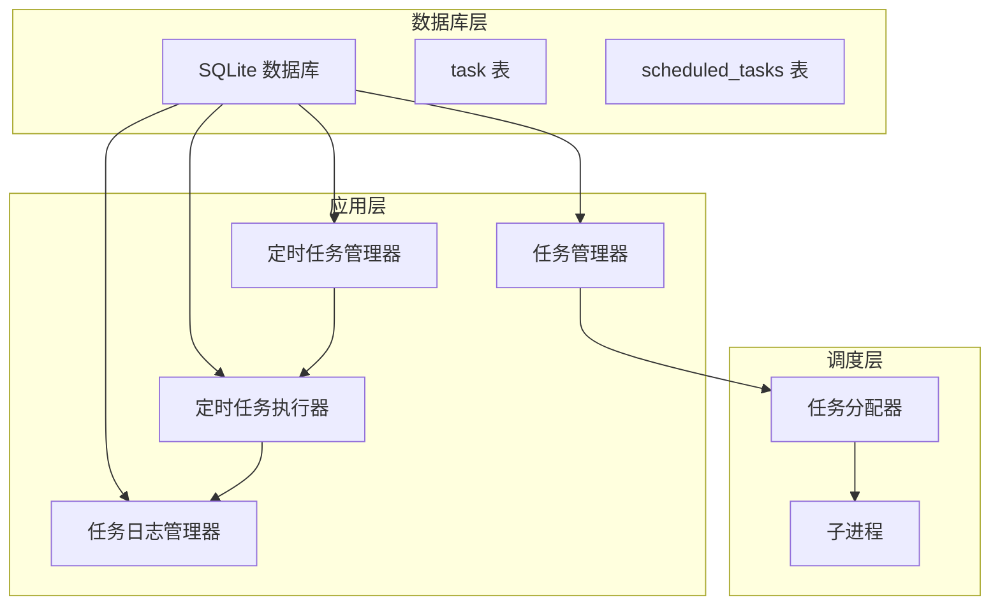
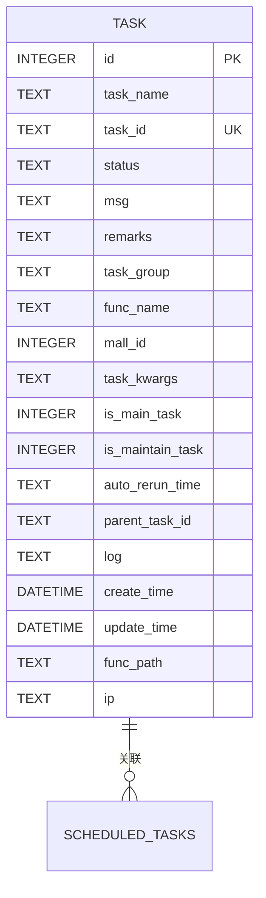
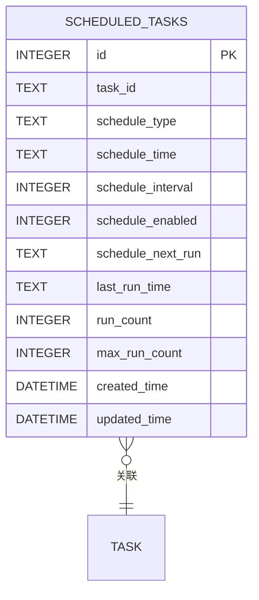
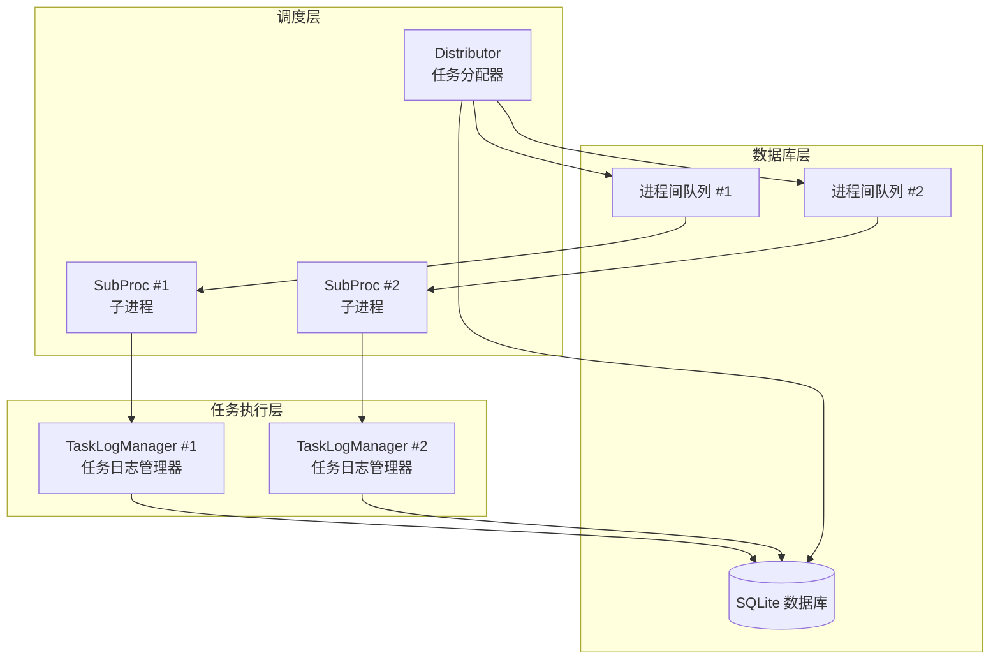
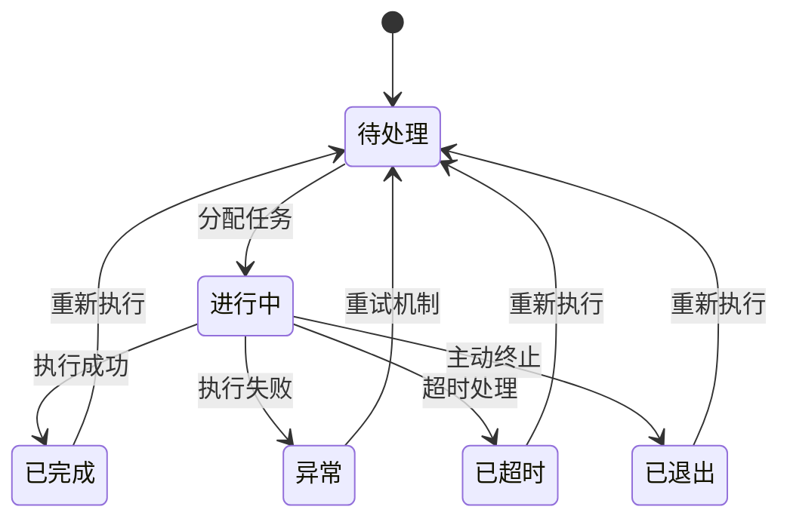
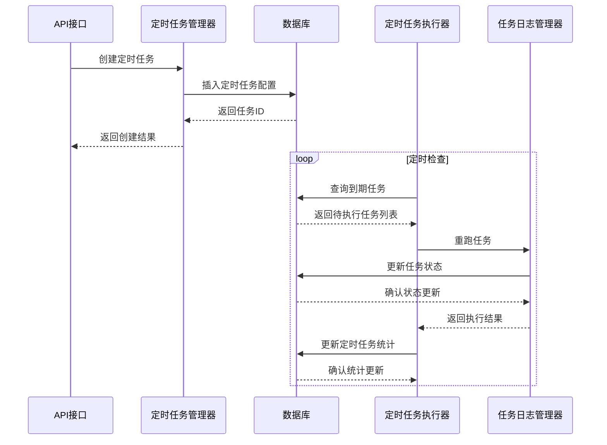
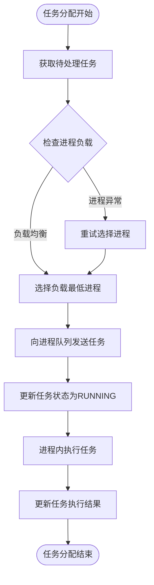
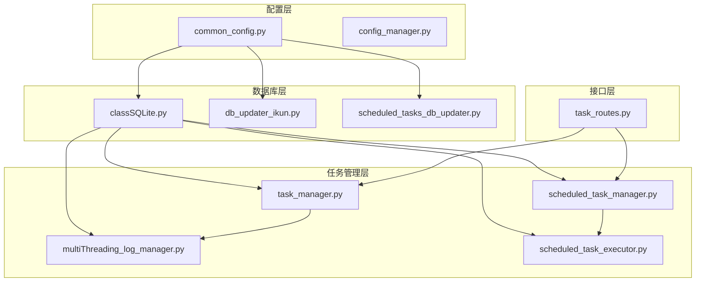

# 定时任务数据库结构

<cite>
**本文档引用的文件**
- [common_config.py](file://config/common_config.py)
- [classSQLite.py](file://modules/classSQLite.py)
- [db_updater_ikun.py](file://utils/db_updater_ikun.py)
- [scheduled_tasks_db_updater.py](file://utils/scheduled_tasks_db_updater.py)
- [multiThreading_log_manager.py](file://utils/multiThreading_log_manager.py)
- [scheduled_task_manager.py](file://utils/scheduled_task_manager.py)
- [scheduled_task_executor.py](file://utils/scheduled_task_executor.py)
- [task_manager.py](file://modules/task_manager.py)
- [task_routes.py](file://api/server_routes/task_routes.py)
</cite>

## 目录
1. [简介](#简介)
2. [项目结构概览](#项目结构概览)
3. [核心数据库组件](#核心数据库组件)
4. [架构概览](#架构概览)
5. [详细组件分析](#详细组件分析)
6. [依赖关系分析](#依赖关系分析)
7. [性能考虑](#性能考虑)
8. [故障排除指南](#故障排除指南)
9. [结论](#结论)

## 简介

本文档详细描述了定时任务系统的数据库结构设计，包括定时任务表的字段设计、任务状态管理、调度机制、生命周期管理、执行历史记录、错误处理机制、数据库交互模式、并发控制策略、任务状态转换图、执行流程图、任务优先级、重试机制、超时处理、监控告警机制、数据持久化策略和恢复机制，以及最佳实践和性能优化建议。

## 项目结构概览

定时任务系统采用模块化设计，主要包含以下核心组件：

**图表来源**
- [common_config.py:197-334](file://config/common_config.py#L197-L334)
- [task_manager.py:144-302](file://modules/task_manager.py#L144-L302)

**章节来源**
- [common_config.py:197-334](file://config/common_config.py#L197-L334)
- [classSQLite.py:359-531](file://modules/classSQLite.py#L359-L531)

## 核心数据库组件

### 任务表 (task) 设计

任务表是定时任务系统的核心数据存储，负责记录所有任务的状态和执行历史。

#### 字段设计

| 字段名 | 数据类型 | 约束 | 描述 |
|--------|----------|------|------|
| id | INTEGER | PRIMARY KEY, AUTOINCREMENT | 主键标识符 |
| task_name | TEXT |  | 任务显示名称 |
| task_id | TEXT | NOT NULL, UNIQUE | 任务唯一标识符 |
| status | TEXT |  | 任务当前状态 |
| msg | TEXT |  | 任务执行消息 |
| remarks | TEXT |  | 任务备注信息 |
| task_group | TEXT |  | 任务分组标识 |
| func_name | TEXT |  | 函数名称 |
| mall_id | INTEGER |  | 商城ID |
| task_kwargs | TEXT |  | 任务参数（JSON字符串） |
| is_main_task | INTEGER | DEFAULT 0 | 是否为主任务 |
| is_maintain_task | INTEGER | DEFAULT 0 | 是否为维护任务 |
| auto_rerun_time | TEXT |  | 自动重跑时间 |
| parent_task_id | TEXT |  | 父任务ID |
| log | TEXT |  | 任务日志内容 |
| create_time | DATETIME | DEFAULT (datetime('now', '+8 hours')) | 创建时间 |
| update_time | DATETIME | DEFAULT (datetime('now', '+8 hours')) | 更新时间 |
| func_path | TEXT |  | 函数路径 |
| ip | TEXT |  | IP地址 |

#### 索引设计

**图表来源**
- [db_updater_ikun.py:205-250](file://utils/db_updater_ikun.py#L205-L250)

**章节来源**
- [db_updater_ikun.py:205-250](file://utils/db_updater_ikun.py#L205-L250)
- [db_updater_ikun.py:233-240](file://utils/db_updater_ikun.py#L233-L240)

### 定时任务表 (scheduled_tasks) 设计

定时任务表专门用于存储定时任务的配置和调度信息。

#### 字段设计

| 字段名 | 数据类型 | 约束 | 描述 |
|--------|----------|------|------|
| id | INTEGER | PRIMARY KEY, AUTOINCREMENT | 主键标识符 |
| task_id | TEXT | NOT NULL | 关联的任务ID |
| schedule_type | TEXT | NOT NULL | 定时类型 ('once' 或 'interval') |
| schedule_time | TEXT |  | 定时执行时间 (HH:MM) |
| schedule_interval | INTEGER |  | 执行间隔（分钟） |
| schedule_enabled | INTEGER | DEFAULT 1 | 是否启用定时任务 |
| schedule_next_run | TEXT |  | 下次执行时间 |
| last_run_time | TEXT |  | 上次执行时间 |
| run_count | INTEGER | DEFAULT 0 | 执行次数 |
| max_run_count | INTEGER |  | 最大执行次数 |
| created_time | DATETIME | DEFAULT CURRENT_TIMESTAMP | 创建时间 |
| updated_time | DATETIME | DEFAULT CURRENT_TIMESTAMP | 更新时间 |

#### 索引设计

**图表来源**
- [scheduled_tasks_db_updater.py:165-178](file://utils/scheduled_tasks_db_updater.py#L165-L178)

**章节来源**
- [scheduled_tasks_db_updater.py:165-178](file://utils/scheduled_tasks_db_updater.py#L165-L178)
- [scheduled_tasks_db_updater.py:182-186](file://utils/scheduled_tasks_db_updater.py#L182-L186)

## 架构概览

定时任务系统采用多进程架构，结合中心化分配和被动接收模式：

**图表来源**
- [task_manager.py:144-302](file://modules/task_manager.py#L144-L302)
- [task_manager.py:22-142](file://modules/task_manager.py#L22-L142)

**章节来源**
- [task_manager.py:144-302](file://modules/task_manager.py#L144-L302)

## 详细组件分析

### 任务状态管理系统

任务状态管理是定时任务系统的核心机制，采用中文枚举状态：

**图表来源**
- [multiThreading_log_manager.py:25-32](file://utils/multiThreading_log_manager.py#L25-L32)

#### 状态转换规则

1. **待处理 (PENDING)**: 任务初始状态，等待执行
2. **进行中 (RUNNING)**: 任务正在执行，状态转换为进行中
3. **已完成 (SUCCESS)**: 任务执行成功，转换为已完成
4. **异常 (FAILED)**: 任务执行失败，转换为异常
5. **已超时 (TIMEOUT)**: 任务执行超时，转换为已超时
6. **已退出 (STOPPED)**: 任务被主动终止，转换为已退出

**章节来源**
- [multiThreading_log_manager.py:25-32](file://utils/multiThreading_log_manager.py#L25-L32)

### 定时任务调度机制

定时任务调度器负责管理定时任务的创建、更新、删除和执行：

**图表来源**
- [scheduled_task_manager.py:17-175](file://utils/scheduled_task_manager.py#L17-L175)
- [scheduled_task_executor.py:74-162](file://utils/scheduled_task_executor.py#L74-L162)

**章节来源**
- [scheduled_task_manager.py:17-175](file://utils/scheduled_task_manager.py#L17-L175)
- [scheduled_task_executor.py:74-162](file://utils/scheduled_task_executor.py#L74-L162)

### 并发控制策略

系统采用多进程架构实现高并发任务处理：

**图表来源**
- [task_manager.py:183-199](file://modules/task_manager.py#L183-L199)
- [task_manager.py:228-249](file://modules/task_manager.py#L228-L249)

**章节来源**
- [task_manager.py:183-199](file://modules/task_manager.py#L183-L199)
- [task_manager.py:228-249](file://modules/task_manager.py#L228-L249)

### 数据持久化策略

系统采用SQLite数据库实现数据持久化，支持以下特性：

1. **WAL模式**: 提高并发读写性能
2. **连接池**: 管理数据库连接资源
3. **事务支持**: 确保数据一致性
4. **自动备份**: 支持数据库文件合并

**章节来源**
- [classSQLite.py:315-329](file://modules/classSQLite.py#L315-L329)
- [common_config.py:82-94](file://config/common_config.py#L82-L94)

## 依赖关系分析

定时任务系统各组件之间的依赖关系如下：

**图表来源**
- [common_config.py:197-334](file://config/common_config.py#L197-L334)
- [task_manager.py:11-12](file://modules/task_manager.py#L11-L12)

**章节来源**
- [common_config.py:197-334](file://config/common_config.py#L197-L334)
- [task_manager.py:11-12](file://modules/task_manager.py#L11-L12)

## 性能考虑

### 数据库性能优化

1. **索引优化**: 为常用查询字段建立索引
   - `task_id`: 唯一索引，支持快速查找
   - `status`: 索引，支持状态筛选
   - `schedule_next_run`: 索引，支持定时查询

2. **连接池配置**: 
   - 最大连接数: 9999
   - 连接超时: 30秒
   - 空闲超时: 300秒

3. **WAL模式**: 提高并发读写性能

### 并发控制优化

1. **进程间通信**: 使用队列实现进程间任务分发
2. **负载均衡**: 基于进程负载选择最优目标进程
3. **信号量控制**: 限制任务并发数量

## 故障排除指南

### 常见问题及解决方案

1. **任务状态异常**
   - 症状: 任务状态显示异常
   - 解决方案: 检查数据库连接和事务提交

2. **进程通信失败**
   - 症状: 任务无法分发到子进程
   - 解决方案: 检查进程队列状态和进程存活情况

3. **定时任务不执行**
   - 症状: 定时任务到达时间不执行
   - 解决方案: 检查定时任务配置和执行器状态

**章节来源**
- [task_manager.py:293-305](file://modules/task_manager.py#L293-L305)
- [scheduled_task_executor.py:43-55](file://utils/scheduled_task_executor.py#L43-L55)

## 结论

定时任务系统采用模块化设计，通过SQLite数据库实现可靠的数据持久化，通过多进程架构实现高并发任务处理。系统具有完善的任务状态管理、调度机制、错误处理和监控告警能力。通过合理的数据库设计和并发控制策略，系统能够稳定高效地处理大量定时任务。

系统的主要优势包括：
- 模块化设计，易于维护和扩展
- 多进程架构，支持高并发处理
- 完善的状态管理和错误处理机制
- 灵活的定时任务调度功能
- 可靠的数据持久化和恢复机制