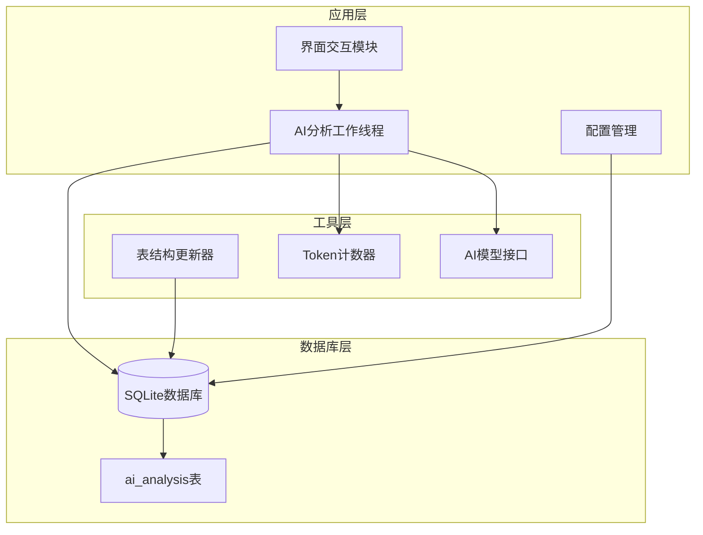
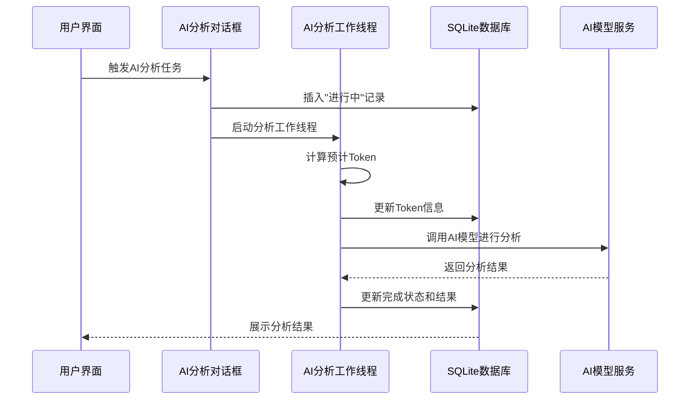
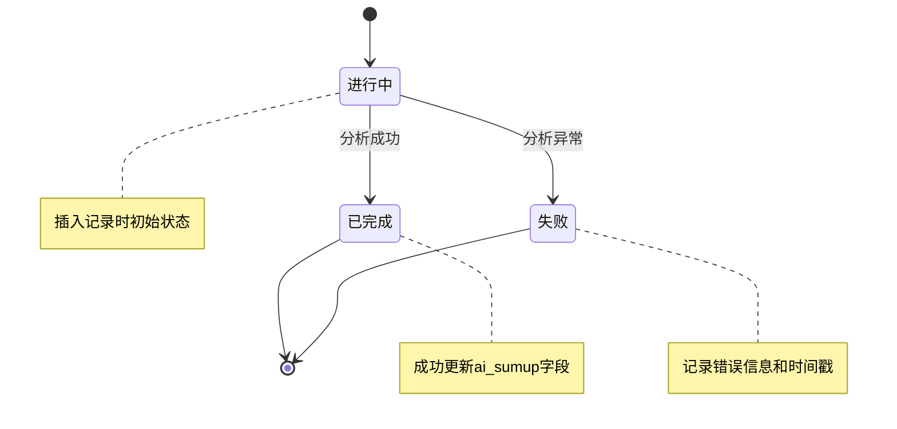
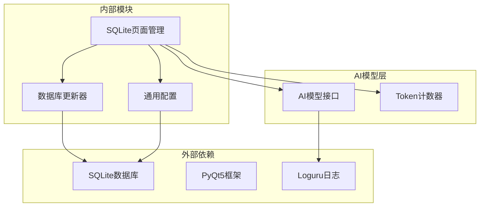

# AI分析结果表结构

<cite>
**本文档引用的文件**
- [db_updater_spider.py](file://utils/db_updater_spider.py)
- [SqlitePage.py](file://gui/SqlitePage.py)
- [common_config.py](file://config/common_config.py)
</cite>

## 目录
1. [简介](#简介)
2. [项目结构](#项目结构)
3. [核心组件](#核心组件)
4. [架构概览](#架构概览)
5. [详细组件分析](#详细组件分析)
6. [依赖分析](#依赖分析)
7. [性能考虑](#性能考虑)
8. [故障排除指南](#故障排除指南)
9. [结论](#结论)
10. [附录](#附录)

## 简介
本文件为AI分析结果表(ai_analysis)的完整数据库表结构文档。该表用于存储AI内容分析任务的结果，支撑系统内基于大模型的内容分析能力。通过统一的表结构设计，系统能够记录每次AI分析任务的状态、消息、备注信息以及最终的AI总结结果，并与具体的业务任务关联。

该表的核心设计目标包括：
- 统一记录AI分析任务的生命周期状态
- 保存分析过程中的消息和备注信息
- 存储最终的AI总结结果
- 与业务任务建立关联，便于追踪和查询
- 提供灵活的扩展能力，适应未来字段变更需求

## 项目结构
AI分析结果表结构涉及以下关键文件：
- 表结构定义与更新：utils/db_updater_spider.py
- UI交互与业务逻辑：gui/SqlitePage.py  
- 数据库配置与连接：config/common_config.py



**图表来源**
- [db_updater_spider.py:244-262](file://utils/db_updater_spider.py#L244-L262)
- [SqlitePage.py:42-83](file://gui/SqlitePage.py#L42-L83)
- [common_config.py:27](file://config/common_config.py#L27)

**章节来源**
- [db_updater_spider.py:152-241](file://utils/db_updater_spider.py#L152-L241)
- [SqlitePage.py:42-83](file://gui/SqlitePage.py#L42-L83)

## 核心组件
AI分析结果表(ai_analysis)包含以下核心字段：

### 主键字段
- **id**: INTEGER NOT NULL PRIMARY KEY AUTOINCREMENT
  - 自增主键，唯一标识每条分析记录
  - 支持快速定位和关联查询

### 任务标识字段
- **task_name**: TEXT
  - 任务名称，格式为"类型+AI分析"
  - 便于区分不同类型的任务
- **task_id**: TEXT
  - 业务任务标识符
  - 与上游业务数据建立关联
- **type**: TEXT
  - 分析任务类型标识
  - 支持多种分析场景的分类

### 状态管理字段
- **status**: TEXT
  - 分析任务状态，支持"进行中"、"已完成"、"失败"等状态
  - 用于任务进度跟踪和状态展示
- **msg**: TEXT
  - 状态消息，描述当前任务状态和简要信息
  - 包含进度提示和统计信息

### 结果存储字段
- **ai_sumup**: TEXT
  - AI生成的分析总结结果
  - 存储最终的分析输出内容

### 辅助信息字段
- **remarks**: TEXT
  - 详细备注信息，包含时间戳、Token消耗等技术信息
  - 支持任务执行过程的详细记录

**章节来源**
- [db_updater_spider.py:246-255](file://utils/db_updater_spider.py#L246-L255)
- [db_updater_spider.py:387-396](file://utils/db_updater_spider.py#L387-L396)

## 架构概览
AI分析结果表在整个系统中的架构位置如下：



**图表来源**
- [SqlitePage.py:1981-2003](file://gui/SqlitePage.py#L1981-L2003)
- [SqlitePage.py:2060-2120](file://gui/SqlitePage.py#L2060-L2120)

## 详细组件分析

### 表结构设计分析
AI分析结果表采用简洁而实用的字段设计，体现了以下设计理念：

#### 字段设计原则
1. **最小必要性**: 仅包含完成任务所需的最少字段
2. **可扩展性**: 通过TEXT类型支持未来字段扩展
3. **关联性**: 通过task_id与业务任务建立关联
4. **可查询性**: 关键字段支持基本的查询和筛选

#### 数据类型选择
- INTEGER: 用于自增主键，保证唯一性和高效查询
- TEXT: 用于存储可变长度的文本内容，支持中文和长文本
- 缺失的DATETIME字段: 通过remarks字段存储时间戳信息

**章节来源**
- [db_updater_spider.py:246-255](file://utils/db_updater_spider.py#L246-L255)

### 状态管理机制
系统实现了完整的任务状态管理机制：



**图表来源**
- [SqlitePage.py:2011-2049](file://gui/SqlitePage.py#L2011-L2049)
- [SqlitePage.py:2086-2120](file://gui/SqlitePage.py#L2086-L2120)

#### 状态流转控制
- **初始化**: 插入记录时设置为"进行中"
- **进度更新**: Token计算完成后更新备注信息
- **完成处理**: 成功时更新状态为"已完成"并存储结果
- **错误处理**: 失败时更新状态为"失败"并记录错误信息

**章节来源**
- [SqlitePage.py:2060-2155](file://gui/SqlitePage.py#L2060-L2155)

### 数据存储策略
系统采用以下数据存储策略：

#### 异步存储模式
- 分析工作线程与UI线程分离
- 通过信号槽机制实现线程间通信
- 支持多个并发分析任务

#### 错误恢复机制
- 完整的异常捕获和错误记录
- 失败状态的持久化存储
- 详细的错误信息记录

**章节来源**
- [SqlitePage.py:42-83](file://gui/SqlitePage.py#L42-L83)
- [SqlitePage.py:2122-2155](file://gui/SqlitePage.py#L2122-L2155)

## 依赖分析



**图表来源**
- [db_updater_spider.py:12-149](file://utils/db_updater_spider.py#L12-L149)
- [SqlitePage.py:19-21](file://gui/SqlitePage.py#L19-L21)

### 模块耦合关系
- **低耦合设计**: 各模块职责明确，接口清晰
- **配置驱动**: 通过配置文件管理数据库连接
- **插件化扩展**: 支持新的分析任务类型

**章节来源**
- [common_config.py:27](file://config/common_config.py#L27)
- [db_updater_spider.py:12-149](file://utils/db_updater_spider.py#L12-L149)

## 性能考虑
针对AI分析结果表的性能优化主要体现在以下几个方面：

### 查询性能优化
- **主键索引**: id字段自动建立索引，支持快速查询
- **任务ID索引**: task_id字段便于按任务查询
- **状态索引**: status字段支持按状态筛选

### 存储优化
- **TEXT字段设计**: 支持长文本存储，避免截断
- **增量更新**: 通过UPDATE语句逐步更新状态信息
- **批量操作**: 支持多个任务的并发处理

### 内存管理
- **工作线程池**: 控制并发任务数量
- **资源清理**: 及时释放工作线程资源
- **异常处理**: 防止内存泄漏

## 故障排除指南

### 常见问题诊断
1. **数据库连接失败**
   - 检查数据库文件是否存在
   - 验证数据库路径配置
   - 确认文件权限设置

2. **分析任务卡住**
   - 检查AI模型服务可用性
   - 验证网络连接状态
   - 查看Token计数器是否正常工作

3. **状态更新异常**
   - 检查数据库写权限
   - 验证SQL语句语法
   - 查看日志文件获取详细错误信息

### 调试建议
- 启用详细日志记录
- 使用单元测试验证核心功能
- 监控系统资源使用情况
- 定期备份数据库文件

**章节来源**
- [SqlitePage.py:2122-2155](file://gui/SqlitePage.py#L2122-L2155)

## 结论
AI分析结果表(ai_analysis)通过简洁而实用的字段设计，为系统的AI分析功能提供了可靠的数据支撑。表结构设计充分考虑了扩展性和实用性，支持多种分析场景的需求。通过完善的错误处理机制和状态管理，系统能够稳定地处理各种异常情况。

未来可以考虑的改进方向：
- 添加DATETIME类型的创建和更新时间字段
- 增加索引以优化查询性能
- 扩展状态枚举以支持更多任务状态
- 增加数据归档机制以控制表大小

## 附录

### 表创建SQL语句
```sql
CREATE TABLE "ai_analysis" (
    "id" INTEGER NOT NULL PRIMARY KEY AUTOINCREMENT,
    "task_name" TEXT,
    "status" TEXT,
    "msg" TEXT,
    "remarks" TEXT,
    "task_id" TEXT,
    "type" TEXT,
    "ai_sumup" TEXT
);
```

### 字段变更处理流程
1. 修改目标字段定义
2. 调用表结构更新函数
3. 系统自动处理字段新增或删除
4. 保留现有数据完整性
5. 验证更新结果

### 数据清理方案
1. **按状态清理**: 删除已完成或失败的过期记录
2. **按时间清理**: 清理超过指定时间的旧记录
3. **批量清理**: 支持按任务ID批量删除相关记录
4. **备份清理**: 清理前先备份重要数据

**章节来源**
- [db_updater_spider.py:244-262](file://utils/db_updater_spider.py#L244-L262)
- [db_updater_spider.py:385-403](file://utils/db_updater_spider.py#L385-L403)