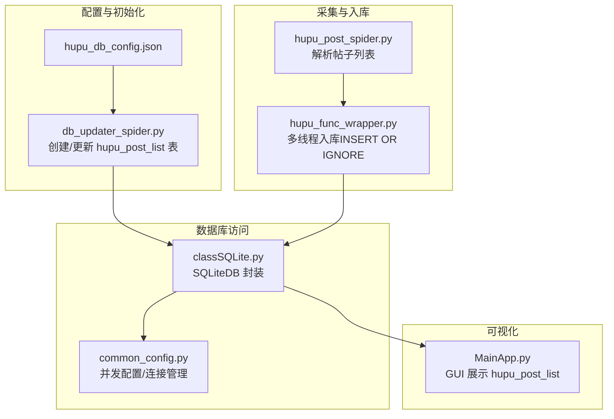
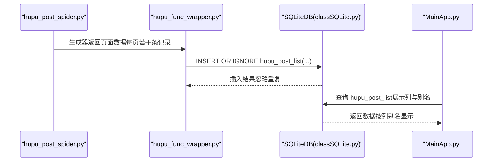
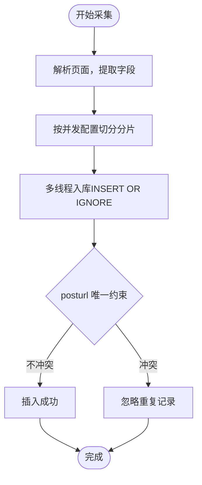
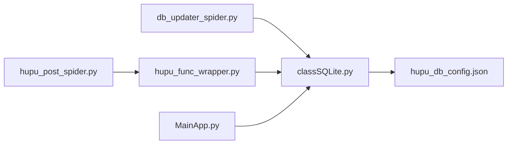

# 帖子列表表结构

<cite>
**本文引用的文件**
- [hupu_db_config.json](file://配置文件_系统配置/hupu_db_config.json)
- [db_updater_spider.py](file://utils/db_updater_spider.py)
- [hupu_post_spider.py](file://spider_modules/hupu_spiders/hupu_post_spider.py)
- [hupu_func_wrapper.py](file://spider_modules/hupu_func_wrapper.py)
- [classSQLite.py](file://modules/classSQLite.py)
- [common_config.py](file://config/common_config.py)
- [MainApp.py](file://gui/MainApp.py)
</cite>

## 目录
1. [简介](#简介)
2. [项目结构](#项目结构)
3. [核心组件](#核心组件)
4. [架构总览](#架构总览)
5. [详细组件分析](#详细组件分析)
6. [依赖关系分析](#依赖关系分析)
7. [性能考量](#性能考量)
8. [故障排查指南](#故障排查指南)
9. [结论](#结论)
10. [附录](#附录)

## 简介
本文件面向“虎扑帖子列表表（hupu_post_list）”的数据库表结构与使用场景，基于仓库中的实现进行系统化梳理。该表用于存储虎扑论坛帖子列表数据，支撑爬虫采集、去重、任务追踪与可视化展示。本文将从表设计目的、字段定义、约束与索引策略、初始化与更新机制、数据插入与查询优化等方面进行说明，并给出实践建议与排障要点。

## 项目结构
围绕 hupu_post_list 的关键文件与职责如下：
- 配置与初始化
  - 数据库配置：hupu_db_config.json
  - 表结构初始化与更新：db_updater_spider.py
- 爬虫与数据采集
  - 帖子列表爬虫：hupu_post_spider.py
  - 采集包装与入库：hupu_func_wrapper.py
- 数据库访问与并发
  - SQLiteDB 封装：classSQLite.py
  - 并发配置与连接管理：common_config.py
- 可视化与交互
  - GUI 主界面配置：MainApp.py

图表来源
- [hupu_db_config.json:1-18](file://配置文件_系统配置/hupu_db_config.json#L1-L18)
- [db_updater_spider.py:265-290](file://utils/db_updater_spider.py#L265-L290)
- [hupu_post_spider.py:19-42](file://spider_modules/hupu_spiders/hupu_post_spider.py#L19-L42)
- [hupu_func_wrapper.py:42-60](file://spider_modules/hupu_func_wrapper.py#L42-L60)
- [classSQLite.py:1-200](file://modules/classSQLite.py#L1-L200)
- [common_config.py:30-44](file://config/common_config.py#L30-L44)
- [MainApp.py:798-833](file://gui/MainApp.py#L798-L833)

章节来源
- [hupu_db_config.json:1-18](file://配置文件_系统配置/hupu_db_config.json#L1-L18)
- [db_updater_spider.py:265-290](file://utils/db_updater_spider.py#L265-L290)
- [hupu_post_spider.py:19-42](file://spider_modules/hupu_spiders/hupu_post_spider.py#L19-L42)
- [hupu_func_wrapper.py:42-60](file://spider_modules/hupu_func_wrapper.py#L42-L60)
- [classSQLite.py:1-200](file://modules/classSQLite.py#L1-L200)
- [common_config.py:30-44](file://config/common_config.py#L30-L44)
- [MainApp.py:798-833](file://gui/MainApp.py#L798-L833)

## 核心组件
- 表结构定义与唯一约束
  - 主键：id（自增整数）
  - 唯一约束：posturl（避免重复）
  - 时间字段：addtime（默认当前时间戳）
  - 任务标识：task_id（便于任务追踪）
- 初始化与更新机制
  - 通过 db_updater_spider.py 的 create/update 函数创建/更新表结构
  - 支持唯一约束与索引的维护
- 数据采集与入库
  - hupu_post_spider.py 解析帖子列表，产出字典数据
  - hupu_func_wrapper.py 使用 INSERT OR IGNORE 将数据写入 hupu_post_list
- 可视化与交互
  - GUI 主界面展示 hupu_post_list 的列与别名，支持导出与删除

章节来源
- [db_updater_spider.py:265-290](file://utils/db_updater_spider.py#L265-L290)
- [hupu_func_wrapper.py:42-60](file://spider_modules/hupu_func_wrapper.py#L42-L60)
- [MainApp.py:798-833](file://gui/MainApp.py#L798-L833)

## 架构总览
下图展示了从爬取到入库再到可视化的端到端流程。

图表来源
- [hupu_post_spider.py:156-168](file://spider_modules/hupu_spiders/hupu_post_spider.py#L156-L168)
- [hupu_func_wrapper.py:42-60](file://spider_modules/hupu_func_wrapper.py#L42-L60)
- [classSQLite.py:1-200](file://modules/classSQLite.py#L1-L200)
- [MainApp.py:798-833](file://gui/MainApp.py#L798-L833)

## 详细组件分析

### 表结构定义与字段说明
- 设计目的
  - 存储虎扑论坛帖子列表的关键元数据，支撑后续分析、去重与任务追踪
- 字段定义与约束
  - id：整型，主键，自增
  - huputitle：文本，帖子标题
  - hupu_zone：文本，虎扑分区
  - posturl：文本，帖子链接（唯一约束）
  - replies：文本，回复数
  - tuijian_count：文本，推荐数
  - fatietime：文本，发帖时间
  - addtime：日期时间，默认当前时间戳
  - liangping_count：文本，亮评数
  - task_id：文本，任务标识
- 唯一约束与去重策略
  - posturl 唯一约束 + INSERT OR IGNORE，避免重复入库
- 初始化 SQL 与更新机制
  - 通过 db_updater_spider.py 的 create_hupu_post_list_table 或 update_hupu_post_list_table_structure 完成创建与结构更新
  - 支持唯一约束与索引的维护

章节来源
- [db_updater_spider.py:265-290](file://utils/db_updater_spider.py#L265-L290)
- [db_updater_spider.py:406-431](file://utils/db_updater_spider.py#L406-L431)
- [hupu_func_wrapper.py:42-60](file://spider_modules/hupu_func_wrapper.py#L42-L60)

### 数据采集与入库流程
- 爬取与解析
  - hupu_post_spider.py 解析页面，提取标题、分区、发帖时间、回复数、推荐数、亮评数与 posturl
- 多线程入库
  - hupu_func_wrapper.py 将页面数据切分为多个分片，多线程调用 INSERT OR IGNORE 写入 hupu_post_list
  - 每条记录包含 task_id，便于任务追踪
- 任务并发控制
  - common_config.py 提供 hupu_post_list_concurrent 并发配置，影响分片大小与线程数

图表来源
- [hupu_post_spider.py:19-42](file://spider_modules/hupu_spiders/hupu_post_spider.py#L19-L42)
- [hupu_func_wrapper.py:42-60](file://spider_modules/hupu_func_wrapper.py#L42-L60)
- [common_config.py:144-147](file://config/common_config.py#L144-L147)

章节来源
- [hupu_post_spider.py:19-42](file://spider_modules/hupu_spiders/hupu_post_spider.py#L19-L42)
- [hupu_func_wrapper.py:42-60](file://spider_modules/hupu_func_wrapper.py#L42-L60)
- [common_config.py:144-147](file://config/common_config.py#L144-L147)

### 可视化与交互
- GUI 展示
  - MainApp.py 配置 hupu_post_list 的列与别名，固定列宽，支持导出与删除
- 数据库路径
  - hupu 数据库路径由 hupu_db_config.json 指定，GUI 通过统一配置路径访问

章节来源
- [MainApp.py:798-833](file://gui/MainApp.py#L798-L833)
- [hupu_db_config.json:1-18](file://配置文件_系统配置/hupu_db_config.json#L1-L18)

## 依赖关系分析
- 组件耦合
  - db_updater_spider.py 与 SQLiteDB（classSQLite.py）耦合，负责表结构与约束维护
  - hupu_post_spider.py 与 hupu_func_wrapper.py 通过生成器与多线程协作
  - GUI 与数据库通过统一配置路径访问
- 外部依赖
  - SQLite（WAL 模式、连接池配置）
  - 日志框架（loguru）

图表来源
- [db_updater_spider.py:265-290](file://utils/db_updater_spider.py#L265-L290)
- [classSQLite.py:1-200](file://modules/classSQLite.py#L1-L200)
- [hupu_post_spider.py:19-42](file://spider_modules/hupu_spiders/hupu_post_spider.py#L19-L42)
- [hupu_func_wrapper.py:42-60](file://spider_modules/hupu_func_wrapper.py#L42-L60)
- [MainApp.py:798-833](file://gui/MainApp.py#L798-L833)
- [hupu_db_config.json:1-18](file://配置文件_系统配置/hupu_db_config.json#L1-L18)

章节来源
- [db_updater_spider.py:265-290](file://utils/db_updater_spider.py#L265-L290)
- [classSQLite.py:1-200](file://modules/classSQLite.py#L1-L200)
- [hupu_post_spider.py:19-42](file://spider_modules/hupu_spiders/hupu_post_spider.py#L19-L42)
- [hupu_func_wrapper.py:42-60](file://spider_modules/hupu_func_wrapper.py#L42-L60)
- [MainApp.py:798-833](file://gui/MainApp.py#L798-L833)
- [hupu_db_config.json:1-18](file://配置文件_系统配置/hupu_db_config.json#L1-L18)

## 性能考量
- 并发与分片
  - 通过 hupu_post_list_concurrent 控制目标线程数，合理设置分片大小以平衡吞吐与资源占用
- 唯一约束与去重
  - 使用 posturl 唯一约束 + INSERT OR IGNORE，减少重复写入开销
- 数据库配置
  - WAL 模式、连接池与预热（pool_pre_ping）有助于提升并发写入稳定性
- 查询优化建议
  - 若频繁按 posturl 查询，可考虑为 posturl 建立索引（当前唯一约束已隐含索引）
  - 若按任务维度统计，可考虑为 task_id 建立索引
  - 对高频过滤字段（如 hupu_zone、fatietime）建立索引，需结合实际查询模式评估

章节来源
- [common_config.py:144-147](file://config/common_config.py#L144-L147)
- [hupu_db_config.json:1-18](file://配置文件_系统配置/hupu_db_config.json#L1-L18)
- [db_updater_spider.py:265-290](file://utils/db_updater_spider.py#L265-L290)

## 故障排查指南
- 插入失败或重复
  - 现象：日志提示“可能是重复数据”
  - 原因：posturl 已存在触发唯一约束
  - 处理：确认去重逻辑生效；若需更新，采用“先查后改”或“UPSERT”策略
- 表结构不一致
  - 现象：字段缺失或类型不符
  - 处理：调用 update_hupu_post_list_table_structure 或重新初始化数据库
- 并发写入异常
  - 现象：写入阻塞或冲突
  - 处理：检查并发配置与分片大小；确认 WAL 模式与连接池参数
- GUI 无法显示数据
  - 现象：界面空白或列不匹配
  - 处理：确认 hupu_db_config.json 路径正确；检查 GUI 列配置与表结构一致性

章节来源
- [hupu_func_wrapper.py:58-60](file://spider_modules/hupu_func_wrapper.py#L58-L60)
- [db_updater_spider.py:406-431](file://utils/db_updater_spider.py#L406-L431)
- [hupu_db_config.json:1-18](file://配置文件_系统配置/hupu_db_config.json#L1-L18)
- [MainApp.py:798-833](file://gui/MainApp.py#L798-L833)

## 结论
hupu_post_list 表通过明确的字段定义、posturl 唯一约束与 INSERT OR IGNORE 的入库策略，实现了对虎扑帖子列表数据的稳定采集与去重。配合合理的并发配置、数据库 WAL 与连接池设置，以及 GUI 的可视化展示，形成了从采集到呈现的一体化方案。建议在实际使用中根据查询模式补充索引，并持续维护表结构以适配业务演进。

## 附录

### 表结构初始化 SQL（参考）
- 创建表 SQL（字段与约束来自 create_hupu_post_list_table）
  - 主键：id（自增）
  - 唯一约束：posturl
  - 默认值：addtime 使用当前时间戳
- 更新表结构 SQL（来自 update_hupu_post_list_table_structure）
  - 支持新增字段、维护唯一约束与索引
- 注意事项
  - SQLite 不支持直接删除列，如需变更字段需重建表
  - 建议在生产环境前先验证唯一约束与索引策略

章节来源
- [db_updater_spider.py:265-290](file://utils/db_updater_spider.py#L265-L290)
- [db_updater_spider.py:406-431](file://utils/db_updater_spider.py#L406-L431)

### 字段更新机制
- 新增字段
  - 通过 update_table_structure 动态新增字段（不涉及删除列）
- 删除列
  - 检测到删除列时会提示风险并可选择确认或自动执行（重建表）
- 唯一约束与索引
  - 统一在 create/update 函数中维护，确保结构一致性

章节来源
- [db_updater_spider.py:12-149](file://utils/db_updater_spider.py#L12-L149)

### 数据插入示例（路径参考）
- 入库调用（INSERT OR IGNORE）
  - 字段顺序：huputitle, hupu_zone, posturl, replies, tuijian_count, fatietime, liangping_count, task_id
  - 调用位置：hupu_func_wrapper.py 的 process_hupu_posts_chunk
- 示例路径
  - [hupu_func_wrapper.py:42-60](file://spider_modules/hupu_func_wrapper.py#L42-L60)

章节来源
- [hupu_func_wrapper.py:42-60](file://spider_modules/hupu_func_wrapper.py#L42-L60)

### 查询优化与索引设计原则
- 唯一约束
  - posturl 唯一约束已隐含索引，适合按链接去重与快速查找
- 建议索引
  - task_id：按任务维度统计与筛选
  - hupu_zone：按分区聚合
  - fatietime：按时间范围查询
- 原则
  - 仅在高频查询字段上建立索引
  - 平衡写入性能与查询性能
  - 定期评估索引使用率与维护成本

章节来源
- [db_updater_spider.py:265-290](file://utils/db_updater_spider.py#L265-L290)
- [common_config.py:144-147](file://config/common_config.py#L144-L147)