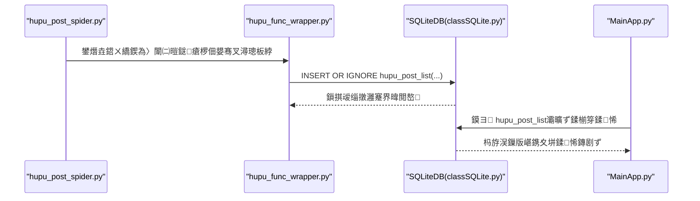
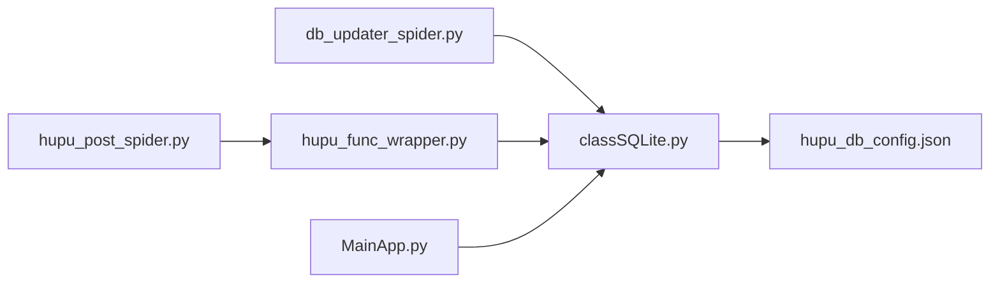

# 甯栧瓙鍒楄〃琛ㄧ粨鏋?
<cite>
**鏈枃寮曠敤鐨勬枃浠?*
- [hupu_db_config.json](file://閰嶇疆鏂囦欢_绯荤粺閰嶇疆/hupu_db_config.json)
- [db_updater_spider.py](file://utils/db_updater_spider.py)
- [hupu_post_spider.py](file://spider_modules/hupu_spiders/hupu_post_spider.py)
- [hupu_func_wrapper.py](file://spider_modules/hupu_func_wrapper.py)
- [classSQLite.py](file://modules/classSQLite.py)
- [common_config.py](file://config/common_config.py)
- [MainApp.py](file://gui/MainApp.py)
</cite>

## 鐩綍
1. [绠€浠媇(#绠€浠?
2. [椤圭洰缁撴瀯](#椤圭洰缁撴瀯)
3. [鏍稿績缁勪欢](#鏍稿績缁勪欢)
4. [鏋舵瀯鎬昏](#鏋舵瀯鎬昏)
5. [璇︾粏缁勪欢鍒嗘瀽](#璇︾粏缁勪欢鍒嗘瀽)
6. [渚濊禆鍏崇郴鍒嗘瀽](#渚濊禆鍏崇郴鍒嗘瀽)
7. [鎬ц兘鑰冮噺](#鎬ц兘鑰冮噺)
8. [鏁呴殰鎺掓煡鎸囧崡](#鏁呴殰鎺掓煡鎸囧崡)
9. [缁撹](#缁撹)
10. [闄勫綍](#闄勫綍)

## 绠€浠?鏈枃浠堕潰鍚戔€滆檸鎵戝笘瀛愬垪琛ㄨ〃锛坔upu_post_list锛夆€濈殑鏁版嵁搴撹〃缁撴瀯涓庝娇鐢ㄥ満鏅紝鍩轰簬浠撳簱涓殑瀹炵幇杩涜绯荤粺鍖栨⒊鐞嗐€傝琛ㄧ敤浜庡瓨鍌ㄨ檸鎵戣鍧涘笘瀛愬垪琛ㄦ暟鎹紝鏀拺鐖櫕閲囬泦銆佸幓閲嶃€佷换鍔¤拷韪笌鍙鍖栧睍绀恒€傛湰鏂囧皢浠庤〃璁捐鐩殑銆佸瓧娈靛畾涔夈€佺害鏉熶笌绱㈠紩绛栫暐銆佸垵濮嬪寲涓庢洿鏂版満鍒躲€佹暟鎹彃鍏ヤ笌鏌ヨ浼樺寲绛夋柟闈㈣繘琛岃鏄庯紝骞剁粰鍑哄疄璺靛缓璁笌鎺掗殰瑕佺偣銆?
## 椤圭洰缁撴瀯
鍥寸粫 hupu_post_list 鐨勫叧閿枃浠朵笌鑱岃矗濡備笅锛?- 閰嶇疆涓庡垵濮嬪寲
  - 鏁版嵁搴撻厤缃細hupu_db_config.json
  - 琛ㄧ粨鏋勫垵濮嬪寲涓庢洿鏂帮細db_updater_spider.py
- 鐖櫕涓庢暟鎹噰闆?  - 甯栧瓙鍒楄〃鐖櫕锛歨upu_post_spider.py
  - 閲囬泦鍖呰涓庡叆搴擄細hupu_func_wrapper.py
- 鏁版嵁搴撹闂笌骞跺彂
  - SQLiteDB 灏佽锛歝lassSQLite.py
  - 骞跺彂閰嶇疆涓庤繛鎺ョ鐞嗭細common_config.py
- 鍙鍖栦笌浜や簰
  - GUI 涓荤晫闈㈤厤缃細MainApp.py

```mermaid
graph TB
subgraph "閰嶇疆涓庡垵濮嬪寲"
CFG["hupu_db_config.json"]
INIT["db_updater_spider.py<br/>鍒涘缓/鏇存柊 hupu_post_list 琛?]
end
subgraph "閲囬泦涓庡叆搴?
SPIDER["hupu_post_spider.py<br/>瑙ｆ瀽甯栧瓙鍒楄〃"]
WRAP["hupu_func_wrapper.py<br/>澶氱嚎绋嬪叆搴揑NSERT OR IGNORE"]
end
subgraph "鏁版嵁搴撹闂?
SQLITE["classSQLite.py<br/>SQLiteDB 灏佽"]
CONN["common_config.py<br/>骞跺彂閰嶇疆/杩炴帴绠＄悊"]
end
subgraph "鍙鍖?
GUI["MainApp.py<br/>GUI 灞曠ず hupu_post_list"]
end
CFG --> INIT
INIT --> SQLITE
SPIDER --> WRAP
WRAP --> SQLITE
SQLITE --> CONN
SQLITE --> GUI
```

鍥捐〃鏉ユ簮
- [hupu_db_config.json:1-18](file://閰嶇疆鏂囦欢_绯荤粺閰嶇疆/hupu_db_config.json#L1-L18)
- [db_updater_spider.py:265-290](file://utils/db_updater_spider.py#L265-L290)
- [hupu_post_spider.py:19-42](file://spider_modules/hupu_spiders/hupu_post_spider.py#L19-L42)
- [hupu_func_wrapper.py:42-60](file://spider_modules/hupu_func_wrapper.py#L42-L60)
- [classSQLite.py:1-200](file://modules/classSQLite.py#L1-L200)
- [common_config.py:30-44](file://config/common_config.py#L30-L44)
- [MainApp.py:798-833](file://gui/MainApp.py#L798-L833)

绔犺妭鏉ユ簮
- [hupu_db_config.json:1-18](file://閰嶇疆鏂囦欢_绯荤粺閰嶇疆/hupu_db_config.json#L1-L18)
- [db_updater_spider.py:265-290](file://utils/db_updater_spider.py#L265-L290)
- [hupu_post_spider.py:19-42](file://spider_modules/hupu_spiders/hupu_post_spider.py#L19-L42)
- [hupu_func_wrapper.py:42-60](file://spider_modules/hupu_func_wrapper.py#L42-L60)
- [classSQLite.py:1-200](file://modules/classSQLite.py#L1-L200)
- [common_config.py:30-44](file://config/common_config.py#L30-L44)
- [MainApp.py:798-833](file://gui/MainApp.py#L798-L833)

## 鏍稿績缁勪欢
- 琛ㄧ粨鏋勫畾涔変笌鍞竴绾︽潫
  - 涓婚敭锛歩d锛堣嚜澧炴暣鏁帮級
  - 鍞竴绾︽潫锛歱osturl锛堥伩鍏嶉噸澶嶏級
  - 鏃堕棿瀛楁锛歛ddtime锛堥粯璁ゅ綋鍓嶆椂闂存埑锛?  - 浠诲姟鏍囪瘑锛歵ask_id锛堜究浜庝换鍔¤拷韪級
- 鍒濆鍖栦笌鏇存柊鏈哄埗
  - 閫氳繃 db_updater_spider.py 鐨?create/update 鍑芥暟鍒涘缓/鏇存柊琛ㄧ粨鏋?  - 鏀寔鍞竴绾︽潫涓庣储寮曠殑缁存姢
- 鏁版嵁閲囬泦涓庡叆搴?  - hupu_post_spider.py 瑙ｆ瀽甯栧瓙鍒楄〃锛屼骇鍑哄瓧鍏告暟鎹?  - hupu_func_wrapper.py 浣跨敤 INSERT OR IGNORE 灏嗘暟鎹啓鍏?hupu_post_list
- 鍙鍖栦笌浜や簰
  - GUI 涓荤晫闈㈠睍绀?hupu_post_list 鐨勫垪涓庡埆鍚嶏紝鏀寔瀵煎嚭涓庡垹闄?
绔犺妭鏉ユ簮
- [db_updater_spider.py:265-290](file://utils/db_updater_spider.py#L265-L290)
- [hupu_func_wrapper.py:42-60](file://spider_modules/hupu_func_wrapper.py#L42-L60)
- [MainApp.py:798-833](file://gui/MainApp.py#L798-L833)

## 鏋舵瀯鎬昏
涓嬪浘灞曠ず浜嗕粠鐖彇鍒板叆搴撳啀鍒板彲瑙嗗寲鐨勭鍒扮娴佺▼銆?


鍥捐〃鏉ユ簮
- [hupu_post_spider.py:156-168](file://spider_modules/hupu_spiders/hupu_post_spider.py#L156-L168)
- [hupu_func_wrapper.py:42-60](file://spider_modules/hupu_func_wrapper.py#L42-L60)
- [classSQLite.py:1-200](file://modules/classSQLite.py#L1-L200)
- [MainApp.py:798-833](file://gui/MainApp.py#L798-L833)

## 璇︾粏缁勪欢鍒嗘瀽

### 琛ㄧ粨鏋勫畾涔変笌瀛楁璇存槑
- 璁捐鐩殑
  - 瀛樺偍铏庢墤璁哄潧甯栧瓙鍒楄〃鐨勫叧閿厓鏁版嵁锛屾敮鎾戝悗缁垎鏋愩€佸幓閲嶄笌浠诲姟杩借釜
- 瀛楁瀹氫箟涓庣害鏉?  - id锛氭暣鍨嬶紝涓婚敭锛岃嚜澧?  - huputitle锛氭枃鏈紝甯栧瓙鏍囬
  - hupu_zone锛氭枃鏈紝铏庢墤鍒嗗尯
  - posturl锛氭枃鏈紝甯栧瓙閾炬帴锛堝敮涓€绾︽潫锛?  - replies锛氭枃鏈紝鍥炲鏁?  - tuijian_count锛氭枃鏈紝鎺ㄨ崘鏁?  - fatietime锛氭枃鏈紝鍙戝笘鏃堕棿
  - addtime锛氭棩鏈熸椂闂达紝榛樿褰撳墠鏃堕棿鎴?  - liangping_count锛氭枃鏈紝浜瘎鏁?  - task_id锛氭枃鏈紝浠诲姟鏍囪瘑
- 鍞竴绾︽潫涓庡幓閲嶇瓥鐣?  - posturl 鍞竴绾︽潫 + INSERT OR IGNORE锛岄伩鍏嶉噸澶嶅叆搴?- 鍒濆鍖?SQL 涓庢洿鏂版満鍒?  - 閫氳繃 db_updater_spider.py 鐨?create_hupu_post_list_table 鎴?update_hupu_post_list_table_structure 瀹屾垚鍒涘缓涓庣粨鏋勬洿鏂?  - 鏀寔鍞竴绾︽潫涓庣储寮曠殑缁存姢

绔犺妭鏉ユ簮
- [db_updater_spider.py:265-290](file://utils/db_updater_spider.py#L265-L290)
- [db_updater_spider.py:406-431](file://utils/db_updater_spider.py#L406-L431)
- [hupu_func_wrapper.py:42-60](file://spider_modules/hupu_func_wrapper.py#L42-L60)

### 鏁版嵁閲囬泦涓庡叆搴撴祦绋?- 鐖彇涓庤В鏋?  - hupu_post_spider.py 瑙ｆ瀽椤甸潰锛屾彁鍙栨爣棰樸€佸垎鍖恒€佸彂甯栨椂闂淬€佸洖澶嶆暟銆佹帹鑽愭暟銆佷寒璇勬暟涓?posturl
- 澶氱嚎绋嬪叆搴?  - hupu_func_wrapper.py 灏嗛〉闈㈡暟鎹垏鍒嗕负澶氫釜鍒嗙墖锛屽绾跨▼璋冪敤 INSERT OR IGNORE 鍐欏叆 hupu_post_list
  - 姣忔潯璁板綍鍖呭惈 task_id锛屼究浜庝换鍔¤拷韪?- 浠诲姟骞跺彂鎺у埗
  - common_config.py 鎻愪緵 hupu_post_list_concurrent 骞跺彂閰嶇疆锛屽奖鍝嶅垎鐗囧ぇ灏忎笌绾跨▼鏁?
```mermaid
flowchart TD
Start(["寮€濮嬮噰闆?]) --> Parse["瑙ｆ瀽椤甸潰锛屾彁鍙栧瓧娈?]
Parse --> Split["鎸夊苟鍙戦厤缃垏鍒嗗垎鐗?]
Split --> MultiThread["澶氱嚎绋嬪叆搴揑NSERT OR IGNORE"]
MultiThread --> UniqueCheck{"posturl 鍞竴绾︽潫"}
UniqueCheck --> |鍐茬獊| Ignore["蹇界暐閲嶅璁板綍"]
UniqueCheck --> |涓嶅啿绐亅 InsertOK["鎻掑叆鎴愬姛"]
InsertOK --> End(["瀹屾垚"])
Ignore --> End
```

鍥捐〃鏉ユ簮
- [hupu_post_spider.py:19-42](file://spider_modules/hupu_spiders/hupu_post_spider.py#L19-L42)
- [hupu_func_wrapper.py:42-60](file://spider_modules/hupu_func_wrapper.py#L42-L60)
- [common_config.py:144-147](file://config/common_config.py#L144-L147)

绔犺妭鏉ユ簮
- [hupu_post_spider.py:19-42](file://spider_modules/hupu_spiders/hupu_post_spider.py#L19-L42)
- [hupu_func_wrapper.py:42-60](file://spider_modules/hupu_func_wrapper.py#L42-L60)
- [common_config.py:144-147](file://config/common_config.py#L144-L147)

### 鍙鍖栦笌浜や簰
- GUI 灞曠ず
  - MainApp.py 閰嶇疆 hupu_post_list 鐨勫垪涓庡埆鍚嶏紝鍥哄畾鍒楀锛屾敮鎸佸鍑轰笌鍒犻櫎
- 鏁版嵁搴撹矾寰?  - hupu 鏁版嵁搴撹矾寰勭敱 hupu_db_config.json 鎸囧畾锛孏UI 閫氳繃缁熶竴閰嶇疆璺緞璁块棶

绔犺妭鏉ユ簮
- [MainApp.py:798-833](file://gui/MainApp.py#L798-L833)
- [hupu_db_config.json:1-18](file://閰嶇疆鏂囦欢_绯荤粺閰嶇疆/hupu_db_config.json#L1-L18)

## 渚濊禆鍏崇郴鍒嗘瀽
- 缁勪欢鑰﹀悎
  - db_updater_spider.py 涓?SQLiteDB锛坈lassSQLite.py锛夎€﹀悎锛岃礋璐ｈ〃缁撴瀯涓庣害鏉熺淮鎶?  - hupu_post_spider.py 涓?hupu_func_wrapper.py 閫氳繃鐢熸垚鍣ㄤ笌澶氱嚎绋嬪崗浣?  - GUI 涓庢暟鎹簱閫氳繃缁熶竴閰嶇疆璺緞璁块棶
- 澶栭儴渚濊禆
  - SQLite锛圵AL 妯″紡銆佽繛鎺ユ睜閰嶇疆锛?  - 鏃ュ織妗嗘灦锛坙oguru锛?


鍥捐〃鏉ユ簮
- [db_updater_spider.py:265-290](file://utils/db_updater_spider.py#L265-L290)
- [classSQLite.py:1-200](file://modules/classSQLite.py#L1-L200)
- [hupu_post_spider.py:19-42](file://spider_modules/hupu_spiders/hupu_post_spider.py#L19-L42)
- [hupu_func_wrapper.py:42-60](file://spider_modules/hupu_func_wrapper.py#L42-L60)
- [MainApp.py:798-833](file://gui/MainApp.py#L798-L833)
- [hupu_db_config.json:1-18](file://閰嶇疆鏂囦欢_绯荤粺閰嶇疆/hupu_db_config.json#L1-L18)

绔犺妭鏉ユ簮
- [db_updater_spider.py:265-290](file://utils/db_updater_spider.py#L265-L290)
- [classSQLite.py:1-200](file://modules/classSQLite.py#L1-L200)
- [hupu_post_spider.py:19-42](file://spider_modules/hupu_spiders/hupu_post_spider.py#L19-L42)
- [hupu_func_wrapper.py:42-60](file://spider_modules/hupu_func_wrapper.py#L42-L60)
- [MainApp.py:798-833](file://gui/MainApp.py#L798-L833)
- [hupu_db_config.json:1-18](file://閰嶇疆鏂囦欢_绯荤粺閰嶇疆/hupu_db_config.json#L1-L18)

## 鎬ц兘鑰冮噺
- 骞跺彂涓庡垎鐗?  - 閫氳繃 hupu_post_list_concurrent 鎺у埗鐩爣绾跨▼鏁帮紝鍚堢悊璁剧疆鍒嗙墖澶у皬浠ュ钩琛″悶鍚愪笌璧勬簮鍗犵敤
- 鍞竴绾︽潫涓庡幓閲?  - 浣跨敤 posturl 鍞竴绾︽潫 + INSERT OR IGNORE锛屽噺灏戦噸澶嶅啓鍏ュ紑閿€
- 鏁版嵁搴撻厤缃?  - WAL 妯″紡銆佽繛鎺ユ睜涓庨鐑紙pool_pre_ping锛夋湁鍔╀簬鎻愬崌骞跺彂鍐欏叆绋冲畾鎬?- 鏌ヨ浼樺寲寤鸿
  - 鑻ラ绻佹寜 posturl 鏌ヨ锛屽彲鑰冭檻涓?posturl 寤虹珛绱㈠紩锛堝綋鍓嶅敮涓€绾︽潫宸查殣鍚储寮曪級
  - 鑻ユ寜浠诲姟缁村害缁熻锛屽彲鑰冭檻涓?task_id 寤虹珛绱㈠紩
  - 瀵归珮棰戣繃婊ゅ瓧娈碉紙濡?hupu_zone銆乫atietime锛夊缓绔嬬储寮曪紝闇€缁撳悎瀹為檯鏌ヨ妯″紡璇勪及

绔犺妭鏉ユ簮
- [common_config.py:144-147](file://config/common_config.py#L144-L147)
- [hupu_db_config.json:1-18](file://閰嶇疆鏂囦欢_绯荤粺閰嶇疆/hupu_db_config.json#L1-L18)
- [db_updater_spider.py:265-290](file://utils/db_updater_spider.py#L265-L290)

## 鏁呴殰鎺掓煡鎸囧崡
- 鎻掑叆澶辫触鎴栭噸澶?  - 鐜拌薄锛氭棩蹇楁彁绀衡€滃彲鑳芥槸閲嶅鏁版嵁鈥?  - 鍘熷洜锛歱osturl 宸插瓨鍦ㄨЕ鍙戝敮涓€绾︽潫
  - 澶勭悊锛氱‘璁ゅ幓閲嶉€昏緫鐢熸晥锛涜嫢闇€鏇存柊锛岄噰鐢ㄢ€滃厛鏌ュ悗鏀光€濇垨鈥淯PSERT鈥濈瓥鐣?- 琛ㄧ粨鏋勪笉涓€鑷?  - 鐜拌薄锛氬瓧娈电己澶辨垨绫诲瀷涓嶇
  - 澶勭悊锛氳皟鐢?update_hupu_post_list_table_structure 鎴栭噸鏂板垵濮嬪寲鏁版嵁搴?- 骞跺彂鍐欏叆寮傚父
  - 鐜拌薄锛氬啓鍏ラ樆濉炴垨鍐茬獊
  - 澶勭悊锛氭鏌ュ苟鍙戦厤缃笌鍒嗙墖澶у皬锛涚‘璁?WAL 妯″紡涓庤繛鎺ユ睜鍙傛暟
- GUI 鏃犳硶鏄剧ず鏁版嵁
  - 鐜拌薄锛氱晫闈㈢┖鐧芥垨鍒椾笉鍖归厤
  - 澶勭悊锛氱‘璁?hupu_db_config.json 璺緞姝ｇ‘锛涙鏌?GUI 鍒楅厤缃笌琛ㄧ粨鏋勪竴鑷存€?
绔犺妭鏉ユ簮
- [hupu_func_wrapper.py:58-60](file://spider_modules/hupu_func_wrapper.py#L58-L60)
- [db_updater_spider.py:406-431](file://utils/db_updater_spider.py#L406-L431)
- [hupu_db_config.json:1-18](file://閰嶇疆鏂囦欢_绯荤粺閰嶇疆/hupu_db_config.json#L1-L18)
- [MainApp.py:798-833](file://gui/MainApp.py#L798-L833)

## 缁撹
hupu_post_list 琛ㄩ€氳繃鏄庣‘鐨勫瓧娈靛畾涔夈€乸osturl 鍞竴绾︽潫涓?INSERT OR IGNORE 鐨勫叆搴撶瓥鐣ワ紝瀹炵幇浜嗗铏庢墤甯栧瓙鍒楄〃鏁版嵁鐨勭ǔ瀹氶噰闆嗕笌鍘婚噸銆傞厤鍚堝悎鐞嗙殑骞跺彂閰嶇疆銆佹暟鎹簱 WAL 涓庤繛鎺ユ睜璁剧疆锛屼互鍙?GUI 鐨勫彲瑙嗗寲灞曠ず锛屽舰鎴愪簡浠庨噰闆嗗埌鍛堢幇鐨勪竴浣撳寲鏂规銆傚缓璁湪瀹為檯浣跨敤涓牴鎹煡璇㈡ā寮忚ˉ鍏呯储寮曪紝骞舵寔缁淮鎶よ〃缁撴瀯浠ラ€傞厤涓氬姟婕旇繘銆?
## 闄勫綍

### 琛ㄧ粨鏋勫垵濮嬪寲 SQL锛堝弬鑰冿級
- 鍒涘缓琛?SQL锛堝瓧娈典笌绾︽潫鏉ヨ嚜 create_hupu_post_list_table锛?  - 涓婚敭锛歩d锛堣嚜澧烇級
  - 鍞竴绾︽潫锛歱osturl
  - 榛樿鍊硷細addtime 浣跨敤褰撳墠鏃堕棿鎴?- 鏇存柊琛ㄧ粨鏋?SQL锛堟潵鑷?update_hupu_post_list_table_structure锛?  - 鏀寔鏂板瀛楁銆佺淮鎶ゅ敮涓€绾︽潫涓庣储寮?- 娉ㄦ剰浜嬮」
  - SQLite 涓嶆敮鎸佺洿鎺ュ垹闄ゅ垪锛屽闇€鍙樻洿瀛楁闇€閲嶅缓琛?  - 寤鸿鍦ㄧ敓浜х幆澧冨墠鍏堥獙璇佸敮涓€绾︽潫涓庣储寮曠瓥鐣?
绔犺妭鏉ユ簮
- [db_updater_spider.py:265-290](file://utils/db_updater_spider.py#L265-L290)
- [db_updater_spider.py:406-431](file://utils/db_updater_spider.py#L406-L431)

### 瀛楁鏇存柊鏈哄埗
- 鏂板瀛楁
  - 閫氳繃 update_table_structure 鍔ㄦ€佹柊澧炲瓧娈碉紙涓嶆秹鍙婂垹闄ゅ垪锛?- 鍒犻櫎鍒?  - 妫€娴嬪埌鍒犻櫎鍒楁椂浼氭彁绀洪闄╁苟鍙€夋嫨纭鎴栬嚜鍔ㄦ墽琛岋紙閲嶅缓琛級
- 鍞竴绾︽潫涓庣储寮?  - 缁熶竴鍦?create/update 鍑芥暟涓淮鎶わ紝纭繚缁撴瀯涓€鑷存€?
绔犺妭鏉ユ簮
- [db_updater_spider.py:12-149](file://utils/db_updater_spider.py#L12-L149)

### 鏁版嵁鎻掑叆绀轰緥锛堣矾寰勫弬鑰冿級
- 鍏ュ簱璋冪敤锛圛NSERT OR IGNORE锛?  - 瀛楁椤哄簭锛歨uputitle, hupu_zone, posturl, replies, tuijian_count, fatietime, liangping_count, task_id
  - 璋冪敤浣嶇疆锛歨upu_func_wrapper.py 鐨?process_hupu_posts_chunk
- 绀轰緥璺緞
  - [hupu_func_wrapper.py:42-60](file://spider_modules/hupu_func_wrapper.py#L42-L60)

绔犺妭鏉ユ簮
- [hupu_func_wrapper.py:42-60](file://spider_modules/hupu_func_wrapper.py#L42-L60)

### 鏌ヨ浼樺寲涓庣储寮曡璁″師鍒?- 鍞竴绾︽潫
  - posturl 鍞竴绾︽潫宸查殣鍚储寮曪紝閫傚悎鎸夐摼鎺ュ幓閲嶄笌蹇€熸煡鎵?- 寤鸿绱㈠紩
  - task_id锛氭寜浠诲姟缁村害缁熻涓庣瓫閫?  - hupu_zone锛氭寜鍒嗗尯鑱氬悎
  - fatietime锛氭寜鏃堕棿鑼冨洿鏌ヨ
- 鍘熷垯
  - 浠呭湪楂橀鏌ヨ瀛楁涓婂缓绔嬬储寮?  - 骞宠　鍐欏叆鎬ц兘涓庢煡璇㈡€ц兘
  - 瀹氭湡璇勪及绱㈠紩浣跨敤鐜囦笌缁存姢鎴愭湰

绔犺妭鏉ユ簮
- [db_updater_spider.py:265-290](file://utils/db_updater_spider.py#L265-L290)
- [common_config.py:144-147](file://config/common_config.py#L144-L147)

