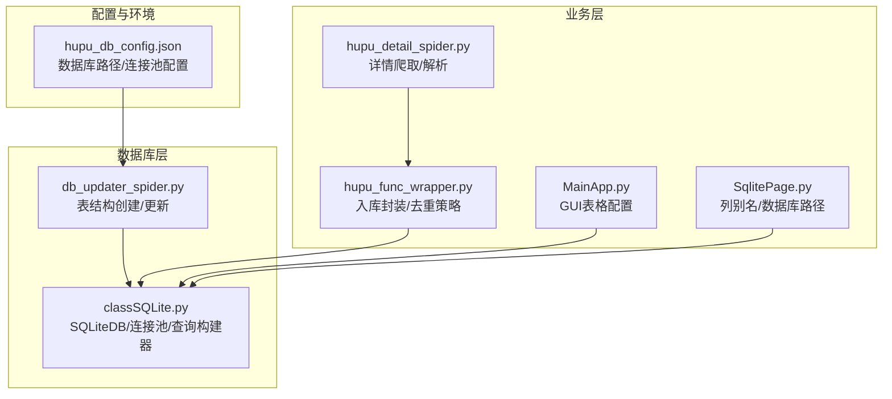
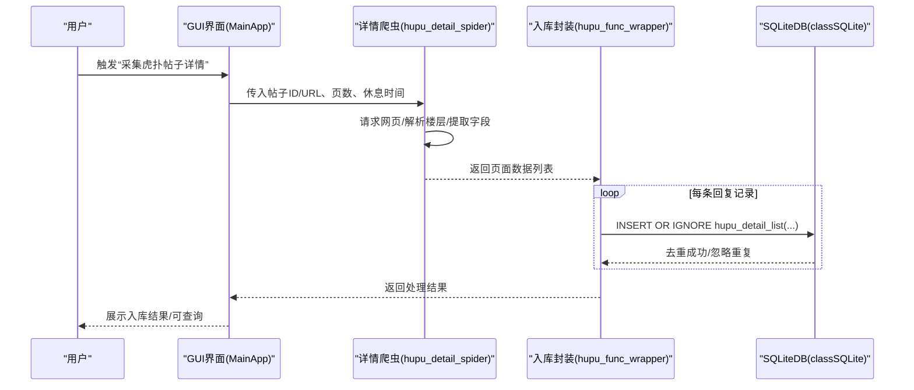
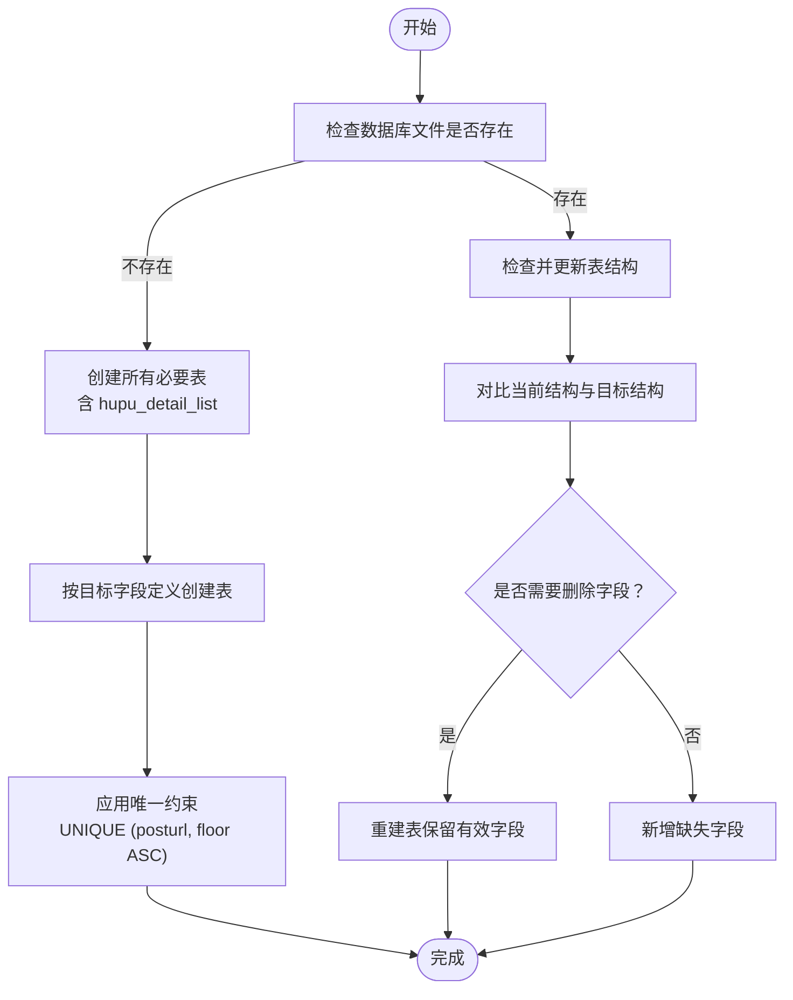
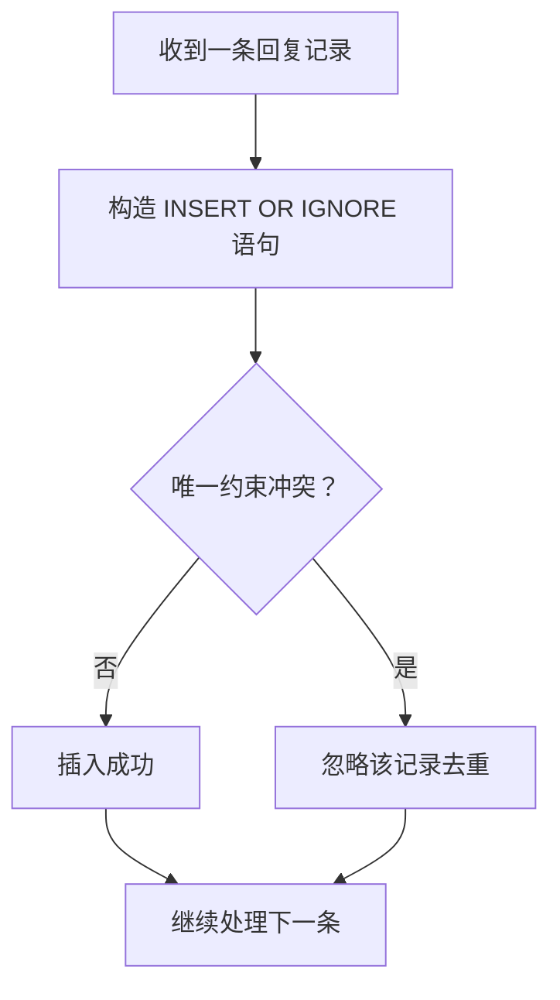
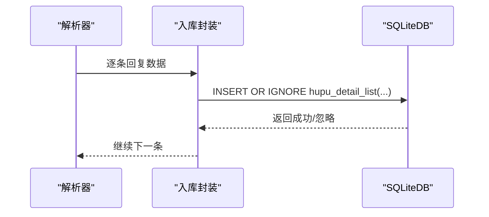
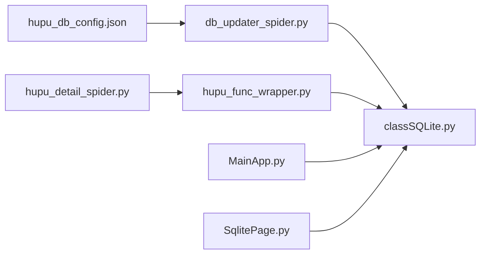

# 帖子详情表结构

<cite>
**本文档引用的文件**
- [hupu_db_config.json](file://配置文件_系统配置/hupu_db_config.json)
- [db_updater_spider.py](file://utils/db_updater_spider.py)
- [hupu_detail_spider.py](file://spider_modules/hupu_spiders/hupu_detail_spider.py)
- [hupu_func_wrapper.py](file://spider_modules/hupu_func_wrapper.py)
- [classSQLite.py](file://modules/classSQLite.py)
- [MainApp.py](file://gui/MainApp.py)
- [SqlitePage.py](file://gui/SqlitePage.py)
</cite>

## 目录
1. [简介](#简介)
2. [项目结构](#项目结构)
3. [核心组件](#核心组件)
4. [架构概览](#架构概览)
5. [详细组件分析](#详细组件分析)
6. [依赖关系分析](#依赖关系分析)
7. [性能考虑](#性能考虑)
8. [故障排查指南](#故障排查指南)
9. [结论](#结论)
10. [附录](#附录)

## 简介
本文件为虎扑论坛帖子详情表（hupu_detail_list）的数据库表结构与使用文档，旨在说明该表用于存储虎扑论坛帖子的详细内容与回复数据的设计目的、字段含义、数据类型、约束策略、查询示例与性能优化建议。重点解释复合唯一约束（posturl, floor）的设计原理与去重机制，并提供表结构创建流程、字段变更处理流程与数据完整性保障措施。

## 项目结构
围绕 hupu_detail_list 的关键文件与职责如下：
- 配置文件：提供虎扑数据库路径与连接池配置
- 数据库更新工具：负责表结构创建、变更与约束管理
- 爬虫模块：负责从虎扑网站抓取帖子详情并解析数据
- 数据入库封装：负责将解析后的数据写入数据库，含去重策略
- GUI 展示：提供表格展示与交互，包含字段别名映射
- SQLite 抽象层：提供统一的数据库操作接口与连接池

图表来源
- [hupu_db_config.json:1-18](file://配置文件_系统配置/hupu_db_config.json#L1-L18)
- [db_updater_spider.py:323-351](file://utils/db_updater_spider.py#L323-L351)
- [classSQLite.py:359-531](file://modules/classSQLite.py#L359-L531)
- [hupu_detail_spider.py:13-57](file://spider_modules/hupu_spiders/hupu_detail_spider.py#L13-L57)
- [hupu_func_wrapper.py:67-120](file://spider_modules/hupu_func_wrapper.py#L67-L120)
- [MainApp.py:835-878](file://gui/MainApp.py#L835-L878)
- [SqlitePage.py:2698-2705](file://gui/SqlitePage.py#L2698-L2705)

章节来源
- [hupu_db_config.json:1-18](file://配置文件_系统配置/hupu_db_config.json#L1-L18)
- [db_updater_spider.py:323-351](file://utils/db_updater_spider.py#L323-L351)
- [classSQLite.py:359-531](file://modules/classSQLite.py#L359-L531)
- [hupu_detail_spider.py:13-57](file://spider_modules/hupu_spiders/hupu_detail_spider.py#L13-L57)
- [hupu_func_wrapper.py:67-120](file://spider_modules/hupu_func_wrapper.py#L67-L120)
- [MainApp.py:835-878](file://gui/MainApp.py#L835-L878)
- [SqlitePage.py:2698-2705](file://gui/SqlitePage.py#L2698-L2705)

## 核心组件
- 表结构定义与约束
  - 主键：自增整数 id
  - 复合唯一约束：(posturl, floor)，确保同一帖子的每层回复唯一
  - 默认时间：addtime 默认为当前时间戳
- 字段说明（按创建脚本定义）
  - id：主键，自增整数
  - fabucontent：发布内容（文本），非空
  - nickname：昵称（文本）
  - replycontent：回复内容（文本）
  - floor：楼层（文本）
  - ipaddress：IP 地址（文本）
  - posttitle：帖子标题（文本）
  - like_count：点赞数（文本）
  - posturl：帖子链接（文本）
  - replytime：回复时间（文本）
  - addtime：添加时间（日期时间，默认当前时间）
  - reply_count：回复数（文本）
  - task_id：任务标识（文本）

章节来源
- [db_updater_spider.py:325-339](file://utils/db_updater_spider.py#L325-L339)
- [db_updater_spider.py:341-343](file://utils/db_updater_spider.py#L341-L343)

## 架构概览
下图展示了从爬取到入库再到展示的整体流程：

图表来源
- [hupu_detail_spider.py:59-226](file://spider_modules/hupu_spiders/hupu_detail_spider.py#L59-L226)
- [hupu_func_wrapper.py:67-120](file://spider_modules/hupu_func_wrapper.py#L67-L120)
- [classSQLite.py:532-566](file://modules/classSQLite.py#L532-L566)

## 详细组件分析

### 表结构创建与更新流程
- 初始化数据库：若数据库文件不存在则创建；若存在则检查并更新表结构
- 创建 hupu_detail_list：按目标字段定义创建表，并应用复合唯一约束
- 更新策略：支持新增字段、重建表（谨慎删除字段）、确保索引存在
- 约束管理：通过统一的 update_table_structure 函数维护唯一约束

图表来源
- [db_updater_spider.py:152-237](file://utils/db_updater_spider.py#L152-L237)
- [db_updater_spider.py:12-150](file://utils/db_updater_spider.py#L12-L150)
- [db_updater_spider.py:323-351](file://utils/db_updater_spider.py#L323-L351)

章节来源
- [db_updater_spider.py:12-150](file://utils/db_updater_spider.py#L12-L150)
- [db_updater_spider.py:152-237](file://utils/db_updater_spider.py#L152-L237)
- [db_updater_spider.py:323-351](file://utils/db_updater_spider.py#L323-L351)

### 字段与数据类型详解
- id：INTEGER NOT NULL PRIMARY KEY AUTOINCREMENT
- fabucontent：TEXT NOT NULL（发布内容，非空）
- nickname：TEXT（昵称）
- replycontent：TEXT（回复内容）
- floor：TEXT（楼层）
- ipaddress：TEXT（IP 地址）
- posttitle：TEXT（帖子标题）
- like_count：TEXT（点赞数）
- posturl：TEXT（帖子链接）
- replytime：TEXT（回复时间）
- addtime：DATETIME DEFAULT CURRENT_TIMESTAMP（添加时间）
- reply_count：TEXT（回复数）
- task_id：TEXT（任务标识）

章节来源
- [db_updater_spider.py:325-339](file://utils/db_updater_spider.py#L325-L339)

### 复合唯一约束设计与去重机制
- 设计目的：确保同一帖子（posturl）下的每层回复（floor）唯一，避免重复数据入库
- 去重策略：入库时使用 INSERT OR IGNORE，违反唯一约束的记录会被忽略
- 适用场景：爬取过程中可能因并发或重复触发导致相同楼层重复入库

图表来源
- [hupu_func_wrapper.py:89-106](file://spider_modules/hupu_func_wrapper.py#L89-L106)
- [db_updater_spider.py:341-343](file://utils/db_updater_spider.py#L341-L343)

章节来源
- [hupu_func_wrapper.py:89-106](file://spider_modules/hupu_func_wrapper.py#L89-L106)
- [db_updater_spider.py:341-343](file://utils/db_updater_spider.py#L341-L343)

### 数据入库封装与完整性保障
- 入库封装：process_hupu_detail_chunk 对每条记录进行入库处理
- 去重策略：INSERT OR IGNORE 避免重复
- 任务标识：将 main_task_id 写入 task_id，便于任务追踪与清理
- 错误处理：捕获数据库异常并记录警告，不影响整体流程

图表来源
- [hupu_detail_spider.py:13-57](file://spider_modules/hupu_spiders/hupu_detail_spider.py#L13-L57)
- [hupu_func_wrapper.py:67-120](file://spider_modules/hupu_func_wrapper.py#L67-L120)
- [classSQLite.py:532-566](file://modules/classSQLite.py#L532-L566)

章节来源
- [hupu_detail_spider.py:13-57](file://spider_modules/hupu_spiders/hupu_detail_spider.py#L13-L57)
- [hupu_func_wrapper.py:67-120](file://spider_modules/hupu_func_wrapper.py#L67-L120)
- [classSQLite.py:532-566](file://modules/classSQLite.py#L532-L566)

### GUI 展示与列别名
- GUI 中对 hupu_detail_list 的列别名进行了中文映射，便于用户理解
- 数据库路径在 GUI 中针对虎扑相关表做了特殊处理，确保正确连接 hupu.db

章节来源
- [MainApp.py:835-878](file://gui/MainApp.py#L835-L878)
- [SqlitePage.py:2698-2705](file://gui/SqlitePage.py#L2698-L2705)

## 依赖关系分析
- 配置依赖：hupu_db_config.json 提供数据库路径与连接池参数
- 结构依赖：db_updater_spider.py 负责表结构创建与更新
- 数据依赖：hupu_detail_spider.py 产出数据，hupu_func_wrapper.py 负责入库
- 展示依赖：MainApp.py 与 SqlitePage.py 依赖 SQLiteDB 进行查询与展示

图表来源
- [hupu_db_config.json:1-18](file://配置文件_系统配置/hupu_db_config.json#L1-L18)
- [db_updater_spider.py:323-351](file://utils/db_updater_spider.py#L323-L351)
- [classSQLite.py:359-531](file://modules/classSQLite.py#L359-L531)
- [hupu_detail_spider.py:59-226](file://spider_modules/hupu_spiders/hupu_detail_spider.py#L59-L226)
- [hupu_func_wrapper.py:67-120](file://spider_modules/hupu_func_wrapper.py#L67-L120)
- [MainApp.py:835-878](file://gui/MainApp.py#L835-L878)
- [SqlitePage.py:2698-2705](file://gui/SqlitePage.py#L2698-L2705)

章节来源
- [hupu_db_config.json:1-18](file://配置文件_系统配置/hupu_db_config.json#L1-L18)
- [db_updater_spider.py:323-351](file://utils/db_updater_spider.py#L323-L351)
- [classSQLite.py:359-531](file://modules/classSQLite.py#L359-L531)
- [hupu_detail_spider.py:59-226](file://spider_modules/hupu_spiders/hupu_detail_spider.py#L59-L226)
- [hupu_func_wrapper.py:67-120](file://spider_modules/hupu_func_wrapper.py#L67-L120)
- [MainApp.py:835-878](file://gui/MainApp.py#L835-L878)
- [SqlitePage.py:2698-2705](file://gui/SqlitePage.py#L2698-L2705)

## 性能考虑
- 连接池与 PRAGMA：通过 hupu_db_config.json 配置连接池、WAL 模式、缓存大小与同步级别，提升并发与写入性能
- 去重策略：INSERT OR IGNORE 在入库阶段减少重复写入，降低写放大
- 索引建议：当前表结构未显式创建索引，如需按 posturl 或 floor 高频查询，可在 posturl 上建立索引以加速过滤
- 批量写入：可考虑批量插入（insert_many）以减少事务开销（当前封装为逐条 INSERT OR IGNORE）

章节来源
- [hupu_db_config.json:1-18](file://配置文件_系统配置/hupu_db_config.json#L1-L18)
- [db_updater_spider.py:12-150](file://utils/db_updater_spider.py#L12-L150)
- [classSQLite.py:568-614](file://modules/classSQLite.py#L568-L614)

## 故障排查指南
- 重复数据问题
  - 现象：同楼层重复入库
  - 原因：未启用去重或唯一约束未生效
  - 处理：确认使用 INSERT OR IGNORE；检查复合唯一约束是否创建成功
- 字段缺失或类型不符
  - 现象：字段不存在或类型不匹配
  - 处理：运行数据库初始化/更新流程，确保 update_table_structure 生效
- 查询异常
  - 现象：查询结果为空或报错
  - 处理：检查表是否存在、字段名是否正确、是否需要增加索引
- GUI 展示异常
  - 现象：无法显示 hupu_detail_list 或列名不正确
  - 处理：确认 GUI 中数据库路径指向 hupu.db，列别名映射正确

章节来源
- [hupu_func_wrapper.py:89-106](file://spider_modules/hupu_func_wrapper.py#L89-L106)
- [db_updater_spider.py:12-150](file://utils/db_updater_spider.py#L12-L150)
- [MainApp.py:835-878](file://gui/MainApp.py#L835-L878)
- [SqlitePage.py:2698-2705](file://gui/SqlitePage.py#L2698-L2705)

## 结论
hupu_detail_list 表通过明确的字段定义、复合唯一约束与入库去重策略，实现了对虎扑帖子详情与回复数据的稳定存储。配合数据库初始化与更新工具、爬虫解析与入库封装、以及 GUI 展示，形成了完整的数据采集与可视化闭环。建议在高频查询场景下为 posturl 增加索引，并持续通过 update_table_structure 管理表结构演进。

## 附录

### 表结构创建 SQL（基于目标字段定义）
以下为创建 hupu_detail_list 的 SQL 语句（字段顺序与约束来自目标定义）：
- 主键：id（自增整数）
- 发布内容：fabucontent（文本，非空）
- 昵称：nickname（文本）
- 回复内容：replycontent（文本）
- 楼层：floor（文本）
- IP 地址：ipaddress（文本）
- 帖子标题：posttitle（文本）
- 点赞数：like_count（文本）
- 帖子链接：posturl（文本）
- 回复时间：replytime（文本）
- 添加时间：addtime（日期时间，默认当前时间）
- 回复数：reply_count（文本）
- 任务标识：task_id（文本）
- 复合唯一约束：UNIQUE (posturl, floor ASC)

章节来源
- [db_updater_spider.py:325-339](file://utils/db_updater_spider.py#L325-L339)
- [db_updater_spider.py:341-343](file://utils/db_updater_spider.py#L341-L343)

### 字段变更处理流程
- 新增字段：update_table_structure 会自动新增缺失字段
- 删除字段：检测到删除字段时会提示风险并可选择重建表（保留有效字段）
- 唯一约束：统一在 update_table_structure 中应用，确保一致性
- 索引管理：可传入索引 SQL 列表，确保索引存在

章节来源
- [db_updater_spider.py:12-150](file://utils/db_updater_spider.py#L12-L150)

### 数据完整性保证措施
- 复合唯一约束：(posturl, floor) 防止重复
- INSERT OR IGNORE：入库阶段去重
- 任务标识：task_id 便于任务追踪与清理
- 连接池与 WAL：提升并发与可靠性

章节来源
- [hupu_func_wrapper.py:89-106](file://spider_modules/hupu_func_wrapper.py#L89-L106)
- [hupu_db_config.json:1-18](file://配置文件_系统配置/hupu_db_config.json#L1-L18)

### 查询示例（基于字段别名与用途）
- 查询某帖子的所有回复（按楼层排序）
  - SELECT * FROM hupu_detail_list WHERE posturl = ? ORDER BY CAST(floor AS INTEGER)
- 统计某帖子的回复数
  - SELECT COUNT(*) FROM hupu_detail_list WHERE posturl = ?
- 查询某任务的所有帖子详情
  - SELECT DISTINCT posturl FROM hupu_detail_list WHERE task_id = ?

章节来源
- [MainApp.py:835-878](file://gui/MainApp.py#L835-L878)
- [SqlitePage.py:2673-2677](file://gui/SqlitePage.py#L2673-L2677)